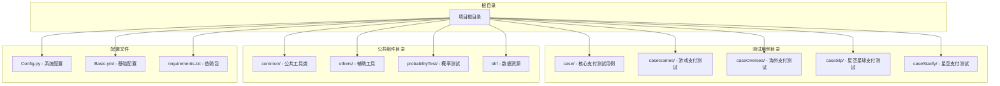
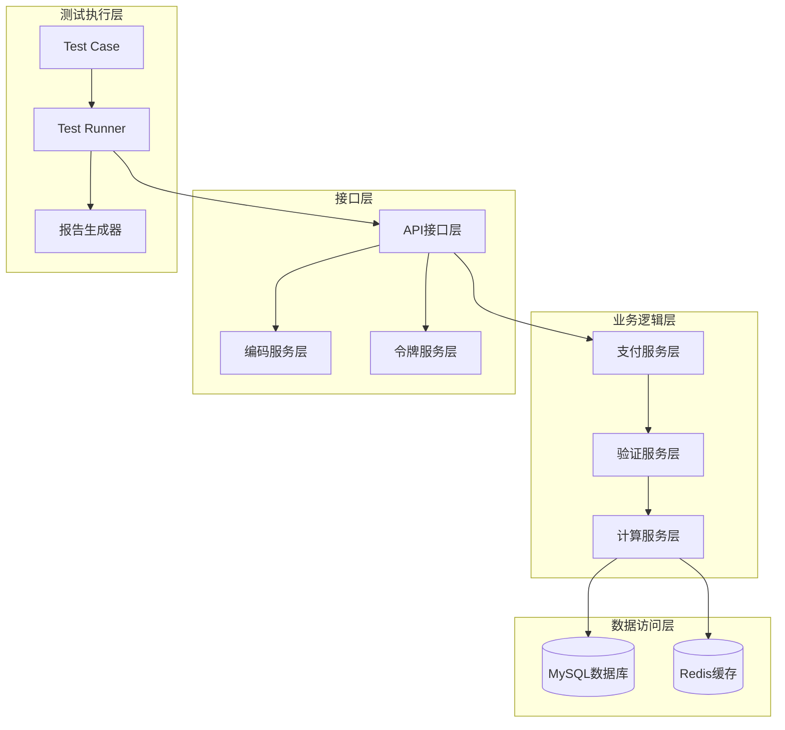
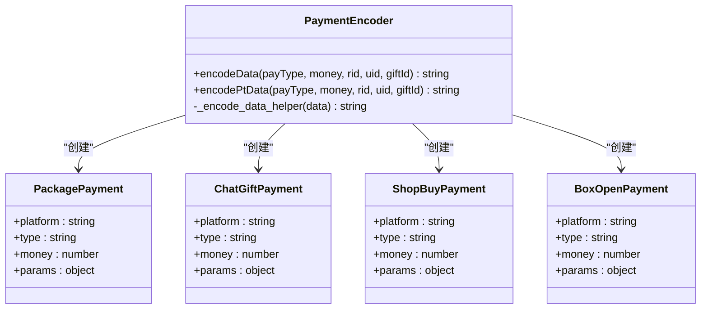
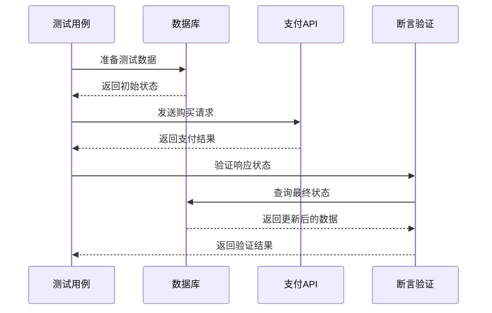
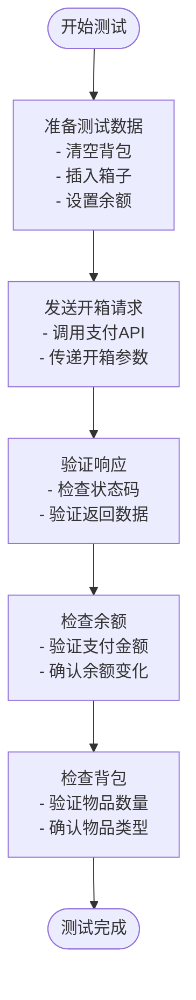
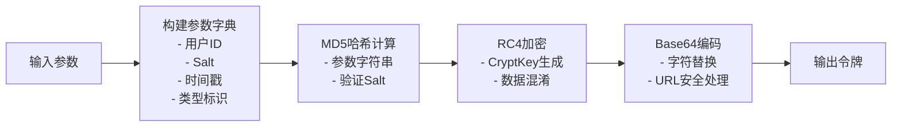
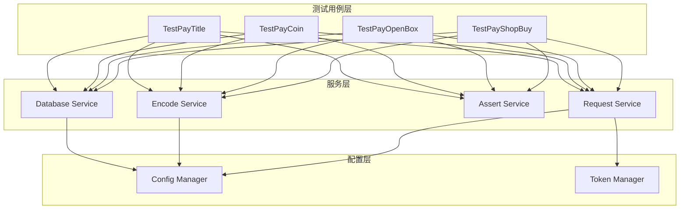
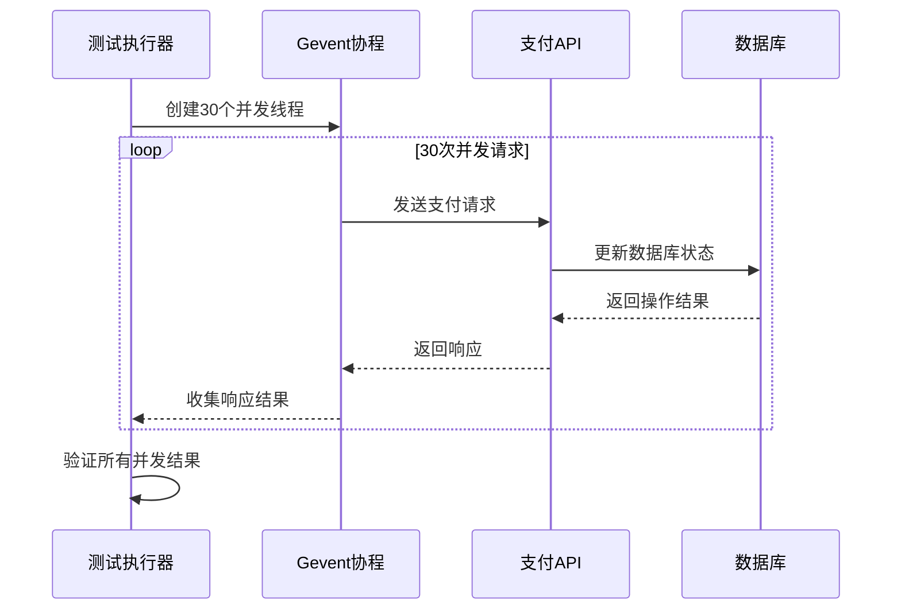
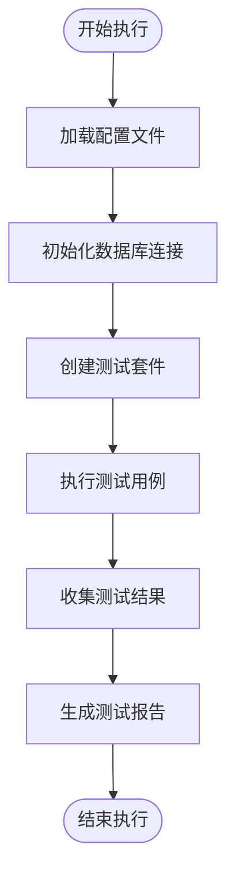

# BanBan平台支付测试技术文档

<cite>
**本文档引用的文件**
- [README.md](file://README.md)
- [Config.py](file://common/Config.py)
- [Request.py](file://common/Request.py)
- [basicData.py](file://common/basicData.py)
- [Assert.py](file://common/Assert.py)
- [conMysql.py](file://common/conMysql.py)
- [getToken.py](file://common/getToken.py)
- [run_all_case.py](file://run_all_case.py)
- [testPayConcurrent.py](file://testPayConcurrent.py)
- [test_pay_shopBuy.py](file://case/test_pay_shopBuy.py)
- [test_pay_openBox.py](file://case/test_pay_openBox.py)
- [test_pay_coin.py](file://case/test_pay_coin.py)
- [test_pay_unity.py](file://case/test_pay_unity.py)
- [test_pay_title.py](file://case/test_pay_title.py)
</cite>

## 目录
1. [简介](#简介)
2. [项目结构](#项目结构)
3. [核心组件](#核心组件)
4. [架构概览](#架构概览)
5. [详细组件分析](#详细组件分析)
6. [依赖关系分析](#依赖关系分析)
7. [性能考虑](#性能考虑)
8. [故障排除指南](#故障排除指南)
9. [结论](#结论)
10. [附录](#附录)

## 简介

BanBan平台支付测试系统是一个完整的自动化测试框架，专门用于验证BanBan平台及其海外版本（PT）的支付功能。该系统支持多种支付场景，包括金豆支付、金币支付、商城购买、盲盒开箱、爵位购买等核心业务场景。

系统采用分层架构设计，通过统一的配置管理、数据编码、请求处理和断言验证机制，确保支付测试的准确性和可靠性。测试覆盖了国内版（BB）和海外版（PT）两个主要平台，每个平台都有其特定的配置参数和认证机制。

## 项目结构

项目采用模块化组织结构，主要分为以下几个核心目录：

**图表来源**
- [README.md:1-38](file://README.md#L1-L38)
- [run_all_case.py:126-147](file://run_all_case.py#L126-L147)

**章节来源**
- [README.md:1-38](file://README.md#L1-L38)
- [run_all_case.py:126-147](file://run_all_case.py#L126-L147)

## 核心组件

### 支付配置管理器

系统的核心配置管理器提供了统一的支付接口地址、用户配置和房间配置管理。配置类支持多个平台的环境切换，包括开发环境、测试环境和生产环境。

### 请求处理引擎

封装了HTTP请求处理逻辑，支持GET、POST、PUT等多种请求方法。内置SSL证书验证禁用和超时处理机制，确保测试的稳定性。

### 数据编码器

实现了复杂的JSON数据编码逻辑，支持多种支付场景的数据格式转换。通过统一的编码接口，简化了不同支付场景的数据构造过程。

### 断言验证器

提供了丰富的断言方法，包括状态码验证、响应体验证、数值范围验证等。每个断言方法都包含了详细的错误信息收集和日志记录功能。

**章节来源**
- [Config.py:6-133](file://common/Config.py#L6-L133)
- [Request.py:17-59](file://common/Request.py#L17-L59)
- [basicData.py:8-581](file://common/basicData.py#L8-L581)
- [Assert.py:11-96](file://common/Assert.py#L11-L96)

## 架构概览

系统采用分层架构设计，从底层到上层依次为：数据访问层、业务逻辑层、接口层和测试执行层。

**图表来源**
- [conMysql.py:8-530](file://common/conMysql.py#L8-L530)
- [Request.py:17-59](file://common/Request.py#L17-L59)
- [basicData.py:569-571](file://common/basicData.py#L569-L571)

## 详细组件分析

### 支付场景编码器

支付场景编码器是系统的核心组件之一，负责将不同的支付场景转换为标准的URL编码格式。支持的支付场景包括：

#### 主要支付场景类型

1. **套餐支付（package）**：支持单人和多人场景，包含礼物赠送、房间打赏等功能
2. **聊天礼物支付（chat-gift）**：支持房间内礼物打赏功能
3. **商城购买（shop-buy）**：支持商城道具购买和批量购买
4. **盲盒开箱（shop-buy-box）**：支持不同类型盲盒的开箱功能
5. **金币兑换（exchange_gold）**：支持钻石与金币的兑换功能

**图表来源**
- [basicData.py:8-325](file://common/basicData.py#L8-L325)
- [basicData.py:327-566](file://common/basicData.py#L327-L566)

#### 编码流程详解

支付数据的编码过程遵循以下步骤：

1. **参数验证**：检查输入参数的有效性和完整性
2. **数据构建**：根据支付类型构建相应的数据结构
3. **JSON序列化**：将数据对象转换为JSON字符串
4. **URL编码**：对JSON字符串进行URL编码处理
5. **格式调整**：处理特殊字符和格式要求

**章节来源**
- [basicData.py:8-325](file://common/basicData.py#L8-L325)
- [basicData.py:327-566](file://common/basicData.py#L327-L566)

### 支付测试用例体系

系统实现了完整的支付测试用例体系，覆盖了主要的支付场景：

#### 商城购买测试用例

商城购买测试用例验证了用户在商城中购买道具的完整流程：

**图表来源**
- [test_pay_shopBuy.py:21-43](file://case/test_pay_shopBuy.py#L21-L43)
- [test_pay_shopBuy.py:45-68](file://case/test_pay_shopBuy.py#L45-L68)

#### 盲盒开箱测试用例

盲盒开箱测试用例验证了用户通过支付获得盲盒并开箱的过程：

**图表来源**
- [test_pay_openBox.py:15-44](file://case/test_pay_openBox.py#L15-L44)
- [test_pay_openBox.py:45-76](file://case/test_pay_openBox.py#L45-L76)

**章节来源**
- [test_pay_shopBuy.py:13-124](file://case/test_pay_shopBuy.py#L13-L124)
- [test_pay_openBox.py:12-124](file://case/test_pay_openBox.py#L12-L124)

### 认证机制与令牌管理

系统实现了灵活的认证机制，支持不同平台的令牌管理：

#### 令牌生成算法

令牌生成采用了RC4加密算法，结合MD5哈希和Base64编码：

**图表来源**
- [getToken.py:19-63](file://common/getToken.py#L19-L63)

#### 平台特定认证

不同平台采用了不同的认证策略：

- **国内版（BB）**：使用统一的用户令牌管理
- **海外版（PT）**：支持多区域认证和签名验证
- **星空版（Starify）**：特殊的令牌生成和验证机制

**章节来源**
- [getToken.py:8-93](file://common/getToken.py#L8-L93)
- [Config.py:95-130](file://common/Config.py#L95-L130)

## 依赖关系分析

系统各组件之间的依赖关系如下：

**图表来源**
- [test_pay_shopBuy.py:1-124](file://case/test_pay_shopBuy.py#L1-L124)
- [test_pay_openBox.py:1-124](file://case/test_pay_openBox.py#L1-L124)
- [test_pay_coin.py:1-63](file://case/test_pay_coin.py#L1-L63)
- [test_pay_title.py:1-33](file://case/test_pay_title.py#L1-L33)

**章节来源**
- [test_pay_shopBuy.py:1-124](file://case/test_pay_shopBuy.py#L1-L124)
- [test_pay_openBox.py:1-124](file://case/test_pay_openBox.py#L1-L124)
- [test_pay_coin.py:1-63](file://case/test_pay_coin.py#L1-L63)
- [test_pay_title.py:1-33](file://case/test_pay_title.py#L1-L33)

## 性能考虑

### 并发测试支持

系统提供了并发测试能力，通过gevent库实现高并发支付测试：

**图表来源**
- [testPayConcurrent.py:18-36](file://testPayConcurrent.py#L18-L36)

### 性能优化建议

1. **连接池管理**：合理配置数据库连接池大小，避免连接泄漏
2. **请求超时控制**：设置合理的请求超时时间，避免长时间阻塞
3. **并发度控制**：根据服务器性能调整并发数量，避免过载
4. **缓存策略**：利用Redis缓存热点数据，减少数据库压力
5. **日志优化**：合理控制日志级别，避免大量IO操作影响性能

**章节来源**
- [testPayConcurrent.py:9-47](file://testPayConcurrent.py#L9-L47)

## 故障排除指南

### 常见问题及解决方案

#### 支付接口调用失败

**问题现象**：支付请求返回错误状态码或超时

**可能原因**：
1. 网络连接不稳定
2. 服务器负载过高
3. 令牌过期或无效
4. 参数格式错误

**解决步骤**：
1. 检查网络连接状态
2. 验证服务器可用性
3. 刷新用户令牌
4. 校验请求参数格式

#### 数据库操作异常

**问题现象**：数据库查询或更新操作失败

**可能原因**：
1. 数据库连接中断
2. SQL语法错误
3. 权限不足
4. 数据约束冲突

**解决步骤**：
1. 重新建立数据库连接
2. 检查SQL语句正确性
3. 验证用户权限
4. 处理数据约束问题

#### 断言验证失败

**问题现象**：测试用例断言失败，但业务逻辑可能正确

**可能原因**：
1. 期望值计算错误
2. 数据同步延迟
3. 环境配置不一致
4. 测试数据污染

**解决步骤**：
1. 检查期望值计算逻辑
2. 增加数据同步等待时间
3. 验证测试环境配置
4. 清理测试数据

**章节来源**
- [Assert.py:11-96](file://common/Assert.py#L11-L96)
- [conMysql.py:27-204](file://common/conMysql.py#L27-L204)

## 结论

BanBan平台支付测试系统通过模块化设计和分层架构，成功实现了对多平台、多场景支付功能的全面测试覆盖。系统具有以下特点：

1. **全面性**：覆盖了金豆支付、金币支付、商城购买、盲盒开箱等核心支付场景
2. **灵活性**：支持国内版和海外版的不同配置和认证机制
3. **可靠性**：通过完善的断言验证和错误处理机制确保测试质量
4. **可扩展性**：模块化设计便于添加新的支付场景和平台支持

该系统为BanBan平台的支付功能提供了强有力的测试保障，有助于及时发现和解决问题，提升整体服务质量。

## 附录

### 测试用例执行流程

**图表来源**
- [run_all_case.py:12-159](file://run_all_case.py#L12-L159)

### 支持的支付场景列表

系统当前支持的主要支付场景包括：

1. **商城购买**：单个和批量道具购买
2. **盲盒开箱**：铜箱、银箱等不同类型开箱
3. **房间打赏**：礼物打赏和多人场景
4. **金币兑换**：钻石与金币互换
5. **爵位购买**：爵位开通和续费
6. **守护购买**：守护关系建立和升级

**章节来源**
- [run_all_case.py:126-147](file://run_all_case.py#L126-L147)
- [test_pay_shopBuy.py:13-124](file://case/test_pay_shopBuy.py#L13-L124)
- [test_pay_openBox.py:12-124](file://case/test_pay_openBox.py#L12-L124)
- [test_pay_coin.py:13-63](file://case/test_pay_coin.py#L13-L63)
- [test_pay_title.py:5-33](file://case/test_pay_title.py#L5-L33)