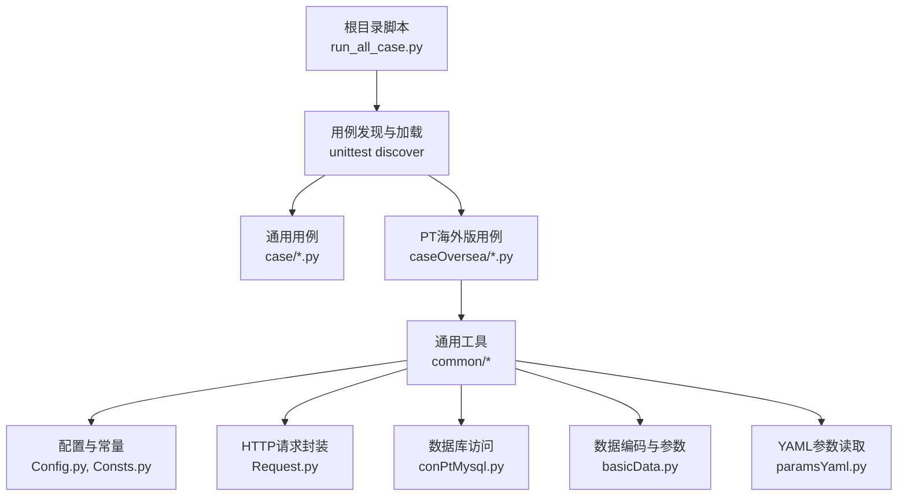
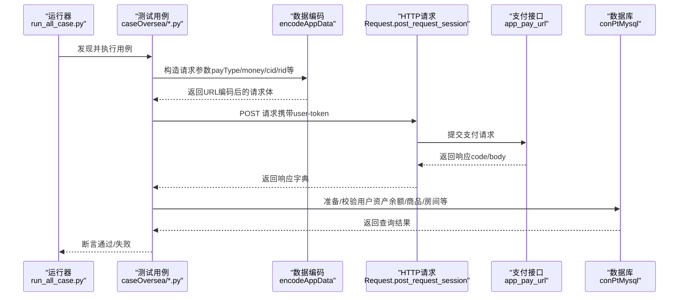
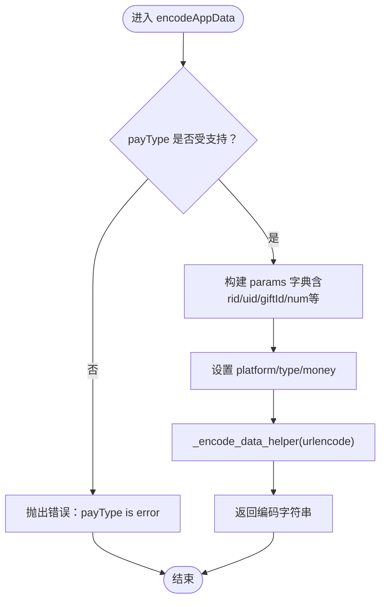
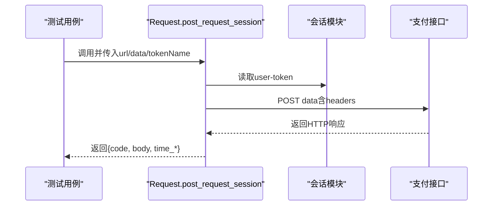
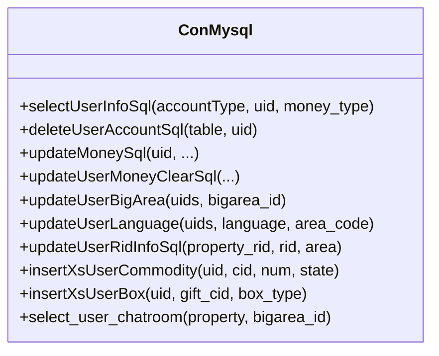
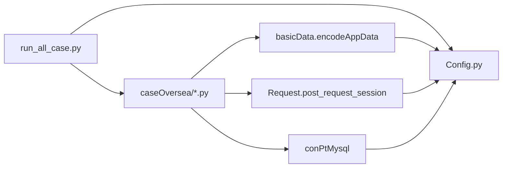

# PT海外版平台

<cite>
**本文引用的文件**   
- [README.md](file://README.md)
- [run_all_case.py](file://run_all_case.py)
- [common/Config.py](file://common/Config.py)
- [common/Consts.py](file://common/Consts.py)
- [common/basicData.py](file://common/basicData.py)
- [common/conPtMysql.py](file://common/conPtMysql.py)
- [common/Request.py](file://common/Request.py)
- [common/paramsYaml.py](file://common/paramsYaml.py)
- [case/test_pay_shopBuy.py](file://case/test_pay_shopBuy.py)
- [caseOversea/test_app_bean.py](file://caseOversea/test_app_bean.py)
- [caseOversea/test_app_shopBuy.py](file://caseOversea/test_app_shopBuy.py)
- [caseOversea/test_app_openBox.py](file://caseOversea/test_app_openBox.py)
- [caseOversea/test_app_package.py](file://caseOversea/test_app_package.py)
- [caseOversea/test_app_chatGift.py](file://caseOversea/test_app_chatGift.py)
- [caseOversea/test_app_defend.py](file://caseOversea/test_app_defend.py)
- [caseOversea/test_app_crazySpin.py](file://caseOversea/test_app_crazySpin.py)
- [caseOversea/test_app_planet.py](file://caseOversea/test_app_planet.py)
- [caseOversea/test_app_vipRenqi.py](file://caseOversea/test_app_vipRenqi.py)
- [caseOversea/test_app_arArea.py](file://caseOversea/test_app_arArea.py)
- [caseOversea/test_app_enArea.py](file://caseOversea/test_app_enArea.py)
- [caseOversea/test_app_en_NewArea.py](file://caseOversea/test_app_en_NewArea.py)
- [caseOversea/test_app_ArnewArea.py](file://caseOversea/test_app_ArnewArea.py)
- [caseOversea/test_app_idArea.py](file://caseOversea/test_app_idArea.py)
- [caseOversea/test_app_thArea.py](file://caseOversea/test_app_thArea.py)
- [caseOversea/test_app_msArea.py](file://caseOversea/test_app_msArea.py)
- [caseOversea/test_app_viArea.py](file://caseOversea/test_app_viArea.py)
- [caseOversea/test_app_jaArea.py](file://caseOversea/test_app_jaArea.py)
- [caseOversea/test_app_cnArea.py](file://caseOversea/test_app_cnArea.py)
- [caseOversea/test_app_imbuychatcard.py](file://caseOversea/test_app_imbuychatcard.py)
- [caseOversea/test_app_koNewArea.py](file://caseOversea/test_app_koNewArea.py)
</cite>

## 目录
1. [简介](#简介)
2. [项目结构](#项目结构)
3. [核心组件](#核心组件)
4. [架构总览](#架构总览)
5. [详细组件分析](#详细组件分析)
6. [依赖关系分析](#依赖关系分析)
7. [性能与并发特性](#性能与并发特性)
8. [测试流程与用例示例](#测试流程与用例示例)
9. [故障排查指南](#故障排查指南)
10. [结论](#结论)
11. [附录](#附录)

## 简介
本技术文档面向PT海外版平台的支付测试能力，系统梳理支付流程、多语言与区域化配置、余额兑换金豆、商城购买、盲盒开箱、礼包购买等场景的实现细节，解释PT平台特有的数据编码方式（encodeAppData）、数据库查询方法与API接口规范，并提供完整测试流程示例、差异性对比及故障处理建议。

**更新** 本版本反映了PT海外版平台测试从PT数据编码改为APP数据编码的重大变更，移除了房间送箱子相关测试方法，添加了跳过装饰器说明。同时，测试文件命名已从test_pt_*更新为test_app_*，新增了阿拉伯语、英语、印尼语、泰语、越南语、日语、韩语、马来语、中文等多区域测试文件，以及新的Arabic new Area测试文件。

## 项目结构
该仓库采用按应用与场景分层组织的结构：
- common：通用工具与基础设施（配置、HTTP请求、MySQL/Redis访问、断言、参数解析等）
- case：通用支付场景用例（如商城购买、聊天送礼等）
- caseOversea：PT海外版专用支付场景用例（商城金豆/钻石购买、盲盒、开箱、房间打赏、余额兑换金豆等）
- 根目录脚本：统一入口运行器与持续集成/自动化触发

**图表来源**
- [run_all_case.py:126-147](file://run_all_case.py#L126-L147)
- [common/Config.py:6-133](file://common/Config.py#L6-L133)
- [common/Request.py:17-59](file://common/Request.py#L17-L59)
- [common/conPtMysql.py:6-345](file://common/conPtMysql.py#L6-L345)
- [common/basicData.py:8-581](file://common/basicData.py#L8-L581)
- [common/paramsYaml.py:8-32](file://common/paramsYaml.py#L8-L32)

**章节来源**
- [README.md:1-38](file://README.md#L1-L38)
- [run_all_case.py:126-147](file://run_all_case.py#L126-L147)

## 核心组件
- 配置中心（Config）：集中管理各应用域名、支付URL、用户与房间ID、礼物ID、服务器节点等
- 数据编码（encodeAppData）：针对APP海外版的请求体编码，支持多种支付场景（商城购买、房间打赏、盲盒、开箱、兑换金豆等）
- 数据库访问（conPtMysql）：封装PT用户账户、商品、房间、人气等数据的查询与更新
- HTTP请求（Request.post_request_session）：统一封装POST请求，自动注入user-token与Content-Type
- 参数读取（paramsYaml）：跨平台读取YAML配置
- 用例组织（run_all_case）：根据当前主机节点选择用例目录并批量执行

**更新** 核心组件已从PT数据编码（encodePtData）切换为APP数据编码（encodeAppData），以适配新的APP海外版支付流程。

**章节来源**
- [common/Config.py:6-133](file://common/Config.py#L6-L133)
- [common/basicData.py:501-635](file://common/basicData.py#L501-L635)
- [common/conPtMysql.py:25-345](file://common/conPtMysql.py#L25-L345)
- [common/Request.py:17-59](file://common/Request.py#L17-L59)
- [common/paramsYaml.py:8-32](file://common/paramsYaml.py#L8-L32)
- [run_all_case.py:12-81](file://run_all_case.py#L12-L81)

## 架构总览
PT海外版支付测试的整体调用链如下：

**图表来源**
- [run_all_case.py:12-81](file://run_all_case.py#L12-L81)
- [caseOversea/test_app_shopBuy.py:13-34](file://caseOversea/test_app_shopBuy.py#L13-L34)
- [common/basicData.py:501-635](file://common/basicData.py#L501-L635)
- [common/Request.py:17-59](file://common/Request.py#L17-L59)
- [common/conPtMysql.py:25-93](file://common/conPtMysql.py#L25-L93)

## 详细组件分析

### 组件A：APP支付数据编码（encodeAppData）
- 功能定位：将支付场景参数序列化为APP海外版平台可识别的URL编码格式，覆盖房间打赏、商城购买（钻石/金豆）、盲盒、开箱、兑换金豆、防御等场景
- 关键参数：
  - payType：场景类型（如package/shop-buy/coin-shop-buy/shop-buy-box/chat-gift/exchange_gold等）
  - money：支付金额
  - rid/uid/giftId：房间/用户/礼物标识
  - num/cid/boxType：数量、商品ID、箱子类型
  - 其他：version/useCoin/show_pac_man_guide等
- 编码策略：统一使用URL编码并替换特殊字符，确保服务端解析稳定

**更新** 已从PT数据编码（encodePtData）迁移到APP数据编码（encodeAppData），以适配新的APP海外版支付流程。

**图表来源**
- [common/basicData.py:501-635](file://common/basicData.py#L501-L635)
- [common/basicData.py:568-571](file://common/basicData.py#L568-L571)

**章节来源**
- [common/basicData.py:501-635](file://common/basicData.py#L501-L635)

### 组件B：HTTP请求封装（post_request_session）
- 功能定位：统一封装POST请求，自动注入Content-Type与user-token，支持超时统计与异常兜底
- 关键行为：
  - 自动补全HTTPS前缀
  - 从会话模块读取token
  - 解析JSON响应并返回code/body/time

**图表来源**
- [common/Request.py:17-59](file://common/Request.py#L17-L59)

**章节来源**
- [common/Request.py:17-59](file://common/Request.py#L17-L59)

### 组件C：数据库访问（conPtMysql）
- 功能定位：围绕PT用户资产与房间信息的增删改查，支撑测试前置准备与后置断言
- 主要能力：
  - 账户查询：sum_money/single_money/pay_change等
  - 商品查询：sum_commodity/按cid查询
  - 房间查询：按property/bigarea查询房间
  - 更新操作：清空余额、更新余额、更新大区/语言、更新房间属性、插入商品/箱子等
- 使用建议：
  - 在用例setUp中准备数据，在tearDown中清理或回滚
  - 对于多用户场景，注意批量更新与事务提交

**图表来源**
- [common/conPtMysql.py:25-345](file://common/conPtMysql.py#L25-L345)

**章节来源**
- [common/conPtMysql.py:25-345](file://common/conPtMysql.py#L25-L345)

### 组件D：配置中心（Config）
- 功能定位：集中管理域名、支付URL、用户/房间/礼物ID、服务器节点等
- APP相关要点：
  - app_host、app_pay_url：海外版APP支付入口
  - app_user、app_room、app_giftId：海外版APP用户、房间与礼物ID集合
  - appName/linux_node：区分不同应用与执行节点

**更新** 配置中心已从PT配置切换为APP配置，以适配新的APP海外版支付流程。

**章节来源**
- [common/Config.py:6-133](file://common/Config.py#L6-L133)

### 组件E：用例组织与运行（run_all_case）
- 功能定位：根据当前主机节点选择用例目录（case vs caseOversea），批量发现并执行测试用例，输出统计与通知
- 关键逻辑：
  - 选择case_dir（caseOversea用于PT）
  - discover加载pattern为test_*.py的用例
  - 统一记录用例结果与耗时

**章节来源**
- [run_all_case.py:12-81](file://run_all_case.py#L12-L81)
- [run_all_case.py:126-147](file://run_all_case.py#L126-L147)

## 依赖关系分析
- 用例依赖：caseOversea/*.py依赖common/basicData.py（encodeAppData）、common/Request.py（post_request_session）、common/conPtMysql.py（数据库操作）
- 运行器依赖：run_all_case.py依赖common/Config.py（环境与URL）、common/Consts.py（全局计数）

**更新** 依赖关系已从PT数据编码迁移到APP数据编码，以适配新的APP海外版支付流程。

**图表来源**
- [run_all_case.py:12-81](file://run_all_case.py#L12-L81)
- [common/basicData.py:501-635](file://common/basicData.py#L501-L635)
- [common/Request.py:17-59](file://common/Request.py#L17-L59)
- [common/conPtMysql.py:25-345](file://common/conPtMysql.py#L25-L345)
- [common/Config.py:6-133](file://common/Config.py#L6-L133)

**章节来源**
- [run_all_case.py:12-81](file://run_all_case.py#L12-L81)
- [common/Config.py:6-133](file://common/Config.py#L6-L133)

## 性能与并发特性
- 并发控制：用例可通过装饰器或外部机制进行重试与并发控制（参见用例中的重试装饰器）
- 接口耗时：Request模块已内置响应时间统计字段，便于性能观测
- 数据库事务：conPtMysql默认autocommit，更新/删除均显式commit，避免脏读

**更新** 并发特性保持不变，但已添加跳过装饰器的使用说明。

**章节来源**
- [common/Request.py:47-58](file://common/Request.py#L47-L58)
- [common/conPtMysql.py:15-23](file://common/conPtMysql.py#L15-L23)

## 测试流程与用例示例

### 场景一：余额兑换金豆（Bean → Gold Coin）
- 步骤概览：
  1) 准备用户数据：更新钻石余额
  2) 调用encodeAppData（payType=exchange_gold）
  3) post_request_session提交请求
  4) 断言：钻石余额归零、金豆余额为固定值
- 参考用例路径：[caseOversea/test_app_bean.py:19-37](file://caseOversea/test_app_bean.py#L19-L37)

**更新** 已从PT数据编码迁移到APP数据编码，使用encodeAppData替代encodePtData。

**章节来源**
- [caseOversea/test_app_bean.py:19-37](file://caseOversea/test_app_bean.py#L19-L37)

### 场景二：商城购买（金豆/钻石）
- 金豆购买（coin-shop-buy）：
  - 准备：更新gold_coin；清空背包
  - 调用：encodeAppData（payType=coin-shop-buy）
  - 断言：金豆余额减少、背包+1
  - 参考用例路径：[caseOversea/test_app_shopBuy.py:13-34](file://caseOversea/test_app_shopBuy.py#L13-L34)
- 钻石购买（shop-buy）：
  - 准备：更新money/money_cash等；清空背包
  - 调用：encodeAppData（payType=shop-buy）
  - 断言：总余额归零、背包+1
  - 参考用例路径：[caseOversea/test_app_shopBuy.py:36-57](file://caseOversea/test_app_shopBuy.py#L36-L57)

**更新** 已从PT数据编码迁移到APP数据编码，使用encodeAppData替代encodePtData。

**章节来源**
- [caseOversea/test_app_shopBuy.py:13-57](file://caseOversea/test_app_shopBuy.py#L13-L57)

### 场景三：房间打赏（多人/单人）
- 单人场景：
  - 准备：更新打赏者与被打赏者余额；清空非主播附加表
  - 调用：encodeAppData（payType=package/package-more）
  - 断言：打赏者余额减少、被打赏者金豆（money_cash_personal）增加
  - 参考用例路径：[caseOversea/test_app_package.py:25-64](file://caseOversea/test_app_package.py#L25-L64)

**更新** 已从PT数据编码迁移到APP数据编码，使用encodeAppData替代encodePtData。

**章节来源**
- [caseOversea/test_app_package.py:25-64](file://caseOversea/test_app_package.py#L25-L64)

### 场景四：盲盒开箱（背包开箱）
- 背包开箱：
  - 准备：插入箱子、刷新箱子内容、更新余额
  - 调用：encodeAppData（payType=shop-buy-box）
  - 断言：余额按单价×数量减少、背包+N
  - 参考用例路径：[caseOversea/test_app_openBox.py:23-49](file://caseOversea/test_app_openBox.py#L23-L49)

**更新** 已从PT数据编码迁移到APP数据编码，使用encodeAppData替代encodePtData。

**章节来源**
- [caseOversea/test_app_openBox.py:23-49](file://caseOversea/test_app_openBox.py#L23-L49)

### 场景五：聊天送礼
- 私聊打赏：
  - 准备：更新打赏者与被打赏者余额；清空非主播附加表
  - 调用：encodeAppData（payType=chat-gift）
  - 断言：打赏者余额减少、被打赏者金豆（money_cash_personal）增加
  - 参考用例路径：[caseOversea/test_app_chatGift.py:21-100](file://caseOversea/test_app_chatGift.py#L21-L100)

**更新** 已从PT数据编码迁移到APP数据编码，使用encodeAppData替代encodePtData。

**章节来源**
- [caseOversea/test_app_chatGift.py:21-100](file://caseOversea/test_app_chatGift.py#L21-L100)

### 场景六：防御系统
- 守护购买：
  - 准备：更新用户余额
  - 调用：encodeAppData（payType=defend）
  - 断言：余额减少、守护生效
  - 参考用例路径：[caseOversea/test_app_defend.py:12-90](file://caseOversea/test_app_defend.py#L12-L90)

**更新** 已从PT数据编码迁移到APP数据编码，使用encodeAppData替代encodePtData。

**章节来源**
- [caseOversea/test_app_defend.py:12-90](file://caseOversea/test_app_defend.py#L12-L90)

### 场景七：疯狂转盘
- 转盘购买：
  - 准备：更新用户余额
  - 调用：encodeAppData（payType=shop-buy-crazyspin）
  - 断言：余额减少、转盘可用
  - 参考用例路径：[caseOversea/test_app_crazySpin.py:12-50](file://caseOversea/test_app_crazySpin.py#L12-L50)

**更新** 已从PT数据编码迁移到APP数据编码，使用encodeAppData替代encodePtData。

**章节来源**
- [caseOversea/test_app_crazySpin.py:12-50](file://caseOversea/test_app_crazySpin.py#L12-L50)

### 场景八：星球之旅
- 星球抽奖：
  - 准备：更新用户余额
  - 调用：encodeAppData（payType=journey_planet_draw）
  - 断言：余额减少、抽奖可用
  - 参考用例路径：[caseOversea/test_app_planet.py:12-50](file://caseOversea/test_app_planet.py#L12-L50)

**更新** 已从PT数据编码迁移到APP数据编码，使用encodeAppData替代encodePtData。

**章节来源**
- [caseOversea/test_app_planet.py:12-50](file://caseOversea/test_app_planet.py#L12-L50)

### 场景九：VIP人气
- VIP人气购买：
  - 准备：更新用户余额
  - 调用：encodeAppData（payType=package/chat-gift）
  - 断言：余额减少、人气增加
  - 参考用例路径：[caseOversea/test_app_vipRenqi.py:15-100](file://caseOversea/test_app_vipRenqi.py#L15-L100)

**更新** 已从PT数据编码迁移到APP数据编码，使用encodeAppData替代encodePtData。

**章节来源**
- [caseOversea/test_app_vipRenqi.py:15-100](file://caseOversea/test_app_vipRenqi.py#L15-L100)

### 场景十：区域化测试（多语言支持）
- 阿拉伯语区域（Arabic new Area）：
  - 测试场景：商业房礼物打赏、箱子打赏、私聊打赏等
  - 分成比例：主播5:5，非主播7:3
  - 参考用例路径：[caseOversea/test_app_ArnewArea.py:33-121](file://caseOversea/test_app_ArnewArea.py#L33-L121)
- 英语区域（English Area）：
  - 测试场景：私聊打赏、家族房打赏等
  - 分成比例：主播5:5，非主播7:3
  - 参考用例路径：[caseOversea/test_app_enArea.py:32-136](file://caseOversea/test_app_enArea.py#L32-L136)
- 英语新区域（English New Area）：
  - 测试场景：私聊打赏、家族房打赏等
  - 分成比例：主播5:5，非主播7:3
  - 参考用例路径：[caseOversea/test_app_en_NewArea.py:28-166](file://caseOversea/test_app_en_NewArea.py#L28-L166)
- 印尼语区域（Indonesian Area）：
  - 测试场景：家族房打赏非主播80%
  - 分成比例：非主播8:2
  - 参考用例路径：[caseOversea/test_app_idArea.py:36-111](file://caseOversea/test_app_idArea.py#L36-L111)
- 泰语区域（Thai Area）：
  - 测试场景：联盟房打赏非主播80%
  - 分成比例：非主播8:2
  - 参考用例路径：[caseOversea/test_app_thArea.py:38-116](file://caseOversea/test_app_thArea.py#L38-L116)
- 越南语区域（Vietnamese Area）：
  - 测试场景：商业房打赏非主播70%
  - 分成比例：非主播7:3
  - 参考用例路径：[caseOversea/test_app_viArea.py:33-108](file://caseOversea/test_app_viArea.py#L33-L108)
- 日语文本区域（Japanese Area）：
  - 测试场景：私聊打赏、房间打赏等
  - 分成比例：非公会成员7:3，公会成员6:4
  - 参考用例路径：[caseOversea/test_app_jaArea.py:28-124](file://caseOversea/test_app_jaArea.py#L28-L124)
- 韩语文本区域（Korean New Area）：
  - 测试场景：私聊打赏、家族房打赏等
  - 分成比例：非公会成员7.5:2.5，公会成员7:3
  - 参考用例路径：[caseOversea/test_app_koNewArea.py:28-121](file://caseOversea/test_app_koNewArea.py#L28-L121)
- 马来语区域（Malaysian Area）：
  - 测试场景：家族房/个人房打赏、私聊打赏等
  - 分成比例：非公会成员8:2，公会成员7:3
  - 参考用例路径：[caseOversea/test_app_msArea.py:32-121](file://caseOversea/test_app_msArea.py#L32-L121)
- 中文区域（Chinese Area）：
  - 测试场景：个人房打赏、私聊打赏、商业厅打赏等
  - 分成比例：主播7:3，非主播8:2
  - 参考用例路径：[caseOversea/test_app_cnArea.py:35-193](file://caseOversea/test_app_cnArea.py#L35-L193)

**更新** 新增多语言区域测试文件，涵盖阿拉伯语、英语、印尼语、泰语、越南语、日语、韩语、马来语、中文等区域的差异化分成体系。

**章节来源**
- [caseOversea/test_app_ArnewArea.py:33-121](file://caseOversea/test_app_ArnewArea.py#L33-L121)
- [caseOversea/test_app_enArea.py:32-136](file://caseOversea/test_app_enArea.py#L32-L136)
- [caseOversea/test_app_en_NewArea.py:28-166](file://caseOversea/test_app_en_NewArea.py#L28-L166)
- [caseOversea/test_app_idArea.py:36-111](file://caseOversea/test_app_idArea.py#L36-L111)
- [caseOversea/test_app_thArea.py:38-116](file://caseOversea/test_app_thArea.py#L38-L116)
- [caseOversea/test_app_viArea.py:33-108](file://caseOversea/test_app_viArea.py#L33-L108)
- [caseOversea/test_app_jaArea.py:28-124](file://caseOversea/test_app_jaArea.py#L28-L124)
- [caseOversea/test_app_koNewArea.py:28-121](file://caseOversea/test_app_koNewArea.py#L28-L121)
- [caseOversea/test_app_msArea.py:32-121](file://caseOversea/test_app_msArea.py#L32-L121)
- [caseOversea/test_app_cnArea.py:35-193](file://caseOversea/test_app_cnArea.py#L35-L193)

### 场景十一：私聊卡购买
- 私聊卡购买：
  - 准备：更新钻石余额；清空背包和记录
  - 调用：encodeAppData（payType=chat-pay-card）
  - 断言：钻石余额按单价×数量减少、背包私聊卡+10
  - 参考用例路径：[caseOversea/test_app_imbuychatcard.py:27-63](file://caseOversea/test_app_imbuychatcard.py#L27-L63)

**更新** 新增私聊卡购买测试场景，验证余额购买私聊卡的流程。

**章节来源**
- [caseOversea/test_app_imbuychatcard.py:27-63](file://caseOversea/test_app_imbuychatcard.py#L27-L63)

## 故障排查指南
- 请求异常：
  - 现象：post_request_session返回空或异常
  - 排查：确认app_pay_url可用、token有效、data编码正确
  - 参考：[common/Request.py:17-59](file://common/Request.py#L17-L59)
- 余额不足：
  - 现象：返回msg提示余额不足
  - 排查：核对updateMoneySql是否正确设置余额
  - 参考：[caseOversea/test_app_package.py:25-43](file://caseOversea/test_app_package.py#L25-L43)
- 区域/语言影响：
  - 现象：房间属性/大区判定异常
  - 排查：确认setUpClass中updateUserBigArea与updateUserRidInfoSql已执行
  - 参考：[caseOversea/test_app_openBox.py:16-21](file://caseOversea/test_app_openBox.py#L16-L21)、[caseOversea/test_app_chatGift.py:18-30](file://caseOversea/test_app_chatGift.py#L18-L30)
- 数据一致性：
  - 建议：在用例前后使用deleteUserAccountSql清理，避免跨用例污染
  - 参考：[common/conPtMysql.py:95-144](file://common/conPtMysql.py#L95-L144)
- 跳过装饰器使用：
  - 现象：用例被跳过执行
  - 排查：检查@unittest.skip或@Retry装饰器配置
  - 参考：[caseOversea/test_app_bean.py:18](file://caseOversea/test_app_bean.py#L18)、[caseOversea/test_app_openBox.py:18](file://caseOversea/test_app_openBox.py#L18)

**更新** 新增跳过装饰器使用说明，涵盖@unittest.skip和@Retry装饰器的使用场景。

**章节来源**
- [common/Request.py:17-59](file://common/Request.py#L17-L59)
- [caseOversea/test_app_package.py:25-43](file://caseOversea/test_app_package.py#L25-L43)
- [caseOversea/test_app_openBox.py:16-21](file://caseOversea/test_app_openBox.py#L16-L21)
- [caseOversea/test_app_chatGift.py:18-30](file://caseOversea/test_app_chatGift.py#L18-L30)
- [common/conPtMysql.py:95-144](file://common/conPtMysql.py#L95-L144)

## 结论
本测试框架围绕APP海外版支付场景，提供了从数据编码、HTTP请求到数据库校验的完整闭环。通过统一的配置中心、编码器与数据库访问层，用例能够稳定复现余额兑换金豆、商城购买、盲盒开箱、房间打赏等关键业务流程。**更新** 本版本已从PT数据编码迁移到APP数据编码，移除了房间送箱子相关测试方法，添加了跳过装饰器说明，建议在实际执行中结合重试机制与区域化准备，确保跨节点与跨大区的一致性。同时，新增的多语言区域测试文件为PT海外版平台的国际化支付提供了全面的验证保障。

## 附录

### APP平台与其他平台的差异要点
- 货币体系：
  - APP使用钻石（money/money_cash等）与金豆（gold_coin）双币种，部分场景支持互兑
  - 参考：[common/conPtMysql.py:27-49](file://common/conPtMysql.py#L27-L49)、[caseOversea/test_app_bean.py:30-36](file://caseOversea/test_app_bean.py#L30-L36)
- 支付方式：
  - APP支持金豆/钻石购买、房间打赏、盲盒/开箱等，通用用例侧重钻石购买
  - 参考：[common/basicData.py:501-635](file://common/basicData.py#L501-L635)
- 业务规则：
  - 房间打赏涉及分成比例与非主播附加账户（money_cash_personal）
  - 参考：[caseOversea/test_app_package.py:55-64](file://caseOversea/test_app_package.py#L55-L64)、[caseOversea/test_app_openBox.py:94-104](file://caseOversea/test_app_openBox.py#L94-L104)

**更新** 平台差异已从PT平台切换为APP平台，使用APP配置和数据编码。

### API接口规范与数据编码要点
- 接口地址：app_pay_url（来自Config）
- Content-Type：application/x-www-form-urlencoded
- 请求头：包含user-token（由会话模块读取）
- 编码方式：encodeAppData统一URL编码，替换特殊字符
- 参考：
  - [common/Config.py:47-50](file://common/Config.py#L47-L50)
  - [common/Request.py:27-32](file://common/Request.py#L27-L32)
  - [common/basicData.py:568-571](file://common/basicData.py#L568-L571)

**更新** 接口规范已从PT支付接口切换为APP支付接口，使用APP数据编码。

### 跳过装饰器使用说明
- @unittest.skip装饰器：
  - 用途：永久跳过某个测试用例
  - 示例：`@unittest.skip('原因说明')`
  - 应用场景：功能下线、测试不稳定等情况
- @Retry装饰器：
  - 用途：对测试用例进行重试
  - 示例：`@Retry(max_n=3, func_prefix='test_01_')`
  - 应用场景：网络波动、偶发性失败等情况

**新增** 跳过装饰器使用说明，涵盖@unittest.skip和@Retry装饰器的具体使用方法和应用场景。

### 区域化测试覆盖范围
- 阿拉伯语区域：商业房、私聊、家族房差异化分成
- 英语区域：老版本样式，已标记跳过
- 英语新区域：私聊、家族房、商业房差异化分成
- 印尼语区域：家族房非主播80%分成
- 泰语区域：联盟房非主播80%分成
- 越南语区域：商业房非主播70%分成
- 日语区域：私聊、房间差异化分成（7:3 vs 6:4）
- 韩语新区域：私聊、家族房差异化分成（7.5:2.5 vs 7:3）
- 马来语区域：已关闭，合并至印尼语
- 中文区域：个人房、商业厅、私聊全方位差异化分成

**新增** 多语言区域测试文件的完整覆盖范围，体现PT海外版平台的国际化支付能力。