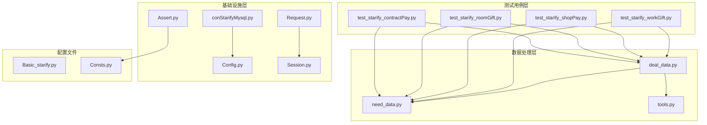
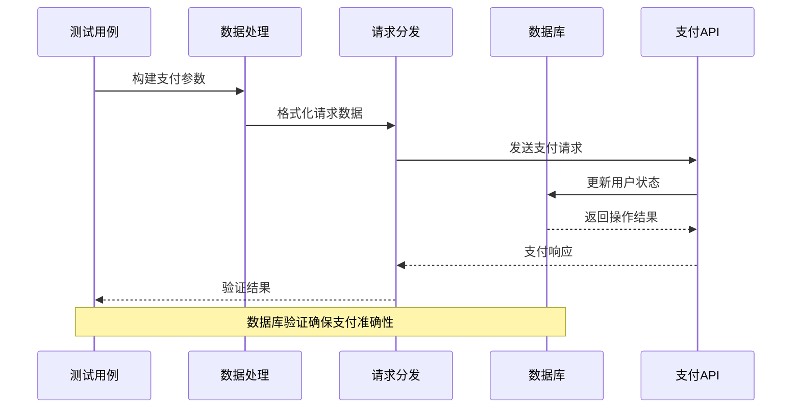
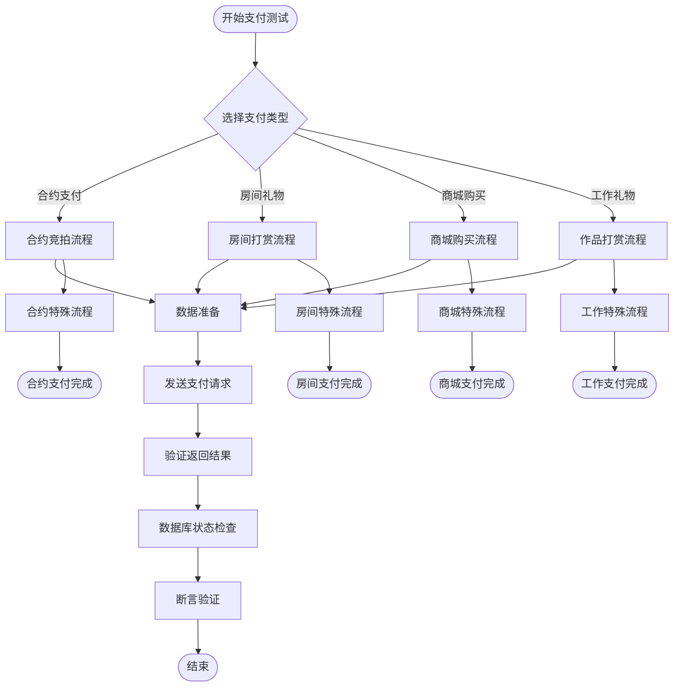
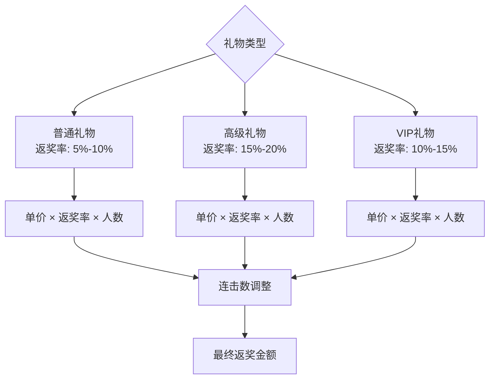
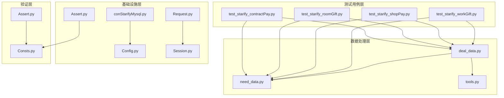

# Starify平台支付测试技术文档

<cite>
**本文档引用的文件**
- [test_starify_contractPay.py](file://caseStarify/test_starify_contractPay.py)
- [test_starify_roomGift.py](file://caseStarify/test_starify_roomGift.py)
- [test_starify_shopPay.py](file://caseStarify/test_starify_shopPay.py)
- [test_starify_workGift.py](file://caseStarify/test_starify_workGift.py)
- [deal_data.py](file://caseStarify/deal_data.py)
- [need_data.py](file://caseStarify/need_data.py)
- [conStarifyMysql.py](file://common/conStarifyMysql.py)
- [Config.py](file://common/Config.py)
- [Request.py](file://common/Request.py)
- [Assert.py](file://common/Assert.py)
- [Session.py](file://common/Session.py)
- [Basic_starify.py](file://common/Basic_starify.py)
- [tools.py](file://caseStarify/tools.py)
- [Consts.py](file://common/Consts.py)
- [README.md](file://README.md)
</cite>

## 目录
1. [简介](#简介)
2. [项目结构](#项目结构)
3. [核心组件](#核心组件)
4. [架构概览](#架构概览)
5. [详细组件分析](#详细组件分析)
6. [依赖关系分析](#依赖关系分析)
7. [性能考虑](#性能考虑)
8. [故障排除指南](#故障排除指南)
9. [结论](#结论)
10. [附录](#附录)

## 简介

Starify平台是一个基于星币的虚拟礼物打赏系统，主要面向直播场景。该平台实现了独特的支付机制，包括合约支付系统、房间礼物打赏、商城购买和工作礼物等功能。本文档详细介绍了Starify平台的支付测试功能，涵盖了平台的独特支付机制、合约支付系统和工作礼物功能。

平台的核心特色在于其创新的合约竞拍机制，允许制作人通过竞拍方式获得歌手的合约权，同时实现了复杂的礼物返奖算法和财富值系统。所有测试用例都基于真实的数据准备和数据库验证，确保支付流程的准确性和可靠性。

## 项目结构

Starify平台支付测试项目的整体架构采用分层设计，主要包含以下模块：



**图表来源**
- [test_starify_contractPay.py:1-487](file://caseStarify/test_starify_contractPay.py#L1-L487)
- [test_starify_roomGift.py:1-1080](file://caseStarify/test_starify_roomGift.py#L1-L1080)
- [deal_data.py:1-103](file://caseStarify/deal_data.py#L1-L103)
- [conStarifyMysql.py:1-148](file://common/conStarifyMysql.py#L1-L148)

**章节来源**
- [README.md:1-38](file://README.md#L1-L38)

## 核心组件

### 支付数据处理组件

支付数据处理组件负责构建和格式化各种支付场景的请求参数。该组件支持三种主要的支付类型：

1. **作品打赏支付**：用于单个作品的礼物打赏
2. **房间礼物支付**：用于直播间多人礼物打赏
3. **商城购买支付**：用于虚拟物品的购买

每个支付类型都有特定的参数结构和验证逻辑，确保支付请求的完整性和正确性。

### 数据准备组件

数据准备组件提供了丰富的测试数据配置，包括：
- 礼物配置信息（价格、返奖率、属性值）
- 用户身份信息（打赏者、被打赏者、制作人）
- 房间和作品状态管理
- 分成比例配置

### 数据库操作组件

数据库操作组件封装了所有与MySQL数据库的交互操作，包括：
- 用户余额查询和更新
- 背包物品管理和查询
- 财富值和魅力值的维护
- 合约关系的建立和清理

**章节来源**
- [deal_data.py:1-103](file://caseStarify/deal_data.py#L1-L103)
- [need_data.py:1-290](file://caseStarify/need_data.py#L1-L290)
- [conStarifyMysql.py:1-148](file://common/conStarifyMysql.py#L1-L148)

## 架构概览

Starify平台的支付测试架构采用了典型的分层架构模式，确保了测试的可维护性和可扩展性：



**图表来源**
- [test_starify_contractPay.py:36-41](file://caseStarify/test_starify_contractPay.py#L36-L41)
- [deal_data.py:62-68](file://caseStarify/deal_data.py#L62-L68)
- [conStarifyMysql.py:54-75](file://common/conStarifyMysql.py#L54-L75)

### 支付流程架构

平台实现了多种支付场景的完整流程：



**图表来源**
- [test_starify_contractPay.py:15-80](file://caseStarify/test_starify_contractPay.py#L15-L80)
- [test_starify_roomGift.py:18-44](file://caseStarify/test_starify_roomGift.py#L18-L44)
- [test_starify_shopPay.py:18-39](file://caseStarify/test_starify_shopPay.py#L18-L39)
- [test_starify_workGift.py:15-31](file://caseStarify/test_starify_workGift.py#L15-L31)

## 详细组件分析

### 合约支付系统

合约支付系统是Starify平台最具特色的功能之一，实现了制作人与歌手之间的竞拍机制。

#### 核心特性

1. **竞拍机制**：制作人可以通过多次竞拍获得歌手的合约权
2. **分成系统**：合约收入按照预设比例在制作人和歌手之间分配
3. **名额管理**：制作人可签约的歌手数量受到财富值限制
4. **结算机制**：竞拍结束后进行统一结算和资金分配

#### 支付流程分析

```mermaid
sequenceDiagram
participant Producer as 制作人
participant System as 系统
participant Singer as 歌手
participant DB as 数据库
Producer->>System : 发起竞拍报价
System->>DB : 冻结竞拍金额
DB-->>System : 竞拍成功
alt 新制作人竞拍
System->>DB : 释放原制作人名额
System->>DB : 占用新制作人名额
else 原制作人继续竞拍
System->>DB : 退回之前冻结金额
System->>DB : 冻结当前竞拍金额
end
Note over 30+3s : 等待结算
System->>DB : 执行最终结算
DB-->>Singer : 分配歌手分成
DB-->>Producer : 分配制作人分成
```

**图表来源**
- [test_starify_contractPay.py:47-79](file://caseStarify/test_starify_contractPay.py#L47-L79)
- [conStarifyMysql.py:119-131](file://common/conStarifyMysql.py#L119-L131)

#### 关键验证点

合约支付测试覆盖了以下关键场景：

1. **原制作人续约竞拍**：验证多次竞拍的价格递增和资金冻结/退回机制
2. **新制作人竞拍**：验证制作人切换和名额转移逻辑
3. **竞拍条件验证**：包括最低报价要求、报价增量要求等
4. **余额不足处理**：验证用户余额不足时的错误处理
5. **名额限制验证**：验证制作人可签约数量的限制

**章节来源**
- [test_starify_contractPay.py:15-254](file://caseStarify/test_starify_contractPay.py#L15-L254)

### 房间礼物打赏系统

房间礼物打赏系统实现了直播间的多人礼物打赏功能，支持多种支付方式和复杂的返奖算法。

#### 支付方式

1. **星币支付**：直接使用星币余额进行支付
2. **背包支付**：使用背包中的礼物进行支付
3. **组合支付**：星币和背包礼物的混合支付

#### 返奖算法

房间礼物打赏实现了动态返奖机制，返奖率根据礼物类型和价值而定：



**图表来源**
- [test_starify_roomGift.py:19-44](file://caseStarify/test_starify_roomGift.py#L19-L44)
- [need_data.py:94-106](file://caseStarify/need_data.py#L94-L106)

#### 多人打赏场景

系统支持最多2人的多人打赏，每种支付方式都有对应的验证逻辑：

1. **星币多人支付**：验证总支付金额和每人返奖金额
2. **背包多人支付**：验证背包礼物数量和每人返奖金额
3. **组合多人支付**：验证星币和背包礼物的分配逻辑

**章节来源**
- [test_starify_roomGift.py:18-763](file://caseStarify/test_starify_roomGift.py#L18-L763)

### 商城购买系统

商城购买系统允许用户使用星币购买各种虚拟物品，包括头像框、进场横幅和麦上光圈等装饰物品。

#### 商品类型

1. **头像框**：提供3天、7天、15天三种有效期
2. **进场横幅**：提供3天、7天、15天三种有效期  
3. **麦上光圈**：提供3天、7天、15天三种有效期

#### 折扣机制

商城购买实现了阶梯式折扣机制：
- 3天有效期：9折优惠
- 7天有效期：9折优惠  
- 15天有效期：8.5折优惠

#### 财富值计算

购买商品时，用户的财富值会相应增加，增加额度等于商品的总费用。

**章节来源**
- [test_starify_shopPay.py:18-131](file://caseStarify/test_starify_shopPay.py#L18-L131)

### 工作礼物系统

工作礼物系统专门用于作品打赏场景，实现了单次打赏的限制和重复打赏的防刷机制。

#### 打赏限制

1. **单作品限制**：每个作品只能被打赏一次
2. **重复打赏检测**：系统会检测用户是否已经打赏过该作品
3. **状态管理**：通过作品状态字段区分已打赏和未打赏状态

#### 礼物类型

系统支持两种类型的礼物：
1. **星币礼物**：使用星币直接购买的礼物
2. **安可礼物**：特殊的安可礼物，具有更高的价值

#### 财富值机制

每次作品打赏都会增加用户的财富值，财富值的增加额度等于礼物的价值。

**章节来源**
- [test_starify_workGift.py:15-103](file://caseStarify/test_starify_workGift.py#L15-L103)

## 依赖关系分析

Starify平台支付测试系统的依赖关系呈现清晰的层次化结构：



**图表来源**
- [deal_data.py:1-103](file://caseStarify/deal_data.py#L1-L103)
- [need_data.py:1-290](file://caseStarify/need_data.py#L1-L290)
- [conStarifyMysql.py:1-148](file://common/conStarifyMysql.py#L1-L148)

### 组件耦合度分析

系统设计遵循了低耦合高内聚的原则：

1. **测试用例与数据处理**：通过函数调用实现松耦合
2. **数据处理与配置**：通过导入模块实现解耦
3. **基础设施与业务逻辑**：通过抽象接口实现分离
4. **验证与断言**：通过独立模块实现通用性

### 循环依赖检查

经过分析，系统中不存在循环依赖关系，各模块之间的依赖方向清晰明确。

**章节来源**
- [deal_data.py:1-103](file://caseStarify/deal_data.py#L1-L103)
- [conStarifyMysql.py:1-148](file://common/conStarifyMysql.py#L1-L148)

## 性能考虑

### 数据库性能优化

1. **批量操作**：使用事务批量执行多个数据库操作
2. **索引优化**：确保常用查询字段建立适当索引
3. **连接池**：复用数据库连接减少连接开销
4. **异步处理**：对于耗时的数据库操作采用异步处理

### 网络请求优化

1. **连接复用**：使用Session复用HTTP连接
2. **超时控制**：合理设置请求超时时间
3. **重试机制**：对网络异常进行智能重试
4. **并发控制**：避免过度并发导致的资源竞争

### 内存管理

1. **对象复用**：复用常用的配置对象
2. **及时释放**：及时释放不再使用的资源
3. **垃圾回收**：合理利用Python的垃圾回收机制

## 故障排除指南

### 常见问题及解决方案

#### 支付失败问题

**问题现象**：支付请求返回失败状态

**可能原因**：
1. 用户余额不足
2. 礼物价格与配置不匹配
3. 网络连接异常
4. 服务器端口错误

**解决步骤**：
1. 检查用户星币余额是否充足
2. 验证礼物配置价格设置
3. 确认网络连接稳定性
4. 验证服务器地址配置

#### 数据库连接问题

**问题现象**：数据库操作失败

**可能原因**：
1. 数据库服务器不可达
2. 用户名密码错误
3. 数据库权限不足
4. 连接超时

**解决步骤**：
1. 检查数据库服务器状态
2. 验证数据库连接配置
3. 确认用户权限设置
4. 调整连接超时参数

#### 断言失败问题

**问题现象**：测试用例断言失败

**可能原因**：
1. 数据准备不完整
2. 期望值计算错误
3. 数据库状态不一致
4. 时间同步问题

**解决步骤**：
1. 检查数据准备脚本
2. 验证期望值计算逻辑
3. 确认数据库状态一致性
4. 处理时间相关的问题

### 调试技巧

1. **日志记录**：详细记录每个测试步骤的执行情况
2. **中间状态检查**：在关键节点检查数据库状态
3. **参数验证**：验证所有输入参数的有效性
4. **环境隔离**：确保测试环境的独立性

**章节来源**
- [Assert.py:11-96](file://common/Assert.py#L11-L96)
- [conStarifyMysql.py:27-51](file://common/conStarifyMysql.py#L27-L51)

## 结论

Starify平台的支付测试系统展现了高度的专业性和完整性。通过精心设计的测试用例和严谨的验证机制，系统能够全面覆盖各种支付场景，确保支付流程的准确性和可靠性。

平台的核心优势在于其创新的合约竞拍机制和复杂的礼物返奖算法，这些功能的测试验证为平台的稳定运行提供了重要保障。同时，系统的模块化设计和清晰的架构层次使得测试用例易于维护和扩展。

未来可以在以下方面进一步改进：
1. 增加更多的边界条件测试
2. 优化测试用例的执行效率
3. 完善错误处理和恢复机制
4. 加强性能监控和分析能力

## 附录

### 测试工具使用指南

#### 数据准备工具

1. **用户数据准备**：使用`conStarifyMysql.updateMoneySql()`设置用户余额
2. **背包数据准备**：使用`conStarifyMysql.insertXsUserCommodity()`添加礼物
3. **状态数据准备**：使用`conStarifyMysql.deleteUserAccountSql()`清理状态

#### 支付流程模拟

1. **请求构造**：使用`deal_data.deal_pay_data()`构建支付请求
2. **参数验证**：确保所有必需参数都已正确设置
3. **响应处理**：解析支付响应并提取关键信息

#### 结果验证方法

1. **数据库验证**：通过查询数据库确认状态变更
2. **断言验证**：使用`Assert`模块进行结果断言
3. **日志记录**：记录详细的测试执行日志

### 配置要求和环境设置

#### 环境配置

1. **数据库配置**：确保MySQL数据库正常运行
2. **网络配置**：验证支付API的可达性
3. **认证配置**：设置正确的用户令牌
4. **时间配置**：确保系统时间同步

#### 认证流程

1. **用户登录**：通过手机号和验证码登录
2. **令牌获取**：从登录响应中提取用户令牌
3. **令牌存储**：将令牌保存到本地文件
4. **令牌使用**：在支付请求中使用用户令牌

### 最佳实践建议

1. **测试数据管理**：建立完善的测试数据管理系统
2. **错误处理**：实现健壮的错误处理和恢复机制
3. **性能监控**：监控测试执行的性能指标
4. **持续集成**：将支付测试集成到CI/CD流程中
5. **文档维护**：保持测试文档的及时更新