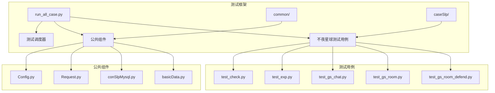
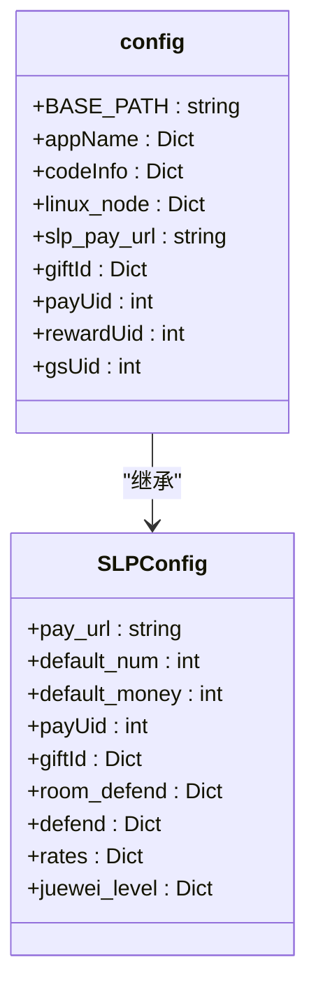
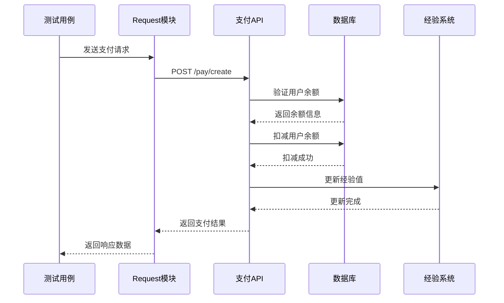
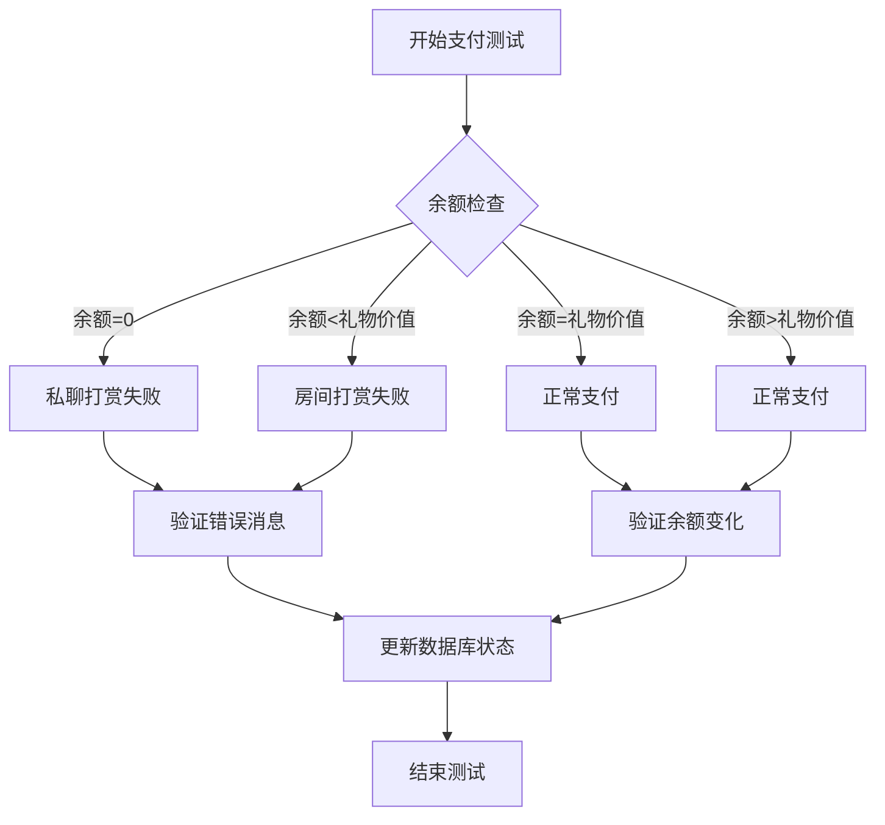
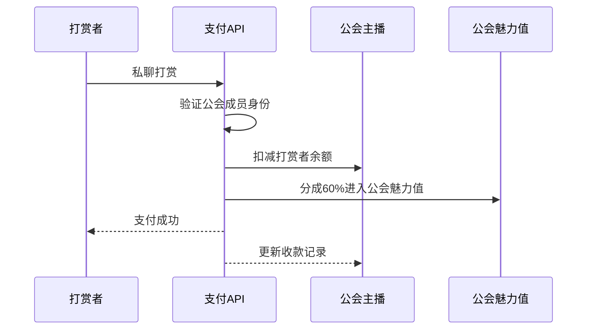
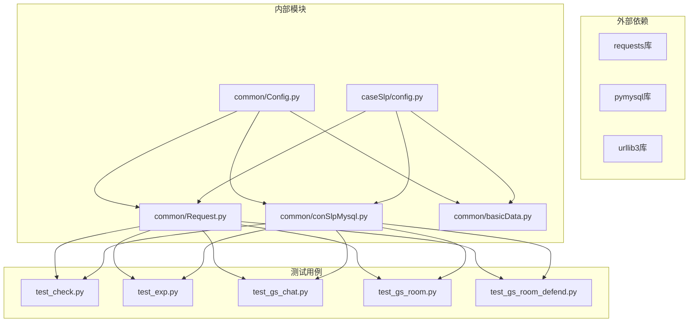

# 不夜星球平台支付测试实施文档

<cite>
**本文档引用的文件**
- [README.md](file://README.md)
- [run_all_case.py](file://run_all_case.py)
- [common/Config.py](file://common/Config.py)
- [common/Consts.py](file://common/Consts.py)
- [common/Basic.yml](file://common/Basic.yml)
- [caseSlp/config.py](file://caseSlp/config.py)
- [caseSlp/tools.py](file://caseSlp/tools.py)
- [common/Request.py](file://common/Request.py)
- [common/basicData.py](file://common/basicData.py)
- [common/conSlpMysql.py](file://common/conSlpMysql.py)
- [caseSlp/test_check.py](file://caseSlp/test_check.py)
- [caseSlp/test_exp.py](file://caseSlp/test_exp.py)
- [caseSlp/test_gs_chat.py](file://caseSlp/test_gs_chat.py)
- [caseSlp/test_gs_room.py](file://caseSlp/test_gs_room.py)
- [caseSlp/test_gs_room_defend.py](file://caseSlp/test_gs_room_defend.py)
</cite>

## 目录
1. [项目概述](#项目概述)
2. [项目结构](#项目结构)
3. [核心组件](#核心组件)
4. [架构概览](#架构概览)
5. [详细组件分析](#详细组件分析)
6. [依赖关系分析](#依赖关系分析)
7. [性能考虑](#性能考虑)
8. [故障排除指南](#故障排除指南)
9. [结论](#结论)

## 项目概述

不夜星球平台是一个游戏化的直播平台，提供独特的支付体验和社交互动功能。该支付测试框架专门针对平台的支付系统进行全面测试，涵盖检查支付、经验获取、聊天室支付、房间支付等多个核心功能。

### 平台特色功能

- **游戏化支付体验**：通过经验值系统和爵位制度，将支付行为转化为游戏化体验
- **经验值系统**：用户通过支付获得经验值，提升爵位等级，享受更多特权
- **聊天室功能**：支持私聊打赏和房间打赏，实现实时社交互动
- **房间装饰系统**：用户可以通过支付装饰自己的房间，提升社交体验
- **守护系统**：提供多种守护类型，保护主播和房间

## 项目结构

**图表来源**
- [run_all_case.py:126-147](file://run_all_case.py#L126-L147)
- [common/Config.py:6-45](file://common/Config.py#L6-L45)

**章节来源**
- [README.md:1-38](file://README.md#L1-L38)
- [run_all_case.py:126-147](file://run_all_case.py#L126-L147)

## 核心组件

### 支付配置管理

平台采用集中式配置管理，通过Config.py统一管理所有支付相关的配置信息：

**图表来源**
- [common/Config.py:6-133](file://common/Config.py#L6-L133)
- [caseSlp/config.py:1-263](file://caseSlp/config.py#L1-L263)

### 请求处理模块

Request.py封装了HTTP请求处理逻辑，支持多种支付场景：

**章节来源**
- [common/Request.py:17-59](file://common/Request.py#L17-L59)
- [common/Config.py:49-55](file://common/Config.py#L49-L55)

## 架构概览

**图表来源**
- [common/Request.py:17-59](file://common/Request.py#L17-L59)
- [common/basicData.py:8-325](file://common/basicData.py#L8-L325)

## 详细组件分析

### 支付测试用例分析

#### 异常/边界值测试

test_check.py涵盖了支付系统的核心异常处理场景：

**图表来源**
- [caseSlp/test_check.py:20-295](file://caseSlp/test_check.py#L20-L295)

#### 经验值系统测试

test_exp.py专注于测试经验值获取和爵位升级机制：

**章节来源**
- [caseSlp/test_exp.py:19-327](file://caseSlp/test_exp.py#L19-L327)

### 公会主播支付测试

#### 私聊打赏测试

test_gs_chat.py验证公会主播的私聊打赏分成机制：

**图表来源**
- [caseSlp/test_gs_chat.py:21-52](file://caseSlp/test_gs_chat.py#L21-L52)

#### 房间打赏测试

test_gs_room.py覆盖了多种房间类型的打赏场景：

**章节来源**
- [caseSlp/test_gs_room.py:18-589](file://caseSlp/test_gs_room.py#L18-L589)

### 房间守护测试

test_gs_room_defend.py专门测试房间守护功能：

**章节来源**
- [caseSlp/test_gs_room_defend.py:18-59](file://caseSlp/test_gs_room_defend.py#L18-L59)

## 依赖关系分析

**图表来源**
- [common/Request.py:5-14](file://common/Request.py#L5-L14)
- [common/conSlpMysql.py:5-27](file://common/conSlpMysql.py#L5-L27)

**章节来源**
- [common/Request.py:1-162](file://common/Request.py#L1-L162)
- [common/conSlpMysql.py:1-680](file://common/conSlpMysql.py#L1-L680)

## 性能考虑

### 支付性能优化

1. **并发处理**：测试框架支持多线程并发执行，提高测试效率
2. **数据库连接池**：合理管理数据库连接，避免连接泄漏
3. **缓存策略**：对频繁查询的数据进行缓存，减少数据库压力
4. **请求超时控制**：设置合理的请求超时时间，避免长时间阻塞

### 压力测试最佳实践

1. **渐进式负载**：从低负载开始，逐步增加到目标负载
2. **监控指标**：关注响应时间、吞吐量、错误率等关键指标
3. **资源限制**：确保测试环境有足够的CPU、内存和网络带宽
4. **数据隔离**：使用独立的测试数据库，避免影响生产环境

## 故障排除指南

### 常见问题及解决方案

#### 支付失败问题

1. **余额不足**：检查用户账户余额，确保有足够资金
2. **签名验证失败**：确认请求参数和签名算法正确
3. **房间权限问题**：验证用户在目标房间的权限级别

#### 数据库连接问题

1. **连接超时**：检查数据库服务器状态和网络连接
2. **连接池耗尽**：优化连接池配置，及时释放连接
3. **事务冲突**：检查并发操作，避免死锁

#### 测试环境问题

1. **配置错误**：核对环境配置文件，确保URL和端口正确
2. **依赖缺失**：安装必要的Python库和依赖包
3. **权限问题**：检查数据库访问权限和文件系统权限

**章节来源**
- [common/Request.py:40-46](file://common/Request.py#L40-L46)
- [common/conSlpMysql.py:24-27](file://common/conSlpMysql.py#L24-L27)

## 结论

不夜星球平台的支付测试框架提供了全面的测试覆盖，包括异常处理、经验值系统、公会支付、房间装饰等多个方面。通过模块化的架构设计和完善的配置管理，该框架能够有效保障平台支付系统的稳定性和可靠性。

### 主要优势

1. **全面性**：覆盖了支付系统的所有核心功能
2. **可维护性**：清晰的模块划分和配置管理
3. **可扩展性**：易于添加新的测试场景和功能
4. **稳定性**：完善的错误处理和故障恢复机制

### 改进建议

1. **自动化部署**：进一步完善CI/CD流程
2. **监控告警**：增加实时监控和告警机制
3. **性能基准**：建立性能基准测试体系
4. **安全测试**：加强安全漏洞扫描和渗透测试