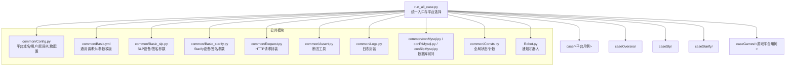
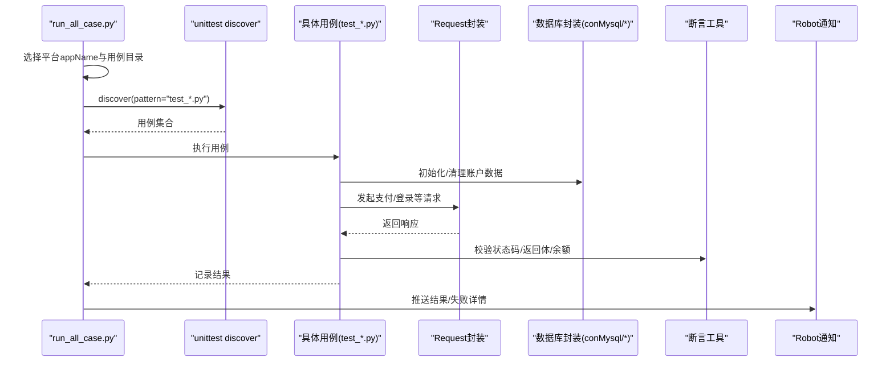
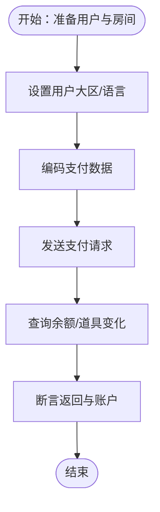
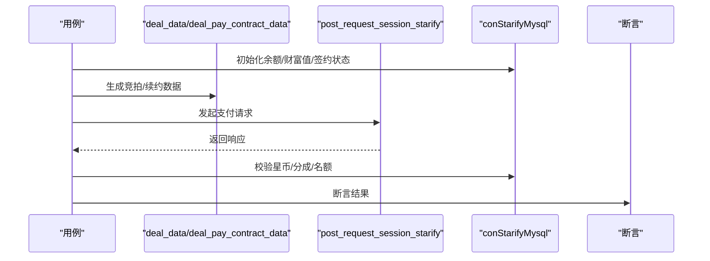
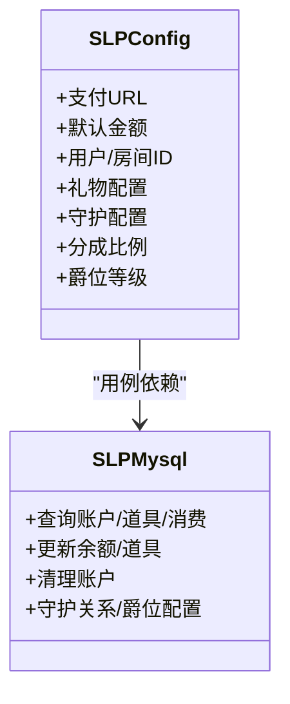
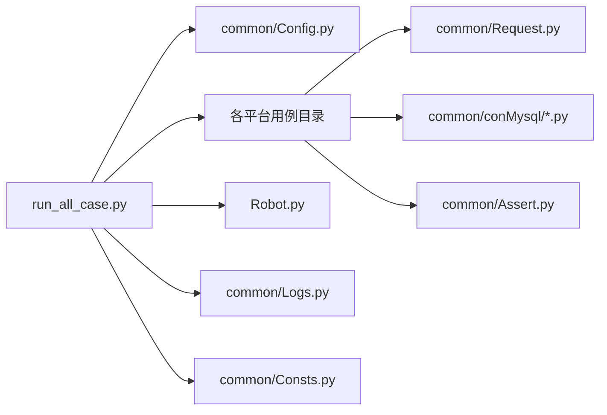

# 平台支持

<cite>
**本文引用的文件**
- [README.md](file://README.md)
- [Config.py](file://common/Config.py)
- [Consts.py](file://common/Consts.py)
- [run_all_case.py](file://run_all_case.py)
- [Robot.py](file://Robot.py)
- [Basic.yml](file://common/Basic.yml)
- [Basic_slp.py](file://common/Basic_slp.py)
- [Basic_starify.py](file://common/Basic_starify.py)
- [conPtMysql.py](file://common/conPtMysql.py)
- [conSlpMysql.py](file://common/conSlpMysql.py)
- [test_pt_bean.py](file://caseOversea/test_pt_bean.py)
- [config.py](file://caseSlp/config.py)
- [test_starify_contractPay.py](file://caseStarify/test_starify_contractPay.py)
- [test_pay_duckRate.py](file://caseGames/test_pay_duckRate.py)
</cite>

## 目录
1. [简介](#简介)
2. [项目结构](#项目结构)
3. [核心组件](#核心组件)
4. [架构总览](#架构总览)
5. [详细组件分析](#详细组件分析)
6. [依赖分析](#依赖分析)
7. [性能考虑](#性能考虑)
8. [故障排查指南](#故障排查指南)
9. [结论](#结论)
10. [附录](#附录)

## 简介
本文件面向QA支付测试自动化项目的“多平台支持”能力，系统化梳理各游戏平台的接入方式、配置方法与测试策略。重点覆盖以下平台：
- BanBan（国内）
- PT海外版（含多语言/大区）
- Starify（合约/星币体系）
- 不夜星球（SLP，GS商业房/守护/爵位）
- 游戏平台（如“冲鸭”等）

文档从架构、组件、数据流、处理逻辑、集成点、错误处理与性能特性等方面进行深入分析，并提供平台间共性与差异对比、新平台接入流程与最佳实践。

## 项目结构
项目采用按平台划分的用例组织方式，配合通用的公共模块（配置、请求封装、日志、数据库访问、断言与运行器等）。核心入口通过统一调度脚本选择平台并执行对应用例集。

图表来源
- [run_all_case.py:126-159](file://run_all_case.py#L126-L159)
- [Config.py:6-133](file://common/Config.py#L6-L133)
- [Basic.yml:1-52](file://common/Basic.yml#L1-L52)
- [Basic_slp.py:1-34](file://common/Basic_slp.py#L1-L34)
- [Basic_starify.py:1-36](file://common/Basic_starify.py#L1-L36)

章节来源
- [README.md:1-38](file://README.md#L1-L38)
- [run_all_case.py:126-159](file://run_all_case.py#L126-L159)

## 核心组件
- 统一入口与平台选择
  - 依据运行节点与appName选择平台，加载对应用例目录并执行。
- 平台配置中心
  - 统一维护各平台域名、登录URL、用户/房间/礼物ID、代码分支等。
- 请求与参数模板
  - 通用Header与设备签名参数在Basic.yml与Basic_*中集中管理。
- 数据库访问层
  - 各平台独立的MySQL封装，提供查询/更新/清理账户余额与道具等能力。
- 断言与日志
  - 统一断言工具与日志输出，失败重试与通知机器人集成。
- 运行与通知
  - 自动拉取代码、执行用例、统计结果并通过机器人推送。

章节来源
- [run_all_case.py:12-124](file://run_all_case.py#L12-L124)
- [Config.py:6-133](file://common/Config.py#L6-L133)
- [Basic.yml:1-52](file://common/Basic.yml#L1-L52)
- [Basic_slp.py:1-34](file://common/Basic_slp.py#L1-L34)
- [Basic_starify.py:1-36](file://common/Basic_starify.py#L1-L36)
- [conPtMysql.py:6-345](file://common/conPtMysql.py#L6-L345)
- [conSlpMysql.py:8-680](file://common/conSlpMysql.py#L8-L680)
- [Consts.py:1-17](file://common/Consts.py#L1-L17)
- [Robot.py:6-138](file://Robot.py#L6-L138)

## 架构总览
下图展示跨平台测试的整体调用链：入口脚本根据平台选择用例目录，用例通过公共模块发起HTTP请求、访问数据库、断言结果，并将失败信息通过机器人通知。

图表来源
- [run_all_case.py:126-147](file://run_all_case.py#L126-L147)
- [test_pt_bean.py:12-38](file://caseOversea/test_pt_bean.py#L12-L38)
- [test_starify_contractPay.py:13-80](file://caseStarify/test_starify_contractPay.py#L13-L80)
- [test_pay_duckRate.py:13-102](file://caseGames/test_pay_duckRate.py#L13-L102)

## 详细组件分析

### 平台配置与环境变量
- 平台域名与登录URL
  - BanBan、PT海外版、Starify、SLP等均在配置中心集中维护，便于切换与复用。
- 代码分支与部署节点
  - 通过appName与linux_node区分不同执行节点，自动选择对应分支与路径。
- 请求头与设备参数
  - Basic.yml提供通用Header；Basic_slp.py与Basic_starify.py分别提供平台专属设备/签名参数。

章节来源
- [Config.py:6-133](file://common/Config.py#L6-L133)
- [Basic.yml:1-52](file://common/Basic.yml#L1-L52)
- [Basic_slp.py:1-34](file://common/Basic_slp.py#L1-L34)
- [Basic_starify.py:1-36](file://common/Basic_starify.py#L1-L36)
- [run_all_case.py:150-159](file://run_all_case.py#L150-L159)

### BanBan（国内）接入要点
- 登录与支付
  - 使用QQ登录参数模板与支付URL，结合通用请求封装发起支付。
- 用户/房间/礼物ID
  - 在配置中心维护用户UID、房间ID、礼物ID等，便于用例复用。
- 数据库操作
  - 通过通用conMysql封装进行余额/道具/消费记录等查询与更新。

章节来源
- [Config.py:95-133](file://common/Config.py#L95-L133)
- [Basic.yml:37-52](file://common/Basic.yml#L37-L52)
- [conSlpMysql.py:29-226](file://common/conSlpMysql.py#L29-L226)

### PT海外版（多语言/大区）
- 登录与支付
  - 使用移动端密码登录URL与通用Header，支付流程通过编码后的数据提交。
- 多语言/大区支持
  - 提供大区与语言设置的数据库操作，用于模拟不同区域场景。
- 礼物与房间
  - 礼物ID与房间ID在配置中心集中维护，便于跨用例复用。

图表来源
- [test_pt_bean.py:12-38](file://caseOversea/test_pt_bean.py#L12-L38)
- [conPtMysql.py:160-184](file://common/conPtMysql.py#L160-L184)

章节来源
- [Config.py:95-133](file://common/Config.py#L95-L133)
- [Basic.yml:7-16](file://common/Basic.yml#L7-L16)
- [test_pt_bean.py:12-38](file://caseOversea/test_pt_bean.py#L12-L38)
- [conPtMysql.py:6-345](file://common/conPtMysql.py#L6-L345)

### Starify（合约/星币）
- 星币与合约流程
  - 支持制作人与歌手的竞拍/续约流程，涉及冻结/解冻/结算等复杂状态。
- 数据模型
  - 包含星币余额、制作人/歌手关系、竞拍记录、分成比例等。
- 接口适配
  - 使用专用的请求封装与数据处理模块，确保签名与参数符合平台要求。

图表来源
- [test_starify_contractPay.py:13-80](file://caseStarify/test_starify_contractPay.py#L13-L80)
- [Basic_starify.py:1-36](file://common/Basic_starify.py#L1-L36)

章节来源
- [test_starify_contractPay.py:13-487](file://caseStarify/test_starify_contractPay.py#L13-L487)
- [Basic_starify.py:1-36](file://common/Basic_starify.py#L1-L36)

### 不夜星球（SLP，GS商业房/守护/爵位）
- 支付与房间类型
  - 支持GS商业房、普通房间、守护等场景，房间ID与礼物ID在平台配置中维护。
- 爵位与分成
  - 提供爵位等级/成长值/有效值等配置，以及默认分成比例。
- 数据库操作
  - 提供扩展账户余额、背包道具、守护关系、消费记录等查询与更新。

图表来源
- [config.py:1-263](file://caseSlp/config.py#L1-L263)
- [conSlpMysql.py:8-680](file://common/conSlpMysql.py#L8-L680)

章节来源
- [config.py:1-263](file://caseSlp/config.py#L1-L263)
- [conSlpMysql.py:8-680](file://common/conSlpMysql.py#L8-L680)

### 游戏平台（如“冲鸭”）
- 自定义分成比例
  - 支持在房间/私聊/守护场景下设置自定义分成比例，并验证余额变动。
- 白名单与公会
  - 通过数据库操作将被打赏者加入白名单或公会，以触发特定分成逻辑。

章节来源
- [test_pay_duckRate.py:13-102](file://caseGames/test_pay_duckRate.py#L13-L102)
- [conSlpMysql.py:663-675](file://common/conSlpMysql.py#L663-L675)

## 依赖分析
- 平台选择与用例发现
  - run_all_case.py根据appName选择用例目录，discover加载对应test_*.py。
- 平台配置与请求封装
  - 各平台通过Config与Basic_*提供域名、Header、签名参数；Request封装统一HTTP调用。
- 数据库访问
  - 各平台独立的conMysql封装，提供账户/道具/消费记录等查询与更新。
- 通知与报告
  - Robot负责将结果与失败详情推送到指定通道；Consts记录全局状态与计数。

图表来源
- [run_all_case.py:126-147](file://run_all_case.py#L126-L147)
- [Config.py:6-133](file://common/Config.py#L6-L133)
- [Robot.py:6-138](file://Robot.py#L6-L138)
- [Consts.py:1-17](file://common/Consts.py#L1-17)

章节来源
- [run_all_case.py:126-147](file://run_all_case.py#L126-L147)
- [Config.py:6-133](file://common/Config.py#L6-L133)
- [Robot.py:6-138](file://Robot.py#L6-L138)
- [Consts.py:1-17](file://common/Consts.py#L1-17)

## 性能考虑
- 用例并发与统计
  - 通过全局计数与时间戳统计用例总数、失败数与耗时，便于评估整体性能。
- 数据库连接与事务
  - MySQL封装使用autocommit与ping重连，减少长事务带来的锁竞争。
- 请求与重试
  - 用例层提供重试装饰器，降低瞬时网络波动对结果的影响。

章节来源
- [Consts.py:1-17](file://common/Consts.py#L1-L17)
- [conPtMysql.py:15-23](file://common/conPtMysql.py#L15-L23)
- [conSlpMysql.py:19-27](file://common/conSlpMysql.py#L19-L27)
- [test_starify_contractPay.py:13-13](file://caseStarify/test_starify_contractPay.py#L13-L13)

## 故障排查指南
- 通知与日志
  - 失败用例通过机器人推送标题与原因；日志模块记录用例结果与异常。
- 常见问题定位
  - 参数签名不一致：核对Basic_*中的设备参数与签名生成逻辑。
  - 数据库状态异常：确认初始化/清理SQL是否正确执行，必要时手动回滚。
  - 分成比例不符：检查平台配置中的默认比例与白名单/公会设置。
- 重试与恢复
  - 对易波动的接口使用重试装饰器；关注结算延迟导致的最终一致性。

章节来源
- [Robot.py:6-138](file://Robot.py#L6-L138)
- [Basic.yml:1-52](file://common/Basic.yml#L1-L52)
- [Basic_slp.py:1-34](file://common/Basic_slp.py#L1-L34)
- [Basic_starify.py:1-36](file://common/Basic_starify.py#L1-L36)
- [conPtMysql.py:94-144](file://common/conPtMysql.py#L94-L144)
- [conSlpMysql.py:227-322](file://common/conSlpMysql.py#L227-L322)

## 结论
本项目通过统一的配置中心、参数模板与数据库封装，实现了对多个游戏平台的稳定支持。不同平台在API差异、数据模型与业务逻辑上各有侧重，但均遵循相同的测试流程与质量保障机制。建议在新增平台时，优先复用现有封装，最小化差异点，确保可维护性与可扩展性。

## 附录

### 平台共性与差异对比
- 共性
  - 统一的用例发现与执行框架、断言工具、日志与通知机制。
- 差异
  - PT海外版强调多语言/大区设置；Starify强调合约/星币流程；SLP强调GS商业房/守护/爵位；国内平台更偏向传统支付与房间场景。

章节来源
- [test_pt_bean.py:12-38](file://caseOversea/test_pt_bean.py#L12-L38)
- [test_starify_contractPay.py:13-487](file://caseStarify/test_starify_contractPay.py#L13-L487)
- [config.py:1-263](file://caseSlp/config.py#L1-L263)
- [test_pay_duckRate.py:13-102](file://caseGames/test_pay_duckRate.py#L13-L102)

### 新平台接入流程（接口适配、数据映射、测试用例适配）
- 接口适配
  - 在Config中新增平台域名与登录URL；在Basic_*中补充设备/签名参数模板。
- 数据映射
  - 在common/conMysql中新增平台专属封装，提供账户/道具/消费记录等查询与更新。
- 测试用例适配
  - 在对应平台目录下新增用例，复用Request与Assert；必要时引入重试装饰器。
- 配置与通知
  - 在run_all_case.py中注册appName与用例目录；在Robot中配置通知通道。

章节来源
- [Config.py:6-133](file://common/Config.py#L6-L133)
- [Basic.yml:1-52](file://common/Basic.yml#L1-L52)
- [Basic_slp.py:1-34](file://common/Basic_slp.py#L1-L34)
- [Basic_starify.py:1-36](file://common/Basic_starify.py#L1-L36)
- [conPtMysql.py:6-345](file://common/conPtMysql.py#L6-L345)
- [conSlpMysql.py:8-680](file://common/conSlpMysql.py#L8-L680)
- [run_all_case.py:126-159](file://run_all_case.py#L126-L159)
- [Robot.py:6-138](file://Robot.py#L6-L138)