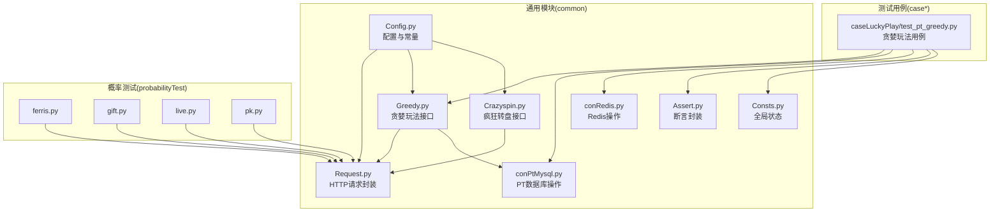
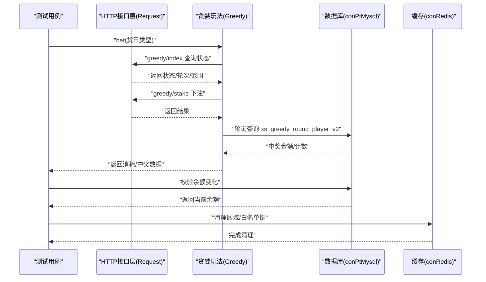
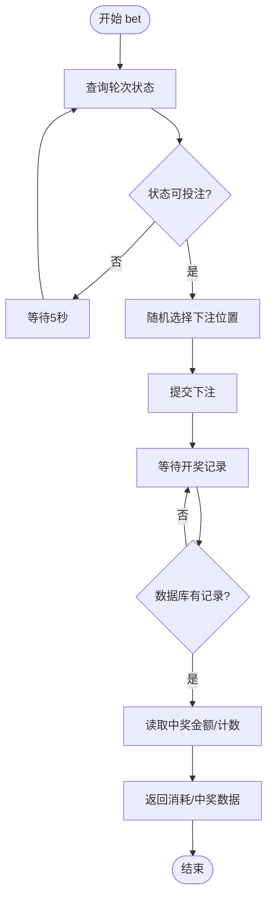
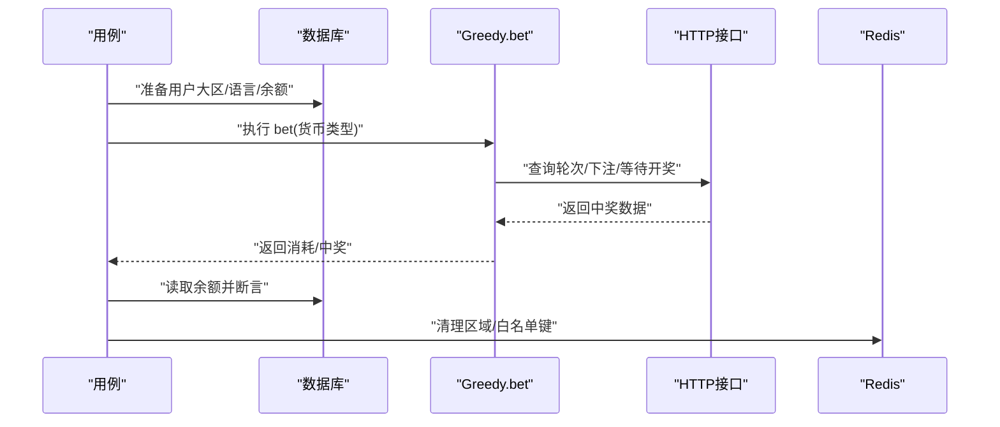
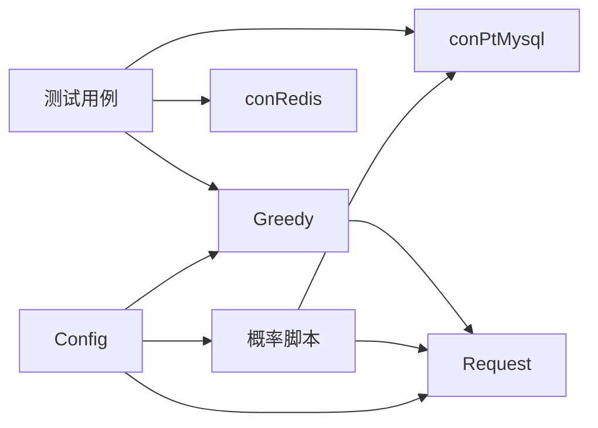

# 幸运玩法平台

<cite>
**本文引用的文件**
- [README.md](file://README.md)
- [requirements.txt](file://requirements.txt)
- [common/Greedy.py](file://common/Greedy.py)
- [common/Crazyspin.py](file://common/Crazyspin.py)
- [common/Config.py](file://common/Config.py)
- [common/Request.py](file://common/Request.py)
- [common/conPtMysql.py](file://common/conPtMysql.py)
- [common/conRedis.py](file://common/conRedis.py)
- [common/Assert.py](file://common/Assert.py)
- [common/Consts.py](file://common/Consts.py)
- [probabilityTest/ferris.py](file://probabilityTest/ferris.py)
- [probabilityTest/gift.py](file://probabilityTest/gift.py)
- [probabilityTest/live.py](file://probabilityTest/live.py)
- [probabilityTest/pk.py](file://probabilityTest/pk.py)
- [caseLuckyPlay/test_pt_greedy.py](file://caseLuckyPlay/test_pt_greedy.py)
</cite>

## 目录
1. [简介](#简介)
2. [项目结构](#项目结构)
3. [核心组件](#核心组件)
4. [架构总览](#架构总览)
5. [详细组件分析](#详细组件分析)
6. [依赖关系分析](#依赖关系分析)
7. [性能与并发考量](#性能与并发考量)
8. [测试实现指南](#测试实现指南)
9. [安全与风控](#安全与风控)
10. [故障排查与异常处理](#故障排查与异常处理)
11. [结论](#结论)
12. [附录](#附录)

## 简介
本文件面向“幸运玩法平台”的支付测试工作，聚焦高风险玩法场景（如贪婪转盘）的支付机制、风险控制与概率测试方法。文档从系统架构、组件职责、数据流与处理逻辑入手，结合测试用例与概率测试脚本，给出可落地的测试流程、验证方法与风险控制建议。同时覆盖安全与合规要点、限额管理与风控策略，以及测试环境搭建、数据准备与结果验证的完整流程。

## 项目结构
该仓库采用按功能域划分的组织方式：
- common：通用工具与基础设施（HTTP请求、数据库连接、断言、常量、配置等）
- case*：各业务线的测试用例集合
- probabilityTest：概率与稳定性测试脚本
- others：辅助脚本与环境配置
- 根目录：运行入口与依赖清单

图表来源
- [common/Config.py:1-133](file://common/Config.py#L1-L133)
- [common/Request.py:1-162](file://common/Request.py#L1-L162)
- [common/conPtMysql.py:1-345](file://common/conPtMysql.py#L1-L345)
- [common/conRedis.py:1-34](file://common/conRedis.py#L1-L34)
- [common/Greedy.py:1-69](file://common/Greedy.py#L1-L69)
- [common/Crazyspin.py:1-98](file://common/Crazyspin.py#L1-L98)
- [common/Assert.py:1-96](file://common/Assert.py#L1-L96)
- [common/Consts.py:1-17](file://common/Consts.py#L1-L17)
- [probabilityTest/ferris.py:1-28](file://probabilityTest/ferris.py#L1-L28)
- [probabilityTest/gift.py:1-112](file://probabilityTest/gift.py#L1-L112)
- [probabilityTest/live.py:1-40](file://probabilityTest/live.py#L1-L40)
- [probabilityTest/pk.py:1-105](file://probabilityTest/pk.py#L1-L105)
- [caseLuckyPlay/test_pt_greedy.py:1-64](file://caseLuckyPlay/test_pt_greedy.py#L1-L64)

章节来源
- [README.md:1-38](file://README.md#L1-L38)
- [requirements.txt:1-85](file://requirements.txt#L1-L85)

## 核心组件
- 配置中心：集中管理服务地址、用户UID、礼物ID、房间ID等全局参数
- HTTP请求封装：统一封装请求头、签名、超时与响应解析
- 数据库访问：提供PT侧用户资产、房间、活动记录等查询与更新
- Redis操作：清理白名单/区域缓存键，保障测试隔离性
- 断言与全局状态：统一断言方法与用例统计
- 贪婪玩法接口：封装贪婪转盘状态查询、下注、开奖数据校验
- 疯狂转盘接口：封装转盘购买、抽奖、列表与喇叭接口
- 概率测试脚本：批量触发支付或活动接口，用于统计与概率分析

章节来源
- [common/Config.py:95-130](file://common/Config.py#L95-L130)
- [common/Request.py:17-59](file://common/Request.py#L17-L59)
- [common/conPtMysql.py:26-345](file://common/conPtMysql.py#L26-L345)
- [common/conRedis.py:18-29](file://common/conRedis.py#L18-L29)
- [common/Assert.py:11-96](file://common/Assert.py#L11-L96)
- [common/Greedy.py:10-69](file://common/Greedy.py#L10-L69)
- [common/Crazyspin.py:8-98](file://common/Crazyspin.py#L8-L98)
- [probabilityTest/gift.py:9-112](file://probabilityTest/gift.py#L9-L112)

## 架构总览
系统围绕“测试用例驱动 + 接口调用 + 数据库校验 + 概率统计”展开，形成闭环验证链路。

图表来源
- [common/Greedy.py:18-69](file://common/Greedy.py#L18-L69)
- [common/Request.py:17-59](file://common/Request.py#L17-L59)
- [common/conPtMysql.py:266-278](file://common/conPtMysql.py#L266-L278)
- [common/conRedis.py:24-29](file://common/conRedis.py#L24-L29)

## 详细组件分析

### 贪婪玩法组件（Greedy）
- 功能职责
  - 查询当前轮次状态与可下注范围
  - 随机选择下注位置并提交
  - 轮询等待开奖，提取中奖金额与计数
  - 提供上层用例进行余额校验
- 关键流程
  - 状态轮询：当状态非可投注时持续等待
  - 随机下注：在允许范围内随机选择位置
  - 开奖轮询：等待数据库记录出现后读取
- 错误处理
  - 异常捕获并返回默认值，避免中断测试流程

图表来源
- [common/Greedy.py:29-69](file://common/Greedy.py#L29-L69)

章节来源
- [common/Greedy.py:10-69](file://common/Greedy.py#L10-L69)

### 疯狂转盘组件（Crazyspin）
- 功能职责
  - 生成支付下单URL
  - 抽奖与列表查询
  - 喇叭广播接口
- 使用场景
  - 支付流程串联与活动联动
  - 与贪婪玩法形成对比，验证不同玩法的支付一致性

章节来源
- [common/Crazyspin.py:8-98](file://common/Crazyspin.py#L8-L98)

### 配置与常量（Config）
- 作用
  - 统一管理服务地址、用户UID、礼物ID、房间ID、支付URL等
  - 为各模块提供稳定、可维护的参数来源
- 关键点
  - PT用户与礼物ID映射
  - 支付URL前缀与登录URL

章节来源
- [common/Config.py:6-133](file://common/Config.py#L6-L133)

### HTTP请求封装（Request）
- 作用
  - 统一请求头、user-token注入、HTTPS强制、超时与响应解析
- 关键点
  - 关闭证书校验以适配测试环境
  - 记录耗时与响应体，便于性能与问题定位

章节来源
- [common/Request.py:17-59](file://common/Request.py#L17-L59)

### 数据库访问（conPtMysql）
- 作用
  - 提供用户资产、房间、活动记录等查询与更新
- 关键点
  - 账户余额查询与更新
  - 贪婪转盘玩家记录查询
  - 大区与语言设置更新

章节来源
- [common/conPtMysql.py:26-345](file://common/conPtMysql.py#L26-L345)

### Redis操作（conRedis）
- 作用
  - 清理区域与白名单相关哈希键，确保测试隔离
- 关键点
  - 连接池与批量删除

章节来源
- [common/conRedis.py:18-29](file://common/conRedis.py#L18-L29)

### 断言与全局状态（Assert/Consts）
- 作用
  - 统一断言方法（相等、区间、长度等）
  - 记录用例通过/失败与原因收集

章节来源
- [common/Assert.py:11-96](file://common/Assert.py#L11-L96)
- [common/Consts.py:4-17](file://common/Consts.py#L4-L17)

### 测试用例（caseLuckyPlay/test_pt_greedy.py）
- 用例目标
  - 验证贪婪转盘下注与开奖流程
  - 校验金豆/钻石余额计算一致性
- 关键步骤
  - 准备用户数据（大区、语言、余额）
  - 调用 Greedy.bet 执行下注与开奖
  - 读取数据库余额并断言
  - 清理Redis缓存键

图表来源
- [caseLuckyPlay/test_pt_greedy.py:23-63](file://caseLuckyPlay/test_pt_greedy.py#L23-L63)
- [common/Greedy.py:29-69](file://common/Greedy.py#L29-L69)
- [common/conPtMysql.py:26-60](file://common/conPtMysql.py#L26-L60)
- [common/conRedis.py:18-29](file://common/conRedis.py#L18-L29)

章节来源
- [caseLuckyPlay/test_pt_greedy.py:14-63](file://caseLuckyPlay/test_pt_greedy.py#L14-L63)

### 概率测试脚本（probabilityTest）
- ferris.py：批量触发支付，验证接口稳定性与返回一致性
- gift.py：批量触发礼物支付，配合数据库校验
- live.py：个人房幸运蛋概率测试
- pk.py：PK房支付测试

章节来源
- [probabilityTest/ferris.py:11-23](file://probabilityTest/ferris.py#L11-L23)
- [probabilityTest/gift.py:9-112](file://probabilityTest/gift.py#L9-L112)
- [probabilityTest/live.py:8-27](file://probabilityTest/live.py#L8-L27)
- [probabilityTest/pk.py:7-49](file://probabilityTest/pk.py#L7-L49)

## 依赖关系分析
- 测试用例依赖 Greedy、数据库与Redis
- Greedy 依赖 Request 与数据库
- 各概率测试脚本依赖 Request 与数据库
- Config 为全局参数源，贯穿各模块

图表来源
- [common/Greedy.py:10-69](file://common/Greedy.py#L10-L69)
- [common/Request.py:17-59](file://common/Request.py#L17-L59)
- [common/conPtMysql.py:26-345](file://common/conPtMysql.py#L26-L345)
- [common/conRedis.py:18-29](file://common/conRedis.py#L18-L29)
- [common/Config.py:6-133](file://common/Config.py#L6-L133)
- [probabilityTest/ferris.py:11-23](file://probabilityTest/ferris.py#L11-L23)
- [probabilityTest/gift.py:9-112](file://probabilityTest/gift.py#L9-L112)
- [probabilityTest/live.py:8-27](file://probabilityTest/live.py#L8-L27)
- [probabilityTest/pk.py:7-49](file://probabilityTest/pk.py#L7-L49)

## 性能与并发考量
- 请求耗时与响应体解析已在HTTP封装中记录，可用于性能基线
- 测试用例中存在等待与轮询逻辑，需关注等待时间与重试次数对整体时延的影响
- 概率测试脚本采用固定间隔触发，建议根据接口SLA调整间隔，避免过载

章节来源
- [common/Request.py:48-59](file://common/Request.py#L48-L59)

## 测试实现指南

### 测试环境搭建
- 安装依赖
  - 使用依赖清单安装所需Python包
- 配置服务地址与用户
  - 在配置中心设置PT服务地址、支付URL与测试用户UID
- 准备数据库
  - 确保测试用户具备足够余额与房间权限
- 准备Redis
  - 清理测试相关的区域/白名单键，避免脏数据影响

章节来源
- [requirements.txt:1-85](file://requirements.txt#L1-L85)
- [common/Config.py:47-106](file://common/Config.py#L47-L106)
- [common/conPtMysql.py:214-226](file://common/conPtMysql.py#L214-L226)
- [common/conRedis.py:24-29](file://common/conRedis.py#L24-L29)

### 数据准备
- 用户大区与语言
  - 设置用户所属大区与语言，确保玩法与货币正确
- 账户余额
  - 为测试用户充值金豆/钻石，满足下注需求
- 房间与权限
  - 确认房间存在且权限可用

章节来源
- [caseLuckyPlay/test_pt_greedy.py:33-35](file://caseLuckyPlay/test_pt_greedy.py#L33-L35)
- [common/conPtMysql.py:160-184](file://common/conPtMysql.py#L160-L184)
- [common/conPtMysql.py:214-226](file://common/conPtMysql.py#L214-L226)

### 风险控制验证
- 账户余额一致性
  - 用例执行前后对比余额，确保消耗与中奖计算一致
- 区域与语言隔离
  - 不同大区/语言下的货币与玩法差异应符合预期
- 缓存清理
  - 用例结束后清理Redis相关键，避免跨用例污染

章节来源
- [caseLuckyPlay/test_pt_greedy.py:37-42](file://caseLuckyPlay/test_pt_greedy.py#L37-L42)
- [caseLuckyPlay/test_pt_greedy.py:17-22](file://caseLuckyPlay/test_pt_greedy.py#L17-L22)
- [common/conRedis.py:24-29](file://common/conRedis.py#L24-L29)

### 概率测试
- 批量触发
  - 使用概率测试脚本循环触发支付或活动接口
- 统计与分析
  - 结合数据库记录统计命中率、中奖分布，评估概率是否符合预期
- 风险监控
  - 监控错误率与接口耗时，及时发现异常波动

章节来源
- [probabilityTest/gift.py:9-112](file://probabilityTest/gift.py#L9-L112)
- [probabilityTest/live.py:8-27](file://probabilityTest/live.py#L8-L27)
- [probabilityTest/pk.py:7-49](file://probabilityTest/pk.py#L7-L49)

### 用户行为模拟
- 多场景覆盖
  - 不同大区、不同货币、不同房间的组合
- 随机性与重复性
  - 在可控范围内引入随机性，同时保证可重复性以便复现问题

章节来源
- [common/Greedy.py:47-49](file://common/Greedy.py#L47-L49)
- [probabilityTest/ferris.py:11-23](file://probabilityTest/ferris.py#L11-L23)

### 结果验证
- 断言方法
  - 使用统一断言方法验证状态码、长度、区间与文本
- 全局状态
  - 用例通过/失败与原因记录，便于汇总与追踪

章节来源
- [common/Assert.py:11-96](file://common/Assert.py#L11-L96)
- [common/Consts.py:4-17](file://common/Consts.py#L4-L17)

## 安全与风控
- 安全措施
  - 请求头统一注入user-token，避免凭据泄露
  - 关闭证书校验仅限测试环境使用，生产严禁
- 限额管理
  - 通过数据库更新用户余额与房间消费上限，限制单次/累计支出
- 风控策略
  - 区域与语言隔离，避免跨区套利
  - 缓存清理与白名单管理，减少脏数据影响
- 合规与监管
  - 高风险玩法需遵循当地法规，测试中应避免真实资金流转
  - 记录与审计日志应满足合规要求

章节来源
- [common/Request.py:27-32](file://common/Request.py#L27-L32)
- [common/conPtMysql.py:214-226](file://common/conPtMysql.py#L214-L226)
- [common/conRedis.py:18-29](file://common/conRedis.py#L18-L29)

## 故障排查与异常处理
- 常见问题
  - 接口返回异常：检查user-token、签名与请求参数
  - 余额不一致：核对下注金额、中奖金额与数据库更新顺序
  - 开奖未到账：确认轮询等待时间与数据库记录是否存在
- 处理建议
  - 增加重试与退避策略
  - 记录详细日志与耗时指标
  - 对异常用例进行隔离与标记

章节来源
- [common/Request.py:40-46](file://common/Request.py#L40-L46)
- [common/Greedy.py:67-69](file://common/Greedy.py#L67-L69)
- [common/Assert.py:11-26](file://common/Assert.py#L11-L26)

## 结论
本测试体系围绕贪婪玩法等高风险场景，构建了从接口调用到数据库校验、从断言到概率统计的完整闭环。通过统一的配置、请求与断言封装，以及Redis缓存清理与余额校验，能够有效验证支付流程的正确性与稳定性。建议在后续迭代中进一步完善概率模型校验与异常自动化处理能力，持续提升测试覆盖率与质量。

## 附录
- 运行入口与规则
  - 参考根目录说明，测试文件命名与类/方法命名规范
- 依赖清单
  - 使用依赖清单安装运行所需包

章节来源
- [README.md:23-31](file://README.md#L23-L31)
- [requirements.txt:1-85](file://requirements.txt#L1-L85)