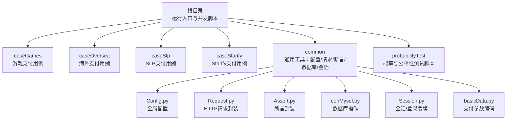
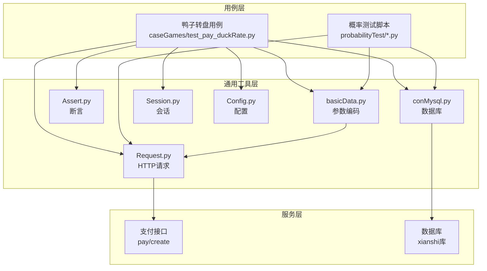
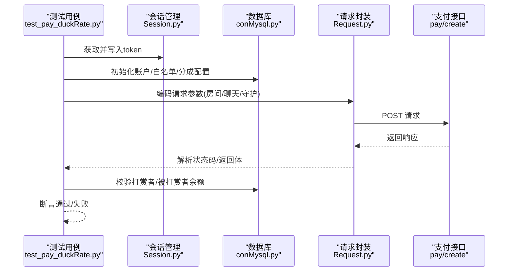
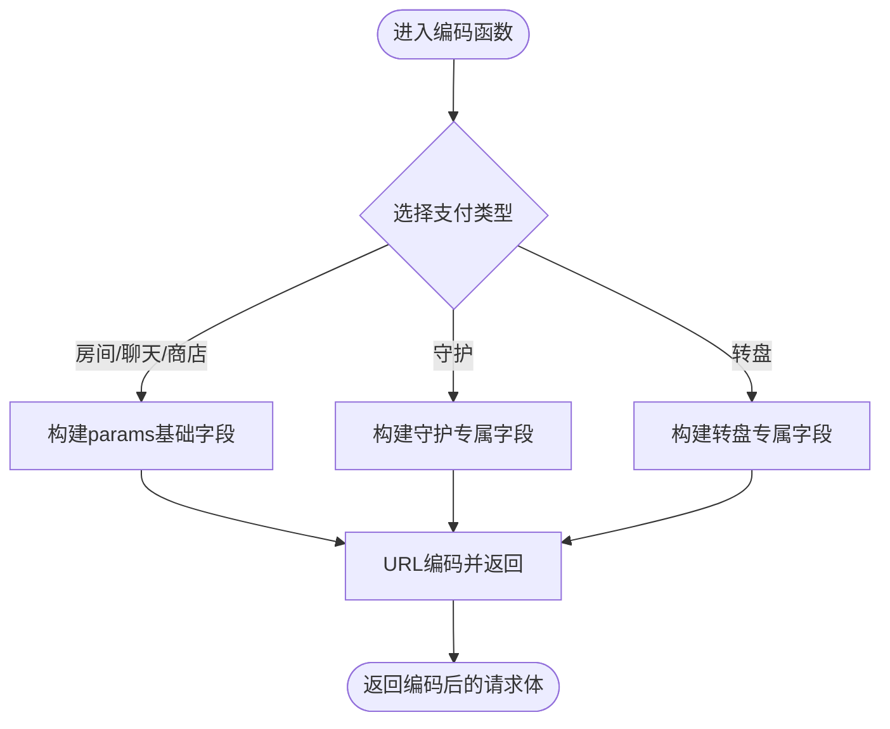
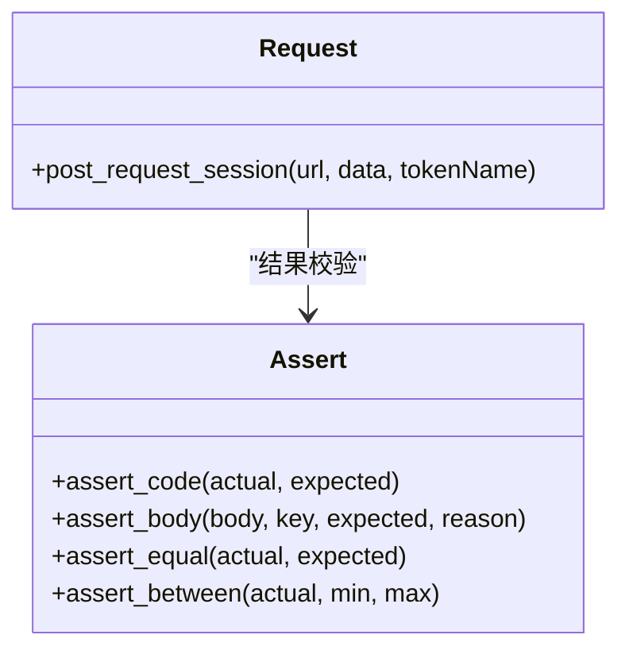
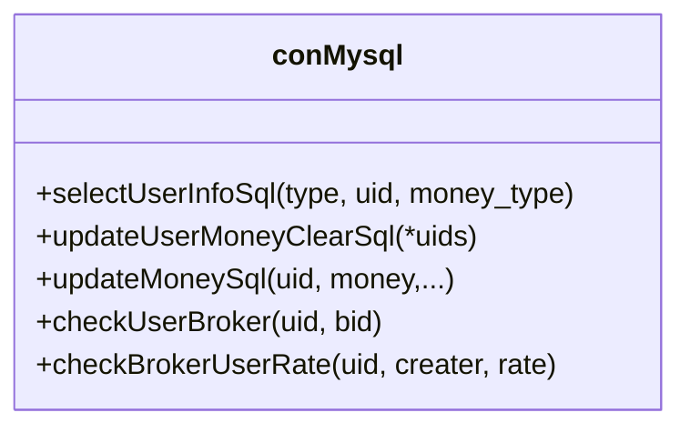
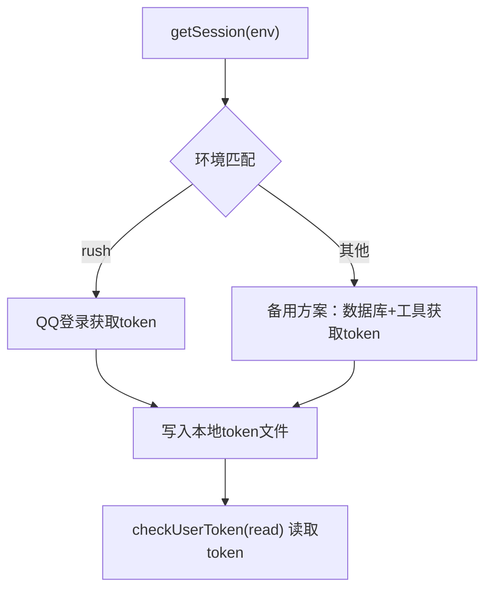
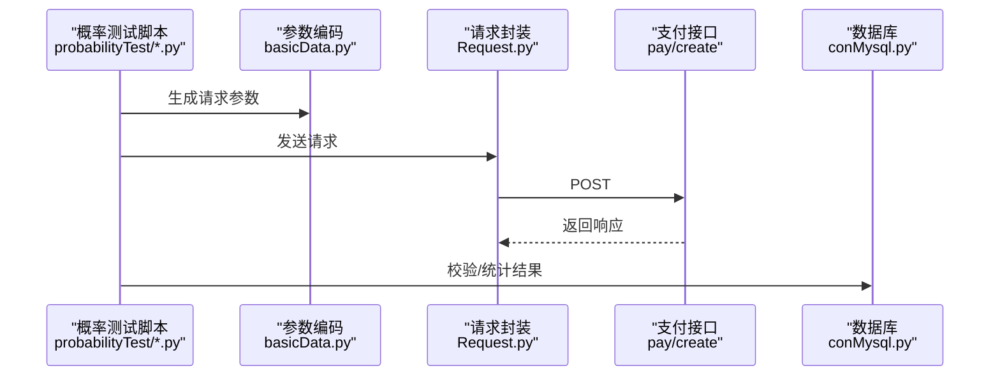
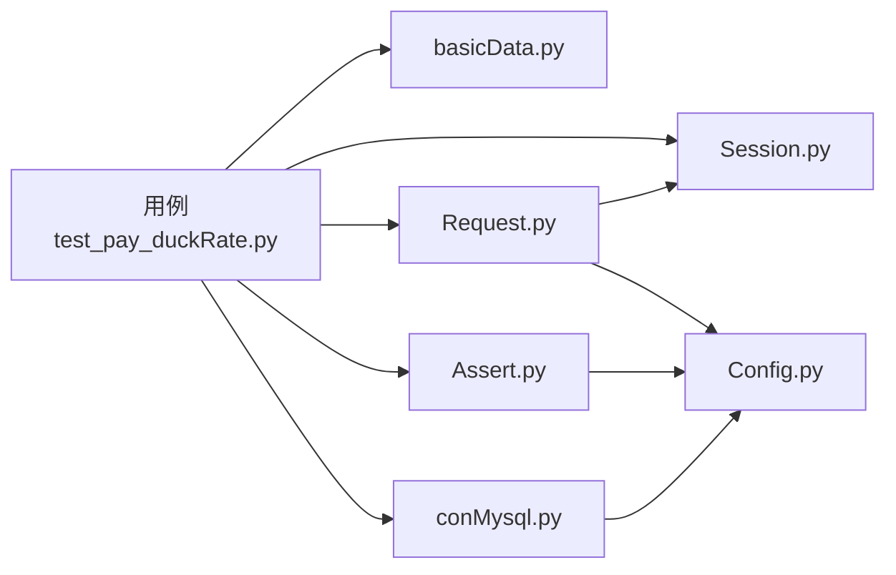

# 游戏平台

<cite>
**本文引用的文件**
- [README.md](file://README.md)
- [run_all_case.py](file://run_all_case.py)
- [caseGames/test_pay_duckRate.py](file://caseGames/test_pay_duckRate.py)
- [common/basicData.py](file://common/basicData.py)
- [common/Request.py](file://common/Request.py)
- [common/conMysql.py](file://common/conMysql.py)
- [common/Assert.py](file://common/Assert.py)
- [common/Session.py](file://common/Session.py)
- [common/Config.py](file://common/Config.py)
- [probabilityTest/egg.py](file://probabilityTest/egg.py)
- [probabilityTest/ferris.py](file://probabilityTest/ferris.py)
- [probabilityTest/gift.py](file://probabilityTest/gift.py)
- [probabilityTest/live.py](file://probabilityTest/live.py)
- [probabilityTest/pk.py](file://probabilityTest/pk.py)
</cite>

## 目录
1. [简介](#简介)
2. [项目结构](#项目结构)
3. [核心组件](#核心组件)
4. [架构总览](#架构总览)
5. [详细组件分析](#详细组件分析)
6. [依赖分析](#依赖分析)
7. [性能考虑](#性能考虑)
8. [故障排查指南](#故障排查指南)
9. [结论](#结论)
10. [附录](#附录)

## 简介
本技术文档聚焦于游戏平台的支付测试体系，尤其是“鸭子转盘”等娱乐性支付场景。文档从系统架构、数据模型、支付接口、用户体验设计、测试实现到概率与公平性验证，形成完整闭环。同时，对比传统支付平台，突出游戏平台在娱乐属性、概率机制与用户体验方面的差异化特点。

## 项目结构
该仓库采用按业务域与测试类型分层组织的方式：
- 根目录包含运行入口、并发测试脚本与通用工具模块
- caseGames 专用于游戏类支付用例（如鸭子转盘）
- caseOversea、caseSlp、caseStarify 分别覆盖海外、SLP、Starify 等业务域
- common 提供统一的配置、请求、断言、数据库操作、会话管理等基础能力
- probabilityTest 提供概率与公平性测试脚本（如幸运蛋、转盘、礼物等）

**图表来源**
- [run_all_case.py:126-147](file://run_all_case.py#L126-L147)
- [README.md:31-38](file://README.md#L31-L38)

**章节来源**
- [README.md:1-38](file://README.md#L1-L38)
- [run_all_case.py:126-147](file://run_all_case.py#L126-L147)

## 核心组件
- 配置中心：集中管理各应用域名、用户角色、礼物ID、房间ID、支付URL等
- 请求封装：统一封装HTTP POST请求，自动注入user-token与响应解析
- 断言封装：提供状态码、返回体字段、相等性、区间等断言方法
- 数据库操作：提供账户查询/更新、用户角色配置、白名单/分成配置等
- 会话管理：支持多应用登录态获取与持久化
- 支付参数编码：根据支付场景动态拼装请求参数（房间/聊天/守护/商店等）

**章节来源**
- [common/Config.py:6-133](file://common/Config.py#L6-L133)
- [common/Request.py:17-59](file://common/Request.py#L17-L59)
- [common/Assert.py:11-96](file://common/Assert.py#L11-L96)
- [common/conMysql.py:8-530](file://common/conMysql.py#L8-L530)
- [common/Session.py:13-200](file://common/Session.py#L13-L200)
- [common/basicData.py:9-581](file://common/basicData.py#L9-L581)

## 架构总览
整体测试架构由“用例驱动层 -> 通用工具层 -> 后端服务层”构成。用例通过参数编码与会话管理准备请求，经请求封装发送至支付接口，数据库工具负责前置/后置数据准备与校验，断言模块完成结果验证。

**图表来源**
- [caseGames/test_pay_duckRate.py:13-102](file://caseGames/test_pay_duckRate.py#L13-L102)
- [common/basicData.py:9-581](file://common/basicData.py#L9-L581)
- [common/Request.py:17-59](file://common/Request.py#L17-L59)
- [common/conMysql.py:8-530](file://common/conMysql.py#L8-L530)
- [common/Session.py:13-200](file://common/Session.py#L13-L200)
- [common/Config.py:6-133](file://common/Config.py#L6-L133)

## 详细组件分析

### 鸭子转盘支付用例（游戏场景）
该用例覆盖房间打赏、私聊打赏、个人守护三种场景下的自定义分成比例验证，重点在于“被打赏者收益=打赏金额×分成比例”的一致性校验。

**图表来源**
- [caseGames/test_pay_duckRate.py:13-102](file://caseGames/test_pay_duckRate.py#L13-L102)
- [common/Session.py:19-87](file://common/Session.py#L19-L87)
- [common/conMysql.py:336-361](file://common/conMysql.py#L336-L361)
- [common/Request.py:17-59](file://common/Request.py#L17-L59)
- [common/basicData.py:9-233](file://common/basicData.py#L9-L233)

**章节来源**
- [caseGames/test_pay_duckRate.py:22-102](file://caseGames/test_pay_duckRate.py#L22-L102)
- [common/Session.py:19-87](file://common/Session.py#L19-L87)
- [common/conMysql.py:336-361](file://common/conMysql.py#L336-L361)
- [common/Request.py:17-59](file://common/Request.py#L17-L59)
- [common/basicData.py:9-233](file://common/basicData.py#L9-L233)

### 支付参数编码（多场景适配）
参数编码模块根据支付类型（房间/聊天/守护/商店/转盘等）动态组装请求体，确保不同场景下字段一致性与正确性。

**图表来源**
- [common/basicData.py:9-581](file://common/basicData.py#L9-L581)

**章节来源**
- [common/basicData.py:9-581](file://common/basicData.py#L9-L581)

### 请求封装与断言
请求封装统一处理headers、SSL校验、超时与响应解析；断言模块提供多种断言方法，覆盖状态码、返回体字段、数值范围等。

**图表来源**
- [common/Request.py:17-59](file://common/Request.py#L17-L59)
- [common/Assert.py:11-96](file://common/Assert.py#L11-L96)

**章节来源**
- [common/Request.py:17-59](file://common/Request.py#L17-L59)
- [common/Assert.py:11-96](file://common/Assert.py#L11-L96)

### 数据库工具（账户与角色）
数据库工具提供账户余额初始化、白名单/分成配置、用户角色设置等能力，支撑支付前后的数据一致性校验。

**图表来源**
- [common/conMysql.py:8-530](file://common/conMysql.py#L8-L530)

**章节来源**
- [common/conMysql.py:8-530](file://common/conMysql.py#L8-L530)

### 会话管理（多应用登录态）
会话管理支持不同应用的登录态获取与持久化，避免重复登录与token失效问题。

**图表来源**
- [common/Session.py:19-87](file://common/Session.py#L19-L87)
- [common/Session.py:168-182](file://common/Session.py#L168-L182)

**章节来源**
- [common/Session.py:19-87](file://common/Session.py#L19-L87)
- [common/Session.py:168-182](file://common/Session.py#L168-L182)

### 概率与公平性测试脚本
概率测试脚本覆盖幸运蛋、礼物、PK房等场景，通过大量并发请求统计命中分布，评估概率与公平性。

**图表来源**
- [probabilityTest/egg.py:19-73](file://probabilityTest/egg.py#L19-L73)
- [probabilityTest/gift.py:9-53](file://probabilityTest/gift.py#L9-L53)
- [probabilityTest/pk.py:8-49](file://probabilityTest/pk.py#L8-L49)
- [common/basicData.py:9-581](file://common/basicData.py#L9-L581)
- [common/Request.py:17-59](file://common/Request.py#L17-L59)
- [common/conMysql.py:8-530](file://common/conMysql.py#L8-L530)

**章节来源**
- [probabilityTest/egg.py:19-73](file://probabilityTest/egg.py#L19-L73)
- [probabilityTest/gift.py:9-53](file://probabilityTest/gift.py#L9-L53)
- [probabilityTest/pk.py:8-49](file://probabilityTest/pk.py#L8-L49)
- [probabilityTest/ferris.py:11-24](file://probabilityTest/ferris.py#L11-L24)
- [probabilityTest/live.py:9-27](file://probabilityTest/live.py#L9-L27)

## 依赖分析
- 用例依赖：用例依赖参数编码、会话管理、请求封装、断言与数据库工具
- 工具依赖：请求封装依赖会话管理与配置；断言依赖配置与全局常量；数据库工具依赖配置中的数据库连接信息
- 外部依赖：支付接口、数据库、第三方登录接口

**图表来源**
- [caseGames/test_pay_duckRate.py:13-102](file://caseGames/test_pay_duckRate.py#L13-L102)
- [common/basicData.py:9-581](file://common/basicData.py#L9-L581)
- [common/Request.py:17-59](file://common/Request.py#L17-L59)
- [common/Assert.py:11-96](file://common/Assert.py#L11-L96)
- [common/conMysql.py:8-530](file://common/conMysql.py#L8-L530)
- [common/Config.py:6-133](file://common/Config.py#L6-L133)

**章节来源**
- [caseGames/test_pay_duckRate.py:13-102](file://caseGames/test_pay_duckRate.py#L13-L102)
- [common/Request.py:17-59](file://common/Request.py#L17-L59)
- [common/Assert.py:11-96](file://common/Assert.py#L11-L96)
- [common/conMysql.py:8-530](file://common/conMysql.py#L8-L530)
- [common/Config.py:6-133](file://common/Config.py#L6-L133)

## 性能考虑
- 并发与限流：概率测试脚本中使用协程或循环并发调用，需关注接口限流与数据库写入压力
- 响应时间：请求封装已记录毫秒级耗时，可用于性能回归监控
- 数据库事务：批量更新/插入建议合并提交，减少往返次数
- 会话复用：尽量复用已获取的token，避免频繁登录

## 故障排查指南
- 接口异常：检查请求封装中的状态码断言与响应解析，定位网络/鉴权/参数错误
- 数据不一致：核对数据库工具的查询/更新SQL，确认前置数据清理与白名单配置
- 断言失败：结合断言模块输出的失败原因，逐项检查期望值与实际值
- 会话失效：重新获取token并写入本地文件，或切换备用登录方案

**章节来源**
- [common/Request.py:17-59](file://common/Request.py#L17-L59)
- [common/Assert.py:11-96](file://common/Assert.py#L11-L96)
- [common/conMysql.py:336-361](file://common/conMysql.py#L336-L361)
- [common/Session.py:19-87](file://common/Session.py#L19-L87)

## 结论
本测试体系围绕游戏平台的娱乐支付场景，提供了从参数编码、会话管理、请求封装、断言校验到数据库校验的全链路保障。通过概率与公平性测试脚本，能够持续验证转盘等随机玩法的稳定性与公正性。建议在后续迭代中进一步完善转盘规则与概率配置的自动化校验，并引入更细粒度的性能与稳定性指标。

## 附录

### 游戏平台与传统支付平台的差异
- 娱乐属性：游戏支付强调互动与娱乐体验，接口与前端交互需快速反馈
- 概率机制：转盘/礼物等存在概率分布，需通过大量样本统计进行公平性验证
- 用户体验：低延迟、高成功率、即时到账与奖励发放是关键指标
- 配置管理：分成比例、白名单、房间/礼物映射等配置需可热更新与可审计

### 测试策略与最佳实践
- 用例分层：基础支付、场景特化（房间/聊天/守护）、概率公平性
- 数据治理：用例前后自动清理与初始化，避免跨用例污染
- 并发控制：合理设置并发度与延时，平衡吞吐与稳定性
- 可观测性：记录请求耗时、断言失败原因，便于问题定位与回归