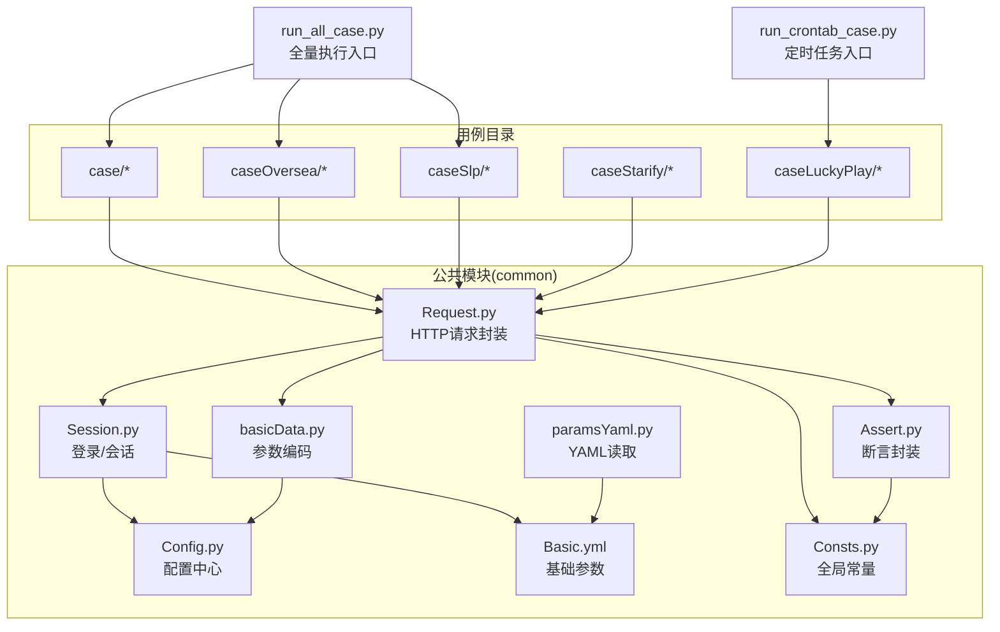
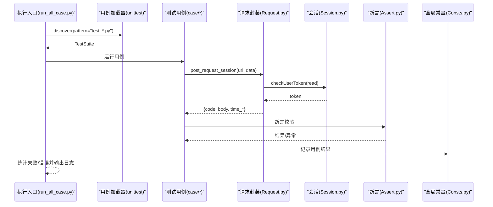
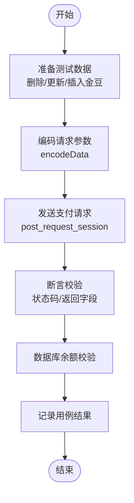
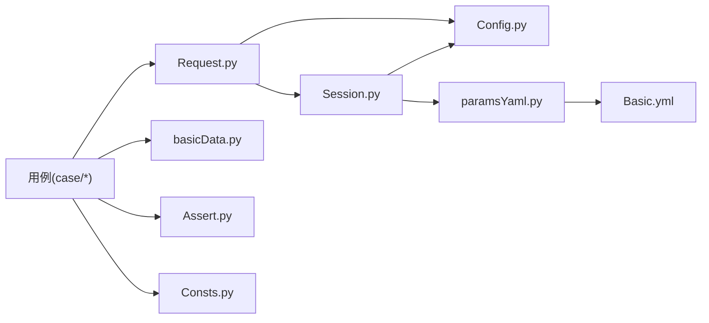

# 快速开始

<cite>
**本文引用的文件**
- [README.md](file://README.md)
- [requirements.txt](file://requirements.txt)
- [run_all_case.py](file://run_all_case.py)
- [run_crontab_case.py](file://run_crontab_case.py)
- [common/Config.py](file://common/Config.py)
- [common/Basic.yml](file://common/Basic.yml)
- [common/paramsYaml.py](file://common/paramsYaml.py)
- [common/Session.py](file://common/Session.py)
- [common/Request.py](file://common/Request.py)
- [common/basicData.py](file://common/basicData.py)
- [common/Assert.py](file://common/Assert.py)
- [common/Consts.py](file://common/Consts.py)
- [case/test_pay_bean.py](file://case/test_pay_bean.py)
- [others/env.php](file://others/env.php)
</cite>

## 目录
1. [简介](#简介)
2. [项目结构](#项目结构)
3. [核心组件](#核心组件)
4. [架构总览](#架构总览)
5. [详细组件分析](#详细组件分析)
6. [依赖关系分析](#依赖关系分析)
7. [性能与并发](#性能与并发)
8. [故障排除指南](#故障排除指南)
9. [结论](#结论)
10. [附录](#附录)

## 简介
本指南面向首次接触 QA 支付测试自动化项目的新人，目标是帮助你在最短时间内完成环境准备、配置与执行第一个测试用例，并掌握批量执行、报告查看与常见问题排查的方法。项目基于 Python 与 pytest 框架，通过统一的配置中心、请求封装与断言模块，覆盖多应用（APP、SLP 等）的支付场景。

## 项目结构
项目采用“按功能域分层 + 按业务域分组”的组织方式：
- common：公共能力（配置、请求、断言、日志、YAML 解析、会话管理、常量等）
- case / caseOversea / caseSlp / caseStarify / caseLuckyPlay：各业务域的测试用例
- others：辅助脚本与环境配置示例
- 根目录脚本：批量执行、定时任务执行入口

图表来源
- [run_all_case.py:126-147](file://run_all_case.py#L126-L147)
- [run_crontab_case.py:9-24](file://run_crontab_case.py#L9-L24)
- [common/Config.py:6-133](file://common/Config.py#L6-L133)
- [common/Basic.yml:1-52](file://common/Basic.yml#L1-L52)
- [common/paramsYaml.py:8-32](file://common/paramsYaml.py#L8-L32)
- [common/Session.py:13-200](file://common/Session.py#L13-L200)
- [common/Request.py:17-162](file://common/Request.py#L17-L162)
- [common/basicData.py:8-581](file://common/basicData.py#L8-L581)
- [common/Assert.py:11-96](file://common/Assert.py#L11-L96)
- [common/Consts.py:4-17](file://common/Consts.py#L4-L17)

章节来源
- [README.md:1-38](file://README.md#L1-L38)
- [run_all_case.py:126-147](file://run_all_case.py#L126-L147)
- [run_crontab_case.py:9-24](file://run_crontab_case.py#L9-L24)

## 核心组件
- 配置中心：集中管理各环境 URL、用户 UID、房间 ID、礼物 ID、应用名称与服务器节点等
- 请求封装：统一封装 POST 请求，自动注入 user-token、处理异常与响应解析
- 断言封装：提供多种断言方法，统一失败原因收集
- 会话管理：根据环境选择登录路径，优先使用登录接口获取 token，失败时回退到数据库取 token
- 参数编码：根据 payType 生成不同场景的请求参数
- YAML 读取：跨平台兼容地读取基础参数

章节来源
- [common/Config.py:6-133](file://common/Config.py#L6-L133)
- [common/Request.py:17-162](file://common/Request.py#L17-L162)
- [common/Assert.py:11-96](file://common/Assert.py#L11-L96)
- [common/Session.py:19-200](file://common/Session.py#L19-L200)
- [common/basicData.py:8-581](file://common/basicData.py#L8-L581)
- [common/paramsYaml.py:8-32](file://common/paramsYaml.py#L8-L32)

## 架构总览
下面的序列图展示了从“执行入口”到“用例执行与结果统计”的整体流程。

图表来源
- [run_all_case.py:126-147](file://run_all_case.py#L126-L147)
- [common/Request.py:17-59](file://common/Request.py#L17-L59)
- [common/Session.py:168-183](file://common/Session.py#L168-L183)
- [common/Assert.py:11-96](file://common/Assert.py#L11-L96)
- [common/Consts.py:4-17](file://common/Consts.py#L4-L17)

## 详细组件分析

### 环境与依赖准备
- Python 环境
  - 使用 Python 3.x（建议 3.8+），确保 pip 可用
- 依赖安装
  - 在项目根目录执行安装命令，一次性安装 requirements.txt 中所有依赖
  - 参考：[requirements.txt:1-85](file://requirements.txt#L1-L85)
- 项目说明
  - README 对通用类设计、pytest 使用规则有简要说明
  - 参考：[README.md:23-31](file://README.md#L23-L31)

章节来源
- [requirements.txt:1-85](file://requirements.txt#L1-L85)
- [README.md:23-31](file://README.md#L23-L31)

### 配置文件设置
- 应用与环境配置
  - 在配置中心中定义了多个应用与环境的访问地址、代码分支、服务器节点等
  - 参考：[common/Config.py:9-45](file://common/Config.py#L9-L45)
- URL 参数与登录接口
  - 支付接口 URL、登录接口 URL、PT/SLP 的 host 等均在配置中心集中维护
  - 参考：[common/Config.py:47-55](file://common/Config.py#L47-L55)
- 用户与房间配置
  - 包含打赏者、被打赏者、GS 用户、房间 ID、礼物 ID 等
  - 参考：[common/Config.py:60-120](file://common/Config.py#L60-L120)
- 基础参数（Headers、登录参数等）
  - 通过 YAML 文件维护，跨平台读取
  - 参考：[common/Basic.yml:2-35](file://common/Basic.yml#L2-L35)
- YAML 读取
  - paramsYaml 提供跨平台安全读取
  - 参考：[common/paramsYaml.py:8-32](file://common/paramsYaml.py#L8-L32)

章节来源
- [common/Config.py:9-120](file://common/Config.py#L9-L120)
- [common/Basic.yml:2-35](file://common/Basic.yml#L2-L35)
- [common/paramsYaml.py:8-32](file://common/paramsYaml.py#L8-L32)

### 会话与登录
- 登录流程
  - 根据环境选择登录路径：dev、PT 手机登录、SLP 手机登录等
  - 成功后写入 token 到本地文件，后续请求直接读取
  - 参考：[common/Session.py:19-163](file://common/Session.py#L19-L163)
- Token 读写
  - 本地文本文件存储 token，避免重复登录
  - 参考：[common/Session.py:168-183](file://common/Session.py#L168-L183)

章节来源
- [common/Session.py:19-163](file://common/Session.py#L19-L163)
- [common/Session.py:168-183](file://common/Session.py#L168-L183)

### 请求封装与参数编码
- 请求封装
  - 统一 POST 请求，自动注入 user-token、关闭证书校验、解析响应
  - 参考：[common/Request.py:17-59](file://common/Request.py#L17-L59)
- 参数编码
  - 根据 payType 生成不同场景的请求体（房间/私聊/商城/防守等）
  - 参考：[common/basicData.py:8-581](file://common/basicData.py#L8-L581)

章节来源
- [common/Request.py:17-59](file://common/Request.py#L17-L59)
- [common/basicData.py:8-581](file://common/basicData.py#L8-L581)

### 断言与结果记录
- 断言方法
  - 提供状态码、长度、相等性、包含文本、区间等多种断言
  - 参考：[common/Assert.py:11-96](file://common/Assert.py#L11-L96)
- 结果记录
  - 用例执行成功/失败都会写入全局字典与失败原因列表
  - 参考：[common/Consts.py:4-17](file://common/Consts.py#L4-L17)

章节来源
- [common/Assert.py:11-96](file://common/Assert.py#L11-L96)
- [common/Consts.py:4-17](file://common/Consts.py#L4-L17)

### 第一个测试用例：金豆支付
- 用例文件
  - 示例用例位于 case 目录，演示了“金豆不足”、“金豆足够”、“金豆转钻”等场景
  - 参考：[case/test_pay_bean.py:12-277](file://case/test_pay_bean.py#L12-L277)
- 执行流程
  - 数据准备：删除/更新/插入金豆与余额
  - 发送请求：调用编码后的参数与支付接口
  - 断言校验：状态码、返回字段、数据库余额
  - 结果记录：写入全局字典
- 关键步骤参考
  - 数据准备与清理：setUp/tearDown
  - 编码参数：encodeData
  - 发送请求：post_request_session
  - 断言：assert_code/assert_body
  - 结果记录：case_list[result]

图表来源
- [case/test_pay_bean.py:16-277](file://case/test_pay_bean.py#L16-L277)
- [common/basicData.py:8-581](file://common/basicData.py#L8-L581)
- [common/Request.py:17-59](file://common/Request.py#L17-L59)
- [common/Assert.py:11-96](file://common/Assert.py#L11-L96)
- [common/Consts.py:4-17](file://common/Consts.py#L4-L17)

章节来源
- [case/test_pay_bean.py:12-277](file://case/test_pay_bean.py#L12-L277)

### 执行入口与批量运行
- 全量执行入口
  - 自动发现用例目录中的 test_*.py，构建 TestSuite 后运行
  - 参考：[run_all_case.py:126-147](file://run_all_case.py#L126-L147)
- 定时任务入口
  - 针对特定业务域（如 LuckyPlay）的定时执行
  - 参考：[run_crontab_case.py:9-24](file://run_crontab_case.py#L9-L24)

章节来源
- [run_all_case.py:126-147](file://run_all_case.py#L126-L147)
- [run_crontab_case.py:9-24](file://run_crontab_case.py#L9-L24)

## 依赖关系分析
- 组件耦合
  - 用例依赖 Request、basicData、Assert、Consts
  - Request 依赖 Session 与 Config
  - Session 依赖 Config 与 YAML
  - YAML 通过 paramsYaml 读取 Basic.yml
- 外部依赖
  - requests、pytest、PyYAML、urllib3 等

图表来源
- [case/test_pay_bean.py:1-10](file://case/test_pay_bean.py#L1-L10)
- [common/Request.py:1-15](file://common/Request.py#L1-L15)
- [common/Session.py:1-11](file://common/Session.py#L1-L11)
- [common/paramsYaml.py:1-6](file://common/paramsYaml.py#L1-L6)
- [common/Basic.yml:1-2](file://common/Basic.yml#L1-L2)
- [common/Config.py:1-10](file://common/Config.py#L1-L10)

章节来源
- [case/test_pay_bean.py:1-10](file://case/test_pay_bean.py#L1-L10)
- [common/Request.py:1-15](file://common/Request.py#L1-L15)
- [common/Session.py:1-11](file://common/Session.py#L1-L11)
- [common/paramsYaml.py:1-6](file://common/paramsYaml.py#L1-L6)
- [common/Basic.yml:1-2](file://common/Basic.yml#L1-L2)
- [common/Config.py:1-10](file://common/Config.py#L1-L10)

## 性能与并发
- 请求性能
  - Request 封装中包含毫秒级耗时统计，便于定位慢接口
  - 参考：[common/Request.py:48-58](file://common/Request.py#L48-L58)
- 并发与统计
  - Consts 中提供并发计数与时间记录，便于扩展并发执行
  - 参考：[common/Consts.py:12-17](file://common/Consts.py#L12-L17)
- 建议
  - 在本地调试阶段尽量串行执行，减少并发带来的资源竞争
  - 如需并发，请在用例中加入互斥或独立数据隔离策略

章节来源
- [common/Request.py:48-58](file://common/Request.py#L48-L58)
- [common/Consts.py:12-17](file://common/Consts.py#L12-L17)

## 故障排除指南
- 依赖缺失
  - 症状：安装时报错或导入失败
  - 处理：确认 requirements.txt 已正确安装
  - 参考：[requirements.txt:1-85](file://requirements.txt#L1-L85)
- YAML 读取异常
  - 症状：读取 Basic.yml 失败或返回 None
  - 处理：检查 YAML 文件路径与键名；paramsYaml 已做跨平台兼容
  - 参考：[common/paramsYaml.py:17-32](file://common/paramsYaml.py#L17-L32)
- 登录失败或 Token 为空
  - 症状：会话读取报空
  - 处理：先走登录流程写入 token，或检查登录接口返回
  - 参考：[common/Session.py:168-183](file://common/Session.py#L168-L183)
- 请求异常
  - 症状：post_request_session 抛出异常或返回空
  - 处理：检查 URL、参数编码、网络连通性
  - 参考：[common/Request.py:40-46](file://common/Request.py#L40-L46)
- 断言失败
  - 症状：断言抛出异常并记录失败原因
  - 处理：查看失败原因列表与日志文件
  - 参考：[common/Assert.py:20-26](file://common/Assert.py#L20-L26)
- 环境变量
  - 症状：PHP 环境常量未生效
  - 处理：确认 Nginx 或运行环境已定义 ENV
  - 参考：[others/env.php:1-5](file://others/env.php#L1-L5)

章节来源
- [requirements.txt:1-85](file://requirements.txt#L1-L85)
- [common/paramsYaml.py:17-32](file://common/paramsYaml.py#L17-L32)
- [common/Session.py:168-183](file://common/Session.py#L168-L183)
- [common/Request.py:40-46](file://common/Request.py#L40-L46)
- [common/Assert.py:20-26](file://common/Assert.py#L20-L26)
- [others/env.php:1-5](file://others/env.php#L1-L5)

## 结论
通过本指南，你已经完成了环境准备、配置设置、第一个用例的执行与结果记录，并掌握了批量执行、故障排查与性能关注点。建议在正式环境中：
- 明确各环境的 URL 与用户配置
- 使用独立数据隔离与互斥机制进行并发执行
- 借助断言失败原因与日志文件快速定位问题
- 将常用配置沉淀为模板，提升团队协作效率

## 附录

### 常见操作清单
- 安装依赖
  - 在项目根目录执行安装命令
  - 参考：[requirements.txt:1-85](file://requirements.txt#L1-L85)
- 配置环境
  - 修改配置中心中的 appInfo、用户 UID、房间 ID、礼物 ID
  - 参考：[common/Config.py:9-120](file://common/Config.py#L9-L120)
- 设置登录参数
  - 更新 Basic.yml 中的 headers 与登录参数
  - 参考：[common/Basic.yml:2-35](file://common/Basic.yml#L2-L35)
- 执行单个用例
  - 使用 pytest 直接运行具体用例文件
  - 参考：[README.md:25-29](file://README.md#L25-L29)
- 批量执行
  - 使用 run_all_case.py 或 run_crontab_case.py
  - 参考：[run_all_case.py:126-147](file://run_all_case.py#L126-L147)、[run_crontab_case.py:9-24](file://run_crontab_case.py#L9-L24)
- 查看报告
  - 查看控制台输出与日志文件（如 caseResult.log、failCase.log）
  - 参考：[run_all_case.py:18-20](file://run_all_case.py#L18-L20)、[run_all_case.py:34-44](file://run_all_case.py#L34-L44)

章节来源
- [requirements.txt:1-85](file://requirements.txt#L1-L85)
- [common/Config.py:9-120](file://common/Config.py#L9-L120)
- [common/Basic.yml:2-35](file://common/Basic.yml#L2-L35)
- [README.md:25-29](file://README.md#L25-L29)
- [run_all_case.py:18-20](file://run_all_case.py#L18-L20)
- [run_all_case.py:34-44](file://run_all_case.py#L34-L44)
- [run_all_case.py:126-147](file://run_all_case.py#L126-L147)
- [run_crontab_case.py:9-24](file://run_crontab_case.py#L9-L24)