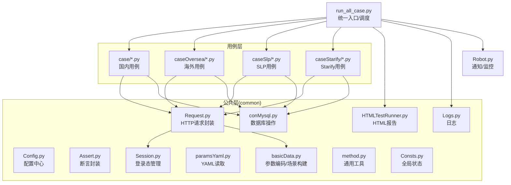
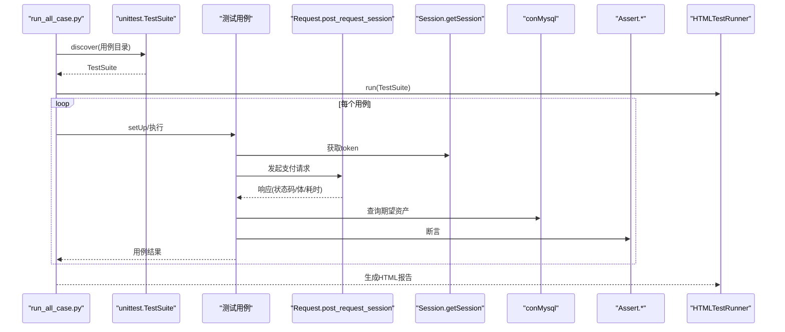
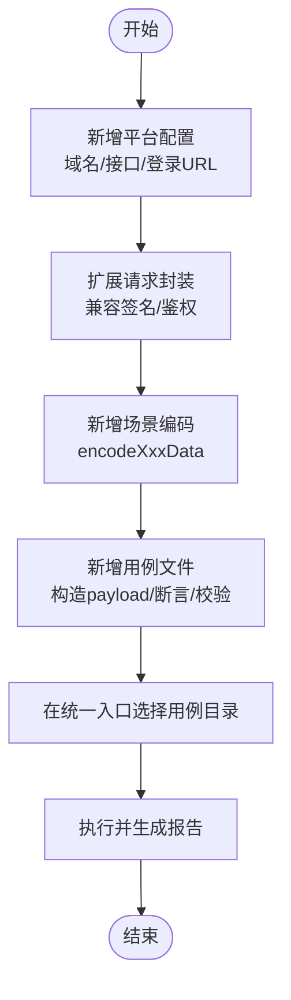
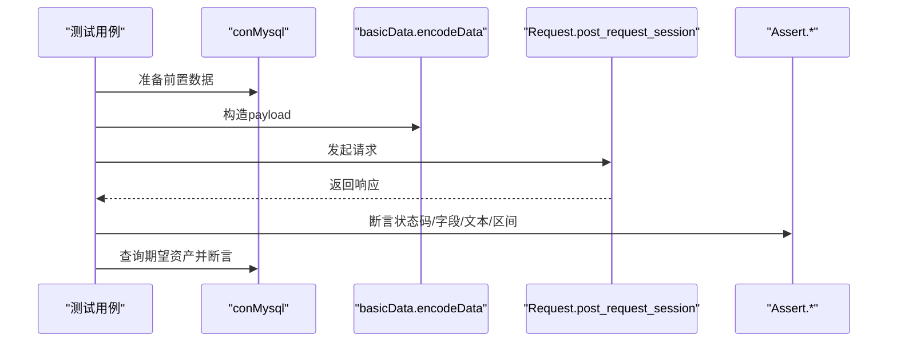
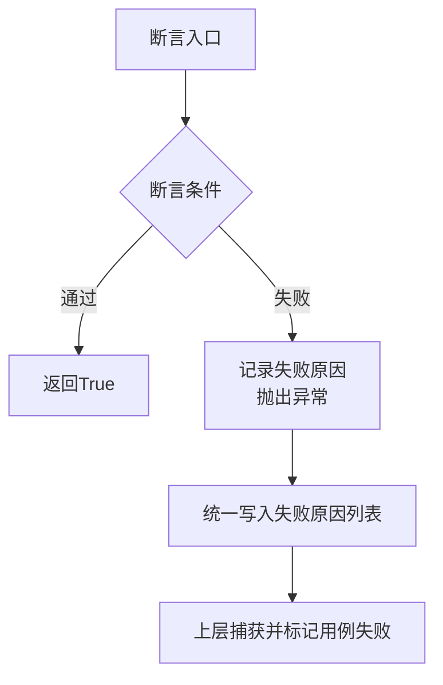
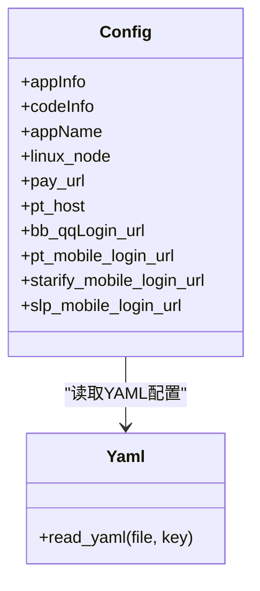
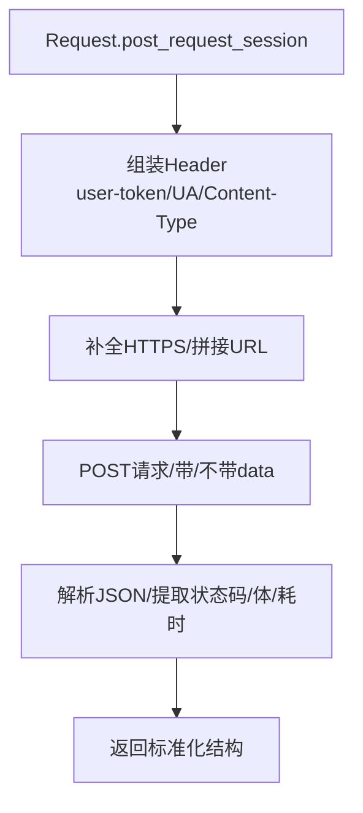
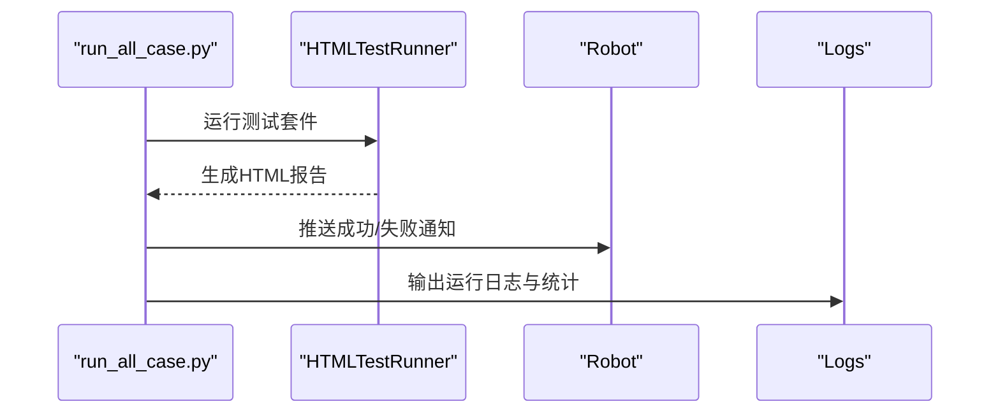
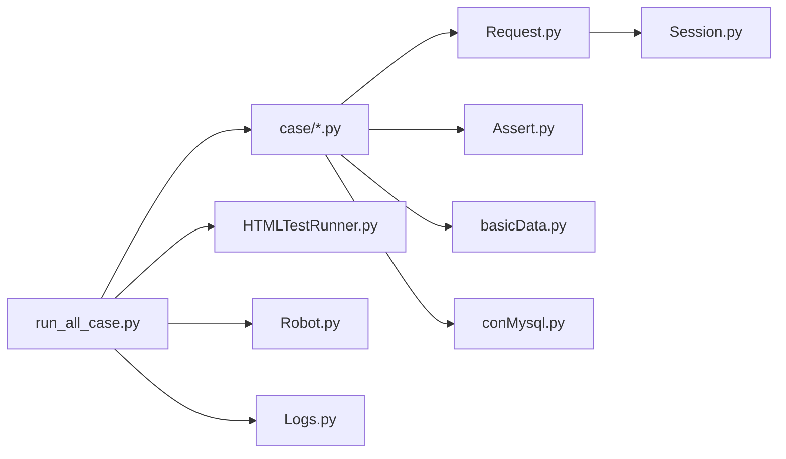

# 扩展与定制

<cite>
**本文引用的文件**
- [README.md](file://README.md)
- [requirements.txt](file://requirements.txt)
- [run_all_case.py](file://run_all_case.py)
- [common/Config.py](file://common/Config.py)
- [common/Request.py](file://common/Request.py)
- [common/Assert.py](file://common/Assert.py)
- [common/HTMLTestRunner.py](file://common/HTMLTestRunner.py)
- [common/Logs.py](file://common/Logs.py)
- [common/Session.py](file://common/Session.py)
- [common/paramsYaml.py](file://common/paramsYaml.py)
- [common/basicData.py](file://common/basicData.py)
- [common/conMysql.py](file://common/conMysql.py)
- [common/method.py](file://common/method.py)
- [common/Consts.py](file://common/Consts.py)
- [Robot.py](file://Robot.py)
- [case/test_pay_business.py](file://case/test_pay_business.py)
</cite>

## 目录
1. [简介](#简介)
2. [项目结构](#项目结构)
3. [核心组件](#核心组件)
4. [架构总览](#架构总览)
5. [详细组件分析](#详细组件分析)
6. [依赖分析](#依赖分析)
7. [性能考虑](#性能考虑)
8. [故障排查指南](#故障排查指南)
9. [结论](#结论)
10. [附录](#附录)

## 简介
本指南面向为QA支付测试自动化项目进行“扩展与定制”的开发者，围绕以下目标展开：
- 如何为新平台添加支持：接口适配、数据模型映射、测试用例扩展的完整流程
- 如何新增支付场景测试用例：测试逻辑设计、数据准备与验证方法
- 自定义断言方法的开发指南与最佳实践
- 配置系统的扩展机制：新增配置项与修改现有配置的方法
- Request模块的扩展点与自定义请求处理实现
- 测试报告、通知系统与监控集成的扩展方案

## 项目结构
该项目采用按功能域划分的组织方式，核心目录与职责如下：
- common：公共基础能力（配置、请求、断言、日志、报告、会话、数据库、工具）
- case / caseOversea / caseSlp / caseStarify：按业务线划分的测试用例集合
- probabilityTest：概率性玩法测试（如转盘、盲盒等）
- 根目录脚本：统一入口与调度（如批量执行、定时任务）

**图示来源**
- [run_all_case.py:126-147](file://run_all_case.py#L126-L147)
- [common/Request.py:17-59](file://common/Request.py#L17-L59)
- [common/basicData.py:8-325](file://common/basicData.py#L8-L325)
- [common/conMysql.py:28-204](file://common/conMysql.py#L28-L204)
- [common/HTMLTestRunner.py:516-691](file://common/HTMLTestRunner.py#L516-L691)
- [common/Logs.py:8-47](file://common/Logs.py#L8-L47)
- [Robot.py:6-34](file://Robot.py#L6-L34)

**章节来源**
- [README.md:1-38](file://README.md#L1-L38)
- [requirements.txt:1-85](file://requirements.txt#L1-L85)
- [run_all_case.py:12-159](file://run_all_case.py#L12-L159)

## 核心组件
- 配置中心（Config）：集中管理应用信息、代码路径、服务器地址、用户与房间配置、礼物ID等
- 请求封装（Request）：统一POST请求、自动补全HTTPS、解析响应、统计耗时
- 断言封装（Assert）：提供状态码、长度、相等、文本包含、字段值断言与区间断言
- 数据编码（basicData）：按支付场景构造URL编码参数，覆盖聊天礼物、商店购买、守护升级等
- 数据库操作（conMysql）：查询/更新/插入用户资产、背包、工会、守护关系等
- 日志（Logs）：控制台与文件双通道，支持按午夜轮转
- 报告（HTMLTestRunner）：生成HTML测试报告，含饼图与结果筛选
- 会话（Session）：从YAML读取登录参数，调用登录接口获取token并持久化
- 工具（method）：字典转列表、随机图片、JSON键遍历、失败计数、用例描述拼接
- 统计（Consts）：全局用例列表、失败原因、并发统计、时间戳
- 通知（Robot）：支持多种模式（成功/失败/Markdown/Slack等）推送

**章节来源**
- [common/Config.py:6-133](file://common/Config.py#L6-L133)
- [common/Request.py:17-59](file://common/Request.py#L17-L59)
- [common/Assert.py:11-96](file://common/Assert.py#L11-L96)
- [common/basicData.py:8-325](file://common/basicData.py#L8-L325)
- [common/conMysql.py:28-204](file://common/conMysql.py#L28-L204)
- [common/Logs.py:8-47](file://common/Logs.py#L8-L47)
- [common/HTMLTestRunner.py:516-691](file://common/HTMLTestRunner.py#L516-L691)
- [common/Session.py:19-162](file://common/Session.py#L19-L162)
- [common/method.py:26-171](file://common/method.py#L26-L171)
- [common/Consts.py:4-17](file://common/Consts.py#L4-L17)
- [Robot.py:6-34](file://Robot.py#L6-L34)

## 架构总览
整体采用“用例驱动 + 公共基础能力”架构。用例通过公共模块完成登录态获取、参数构造、HTTP请求、断言与数据库校验，并由统一入口调度执行与产出报告。

**图示来源**
- [run_all_case.py:126-147](file://run_all_case.py#L126-L147)
- [common/Request.py:17-59](file://common/Request.py#L17-L59)
- [common/Session.py:19-162](file://common/Session.py#L19-L162)
- [common/conMysql.py:28-204](file://common/conMysql.py#L28-L204)
- [common/HTMLTestRunner.py:516-691](file://common/HTMLTestRunner.py#L516-L691)

## 详细组件分析

### 新平台接入流程（接口适配、数据模型映射、测试用例扩展）
- 接口适配
  - 在配置中心新增平台域名与接口地址，参考现有键值对与登录URL
  - 在请求封装中扩展或复用现有POST方法，确保自动补全HTTPS与解析响应
  - 若需要签名/鉴权，可在会话模块中扩展读取YAML参数并生成签名，再注入到请求头或查询参数
- 数据模型映射
  - 在数据编码模块新增对应场景的参数构造函数，遵循现有命名规范（如encodeXxxData）
  - 映射礼物ID、房间ID、用户UID等常量，避免硬编码
- 测试用例扩展
  - 在对应case目录下新增用例文件，遵循Pytest命名与类/方法命名约定
  - 在用例中调用数据编码函数构造payload，调用请求封装发起请求，使用断言封装与数据库校验
  - 在统一入口中根据平台选择用例目录并discover执行

**图示来源**
- [common/Config.py:6-133](file://common/Config.py#L6-L133)
- [common/Request.py:17-59](file://common/Request.py#L17-L59)
- [common/basicData.py:8-325](file://common/basicData.py#L8-L325)
- [run_all_case.py:126-147](file://run_all_case.py#L126-L147)

**章节来源**
- [common/Config.py:6-133](file://common/Config.py#L6-L133)
- [common/Request.py:17-59](file://common/Request.py#L17-L59)
- [common/basicData.py:8-325](file://common/basicData.py#L8-L325)
- [run_all_case.py:126-147](file://run_all_case.py#L126-L147)

### 新增支付场景测试用例（逻辑设计、数据准备、验证方法）
- 逻辑设计
  - 明确场景前置条件（房间类型、礼物类型、用户角色）
  - 设计期望结果（资产变化、分成比例、VIP经验等）
- 数据准备
  - 使用数据库模块更新用户资产与背包
  - 使用数据编码模块构造payload
  - 使用会话模块获取token
- 验证方法
  - 使用断言封装进行状态码、字段值、文本包含、区间断言
  - 使用数据库查询进行最终资产核对

**图示来源**
- [case/test_pay_business.py:18-189](file://case/test_pay_business.py#L18-L189)
- [common/conMysql.py:28-204](file://common/conMysql.py#L28-L204)
- [common/basicData.py:8-325](file://common/basicData.py#L8-L325)
- [common/Request.py:17-59](file://common/Request.py#L17-L59)
- [common/Assert.py:11-96](file://common/Assert.py#L11-L96)

**章节来源**
- [case/test_pay_business.py:18-189](file://case/test_pay_business.py#L18-L189)
- [common/conMysql.py:28-204](file://common/conMysql.py#L28-L204)
- [common/basicData.py:8-325](file://common/basicData.py#L8-L325)
- [common/Request.py:17-59](file://common/Request.py#L17-L59)
- [common/Assert.py:11-96](file://common/Assert.py#L11-L96)

### 自定义断言方法开发指南与最佳实践
- 开发要点
  - 保持断言方法幂等、可重复执行
  - 对异常情况进行捕获并记录失败原因，便于定位问题
  - 提供清晰的失败提示，包含期望值与实际值
- 最佳实践
  - 在断言失败时统一写入全局失败原因列表，便于后续通知与统计
  - 对跨环境差异（如RPC延迟）进行容错处理
  - 对复杂嵌套JSON进行安全访问，避免KeyError

**图示来源**
- [common/Assert.py:11-96](file://common/Assert.py#L11-L96)
- [common/Consts.py:7-8](file://common/Consts.py#L7-L8)

**章节来源**
- [common/Assert.py:11-96](file://common/Assert.py#L11-L96)
- [common/Consts.py:7-8](file://common/Consts.py#L7-L8)

### 配置系统扩展机制（新增配置项与修改现有配置）
- 新增配置项
  - 在配置中心添加键值对，如平台域名、登录URL、用户ID、礼物ID等
  - 在YAML读取模块中新增键名，确保不同节点读取正确编码
- 修改现有配置
  - 通过统一入口选择平台，动态切换用例目录与配置
  - 对于环境差异（如不同服务器节点），在配置中心维护节点标识

**图示来源**
- [common/Config.py:6-133](file://common/Config.py#L6-L133)
- [common/paramsYaml.py:8-32](file://common/paramsYaml.py#L8-L32)

**章节来源**
- [common/Config.py:6-133](file://common/Config.py#L6-L133)
- [common/paramsYaml.py:8-32](file://common/paramsYaml.py#L8-L32)
- [run_all_case.py:126-147](file://run_all_case.py#L126-L147)

### Request模块扩展点与自定义请求处理
- 扩展点
  - 支持多协议扩展：在请求封装中增加GET/PUT等方法
  - 支持签名/鉴权：在会话模块读取签名参数并注入请求头或查询参数
  - 统一异常处理：对网络异常与解析异常进行捕获并返回标准化结构
- 自定义请求处理
  - 可在请求封装中新增平台特定的请求函数（如starify/slp），复用会话与签名逻辑
  - 对于非HTTPS或特殊证书场景，保留verify开关以便调试

**图示来源**
- [common/Request.py:17-59](file://common/Request.py#L17-L59)

**章节来源**
- [common/Request.py:17-59](file://common/Request.py#L17-L59)
- [common/Session.py:19-162](file://common/Session.py#L19-L162)

### 测试报告、通知系统与监控集成扩展
- 测试报告
  - 使用内置HTML报告生成器，支持通过统一入口运行并输出HTML报告
  - 报告包含通过/失败/错误统计与可视化饼图
- 通知系统
  - 统一通知入口支持多种模式（成功/失败/Markdown/Slack等）
  - 可按平台选择不同的通知渠道与模板
- 监控集成
  - 可在统一入口中扩展监控埋点（如耗时、成功率、失败率）
  - 结合日志模块输出关键指标，便于后续对接监控平台

**图示来源**
- [common/HTMLTestRunner.py:516-691](file://common/HTMLTestRunner.py#L516-L691)
- [Robot.py:6-34](file://Robot.py#L6-L34)
- [common/Logs.py:8-47](file://common/Logs.py#L8-L47)
- [run_all_case.py:12-159](file://run_all_case.py#L12-L159)

**章节来源**
- [common/HTMLTestRunner.py:516-691](file://common/HTMLTestRunner.py#L516-L691)
- [Robot.py:6-34](file://Robot.py#L6-L34)
- [common/Logs.py:8-47](file://common/Logs.py#L8-L47)
- [run_all_case.py:12-159](file://run_all_case.py#L12-L159)

## 依赖分析
- 组件耦合
  - 用例依赖公共模块（Request、Assert、basicData、conMysql、Session）
  - 统一入口依赖用例目录与报告模块
- 外部依赖
  - requests、PyMySQL、PyYAML、unittest等
- 循环依赖
  - 当前模块间无明显循环依赖，结构清晰

**图示来源**
- [run_all_case.py:126-147](file://run_all_case.py#L126-L147)
- [common/HTMLTestRunner.py:516-691](file://common/HTMLTestRunner.py#L516-L691)
- [common/Request.py:17-59](file://common/Request.py#L17-L59)
- [common/Assert.py:11-96](file://common/Assert.py#L11-L96)
- [common/basicData.py:8-325](file://common/basicData.py#L8-L325)
- [common/conMysql.py:28-204](file://common/conMysql.py#L28-L204)
- [common/Session.py:19-162](file://common/Session.py#L19-L162)
- [Robot.py:6-34](file://Robot.py#L6-L34)
- [common/Logs.py:8-47](file://common/Logs.py#L8-L47)

**章节来源**
- [requirements.txt:1-85](file://requirements.txt#L1-L85)
- [run_all_case.py:126-147](file://run_all_case.py#L126-L147)

## 性能考虑
- 请求耗时统计：请求封装已记录毫秒级与总秒级耗时，可用于性能分析
- RPC延迟：断言模块对非本地节点增加延迟，减少误判
- 数据库事务：更新/插入操作使用commit与rollback，保证一致性
- 报告渲染：HTML报告采用客户端渲染，建议在大规模用例时关注浏览器性能

[本节为通用指导，无需具体文件分析]

## 故障排查指南
- 登录态问题
  - 检查会话模块读取的YAML参数与登录URL
  - 若默认方案失败，回退到备选方案（数据库取token）
- 请求异常
  - 捕获网络异常与JSON解析异常，返回空体并记录错误
  - 确认HTTPS补全与verify开关
- 断言失败
  - 查看失败原因列表，结合日志定位具体用例与字段
  - 对跨环境差异进行容错处理
- 报告与通知
  - 确认报告生成路径与通知URL配置
  - 检查日志输出级别与轮转策略

**章节来源**
- [common/Session.py:19-162](file://common/Session.py#L19-L162)
- [common/Request.py:35-59](file://common/Request.py#L35-L59)
- [common/Assert.py:11-96](file://common/Assert.py#L11-L96)
- [common/Logs.py:8-47](file://common/Logs.py#L8-L47)
- [Robot.py:6-34](file://Robot.py#L6-L34)

## 结论
通过以上扩展与定制指南，开发者可以快速为新平台添加支持、扩展支付场景测试用例、自定义断言方法、扩展配置系统、完善Request模块、以及定制测试报告与通知系统。建议在扩展过程中遵循统一的模块边界与命名规范，确保代码可维护性与可扩展性。

[本节为总结性内容，无需具体文件分析]

## 附录
- Pytest使用规则
  - 测试文件以test_开头；测试类以Test开头且不含init；测试函数以test_开头
- 常用外部库
  - requests、PyMySQL、PyYAML、unittest、allure等

**章节来源**
- [README.md:23-31](file://README.md#L23-L31)
- [requirements.txt:1-85](file://requirements.txt#L1-L85)