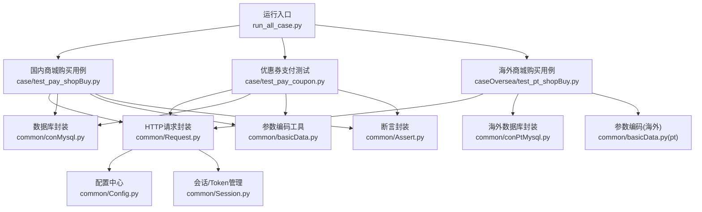
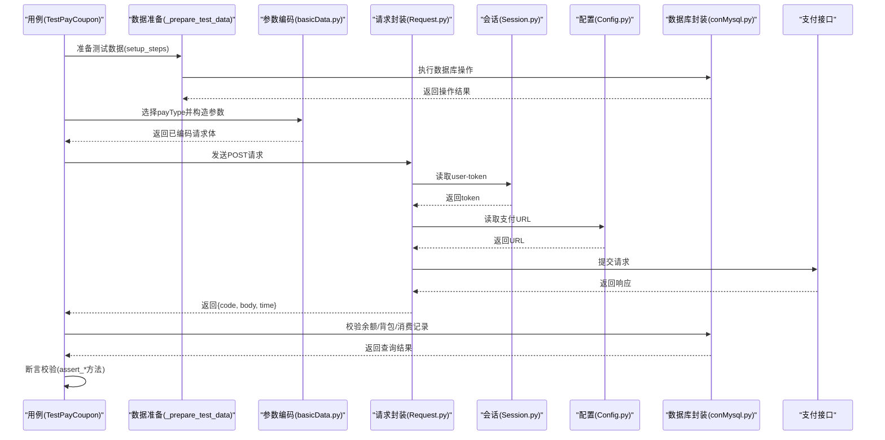
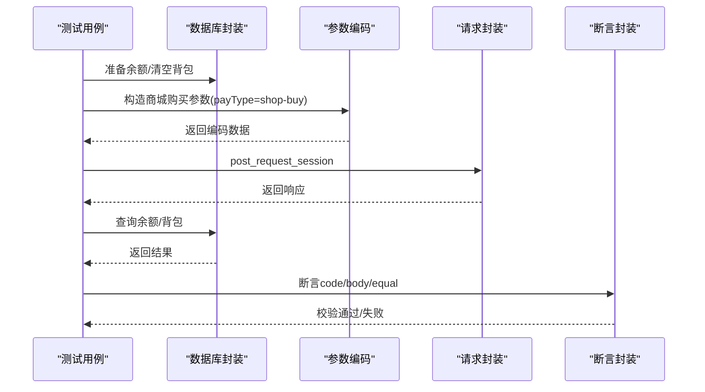
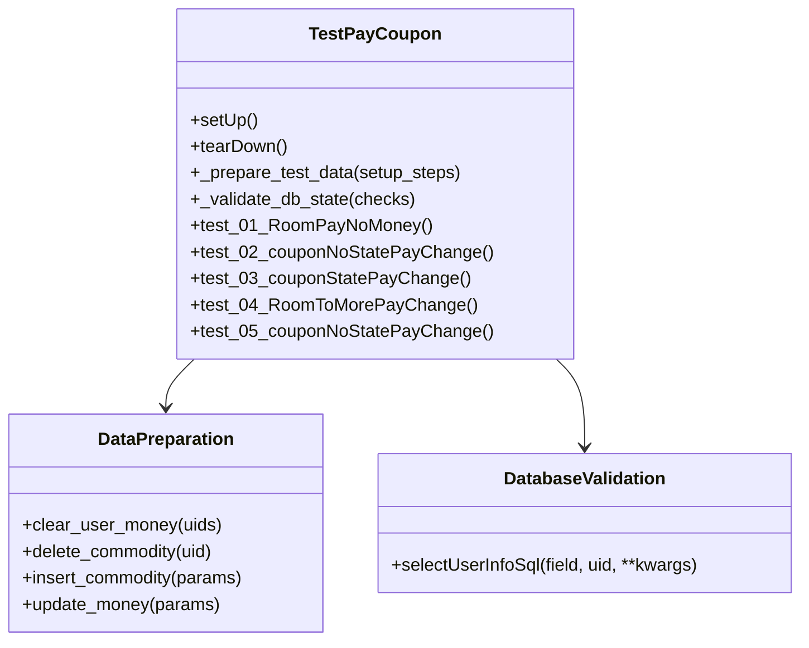
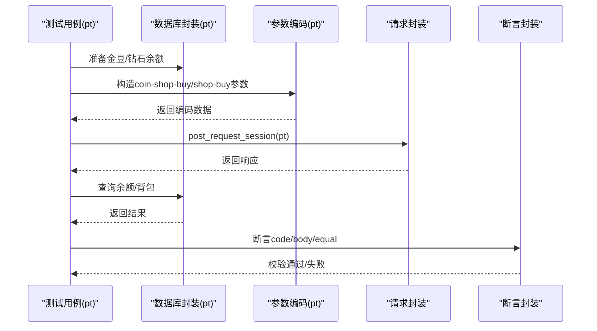
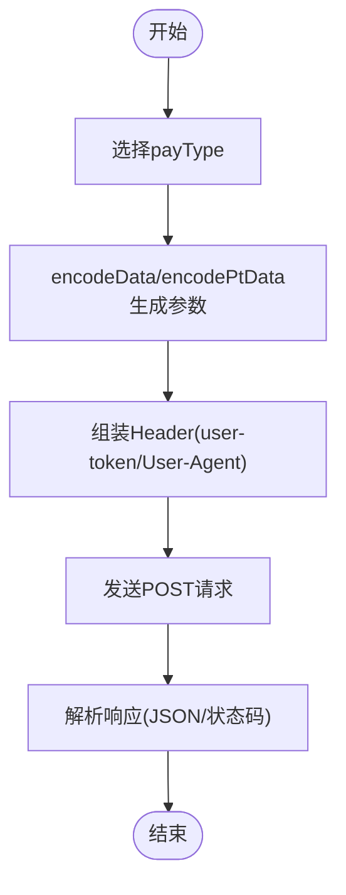
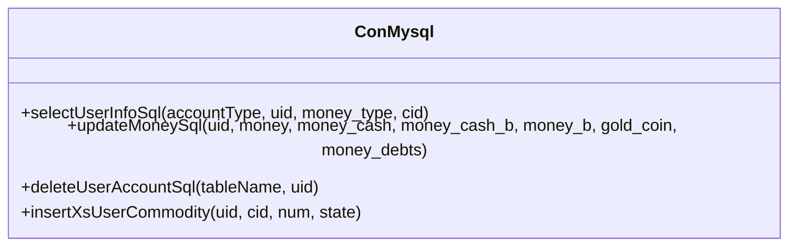
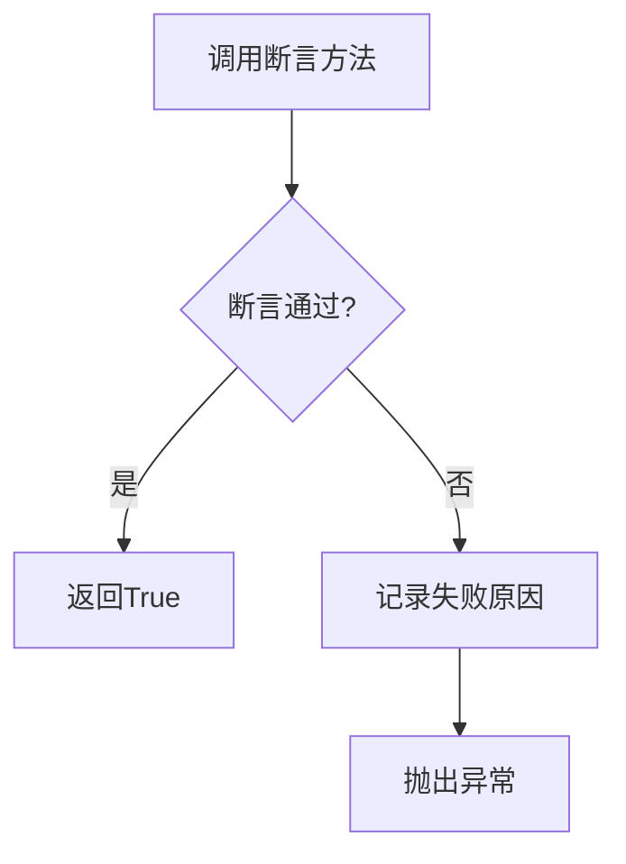
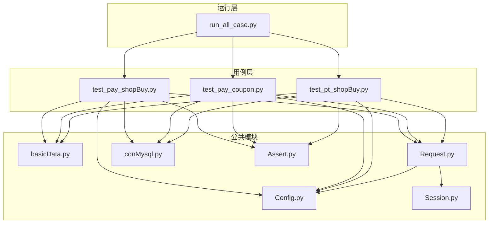

# 商城购买测试

<cite>
**本文引用的文件**
- [test_pay_shopBuy.py](file://case/test_pay_shopBuy.py)
- [test_pay_coupon.py](file://case/test_pay_coupon.py)
- [test_pt_shopBuy.py](file://caseOversea/test_pt_shopBuy.py)
- [Config.py](file://common/Config.py)
- [Request.py](file://common/Request.py)
- [conMysql.py](file://common/conMysql.py)
- [basicData.py](file://common/basicData.py)
- [Assert.py](file://common/Assert.py)
- [Session.py](file://common/Session.py)
- [run_all_case.py](file://run_all_case.py)
- [README.md](file://README.md)
</cite>

## 更新摘要
**变更内容**
- 类名重构：TestPayCreate → TestPayCoupon，专门用于优惠券支付测试
- 统一测试框架：引入 `_prepare_test_data()` 和 `_validate_db_state()` 方法
- 扩展测试场景：新增多用户场景、特殊房间类型、电台房等场景
- 增强数据验证：标准化数据库状态验证机制
- 完善优惠券测试：涵盖激活券、未激活券、体验券等多种优惠券类型

## 目录
1. [简介](#简介)
2. [项目结构](#项目结构)
3. [核心组件](#核心组件)
4. [架构总览](#架构总览)
5. [详细组件分析](#详细组件分析)
6. [依赖分析](#依赖分析)
7. [性能考虑](#性能考虑)
8. [故障排查指南](#故障排查指南)
9. [结论](#结论)
10. [附录](#附录)

## 简介
本文件面向"商城购买测试"场景，系统化梳理与实现以下测试目标：
- 普通商品购买测试：验证商城购买单个/多个道具的流程与余额、背包校验。
- 限时商品购买测试：结合限时活动配置进行购买流程验证（如通过参数控制）。
- 组合商品购买测试：验证多人同时购买或组合套餐购买的场景。
- 积分兑换商品测试：验证金豆/积分兑换商城道具的流程。
- 优惠券支付测试：验证激活券、未激活券、体验券等不同优惠券类型的支付场景。
- 购买流程全链路：商品信息查询、购物车操作、订单状态跟踪、支付完成后商品发放核验。
- 价格计算规则与优惠券使用限制：通过参数与数据库校验联动实现。
- 测试数据准备与商品配置管理：通过数据库工具准备用户余额、背包、商品配置等。
- 购买流程验证方法：基于HTTP接口调用与数据库一致性校验。

本测试框架采用Python + Pytest + MySQL + 自定义HTTP封装，覆盖国内版与海外版商城购买场景，并引入统一的测试数据准备和数据库验证机制。

## 项目结构
项目按业务域划分用例目录，核心公共模块集中在common目录，运行入口统一由run_all_case.py调度。

**图表来源**
- [run_all_case.py:126-147](file://run_all_case.py#L126-L147)
- [test_pay_shopBuy.py:13-124](file://case/test_pay_shopBuy.py#L13-L124)
- [test_pay_coupon.py:12-263](file://case/test_pay_coupon.py#L12-L263)
- [test_pt_shopBuy.py:11-58](file://caseOversea/test_pt_shopBuy.py#L11-L58)
- [Request.py:17-59](file://common/Request.py#L17-L59)
- [Config.py:47-94](file://common/Config.py#L47-L94)
- [Session.py:168-183](file://common/Session.py#L168-L183)
- [conMysql.py:27-204](file://common/conMysql.py#L27-L204)
- [basicData.py:8-325](file://common/basicData.py#L8-L325)
- [Assert.py:11-96](file://common/Assert.py#L11-L96)

**章节来源**
- [README.md:1-38](file://README.md#L1-L38)
- [run_all_case.py:126-147](file://run_all_case.py#L126-L147)

## 核心组件
- 配置中心：集中管理域名、支付URL、用户UID、礼物ID、房间ID等全局常量。
- 请求封装：统一封装POST请求，自动注入User-Agent与user-token头，处理响应解析与耗时统计。
- 数据库封装：提供用户余额、背包、消费记录等查询与更新能力；支持清理与初始化。
- 参数编码：根据payType生成不同场景的请求参数（商城购买、聊天礼物、守护等）。
- 断言封装：提供状态码、返回体字段、相等性、区间等断言方法。
- 会话管理：提供登录态获取与持久化，保障请求具备有效token。
- 运行器：统一发现并执行用例，输出结果与失败原因。
- 统一测试框架：TestPayCoupon类引入标准化的数据准备和数据库验证机制。

**章节来源**
- [Config.py:47-133](file://common/Config.py#L47-L133)
- [Request.py:17-59](file://common/Request.py#L17-L59)
- [conMysql.py:27-204](file://common/conMysql.py#L27-L204)
- [basicData.py:8-325](file://common/basicData.py#L8-L325)
- [Assert.py:11-96](file://common/Assert.py#L11-L96)
- [Session.py:168-183](file://common/Session.py#L168-L183)
- [run_all_case.py:126-147](file://run_all_case.py#L126-L147)

## 架构总览
下图展示从用例到后端接口与数据库的交互路径，以及关键断言与数据校验节点。

**图表来源**
- [test_pay_coupon.py:25-44](file://case/test_pay_coupon.py#L25-L44)
- [test_pay_shopBuy.py:20-42](file://case/test_pay_shopBuy.py#L20-L42)
- [basicData.py:177-194](file://common/basicData.py#L177-L194)
- [Request.py:17-59](file://common/Request.py#L17-L59)
- [Session.py:168-183](file://common/Session.py#L168-L183)
- [Config.py:47-49](file://common/Config.py#L47-L49)
- [conMysql.py:27-204](file://common/conMysql.py#L27-L204)
- [Assert.py:11-96](file://common/Assert.py#L11-L96)

## 详细组件分析

### 国内商城购买用例（普通/批量/打赏）
该用例集覆盖单个购买、批量购买、背包道具打赏及不足抵扣等场景，核心要点如下：
- 单个购买：准备用户余额与清空背包，构造商城购买参数，校验返回成功与余额、背包数量。
- 批量购买：准备充足余额，购买N件商品，校验总花费与背包数量。
- 背包打赏：使用背包中的道具进行打赏，校验打赏者背包剩余与被打赏者收入分成比例。
- 不足抵扣：尝试使用不足数量的背包道具进行大额打赏，预期失败并保持余额不变。

**图表来源**
- [test_pay_shopBuy.py:20-42](file://case/test_pay_shopBuy.py#L20-L42)
- [test_pay_shopBuy.py:44-67](file://case/test_pay_shopBuy.py#L44-L67)
- [test_pay_shopBuy.py:69-94](file://case/test_pay_shopBuy.py#L69-L94)
- [test_pay_shopBuy.py:96-123](file://case/test_pay_shopBuy.py#L96-L123)
- [conMysql.py:27-204](file://common/conMysql.py#L27-L204)
- [basicData.py:177-194](file://common/basicData.py#L177-L194)
- [Request.py:17-59](file://common/Request.py#L17-L59)
- [Assert.py:11-96](file://common/Assert.py#L11-L96)

**章节来源**
- [test_pay_shopBuy.py:20-123](file://case/test_pay_shopBuy.py#L20-L123)

### 优惠券支付测试（重构后）
**更新** 类名从TestPayCreate重命名为TestPayCoupon，引入统一的数据准备和数据库验证机制

该测试类专门验证优惠券支付场景，包含以下核心功能：
- 统一数据准备：`_prepare_test_data()`方法支持多种数据库操作（清理用户余额、删除背包物品、插入商品、更新余额等）
- 统一数据库验证：`_validate_db_state()`方法标准化数据库状态检查
- 多种优惠券场景：激活券、未激活券、体验券等不同状态的优惠券测试
- 多用户场景：支持一对多打赏场景，验证不同用户间的分成比例
- 特殊房间类型：支持电台房等特殊房间类型的优惠券使用

**图表来源**
- [test_pay_coupon.py:13-263](file://case/test_pay_coupon.py#L13-L263)
- [conMysql.py:27-204](file://common/conMysql.py#L27-L204)

**章节来源**
- [test_pay_coupon.py:12-263](file://case/test_pay_coupon.py#L12-L263)

### 海外商城购买用例（金豆/钻石）
该用例集覆盖海外版商城购买场景，分别验证金豆购买与钻石购买：
- 金豆购买：准备用户金豆余额，购买指定商品，校验金豆余额与背包数量。
- 钻石购买：准备用户钻石余额，购买指定商品，校验总余额为0并背包数量为1。

**图表来源**
- [test_pt_shopBuy.py:13-34](file://caseOversea/test_pt_shopBuy.py#L13-L34)
- [test_pt_shopBuy.py:36-57](file://caseOversea/test_pt_shopBuy.py#L36-L57)
- [basicData.py:441-457](file://common/basicData.py#L441-L457)
- [Request.py:17-59](file://common/Request.py#L17-L59)
- [Assert.py:11-96](file://common/Assert.py#L11-L96)

**章节来源**
- [test_pt_shopBuy.py:13-57](file://caseOversea/test_pt_shopBuy.py#L13-L57)

### 参数编码与请求封装
- 参数编码：根据payType生成不同场景的请求体，如商城购买、聊天礼物、守护等，确保money、num、cid、price等字段正确传递。
- 请求封装：统一POST请求，自动注入user-token与User-Agent，解析响应JSON并记录耗时。

**图表来源**
- [basicData.py:8-325](file://common/basicData.py#L8-L325)
- [Request.py:17-59](file://common/Request.py#L17-L59)

**章节来源**
- [basicData.py:8-325](file://common/basicData.py#L8-L325)
- [Request.py:17-59](file://common/Request.py#L17-L59)

### 数据库封装与校验
- 查询类：支持查询用户余额、背包数量、消费记录、爵位等级等。
- 更新类：支持更新用户余额、清空账户、插入/删除背包物品等。
- 用例中通过查询与断言结合，验证购买前后余额与背包变化。

**图表来源**
- [conMysql.py:27-204](file://common/conMysql.py#L27-L204)

**章节来源**
- [conMysql.py:27-204](file://common/conMysql.py#L27-L204)

### 断言与错误收集
- 断言封装提供多种断言方法，包括状态码、返回体字段、相等性、区间等。
- 错误收集：当断言失败时，记录失败原因，便于后续报告与定位。

**图表来源**
- [Assert.py:11-96](file://common/Assert.py#L11-L96)

**章节来源**
- [Assert.py:11-96](file://common/Assert.py#L11-L96)

## 依赖分析
- 用例依赖：参数编码、请求封装、数据库封装、断言封装、配置中心。
- 运行器依赖：用例发现与执行、日志输出、机器人通知。
- 会话依赖：YAML配置读取、登录态获取与持久化。

**图表来源**
- [test_pay_shopBuy.py:13-124](file://case/test_pay_shopBuy.py#L13-L124)
- [test_pay_coupon.py:12-263](file://case/test_pay_coupon.py#L12-L263)
- [test_pt_shopBuy.py:11-58](file://caseOversea/test_pt_shopBuy.py#L11-L58)
- [basicData.py:8-325](file://common/basicData.py#L8-L325)
- [Request.py:17-59](file://common/Request.py#L17-L59)
- [conMysql.py:27-204](file://common/conMysql.py#L27-L204)
- [Assert.py:11-96](file://common/Assert.py#L11-L96)
- [Config.py:47-133](file://common/Config.py#L47-L133)
- [Session.py:168-183](file://common/Session.py#L168-L183)
- [run_all_case.py:126-147](file://run_all_case.py#L126-L147)

**章节来源**
- [run_all_case.py:126-147](file://run_all_case.py#L126-L147)

## 性能考虑
- 接口延迟：在非特定主机环境下，断言前可能引入等待以规避RPC延迟导致的瞬时失败。
- 请求耗时：请求封装记录毫秒级与总耗时，可用于性能监控与回归对比。
- 并发与稳定性：建议在稳定环境中执行，避免并发竞争导致的数据库状态不一致。

**章节来源**
- [Assert.py:17-25](file://common/Assert.py#L17-L25)
- [Request.py:48-58](file://common/Request.py#L48-L58)

## 故障排查指南
- 登录态缺失：确认Session已写入并读取到有效token。
- 数据库连接：检查数据库地址、账号、密码与库名配置。
- 参数错误：核对payType与money/num/cid/price等字段是否匹配。
- 断言失败：查看fail_case_reason记录的失败原因，结合数据库查询结果定位问题。
- 环境差异：国内与海外版URL与payType略有差异，注意区分。
- 优惠券状态：检查优惠券状态（激活/未激活）与使用条件。

**章节来源**
- [Session.py:168-183](file://common/Session.py#L168-L183)
- [conMysql.py:8-26](file://common/conMysql.py#L8-L26)
- [basicData.py:8-325](file://common/basicData.py#L8-L325)
- [Assert.py:23-25](file://common/Assert.py#L23-L25)
- [Config.py:47-133](file://common/Config.py#L47-L133)

## 结论
本测试体系围绕"商城购买"核心场景，提供了从参数构造、接口调用、数据库校验到断言反馈的完整闭环。通过统一的配置中心、请求封装与数据库工具，能够稳定复现并验证普通商品、批量购买、积分兑换、打赏抵扣等多类购买流程。**更新** 优惠券支付测试类TestPayCoupon引入了统一的数据准备和数据库验证机制，扩展了多用户场景和特殊房间类型的测试覆盖，显著提升了测试的标准化程度和可维护性。建议在持续集成中定期执行，配合失败重试与机器人通知机制，提升回归效率与问题定位速度。

## 附录

### 测试数据准备与商品配置管理
- 用户余额准备：使用数据库封装更新用户余额，确保购买前状态可控。
- 背包清理与初始化：购买前清空背包，避免历史数据影响断言。
- 商品配置校验：确保xs_commodity中目标商品存在，避免购买失败。
- 分成比例与房间配置：海外版与国内版房间/礼物ID配置不同，需按版本选择。
- **更新** 统一数据准备：通过`_prepare_test_data()`方法标准化测试数据准备流程。

**章节来源**
- [conMysql.py:336-360](file://common/conMysql.py#L336-L360)
- [conMysql.py:206-272](file://common/conMysql.py#L206-L272)
- [conMysql.py:416-423](file://common/conMysql.py#L416-L423)
- [Config.py:78-128](file://common/Config.py#L78-L128)
- [test_pay_coupon.py:25-44](file://case/test_pay_coupon.py#L25-L44)

### 购买流程验证方法
- 步骤一：准备用户余额与背包状态。
- 步骤二：构造payType为shop-buy的参数并发起请求。
- 步骤三：断言返回成功与状态码。
- 步骤四：查询数据库验证余额与背包数量。
- 步骤五：记录用例结果并输出报告。
- **更新** 统一验证：通过`_validate_db_state()`方法标准化数据库状态验证。

**章节来源**
- [test_pay_shopBuy.py:20-42](file://case/test_pay_shopBuy.py#L20-L42)
- [test_pt_shopBuy.py:13-34](file://caseOversea/test_pt_shopBuy.py#L13-L34)
- [Assert.py:11-96](file://common/Assert.py#L11-L96)
- [conMysql.py:27-204](file://common/conMysql.py#L27-L204)
- [test_pay_coupon.py:37-44](file://case/test_pay_coupon.py#L37-L44)

### 优惠券测试场景详解
**新增** 优惠券支付测试的详细场景：
- 余额不足场景：验证用户余额不足时的支付失败处理
- 未激活券场景：验证state=0的优惠券不可使用的逻辑
- 激活券场景：验证state=1的优惠券正常抵扣功能
- 多人场景：验证一对多打赏场景下的分成计算
- 特殊房间：验证电台房等特殊房间类型的优惠券使用

**章节来源**
- [test_pay_coupon.py:46-263](file://case/test_pay_coupon.py#L46-L263)