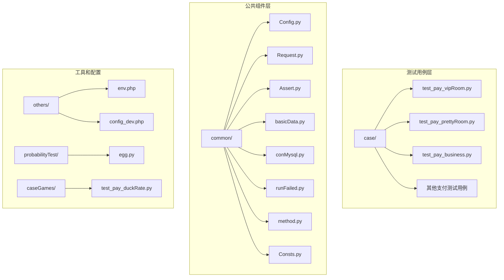
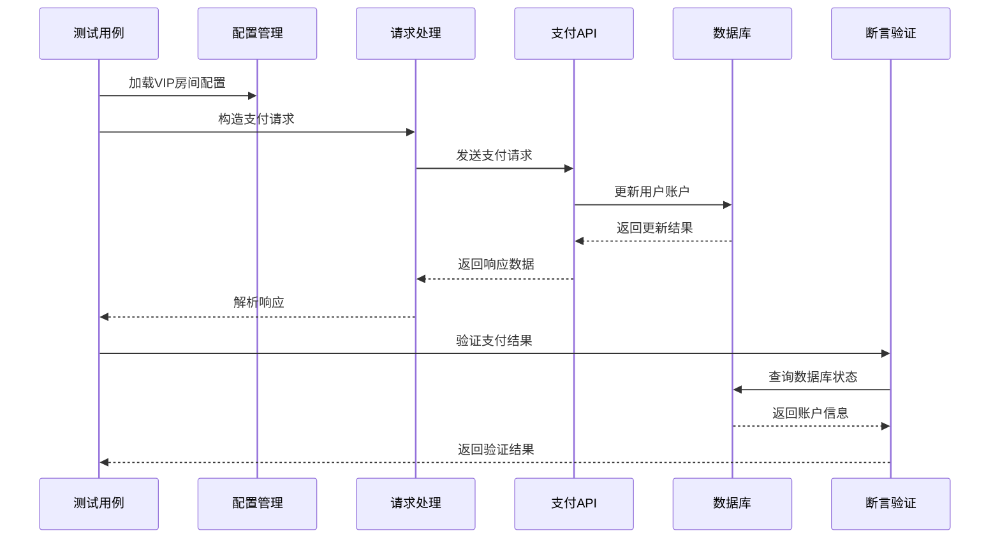
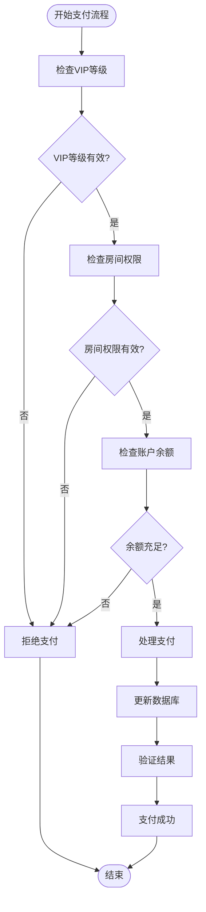
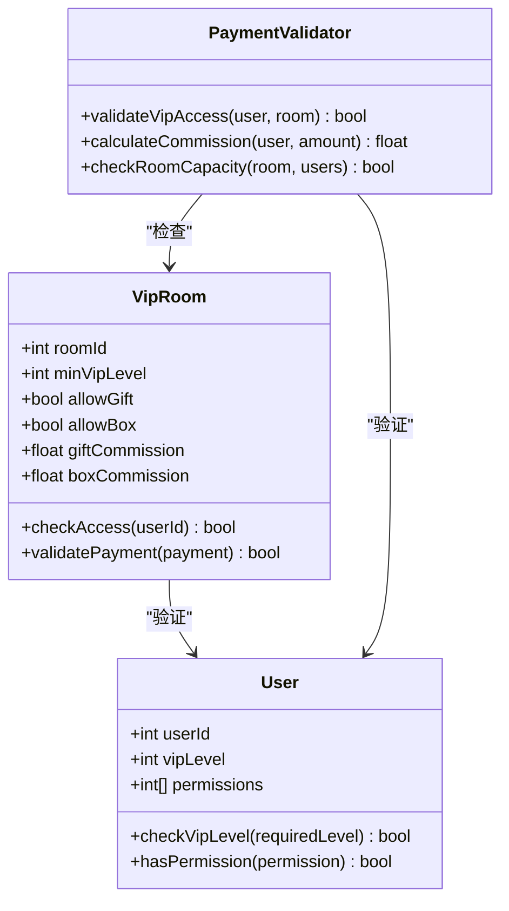

# VIP房支付测试

<cite>
**本文档引用的文件**
- [test_pay_vipRoom.py](file://case/test_pay_vipRoom.py)
- [Config.py](file://common/Config.py)
- [Request.py](file://common/Request.py)
- [Assert.py](file://common/Assert.py)
- [basicData.py](file://common/basicData.py)
- [conMysql.py](file://common/conMysql.py)
- [runFailed.py](file://common/runFailed.py)
- [method.py](file://common/method.py)
- [Consts.py](file://common/Consts.py)
- [test_pay_prettyRoom.py](file://case/test_pay_prettyRoom.py)
- [test_pay_business.py](file://case/test_pay_business.py)
- [README.md](file://README.md)
</cite>

## 目录
1. [简介](#简介)
2. [项目结构](#项目结构)
3. [核心组件](#核心组件)
4. [架构概览](#架构概览)
5. [详细组件分析](#详细组件分析)
6. [VIP房支付场景设计](#vip房支付场景设计)
7. [权限验证机制](#权限验证机制)
8. [功能测试用例](#功能测试用例)
9. [性能考虑](#性能考虑)
10. [故障排除指南](#故障排除指南)
11. [结论](#结论)

## 简介

VIP房支付测试系统是一个专门针对VIP房间支付场景的自动化测试框架，专注于验证VIP会员在VIP房间内的特权使用、权限验证、功能解锁和服务激活等核心功能。该系统通过模拟真实的支付流程，验证VIP会员等级要求、VIP功能限制、VIP权限验证以及VIP服务费用计算机制。

系统采用模块化设计，包含完整的支付流程验证、数据库状态检查、异常处理和重试机制，确保VIP房支付场景的稳定性和可靠性。

## 项目结构

该项目采用清晰的分层架构，主要包含以下核心目录和文件：

**图表来源**
- [test_pay_vipRoom.py:1-90](file://case/test_pay_vipRoom.py#L1-L90)
- [Config.py:1-133](file://common/Config.py#L1-L133)

**章节来源**
- [README.md:1-38](file://README.md#L1-L38)

## 核心组件

### 支付配置管理
系统通过Config类统一管理所有支付相关的配置信息，包括：
- 支付URL配置和服务器标识
- 用户ID配置（打赏者、被奖励者、公会成员等）
- 礼物ID映射表
- 房间类型配置

### 请求处理组件
Request模块封装了HTTP请求处理逻辑，支持：
- 自动化的用户令牌管理
- 请求头标准化处理
- 异常情况的安全处理
- 响应数据解析和格式化

### 断言验证系统
Assert模块提供了多种断言方法：
- 状态码验证
- 数据相等性验证
- 长度范围验证
- 文本包含验证
- 数值范围验证

### 数据库交互层
conMysql类实现了完整的数据库操作：
- 用户账户余额查询
- 账户状态更新
- 消费记录查询
- 用户等级和经验查询

**章节来源**
- [Config.py:59-94](file://common/Config.py#L59-L94)
- [Request.py:17-59](file://common/Request.py#L17-L59)
- [Assert.py:11-96](file://common/Assert.py#L11-L96)
- [conMysql.py:8-204](file://common/conMysql.py#L8-L204)

## 架构概览

VIP房支付测试系统采用分层架构设计，各层职责明确，耦合度低：

**图表来源**
- [test_pay_vipRoom.py:28-39](file://case/test_pay_vipRoom.py#L28-L39)
- [Request.py:17-59](file://common/Request.py#L17-L59)

## 详细组件分析

### VIP房支付核心流程

VIP房支付的核心流程包括以下几个关键步骤：

1. **用户身份验证**：确认打赏者具备VIP资格
2. **房间权限检查**：验证VIP房间访问权限
3. **支付请求构建**：构造符合VIP房间要求的支付参数
4. **支付执行**：发送支付请求到服务器
5. **结果验证**：检查支付结果和账户状态变化
6. **数据一致性检查**：确保数据库状态与预期一致

### 权限验证机制

系统实现了多层次的权限验证机制：

**图表来源**
- [test_pay_vipRoom.py:18-39](file://case/test_pay_vipRoom.py#L18-L39)
- [conMysql.py:350-360](file://common/conMysql.py#L350-L360)

**章节来源**
- [test_pay_vipRoom.py:12-90](file://case/test_pay_vipRoom.py#L12-L90)

## VIP房支付场景设计

### 场景一：个人房礼物打赏

个人VIP房的礼物打赏场景具有以下特点：

- **目标用户**：VIP会员（等级>5级）
- **打赏对象**：房间内的其他用户或公会成员
- **分成比例**：62:38（打赏者:受益者）
- **收入类型**：个人魅力值
- **特殊规则**：VIP会员在个人房内享受特殊分成比例

### 场景二：个人房礼盒打赏

个人VIP房的礼盒打赏场景：

- **目标用户**：VIP会员
- **打赏对象**：公会成员或普通用户
- **分成比例**：根据用户身份调整
- **收入类型**：公会魅力值或个人魅力值
- **星级影响**：不同星级影响分成比例

### 场景三：公会成员打赏

VIP房内对公会成员的打赏：

- **目标用户**：VIP会员
- **打赏对象**：公会成员（GS）
- **分成比例**：70:30（打赏者:受益者）
- **收入类型**：公会魅力值
- **特权体现**：公会成员享受更高分成比例

**章节来源**
- [test_pay_vipRoom.py:18-89](file://case/test_pay_vipRoom.py#L18-L89)

## 权限验证机制

### VIP会员等级验证

系统通过多种方式验证VIP会员资格：

1. **等级检查**：验证用户VIP等级是否满足房间要求
2. **房间访问权限**：确认用户是否有权进入特定VIP房间
3. **功能使用限制**：检查VIP功能的使用限制条件
4. **服务费用验证**：确认VIP服务费用计算正确

### 房间权限控制

VIP房间的权限控制机制：

**图表来源**
- [test_pay_vipRoom.py:16](file://case/test_pay_vipRoom.py#L16)
- [Config.py:60-68](file://common/Config.py#L60-L68)

**章节来源**
- [Config.py:59-94](file://common/Config.py#L59-L94)

## 功能测试用例

### 测试用例一：个人房礼物打赏

验证VIP会员在个人房内进行礼物打赏的完整流程：

**前置条件**：
- 打赏者具备VIP资格（等级>5级）
- 目标房间为VIP个人房
- 打赏者账户余额充足

**测试步骤**：
1. 准备打赏者和被打赏者数据
2. 在VIP个人房内进行礼物打赏
3. 验证接口响应状态
4. 检查账户余额变化
5. 确认分成比例正确

**预期结果**：
- 支付成功，分成比例为62:38
- 打赏者余额减少相应金额
- 受益者余额增加相应金额
- VIP特权得到正确应用

### 测试用例二：个人房礼盒打赏

验证VIP会员在个人房内进行礼盒打赏的场景：

**测试重点**：
- 礼盒价值计算
- 星级影响的分成调整
- 多用户同时打赏的处理
- 收益分配的准确性

### 测试用例三：公会成员打赏

验证VIP会员对公会成员进行打赏的特权场景：

**特权体现**：
- 更高的分成比例（70:30）
- 收入直接进入公会魅力值
- 公会成员享受额外收益
- VIP特权的完整体现

**章节来源**
- [test_pay_vipRoom.py:18-89](file://case/test_pay_vipRoom.py#L18-L89)

## 性能考虑

### 并发处理优化

系统采用了多重机制来确保VIP房支付的性能和稳定性：

1. **重试机制**：自动重试失败的测试用例
2. **数据库连接池**：优化数据库操作性能
3. **异步处理**：支付完成后异步更新账户状态
4. **缓存策略**：缓存常用的配置和用户信息

### 错误处理策略

系统实现了完善的错误处理机制：

- **网络异常处理**：自动重连和超时处理
- **数据库异常处理**：事务回滚和状态恢复
- **业务逻辑异常**：详细的错误日志和原因分析
- **资源清理**：异常情况下自动清理临时资源

## 故障排除指南

### 常见问题及解决方案

**问题1：VIP房间访问被拒绝**
- 检查用户VIP等级是否满足房间要求
- 验证房间权限配置是否正确
- 确认用户是否在正确的房间内

**问题2：支付金额计算错误**
- 检查VIP分成比例配置
- 验证星级影响因子
- 确认货币类型转换正确

**问题3：账户余额不一致**
- 检查数据库连接状态
- 验证事务提交完整性
- 确认并发访问的锁机制

### 调试工具和方法

系统提供了丰富的调试工具：

- **日志记录**：详细的执行日志和错误信息
- **状态监控**：实时监控支付状态和账户变化
- **性能分析**：分析支付流程的性能瓶颈
- **数据验证**：验证数据库状态的一致性

**章节来源**
- [runFailed.py:10-87](file://common/runFailed.py#L10-L87)
- [conMysql.py:274-322](file://common/conMysql.py#L274-L322)

## 结论

VIP房支付测试系统通过模块化的设计和完善的测试覆盖，为VIP房间支付场景提供了全面的自动化测试解决方案。系统不仅验证了基本的支付功能，更重要的是确保了VIP特权的正确应用和VIP功能的完整实现。

通过本系统的测试，可以确保：
- VIP会员资格验证的准确性
- VIP权限控制的有效性
- VIP功能解锁的正确性
- VIP专属服务的可靠性
- VIP支付流程的稳定性

该系统为VIP房支付场景的质量保证提供了坚实的技术基础，能够有效提升用户体验和系统稳定性。