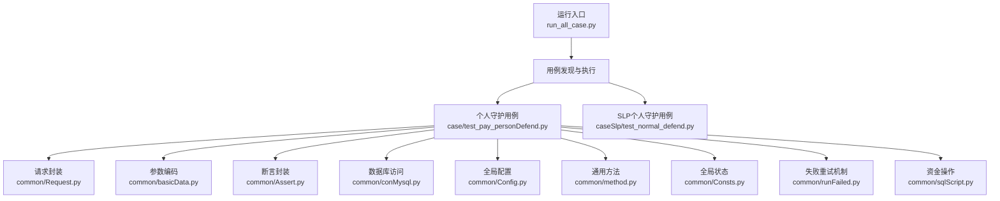
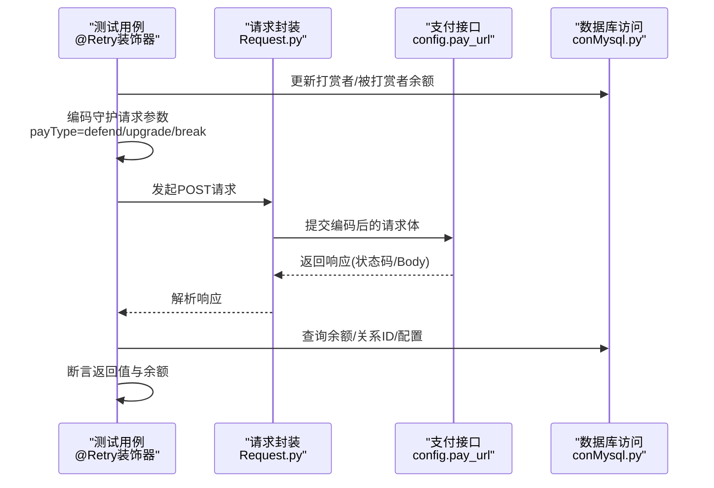
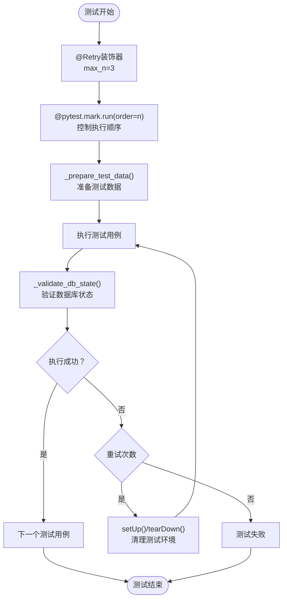
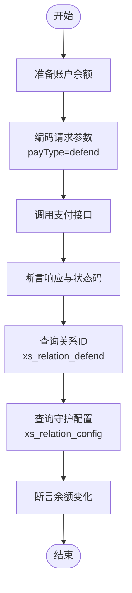
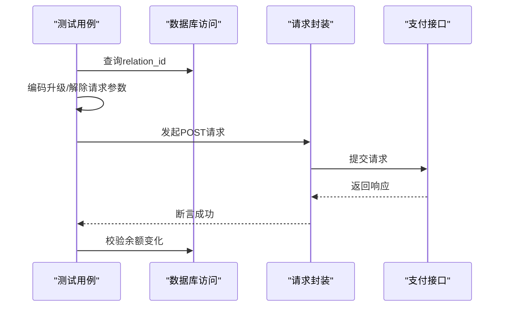
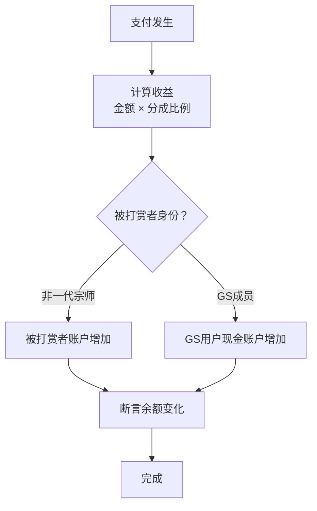
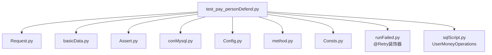

# 个人守护支付测试

<cite>
**本文引用的文件**
- [README.md](file://README.md)
- [run_all_case.py](file://run_all_case.py)
- [test_pay_personDefend.py](file://case/test_pay_personDefend.py)
- [basicData.py](file://common/basicData.py)
- [conMysql.py](file://common/conMysql.py)
- [Request.py](file://common/Request.py)
- [Assert.py](file://common/Assert.py)
- [Consts.py](file://common/Consts.py)
- [method.py](file://common/method.py)
- [Config.py](file://common/Config.py)
- [test_normal_defend.py](file://caseSlp/test_normal_defend.py)
- [config.py](file://caseSlp/config.py)
- [runFailed.py](file://common/runFailed.py)
- [sqlScript.py](file://common/sqlScript.py)
</cite>

## 更新摘要
**变更内容**
- 新增测试生命周期管理改进：引入失败重试机制和测试顺序控制
- 标准化测试用例结构：统一使用 `_prepare_test_data()` 和 `_validate_db_state()` 方法
- 改进测试执行策略：使用 `@pytest.mark.run(order=n)` 控制测试用例执行顺序
- 增强错误处理机制：通过装饰器实现自动重试和测试前后清理
- **代码现代化优化**：增强了类型注解、改进了测试方法参数签名、标准化了变量命名（pt_payUid → app_payUid）、增加了详细的docstring说明

## 目录
1. [简介](#简介)
2. [项目结构](#项目结构)
3. [核心组件](#核心组件)
4. [架构总览](#架构总览)
5. [详细组件分析](#详细组件分析)
6. [依赖分析](#依赖分析)
7. [性能考虑](#性能考虑)
8. [故障排查指南](#故障排查指南)
9. [结论](#结论)
10. [附录](#附录)

## 简介
本文件面向"个人守护支付测试"，系统化梳理守护关系建立、守护等级与功能解锁、守护收益分配与到账验证等核心流程。基于仓库中的支付测试用例与通用测试框架，文档覆盖以下测试场景：
- 守护关系建立（开通个人守护）
- 守护功能升级（进阶特权）
- 守护关系解除（强制解除）
- 收益分配规则（师父/非一代宗师 vs 公会用户 GS）
- 关系确认机制、功能激活策略与收益分配算法

通过接口调用、数据库查询与断言校验，确保支付流程正确性与收益分配准确性。本次重构重点改进了测试生命周期管理和测试用例结构标准化，提升了测试的稳定性和可维护性。**更新** 代码现代化优化包括增强类型注解、改进测试方法参数签名、标准化变量命名以及详细的docstring说明。

## 项目结构
项目采用按业务域划分的用例组织方式，其中个人守护支付测试位于 case 目录下；同时提供跨应用（如 SLP）的个人守护测试作为对比参考。

**图表来源**
- [run_all_case.py:126-147](file://run_all_case.py#L126-L147)
- [test_pay_personDefend.py:1-271](file://case/test_pay_personDefend.py#L1-L271)
- [test_normal_defend.py:1-105](file://caseSlp/test_normal_defend.py#L1-L105)

**章节来源**
- [README.md:1-38](file://README.md#L1-L38)
- [run_all_case.py:126-147](file://run_all_case.py#L126-L147)

## 核心组件
- **请求封装**：统一发起支付请求，注入用户令牌与头部信息，解析响应状态码与内容。**更新** 增强了类型注解，支持 `post_request_session(url: str, data: Optional[Any], token_name: str = 'dev', timeout: float = DEFAULT_TIMEOUT)` 参数签名。
- **参数编码**：根据支付类型（defend/defend-upgrade/defend-break）构造请求体，包含守护配置 ID、目标 UID、金额等。**更新** 增加了详细的docstring说明和类型注解。
- **断言封装**：提供状态码、返回体字段、数值相等性等断言方法，统一失败原因收集。**更新** 所有断言方法都增加了类型注解和详细的docstring说明。
- **数据库访问**：提供账户余额、守护关系 ID、守护配置等查询与更新能力。**更新** 增强了SQL操作的类型安全性和错误处理。
- **全局配置**：定义支付 URL、分成比例、用户 UID、礼物与守护配置等。**更新** 标准化了变量命名（pt_payUid → app_payUid），增加了类型注解。
- **通用方法**：用例执行结果统计、失败原因格式化、路径检查等。**更新** 增强了方法签名和类型注解。
- **失败重试机制**：通过 `@Retry(max_n=3)` 装饰器实现测试用例的自动重试，提升测试稳定性。**更新** 改进了重试逻辑和异常处理。
- **资金操作**：提供用户资金相关操作的统一接口，支持余额更新、查询等功能。**更新** 增强了类型注解和详细的docstring说明。

**章节来源**
- [Request.py:17-59](file://common/Request.py#L17-L59)
- [basicData.py:195-232](file://common/basicData.py#L195-L232)
- [Assert.py:11-96](file://common/Assert.py#L11-L96)
- [conMysql.py:28-204](file://common/conMysql.py#L28-L204)
- [Config.py:47-106](file://common/Config.py#L47-L106)
- [method.py:115-128](file://common/method.py#L115-L128)
- [runFailed.py:10-87](file://common/runFailed.py#L10-L87)
- [sqlScript.py:130-200](file://common/sqlScript.py#L130-L200)

## 架构总览
个人守护支付测试的整体流程如下：用例准备阶段更新账户余额，构造守护支付请求，调用支付接口，断言返回值与状态码，随后查询数据库验证余额变化与收益分配。重构后的架构引入了失败重试机制和测试顺序控制，确保测试的稳定性和可重复性。**更新** 代码现代化优化提升了整体架构的类型安全性和可维护性。

**图表来源**
- [test_pay_personDefend.py:23-90](file://case/test_pay_personDefend.py#L23-L90)
- [Request.py:17-59](file://common/Request.py#L17-L59)
- [conMysql.py:28-204](file://common/conMysql.py#L28-L204)
- [Config.py:47-106](file://common/Config.py#L47-L106)
- [runFailed.py:57-78](file://common/runFailed.py#L57-L78)

## 详细组件分析

### 个人守护支付场景与规则
- **场景一**：开通个人守护（非一代宗师被打赏者）
  - 步骤：准备打赏者与被打赏者数据，选择守护配置（如"小宝贝"），调用支付接口，断言成功与余额变化。
  - 收益分配：师父/非一代宗师场景下，被打赏者获得 62% 收益。
- **场景二**：守护进阶（购买进阶特权）
  - 步骤：在已开通关系基础上，提交进阶请求，断言成功与余额变化。
  - 收益分配：延续 62% 分成。
- **场景三**：守护解除（强制解除）
  - 步骤：提交解除请求，断言成功与余额变化。
  - 收益分配：解除后收益归官方，打赏者余额按解除金额处理。
- **场景四**：给公会用户（GS）开通个人守护
  - 步骤：目标用户为 GS 成员，其余流程同上。
  - 收益分配：同样适用 62% 分成至 GS 用户的现金账户。

**章节来源**
- [test_pay_personDefend.py:23-162](file://case/test_pay_personDefend.py#L23-L162)
- [Config.py:57](file://common/Config.py#L57)

### 测试生命周期管理与标准化
- **失败重试机制**：使用 `@Retry(max_n=3)` 装饰器，当测试用例执行失败时自动重试最多3次，并在每次重试前执行 `setUp()` 和 `tearDown()` 清理操作。
- **测试顺序控制**：通过 `@pytest.mark.run(order=n)` 装饰器严格控制测试用例的执行顺序，确保依赖关系的正确性。
- **统一测试方法**：新增 `_prepare_test_data()` 和 `_validate_db_state()` 方法，标准化测试数据准备和数据库状态验证流程。
- **测试数据管理**：在类级别预加载守护配置和关系 ID，减少重复查询操作，提升测试执行效率。

**图表来源**
- [test_pay_personDefend.py:13-36](file://case/test_pay_personDefend.py#L13-L36)
- [runFailed.py:57-78](file://common/runFailed.py#L57-L78)

**章节来源**
- [test_pay_personDefend.py:13-36](file://case/test_pay_personDefend.py#L13-L36)
- [runFailed.py:10-87](file://common/runFailed.py#L10-L87)

### 守护关系建立与验证
- **关系建立**：通过支付类型 defend 创建守护关系，请求参数包含目标 UID 与守护配置 ID。
- **关系确认**：通过查询 xs_relation_defend 获取 relation_id，用于后续升级与解除操作。
- **配置查询**：通过 xs_relation_config 获取守护配置的价格、升级价格与解除价格。

**图表来源**
- [test_pay_personDefend.py:18-21](file://case/test_pay_personDefend.py#L18-L21)
- [basicData.py:195-209](file://common/basicData.py#L195-L209)
- [conMysql.py:142-164](file://common/conMysql.py#L142-L164)

**章节来源**
- [test_pay_personDefend.py:18-21](file://case/test_pay_personDefend.py#L18-L21)
- [basicData.py:195-209](file://common/basicData.py#L195-L209)
- [conMysql.py:142-164](file://common/conMysql.py#L142-L164)

### 守护功能升级与解除
- **升级流程**：在已有 relation_id 的基础上，使用 defend-upgrade 类型提交请求，金额为升级价格。
- **解除流程**：使用 defend-break 类型提交请求，金额为解除价格，收益归官方。

**图表来源**
- [test_pay_personDefend.py:61-69](file://case/test_pay_personDefend.py#L61-L69)
- [test_pay_personDefend.py:83-90](file://case/test_pay_personDefend.py#L83-L90)
- [basicData.py:210-232](file://common/basicData.py#L210-L232)

**章节来源**
- [test_pay_personDefend.py:61-69](file://case/test_pay_personDefend.py#L61-L69)
- [test_pay_personDefend.py:83-90](file://case/test_pay_personDefend.py#L83-L90)
- [basicData.py:210-232](file://common/basicData.py#L210-L232)

### 收益分配算法与到账验证
- **分成比例**：全局配置中定义了 GS 商业房分成比（例如 0.62），用于 GS 用户的收益分配。
- **到账验证**：分别断言打赏者余额减少相应金额，被打赏者（或 GS 用户）的现金账户增加相应收益。
- **SLP 场景对照**：SLP 用例中也采用相同的比例策略进行收益分配验证。

**图表来源**
- [Config.py:57](file://common/Config.py#L57)
- [test_pay_personDefend.py:43-44](file://case/test_pay_personDefend.py#L43-L44)
- [test_pay_personDefend.py:114-115](file://case/test_pay_personDefend.py#L114-L115)
- [test_normal_defend.py:46-47](file://caseSlp/test_normal_defend.py#L46-L47)

**章节来源**
- [Config.py:57](file://common/Config.py#L57)
- [test_pay_personDefend.py:43-44](file://case/test_pay_personDefend.py#L43-L44)
- [test_pay_personDefend.py:114-115](file://case/test_pay_personDefend.py#L114-L115)
- [test_normal_defend.py:46-47](file://caseSlp/test_normal_defend.py#L46-L47)

### SLP 场景对比（补充）
- **SLP 用例**展示了普通用户与 GS 用户的个人守护场景，验证收益分配比例与余额变化，便于横向对比。
- **SLP 配置**中定义了守护套餐价格与分成比例，便于在不同应用下复用同一测试思路。

**章节来源**
- [test_normal_defend.py:23-48](file://caseSlp/test_normal_defend.py#L23-L48)
- [config.py:98-167](file://caseSlp/config.py#L98-L167)

### 代码现代化优化详解
**更新** 本次代码现代化优化主要体现在以下几个方面：

#### 类型注解增强
- **Request.py**：为所有函数参数和返回值添加了详细的类型注解，如 `post_request_session(url: str, data: Optional[Any], token_name: str = 'dev', timeout: float = DEFAULT_TIMEOUT) -> Dict[str, Any]`
- **basicData.py**：为 `encodeData` 和 `encodePtData` 函数添加了完整的类型注解，包括参数类型和返回值类型
- **Assert.py**：为所有断言函数添加了类型注解，如 `assert_code(actual_code: int, expected_code: int = 200) -> bool`

#### 测试方法参数签名改进
- **UserMoneyOperations.update**：改进了方法签名，添加了详细的类型注解 `update(uid: int, money: int = 0, money_cash: int = 0, money_cash_b: int = 0, money_b: int = 0, gold_coin: int = 0) -> None`

#### 变量命名标准化
- **Config.py**：将 `pt_payUid` 标准化为 `app_payUid`，提供更通用的命名方式，适用于不同应用环境
- 统一了全局配置中的用户UID命名规范

#### 详细的docstring说明
- **所有主要函数**都增加了详细的docstring说明，包括参数说明、返回值说明、异常说明等
- 提升了代码的可读性和可维护性

**章节来源**
- [Request.py:71-106](file://common/Request.py#L71-L106)
- [basicData.py:501-571](file://common/basicData.py#L501-L571)
- [Assert.py:46-142](file://common/Assert.py#L46-L142)
- [Config.py:184-186](file://common/Config.py#L184-L186)
- [sqlScript.py:133-149](file://common/sqlScript.py#L133-L149)

## 依赖分析
- **用例依赖关系**：各测试用例通过顺序标记保证执行先后，确保升级与解除依赖于已建立的关系。
- **组件耦合**：测试用例通过公共模块解耦，请求封装与参数编码独立，便于维护与扩展。
- **外部依赖**：支付接口地址、数据库连接与用户 UID 来源于全局配置，便于切换环境与用户。
- **失败重试依赖**：测试用例依赖 `@Retry` 装饰器实现自动重试，依赖 `setUp()` 和 `tearDown()` 方法进行测试环境清理。
- **类型安全依赖**：现代化的类型注解确保了代码的类型安全性，减少了运行时错误。

**图表来源**
- [test_pay_personDefend.py:1-10](file://case/test_pay_personDefend.py#L1-L10)
- [Request.py:17-59](file://common/Request.py#L17-L59)
- [basicData.py:195-232](file://common/basicData.py#L195-L232)
- [Assert.py:11-96](file://common/Assert.py#L11-L96)
- [conMysql.py:28-204](file://common/conMysql.py#L28-L204)
- [Config.py:47-106](file://common/Config.py#L47-L106)
- [method.py:115-128](file://common/method.py#L115-L128)
- [Consts.py:4-17](file://common/Consts.py#L4-L17)
- [runFailed.py:10-87](file://common/runFailed.py#L10-L87)
- [sqlScript.py:130-200](file://common/sqlScript.py#L130-L200)

**章节来源**
- [test_pay_personDefend.py:1-10](file://case/test_pay_personDefend.py#L1-L10)

## 性能考虑
- **接口延迟**：断言模块在非特定节点环境下引入延时，避免 RPC 接口延迟导致的误判。
- **并发执行**：运行入口支持用例发现与批量执行，便于在 CI 环境中并行加速。
- **数据库一致性**：查询与断言之间建议增加短暂等待，确保数据库写入完成后再读取。
- **重试优化**：失败重试机制限制最大重试次数，避免无限循环重试影响整体测试性能。
- **测试顺序优化**：通过 `@pytest.mark.run(order=n)` 控制测试执行顺序，减少不必要的等待时间。
- **类型检查优化**：现代化的类型注解可以在开发阶段捕获潜在的类型错误，减少运行时开销。

**章节来源**
- [Assert.py:17-25](file://common/Assert.py#L17-L25)
- [run_all_case.py:126-147](file://run_all_case.py#L126-L147)
- [runFailed.py:42-56](file://common/runFailed.py#L42-L56)

## 故障排查指南
- **响应断言失败**：检查状态码与返回体字段，结合失败原因收集器输出定位问题。
- **余额断言失败**：核对支付金额、分成比例与账户初始余额，确认数据库查询字段与类型。
- **关系 ID 查询为空**：确认守护关系是否已建立，或查询条件是否匹配（打赏者 UID、目标 UID、关系配置 ID）。
- **环境差异**：若在不同节点执行，注意断言延时与接口可用性差异。
- **重试失败**：当测试用例多次重试仍失败时，检查 `setUp()` 和 `tearDown()` 方法的执行情况，确认测试环境清理是否正常。
- **顺序冲突**：如果测试用例执行顺序出现问题，检查 `@pytest.mark.run(order=n)` 标记是否正确设置。
- **类型错误**：现代化工代码可能在运行时抛出类型错误，检查参数类型是否符合函数签名要求。
- **docstring问题**：详细的docstring有助于理解函数用途，但也要确保实际实现与文档说明一致。

**章节来源**
- [Assert.py:11-96](file://common/Assert.py#L11-L96)
- [conMysql.py:142-164](file://common/conMysql.py#L142-L164)
- [method.py:115-128](file://common/method.py#L115-L128)
- [runFailed.py:67-78](file://common/runFailed.py#L67-L78)

## 结论
本测试方案围绕个人守护支付的关键环节构建了完整的验证闭环：从关系建立、功能升级到关系解除，再到收益分配与到账验证。重构后的测试架构引入了失败重试机制、测试顺序控制和标准化的测试方法，显著提升了测试的稳定性和可维护性。通过统一的请求封装、参数编码与断言机制，配合数据库查询与全局配置管理，能够稳定地覆盖多种业务场景与用户身份（非一代宗师、GS 成员）。

**更新** 代码现代化优化进一步提升了系统的质量：增强的类型注解确保了更好的类型安全性，改进的测试方法参数签名提供了更清晰的API接口，标准化的变量命名提升了代码的一致性，详细的docstring说明改善了代码的可读性和可维护性。这些改进使得测试框架更加健壮、易用和可持续发展。

建议在持续集成中保持用例顺序与环境一致性，确保测试结果可重复与可追溯。同时，利用现代化的类型注解和docstring功能，可以更好地支持团队协作和代码维护。

## 附录
- **运行入口与用例发现**：通过运行入口自动发现并执行指定目录下的测试用例，支持多应用分支与通知推送。
- **用例命名规范**：遵循以 test_ 开头的命名约定，便于自动化执行与报告生成。
- **失败重试策略**：默认最多重试3次，重试间隔1秒，重试过程中自动执行测试环境清理操作。
- **测试顺序控制**：通过 `@pytest.mark.run(order=n)` 装饰器严格控制测试用例的执行顺序，确保依赖关系的正确性。
- **类型安全保证**：现代化的类型注解在编译时捕获类型错误，提升代码质量。
- **详细文档支持**：每个函数都有详细的docstring说明，便于理解和使用。

**章节来源**
- [run_all_case.py:126-147](file://run_all_case.py#L126-L147)
- [README.md:23-31](file://README.md#L23-L31)
- [runFailed.py:10-87](file://common/runFailed.py#L10-L87)
- [test_pay_personDefend.py:37-152](file://case/test_pay_personDefend.py#L37-L152)
- [Request.py:71-106](file://common/Request.py#L71-L106)
- [basicData.py:501-571](file://common/basicData.py#L501-L571)
- [Assert.py:46-142](file://common/Assert.py#L46-L142)
- [Config.py:184-186](file://common/Config.py#L184-L186)
- [sqlScript.py:133-149](file://common/sqlScript.py#L133-L149)