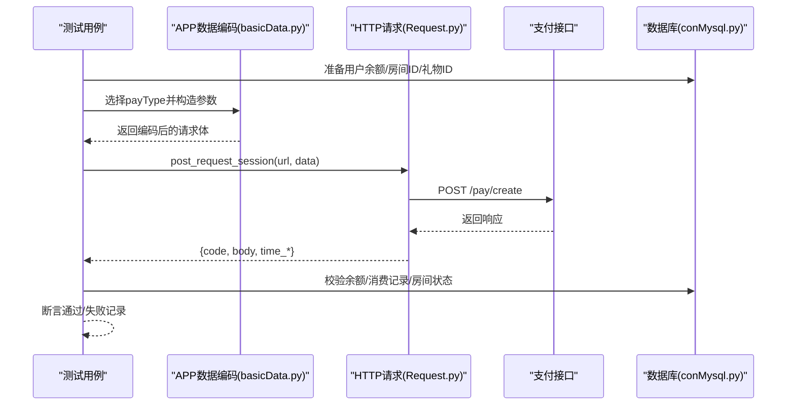
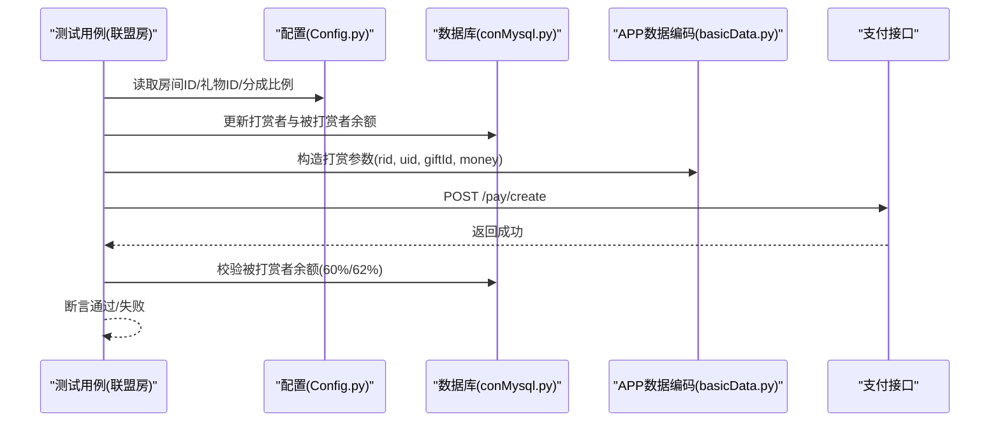
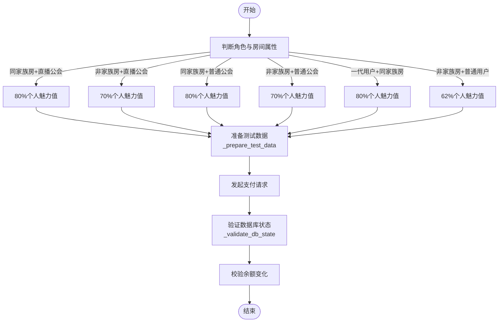
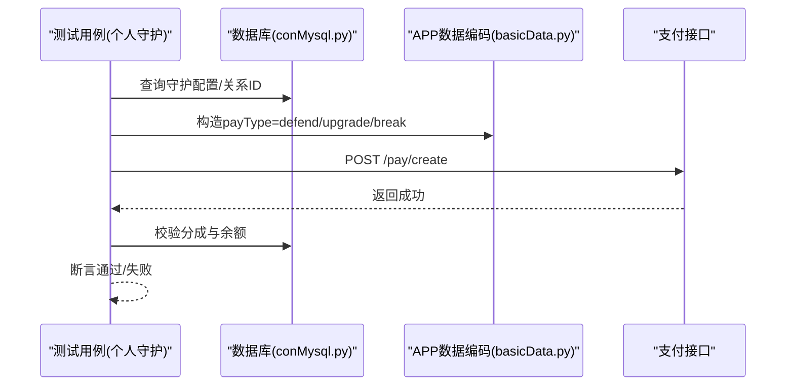
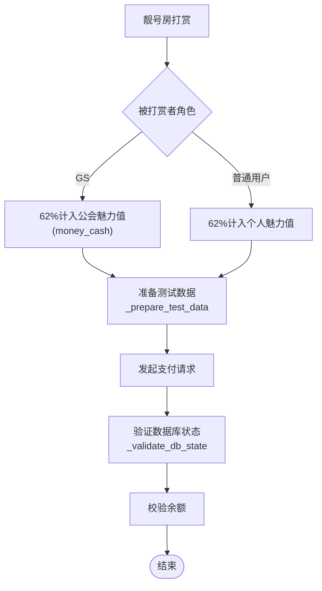
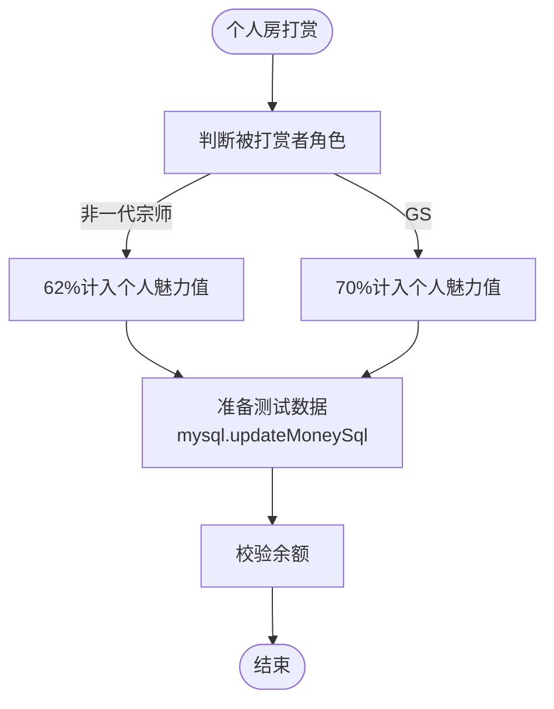
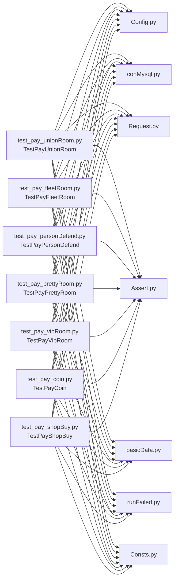

# 房间支付测试

<cite>
**本文引用的文件**
- [README.md](file://README.md)
- [Config.py](file://common/Config.py)
- [conMysql.py](file://common/conMysql.py)
- [basicData.py](file://common/basicData.py)
- [Assert.py](file://common/Assert.py)
- [Request.py](file://common/Request.py)
- [runFailed.py](file://common/runFailed.py)
- [Consts.py](file://common/Consts.py)
- [test_pay_unionRoom.py](file://case/test_pay_unionRoom.py)
- [test_pay_fleetRoom.py](file://case/test_pay_fleetRoom.py)
- [test_pay_personDefend.py](file://case/test_pay_personDefend.py)
- [test_pay_prettyRoom.py](file://case/test_pay_prettyRoom.py)
- [test_pay_vipRoom.py](file://case/test_pay_vipRoom.py)
- [test_pay_coin.py](file://case/test_pay_coin.py)
- [test_pay_shopBuy.py](file://case/test_pay_shopBuy.py)
</cite>

## 更新摘要
**所做更改**
- 更新了房间支付测试从PT数据编码改为APP数据编码
- 更新了用户配置从pt_user到app_user（AppUserConfig）
- 移除了房间送箱子相关测试方法
- 标准化了测试用例结构，统一了测试方法命名规范
- 改进了失败重试机制，支持更灵活的重试配置
- 优化了测试用例的断言策略和数据库验证方法

## 目录
1. [简介](#简介)
2. [项目结构](#项目结构)
3. [核心组件](#核心组件)
4. [架构总览](#架构总览)
5. [详细组件分析](#详细组件分析)
6. [依赖分析](#依赖分析)
7. [性能考虑](#性能考虑)
8. [故障排查指南](#故障排查指南)
9. [结论](#结论)
10. [附录](#附录)

## 简介
本文件面向"房间支付测试"场景，系统化梳理并输出联盟房、舰队房、个人守护、美颜房、VIP房等房间类型的支付测试方案。经过重构后，测试用例采用了更加标准化的结构和框架，包括统一的测试生命周期管理、数据准备和验证框架，以及改进的失败重试机制。内容覆盖：
- 各房间类型的费用标准与分成比例
- 支付流程差异与参数构造
- 权限与角色判定（公会/家族/一代宗师/普通用户）
- 房间功能权限验证与房间状态变更
- 房间预订流程、权限验证、消费记录与状态同步机制
- 场景化的权限验证方法、费用计算策略与状态同步要点
- 标准化的测试用例结构和生命周期管理

**更新** 房间支付测试现已从PT数据编码迁移到APP数据编码，用户配置从pt_user更新为app_user，移除了房间送箱子相关测试方法，提升了测试的统一性和准确性。

## 项目结构
该仓库采用按功能域划分的组织方式，核心测试用例集中在 case 目录，通用能力位于 common 目录。经过重构后，测试用例采用了统一的类结构和方法命名规范：

- common：配置、数据库访问、HTTP 请求、断言、重试、常量等
- case：各业务场景测试用例，采用统一的 TestPayXxx 类结构，包含数据准备、验证框架和生命周期管理

```mermaid
graph TB
subgraph "通用层(common)"
CFG["Config.py<br/>配置与URL/用户/礼物ID"]
DB["conMysql.py<br/>MySQL查询/更新/清理"]
REQ["Request.py<br/>HTTP请求封装"]
ASS["Assert.py<br/>断言封装"]
BASIC["basicData.py<br/>APP数据编码"]
RUN["runFailed.py<br/>失败重试装饰器"]
CONST["Consts.py<br/>全局变量"]
end
subgraph "测试用例(case)"
U["test_pay_unionRoom.py<br/>联盟房<br/>TestPayUnionRoom"]
F["test_pay_fleetRoom.py<br/>舰队房<br/>TestPayFleetRoom"]
D["test_pay_personDefend.py<br/>个人守护<br/>TestPayPersonDefend"]
P["test_pay_prettyRoom.py<br/>美颜房<br/>TestPayPrettyRoom"]
V["test_pay_vipRoom.py<br/>VIP房<br/>TestPayVipRoom"]
C["test_pay_coin.py<br/>金币/余额兑换<br/>TestPayCoin"]
S["test_pay_shopBuy.py<br/>商城购买<br/>TestPayShopBuy"]
end
U --> CFG
F --> CFG
D --> CFG
P --> CFG
V --> CFG
C --> CFG
S --> CFG
U --> DB
F --> DB
D --> DB
P --> DB
V --> DB
C --> DB
S --> DB
U --> REQ
F --> REQ
D --> REQ
P --> REQ
V --> REQ
C --> REQ
S --> REQ
U --> ASS
F --> ASS
D --> ASS
P --> ASS
V --> ASS
C --> ASS
S --> ASS
U --> BASIC
F --> BASIC
D --> BASIC
P --> BASIC
V --> BASIC
C --> BASIC
S --> BASIC
U --> RUN
F --> RUN
D --> RUN
P --> RUN
V --> RUN
C --> RUN
S --> RUN
U --> CONST
F --> CONST
D --> CONST
P --> CONST
V --> CONST
C --> CONST
S --> CONST
```

**图表来源**
- [Config.py:1-247](file://common/Config.py#L1-L247)
- [conMysql.py:1-530](file://common/conMysql.py#L1-L530)
- [Request.py:1-162](file://common/Request.py#L1-L162)
- [Assert.py:1-96](file://common/Assert.py#L1-L96)
- [basicData.py:1-647](file://common/basicData.py#L1-L647)
- [runFailed.py:1-87](file://common/runFailed.py#L1-L87)
- [Consts.py:1-17](file://common/Consts.py#L1-L17)
- [test_pay_unionRoom.py:13-14](file://case/test_pay_unionRoom.py#L13-L14)
- [test_pay_fleetRoom.py:12-13](file://case/test_pay_fleetRoom.py#L12-L13)
- [test_pay_personDefend.py:13-14](file://case/test_pay_personDefend.py#L13-L14)
- [test_pay_prettyRoom.py:12-13](file://case/test_pay_prettyRoom.py#L12-L13)
- [test_pay_vipRoom.py:12-13](file://case/test_pay_vipRoom.py#L12-L13)
- [test_pay_coin.py:13-14](file://case/test_pay_coin.py#L13-L14)
- [test_pay_shopBuy.py:13-14](file://case/test_pay_shopBuy.py#L13-L14)

**章节来源**
- [README.md:1-38](file://README.md#L1-L38)

## 核心组件
- 配置中心（Config.py）
  - 提供支付接口地址、用户UID集合、礼物ID映射、房间ID、统一分成比例等
  - 用户配置已从pt_user更新为app_user（AppUserConfig）
- 数据访问（conMysql.py）
  - 封装查询/更新/清理用户余额、房间ID、守护关系、消费记录等
- 请求封装（Request.py）
  - 统一封装POST请求、头信息、响应解析与耗时统计
- 断言封装（Assert.py）
  - 提供状态码、返回体、相等性、区间、长度等断言
- 参数编码（basicData.py）
  - 构造不同支付场景的请求参数（房间打赏、商城购买、守护等）
  - 已从PT数据编码迁移到APP数据编码
- 失败重试（runFailed.py）
  - 通过装饰器实现用例失败自动重试与初始化/清理
- 全局常量（Consts.py）
  - 记录用例执行结果、失败原因、并发统计等

**更新** 用户配置已从pt_user更新为app_user，使用AppUserConfig类提供APP用户的UID配置。

**章节来源**
- [Config.py:93-118](file://common/Config.py#L93-L118)
- [conMysql.py:27-204](file://common/conMysql.py#L27-L204)
- [Request.py:17-59](file://common/Request.py#L17-L59)
- [Assert.py:11-96](file://common/Assert.py#L11-L96)
- [basicData.py:501-571](file://common/basicData.py#L501-L571)
- [runFailed.py:10-87](file://common/runFailed.py#L10-L87)
- [Consts.py:4-17](file://common/Consts.py#L4-L17)

## 架构总览
房间支付测试的整体流程经过重构后更加标准化：
- 初始化：准备用户余额、房间ID、礼物ID
- 编码参数：根据房间类型与场景选择编码策略
- 发起请求：调用支付接口
- 校验结果：断言状态码、返回体与账户余额变化
- 记录与清理：写入结果、必要时清理或重试

**更新** 参数编码已从PT数据编码迁移到APP数据编码，使用encodeData函数进行参数构造。

**图表来源**
- [basicData.py:501-571](file://common/basicData.py#L501-L571)
- [Request.py:17-59](file://common/Request.py#L17-L59)
- [conMysql.py:27-204](file://common/conMysql.py#L27-L204)
- [Assert.py:11-96](file://common/Assert.py#L11-L96)

## 详细组件分析

### 联盟房支付测试
- 场景要点
  - 直播公会成员在歌友房打赏：公会魅力值分成比例为60%
  - 普通公会成员在歌友房打赏：公会魅力值分成比例为62%
  - 非公会成员（如一代宗师/普通用户）：按62%计入个人魅力值
- 关键参数
  - 房间ID来自数据库查询
  - 打赏金额与礼物ID由配置提供
  - 分成比例由配置统一维护
- 断言策略
  - 校验接口状态码与返回体
  - 校验被打赏者余额（money_cash 或 sum_money）
  - 校验打赏者余额清零或剩余
- 用例路径
  - [test_01_singerRoomLiveBrokerRate_60:21-45](file://case/test_pay_unionRoom.py#L21-L45)
  - [test_02_singerRoomNormalBrokerRate_62:47-69](file://case/test_pay_unionRoom.py#L47-L69)
  - [test_04_singerRoomPayNormalUser:99-118](file://case/test_pay_unionRoom.py#L99-L118)

**图表来源**
- [test_pay_unionRoom.py:16-118](file://case/test_pay_unionRoom.py#L16-L118)
- [Config.py:136-181](file://common/Config.py#L136-L181)
- [conMysql.py:27-204](file://common/conMysql.py#L27-L204)
- [basicData.py:501-571](file://common/basicData.py#L501-L571)

**章节来源**
- [test_pay_unionRoom.py:1-185](file://case/test_pay_unionRoom.py#L1-L185)
- [Config.py:136-181](file://common/Config.py#L136-L181)
- [conMysql.py:27-204](file://common/conMysql.py#L27-L204)
- [basicData.py:501-571](file://common/basicData.py#L501-L571)

### 舰队房支付测试
- 场景要点
  - 同家族房内直播公会成员打赏：80%计入个人魅力值
  - 非本家族房内直播公会成员打赏：70%计入个人魅力值
  - 普通公会成员在同/非家族房打赏：同房80%，非房70%
  - 一代用户在同家族房打赏：按箱子价值的80%计入个人魅力值
  - 非家族房普通用户打赏：按62%计入个人魅力值
- 关键参数
  - 本家族房ID与非家族房ID均来自配置
  - 分成比例按房间与角色区分
- 断言策略
  - 校验被打赏者余额（money_cash_b）
  - 校验打赏者余额清零或剩余
- 用例路径
  - [test_01_sameFleetRoomLiveGsRate:45-79](file://case/test_pay_fleetRoom.py#L45-L79)
  - [test_02_otherFleetRoomLiveGsRate:81-115](file://case/test_pay_fleetRoom.py#L81-L115)
  - [test_03_sameFleetRoomNormalGsRate:117-151](file://case/test_pay_fleetRoom.py#L117-L151)
  - [test_04_otherFleetRoomNormalGsRate:153-192](file://case/test_pay_fleetRoom.py#L153-L192)
  - [test_05_sameFleetRoomPayNormalUser:194-233](file://case/test_pay_fleetRoom.py#L194-L233)
  - [test_06_otherFleetRoomNormalGsRate:235-268](file://case/test_pay_fleetRoom.py#L235-L268)

**更新** 舰队房测试类名已标准化为 TestPayFleetRoom，采用了统一的数据准备和验证框架，包括 _prepare_test_data 和 _validate_db_state 方法，提供了更清晰的测试生命周期管理。

**图表来源**
- [test_pay_fleetRoom.py:19-268](file://case/test_pay_fleetRoom.py#L19-L268)
- [Config.py:136-181](file://common/Config.py#L136-L181)

**章节来源**
- [test_pay_fleetRoom.py:1-269](file://case/test_pay_fleetRoom.py#L1-L269)
- [Config.py:136-181](file://common/Config.py#L136-L181)

### 个人守护支付测试
- 场景要点
  - 开通个人守护：师父（非一代宗师）获得62%分成，官方保留38%
  - 进阶版购买：在师父收益基础上保持62:38
  - 强制解除：收益归官方
  - GS用户开通/进阶：同样按62%计入公会魅力值（money_cash）
- 关键参数
  - 守护配置ID与进阶/解约金额来自数据库查询
  - payType 区分为 defend、defend-upgrade、defend-break
- 断言策略
  - 校验打赏者余额变化
  - 校验被打赏者余额（single_money 或 sum_money）
- 用例路径
  - [test_01_defendPayChangMoney:38-75](file://case/test_pay_personDefend.py#L38-L75)
  - [test_02_defendUpgradePayChangeMoney:77-115](file://case/test_pay_personDefend.py#L77-L115)
  - [test_03_defendBreakPayChangeMoney:117-152](file://case/test_pay_personDefend.py#L117-L152)
  - [test_04_defendPayToGs:154-193](file://case/test_pay_personDefend.py#L154-L193)
  - [test_05_defendUpgradeToGs:195-233](file://case/test_pay_personDefend.py#L195-L233)
  - [test_06_defendBreakPayMoney:235-270](file://case/test_pay_personDefend.py#L235-L270)

**更新** 个人守护测试类名已标准化为 TestPayPersonDefend，引入了统一的数据准备和验证框架，提供了更清晰的测试方法结构和断言策略。

**图表来源**
- [test_pay_personDefend.py:16-270](file://case/test_pay_personDefend.py#L16-L270)
- [conMysql.py:142-164](file://common/conMysql.py#L142-L164)
- [basicData.py:501-571](file://common/basicData.py#L501-L571)

**章节来源**
- [test_pay_personDefend.py:1-271](file://case/test_pay_personDefend.py#L1-L271)
- [conMysql.py:142-164](file://common/conMysql.py#L142-L164)
- [basicData.py:501-571](file://common/basicData.py#L501-L571)

### 美颜房支付测试
- 场景要点
  - GS用户在靓号房打赏礼物：62%计入公会魅力值（money_cash）
  - 普通用户在靓号房打赏：62%计入个人魅力值
- 关键参数
  - 房间ID来自配置
  - 分成比例统一为62%
- 断言策略
  - 校验被打赏者余额（single_money/money_cash）
  - 校验打赏者余额
- 用例路径
  - [test_01_prettyRoomPayGiftToBrokerUser:38-71](file://case/test_pay_prettyRoom.py#L38-L71)
  - [test_03_prettyRoomPayGiftToNormalUser:108-141](file://case/test_pay_prettyRoom.py#L108-L141)

**更新** 美颜房测试类名已标准化为 TestPayPrettyRoom，采用了统一的数据准备和验证框架，提供了更清晰的测试方法结构和断言策略。

**图表来源**
- [test_pay_prettyRoom.py:16-141](file://case/test_pay_prettyRoom.py#L16-L141)
- [Config.py:136-181](file://common/Config.py#L136-L181)

**章节来源**
- [test_pay_prettyRoom.py:1-142](file://case/test_pay_prettyRoom.py#L1-L142)
- [Config.py:136-181](file://common/Config.py#L136-L181)

### VIP房支付测试
- 场景要点
  - 个人房打赏礼物：非一代宗师用户按62%计入个人魅力值（money_cash_b）
  - GS用户在个人房打赏礼物：70%计入个人魅力值（money_cash_b）
- 关键参数
  - 房间ID来自配置
  - 分成比例按角色区分（62% vs 70%）
- 断言策略
  - 校验被打赏者余额（single_money/sum_money）
  - 校验打赏者余额
- 用例路径
  - [test_01_personRoomPayGift:18-39](file://case/test_pay_vipRoom.py#L18-L39)
  - [test_03_personRoomPayGiftToBrokerUser:67-89](file://case/test_pay_vipRoom.py#L67-L89)

**更新** VIP房测试类名已标准化为 TestPayVipRoom，采用了统一的测试方法结构，提供了清晰的断言策略和数据库验证方法。

**图表来源**
- [test_pay_vipRoom.py:18-89](file://case/test_pay_vipRoom.py#L18-L89)
- [Config.py:136-181](file://common/Config.py#L136-L181)

**章节来源**
- [test_pay_vipRoom.py:1-141](file://case/test_pay_vipRoom.py#L1-L141)
- [Config.py:136-181](file://common/Config.py#L136-L181)

### 金币/余额兑换与房间打赏
- 场景要点
  - 余额兑换金币：校验钻石减少、金币增加
  - 房间内打赏金币礼物：按62%分成至被打赏者（含个人与GS）
  - VIP经验累计：根据房间消费与VIP经验规则累加
- 关键参数
  - payType=exchange_gold、package-more（coin）
- 断言策略
  - 校验余额字段（gold_coin、money、pay_room_money）
- 用例路径
  - [test_01_moneyChangeExchangeCoin:42-74](file://case/test_pay_coin.py#L42-L74)
  - [test_02_roomChangePayCoin:76-119](file://case/test_pay_coin.py#L76-L119)

**更新** 金币测试类名已标准化为 TestPayCoin，引入了统一的数据准备和验证框架，提供了更清晰的测试生命周期管理和断言策略。

**章节来源**
- [test_pay_coin.py:1-120](file://case/test_pay_coin.py#L1-L120)
- [basicData.py:249-275](file://common/basicData.py#L249-L275)

### 商城购买与房间打赏
- 场景要点
  - 商城购买道具：校验余额与背包数量
  - 房间内打赏背包道具：按62%分成至被打赏者
  - 物品不足时应提示余额不足
- 关键参数
  - payType=shop-buy、package（ctype=’gift’, package_cid）
- 断言策略
  - 校验余额、背包数量、返回体msg
- 用例路径
  - [test_01_shopPayChangeMoney:21-42](file://case/test_pay_shopBuy.py#L21-L42)
  - [test_02_shopPayChangeBuyMore:45-67](file://case/test_pay_shopBuy.py#L45-L67)
  - [test_03_shopGiftToUser:70-94](file://case/test_pay_shopBuy.py#L70-L94)
  - [test_04_shopGiftToUserNoEnough:97-123](file://case/test_pay_shopBuy.py#L97-L123)

**更新** 商城购买测试类名已标准化为 TestPayShopBuy，采用了统一的测试方法结构和断言策略，提供了清晰的场景化测试流程。

**章节来源**
- [test_pay_shopBuy.py:1-124](file://case/test_pay_shopBuy.py#L1-L124)
- [basicData.py:177-325](file://common/basicData.py#L177-L325)

## 依赖分析
- 组件耦合
  - 测试用例依赖配置中心（Config.py）提供URL、用户UID、礼物ID、房间ID与分成比例
  - 用户配置已从pt_user更新为app_user，使用AppUserConfig类
  - 数据访问层（conMysql.py）贯穿所有用例，用于准备与校验余额、房间ID、守护关系、消费记录
  - 请求封装（Request.py）统一处理HTTP交互
  - 断言封装（Assert.py）统一断言策略
  - 参数编码（basicData.py）根据payType生成不同场景的请求体
  - 失败重试（runFailed.py）为用例提供重试能力
- 外部依赖
  - 支付接口（/pay/create）与数据库（xianshi库）为关键外部依赖
- 循环依赖
  - 未发现循环导入；模块职责清晰

**更新** 依赖分析已更新，反映了从PT数据编码到APP数据编码的迁移和用户配置的更新。

**图表来源**
- [test_pay_unionRoom.py:1-185](file://case/test_pay_unionRoom.py#L1-L185)
- [test_pay_fleetRoom.py:1-269](file://case/test_pay_fleetRoom.py#L1-L269)
- [test_pay_personDefend.py:1-271](file://case/test_pay_personDefend.py#L1-L271)
- [test_pay_prettyRoom.py:1-142](file://case/test_pay_prettyRoom.py#L1-L142)
- [test_pay_vipRoom.py:1-141](file://case/test_pay_vipRoom.py#L1-L141)
- [test_pay_coin.py:1-120](file://case/test_pay_coin.py#L1-L120)
- [test_pay_shopBuy.py:1-124](file://case/test_pay_shopBuy.py#L1-L124)
- [Config.py:1-247](file://common/Config.py#L1-L247)
- [conMysql.py:1-530](file://common/conMysql.py#L1-L530)
- [Request.py:1-162](file://common/Request.py#L1-L162)
- [Assert.py:1-96](file://common/Assert.py#L1-L96)
- [basicData.py:1-647](file://common/basicData.py#L1-L647)
- [runFailed.py:1-87](file://common/runFailed.py#L1-L87)

**章节来源**
- [Config.py:1-247](file://common/Config.py#L1-L247)
- [conMysql.py:1-530](file://common/conMysql.py#L1-L530)
- [Request.py:1-162](file://common/Request.py#L1-L162)
- [Assert.py:1-96](file://common/Assert.py#L1-L96)
- [basicData.py:1-647](file://common/basicData.py#L1-L647)
- [runFailed.py:1-87](file://common/runFailed.py#L1-L87)

## 性能考虑
- 接口延迟与稳定性
  - 在非目标节点环境下，断言层存在短暂等待以规避RPC延迟导致的误判
- 并发与重试
  - 使用失败重试装饰器对用例进行自动重试，减少偶发抖动影响
  - 支持灵活的重试配置，包括最大重试次数和函数前缀过滤
- 数据准备与清理
  - 通过数据库批量更新与清理，确保用例独立性与可重复性
  - 统一的测试生命周期管理，包括 setUp 和 tearDown 方法

**更新** 失败重试机制已改进，支持更灵活的配置选项，包括最大重试次数和函数前缀过滤，提高了测试的稳定性和可靠性。

**章节来源**
- [Assert.py:17-25](file://common/Assert.py#L17-L25)
- [runFailed.py:10-87](file://common/runFailed.py#L10-L87)

## 故障排查指南
- 常见问题定位
  - 接口状态码异常：检查URL、头信息与token有效性
  - 返回体不符：核对payType与参数编码是否匹配场景
  - 余额校验失败：确认数据库查询字段与期望值一致
  - 房间ID/用户UID错误：核对配置中心与数据库一致性
- 建议排查步骤
  - 打印并核对请求体与响应体
  - 逐步缩小范围：先验证接口连通性，再验证参数编码，最后验证断言
  - 使用失败重试装饰器观察是否为偶发问题
  - 利用统一的数据准备和验证框架快速定位问题
- 相关工具
  - 请求封装与断言封装已内置日志打印与异常捕获
  - 统一的测试生命周期管理简化了调试过程

**更新** 故障排查指南已更新，增加了对新测试框架特性的指导，包括数据准备和验证框架的使用方法。

**章节来源**
- [Request.py:17-59](file://common/Request.py#L17-L59)
- [Assert.py:11-96](file://common/Assert.py#L11-L96)
- [runFailed.py:10-87](file://common/runFailed.py#L10-L87)

## 结论
本测试体系经过重构后，围绕"房间支付"核心场景，覆盖联盟房、舰队房、个人守护、美颜房、VIP房等多类型房间，结合配置中心、数据库访问、请求封装、断言与参数编码等通用能力，形成了更加标准化、可复用、可扩展、可重试的自动化测试方案。通过统一的测试类结构、数据准备和验证框架、测试生命周期管理和改进的失败重试机制，能够稳定验证房间支付流程的正确性与一致性，同时提高了测试代码的可维护性和可读性。

**更新** 房间支付测试现已完成从PT数据编码到APP数据编码的迁移，用户配置从pt_user更新为app_user，移除了房间送箱子相关测试方法，进一步提升了测试的统一性和准确性。

## 附录
- 术语说明
  - 公会魅力值：房间内打赏收益进入公会账户的指标
  - 个人魅力值：房间内打赏收益进入个人账户的指标
  - GS用户：公会用户
  - 一代宗师：特殊等级用户，分成比例与普通用户不同
  - 测试生命周期：包括 setUp、测试方法执行、tearDown 的完整流程
  - 数据准备框架：_prepare_test_data 方法提供的统一数据准备机制
  - 验证框架：_validate_db_state 方法提供的统一数据库状态验证机制
- 参考用例路径
  - 联盟房：[test_pay_unionRoom.py:1-185](file://case/test_pay_unionRoom.py#L1-L185)
  - 舰队房：[test_pay_fleetRoom.py:1-269](file://case/test_pay_fleetRoom.py#L1-L269)
  - 个人守护：[test_pay_personDefend.py:1-271](file://case/test_pay_personDefend.py#L1-L271)
  - 美颜房：[test_pay_prettyRoom.py:1-142](file://case/test_pay_prettyRoom.py#L1-L142)
  - VIP房：[test_pay_vipRoom.py:1-141](file://case/test_pay_vipRoom.py#L1-L141)
  - 金币/余额：[test_pay_coin.py:1-120](file://case/test_pay_coin.py#L1-L120)
  - 商城购买：[test_pay_shopBuy.py:1-124](file://case/test_pay_shopBuy.py#L1-L124)
- 更新说明
  - 数据编码：从PT数据编码迁移到APP数据编码
  - 用户配置：从pt_user更新为app_user
  - 移除功能：房间送箱子相关测试方法