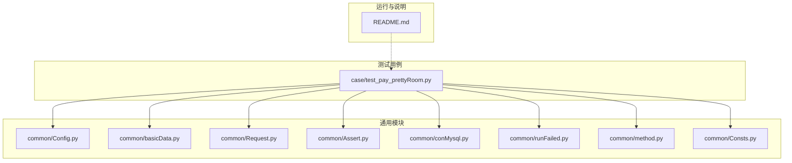
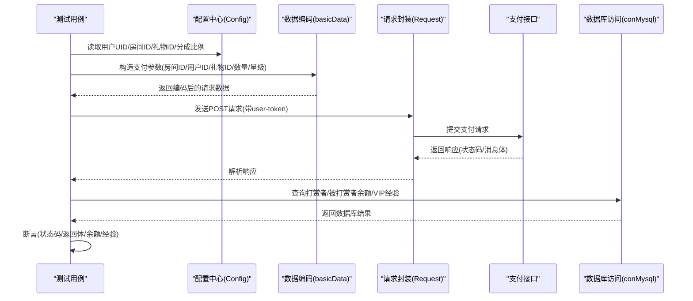
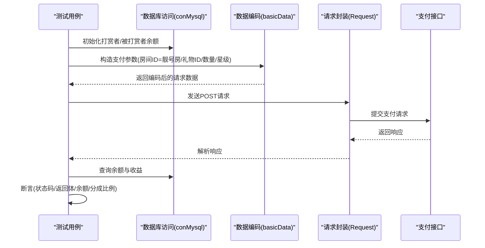
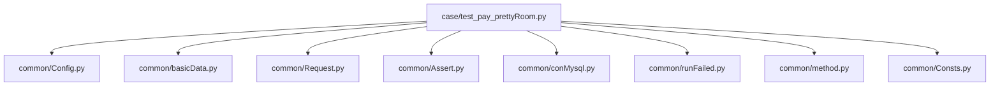

# 美颜房支付测试

<cite>
**本文引用的文件**
- [test_pay_prettyRoom.py](file://case/test_pay_prettyRoom.py)
- [Config.py](file://common/Config.py)
- [basicData.py](file://common/basicData.py)
- [Request.py](file://common/Request.py)
- [Assert.py](file://common/Assert.py)
- [conMysql.py](file://common/conMysql.py)
- [runFailed.py](file://common/runFailed.py)
- [method.py](file://common/method.py)
- [Consts.py](file://common/Consts.py)
- [README.md](file://README.md)
</cite>

## 目录
1. [简介](#简介)
2. [项目结构](#项目结构)
3. [核心组件](#核心组件)
4. [架构总览](#架构总览)
5. [详细组件分析](#详细组件分析)
6. [依赖分析](#依赖分析)
7. [性能考虑](#性能考虑)
8. [故障排查指南](#故障排查指南)
9. [结论](#结论)
10. [附录](#附录)

## 简介
本文件面向“美颜房支付测试”的功能文档，聚焦于美颜房（靓号房）内的支付测试场景，覆盖以下方面：
- 美颜功能的付费使用与权限验证
- 美颜效果激活与验证
- 美颜服务计费与费用结算
- 美颜房内的功能使用限制、等级要求、效果检测与费用计算逻辑
- 支付流程、权限控制策略与费用结算验证方法

通过并行解析测试用例、配置、请求封装、断言与数据库访问模块，形成从接口到数据库的完整验证闭环。

## 项目结构
项目采用按业务域分层组织，其中与美颜房支付测试直接相关的核心目录与文件如下：
- case：存放各业务支付测试用例，包含美颜房相关用例文件
- common：通用工具与基础设施，包括配置、请求封装、断言、数据库访问、重试机制、辅助方法等
- 根目录：运行入口与说明文档

**图表来源**
- [test_pay_prettyRoom.py:1-90](file://case/test_pay_prettyRoom.py#L1-L90)
- [Config.py:1-133](file://common/Config.py#L1-L133)
- [basicData.py:1-581](file://common/basicData.py#L1-L581)
- [Request.py:1-162](file://common/Request.py#L1-L162)
- [Assert.py:1-96](file://common/Assert.py#L1-L96)
- [conMysql.py:1-530](file://common/conMysql.py#L1-L530)
- [runFailed.py:1-87](file://common/runFailed.py#L1-L87)
- [method.py:1-171](file://common/method.py#L1-L171)
- [Consts.py:1-17](file://common/Consts.py#L1-L17)
- [README.md:1-38](file://README.md#L1-L38)

**章节来源**
- [README.md:1-38](file://README.md#L1-L38)

## 核心组件
- 配置中心：集中管理支付URL、用户UID、房间ID、礼物ID、分成比例等关键参数
- 请求封装：统一POST请求、头信息注入、响应解析与耗时统计
- 数据编码：根据支付场景动态构造请求参数（房间ID、用户ID、礼物ID、数量、星级等）
- 断言模块：统一的状态码、返回体、长度、相等性与区间断言
- 数据库访问：查询与更新用户账户余额、VIP经验、背包与关系配置等
- 重试机制：用例失败自动重试，提升稳定性
- 辅助方法：VIP经验计算、错误原因收集、字典转Markdown等

**章节来源**
- [Config.py:1-133](file://common/Config.py#L1-L133)
- [Request.py:17-59](file://common/Request.py#L17-L59)
- [basicData.py:8-325](file://common/basicData.py#L8-L325)
- [Assert.py:11-96](file://common/Assert.py#L11-L96)
- [conMysql.py:27-204](file://common/conMysql.py#L27-L204)
- [runFailed.py:10-87](file://common/runFailed.py#L10-L87)
- [method.py:163-171](file://common/method.py#L163-L171)

## 架构总览
美颜房支付测试的整体流程如下：
- 初始化测试数据（更新用户余额、VIP经验等）
- 编码支付请求（选择美颜房场景、礼物、数量、星级等）
- 发起支付请求（带token头）
- 校验接口返回（状态码、success标志、消息体）
- 校验数据库变更（打赏者余额、被打赏者收益、VIP经验等）

**图表来源**
- [test_pay_prettyRoom.py:16-89](file://case/test_pay_prettyRoom.py#L16-L89)
- [Config.py:49-94](file://common/Config.py#L49-L94)
- [basicData.py:8-101](file://common/basicData.py#L8-L101)
- [Request.py:17-59](file://common/Request.py#L17-L59)
- [conMysql.py:27-73](file://common/conMysql.py#L27-L73)

## 详细组件分析

### 组件A：美颜房支付测试用例（靓号房）
该组件负责验证靓号房内的打赏行为，包括：
- 打赏礼物给公会成员（分成62%进入公会魅力值）
- 打赏礼盒给公会成员（分成62%进入公会魅力值）
- 打赏礼物给普通用户（分成62%进入个人魅力值）

测试要点：
- 使用数据库工具初始化打赏者与被打赏者的账户余额
- 通过数据编码模块构造支付请求参数（房间ID、礼物ID、数量、星级等）
- 调用请求封装发送支付请求
- 断言接口返回与数据库余额变化

**图表来源**
- [test_pay_prettyRoom.py:16-89](file://case/test_pay_prettyRoom.py#L16-L89)
- [conMysql.py:349-360](file://common/conMysql.py#L349-L360)
- [basicData.py:8-101](file://common/basicData.py#L8-L101)
- [Request.py:17-59](file://common/Request.py#L17-L59)

**章节来源**
- [test_pay_prettyRoom.py:16-89](file://case/test_pay_prettyRoom.py#L16-L89)

### 组件B：配置中心（Config）
- 支付URL、靓号房房间ID、用户UID、礼物ID、分成比例等集中管理
- 便于跨用例共享与维护

关键字段：
- 支付URL：用于发起支付请求
- 靓号房房间ID：用于定位美颜房场景
- 用户UID：打赏者、被打赏者、公会成员等
- 礼物ID：不同礼物对应不同价值
- 分成比例：62%

**章节来源**
- [Config.py:49-94](file://common/Config.py#L49-L94)

### 组件C：数据编码（basicData）
- 根据支付场景动态构造请求参数
- 支持多种支付类型（package、package-more、package-exchange、chat-gift、shop-buy等）
- 对于美颜房场景，主要使用package与package-more类型，设置房间ID、用户ID、礼物ID、数量、星级等

典型流程：
- 选择payType为package或package-more
- 设置rid为靓号房房间ID
- 设置uid为被打赏者UID
- 设置giftId为指定礼物ID
- 设置num为礼物数量
- 设置star为星级（如1）

**章节来源**
- [basicData.py:8-101](file://common/basicData.py#L8-L101)
- [basicData.py:41-73](file://common/basicData.py#L41-L73)

### 组件D：请求封装（Request）
- 统一POST请求，自动注入user-token与Content-Type
- 自动将URL升级为HTTPS
- 解析响应状态码、body与耗时

**章节来源**
- [Request.py:17-59](file://common/Request.py#L17-L59)

### 组件E：断言模块（Assert）
- 统一断言方法：状态码、返回体、长度、相等性、区间
- 在断言失败时记录失败原因，便于问题定位

**章节来源**
- [Assert.py:11-96](file://common/Assert.py#L11-L96)

### 组件F：数据库访问（conMysql）
- 查询用户账户余额、VIP经验、人气等级、背包物品等
- 更新用户余额、VIP经验、关系配置等
- 支持批量更新与清理操作

在美颜房测试中常用：
- 查询sum_money（账户余额合计）
- 查询single_money（指定账户余额）
- 更新updateMoneySql（初始化余额）

**章节来源**
- [conMysql.py:27-73](file://common/conMysql.py#L27-L73)
- [conMysql.py:349-360](file://common/conMysql.py#L349-L360)

### 组件G：重试机制（runFailed）
- 用例失败自动重试，减少偶发网络波动影响
- 可配置重试次数与前缀匹配

**章节来源**
- [runFailed.py:10-87](file://common/runFailed.py#L10-L87)

### 组件H：辅助方法（method）
- VIP经验计算：根据用户爵位等级与支付金额计算VIP经验
- 错误原因收集：统一记录失败原因
- 字典转Markdown：便于报告输出

**章节来源**
- [method.py:163-171](file://common/method.py#L163-L171)

## 依赖分析
测试用例与通用模块之间的依赖关系如下：

**图表来源**
- [test_pay_prettyRoom.py:1-90](file://case/test_pay_prettyRoom.py#L1-L90)
- [Config.py:1-133](file://common/Config.py#L1-L133)
- [basicData.py:1-581](file://common/basicData.py#L1-L581)
- [Request.py:1-162](file://common/Request.py#L1-L162)
- [Assert.py:1-96](file://common/Assert.py#L1-L96)
- [conMysql.py:1-530](file://common/conMysql.py#L1-L530)
- [runFailed.py:1-87](file://common/runFailed.py#L1-L87)
- [method.py:1-171](file://common/method.py#L1-L171)
- [Consts.py:1-17](file://common/Consts.py#L1-L17)

**章节来源**
- [test_pay_prettyRoom.py:1-90](file://case/test_pay_prettyRoom.py#L1-L90)

## 性能考虑
- RPC接口延迟：断言模块在特定环境下会引入短暂等待，避免过早断言导致的失败
- 请求耗时统计：请求封装记录单次请求耗时，便于性能监控
- 重试机制：失败自动重试，降低不稳定因素对整体测试的影响

**章节来源**
- [Assert.py:17-18](file://common/Assert.py#L17-L18)
- [Request.py:48-58](file://common/Request.py#L48-L58)
- [runFailed.py:46-77](file://common/runFailed.py#L46-L77)

## 故障排查指南
常见问题与排查建议：
- 接口状态码异常：检查请求头中的user-token是否正确，确认URL是否为HTTPS
- 返回体不一致：核对请求参数（房间ID、用户ID、礼物ID、数量、星级）是否与配置一致
- 余额不一致：确认数据库初始化脚本是否执行，检查VIP经验计算是否符合预期
- 断言失败：查看失败原因收集日志，结合数据库查询结果定位问题

**章节来源**
- [Assert.py:11-96](file://common/Assert.py#L11-L96)
- [method.py:115-122](file://common/method.py#L115-L122)

## 结论
本测试文档围绕美颜房支付场景，系统梳理了配置、请求、编码、断言、数据库与重试等关键组件，并通过具体用例展示了从接口调用到数据库验证的完整流程。通过统一的断言与失败重试机制，确保测试结果的稳定与可靠；通过VIP经验计算与分成比例校验，保障费用结算逻辑的准确性。

## 附录
- 美颜房支付流程要点
  - 场景选择：使用package或package-more类型，设置房间ID为靓号房
  - 权限验证：确认被打赏者是否为公会成员或普通用户，影响分成比例
  - 效果验证：检查打赏者余额与被打赏者收益是否符合预期
  - 费用结算：VIP经验按支付金额与爵位系数计算，确保经验增长符合规则

- 关键参数与配置
  - 支付URL、靓号房房间ID、用户UID、礼物ID、分成比例
  - 请求头：user-token、Content-Type、Connection
  - 数据库：账户余额、VIP经验、背包与关系配置

**章节来源**
- [Config.py:49-94](file://common/Config.py#L49-L94)
- [basicData.py:8-101](file://common/basicData.py#L8-L101)
- [Request.py:27-32](file://common/Request.py#L27-L32)
- [conMysql.py:27-73](file://common/conMysql.py#L27-L73)
- [method.py:163-171](file://common/method.py#L163-L171)