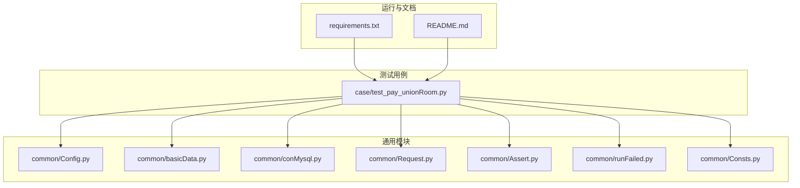
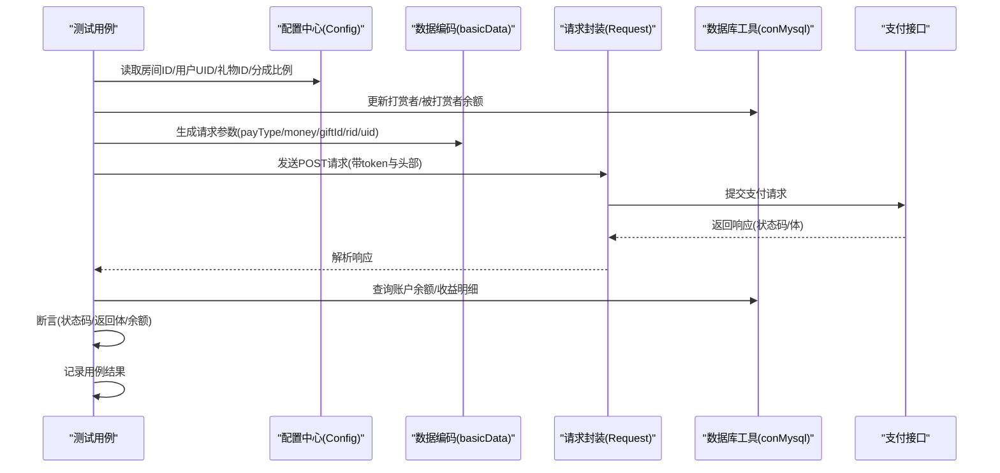
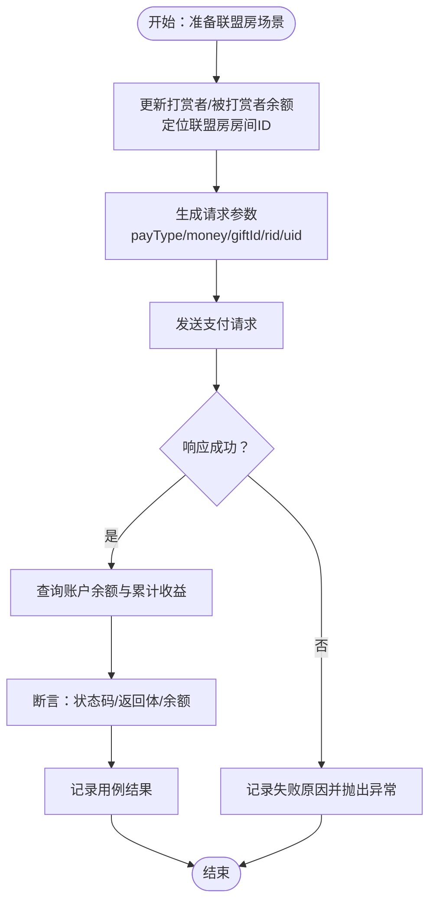
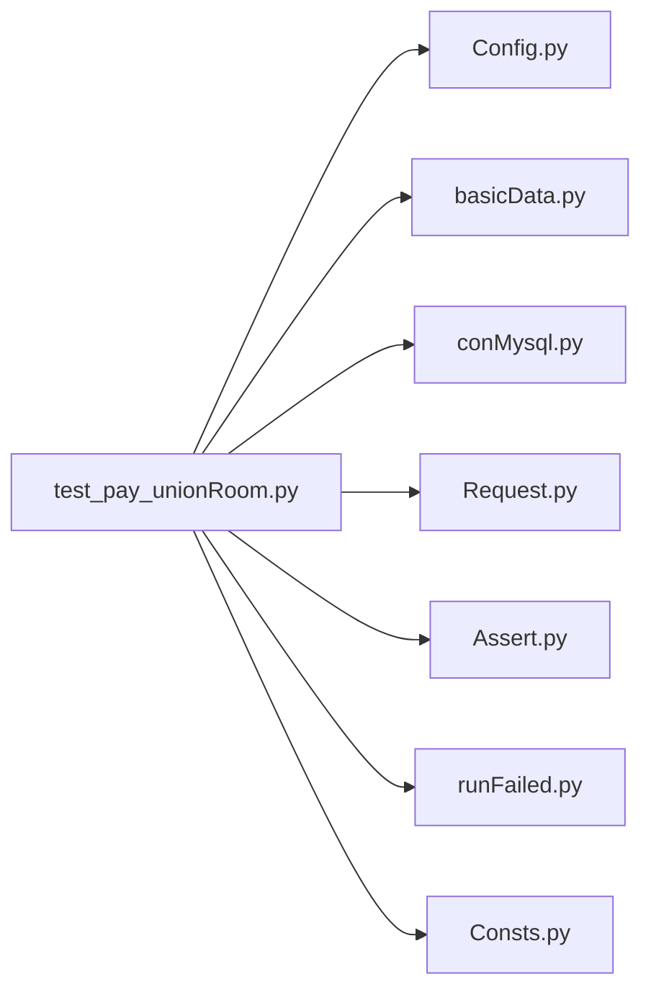

# 联盟房支付测试

<cite>
**本文引用的文件**
- [test_pay_unionRoom.py](file://case/test_pay_unionRoom.py)
- [Config.py](file://common/Config.py)
- [basicData.py](file://common/basicData.py)
- [conMysql.py](file://common/conMysql.py)
- [Request.py](file://common/Request.py)
- [Assert.py](file://common/Assert.py)
- [runFailed.py](file://common/runFailed.py)
- [Consts.py](file://common/Consts.py)
- [README.md](file://README.md)
- [requirements.txt](file://requirements.txt)
</cite>

## 目录
1. [简介](#简介)
2. [项目结构](#项目结构)
3. [核心组件](#核心组件)
4. [架构总览](#架构总览)
5. [详细组件分析](#详细组件分析)
6. [依赖分析](#依赖分析)
7. [性能考虑](#性能考虑)
8. [故障排查指南](#故障排查指南)
9. [结论](#结论)
10. [附录](#附录)

## 简介
本文件面向“联盟房支付测试”，系统化梳理歌友房（联盟房）内的支付与收益分配测试场景，覆盖以下核心目标：
- 歌友房内直播公会成员礼物打赏的60%公会魅力值分配
- 歌友房内普通公会成员礼物打赏的62%公会魅力值分配
- 歌友房内箱子打赏的公会魅力值计算
- 歌友房内普通用户（非公会成员）礼物打赏的个人魅力值分配
- 联盟房内的公会权限验证机制、魅力值分配规则、房间功能限制、公会成员身份验证
- 联盟房打赏流程、公会收益计算、房间权限控制、魅力值到账验证
- 权限判断方法、收益分配算法与房间状态管理机制

该测试体系基于统一的配置、编码、请求、断言与数据库工具，确保测试用例可重复、可追踪、可重试。

## 项目结构
项目采用按功能域划分的目录组织，其中与联盟房支付直接相关的核心目录与文件如下：
- case：存放各类支付场景测试用例，联盟房测试位于 test_pay_unionRoom.py
- common：通用模块，包括配置、请求封装、数据库操作、断言、重试与常量等
- requirements.txt：依赖清单

图表来源
- [test_pay_unionRoom.py:1-119](file://case/test_pay_unionRoom.py#L1-L119)
- [Config.py:1-133](file://common/Config.py#L1-L133)
- [basicData.py:1-581](file://common/basicData.py#L1-L581)
- [conMysql.py:1-530](file://common/conMysql.py#L1-L530)
- [Request.py:1-162](file://common/Request.py#L1-L162)
- [Assert.py:1-96](file://common/Assert.py#L1-L96)
- [runFailed.py:1-87](file://common/runFailed.py#L1-L87)
- [Consts.py:1-17](file://common/Consts.py#L1-L17)
- [requirements.txt:1-85](file://requirements.txt#L1-L85)
- [README.md:1-38](file://README.md#L1-L38)

章节来源
- [README.md:1-38](file://README.md#L1-L38)
- [requirements.txt:1-85](file://requirements.txt#L1-L85)

## 核心组件
- 配置中心（Config）：集中管理支付URL、用户UID、礼物ID、房间ID、分成比例等全局参数
- 数据编码（basicData）：根据payType生成标准化请求参数，支持礼物、箱子、多人打赏等场景
- 请求封装（Request）：统一POST请求，自动注入token与头部，解析响应状态与体
- 数据库工具（conMysql）：查询/更新/清理用户账户余额、公会关系、房间属性等
- 断言工具（Assert）：封装断言方法，统一失败原因收集与异常抛出
- 重试机制（runFailed）：对测试用例进行失败重试，提升稳定性
- 全局常量（Consts）：用例结果标记、失败原因列表、并发统计等

章节来源
- [Config.py:49-94](file://common/Config.py#L49-L94)
- [basicData.py:9-325](file://common/basicData.py#L9-L325)
- [Request.py:17-59](file://common/Request.py#L17-L59)
- [conMysql.py:27-204](file://common/conMysql.py#L27-L204)
- [Assert.py:11-96](file://common/Assert.py#L11-L96)
- [runFailed.py:10-87](file://common/runFailed.py#L10-L87)
- [Consts.py:4-17](file://common/Consts.py#L4-L17)

## 架构总览
联盟房支付测试的整体流程如下：
- 初始化：读取配置、定位联盟房房间ID
- 准备数据：更新打赏者与被打赏者余额，必要时准备公会关系
- 编码请求：根据场景选择payType与参数（礼物/箱子/多人）
- 发起请求：通过统一请求封装发送到支付接口
- 校验结果：断言HTTP状态、返回体字段与数据库余额变化
- 记录结果：写入用例列表与失败原因

图表来源
- [test_pay_unionRoom.py:20-45](file://case/test_pay_unionRoom.py#L20-L45)
- [test_pay_unionRoom.py:47-69](file://case/test_pay_unionRoom.py#L47-L69)
- [test_pay_unionRoom.py:71-97](file://case/test_pay_unionRoom.py#L71-L97)
- [test_pay_unionRoom.py:99-118](file://case/test_pay_unionRoom.py#L99-L118)
- [basicData.py:9-39](file://common/basicData.py#L9-L39)
- [Request.py:17-59](file://common/Request.py#L17-L59)
- [conMysql.py:27-73](file://common/conMysql.py#L27-L73)
- [Assert.py:11-85](file://common/Assert.py#L11-L85)

## 详细组件分析

### 组件A：联盟房支付测试用例（test_pay_unionRoom.py）
- 用例目标
  - 歌友房直播公会成员礼物打赏：60%进入公会魅力值
  - 歌友房普通公会成员礼物打赏：62%进入公会魅力值
  - 歌友房箱子打赏：普通公会成员获得62%公会魅力值
  - 歌友房普通用户（非公会成员）礼物打赏：62%进入个人魅力值
- 关键步骤
  - 更新打赏者与被打赏者余额
  - 选择联盟房房间ID
  - 生成请求参数（礼物/箱子/多人）
  - 发送支付请求并断言返回体与状态码
  - 校验被打赏者公会魅力值/个人魅力值余额与累计收益
- 分成比例
  - 直播公会成员：60%
  - 普通公会成员/普通用户：62%
- 数据库校验
  - 单项余额与累计余额一致性
  - 打赏者余额应减少至0或符合预期
  - 公会长余额在直播公会场景下为0（非直播公会成员）

图表来源
- [test_pay_unionRoom.py:20-45](file://case/test_pay_unionRoom.py#L20-L45)
- [test_pay_unionRoom.py:47-69](file://case/test_pay_unionRoom.py#L47-L69)
- [test_pay_unionRoom.py:71-97](file://case/test_pay_unionRoom.py#L71-L97)
- [test_pay_unionRoom.py:99-118](file://case/test_pay_unionRoom.py#L99-L118)
- [conMysql.py:27-73](file://common/conMysql.py#L27-L73)
- [Assert.py:11-85](file://common/Assert.py#L11-L85)

章节来源
- [test_pay_unionRoom.py:20-118](file://case/test_pay_unionRoom.py#L20-L118)

### 组件B：配置中心（Config）
- 关键配置项
  - 支付接口URL：用于构造支付请求
  - 用户UID：打赏者、被打赏者、GS用户、公会长等
  - 房间ID：联盟房/商业房/靓号房等
  - 礼物ID：不同礼物对应的ID映射
  - 分成比例：普通GS分成比例（62%）
- 使用方式
  - 在测试用例中直接引用房间ID与用户UID
  - 在编码阶段根据payType与金额生成params

章节来源
- [Config.py:49-94](file://common/Config.py#L49-L94)

### 组件C：数据编码（basicData）
- 功能概述
  - 根据payType生成标准请求参数，支持多种场景：
    - 礼物打赏（package）
    - 多人礼物打赏（package-more）
    - 箱子打赏（shop-buy-box）
    - 私聊礼物（chat-gift）
    - 防守道具等
- 关键参数
  - rid：房间ID（联盟房/商业房等）
  - uid：被打赏者UID
  - giftId/money：礼物ID与金额
  - num/star：礼物数量与星级
  - params中的版本、useCoin、position等
- 应用场景
  - 联盟房礼物打赏与箱子打赏均通过该函数生成参数

章节来源
- [basicData.py:9-325](file://common/basicData.py#L9-L325)

### 组件D：请求封装（Request）
- 功能概述
  - 统一封装POST请求，自动添加头部与user-token
  - 解析响应状态码、JSON体与耗时
  - 对HTTPS与异常进行处理
- 使用方式
  - 在测试用例中调用统一方法发送支付请求
  - 返回字典包含code/body/time_consuming/time_total

章节来源
- [Request.py:17-59](file://common/Request.py#L17-L59)

### 组件E：数据库工具（conMysql）
- 功能概述
  - 查询用户账户余额（单项/累计）、金豆、人气、爵位等
  - 更新用户余额、清理账户、插入/更新公会关系
  - 查询房间属性（联盟房/家族房）
  - 查询最近一次支付变更原因
- 应用场景
  - 在用例前后更新/校验余额
  - 查询联盟房房间ID
  - 校验收益分配后的余额一致性

章节来源
- [conMysql.py:27-204](file://common/conMysql.py#L27-L204)

### 组件F：断言工具（Assert）
- 功能概述
  - 断言HTTP状态码、返回体字段、数值相等、长度范围、区间范围
  - 统一收集失败原因并抛出异常
- 使用方式
  - 在用例末尾调用断言方法校验结果
  - 与全局常量配合记录用例通过/失败

章节来源
- [Assert.py:11-96](file://common/Assert.py#L11-L96)

### 组件G：重试机制（runFailed）
- 功能概述
  - 对测试用例进行失败重试，支持指定最大重试次数与前缀匹配
  - 在重试过程中执行setUp/tearDown，保证测试环境一致性
- 使用方式
  - 在测试类上使用装饰器，自动应用到匹配的测试方法

章节来源
- [runFailed.py:10-87](file://common/runFailed.py#L10-L87)

## 依赖分析
- 测试用例依赖关系
  - test_pay_unionRoom.py依赖Config、basicData、conMysql、Request、Assert、runFailed、Consts
- 模块耦合度
  - 测试用例与通用模块松耦合，通过函数调用与参数传递交互
  - 通用模块内部职责清晰，避免循环依赖
- 外部依赖
  - requests、PyMySQL、pytest等

图表来源
- [test_pay_unionRoom.py:1-119](file://case/test_pay_unionRoom.py#L1-L119)
- [Config.py:1-133](file://common/Config.py#L1-L133)
- [basicData.py:1-581](file://common/basicData.py#L1-L581)
- [conMysql.py:1-530](file://common/conMysql.py#L1-L530)
- [Request.py:1-162](file://common/Request.py#L1-L162)
- [Assert.py:1-96](file://common/Assert.py#L1-L96)
- [runFailed.py:1-87](file://common/runFailed.py#L1-L87)
- [Consts.py:1-17](file://common/Consts.py#L1-L17)

章节来源
- [requirements.txt:1-85](file://requirements.txt#L1-L85)

## 性能考虑
- 接口延迟与稳定性
  - 断言模块在特定节点会引入等待，以规避RPC接口延迟导致的误判
- 数据库事务与一致性
  - 更新余额与清理账户均在事务中执行，失败回滚并提交，确保一致性
- 重试策略
  - 对失败用例进行有限次数重试，降低偶发性网络波动影响

章节来源
- [Assert.py:17-25](file://common/Assert.py#L17-L25)
- [conMysql.py:337-360](file://common/conMysql.py#L337-L360)
- [runFailed.py:60-78](file://common/runFailed.py#L60-L78)

## 故障排查指南
- 常见问题与定位
  - HTTP状态码异常：检查请求头、token与URL拼接
  - 返回体字段不符：核对payType与参数生成逻辑
  - 余额校验失败：确认更新余额顺序与数据库查询字段
  - 分成比例不正确：核对Config中的分成比例与房间类型
- 排查步骤
  - 查看失败原因列表与异常堆栈
  - 核对数据库中最近一次支付变更原因
  - 重新执行用例并观察重试效果
- 参考文件
  - 断言异常与失败原因收集
  - 最近一次支付变更原因查询
  - 重试装饰器行为

章节来源
- [Assert.py:70-85](file://common/Assert.py#L70-L85)
- [conMysql.py:189-201](file://common/conMysql.py#L189-L201)
- [runFailed.py:60-78](file://common/runFailed.py#L60-L78)

## 结论
本测试体系围绕联盟房支付场景，构建了从配置、编码、请求、断言到数据库校验的完整闭环。通过统一的分成比例与房间类型判定，能够稳定验证：
- 直播公会成员在歌友房的60%公会魅力值分配
- 普通公会成员在歌友房的62%公会魅力值分配
- 箱子打赏的公会魅力值计算
- 普通用户在歌友房的个人魅力值分配
同时，结合权限验证、房间功能限制与状态管理，确保收益分配算法与房间控制逻辑符合预期。

## 附录
- 运行与规范
  - 测试文件命名与pytest运行规则
  - 依赖安装与环境准备

章节来源
- [README.md:23-38](file://README.md#L23-L38)
- [requirements.txt:1-85](file://requirements.txt#L1-L85)