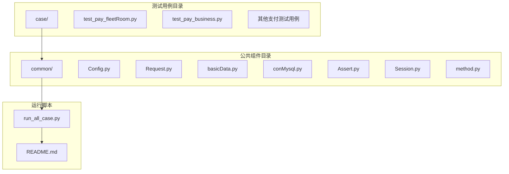
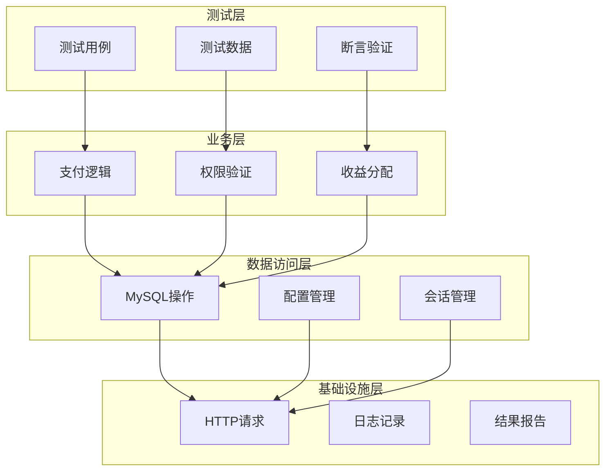
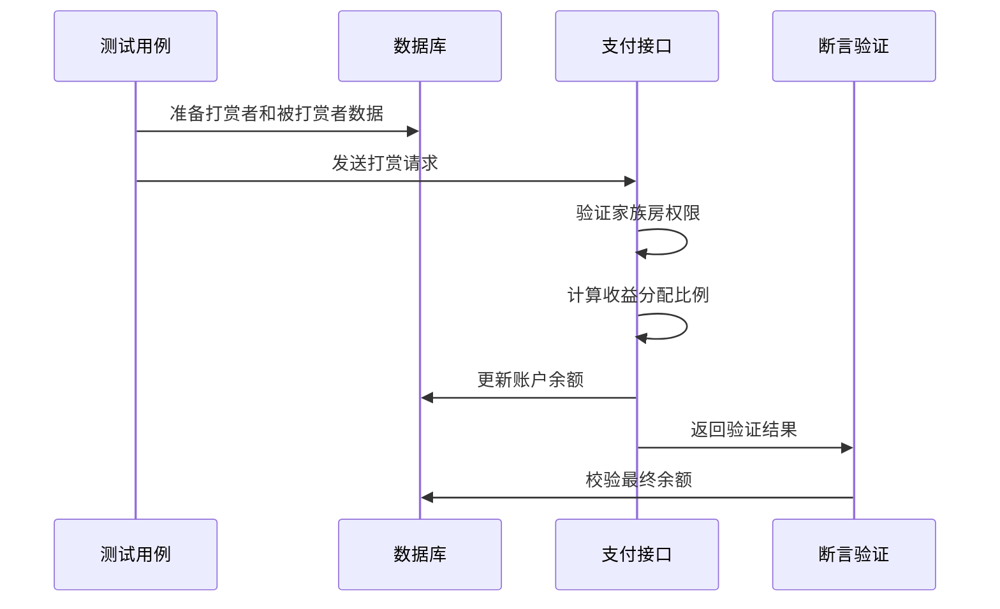
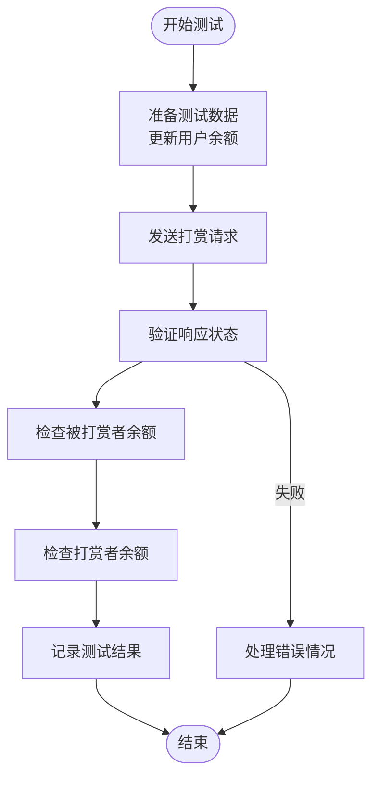
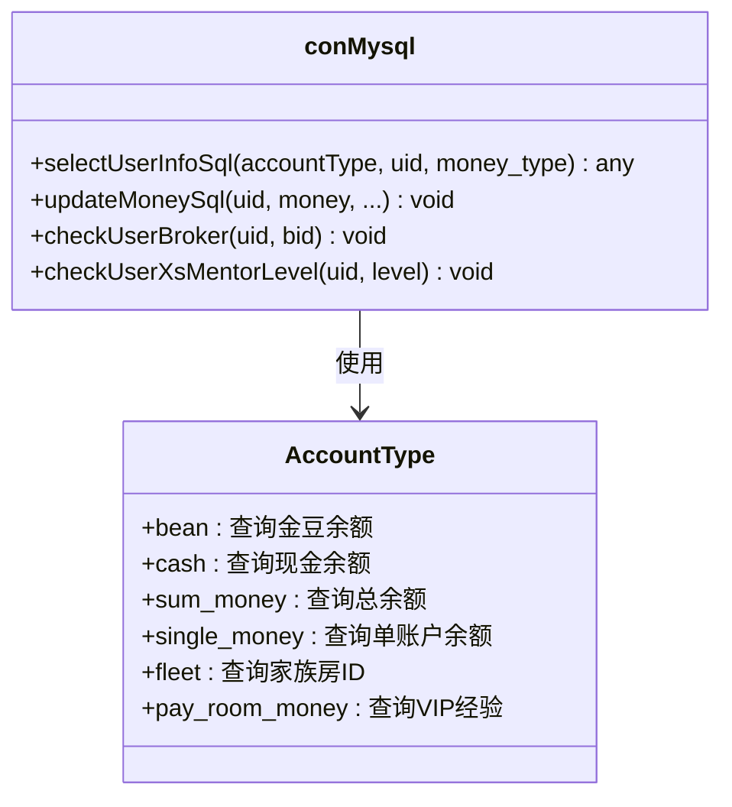
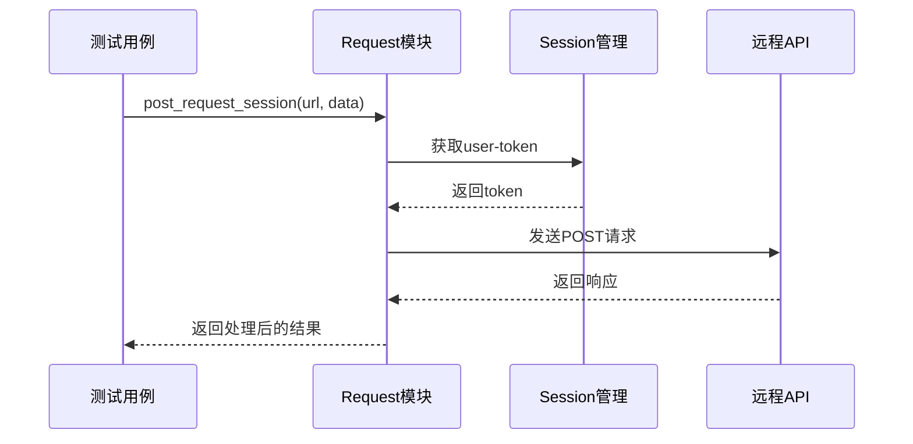
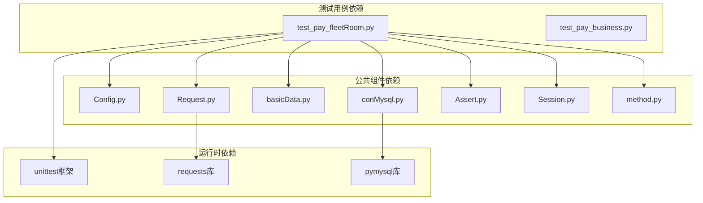

# 舰队房支付测试

<cite>
**本文档引用的文件**
- [test_pay_fleetRoom.py](file://case/test_pay_fleetRoom.py)
- [Config.py](file://common/Config.py)
- [Request.py](file://common/Request.py)
- [basicData.py](file://common/basicData.py)
- [conMysql.py](file://common/conMysql.py)
- [Assert.py](file://common/Assert.py)
- [Session.py](file://common/Session.py)
- [method.py](file://common/method.py)
- [run_all_case.py](file://run_all_case.py)
- [README.md](file://README.md)
</cite>

## 目录
1. [简介](#简介)
2. [项目结构](#项目结构)
3. [核心组件](#核心组件)
4. [架构概览](#架构概览)
5. [详细组件分析](#详细组件分析)
6. [依赖分析](#依赖分析)
7. [性能考虑](#性能考虑)
8. [故障排除指南](#故障排除指南)
9. [结论](#结论)

## 简介

本文件为舰队房支付测试的详细功能文档，全面介绍舰队房的支付测试场景，包括舰队成员的礼物打赏规则、舰队权限验证机制、舰队功能使用限制、舰队贡献值计算等测试用例。文档详细说明了舰队房内的成员身份验证、舰队等级要求、舰队功能权限、舰队收益分配等核心功能，包含舰队房打赏流程、舰队权限判断、舰队功能启用条件、舰队贡献值统计等验证方法，并提供了舰队房支付场景下的权限控制策略、功能启用逻辑和舰队状态同步机制。

## 项目结构

该项目采用模块化设计，主要包含以下目录结构：

**图表来源**
- [test_pay_fleetRoom.py:1-158](file://case/test_pay_fleetRoom.py#L1-L158)
- [Config.py:1-133](file://common/Config.py#L1-L133)
- [run_all_case.py:1-159](file://run_all_case.py#L1-L159)

**章节来源**
- [README.md:1-38](file://README.md#L1-L38)

## 核心组件

### 支付测试框架

项目采用unittest框架构建支付测试体系，每个测试用例都遵循统一的测试模式：

- **测试类装饰器**：使用重试机制确保测试稳定性
- **测试数据准备**：通过数据库操作准备测试环境
- **接口调用**：封装HTTP请求处理
- **断言验证**：统一的断言方法确保测试结果准确性

### 配置管理

配置系统采用集中式管理，包含：
- **环境配置**：开发、测试、生产环境的URL配置
- **用户配置**：各类角色的用户ID配置
- **房间配置**：不同类型房间的ID映射
- **礼物配置**：各种礼物的ID和价值映射

### 数据封装

数据封装层提供统一的数据格式化能力：
- **参数编码**：将测试参数转换为API所需的格式
- **场景适配**：支持多种支付场景的数据构造
- **默认值管理**：提供合理的默认参数配置

**章节来源**
- [test_pay_fleetRoom.py:12-158](file://case/test_pay_fleetRoom.py#L12-L158)
- [Config.py:59-94](file://common/Config.py#L59-L94)
- [basicData.py:8-325](file://common/basicData.py#L8-L325)

## 架构概览

项目采用分层架构设计，各层职责明确：

**图表来源**
- [test_pay_fleetRoom.py:1-158](file://case/test_pay_fleetRoom.py#L1-L158)
- [conMysql.py:8-530](file://common/conMysql.py#L8-L530)
- [Request.py:17-59](file://common/Request.py#L17-L59)

## 详细组件分析

### 舰队房支付测试用例

#### 同家族房直播公会GS打赏场景

该用例验证同家族房内直播公会成员的礼物打赏规则：

**图表来源**
- [test_pay_fleetRoom.py:19-40](file://case/test_pay_fleetRoom.py#L19-L40)
- [conMysql.py:350-360](file://common/conMysql.py#L350-L360)

#### 非本家族房打赏场景

该用例覆盖不同家族房之间的打赏行为：

**图表来源**
- [test_pay_fleetRoom.py:138-157](file://case/test_pay_fleetRoom.py#L138-L157)

#### 多场景测试覆盖

项目包含多个维度的测试场景：

| 场景类型 | 测试目标 | 分成比例 | 特殊规则 |
|---------|---------|---------|---------|
| 同家族房直播公会GS | 80%个人魅力值 | 80%:20% | 家族房内优先级 |
| 非家族房直播公会GS | 70%个人魅力值 | 70%:30% | 跨家族房降级 |
| 普通公会GS | 80%个人魅力值 | 80%:20% | 标准分成规则 |
| 普通用户打赏 | 80%个人魅力值 | 80%:20% | 一代宗师特殊处理 |
| 非家族房普通用户 | 62%个人魅力值 | 62%:38% | 跨家族房最低比例 |

**章节来源**
- [test_pay_fleetRoom.py:19-157](file://case/test_pay_fleetRoom.py#L19-L157)

### 数据库操作组件

#### 用户信息查询

数据库操作组件提供完整的用户信息查询能力：

**图表来源**
- [conMysql.py:28-204](file://common/conMysql.py#L28-L204)

#### 账户余额管理

系统支持多种货币类型的余额管理：
- **个人魅力值**：money_cash_b
- **公会魅力值**：money_cash
- **总余额**：money+money_b+money_cash_b+money_cash
- **VIP经验**：pay_room_money

**章节来源**
- [conMysql.py:28-104](file://common/conMysql.py#L28-L104)

### 请求处理组件

#### HTTP请求封装

请求处理组件提供统一的HTTP请求接口：

**图表来源**
- [Request.py:17-59](file://common/Request.py#L17-L59)
- [Session.py:168-183](file://common/Session.py#L168-L183)

#### 请求头配置

系统自动配置必要的请求头信息：
- **User-Agent**：模拟移动设备请求
- **Content-Type**：application/x-www-form-urlencoded
- **user-token**：动态获取的认证令牌
- **Connection**：关闭连接以节省资源

**章节来源**
- [Request.py:27-32](file://common/Request.py#L27-L32)

### 断言验证组件

#### 统一断言方法

断言组件提供多种断言验证方法：

| 断言类型 | 功能描述 | 使用场景 |
|---------|---------|---------|
| assert_code | 验证HTTP状态码 | 接口响应验证 |
| assert_equal | 验证数值相等 | 余额对比验证 |
| assert_len | 验证最小长度 | 最低收益验证 |
| assert_body | 验证响应体内容 | 成功标志验证 |
| assert_between | 验证范围 | 收益区间验证 |

#### 错误处理机制

断言失败时提供详细的错误信息：
- **实际结果**：当前的实际值
- **期望结果**：预期的目标值  
- **失败原因**：具体的失败描述
- **用例ID**：定位到具体测试用例

**章节来源**
- [Assert.py:11-96](file://common/Assert.py#L11-L96)

## 依赖分析

项目采用松耦合的设计，各组件之间的依赖关系清晰：

**图表来源**
- [test_pay_fleetRoom.py:1-10](file://case/test_pay_fleetRoom.py#L1-L10)
- [run_all_case.py:126-147](file://run_all_case.py#L126-L147)

### 关键依赖关系

1. **测试用例依赖**：所有测试用例都依赖公共组件
2. **组件内部依赖**：公共组件之间存在合理的依赖层次
3. **外部库依赖**：依赖requests进行HTTP通信，依赖pymysql进行数据库操作

**章节来源**
- [run_all_case.py:1-159](file://run_all_case.py#L1-L159)

## 性能考虑

### 测试执行优化

项目在性能方面采取了多项优化措施：

- **重试机制**：测试失败自动重试最多3次
- **并发控制**：避免同时大量请求导致服务器压力
- **网络优化**：禁用SSL验证以提高测试速度
- **数据库连接池**：复用数据库连接减少建立连接的开销

### 数据库操作优化

- **批量操作**：支持批量更新用户余额
- **事务管理**：确保数据库操作的原子性
- **连接复用**：避免频繁建立数据库连接
- **索引优化**：针对常用查询字段建立索引

## 故障排除指南

### 常见问题及解决方案

#### 测试环境问题

| 问题类型 | 症状表现 | 解决方案 |
|---------|---------|---------|
| 网络连接失败 | HTTP请求超时或连接错误 | 检查网络连接，确认服务器可达性 |
| 数据库连接失败 | SQL查询异常 | 验证数据库配置，检查连接参数 |
| 权限验证失败 | 接口返回权限错误 | 确认user-token有效性，重新获取令牌 |
| 数据不一致 | 余额与预期不符 | 检查测试数据准备过程，验证数据库状态 |

#### 测试用例执行问题

- **断言失败**：查看详细的失败原因和实际值
- **接口响应异常**：检查请求参数格式和完整性
- **数据库操作失败**：验证SQL语句正确性和权限设置

### 调试技巧

1. **日志分析**：查看测试执行日志定位问题
2. **数据库检查**：直接查询数据库验证状态
3. **接口测试**：使用工具单独测试API接口
4. **环境验证**：确认测试环境配置正确

**章节来源**
- [Assert.py:17-25](file://common/Assert.py#L17-L25)
- [method.py:115-122](file://common/method.py#L115-L122)

## 结论

本舰队房支付测试文档全面介绍了项目的架构设计、核心组件和测试场景。通过模块化的组件设计和完善的测试覆盖，系统能够有效验证舰队房支付场景下的各种业务逻辑。

### 主要特点

1. **完整的测试覆盖**：涵盖家族房、商业房、普通房间等多种场景
2. **灵活的配置管理**：支持多环境、多角色的配置切换
3. **可靠的断言机制**：提供多种断言方法确保测试结果准确性
4. **高效的执行效率**：采用重试机制和优化策略提升测试效率

### 应用价值

该测试框架为支付系统的稳定运行提供了重要保障，通过自动化测试能够及时发现和解决问题，确保用户体验的一致性和可靠性。同时，清晰的架构设计也为后续的功能扩展和维护提供了良好的基础。