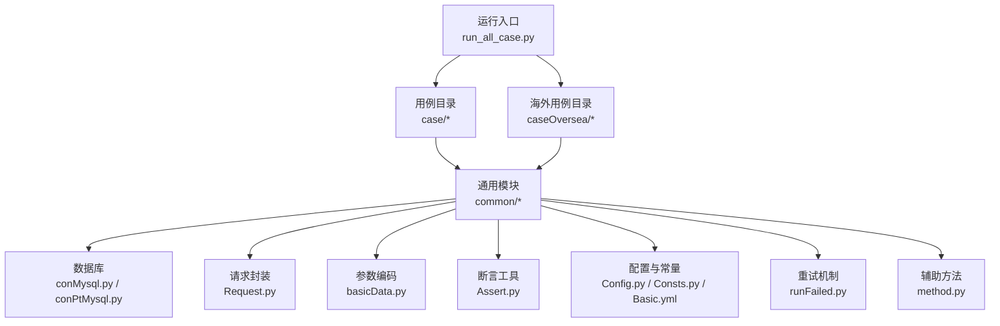
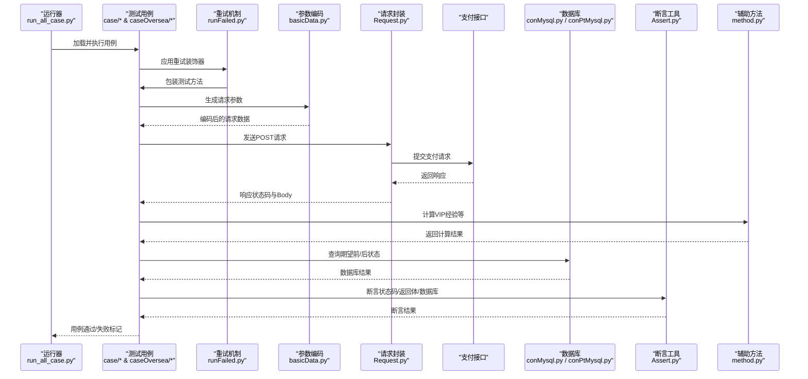
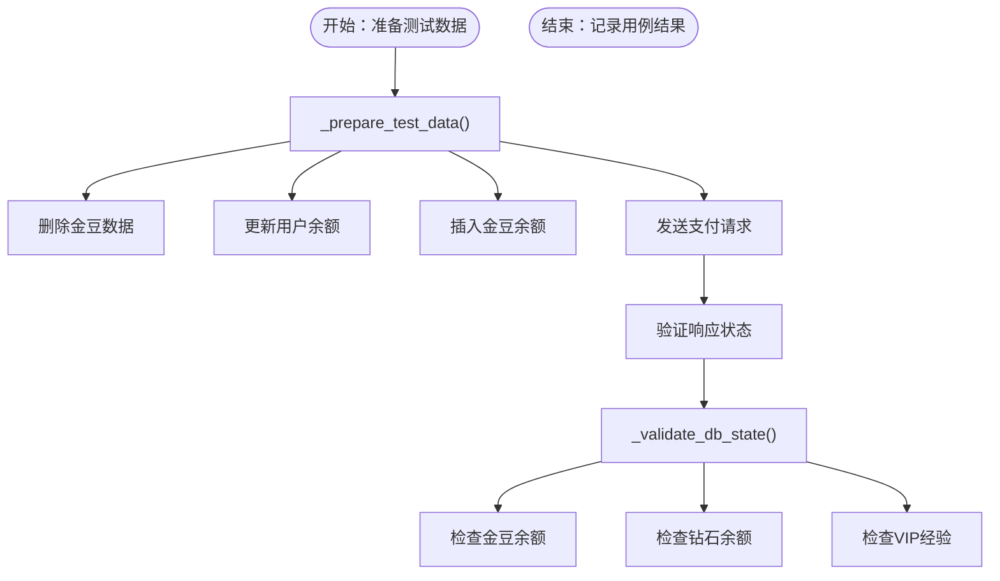
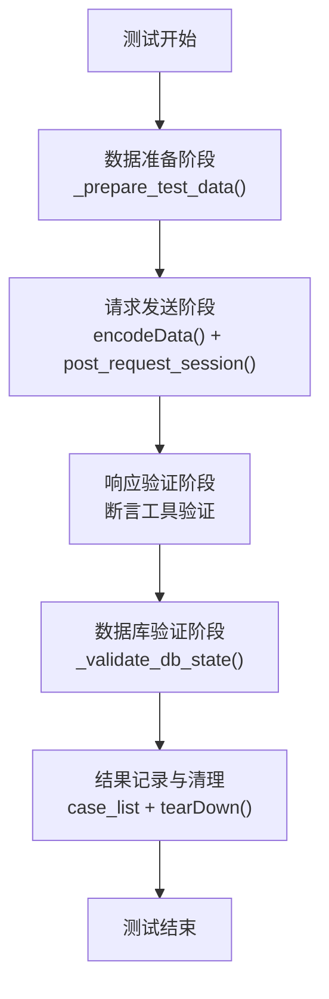
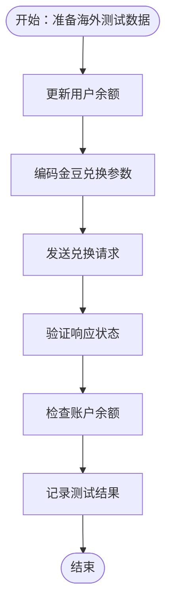

# 支付测试用例

<cite>
**本文引用的文件**
- [README.md](file://README.md)
- [run_all_case.py](file://run_all_case.py)
- [common/Config.py](file://common/Config.py)
- [common/Consts.py](file://common/Consts.py)
- [common/Basic.yml](file://common/Basic.yml)
- [common/Assert.py](file://common/Assert.py)
- [common/Request.py](file://common/Request.py)
- [common/basicData.py](file://common/basicData.py)
- [common/conMysql.py](file://common/conMysql.py)
- [common/conPtMysql.py](file://common/conPtMysql.py)
- [common/runFailed.py](file://common/runFailed.py)
- [common/method.py](file://common/method.py)
- [requirements.txt](file://requirements.txt)
- [case/test_pay_bean.py](file://case/test_pay_bean.py)
- [case/test_pay_coin.py](file://case/test_pay_coin.py)
- [case/test_pay_shopBuy.py](file://case/test_pay_shopBuy.py)
- [case/test_pay_openBox.py](file://case/test_pay_openBox.py)
- [case/test_pay_chatRate.py](file://case/test_pay_chatRate.py)
- [case/test_pay_fleetRoom.py](file://case/test_pay_fleetRoom.py)
- [caseOversea/test_app_bean.py](file://caseOversea/test_app_bean.py)
- [caseOversea/test_app_blind.py](file://caseOversea/test_app_blind.py)
- [caseOversea/test_app_openBox.py](file://caseOversea/test_app_openBox.py)
- [caseOversea/test_app_shopBuy.py](file://caseOversea/test_app_shopBuy.py)
- [caseOversea/test_app_chatGift.py](file://caseOversea/test_app_chatGift.py)
- [caseOversea/test_app_vipRenqi.py](file://caseOversea/test_app_vipRenqi.py)
- [caseOversea/test_app_enArea.py](file://caseOversea/test_app_enArea.py)
- [caseOversea/test_app_thArea.py](file://caseOversea/test_app_thArea.py)
</cite>

## 更新摘要
**变更内容**
- 新增海外支付测试用例章节，涵盖PT海外版平台的测试文件结构和命名约定变更
- 更新测试用例组织方式，从test_pt_*到test_app_*的迁移
- 新增海外用例目录caseOversea的详细说明和测试场景覆盖
- 补充海外支付测试的区域差异化验证和大区配置管理
- 更新测试框架以支持多应用环境（国内/海外/不夜星球）

## 目录
1. [简介](#简介)
2. [项目结构](#项目结构)
3. [核心组件](#核心组件)
4. [架构总览](#架构总览)
5. [详细组件分析](#详细组件分析)
6. [标准化测试执行流程](#标准化测试执行流程)
7. [海外支付测试用例](#海外支付测试用例)
8. [依赖分析](#依赖分析)
9. [性能考虑](#性能考虑)
10. [故障排查指南](#故障排查指南)
11. [结论](#结论)
12. [附录](#附录)

## 简介
本项目为QA支付测试自动化工程，覆盖金豆支付、钻石支付、金币支付、优惠券支付、爵位购买、盲盒开箱、商城购买、私聊打赏、房间打赏、家族房打赏等核心支付场景。通过统一的请求封装、参数编码、断言与数据库校验，形成可复用、可扩展的测试用例体系，确保支付链路在不同场景下的正确性与稳定性。

**最新重构**：测试框架经过重大重构，引入了标准化的测试执行流程和辅助方法，显著提升了测试的可靠性、可维护性和可扩展性。重构的核心包括：标准化测试生命周期管理、数据准备和验证框架、重试机制，以及测试用例结构的标准化改进。

**新增功能**：项目现已支持海外支付测试，涵盖PT海外版平台的多区域差异化验证，包括英语区、泰语区等区域的消费分成体系验证。

## 项目结构
- 核心测试用例位于 case 及 caseOversea 目录，按业务场景拆分文件，便于维护与扩展。
- 通用模块位于 common 目录，包括请求封装、参数编码、断言、数据库操作、配置、日志等。
- 运行入口 run_all_case.py 负责根据环境选择用例目录并批量执行，支持多应用环境切换。

**图表来源**
- [run_all_case.py:18-45](file://run_all_case.py#L18-L45)
- [common/Config.py:6-50](file://common/Config.py#L6-L50)
- [common/Request.py:17-59](file://common/Request.py#L17-L59)
- [common/basicData.py:8-325](file://common/basicData.py#L8-L325)
- [common/conMysql.py:8-204](file://common/conMysql.py#L8-L204)
- [common/conPtMysql.py:1-367](file://common/conPtMysql.py#L1-L367)
- [common/Assert.py:11-96](file://common/Assert.py#L11-L96)
- [common/runFailed.py:10-87](file://common/runFailed.py#L10-L87)
- [common/method.py:1-171](file://common/method.py#L1-L171)

**章节来源**
- [README.md:1-38](file://README.md#L1-L38)
- [run_all_case.py:18-45](file://run_all_case.py#L18-L45)

## 核心组件
- **请求封装与会话管理**：统一POST请求、头部注入、超时与异常处理，保证跨环境一致性。
- **参数编码器**：根据支付场景动态拼装请求参数，覆盖房间打赏、私聊打赏、商城购买、盲盒开箱、优惠券、守护等。
- **断言工具**：提供状态码、返回体字段、长度、区间、相等断言，统一失败原因收集。
- **数据库操作**：提供查询、更新、插入、删除用户资产与商品、箱子、守护关系等能力，支持国内和海外数据库操作。
- **配置与常量**：集中管理环境URL、用户UID、房间ID、礼物ID、分成比例等全局数据。
- **运行器**：自动发现用例、批量执行、统计结果、推送通知，支持多应用环境切换。
- **重试机制**：提供用例级别的失败重试功能，支持自定义重试次数和前缀匹配。
- **辅助方法**：包含VIP经验计算、失败原因收集、路径检查等实用工具函数。

**章节来源**
- [common/Request.py:17-59](file://common/Request.py#L17-L59)
- [common/basicData.py:8-325](file://common/basicData.py#L8-L325)
- [common/Assert.py:11-96](file://common/Assert.py#L11-L96)
- [common/conMysql.py:8-204](file://common/conMysql.py#L8-L204)
- [common/conPtMysql.py:1-367](file://common/conPtMysql.py#L1-L367)
- [common/Config.py:6-130](file://common/Config.py#L6-L130)
- [common/Consts.py:4-17](file://common/Consts.py#L4-L17)
- [common/runFailed.py:10-87](file://common/runFailed.py#L10-L87)
- [common/method.py:115-171](file://common/method.py#L115-L171)

## 架构总览
测试执行流程从运行入口开始，按应用环境选择用例目录，加载用例并逐条执行；每条用例通过参数编码器构造请求，经请求封装发送至支付接口，随后通过断言工具与数据库校验进行结果判定，并记录用例状态。

**图表来源**
- [run_all_case.py:48-77](file://run_all_case.py#L48-L77)
- [common/basicData.py:8-325](file://common/basicData.py#L8-L325)
- [common/Request.py:17-59](file://common/Request.py#L17-L59)
- [common/conMysql.py:28-204](file://common/conMysql.py#L28-L204)
- [common/conPtMysql.py:101-367](file://common/conPtMysql.py#L101-L367)
- [common/Assert.py:11-96](file://common/Assert.py#L11-L96)
- [common/runFailed.py:57-84](file://common/runFailed.py#L57-L84)
- [common/method.py:163-171](file://common/method.py#L163-L171)

## 详细组件分析

### 金豆支付测试（test_pay_bean.py）
**重构更新**：金豆支付测试类经过重大重构，引入了更清晰的测试结构、辅助方法和更好的代码组织。

#### 新的测试结构特点：
- **类级装饰器**：使用 `@Retry(max_n=3)` 装饰整个测试类，提供用例级别的失败重试机制
- **标准化生命周期**：包含 `setUpClass`、`setUp` 和 `tearDown` 方法，确保测试环境的一致性
- **数据准备方法**： `_prepare_test_data()` 方法统一处理测试数据准备逻辑
- **数据库验证方法**： `_validate_db_state()` 方法统一处理数据库状态验证

#### 核心测试方法：
- `test_01_NoBeanPayBeanGift`：验证金豆不足时的支付场景
- `test_02_beanPayChangeGoldGift`：验证金豆充足的支付场景
- `test_03_MoneyConvertGoldPayGift`：验证金豆不足时钻石转换场景
- `test_04_ImMoneyPayChangeBeanDeduct`：验证私聊场景下金豆抵扣手续费策略
- `test_05_RoomMoneyConvertGoldPayGift`：验证房间内金豆抵扣手续费策略

#### 测试数据准备流程：

**图表来源**
- [case/test_pay_bean.py:28-46](file://case/test_pay_bean.py#L28-L46)
- [case/test_pay_bean.py:60-78](file://case/test_pay_bean.py#L60-L78)
- [case/test_pay_bean.py:114-118](file://case/test_pay_bean.py#L114-L118)
- [case/test_pay_bean.py:158-163](file://case/test_pay_bean.py#L158-L163)

#### 测试目标：覆盖金豆余额不足、金豆充足、金豆不足时钻石抵扣、私聊/房间场景下金豆抵扣手续费策略变更等。
- **前置条件**：准备打赏者与被打赏者用户数据，必要时清理或初始化金豆与钻石余额。
- **执行步骤**：
  - 使用参数编码器构造礼物类型为金豆的请求；
  - 发送支付请求；
  - 断言响应状态与返回体字段；
  - 通过数据库查询验证金豆/钻石/分成账户余额变化。
- **预期结果与验证方法**：
  - 余额不足场景：返回失败，被打赏者余额不变；
  - 金豆充足场景：打赏者金豆清零，被打赏者按比例获得分成；
  - 钻石抵扣场景：金豆不足部分由钻石抵扣，验证抵扣后余额与VIP经验增长。
- **边界与异常**：
  - 跳过历史策略用例（金豆抵扣手续费已调整）；
  - 保留私聊/房间场景下手续费抵扣逻辑验证。

**章节来源**
- [case/test_pay_bean.py:12-277](file://case/test_pay_bean.py#L12-L277)

### 私聊打赏测试（test_pay_chatRate.py）
**重构更新**：私聊打赏测试类同样采用了标准化的测试结构，引入了统一的数据准备和验证方法。

#### 标准化测试结构：
- **类级装饰器**：使用 `@Retry(max_n=3)` 装饰整个测试类
- **数据准备方法**： `_prepare_test_data()` 支持多种操作类型
- **数据库验证方法**： `_validate_db_state()` 支持自定义断言函数
- **灵活的断言机制**：支持 `assert_len` 和自定义断言函数

#### 核心测试方法：
- `test_01_chatPayNoMoney`：验证余额不足时的私聊打赏
- `test_02_chatPayGiftNormalBroker`：验证GS打赏分成比例
- `test_03_chatPayBoxNormalBroker`：验证GS打赏箱子分成比例
- `test_04_chatPayGiftNormalUser`：验证普通用户打赏分成比例
- `test_05_chatPayBoxNormalUser`：验证一代宗师打赏分成比例

#### 测试数据准备方法：
- 支持 `update_money`：更新用户余额
- 支持 `clear_user_data`：清理用户数据
- 支持 `delete_account`：删除指定账户数据

#### 数据库验证方法：
- 支持基础断言：`assert_equal`
- 支持长度断言：`assert_len`
- 支持自定义断言：通过 `assert_func` 参数支持特殊验证需求

**章节来源**
- [case/test_pay_chatRate.py:13-243](file://case/test_pay_chatRate.py#L13-L243)

### 金币支付测试（test_pay_coin.py）
- **测试目标**：验证余额兑换金币、房间内金币打赏（如人气券）的流程与分成。
- **前置条件**：确保打赏者拥有足够余额，被打赏者账户清空。
- **执行步骤**：
  - 兑换金币；
  - 房间内使用金币打赏；
  - 校验金币余额与被打赏者分成账户。
- **预期结果与验证方法**：
  - 兑换后余额减少，金币余额增加；
  - 打赏后金币余额按人数与比例分配。

**章节来源**
- [case/test_pay_coin.py:13-63](file://case/test_pay_coin.py#L13-L63)

### 商城购买测试（test_pay_shopBuy.py）
- **测试目标**：验证商城购买道具、购买后房间内赠送、不足时的处理。
- **前置条件**：准备购买者与被打赏者数据，清空背包。
- **执行步骤**：
  - 商城购买单个/多个道具；
  - 房间内赠送背包道具；
  - 校验背包数量与被打赏者分成。
- **预期结果与验证方法**：
  - 购买后余额与背包数量符合预期；
  - 赠送后背包减少，被打赏者按比例获得分成。

**章节来源**
- [case/test_pay_shopBuy.py:13-124](file://case/test_pay_shopBuy.py#L13-L124)

### 盲盒开箱测试（test_pay_openBox.py）
- **测试目标**：验证背包开箱与房间内送箱的流程。
- **前置条件**：准备用户余额与箱子数据。
- **执行步骤**：
  - 背包开箱/多开箱；
  - 房间内送箱；
  - 校验余额与开出物品数量。
- **预期结果与验证方法**：
  - 开箱后余额与背包物品数量符合预期；
  - 送箱后双方余额按比例分配。

**章节来源**
- [case/test_pay_openBox.py:12-124](file://case/test_pay_openBox.py#L12-L124)

### 家族房打赏测试（test_pay_fleetRoom.py）
- **测试目标**：验证家族房与非家族房内不同角色的分成比例。
- **前置条件**：查询并使用家族房ID，准备打赏者与被打赏者数据。
- **执行步骤**：
  - 同家族房/非家族房内打赏GS/普通GS/一代用户/普通用户；
  - 校验分成比例与余额。
- **预期结果与验证方法**：
  - 同家族房内GS/普通GS/一代用户到账比例分别为80%；
  - 非家族房内相应比例为70%/70%/80%/62%。

**章节来源**
- [case/test_pay_fleetRoom.py:12-158](file://case/test_pay_fleetRoom.py#L12-L158)

## 标准化测试执行流程

### 核心流程概述
最新的测试框架重构引入了标准化的测试执行流程，确保所有测试用例都遵循一致的结构和验证方式：

**图表来源**
- [case/test_pay_bean.py:27-44](file://case/test_pay_bean.py#L27-L44)
- [case/test_pay_chatRate.py:25-45](file://case/test_pay_chatRate.py#L25-L45)

### 数据准备方法 (_prepare_test_data)
- **统一数据准备**：通过字典配置的方式统一处理各种测试数据准备需求
- **支持的操作类型**：
  - `delete_beans`：删除金豆数据
  - `update_money`：更新用户余额
  - `insert_beans`：插入金豆余额
  - `clear_user_data`：清理用户数据
  - `delete_account`：删除指定账户数据

### 数据库验证方法 (_validate_db_state)
- **统一状态验证**：提供标准化的数据库状态验证接口
- **支持的断言类型**：
  - 基础断言：`assert_equal`
  - 长度断言：`assert_len`
  - 自定义断言：通过 `assert_func` 参数支持特殊验证需求

### 测试生命周期管理
- **setUpClass**：类级初始化，执行一次性配置检查
- **setUp**：测试前清理，确保测试环境纯净
- **tearDown**：测试后清理，恢复环境状态
- **重试机制**：用例级别的失败重试，提高测试稳定性

**章节来源**
- [case/test_pay_bean.py:15-25](file://case/test_pay_bean.py#L15-L25)
- [case/test_pay_chatRate.py:17-23](file://case/test_pay_chatRate.py#L17-L23)
- [common/runFailed.py:10-87](file://common/runFailed.py#L10-L87)

## 海外支付测试用例

### 海外用例目录结构
项目现已新增caseOversea目录，专门用于海外支付测试，涵盖PT海外版平台的多区域差异化验证：

- **test_app_bean.py**：金豆兑换验证
- **test_app_blind.py**：盲盒开箱与送箱验证
- **test_app_openBox.py**：背包开箱验证
- **test_app_shopBuy.py**：商城购买验证
- **test_app_chatGift.py**：私聊打赏验证
- **test_app_vipRenqi.py**：VIP人气值验证
- **test_app_enArea.py**：英语区域差异化验证
- **test_app_thArea.py**：泰国区域差异化验证
- **test_app_cnArea.py**：中文区域验证
- **test_app_jaArea.py**：日语区域验证
- **test_app_koNewArea.py**：韩语新区域验证
- **test_app_viArea.py**：越南语区域验证
- **test_app_msArea.py**：印尼语区域验证
- **test_app_idArea.py**：印度尼西亚区域验证
- **test_app_arArea.py**：阿拉伯语区域验证
- **test_app_ArnewArea.py**：阿拉伯语新区域验证
- **test_app_en_NewArea.py**：英语新区域验证

### 海外测试用例特点
- **命名约定变更**：从test_pt_*迁移到test_app_*，统一海外用例命名规范
- **区域差异化验证**：针对不同语言区域的消费分成体系进行专项测试
- **大区配置管理**：通过conPtMysql模块管理用户大区设置和清理
- **重试机制支持**：部分用例使用@Retry装饰器提高测试稳定性

### 海外金豆支付测试（test_app_bean.py）
验证余额兑换金豆的流程和账户余额变化：

**图表来源**
- [caseOversea/test_app_bean.py:27-57](file://caseOversea/test_app_bean.py#L27-L57)

#### 核心测试方法：
- `test_01_moneyExchangeCoin`：验证余额兑换金豆场景
- **前置条件**：准备海外用户数据，设置测试环境
- **执行步骤**：
  - 更新用户余额为300
  - 编码金豆兑换参数
  - 发送兑换请求
  - 验证响应状态和返回值
  - 检查账户余额变化
- **预期结果**：
  - 余额减少300，金豆余额增加600
  - 接口返回成功状态

**章节来源**
- [caseOversea/test_app_bean.py:18-60](file://caseOversea/test_app_bean.py#L18-L60)

### 海外盲盒开箱测试（test_app_blind.py）
验证房间内送盲盒和背包开箱的流程：

#### 核心测试方法：
- `test_01_giveBlindPayChange`：房间送盲盒场景
- `test_02_giveBlindMorePeople`：房间送多人多个盲盒场景

#### 测试特点：
- **大区设置**：使用`updateUserBigArea`设置用户大区为6（泰国区）
- **房间配置**：使用`updateUserRidInfoSql`配置房间属性和区域
- **Redis清理**：测试后清理Redis缓存数据
- **多人场景**：验证多用户同时接收盲盒的场景

**章节来源**
- [caseOversea/test_app_blind.py:14-88](file://caseOversea/test_app_blind.py#L14-L88)

### 海外背包开箱测试（test_app_openBox.py）
验证背包内开箱子得到物品的流程：

#### 核心测试方法：
- `test_01_openBoxPayChange`：背包开铜箱子场景
- `test_02_openMoreBoxPayChange`：背包箱子多开场景

#### 测试流程：
1. **构造数据**：清空用户背包，插入指定箱子，设置用户余额
2. **开箱操作**：调用openBox接口
3. **状态验证**：验证接口状态和返回值
4. **余额检查**：验证用户余额变化
5. **物品检查**：验证背包内物品数量

**章节来源**
- [caseOversea/test_app_openBox.py:18-121](file://caseOversea/test_app_openBox.py#L18-L121)

### 海外商城购买测试（test_app_shopBuy.py）
验证商城使用金豆和钻石购买道具的流程：

#### 核心测试方法：
- `test_01_shopCoinPayChange`：商城购买金豆道具场景
- `test_02_shopMoneyPayChange`：商城购买钻石道具场景

#### 测试特点：
- **金豆购买**：验证金豆余额减少，背包物品增加
- **钻石购买**：验证钻石余额减少，背包物品增加
- **道具ID配置**：使用预设的道具ID进行购买测试

**章节来源**
- [caseOversea/test_app_shopBuy.py:17-95](file://caseOversea/test_app_shopBuy.py#L17-L95)

### 海外私聊打赏测试（test_app_chatGift.py）
验证私聊场景下的打赏功能，包括余额不足、正常打赏和箱子打赏：

#### 核心测试方法：
- `test_01_IMPayNoMoney`：私聊打赏余额不足场景
- `test_02_IMPayChangeMoney`：私聊打赏礼物场景
- `test_03_IMPayGiveBox`：私聊打赏箱子场景

#### 测试流程：
1. **余额不足场景**：清空用户余额，验证支付失败
2. **正常打赏场景**：设置充足余额，验证分成比例
3. **箱子打赏场景**：验证箱子打赏的分成逻辑

**章节来源**
- [caseOversea/test_app_chatGift.py:18-139](file://caseOversea/test_app_chatGift.py#L18-L139)

### 海外VIP人气值测试（test_app_vipRenqi.py）
验证房间打赏和私聊打赏赠送礼物时的人气值和VIP等级变化：

#### 核心测试方法：
- `test_01_payRoomgiftVip`：房间打赏礼物校验人气值&自身的vip等级
- `test_02_payChatgiftVip`：私聊打赏礼物校验人气值&自身的 vip等级

#### 测试特点：
- **VIP经验**：验证pay_room_money字段的更新
- **人气值**：验证xs_user_popularity表的人气值增加
- **时间延迟**：等待任务处理完成，确保人气值更新

**章节来源**
- [caseOversea/test_app_vipRenqi.py:21-113](file://caseOversea/test_app_vipRenqi.py#L21-L113)

### 海外区域差异化测试

#### 英语区域测试（test_app_enArea.py）
验证英语区消费差异化分成体系：

- **私聊打赏**：验证1:0.5的分成比例
- **家族房打赏**：验证师徒关系基础上的分成逻辑

#### 泰语区域测试（test_app_thArea.py）
验证泰语区消费差异化分成体系：

- **联盟房打赏**：验证非主播80%的分成比例
- **箱子打赏**：验证箱子打赏的分成逻辑
- **Redis缓存**：测试后清理相关缓存数据

**章节来源**
- [caseOversea/test_app_enArea.py:18-137](file://caseOversea/test_app_enArea.py#L18-L137)
- [caseOversea/test_app_thArea.py:20-117](file://caseOversea/test_app_thArea.py#L20-L117)

## 依赖分析
- **用例依赖关系**：各用例独立，共享通用模块；部分用例依赖数据库初始化与清理。
- **外部依赖**：requests、PyMySQL、pytest、GitPython等。
- **环境依赖**：不同应用环境（国内/海外/不夜星球）对应不同的用例目录与配置。
- **数据库依赖**：国内使用conMysql，海外使用conPtMysql，支持双数据库操作。

```mermaid
graph TB
subgraph "用例层"
T1["test_pay_bean.py"]
T2["test_pay_coin.py"]
T3["test_pay_shopBuy.py"]
T4["test_pay_openBox.py"]
T5["test_pay_chatRate.py"]
T6["test_pay_fleetRoom.py"]
T7["test_app_bean.py"]
T8["test_app_blind.py"]
T9["test_app_openBox.py"]
T10["test_app_shopBuy.py"]
T11["test_app_chatGift.py"]
T12["test_app_vipRenqi.py"]
end
subgraph "通用模块"
R["Request.py"]
B["basicData.py"]
A["Assert.py"]
M["conMysql.py"]
PM["conPtMysql.py"]
C["Config.py/Consts.py/Basic.yml"]
RF["runFailed.py"]
MT["method.py"]
end
T1 --> R
T2 --> R
T3 --> R
T4 --> R
T5 --> R
T6 --> R
T7 --> R
T8 --> R
T9 --> R
T10 --> R
T11 --> R
T12 --> R
T1 --> B
T2 --> B
T3 --> B
T4 --> B
T5 --> B
T6 --> B
T7 --> B
T8 --> B
T9 --> B
T10 --> B
T11 --> B
T12 --> B
T1 --> A
T2 --> A
T3 --> A
T4 --> A
T5 --> A
T6 --> A
T7 --> A
T8 --> A
T9 --> A
T10 --> A
T11 --> A
T12 --> A
T1 --> M
T2 --> M
T3 --> M
T4 --> M
T5 --> M
T6 --> M
T7 --> PM
T8 --> PM
T9 --> PM
T10 --> PM
T11 --> PM
T12 --> PM
T1 --> RF
T2 --> RF
T3 --> RF
T4 --> RF
T5 --> RF
T6 --> RF
T7 --> RF
T8 --> RF
T9 --> RF
T10 --> RF
T11 --> RF
T12 --> RF
T1 --> MT
T2 --> MT
T3 --> MT
T4 --> MT
T5 --> MT
T6 --> MT
T7 --> MT
T8 --> MT
T9 --> MT
T10 --> MT
T11 --> MT
T12 --> MT
R --> C
B --> C
A --> C
M --> C
PM --> C
RF --> C
MT --> C
```

**图表来源**
- [common/Request.py:17-59](file://common/Request.py#L17-L59)
- [common/basicData.py:8-325](file://common/basicData.py#L8-L325)
- [common/Assert.py:11-96](file://common/Assert.py#L11-L96)
- [common/conMysql.py:8-204](file://common/conMysql.py#L8-L204)
- [common/conPtMysql.py:1-367](file://common/conPtMysql.py#L1-L367)
- [common/Config.py:6-130](file://common/Config.py#L6-L130)
- [common/runFailed.py:10-87](file://common/runFailed.py#L10-L87)
- [common/method.py:1-171](file://common/method.py#L1-L171)

**章节来源**
- [requirements.txt:1-85](file://requirements.txt#L1-L85)

## 性能考虑
- **接口延迟**：断言工具在非特定节点环境下引入短暂延迟，避免RPC接口抖动导致误判。
- **数据库并发**：数据库操作采用连接池与事务提交，注意批量用例执行时的并发控制。
- **请求超时与重试**：请求封装统一关闭SSL校验与异常捕获，建议在生产环境谨慎开启SSL校验。
- **重试机制优化**：重试装饰器支持用例级别的失败重试，减少偶发网络波动的影响。
- **多应用环境**：海外用例可能涉及多个数据库连接，注意连接池管理和资源释放。

**章节来源**
- [common/Assert.py:17-18](file://common/Assert.py#L17-L18)
- [common/Request.py:25-45](file://common/Request.py#L25-L45)
- [common/runFailed.py:60-78](file://common/runFailed.py#L60-L78)

## 故障排查指南
- **响应状态码不符**：检查环境URL与token有效性，确认请求头与参数编码正确。
- **断言失败**：查看失败原因收集，定位具体字段差异；核对数据库期望值与实际值。
- **数据库异常**：确认数据库连接配置、表结构与字段名称；必要时清理脏数据。
- **用例执行异常**：检查用例目录与discover模式，确认用例命名规范与类/方法定义。
- **重试失败**：检查重试装饰器配置，确认重试次数和前缀匹配规则。
- **海外用例失败**：检查大区配置是否正确设置，确认Redis缓存清理是否完成。

**章节来源**
- [common/Assert.py:11-96](file://common/Assert.py#L11-L96)
- [common/conMysql.py:8-26](file://common/conMysql.py#L8-L26)
- [common/conPtMysql.py:101-367](file://common/conPtMysql.py#L101-L367)
- [run_all_case.py:48-77](file://run_all_case.py#L48-L77)
- [common/runFailed.py:57-84](file://common/runFailed.py#L57-L84)

## 结论
本测试体系通过统一的参数编码、请求封装与断言机制，覆盖主流支付场景，具备良好的可维护性与扩展性。**最新的重构显著提升了测试框架的质量和效率**，引入了标准化的测试执行流程、辅助方法和重试机制。标准化的测试结构不仅提高了代码的可读性和可维护性，还增强了测试用例的稳定性和可靠性。

**新增的海外支付测试功能**进一步扩展了测试覆盖范围，支持PT海外版平台的多区域差异化验证，包括区域分成体系、大区配置管理等功能。建议持续完善未启用场景（如爵位购买）、补充边界与异常用例，并在CI中集成失败重试与结果通知，提升自动化质量与效率。

## 附录

### 测试数据准备与环境配置
- **环境配置**：在配置模块中维护域名、登录URL、用户UID、房间ID、礼物ID等。
- **测试数据**：通过数据库操作初始化/清理用户资产、背包、箱子、优惠券等。
- **参数编码**：根据支付场景选择payType并填充money、rid、uid、giftId、num、package_cid等。
- **数据准备方法**：使用 `_prepare_test_data()` 统一处理测试数据准备，支持多种操作类型。
- **海外环境**：使用conPtMysql模块管理海外数据库连接和操作。

**章节来源**
- [common/Config.py:6-130](file://common/Config.py#L6-L130)
- [common/conMysql.py:274-414](file://common/conMysql.py#L274-L414)
- [common/conPtMysql.py:101-367](file://common/conPtMysql.py#L101-L367)
- [common/basicData.py:8-325](file://common/basicData.py#L8-L325)
- [case/test_pay_bean.py:28-46](file://case/test_pay_bean.py#L28-L46)

### 执行流程与报告
- **自动发现用例**：根据应用环境选择用例目录，批量加载并执行。
- **结果统计**：统计用例总数、失败数、错误数与耗时，推送通知。
- **失败重试**：装饰器支持用例级别重试，降低偶发波动影响。
- **重试机制**：支持自定义重试次数和方法名前缀匹配，提供更灵活的失败处理策略。
- **多应用支持**：支持国内、海外、不夜星球三个应用环境的测试执行。

**章节来源**
- [run_all_case.py:48-240](file://run_all_case.py#L48-L240)
- [common/runFailed.py:42-87](file://common/runFailed.py#L42-L87)

### 扩展新支付场景测试用例
- **新增用例文件**：在对应目录新增test_xxx.py，遵循命名与类/方法规范。
- **参数构造**：在参数编码器中添加新的payType分支或复用现有分支。
- **断言与校验**：结合断言工具与数据库查询，覆盖状态码、返回体与资产变化。
- **环境适配**：在配置模块中补充用户/房间/礼物ID，确保跨环境可用。
- **代码组织**：参考重构模式，使用标准化的测试结构和辅助方法。
- **海外扩展**：新增海外用例时，注意使用conPtMysql和相应的配置项。

**章节来源**
- [common/basicData.py:323-325](file://common/basicData.py#L323-L325)
- [README.md:23-31](file://README.md#L23-L31)
- [case/test_pay_bean.py:12-277](file://case/test_pay_bean.py#L12-L277)

### 测试框架重构要点
**主要改进包括**：
- 引入 `@Retry(max_n=3)` 装饰器提供失败重试功能
- 标准化测试生命周期管理（setUpClass、setUp、tearDown）
- 添加 `_prepare_test_data()` 和 `_validate_db_state()` 辅助方法
- 统一的测试数据准备和验证流程
- 更清晰的测试用例结构和命名规范
- 提升测试可靠性和可维护性的标准化架构
- **新增**：支持多应用环境的测试框架重构

**章节来源**
- [case/test_pay_bean.py:12-277](file://case/test_pay_bean.py#L12-L277)
- [common/runFailed.py:10-87](file://common/runFailed.py#L10-L87)
- [common/method.py:115-171](file://common/method.py#L115-L171)

### 标准化测试执行流程的最佳实践
- **数据准备标准化**：使用 `_prepare_test_data()` 统一处理测试数据准备
- **响应验证标准化**：使用断言工具统一验证响应状态和返回体
- **数据库验证标准化**：使用 `_validate_db_state()` 统一验证数据库状态
- **测试生命周期标准化**：确保每个测试用例都有完整的生命周期管理
- **错误处理标准化**：统一的异常处理和重试机制
- **海外测试标准化**：统一海外用例的命名约定和配置管理

**章节来源**
- [case/test_pay_bean.py:27-44](file://case/test_pay_bean.py#L27-L44)
- [case/test_pay_chatRate.py:25-45](file://case/test_pay_chatRate.py#L25-L45)
- [common/runFailed.py:10-87](file://common/runFailed.py#L10-L87)

### 重试机制详解
**重试装饰器功能**：
- **类级重试**：使用 `@Retry(max_n=3)` 装饰整个测试类
- **用例级重试**：支持自定义重试次数和方法名前缀匹配
- **自动清理**：重试前自动调用 `tearDown()` 和 `setUp()` 清理环境
- **异常捕获**：捕获并记录重试过程中的异常信息

**重试机制优势**：
- 提高测试稳定性，减少偶发网络波动影响
- 自动环境恢复，确保测试隔离性
- 灵活的重试策略，支持不同场景的重试需求

**章节来源**
- [common/runFailed.py:10-87](file://common/runFailed.py#L10-L87)

### 海外测试用例扩展指南
**新增海外用例步骤**：
1. 在caseOversea目录创建新的测试文件，使用test_app_前缀命名
2. 导入必要的模块：conPtMysql、basicData等
3. 使用@Retry装饰器包装测试类
4. 实现setUpClass和tearDownClass方法
5. 编写具体的测试方法，使用encodeAppData进行参数编码
6. 使用conPtMysql进行数据库操作
7. 添加适当的断言验证

**命名约定**：
- 海外用例文件：test_app_xxx.py
- 海外配置项：使用pt_前缀（如pt_payUid、pt_room等）
- 海外数据库：使用conPtMysql类

**章节来源**
- [caseOversea/test_app_bean.py:18-60](file://caseOversea/test_app_bean.py#L18-L60)
- [common/conPtMysql.py:101-367](file://common/conPtMysql.py#L101-L367)
- [common/Config.py:184-201](file://common/Config.py#L184-L201)