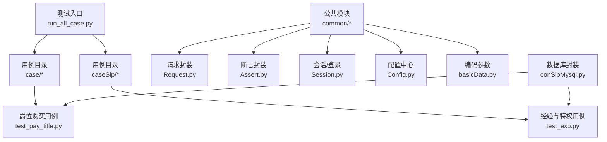
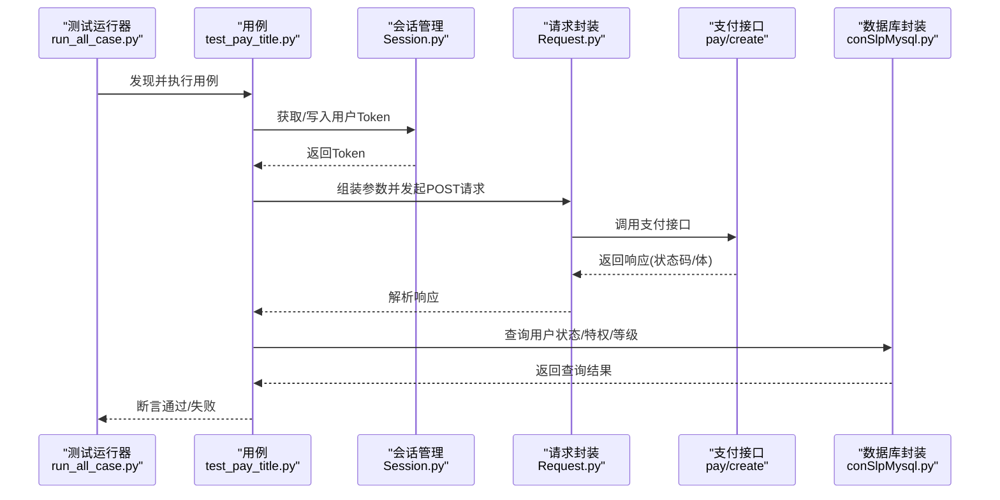
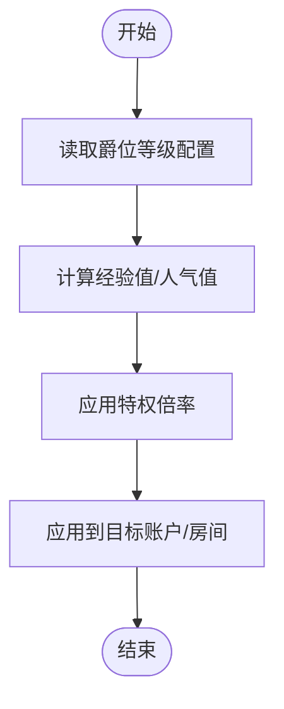
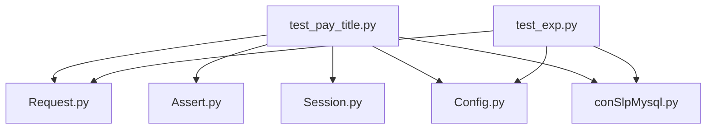

# 爵位购买测试

<cite>
**本文引用的文件**
- [test_pay_title.py](file://case/test_pay_title.py)
- [config.py](file://common/Config.py)
- [Request.py](file://common/Request.py)
- [Assert.py](file://common/Assert.py)
- [Session.py](file://common/Session.py)
- [run_all_case.py](file://run_all_case.py)
- [README.md](file://README.md)
- [test_exp.py](file://caseSlp/test_exp.py)
- [config.py](file://caseSlp/config.py)
- [basicData.py](file://common/basicData.py)
- [conSlpMysql.py](file://common/conSlpMysql.py)
</cite>

## 目录
1. [简介](#简介)
2. [项目结构](#项目结构)
3. [核心组件](#核心组件)
4. [架构总览](#架构总览)
5. [详细组件分析](#详细组件分析)
6. [依赖分析](#依赖分析)
7. [性能考虑](#性能考虑)
8. [故障排查指南](#故障排查指南)
9. [结论](#结论)
10. [附录](#附录)

## 简介
本文件面向“爵位购买测试”用例，系统化梳理与输出以下能力范围内的测试设计与实现要点：
- 爵位购买与升级测试
- 爵位特权验证测试
- 爵位过期处理测试
- 爵位等级体系与价格计算
- 爵位特权生效机制与到期时间管理
- 爵位购买流程、特权权限验证、状态查询与历史记录
- 特权验证方法、状态同步机制与异常处理策略

当前仓库中与“爵位购买”直接相关的用例文件处于“跳过”状态，但已具备完善的基础设施与数据模型，便于快速扩展为完整的测试用例集。

## 项目结构
该项目采用按业务域划分的用例组织方式，其中与“爵位购买”相关的测试位于 case 目录下；同时在 caseSlp 中提供了大量与支付、经验、特权相关的测试样例，可作为构建“爵位购买测试”的参考与基础。

图表来源
- [run_all_case.py:126-147](file://run_all_case.py#L126-L147)
- [test_pay_title.py:5-32](file://case/test_pay_title.py#L5-L32)
- [test_exp.py:19-327](file://caseSlp/test_exp.py#L19-L327)

章节来源
- [run_all_case.py:126-147](file://run_all_case.py#L126-L147)
- [README.md:31-38](file://README.md#L31-L38)

## 核心组件
- 请求封装：统一发起支付请求，自动注入用户 Token 与请求头，解析响应状态码与体。
- 断言封装：提供通用断言方法，覆盖状态码、长度、相等性、区间判断与文本包含等。
- 会话管理：支持多应用环境的登录态获取与持久化，保障测试稳定性。
- 配置中心：集中管理各环境域名、支付接口、用户与房间 ID、礼物与特权配置。
- 编码参数：根据支付场景动态构造请求参数，涵盖多种支付类型与参数组合。
- 数据库封装：提供查询用户账户、爵位等级、成长值、人气值等关键字段的能力。

章节来源
- [Request.py:17-59](file://common/Request.py#L17-L59)
- [Assert.py:11-96](file://common/Assert.py#L11-L96)
- [Session.py:168-200](file://common/Session.py#L168-L200)
- [config.py:6-133](file://common/Config.py#L6-L133)
- [basicData.py:233-248](file://common/basicData.py#L233-L248)
- [conSlpMysql.py:29-200](file://common/conSlpMysql.py#L29-L200)

## 架构总览
下图展示了“爵位购买测试”的端到端调用链路与关键交互点：

图表来源
- [run_all_case.py:126-147](file://run_all_case.py#L126-L147)
- [test_pay_title.py:8-32](file://case/test_pay_title.py#L8-L32)
- [Session.py:168-200](file://common/Session.py#L168-L200)
- [Request.py:17-59](file://common/Request.py#L17-L59)
- [conSlpMysql.py:29-200](file://common/conSlpMysql.py#L29-L200)

## 详细组件分析

### 爵位购买用例（跳过状态）
- 当前用例文件处于“跳过”状态，保留了两个典型场景的测试骨架：
  - 开通爵位并返现到余额
  - 续费爵位并返现到余额
- 场景描述与预期值已在注释中给出，便于后续补全实现与断言。

章节来源
- [test_pay_title.py:5-32](file://case/test_pay_title.py#L5-L32)

### 爵位等级系统与特权生效机制
- 爵位等级与特权倍率由配置中心集中定义，包含多个等级及其对应的倍率与基础值。
- 经验值与人气值的计算逻辑在经验用例中体现，可作为构建“购买后特权生效”的验证依据。

图表来源
- [config.py:168-215](file://caseSlp/config.py#L168-L215)
- [test_exp.py:22-327](file://caseSlp/test_exp.py#L22-L327)

章节来源
- [config.py:168-215](file://caseSlp/config.py#L168-L215)
- [test_exp.py:22-327](file://caseSlp/test_exp.py#L22-L327)

### 爵位购买流程与参数构造
- 支付场景参数通过统一编码函数生成，支持多种支付类型（如 package、chat-gift、shop-buy 等）。
- 对于爵位购买，可复用“title”类型的参数模板进行扩展与定制。

章节来源
- [basicData.py:233-248](file://common/basicData.py#L233-L248)

### 状态查询与历史记录
- 数据库封装提供查询用户账户、爵位等级、成长值、人气值等能力，可用于断言购买前后状态变化。
- 历史记录可通过查询相关表字段或变更量实现，建议在用例中补充断言。

章节来源
- [conSlpMysql.py:29-200](file://common/conSlpMysql.py#L29-L200)

### 特权验证方法与状态同步
- 断言封装提供多种断言方法，可覆盖数值相等、区间判断、文本包含等场景。
- 建议在用例中结合数据库查询与接口返回值进行交叉验证，确保特权生效与状态同步一致。

章节来源
- [Assert.py:11-96](file://common/Assert.py#L11-L96)

### 异常处理策略
- 请求封装对网络异常与 JSON 解析异常进行了捕获与返回空结构的兜底处理。
- 断言封装在失败时记录失败原因并抛出异常，便于测试运行器统计与通知。

章节来源
- [Request.py:35-59](file://common/Request.py#L35-L59)
- [Assert.py:17-25](file://common/Assert.py#L17-L25)

## 依赖分析
- 用例层依赖公共模块：请求封装、断言封装、会话管理、配置中心、数据库封装。
- 经验与特权用例可作为“购买后特权生效”的参考实现，便于迁移与复用。

图表来源
- [test_pay_title.py:8-32](file://case/test_pay_title.py#L8-L32)
- [test_exp.py:19-327](file://caseSlp/test_exp.py#L19-L327)
- [Request.py:17-59](file://common/Request.py#L17-L59)
- [Assert.py:11-96](file://common/Assert.py#L11-L96)
- [Session.py:168-200](file://common/Session.py#L168-L200)
- [config.py:6-133](file://common/Config.py#L6-L133)
- [conSlpMysql.py:29-200](file://common/conSlpMysql.py#L29-L200)

章节来源
- [test_pay_title.py:8-32](file://case/test_pay_title.py#L8-L32)
- [test_exp.py:19-327](file://caseSlp/test_exp.py#L19-L327)

## 性能考虑
- 接口延迟与 RPC 响应存在不确定性，断言层已内置等待机制以降低误判概率。
- 建议在批量执行时合理安排并发度与重试策略，避免对数据库与接口造成瞬时压力。

## 故障排查指南
- 请求异常：检查网络连通性、证书与超时设置，确认返回体是否为 JSON 结构。
- 断言失败：核对预期值来源与边界条件，关注跨环境差异与数据一致性。
- 会话失效：重新获取 Token 并写入持久化文件，确保后续请求可用。
- 数据库查询：确认连接参数、表结构与字段名称，必要时增加日志输出定位问题。

章节来源
- [Request.py:35-59](file://common/Request.py#L35-L59)
- [Assert.py:17-25](file://common/Assert.py#L17-L25)
- [Session.py:168-200](file://common/Session.py#L168-L200)
- [conSlpMysql.py:29-200](file://common/conSlpMysql.py#L29-L200)

## 结论
当前仓库已具备构建“爵位购买测试”的完整基础设施：请求封装、断言封装、会话管理、配置中心、参数编码与数据库封装。尽管“爵位购买用例”尚处跳过状态，但其测试骨架与相关经验/特权用例为后续扩展提供了清晰的实现路径。建议优先补齐参数构造、状态查询与断言逻辑，再逐步完善特权生效与历史记录的验证，最终形成覆盖“开通/续费/升级/过期/特权验证/状态同步/异常处理”的完整测试矩阵。

## 附录
- 测试运行入口与用例发现逻辑
- 爵位等级与特权倍率配置
- 支付场景参数模板与编码函数
- 数据库查询方法与字段映射

章节来源
- [run_all_case.py:126-147](file://run_all_case.py#L126-L147)
- [config.py:168-215](file://caseSlp/config.py#L168-L215)
- [basicData.py:233-248](file://common/basicData.py#L233-L248)
- [conSlpMysql.py:29-200](file://common/conSlpMysql.py#L29-L200)