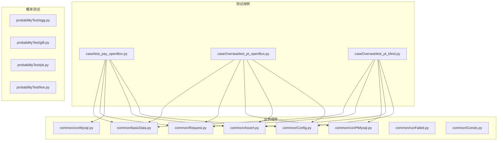
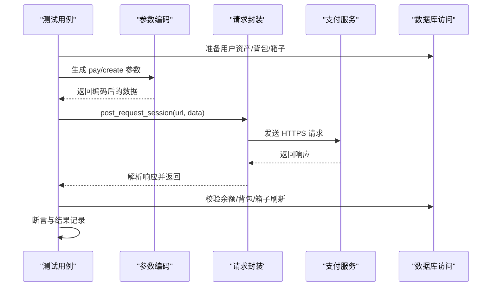
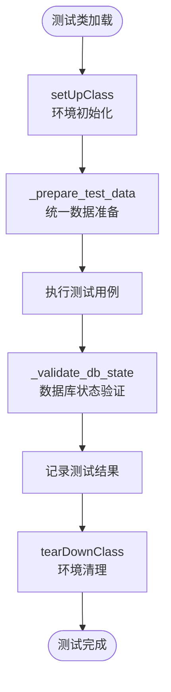
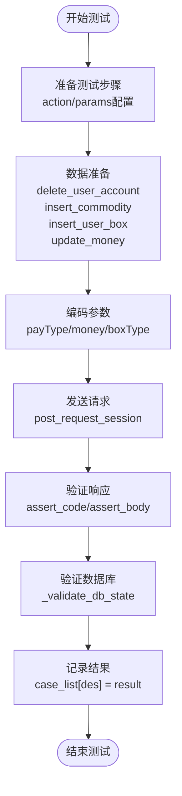
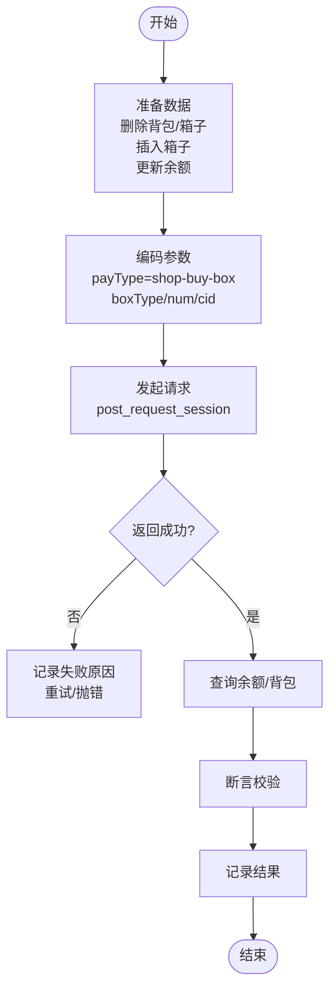
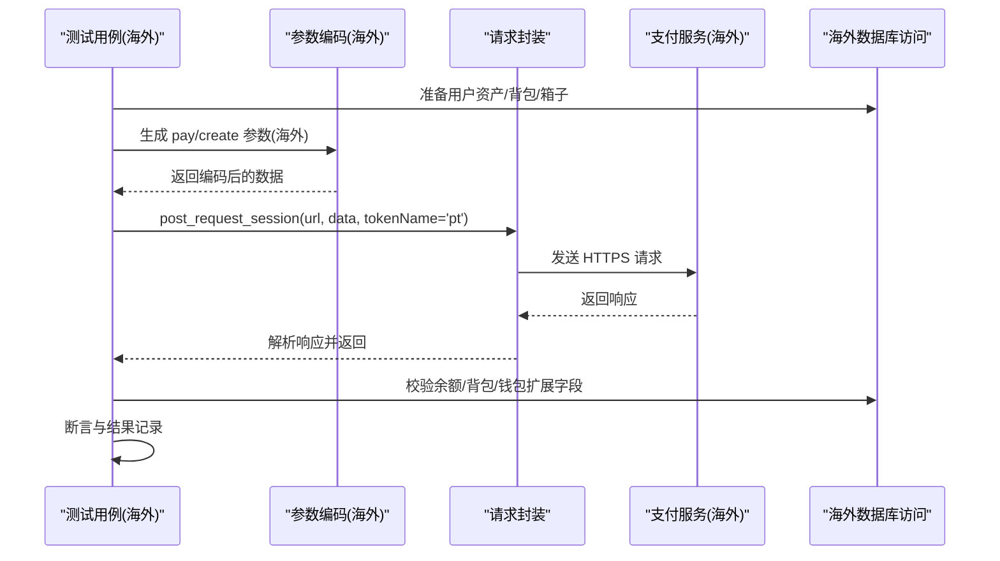
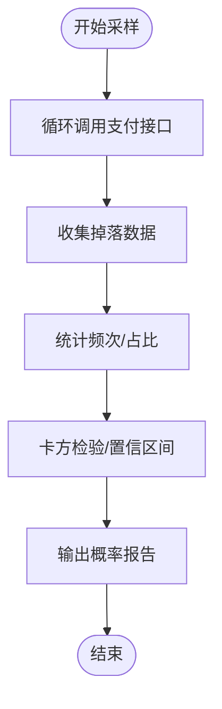
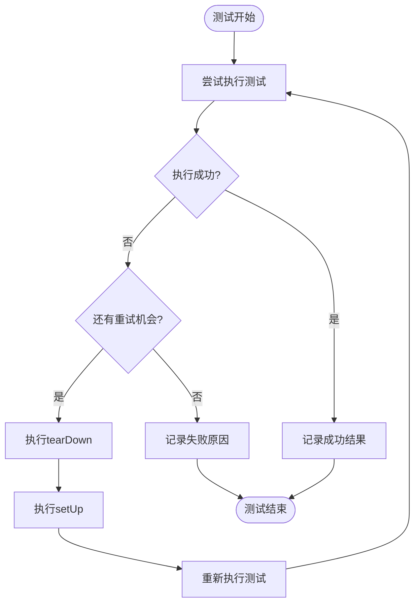
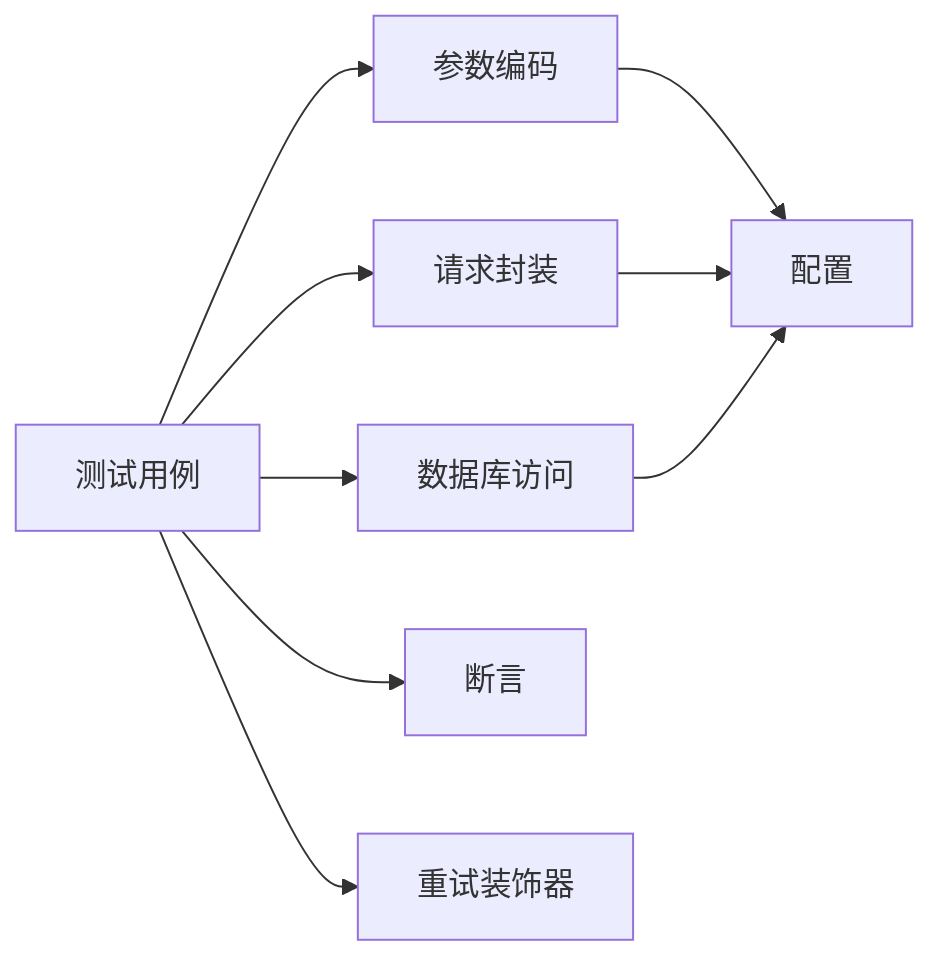

# 盲盒开箱测试

<cite>
**本文档引用的文件**
- [test_pay_openBox.py](file://case/test_pay_openBox.py)
- [test_pt_openBox.py](file://caseOversea/test_pt_openBox.py)
- [test_pt_blind.py](file://caseOversea/test_pt_blind.py)
- [basicData.py](file://common/basicData.py)
- [Request.py](file://common/Request.py)
- [conMysql.py](file://common/conMysql.py)
- [conPtMysql.py](file://common/conPtMysql.py)
- [Config.py](file://common/Config.py)
- [Assert.py](file://common/Assert.py)
- [runFailed.py](file://common/runFailed.py)
- [Consts.py](file://common/Consts.py)
- [egg.py](file://probabilityTest/egg.py)
- [gift.py](file://probabilityTest/gift.py)
- [pk.py](file://probabilityTest/pk.py)
- [live.py](file://probabilityTest/live.py)
</cite>

## 更新摘要
**变更内容**
- 更新测试生命周期管理部分，反映新的 `setUpClass` 和 `tearDownClass` 实现
- 新增测试用例结构标准化章节，介绍统一的数据准备和验证方法
- 完善重试机制说明，展示改进的装饰器功能
- 增强测试数据准备和数据库验证的标准流程

## 目录
1. [简介](#简介)
2. [项目结构](#项目结构)
3. [核心组件](#核心组件)
4. [架构总览](#架构总览)
5. [详细组件分析](#详细组件分析)
6. [依赖关系分析](#依赖关系分析)
7. [性能考虑](#性能考虑)
8. [故障排查指南](#故障排查指南)
9. [结论](#结论)
10. [附录](#附录)

## 简介
本文件面向"盲盒开箱测试"的功能文档，系统梳理了盲盒开箱在不同场景下的测试覆盖，包括普通盲盒开箱、VIP专属盲盒、付费复活盲盒、批量开箱以及海外大区的盲盒赠送场景。文档从测试目标、数据流、断言策略、概率与随机性验证、异常处理等方面进行深入说明，并提供可操作的测试方法与最佳实践。

**更新** 本次更新反映了测试用例的重构，包括测试生命周期管理的标准化和测试用例结构的统一化改进。

## 项目结构
该仓库采用按业务域分层的组织方式：
- 测试用例层：case 与 caseOversea 下分别存放国内与海外大区的支付与开箱相关用例
- 公共组件层：common 目录下封装了请求、数据库访问、断言、配置、重试等通用能力
- 概率测试工具：probabilityTest 提供独立的概率与随机性验证脚本

**图表来源**
- [test_pay_openBox.py:1-193](file://case/test_pay_openBox.py#L1-L193)
- [test_pt_openBox.py:1-133](file://caseOversea/test_pt_openBox.py#L1-L133)
- [test_pt_blind.py:1-88](file://caseOversea/test_pt_blind.py#L1-L88)
- [basicData.py:1-581](file://common/basicData.py#L1-L581)
- [Request.py:1-162](file://common/Request.py#L1-L162)
- [conMysql.py:1-530](file://common/conMysql.py#L1-L530)
- [conPtMysql.py:1-345](file://common/conPtMysql.py#L1-L345)
- [Assert.py:1-96](file://common/Assert.py#L1-L96)
- [Config.py:1-133](file://common/Config.py#L1-L133)
- [runFailed.py:1-87](file://common/runFailed.py#L1-L87)
- [Consts.py:1-17](file://common/Consts.py#L1-L17)
- [egg.py:1-259](file://probabilityTest/egg.py#L1-L259)
- [gift.py:1-112](file://probabilityTest/gift.py#L1-L112)
- [pk.py:1-105](file://probabilityTest/pk.py#L1-L105)
- [live.py:1-40](file://probabilityTest/live.py#L1-L40)

## 核心组件
- 请求封装与重试
  - 请求封装：统一处理 Header、Token、URL 构造与响应解析
  - 重试机制：对测试用例提供装饰器级重试，提升稳定性
- 数据编码与参数化
  - 支付场景编码：统一生成 pay/create 接口的参数体，支持普通开箱、批量开箱、海外盲盒赠送等
- 数据库访问
  - 国内/海外双套数据库访问类，负责清理/初始化用户资产、查询余额与背包、更新箱子刷新项等
- 断言与结果记录
  - 统一断言方法：状态码、返回体、长度、相等、区间等
  - 结果与失败原因记录：便于报告与复盘

**章节来源**
- [Request.py:17-59](file://common/Request.py#L17-L59)
- [runFailed.py:10-87](file://common/runFailed.py#L10-L87)
- [basicData.py:8-581](file://common/basicData.py#L8-L581)
- [conMysql.py:28-400](file://common/conMysql.py#L28-L400)
- [conPtMysql.py:25-264](file://common/conPtMysql.py#L25-L264)
- [Assert.py:11-96](file://common/Assert.py#L11-L96)
- [Consts.py:4-17](file://common/Consts.py#L4-L17)

## 架构总览
以下序列图展示了"国内盲盒开箱"测试的端到端流程：用例准备数据 → 编码参数 → 发起请求 → 校验返回 → 校验数据库变更 → 记录结果。

**图表来源**
- [test_pay_openBox.py:30-43](file://case/test_pay_openBox.py#L30-L43)
- [basicData.py:157-176](file://common/basicData.py#L157-L176)
- [Request.py:17-59](file://common/Request.py#L17-L59)
- [conMysql.py:28-93](file://common/conMysql.py#L28-L93)

**章节来源**
- [test_pay_openBox.py:15-43](file://case/test_pay_openBox.py#L15-L43)
- [basicData.py:157-176](file://common/basicData.py#L157-L176)
- [Request.py:17-59](file://common/Request.py#L17-L59)
- [conMysql.py:28-93](file://common/conMysql.py#L28-L93)

## 详细组件分析

### 测试生命周期管理改进
**更新** 新版本测试用例采用了更加标准化的测试生命周期管理：

- **类级别初始化**：使用 `setUpClass` 和 `tearDownClass` 进行环境初始化和清理
- **统一数据准备**：通过 `_prepare_test_data` 方法统一处理测试数据准备
- **标准化验证流程**：通过 `_validate_db_state` 方法统一数据库状态验证
- **增强的重试机制**：使用改进的 `@Retry` 装饰器，支持类级别的重试配置

**图表来源**
- [test_pay_openBox.py:15-43](file://case/test_pay_openBox.py#L15-L43)
- [test_pt_openBox.py:15-22](file://caseOversea/test_pt_openBox.py#L15-L22)
- [test_pt_blind.py:18-29](file://caseOversea/test_pt_blind.py#L18-L29)

**章节来源**
- [test_pay_openBox.py:12-43](file://case/test_pay_openBox.py#L12-L43)
- [test_pt_openBox.py:14-22](file://caseOversea/test_pt_openBox.py#L14-L22)
- [test_pt_blind.py:16-29](file://caseOversea/test_pt_blind.py#L16-L29)

### 测试用例结构标准化
**更新** 测试用例采用了统一的结构化设计：

- **标准化方法命名**：使用 `_prepare_test_data` 和 `_validate_db_state` 统一方法命名
- **参数化配置**：通过字典配置的方式统一测试步骤和验证规则
- **断言策略统一**：使用统一的断言方法进行结果验证
- **结果记录标准化**：通过 `case_list[des] = result` 统一测试结果记录

**图表来源**
- [test_pay_openBox.py:57-78](file://case/test_pay_openBox.py#L57-L78)
- [test_pay_openBox.py:100-121](file://case/test_pay_openBox.py#L100-L121)

**章节来源**
- [test_pay_openBox.py:15-193](file://case/test_pay_openBox.py#L15-L193)
- [test_pt_openBox.py:23-133](file://caseOversea/test_pt_openBox.py#L23-L133)
- [test_pt_blind.py:30-88](file://caseOversea/test_pt_blind.py#L30-L88)

### 国内盲盒开箱测试
- 场景覆盖
  - 背包内开铜箱子：校验余额与背包物品数
  - 背包内多开箱子：校验批量开箱后余额与物品总数
  - 房间送箱子：校验打赏者与收箱者余额变化
  - 房间多人多箱：校验批量赠送后余额与收益
- 关键实现要点
  - 数据准备：删除用户背包与箱子记录、插入指定箱子、更新钱包余额
  - 参数编码：使用"shop-buy-box"类型，设置箱型与数量
  - 断言策略：余额校验使用相等断言；物品数校验使用相等断言
  - 异常处理：通过重试装饰器自动重试，失败原因记录至全局列表

**图表来源**
- [test_pay_openBox.py:30-43](file://case/test_pay_openBox.py#L30-L43)
- [basicData.py:157-176](file://common/basicData.py#L157-L176)
- [conMysql.py:28-93](file://common/conMysql.py#L28-L93)
- [Assert.py:42-53](file://common/Assert.py#L42-L53)

**章节来源**
- [test_pay_openBox.py:15-193](file://case/test_pay_openBox.py#L15-L193)
- [conMysql.py:206-414](file://common/conMysql.py#L206-L414)
- [basicData.py:157-176](file://common/basicData.py#L157-L176)
- [Assert.py:42-53](file://common/Assert.py#L42-L53)
- [runFailed.py:10-87](file://common/runFailed.py#L10-L87)

### 海外盲盒开箱测试
- 场景覆盖
  - 背包内开铜箱子（海外）
  - 背包内多开箱子（海外）
  - 房间送盲盒（海外）
  - 房间多人多盲盒（海外）
- 关键差异
  - 使用海外数据库访问类与不同的支付 URL
  - 盲盒赠送场景使用"package-more"类型，支持多人批量赠送
  - 余额校验针对海外钱包扩展字段进行

**图表来源**
- [test_pt_openBox.py:23-49](file://caseOversea/test_pt_openBox.py#L23-L49)
- [test_pt_blind.py:30-57](file://caseOversea/test_pt_blind.py#L30-L57)
- [basicData.py:458-477](file://common/basicData.py#L458-L477)
- [conPtMysql.py:25-93](file://common/conPtMysql.py#L25-L93)

**章节来源**
- [test_pt_openBox.py:23-133](file://caseOversea/test_pt_openBox.py#L23-L133)
- [test_pt_blind.py:30-88](file://caseOversea/test_pt_blind.py#L30-L88)
- [conPtMysql.py:25-93](file://common/conPtMysql.py#L25-L93)
- [basicData.py:458-477](file://common/basicData.py#L458-L477)

### 盲盒商品配置与掉落池管理
- 商品配置
  - 国内：通过配置类维护礼物 ID 与用户 UID，用于构造支付参数
  - 海外：维护海外礼物 ID 与房间属性，确保盲盒场景正确
- 掉落池与刷新
  - 箱子刷新项：通过数据库插入/更新 xs_user_box 的 last_refresh_cid 等字段，控制掉落池
  - 背包与库存：通过 xs_user_commodity 管理用户持有物品数量

**章节来源**
- [Config.py:79-88](file://common/Config.py#L79-L88)
- [Config.py:121-128](file://common/Config.py#L121-L128)
- [conMysql.py:389-400](file://common/conMysql.py#L389-L400)
- [conMysql.py:402-414](file://common/conMysql.py#L402-L414)
- [conPtMysql.py:252-263](file://common/conPtMysql.py#L252-L263)
- [conPtMysql.py:240-250](file://common/conPtMysql.py#L240-L250)

### 开箱动画效果验证与奖励发放确认
- 动画效果
  - 当前测试用例主要验证接口返回与数据库变更，未直接校验前端动画播放
  - 建议在回归中补充对返回字段中"动画/特效"相关字段的校验（如存在）
- 奖励发放
  - 余额与背包物品数为奖励发放的直接证据
  - 海外场景额外校验钱包扩展字段与消费记录

**章节来源**
- [test_pay_openBox.py:39-43](file://case/test_pay_openBox.py#L39-L43)
- [test_pt_openBox.py:44-49](file://caseOversea/test_pt_openBox.py#L44-L49)
- [conMysql.py:52-93](file://common/conMysql.py#L52-L93)
- [conPtMysql.py:77-93](file://common/conPtMysql.py#L77-L93)

### 概率算法与随机性验证策略
- 概率测试脚本
  - 蛋类概率测试：通过循环调用支付接口，观察不同等级的触发频率
  - 礼物概率测试：遍历礼物表，构造支付请求，统计命中分布
  - PK 房与直播场景：模拟多人场景，观察奖励分配与概率一致性
- 随机性验证建议
  - 大样本采集：建议至少 10000 次以上采样以降低波动
  - 卡方检验：对稀有物品掉落进行显著性检验
  - 时间窗口：分时段采样，排除流量高峰影响

**图表来源**
- [egg.py:19-72](file://probabilityTest/egg.py#L19-L72)
- [gift.py:9-52](file://probabilityTest/gift.py#L9-L52)
- [pk.py:8-48](file://probabilityTest/pk.py#L8-L48)
- [live.py:9-26](file://probabilityTest/live.py#L9-L26)

**章节来源**
- [egg.py:1-259](file://probabilityTest/egg.py#L1-L259)
- [gift.py:1-112](file://probabilityTest/gift.py#L1-L112)
- [pk.py:1-105](file://probabilityTest/pk.py#L1-L105)
- [live.py:1-40](file://probabilityTest/live.py#L1-L40)

### 异常情况处理机制
**更新** 重试机制经过重构，提供了更强大的异常处理能力：

- **增强的重试装饰器**
  - 支持类级别的重试配置，使用 `@Retry(max_n=3)` 形式
  - 自动执行 `setUp` 和 `tearDown` 方法，保证环境一致性
  - 支持函数前缀过滤，只对特定测试方法应用重试
  - 提供详细的错误追踪和日志记录
- **失败原因记录**
  - 断言失败时写入全局失败原因列表，便于后续分析
  - 重试过程中自动清理和恢复测试环境
- **请求异常处理**
  - 请求封装对异常进行捕获并返回空结果，避免中断测试流程

**图表来源**
- [runFailed.py:57-87](file://common/runFailed.py#L57-L87)
- [Assert.py:11-96](file://common/Assert.py#L11-L96)
- [Request.py:35-46](file://common/Request.py#L35-L46)

**章节来源**
- [runFailed.py:10-87](file://common/runFailed.py#L10-L87)
- [Assert.py:11-96](file://common/Assert.py#L11-L96)
- [Request.py:35-46](file://common/Request.py#L35-L46)

## 依赖关系分析
- 组件耦合
  - 测试用例依赖参数编码、请求封装、数据库访问与断言模块
  - 海外场景与国内场景共享断言与重试机制，但数据库访问类分离
- 外部依赖
  - 支付服务接口、MySQL 数据库、Redis（用于海外大区缓存清理）

**图表来源**
- [test_pay_openBox.py:1-193](file://case/test_pay_openBox.py#L1-L193)
- [test_pt_openBox.py:1-133](file://caseOversea/test_pt_openBox.py#L1-L133)
- [basicData.py:1-581](file://common/basicData.py#L1-L581)
- [Request.py:1-162](file://common/Request.py#L1-L162)
- [conMysql.py:1-530](file://common/conMysql.py#L1-L530)
- [conPtMysql.py:1-345](file://common/conPtMysql.py#L1-L345)
- [Assert.py:1-96](file://common/Assert.py#L1-L96)
- [runFailed.py:1-87](file://common/runFailed.py#L1-L87)
- [Config.py:1-133](file://common/Config.py#L1-L133)

**章节来源**
- [test_pay_openBox.py:1-193](file://case/test_pay_openBox.py#L1-L193)
- [test_pt_openBox.py:1-133](file://caseOversea/test_pt_openBox.py#L1-L133)
- [basicData.py:1-581](file://common/basicData.py#L1-L581)
- [Request.py:1-162](file://common/Request.py#L1-L162)
- [conMysql.py:1-530](file://common/conMysql.py#L1-L530)
- [conPtMysql.py:1-345](file://common/conPtMysql.py#L1-L345)
- [Assert.py:1-96](file://common/Assert.py#L1-L96)
- [runFailed.py:1-87](file://common/runFailed.py#L1-L87)
- [Config.py:1-133](file://common/Config.py#L1-L133)

## 性能考虑
- 并发与稳定性
  - 使用重试装饰器减少偶发抖动导致的失败
  - 请求封装中对异常进行捕获，避免单次失败阻塞整体流程
- 数据库访问
  - 统一连接与自动重连，减少连接抖动
  - 批量操作前后注意事务提交与回滚，避免脏数据

## 故障排查指南
- 常见问题定位
  - 接口状态码不为 200：检查请求头与 Token 是否正确
  - 返回体不满足期望：核对 payType 与参数字段是否匹配
  - 余额或背包不一致：确认数据库清理与初始化步骤是否执行
- 失败重试
  - 启用重试装饰器后，系统会在异常时自动重试并重新 setUp/tearDown
- 失败原因记录
  - 断言失败会将原因写入全局列表，便于后续分析

**章节来源**
- [Assert.py:11-96](file://common/Assert.py#L11-L96)
- [runFailed.py:57-78](file://common/runFailed.py#L57-L78)
- [Request.py:35-46](file://common/Request.py#L35-L46)

## 结论
本测试体系围绕"盲盒开箱"的多场景需求，提供了从参数编码、请求封装、数据库校验到断言与重试的完整链路。结合概率测试脚本，能够有效验证概率算法与随机性。**更新** 新版本测试用例通过标准化的测试生命周期管理和统一的测试结构，进一步提升了测试的稳定性和可维护性。建议在后续迭代中补充前端动画效果校验，并完善稀有掉落的统计分析与回归报告。

## 附录
- 测试方法速查
  - 国内盲盒开箱：准备铜/银箱子，调用 shop-buy-box，断言余额与背包
  - 海外盲盒开箱：准备盲盒，调用 shop-buy-box 或 package-more，断言余额与钱包扩展字段
  - 概率测试：使用概率脚本进行大样本采样与统计分析
- 最佳实践
  - 用例前置清理与初始化必须严格
  - 断言尽量覆盖关键路径（状态码、返回体、余额、背包）
  - 对异常场景进行重试与失败原因记录
  - 使用统一的测试数据准备和验证方法