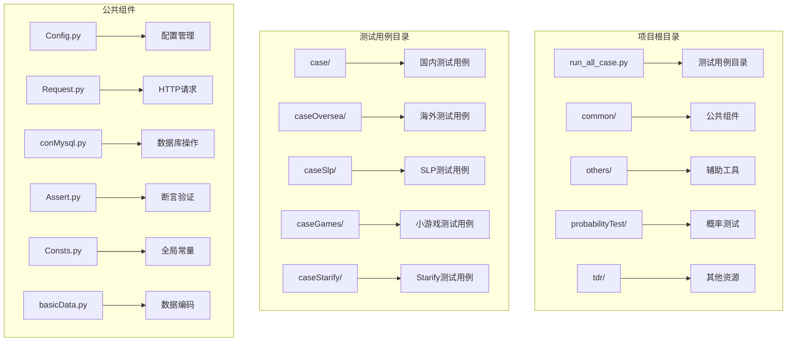
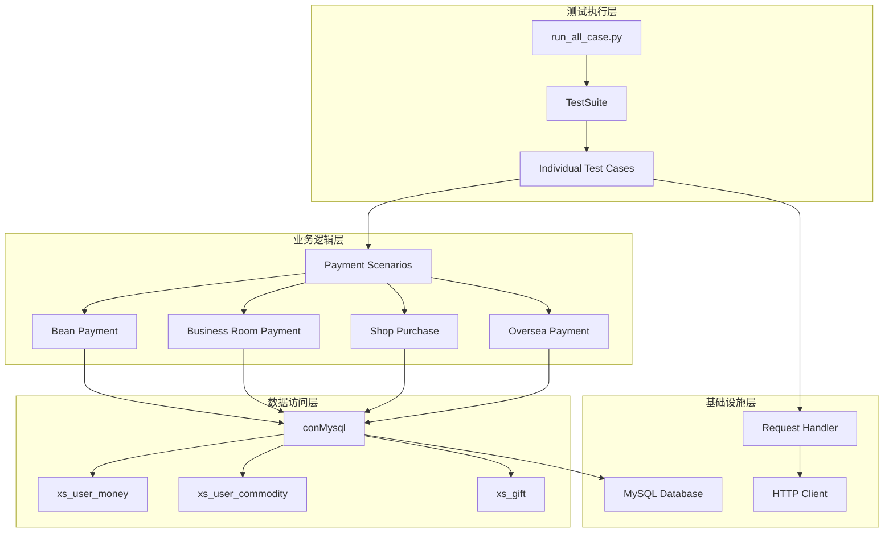
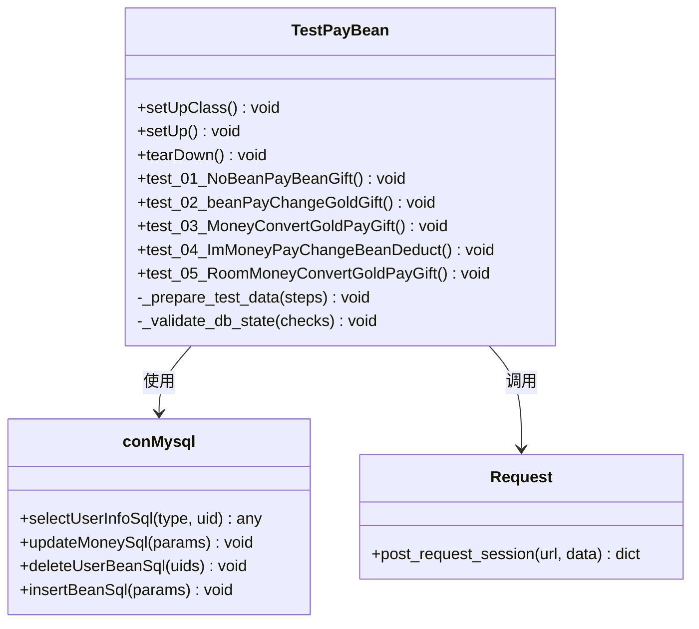
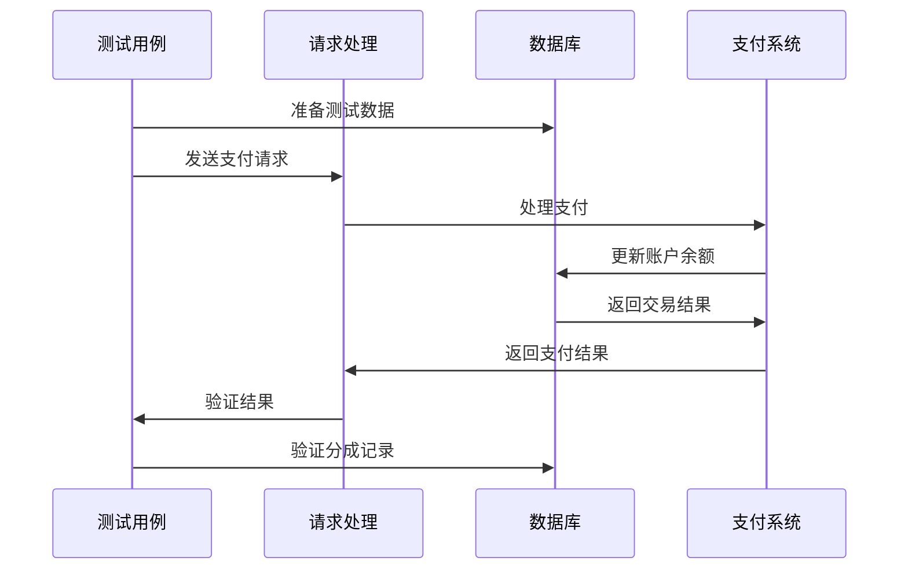
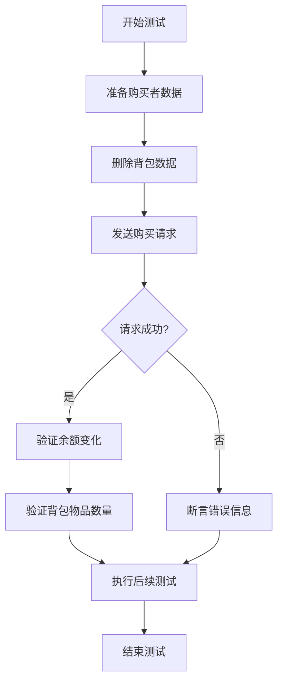
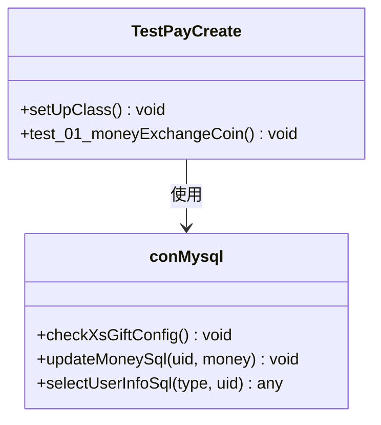
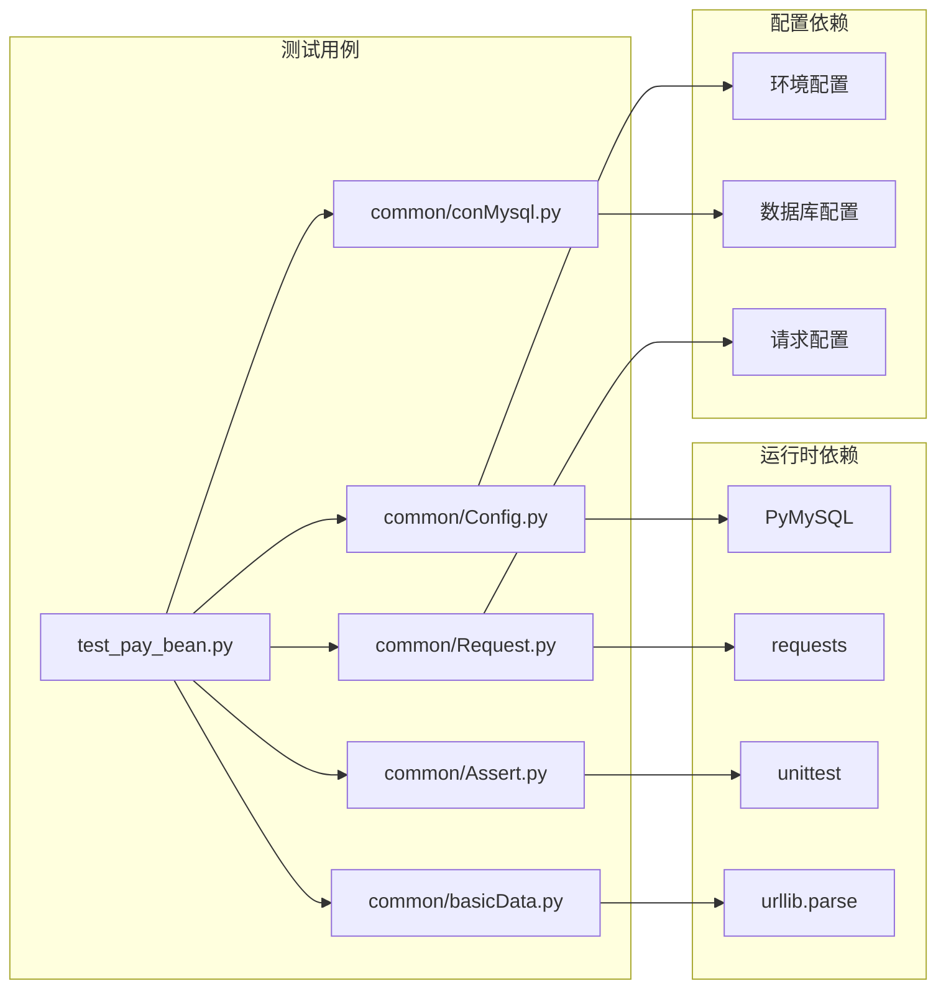
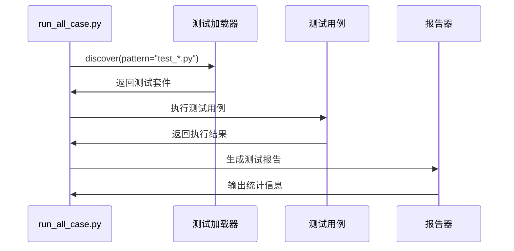

# 私聊付费测试

<cite>
**本文档引用的文件**
- [README.md](file://README.md)
- [run_all_case.py](file://run_all_case.py)
- [Robot.py](file://Robot.py)
- [common/Config.py](file://common/Config.py)
- [common/Consts.py](file://common/Consts.py)
- [case/test_pay_bean.py](file://case/test_pay_bean.py)
- [case/test_pay_business.py](file://case/test_pay_business.py)
- [case/test_pay_shopBuy.py](file://case/test_pay_shopBuy.py)
- [common/Request.py](file://common/Request.py)
- [common/basicData.py](file://common/basicData.py)
- [common/conMysql.py](file://common/conMysql.py)
- [common/Assert.py](file://common/Assert.py)
- [requirements.txt](file://requirements.txt)
- [caseSlp/config.py](file://caseSlp/config.py)
- [caseOversea/test_pt_bean.py](file://caseOversea/test_pt_bean.py)
</cite>

## 目录
1. [简介](#简介)
2. [项目结构](#项目结构)
3. [核心组件](#核心组件)
4. [架构概览](#架构概览)
5. [详细组件分析](#详细组件分析)
6. [依赖分析](#依赖分析)
7. [性能考虑](#性能考虑)
8. [故障排除指南](#故障排除指南)
9. [结论](#结论)

## 简介

这是一个专门针对私聊付费功能的自动化测试框架。该项目基于Python的pytest框架构建，专注于测试各种付费场景下的业务逻辑正确性。

项目主要包含以下测试场景：
- 金豆支付场景（私聊和房间内）
- 商业房支付场景
- 商城购买道具场景
- PT海外版支付场景
- SLP不夜星球支付场景

该测试框架提供了完整的测试生命周期管理，包括环境准备、数据清理、请求发送、结果验证和报告生成等功能。

## 项目结构

**图表来源**
- [run_all_case.py:126-147](file://run_all_case.py#L126-L147)
- [common/Config.py:6-45](file://common/Config.py#L6-L45)

**章节来源**
- [README.md:1-38](file://README.md#L1-L38)
- [run_all_case.py:126-147](file://run_all_case.py#L126-L147)

## 核心组件

### 配置管理系统
配置系统负责管理所有测试相关的配置信息，包括：
- 应用程序URL配置
- 用户ID配置
- 礼物ID配置
- 数据库连接配置
- 环境切换配置

### 请求处理模块
封装了HTTP请求的统一处理逻辑，支持：
- 多种请求方法（GET、POST、PUT）
- 自动化的token管理
- 请求头的统一处理
- 错误处理和重试机制

### 数据库操作模块
提供完整的数据库操作功能：
- 用户账户余额查询
- 账户数据更新
- 礼物配置检查
- 测试数据清理

### 断言验证模块
实现了多种断言验证方法：
- HTTP状态码验证
- JSON响应体验证
- 数值范围验证
- 字符串包含验证

**章节来源**
- [common/Config.py:6-133](file://common/Config.py#L6-L133)
- [common/Request.py:17-59](file://common/Request.py#L17-L59)
- [common/conMysql.py:8-530](file://common/conMysql.py#L8-L530)
- [common/Assert.py:11-96](file://common/Assert.py#L11-L96)

## 架构概览

**图表来源**
- [run_all_case.py:126-147](file://run_all_case.py#L126-L147)
- [common/conMysql.py:28-204](file://common/conMysql.py#L28-L204)
- [common/Request.py:17-59](file://common/Request.py#L17-L59)

## 详细组件分析

### 私聊付费测试组件

#### 金豆支付测试类
该测试类专注于验证私聊场景下的金豆支付逻辑：

**图表来源**
- [case/test_pay_bean.py:12-276](file://case/test_pay_bean.py#L12-L276)
- [common/conMysql.py:28-387](file://common/conMysql.py#L28-L387)
- [common/Request.py:17-59](file://common/Request.py#L17-L59)

该测试类包含以下核心测试场景：
1. **金豆不足场景** - 验证余额不足时的错误处理
2. **正常金豆支付场景** - 验证金豆充足时的支付流程
3. **金豆不足时钻石转换场景** - 验证混合支付逻辑
4. **私聊场景金豆抵扣验证** - 验证私聊场景下的手续费计算
5. **房间场景金豆抵扣验证** - 验证房间场景下的手续费计算

**章节来源**
- [case/test_pay_bean.py:46-246](file://case/test_pay_bean.py#L46-L246)

#### 商业房支付测试类
该测试类专注于验证商业房场景下的支付分成逻辑：

**图表来源**
- [case/test_pay_business.py:45-291](file://case/test_pay_business.py#L45-L291)
- [common/Request.py:17-59](file://common/Request.py#L17-L59)

**章节来源**
- [case/test_pay_business.py:45-291](file://case/test_pay_business.py#L45-L291)

#### 商城购买测试类
该测试类专注于验证商城购买道具的完整流程：

**图表来源**
- [case/test_pay_shopBuy.py:21-123](file://case/test_pay_shopBuy.py#L21-L123)

**章节来源**
- [case/test_pay_shopBuy.py:21-123](file://case/test_pay_shopBuy.py#L21-L123)

### 海外版支付测试组件

#### PT海外版金豆兑换测试
该测试类专注于验证PT海外版的金豆兑换功能：

**图表来源**
- [caseOversea/test_pt_bean.py:12-37](file://caseOversea/test_pt_bean.py#L12-L37)
- [common/conMysql.py:324-333](file://common/conMysql.py#L324-L333)

**章节来源**
- [caseOversea/test_pt_bean.py:19-37](file://caseOversea/test_pt_bean.py#L19-L37)

### SLPSLP支付测试组件

#### SLP配置管理
SLP测试使用独立的配置文件，包含特定的用户ID、房间ID和礼物配置：

**章节来源**
- [caseSlp/config.py:1-263](file://caseSlp/config.py#L1-L263)

## 依赖分析

### 核心依赖关系

**图表来源**
- [requirements.txt:1-85](file://requirements.txt#L1-L85)
- [common/Config.py:6-133](file://common/Config.py#L6-L133)

### 测试执行流程

**图表来源**
- [run_all_case.py:143-146](file://run_all_case.py#L143-L146)

**章节来源**
- [requirements.txt:1-85](file://requirements.txt#L1-L85)
- [run_all_case.py:143-146](file://run_all_case.py#L143-L146)

## 性能考虑

### 测试执行优化
- **并发测试支持**：项目支持并发测试执行，通过`testPayConcurrent.py`实现
- **重试机制**：内置重试装饰器，自动处理临时性失败
- **数据库连接池**：使用持久化数据库连接减少连接开销
- **缓存策略**：合理使用数据库查询结果缓存

### 网络请求优化
- **连接复用**：使用持久连接减少TCP握手开销
- **超时控制**：合理的请求超时设置避免长时间阻塞
- **错误重试**：网络异常时自动重试机制

## 故障排除指南

### 常见问题及解决方案

#### 数据库连接问题
1. **问题现象**：测试执行时报数据库连接错误
2. **解决方案**：
   - 检查数据库配置参数
   - 验证数据库服务状态
   - 确认网络连接可用性

#### 请求超时问题
1. **问题现象**：HTTP请求长时间无响应
2. **解决方案**：
   - 检查目标服务器状态
   - 调整请求超时参数
   - 验证网络连通性

#### 断言失败问题
1. **问题现象**：测试用例断言失败
2. **解决方案**：
   - 检查期望值计算逻辑
   - 验证测试数据准备
   - 查看详细的错误日志

**章节来源**
- [common/Assert.py:11-96](file://common/Assert.py#L11-L96)
- [common/conMysql.py:28-204](file://common/conMysql.py#L28-L204)

## 结论

该私聊付费测试框架是一个结构清晰、功能完善的自动化测试解决方案。主要特点包括：

### 优势
- **模块化设计**：各个组件职责明确，便于维护和扩展
- **完整的测试覆盖**：涵盖私聊、房间、商城等多种支付场景
- **灵活的配置管理**：支持多环境、多应用的配置切换
- **强大的数据处理能力**：提供完整的数据库操作功能

### 改进建议
- **增加日志监控**：增强测试过程中的日志记录和监控
- **性能测试集成**：添加性能基准测试功能
- **可视化报告**：提供更丰富的测试报告展示
- **持续集成支持**：完善CI/CD流水线集成

该框架为私聊付费功能的稳定性和可靠性提供了有力保障，适合在生产环境中长期使用和维护。