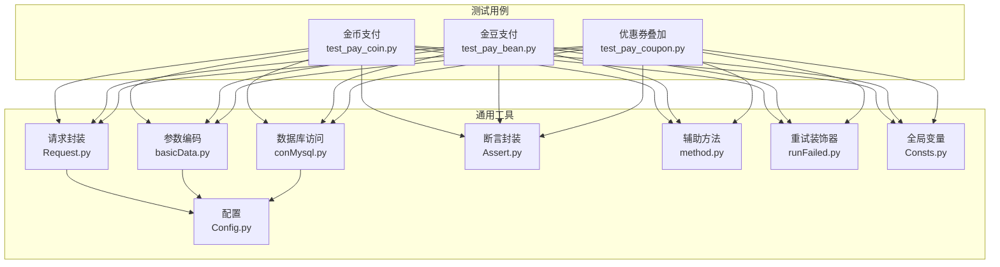
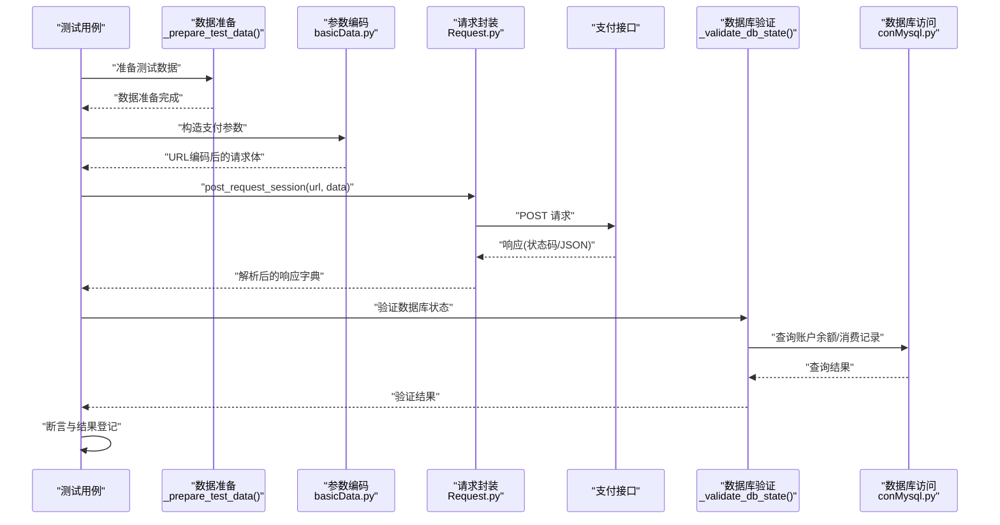
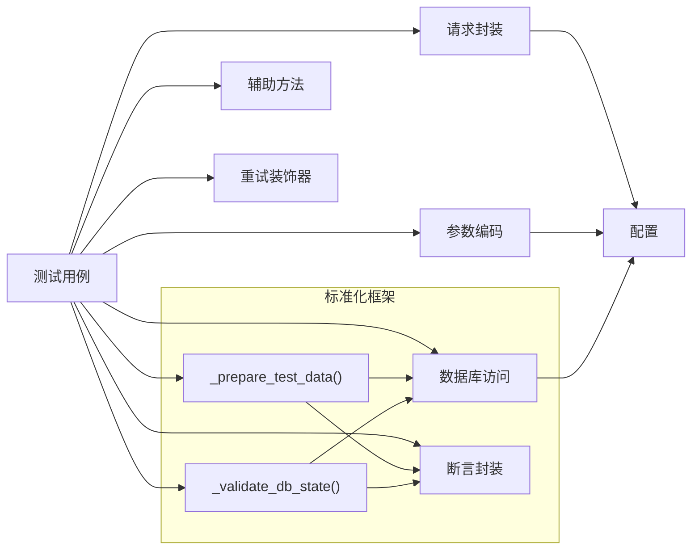

# 金币支付测试

<cite>
**本文引用的文件**
- [test_pay_coin.py](file://case/test_pay_coin.py)
- [test_pay_bean.py](file://case/test_pay_bean.py)
- [test_pay_coupon.py](file://case/test_pay_coupon.py)
- [Config.py](file://common/Config.py)
- [Request.py](file://common/Request.py)
- [basicData.py](file://common/basicData.py)
- [conMysql.py](file://common/conMysql.py)
- [Assert.py](file://common/Assert.py)
- [runFailed.py](file://common/runFailed.py)
- [Consts.py](file://common/Consts.py)
</cite>

## 更新摘要
**变更内容**
- 类名重构：TestPayCreate重命名为TestPayCoin，体现金币支付的专业化命名
- 标准化测试框架：引入_prepare_test_data()和_validate_db_state()辅助方法，提升代码复用性和可维护性
- 增强测试组织结构：通过统一的数据准备和验证模式，简化测试用例编写
- 保持原有功能完整性：所有金币支付场景测试保持不变，包括余额兑换、房间打赏等

## 目录
1. [简介](#简介)
2. [项目结构](#项目结构)
3. [核心组件](#核心组件)
4. [架构总览](#架构总览)
5. [详细组件分析](#详细组件分析)
6. [依赖分析](#依赖分析)
7. [性能考虑](#性能考虑)
8. [故障排查指南](#故障排查指南)
9. [结论](#结论)
10. [附录](#附录)

## 简介
本文件面向金币支付测试用例，系统化梳理金币余额不足、金币充足、金币退款、金币与优惠券叠加、金币与金豆差异、金币账户特殊规则、手续费计算方式、余额查询与消费记录验证、充值测试等场景。通过并行分析测试脚本、工具类与数据库访问层，形成从接口调用到数据库校验的完整闭环，并提供数据准备方法、验证策略与异常处理机制。

**更新** 本次重构引入了标准化的测试框架，通过统一的辅助方法提升代码质量和可维护性。

## 项目结构
围绕金币支付测试的关键模块如下：
- 测试用例：金币支付、金豆支付、优惠券叠加等场景
- 工具与配置：请求封装、参数编码、数据库访问、断言与重试
- 运行控制：用例列表、结果统计、失败重试装饰器

**图表来源**
- [test_pay_coin.py:1-120](file://case/test_pay_coin.py#L1-L120)
- [test_pay_bean.py:1-276](file://case/test_pay_bean.py#L1-L276)
- [test_pay_coupon.py:1-149](file://case/test_pay_coupon.py#L1-L149)
- [Config.py:1-133](file://common/Config.py#L1-L133)
- [Request.py:1-162](file://common/Request.py#L1-L162)
- [basicData.py:1-581](file://common/basicData.py#L1-L581)
- [conMysql.py:1-530](file://common/conMysql.py#L1-L530)
- [Assert.py:1-96](file://common/Assert.py#L1-L96)
- [runFailed.py:1-87](file://common/runFailed.py#L1-L87)
- [Consts.py:1-17](file://common/Consts.py#L1-L17)

**章节来源**
- [test_pay_coin.py:1-120](file://case/test_pay_coin.py#L1-L120)
- [test_pay_bean.py:1-276](file://case/test_pay_bean.py#L1-L276)
- [test_pay_coupon.py:1-149](file://case/test_pay_coupon.py#L1-L149)
- [Config.py:1-133](file://common/Config.py#L1-L133)

## 核心组件
- 接口请求封装：统一POST请求、超时与异常处理、响应解析
- 参数编码：根据场景构造不同类型的支付参数（房间打赏、聊天礼物、兑换金币等）
- 数据库访问：余额查询、更新、消费记录校验、清理测试数据
- 断言与验证：状态码、返回体字段、数值范围、消息提示
- 辅助方法：VIP经验计算、错误原因拼装
- 重试机制：失败自动重试与环境重置
- 全局变量：用例列表、结果标记、并发统计

**更新** 新增标准化测试框架，通过_prepare_test_data()和_validate_db_state()方法统一数据准备和验证流程。

**章节来源**
- [Request.py:17-59](file://common/Request.py#L17-L59)
- [basicData.py:9-325](file://common/basicData.py#L9-L325)
- [conMysql.py:28-204](file://common/conMysql.py#L28-L204)
- [Assert.py:11-96](file://common/Assert.py#L11-L96)
- [method.py:163-171](file://common/method.py#L163-L171)
- [runFailed.py:10-87](file://common/runFailed.py#L10-L87)
- [Consts.py:4-17](file://common/Consts.py#L4-L17)

## 架构总览
金币支付测试的整体流程：准备数据 → 编码参数 → 发起请求 → 校验响应 → 校验数据库 → 记录结果。

**更新** 新增标准化测试框架，通过统一的辅助方法提升测试流程的一致性和可维护性。

**图表来源**
- [test_pay_coin.py:25-40](file://case/test_pay_coin.py#L25-L40)
- [basicData.py:9-325](file://common/basicData.py#L9-L325)
- [Request.py:17-59](file://common/Request.py#L17-L59)
- [conMysql.py:28-204](file://common/conMysql.py#L28-L204)

## 详细组件分析

### 场景一：金币余额不足时的支付
- 适用场景：金币余额不足以完成打赏或兑换
- 关键步骤：
  - 初始化金币余额为较低值
  - 发起金币打赏或金币兑换请求
  - 校验接口返回失败与提示信息
  - 校验被打赏者账户余额未变化
- 验证要点：
  - 响应字段"success"为0
  - 返回消息包含"余额不足"
  - 被打赏者金币余额为0或不变
- 异常处理：
  - 使用重试装饰器在失败时自动重试并重置环境

**章节来源**
- [test_pay_coin.py:16-34](file://case/test_pay_coin.py#L16-L34)

### 场景二：金币充足时的支付
- 适用场景：金币余额足以覆盖打赏金额
- 关键步骤：
  - 设置金币余额充足
  - 发起金币打赏（房间内/多人）
  - 校验接口返回成功
  - 校验打赏者金币余额减少、被打赏者金币余额增加
- 验证要点：
  - 响应字段"success"为1
  - 打赏者金币余额 = 初始余额 - 支付金额
  - 打赏者VIP经验按倍率增长
- 异常处理：
  - 多人场景需分别校验各被打赏者的金币余额

**更新** 使用标准化测试框架，通过_prepare_test_data()和_validate_db_state()方法统一数据准备和验证流程。

**章节来源**
- [test_pay_coin.py:76-120](file://case/test_pay_coin.py#L76-L120)

### 场景三：金币支付的退款测试
- 说明：当前仓库未提供金币退款专用用例；如需覆盖退款场景，建议新增用例以模拟撤销/退款流程，并校验金币余额回退与消费记录变更。
- 建议验证点：
  - 退款后金币余额恢复
  - 消费记录中出现退款条目
  - VIP经验回退逻辑（如适用）

[本节为概念性内容，不直接分析具体文件]

### 场景四：金币支付的优惠券叠加测试
- 适用场景：金币支付与优惠券同时使用
- 关键步骤：
  - 准备激活状态的优惠券
  - 发起金币支付并指定券ID与抵扣金额
  - 校验最终支付金额与分成比例
- 验证要点：
  - 优惠券抵扣生效后，最终支付金额减少
  - 分成比例按房间类型与角色（一代宗师/公会等）计算
- 异常处理：
  - 未激活券或券不可用时，应返回失败并提示余额不足

**章节来源**
- [test_pay_coupon.py:38-94](file://case/test_pay_coupon.py#L38-L94)

### 场景五：金币与金豆支付的区别
- 金币（gold_coin）：
  - 用于房间打赏、多人打赏、部分场景的兑换
  - 分成比例受房间类型与角色影响
- 金豆（money_coupon）：
  - 主要用于特定礼物与兑换场景
  - 曾用于手续费抵扣，现已调整为不再抵扣
- 验证要点：
  - 金豆不足时，金币可作为补充或兑换
  - 私聊/房间场景下，金豆不再抵扣手续费

**章节来源**
- [test_pay_bean.py:173-247](file://case/test_pay_bean.py#L173-L247)

### 场景六：金币账户的特殊规则
- 金币账户余额查询：
  - 支持按用户UID查询单账户余额与总余额
  - 支持查询VIP经验、人气等级等
- 消费记录验证：
  - 通过最近一次xs_pay_change记录中的reason字段校验金币变动原因
- 充值测试：
  - 通过"余额兑换金币"场景验证金币充值流程
- 异常处理：
  - 查询不到记录时返回默认值，避免断言失败

**更新** 新增标准化验证方法，通过_validate_db_state()统一数据库状态验证流程。

**章节来源**
- [conMysql.py:28-204](file://common/conMysql.py#L28-L204)
- [test_pay_coin.py:16-34](file://case/test_pay_coin.py#L16-L34)

### 场景七：金币支付的手续费计算方式
- 当前规则：
  - 金豆不再抵扣手续费（私聊/房间场景）
  - 房间场景按固定分成比例计算被打赏者到账
- 验证要点：
  - 私聊场景：手续费由钻石承担，金豆不参与抵扣
  - 房间场景：按房间类型与角色计算被打赏者到账金额

**章节来源**
- [test_pay_bean.py:173-247](file://case/test_pay_bean.py#L173-L247)
- [Config.py:57-57](file://common/Config.py#L57-L57)

### 场景八：数据准备方法与验证策略
- 数据准备：
  - 使用数据库工具类更新/清理用户余额
  - 插入金豆余额、优惠券、礼物等测试数据
- 验证策略：
  - 断言接口状态码与返回体字段
  - 断言数据库余额与VIP经验
  - 断言消费记录reason字段
- 异常处理：
  - 失败用例自动重试并重置环境
  - 统计失败原因并输出日志

**更新** 引入标准化测试框架，通过_prepare_test_data()和_validate_db_state()方法统一测试流程。

**章节来源**
- [conMysql.py:336-388](file://common/conMysql.py#L336-L388)
- [Assert.py:11-96](file://common/Assert.py#L11-L96)
- [runFailed.py:10-87](file://common/runFailed.py#L10-L87)

### 场景九：异常处理机制
- 请求异常：
  - 对网络异常进行捕获并返回空响应
- 断言异常：
  - 不匹配时记录失败原因并抛出异常
- 重试机制：
  - 装饰器支持按前缀筛选用例，失败后自动重试并重置环境

**章节来源**
- [Request.py:35-46](file://common/Request.py#L35-L46)
- [Assert.py:11-26](file://common/Assert.py#L11-L26)
- [runFailed.py:60-78](file://common/runFailed.py#L60-L78)

### 场景十：标准化测试框架详解
- **类名重构**：TestPayCreate重命名为TestPayCoin，体现金币支付的专业化命名
- **数据准备方法**：_prepare_test_data()统一处理各种数据准备场景
- **数据库验证方法**：_validate_db_state()统一处理数据库状态验证
- **重试机制**：@Retry装饰器支持按函数前缀筛选重试用例
- **代码复用性**：通过统一的方法提升测试代码的复用性和可维护性

**新增** 标准化测试框架的核心特性，提升测试质量。

**章节来源**
- [test_pay_coin.py:13-40](file://case/test_pay_coin.py#L13-L40)

## 依赖分析
- 测试用例依赖：
  - 参数编码：根据场景选择不同的payType与参数组合
  - 请求封装：统一header与token处理
  - 数据库访问：查询与更新用户余额、消费记录
  - 断言封装：统一断言逻辑
  - 辅助方法：VIP经验计算、错误原因拼装
  - 重试装饰器：失败自动重试
- 配置依赖：
  - 支付URL、用户UID、礼物ID、房间类型等

**更新** 新增标准化测试框架的依赖关系，通过统一的辅助方法提升整体架构的一致性。

**图表来源**
- [test_pay_coin.py:1-120](file://case/test_pay_coin.py#L1-L120)
- [basicData.py:9-325](file://common/basicData.py#L9-L325)
- [Request.py:17-59](file://common/Request.py#L17-L59)
- [conMysql.py:28-204](file://common/conMysql.py#L28-L204)
- [Assert.py:11-96](file://common/Assert.py#L11-L96)
- [method.py:163-171](file://common/method.py#L163-L171)
- [runFailed.py:10-87](file://common/runFailed.py#L10-L87)
- [Config.py:47-133](file://common/Config.py#L47-L133)

**章节来源**
- [test_pay_coin.py:1-120](file://case/test_pay_coin.py#L1-L120)
- [basicData.py:9-325](file://common/basicData.py#L9-L325)
- [Request.py:17-59](file://common/Request.py#L17-L59)
- [conMysql.py:28-204](file://common/conMysql.py#L28-L204)
- [Assert.py:11-96](file://common/Assert.py#L11-L96)
- [method.py:163-171](file://common/method.py#L163-L171)
- [runFailed.py:10-87](file://common/runFailed.py#L10-L87)
- [Config.py:47-133](file://common/Config.py#L47-L133)

## 性能考虑
- 接口延迟：RPC接口可能存在延迟，断言前适当等待可降低误判
- 数据库事务：批量更新与清理操作采用提交策略，确保一致性
- 重试策略：失败自动重试并重置环境，减少环境污染
- **代码优化**：标准化测试框架通过统一方法减少重复代码，提升执行效率

[本节提供一般性指导，不直接分析具体文件]

## 故障排查指南
- 接口返回异常：
  - 检查状态码与返回体，确认是否缺少必需字段
  - 查看失败原因列表，定位具体断言失败项
- 余额不一致：
  - 核对数据库查询字段与money_type是否正确
  - 确认VIP经验计算倍率与用户爵位等级
- 重试无效：
  - 检查重试装饰器的函数前缀筛选条件
  - 确认setUp/tearDown是否正确执行
- **框架问题**：
  - 检查_prepare_test_data()和_validate_db_state()方法的参数格式
  - 确认数据库查询方法的money_type参数传递

**更新** 新增标准化测试框架相关的故障排查指导。

章节来源
- [Assert.py:11-26](file://common/Assert.py#L11-L26)
- [runFailed.py:60-78](file://common/runFailed.py#L60-L78)
- [Consts.py:8-8](file://common/Consts.py#L8-L8)

## 结论
本测试体系通过参数编码、请求封装、数据库校验与断言封装，覆盖了金币支付的主要场景。结合重试机制与全局变量管理，能够稳定地执行并记录测试结果。**更新** 重构后的标准化测试框架通过统一的辅助方法提升了代码质量和可维护性，建议后续补充金币退款与更丰富的优惠券叠加场景，以进一步完善金币支付的全链路验证。

## 附录
- 关键配置项：
  - 支付URL、用户UID、礼物ID、房间类型、分成比例
- 常用数据库查询：
  - 单账户余额、总余额、VIP经验、消费记录reason
- 常用断言：
  - 状态码、返回体字段、数值相等、区间断言
- **标准化框架方法**：
  - _prepare_test_data()：统一数据准备流程
  - _validate_db_state()：统一数据库验证流程
  - @Retry装饰器：统一重试机制

**更新** 新增标准化测试框架的相关配置和方法说明。

章节来源
- [Config.py:47-133](file://common/Config.py#L47-L133)
- [conMysql.py:28-204](file://common/conMysql.py#L28-L204)
- [Assert.py:11-96](file://common/Assert.py#L11-L96)
- [test_pay_coin.py:25-40](file://case/test_pay_coin.py#L25-L40)