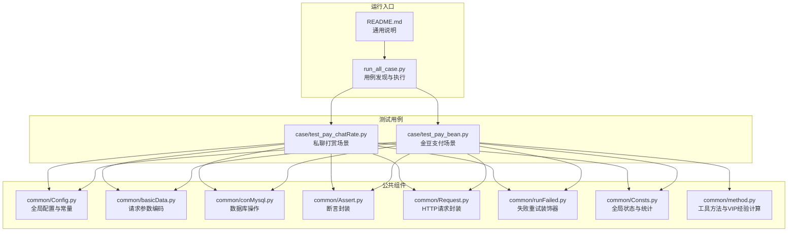
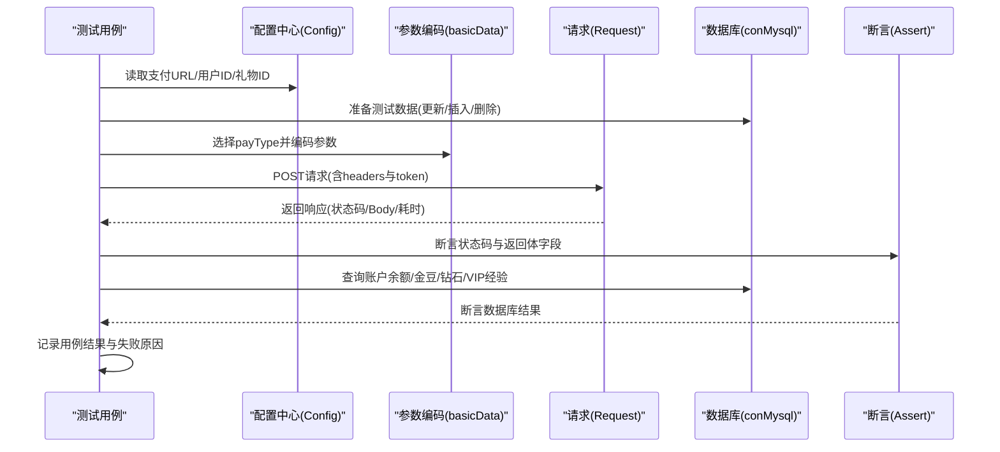
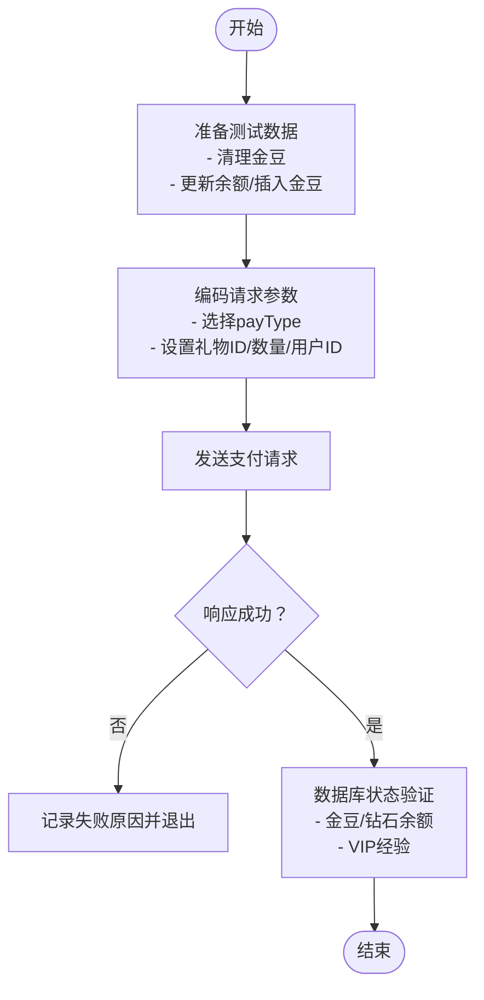
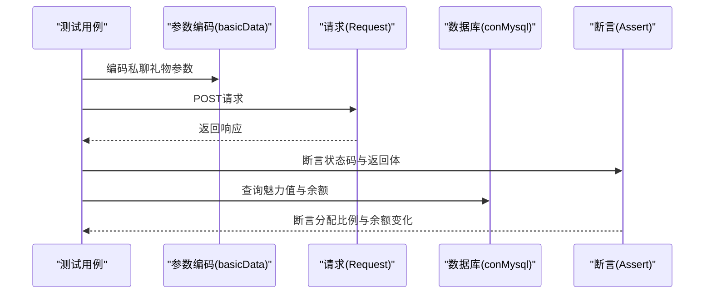
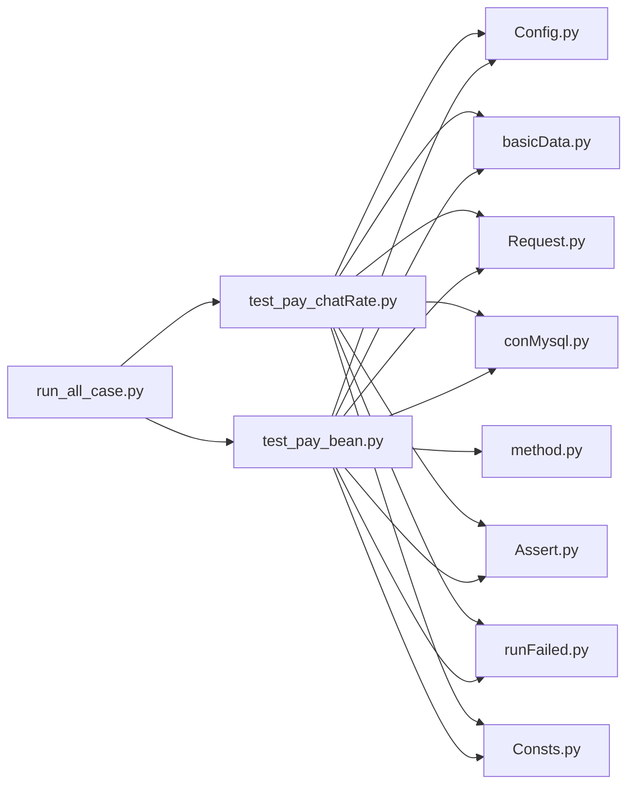

# 金豆支付测试

<cite>
**本文引用的文件**
- [test_pay_bean.py](file://case/test_pay_bean.py)
- [test_pay_chatRate.py](file://case/test_pay_chatRate.py)
- [Config.py](file://common/Config.py)
- [basicData.py](file://common/basicData.py)
- [conMysql.py](file://common/conMysql.py)
- [Assert.py](file://common/Assert.py)
- [runFailed.py](file://common/runFailed.py)
- [Request.py](file://common/Request.py)
- [Consts.py](file://common/Consts.py)
- [method.py](file://common/method.py)
- [README.md](file://README.md)
- [run_all_case.py](file://run_all_case.py)
</cite>

## 更新摘要
**变更内容**
- 测试类重构：TestPayCreate重命名为TestPayBean，体现更精确的测试职责
- 生命周期管理改进：引入setUpClass进行环境初始化，setUp/tearDown自动清理测试数据
- 测试用例结构标准化：新增_prepare_test_data和_validate_db_state辅助方法
- 失败重试机制增强：Retry装饰器支持类级应用和方法级控制
- 数据准备流程标准化：统一的数据准备和验证方法提升代码复用性

## 目录
1. [简介](#简介)
2. [项目结构](#项目结构)
3. [核心组件](#核心组件)
4. [架构总览](#架构总览)
5. [详细组件分析](#详细组件分析)
6. [依赖分析](#依赖分析)
7. [性能考虑](#性能考虑)
8. [故障排查指南](#故障排查指南)
9. [结论](#结论)
10. [附录](#附录)

## 简介
本文件面向金豆支付测试用例，系统化梳理并说明以下场景的测试设计与执行要点：
- 金豆不足时的打赏测试
- 金豆充足时的打赏测试
- 金豆不足用钻石转换的测试
- 私聊场景中钻石礼物的金豆抵扣测试（注：根据用例标注，该抵扣策略已调整）
- 房间场景中钻石礼物的金豆抵扣测试（注：根据用例标注，该抵扣策略已调整）

文档覆盖测试设计思路、前置条件准备、执行步骤、数据库状态验证与预期结果；同时提供测试数据准备方法、VIP经验值计算验证、失败重试机制的应用、具体测试参数配置、边界条件处理与异常模拟方法。

## 项目结构
本仓库采用按功能域划分的组织方式，其中与金豆支付直接相关的模块集中在 common 与 case 目录：
- common：公共工具与基础设施，包括配置、数据库操作、断言、请求封装、失败重试等
- case：各业务场景测试用例，如金豆支付、聊天打赏、商店购买等

**图表来源**
- [test_pay_bean.py:1-276](file://case/test_pay_bean.py#L1-L276)
- [test_pay_chatRate.py:1-142](file://case/test_pay_chatRate.py#L1-L142)
- [Config.py:1-133](file://common/Config.py#L1-L133)
- [basicData.py:1-581](file://common/basicData.py#L1-L581)
- [conMysql.py:1-530](file://common/conMysql.py#L1-L530)
- [Assert.py:1-96](file://common/Assert.py#L1-L96)
- [Request.py:1-162](file://common/Request.py#L1-L162)
- [runFailed.py:1-87](file://common/runFailed.py#L1-L87)
- [Consts.py:1-17](file://common/Consts.py#L1-L17)
- [method.py:1-171](file://common/method.py#L1-L171)
- [run_all_case.py:1-159](file://run_all_case.py#L1-L159)
- [README.md:1-38](file://README.md#L1-L38)

**章节来源**
- [README.md:1-38](file://README.md#L1-L38)
- [run_all_case.py:126-147](file://run_all_case.py#L126-L147)

## 核心组件
- 配置中心：集中管理支付接口地址、用户ID、礼物ID、房间ID、分成比例等
- 请求封装：统一HTTP头、用户令牌、URL格式化与响应解析
- 数据准备：通过SQL更新/插入/删除用户账户余额、金豆余额、VIP经验等
- 断言封装：统一断言接口，支持状态码、字段值、范围、文本包含等
- 参数编码：根据payType生成不同场景的请求参数包
- 失败重试：装饰器自动重试指定次数并清理前后置状态
- 全局状态：记录用例执行结果、失败原因、统计信息

**章节来源**
- [Config.py:47-93](file://common/Config.py#L47-L93)
- [Request.py:17-59](file://common/Request.py#L17-L59)
- [conMysql.py:27-204](file://common/conMysql.py#L27-L204)
- [Assert.py:11-96](file://common/Assert.py#L11-L96)
- [basicData.py:8-325](file://common/basicData.py#L8-L325)
- [runFailed.py:10-87](file://common/runFailed.py#L10-L87)
- [Consts.py:4-17](file://common/Consts.py#L4-L17)

## 架构总览
金豆支付测试的整体流程如下：
- 初始化与准备：读取配置、清理/准备测试数据
- 组装请求：根据场景选择payType并编码参数
- 发起请求：通过封装的POST方法发送到支付接口
- 校验响应：断言状态码与返回体字段
- 校验数据库：查询账户余额、金豆、钻石、VIP经验等
- 记录结果：写入全局结果字典与失败原因列表

**图表来源**
- [test_pay_bean.py:20-120](file://case/test_pay_bean.py#L20-L120)
- [basicData.py:8-325](file://common/basicData.py#L8-L325)
- [Request.py:17-59](file://common/Request.py#L17-L59)
- [conMysql.py:27-204](file://common/conMysql.py#L27-L204)
- [Assert.py:11-96](file://common/Assert.py#L11-L96)

## 详细组件分析

### 金豆支付测试类（test_pay_bean.py）
该类覆盖金豆支付的多种场景，均通过统一的前置/后置清理与数据准备方法实现。

- **测试类与重试装饰器**
  - 使用失败重试装饰器，提升网络抖动或服务瞬时异常下的稳定性
  - setUpClass：初始化xs_gift配置，确保测试环境一致性
  - setUp/tearDown分别清理打赏者与被打赏者的金豆余额，避免跨用例干扰

- **标准化辅助方法**
  - _prepare_test_data：统一的数据准备流程，支持delete_beans、update_money、insert_beans等操作类型
  - _validate_db_state：统一的数据库状态验证，支持灵活的断言配置和参数传递

- **场景一：金豆不足时打赏金豆礼物**
  - 设计思路：构造双方账户，确保被打赏者金豆为0，打赏者钻石充足
  - 执行步骤：编码金豆礼物参数，发起支付请求
  - 预期结果：接口成功返回，返回体提示"金豆不足"，被打赏者金豆余额为0
  - 数据库验证：被打赏者金豆余额为0

- **场景二：金豆充足时打赏金豆礼物**
  - 设计思路：为打赏者注入足够金豆，验证正常扣减与到账
  - 执行步骤：编码多用户/多数量场景，发起支付请求
  - 预期结果：接口成功返回，打赏者金豆余额清零，被打赏者金豆按比例到账

- **场景三：金豆不足用钻石转换打赏金豆礼物**
  - 设计思路：打赏者金豆少量，钻石充足，触发"钻转金"逻辑
  - 执行步骤：设置payType为"钻转金"，发起支付请求
  - 预期结果：接口成功返回，打赏者金豆余额不变，钻石按价格转换并扣减，被打赏者金豆按比例到账
  - VIP经验：调用经验值计算方法，验证VIP经验增长

- **场景四：私聊场景中钻石礼物（金豆不再抵扣手续费）**
  - 设计思路：私聊页打赏钻石礼物，验证金豆不再抵扣平台手续费
  - 执行步骤：设置payType为"私聊礼物"，发起支付请求
  - 预期结果：接口成功返回，打赏者金豆余额不变，钻石按价格扣减，被打赏者钻石按比例到账

- **场景五：房间场景中钻石礼物（金豆不再抵扣手续费）**
  - 设计思路：房间内打赏钻石礼物，验证金豆不再抵扣平台手续费
  - 执行步骤：设置默认payType（房间场景），发起支付请求
  - 预期结果：接口成功返回，打赏者金豆余额不变，钻石按价格扣减，被打赏者钻石按比例到账

**图表来源**
- [test_pay_bean.py:28-120](file://case/test_pay_bean.py#L28-L120)
- [basicData.py:8-325](file://common/basicData.py#L8-L325)
- [conMysql.py:27-204](file://common/conMysql.py#L27-L204)

**章节来源**
- [test_pay_bean.py:12-276](file://case/test_pay_bean.py#L12-L276)

### 私聊打赏测试类（test_pay_chatRate.py）
该类补充了私聊场景中的打赏行为与分成规则验证，便于与金豆支付场景对比。

- 场景一：私聊打赏余额不足
  - 设计思路：双方账户余额清零，尝试打赏
  - 预期结果：返回"余额不足，无法支付"，被打赏者余额不变

- 场景二：私聊打赏礼物给GS（公会）
  - 设计思路：打赏给GS，验证分成比例（魅力值分配）
  - 预期结果：被打赏者魅力值按比例到账，打赏者余额清零

- 场景三：私聊打赏箱子给GS
  - 设计思路：打赏箱子，验证最低到账门槛
  - 预期结果：被打赏者魅力值不低于最低比例，打赏者余额相应扣减

- 场景四：私聊打赏非一代宗师用户
  - 设计思路：验证非一代宗师用户的分成比例
  - 预期结果：被打赏者个人魅力值按比例到账

- 场景五：私聊打赏一代宗师用户
  - 设计思路：验证一代宗师用户的分成比例
  - 预期结果：被打赏者个人魅力值按更高比例到账

**图表来源**
- [test_pay_chatRate.py:16-142](file://case/test_pay_chatRate.py#L16-L142)
- [basicData.py:134-156](file://common/basicData.py#L134-L156)
- [conMysql.py:27-204](file://common/conMysql.py#L27-L204)
- [Assert.py:11-96](file://common/Assert.py#L11-L96)

**章节来源**
- [test_pay_chatRate.py:1-142](file://case/test_pay_chatRate.py#L1-L142)

### 配置中心（Config.py）
- 支付接口URL：统一内网支付接口地址
- 用户ID：打赏者、被打赏者、GS用户、一代宗师等角色ID
- 礼物ID：金豆礼物与钻石礼物的映射
- 分成比例：GS商业房分成比
- PT用户与礼物ID：海外场景配置（与金豆支付场景关联不大）

**章节来源**
- [Config.py:47-128](file://common/Config.py#L47-L128)

### 请求封装（Request.py）
- 统一Header：User-Agent、Content-Type、Connection、user-token
- URL处理：自动补齐HTTPS前缀
- 响应解析：提取状态码、JSON Body、耗时信息
- Token管理：通过会话模块读取用户令牌

**章节来源**
- [Request.py:17-59](file://common/Request.py#L17-L59)

### 数据准备与断言（conMysql.py、Assert.py）
- 数据准备：
  - 更新用户余额：支持money/money_b/money_cash/money_cash_b/gold_coin/money_debts
  - 插入/删除金豆：插入金豆余额、删除金豆账户
  - 查询账户：金豆、现金、总余额、单账户余额、VIP经验、消费记录等
  - 清理/初始化：清理背包、标题、房间属性等
- 断言封装：
  - 状态码断言
  - 字段值断言
  - 文本包含断言
  - 数值范围断言

**章节来源**
- [conMysql.py:27-204](file://common/conMysql.py#L27-L204)
- [Assert.py:11-96](file://common/Assert.py#L11-L96)

### 参数编码（basicData.py）
- 支持多种payType：
  - 房间/多人场景：package、package-more、package-exchange
  - 私聊场景：chat-gift
  - 商店/防御/标题等：对应类型
- 关键参数：rid、uid、uids、giftId、giftNum、price、gift_type、useCoin、star、exchange等

**章节来源**
- [basicData.py:8-325](file://common/basicData.py#L8-L325)

### 失败重试（runFailed.py）
- 装饰器支持：
  - 类级/方法级应用
  - 自定义重试次数与方法名前缀
  - 异常捕获与setUp/tearDown重置
- 适用场景：网络波动、服务瞬时异常导致的偶发失败

**章节来源**
- [runFailed.py:10-87](file://common/runFailed.py#L10-L87)

### 全局状态（Consts.py）
- 用例结果字典、失败原因列表、统计信息（成功/失败计数）、时间戳等

**章节来源**
- [Consts.py:4-17](file://common/Consts.py#L4-L17)

### VIP经验值计算（method.py）
- 金豆支付场景：经验值按金豆支付金额乘以系数计算
- 钻石支付场景：经验值按钻石支付金额乘以title系数计算
- 验证方法：在支付后查询VIP经验字段并与预期值断言

**章节来源**
- [method.py:163-171](file://common/method.py#L163-L171)

## 依赖分析
- 测试用例依赖配置中心提供URL与ID，依赖参数编码生成请求体，依赖请求封装发送HTTP请求，依赖数据库封装进行数据准备与验证，依赖断言封装进行结果校验，依赖失败重试装饰器提升稳定性
- 运行入口负责用例发现与执行，按应用类型加载对应case目录

**图表来源**
- [test_pay_bean.py:1-276](file://case/test_pay_bean.py#L1-L276)
- [test_pay_chatRate.py:1-142](file://case/test_pay_chatRate.py#L1-L142)
- [Config.py:1-133](file://common/Config.py#L1-L133)
- [basicData.py:1-581](file://common/basicData.py#L1-L581)
- [Request.py:1-162](file://common/Request.py#L1-L162)
- [conMysql.py:1-530](file://common/conMysql.py#L1-L530)
- [Assert.py:1-96](file://common/Assert.py#L1-L96)
- [runFailed.py:1-87](file://common/runFailed.py#L1-L87)
- [Consts.py:1-17](file://common/Consts.py#L1-L17)
- [method.py:1-171](file://common/method.py#L1-L171)
- [run_all_case.py:126-147](file://run_all_case.py#L126-L147)

**章节来源**
- [run_all_case.py:126-147](file://run_all_case.py#L126-L147)

## 性能考虑
- 接口延迟：在非特定节点环境下断言前添加短暂等待，缓解RPC接口延迟导致的误判
- 数据库事务：批量更新/插入/删除采用提交控制，避免长事务影响
- 请求头优化：关闭SSL证书校验与无关警告，减少网络层开销
- 重试策略：适度重试可提升稳定性，但需避免过度重试造成数据状态漂移

**章节来源**
- [Assert.py:17-25](file://common/Assert.py#L17-L25)
- [Request.py:25-32](file://common/Request.py#L25-L32)
- [conMysql.py:350-361](file://common/conMysql.py#L350-L361)

## 故障排查指南
- 常见问题
  - 余额不足：检查双方余额与礼物价格，确认是否触发"钻转金"
  - 金豆抵扣策略变更：私聊/房间场景中金豆不再抵扣手续费，需核对预期
  - VIP经验未增长：确认经验值计算方法与title系数是否正确
  - 数据库查询异常：检查字段名与money_type参数是否匹配
- 排查步骤
  - 查看失败原因列表与断言错误信息
  - 核对数据库最终状态与期望值
  - 在本地节点运行并观察响应耗时
  - 启用重试后再次执行，确认是否为偶发性问题

**章节来源**
- [Assert.py:23-25](file://common/Assert.py#L23-L25)
- [Consts.py:7-10](file://common/Consts.py#L7-L10)

## 结论
本测试体系围绕金豆支付的多场景构建，通过统一的配置、参数编码、请求封装、数据库准备与断言机制，形成可维护、可扩展的自动化测试方案。结合失败重试与全局状态记录，能够有效提升测试稳定性与可观测性。建议在后续迭代中持续完善边界条件与异常场景覆盖，并保持配置与参数编码的一致性。

## 附录

### 测试参数配置清单
- 支付接口URL：来自配置中心的支付接口地址
- 用户ID：打赏者、被打赏者、GS用户、一代宗师等
- 礼物ID：金豆礼物与钻石礼物映射
- payType：房间/私聊/钻转金等场景
- 金额与数量：money、num、uids等
- 验证字段：success、msg、余额、VIP经验等

**章节来源**
- [Config.py:47-128](file://common/Config.py#L47-L128)
- [basicData.py:8-325](file://common/basicData.py#L8-L325)

### VIP经验值计算验证
- 金豆支付场景：经验值按金豆支付金额乘以系数计算
- 钻石支付场景：经验值按钻石支付金额乘以title系数计算
- 验证方法：在支付后查询VIP经验字段并与预期值断言

**章节来源**
- [method.py:163-171](file://common/method.py#L163-L171)
- [test_pay_bean.py:165-169](file://case/test_pay_bean.py#L165-L169)

### 边界条件与异常模拟
- 余额不足：双方余额清零或极低，验证失败提示
- 礼物价格为0或极大：验证系统处理与断言
- 多人场景：uids数量与实际数量不一致，验证分配逻辑
- 异常场景：私聊/房间场景中金豆不再抵扣手续费，验证预期结果

**章节来源**
- [test_pay_bean.py:47-247](file://case/test_pay_bean.py#L47-L247)
- [test_pay_chatRate.py:16-142](file://case/test_pay_chatRate.py#L16-L142)

### 测试类重构详解
**更新** 测试类从TestPayCreate重命名为TestPayBean，体现了更精确的测试职责划分

- **生命周期管理**
  - setUpClass：初始化xs_gift配置，确保测试环境一致性
  - setUp/tearDown：自动清理测试数据，避免跨用例干扰
  
- **辅助方法**
  - _prepare_test_data：统一的数据准备流程，支持多种操作类型
  - _validate_db_state：统一的数据库状态验证，支持灵活的断言配置
  
- **测试结构改进**
  - 更清晰的测试方法命名
  - 增强的错误处理与可维护性
  - 标准化的测试数据准备与验证流程

**章节来源**
- [test_pay_bean.py:12-276](file://case/test_pay_bean.py#L12-L276)

### 失败重试机制详解
**更新** Retry装饰器提供更强大的失败重试能力

- **装饰器特性**
  - 支持类级和方法级应用
  - 可配置重试次数和方法名前缀
  - 自动处理setUp/tearDown清理逻辑
  
- **应用场景**
  - 网络波动导致的偶发失败
  - 服务瞬时异常的自动恢复
  - 测试数据竞争条件的规避

**章节来源**
- [runFailed.py:10-87](file://common/runFailed.py#L10-L87)