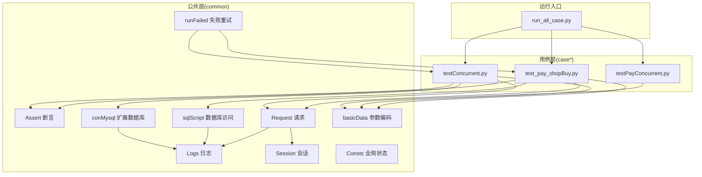
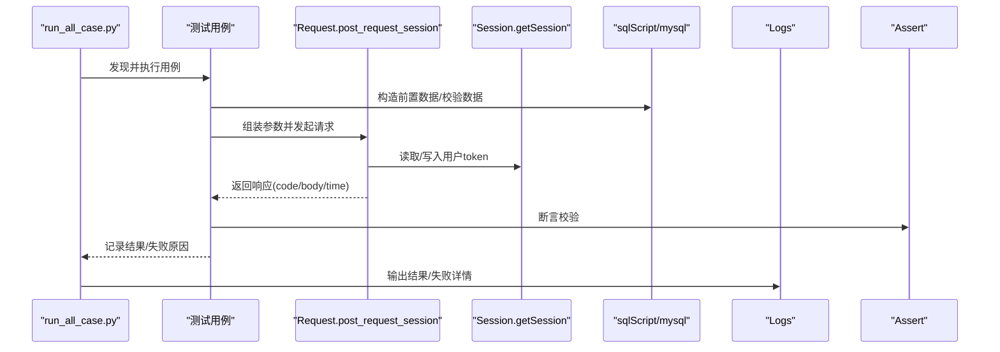
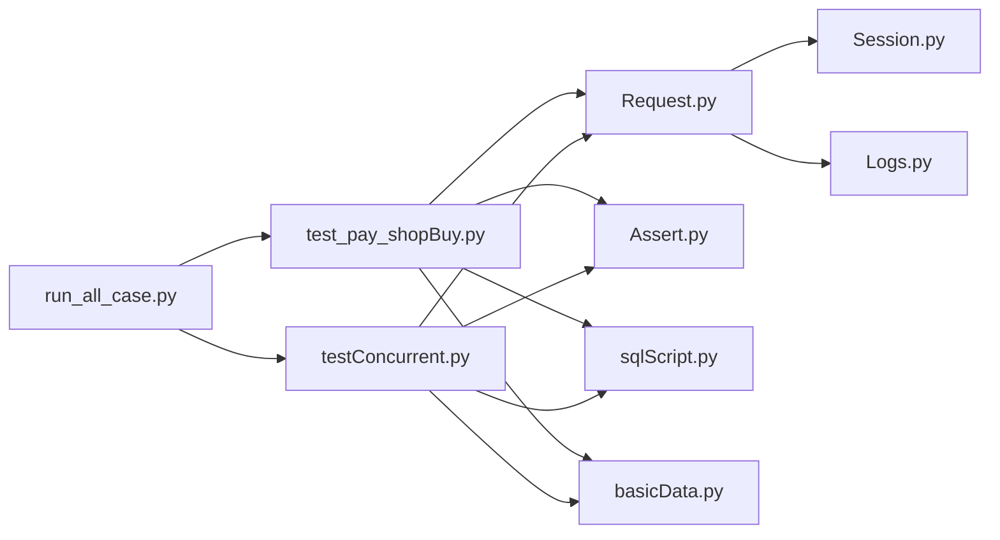
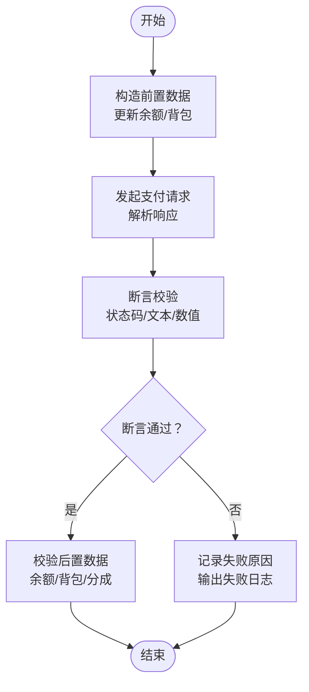

# 故障排除与调试

<cite>
**本文引用的文件**   
- [README.md](file://README.md)
- [requirements.txt](file://requirements.txt)
- [common/Logs.py](file://common/Logs.py)
- [common/Assert.py](file://common/Assert.py)
- [common/Request.py](file://common/Request.py)
- [common/Session.py](file://common/Session.py)
- [common/sqlScript.py](file://common/sqlScript.py)
- [common/conMysql.py](file://common/conMysql.py)
- [common/basicData.py](file://common/basicData.py)
- [common/runFailed.py](file://common/runFailed.py)
- [common/Consts.py](file://common/Consts.py)
- [run_all_case.py](file://run_all_case.py)
- [testConcurrent.py](file://testConcurrent.py)
- [testPayConcurrent.py](file://testPayConcurrent.py)
- [case/test_pay_shopBuy.py](file://case/test_pay_shopBuy.py)
</cite>

## 目录
1. [简介](#简介)
2. [项目结构](#项目结构)
3. [核心组件](#核心组件)
4. [架构总览](#架构总览)
5. [详细组件分析](#详细组件分析)
6. [依赖分析](#依赖分析)
7. [性能考虑](#性能考虑)
8. [故障排除指南](#故障排除指南)
9. [结论](#结论)
10. [附录](#附录)

## 简介
本指南面向QA支付测试自动化项目，聚焦于常见问题的诊断与解决，覆盖网络连接、数据库连接、测试用例失败、并发测试、性能瓶颈、日志系统使用、断言失败分析与测试数据验证策略，并提供问题报告标准格式与最佳实践。文档基于仓库现有代码进行深入分析，帮助测试工程师快速定位问题根因并高效修复。

## 项目结构
项目采用按功能域划分的模块化组织方式，核心目录与职责如下：
- common：公共基础能力，如日志、断言、请求封装、数据库操作、会话管理、失败重试、常量等
- case / caseOversea / caseSlp / caseStarify：各业务线的测试用例集合
- 根目录脚本：批量运行、并发测试、Web入口等

**图表来源**
- [run_all_case.py:126-147](file://run_all_case.py#L126-L147)
- [case/test_pay_shopBuy.py:13-42](file://case/test_pay_shopBuy.py#L13-L42)
- [testConcurrent.py:17-90](file://testConcurrent.py#L17-L90)
- [testPayConcurrent.py:9-46](file://testPayConcurrent.py#L9-L46)

**章节来源**
- [README.md:1-38](file://README.md#L1-L38)
- [requirements.txt:1-85](file://requirements.txt#L1-L85)

## 核心组件
- 日志系统：统一日志输出与轮转，支持控制台与文件双通道，便于问题定位与归档
- 请求封装：统一HTTP请求流程、超时处理、响应解析与耗时统计
- 会话管理：登录态获取与持久化，支持多环境与备用方案
- 数据库访问：集中式SQL封装，支持查询、更新、插入、删除与事务提交
- 断言封装：丰富断言方法，失败时记录原因并抛出异常
- 失败重试：装饰器级重试机制，支持类或方法级配置
- 并发测试：基于gevent的并发场景构造与结果校验

**章节来源**
- [common/Logs.py:8-47](file://common/Logs.py#L8-L47)
- [common/Request.py:17-59](file://common/Request.py#L17-L59)
- [common/Session.py:19-182](file://common/Session.py#L19-L182)
- [common/sqlScript.py:5-145](file://common/sqlScript.py#L5-L145)
- [common/conMysql.py:8-530](file://common/conMysql.py#L8-L530)
- [common/Assert.py:11-96](file://common/Assert.py#L11-L96)
- [common/runFailed.py:10-87](file://common/runFailed.py#L10-L87)
- [testConcurrent.py:17-281](file://testConcurrent.py#L17-L281)

## 架构总览
整体测试执行链路从入口脚本发现并运行用例，用例通过请求封装调用支付接口，断言校验返回值，数据库封装用于构造与验证前置/后置数据，日志系统贯穿全链路记录执行与错误信息；并发测试通过gevent并发触发请求并汇总结果。

**图表来源**
- [run_all_case.py:12-124](file://run_all_case.py#L12-L124)
- [case/test_pay_shopBuy.py:20-42](file://case/test_pay_shopBuy.py#L20-L42)
- [common/Request.py:17-59](file://common/Request.py#L17-L59)
- [common/Session.py:19-182](file://common/Session.py#L19-L182)
- [common/sqlScript.py:5-145](file://common/sqlScript.py#L5-L145)
- [common/Assert.py:11-96](file://common/Assert.py#L11-L96)
- [common/Logs.py:8-47](file://common/Logs.py#L8-L47)

## 详细组件分析

### 日志系统（Logs）
- 功能要点
  - 控制台与文件双通道输出，支持按天轮转
  - 可通过日志级别控制输出粒度
  - 统一格式包含时间、文件路径、行号、级别与消息
- 使用建议
  - 本地调试阶段可临时提升日志级别至DEBUG
  - 归档日志便于跨进程/跨节点问题复盘
- 常见问题
  - 日志路径不存在导致初始化失败
  - 文件权限不足导致写入失败
  - 日志轮转策略不当导致磁盘占用过高

**章节来源**
- [common/Logs.py:8-47](file://common/Logs.py#L8-L47)

### 请求封装（Request）
- 功能要点
  - 统一Header（含user-token）、HTTPS强制、关闭连接
  - 异常捕获与空响应返回，避免中断
  - 解析响应JSON并统计毫秒/秒级耗时
- 常见问题
  - 证书校验失败导致请求异常
  - 超时未设置或过短导致偶发失败
  - user-token缺失或过期导致鉴权失败
- 排查步骤
  - 打印响应状态码与body
  - 检查headers中user-token来源
  - 校验目标URL协议与域名

**章节来源**
- [common/Request.py:17-59](file://common/Request.py#L17-L59)

### 会话管理（Session）
- 功能要点
  - 支持多环境登录态获取，优先走登录接口，失败回退到token文件
  - token写入/读取文件，便于跨进程复用
- 常见问题
  - 登录接口不可用或返回异常
  - token文件为空或被清理
  - 环境配置错误导致登录URL或参数不匹配
- 排查步骤
  - 检查登录接口返回结构与success字段
  - 校验token文件存在且非空
  - 对比环境配置与实际URL

**章节来源**
- [common/Session.py:19-182](file://common/Session.py#L19-L182)

### 数据库访问（sqlScript 与 conMysql）
- 功能要点
  - 集中式连接与SQL封装，支持更新、查询、插入、删除
  - 自动提交与异常回滚，保证数据一致性
- 常见问题
  - 连接超时或数据库不可达
  - SQL执行异常或返回空
  - 事务未提交导致读取脏数据
- 排查步骤
  - 检查数据库地址、端口、账号密码
  - 校验表名与字段是否存在
  - 确认autocommit与commit时机

**章节来源**
- [common/sqlScript.py:5-145](file://common/sqlScript.py#L5-L145)
- [common/conMysql.py:8-530](file://common/conMysql.py#L8-L530)

### 断言封装（Assert）
- 功能要点
  - 提供状态码、长度、相等性、文本包含、区间等多种断言
  - 失败时记录失败原因并抛出异常
- 常见问题
  - 期望值与实际值差异较大
  - 文本断言忽略编码或大小写
  - 区间断言边界值错误
- 排查步骤
  - 打印实际与期望值
  - 校验断言输入类型与范围
  - 结合日志与数据库快照定位

**章节来源**
- [common/Assert.py:11-96](file://common/Assert.py#L11-L96)

### 失败重试（runFailed）
- 功能要点
  - 装饰器支持类/方法级配置，可设定最大重试次数与前缀过滤
  - 捕获异常后执行setUp/tearDown并重试
- 常见问题
  - 重试次数过多导致测试时间过长
  - 非幂等接口重试引发副作用
- 排查步骤
  - 明确接口是否幂等
  - 合理设置max_n与func_prefix
  - 记录重试堆栈便于定位根因

**章节来源**
- [common/runFailed.py:10-87](file://common/runFailed.py#L10-L87)

### 并发测试（testConcurrent 与 testPayConcurrent）
- 功能要点
  - 基于gevent并发触发支付/赠送/使用等场景
  - 通过全局计数器与断言校验并发一致性
- 常见问题
  - 并发冲突导致余额/库存不一致
  - 线程同步不当造成结果抖动
  - 资源竞争引发数据库锁等待
- 排查步骤
  - 降低并发度验证稳定性
  - 加强前置/后置数据校验
  - 关注数据库锁与事务隔离级别

**章节来源**
- [testConcurrent.py:17-281](file://testConcurrent.py#L17-L281)
- [testPayConcurrent.py:9-46](file://testPayConcurrent.py#L9-L46)

## 依赖分析
- 外部依赖
  - requests、PyMySQL、gevent、pytest、allure等
- 内部依赖
  - 用例依赖Request、Assert、sqlScript/conMysql、basicData、Session
  - run_all_case负责用例发现与结果汇总

**图表来源**
- [requirements.txt:1-85](file://requirements.txt#L1-L85)
- [run_all_case.py:126-147](file://run_all_case.py#L126-L147)
- [case/test_pay_shopBuy.py:13-42](file://case/test_pay_shopBuy.py#L13-L42)
- [testConcurrent.py:17-90](file://testConcurrent.py#L17-L90)

**章节来源**
- [requirements.txt:1-85](file://requirements.txt#L1-L85)

## 性能考虑
- 网络性能
  - 合理设置超时与重试，避免阻塞
  - 使用连接池减少握手开销（当前Request已关闭连接，可评估是否开启keep-alive）
- 数据库性能
  - 批量更新/查询时注意索引与事务提交
  - 避免热点表/行锁争用，必要时拆分并发场景
- 并发性能
  - 降低初始并发度，逐步扩容
  - 关注数据库锁与队列积压
- 日志性能
  - 生产环境建议INFO级别，避免过多DEBUG
  - 文件轮转策略避免IO抖动

[本节为通用指导，无需具体文件分析]

## 故障排除指南

### 一、网络连接问题
- 症状
  - 请求异常、超时、证书校验失败
- 诊断步骤
  - 检查目标URL与协议（HTTPS）
  - 校验user-token是否有效
  - 使用抓包工具确认DNS与TLS握手
- 解决方案
  - 更新证书信任或禁用校验（仅限测试）
  - 修正登录流程或回退到备用token
  - 调整超时与重试策略

**章节来源**
- [common/Request.py:17-59](file://common/Request.py#L17-L59)
- [common/Session.py:19-182](file://common/Session.py#L19-L182)

### 二、数据库连接异常
- 症状
  - 连接超时、认证失败、SQL执行报错
- 诊断步骤
  - 校验数据库地址、端口、账号、密码
  - 检查表/字段是否存在
  - 查看事务是否正确提交
- 解决方案
  - 修正连接参数
  - 补充缺失表/索引
  - 确保异常时回滚并提交

**章节来源**
- [common/sqlScript.py:5-145](file://common/sqlScript.py#L5-L145)
- [common/conMysql.py:8-530](file://common/conMysql.py#L8-L530)

### 三、测试用例失败
- 症状
  - 断言失败、返回值异常、数据不一致
- 诊断步骤
  - 打印实际与期望值
  - 校验前置数据是否正确
  - 结合日志与数据库快照定位
- 解决方案
  - 修正断言条件或期望值
  - 优化前置数据构造
  - 必要时启用失败重试

**章节来源**
- [common/Assert.py:11-96](file://common/Assert.py#L11-L96)
- [common/runFailed.py:10-87](file://common/runFailed.py#L10-L87)
- [case/test_pay_shopBuy.py:20-124](file://case/test_pay_shopBuy.py#L20-L124)

### 四、并发测试问题
- 症状
  - 余额/库存不一致、结果抖动
- 诊断步骤
  - 降低并发度验证稳定性
  - 加强前后置数据校验
  - 关注数据库锁与事务隔离
- 解决方案
  - 分批并发或串行关键步骤
  - 使用幂等接口与补偿机制
  - 优化数据库索引与事务粒度

**章节来源**
- [testConcurrent.py:17-281](file://testConcurrent.py#L17-L281)

### 五、日志系统使用
- 日志级别
  - 开发调试：DEBUG/INFO
  - 生产观察：INFO/WARNING/ERROR
- 日志分析技巧
  - 关键路径打点（请求开始/结束、断言前后）
  - 结合时间戳与线程/协程ID定位并发问题
- 调试信息提取
  - 提取响应状态码、body、耗时
  - 记录数据库变更前后对比

**章节来源**
- [common/Logs.py:8-47](file://common/Logs.py#L8-L47)

### 六、断言失败分析与测试数据验证
- 断言失败分析
  - 区分状态码、长度、相等性、文本包含、区间断言
  - 记录失败原因并输出到失败日志
- 测试数据验证策略
  - 前置：构造最小化数据集
  - 中置：实时校验中间态
  - 后置：最终一致性校验

**章节来源**
- [common/Assert.py:11-96](file://common/Assert.py#L11-L96)
- [common/sqlScript.py:5-145](file://common/sqlScript.py#L5-L145)

### 七、性能瓶颈识别与优化
- 识别方法
  - 关注请求耗时分布（毫秒/秒级）
  - 观察数据库慢查询与锁等待
  - 并发场景下CPU/内存/IO占用
- 优化建议
  - 减少无效请求与重复校验
  - 合理批量与事务拆分
  - 降低并发度或引入排队机制

**章节来源**
- [common/Request.py:48-59](file://common/Request.py#L48-L59)

### 八、调试工具与监控指标
- 调试工具
  - 抓包工具（Wireshark/Charles/Fiddler）
  - 数据库客户端（Navicat/MySQL Workbench）
  - 并发分析（gevent监控、线程dump）
- 监控指标
  - 请求成功率、P95/P99耗时
  - 数据库连接数、慢查询数
  - 并发任务完成率与失败率

[本节为通用指导，无需具体文件分析]

### 九、问题报告标准格式与最佳实践
- 问题报告模板
  - 标题：简明描述问题
  - 环境：操作系统、Python版本、依赖版本
  - 步骤：最小可复现步骤
  - 期望：期望结果
  - 实际：实际结果与日志片段
  - 附件：日志文件、截图、抓包文件
- 最佳实践
  - 优先使用最小化数据与参数
  - 在失败重试后仍失败才提单
  - 附带失败用例名称与执行时间

[本节为通用指导，无需具体文件分析]

## 结论
本指南基于仓库现有代码，梳理了日志、请求、会话、数据库、断言、重试与并发等关键组件的故障排除方法与调试技巧。建议在日常测试中遵循“先日志、再网络、后数据库”的排查顺序，结合失败重试与最小化复现，快速定位并解决问题。对于并发与性能问题，应从接口幂等性、数据库锁与事务粒度入手，逐步优化。

[本节为总结性内容，无需具体文件分析]

## 附录

### A. 常用命令与入口
- 批量运行入口
  - run_all_case.py：按应用选择用例目录并执行
- 并发测试入口
  - testConcurrent.py：构造多场景并发
  - testPayConcurrent.py：外部接口并发压力测试

**章节来源**
- [run_all_case.py:126-147](file://run_all_case.py#L126-L147)
- [testConcurrent.py:266-281](file://testConcurrent.py#L266-L281)
- [testPayConcurrent.py:44-47](file://testPayConcurrent.py#L44-L47)

### B. 关键流程图：用例执行与断言

**图表来源**
- [case/test_pay_shopBuy.py:20-124](file://case/test_pay_shopBuy.py#L20-L124)
- [common/Assert.py:11-96](file://common/Assert.py#L11-L96)
- [common/sqlScript.py:5-145](file://common/sqlScript.py#L5-L145)