# MySQL连接管理

<cite>
**本文档引用的文件**
- [conMysql.py](file://common/conMysql.py)
- [conPtMysql.py](file://common/conPtMysql.py)
- [conSlpMysql.py](file://common/conSlpMysql.py)
- [conStarifyMysql.py](file://common/conStarifyMysql.py)
- [Config.py](file://common/Config.py)
- [test_pay_business.py](file://case/test_pay_business.py)
- [test_pt_bean.py](file://caseOversea/test_pt_bean.py)
- [sqlScript.py](file://common/sqlScript.py)
- [config_dev.php](file://others/config_dev.php)
</cite>

## 目录
1. [简介](#简介)
2. [项目结构](#项目结构)
3. [核心组件](#核心组件)
4. [架构概览](#架构概览)
5. [详细组件分析](#详细组件分析)
6. [依赖关系分析](#依赖关系分析)
7. [性能考虑](#性能考虑)
8. [故障排除指南](#故障排除指南)
9. [结论](#结论)

## 简介

本文档详细介绍了QA支付测试自动化项目中的MySQL连接管理功能。该项目实现了多平台数据库连接架构，支持国内平台、PT海外平台、不夜星球平台和Starify平台的数据库连接管理。每个平台都有独立的连接配置和管理机制，确保测试环境的稳定性和可靠性。

## 项目结构

项目采用模块化设计，将不同平台的数据库连接管理分离到独立的Python文件中：

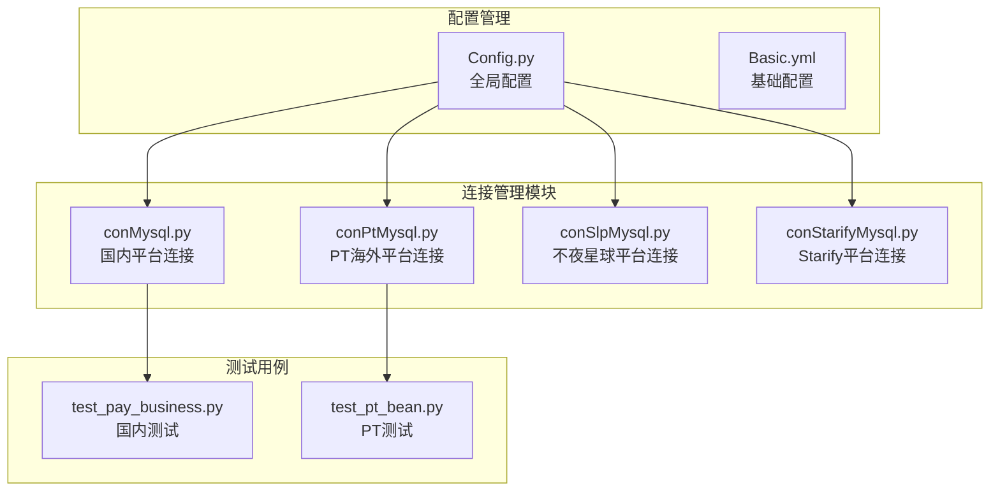

**图表来源**
- [conMysql.py:1-530](file://common/conMysql.py#L1-L530)
- [conPtMysql.py:1-345](file://common/conPtMysql.py#L1-L345)
- [conSlpMysql.py:1-680](file://common/conSlpMysql.py#L1-L680)
- [conStarifyMysql.py:1-148](file://common/conStarifyMysql.py#L1-L148)

**章节来源**
- [conMysql.py:1-530](file://common/conMysql.py#L1-L530)
- [conPtMysql.py:1-345](file://common/conPtMysql.py#L1-L345)
- [conSlpMysql.py:1-680](file://common/conSlpMysql.py#L1-L680)
- [conStarifyMysql.py:1-148](file://common/conStarifyMysql.py#L1-L148)

## 核心组件

### 连接管理类架构

所有平台都采用了相似的连接管理架构模式：

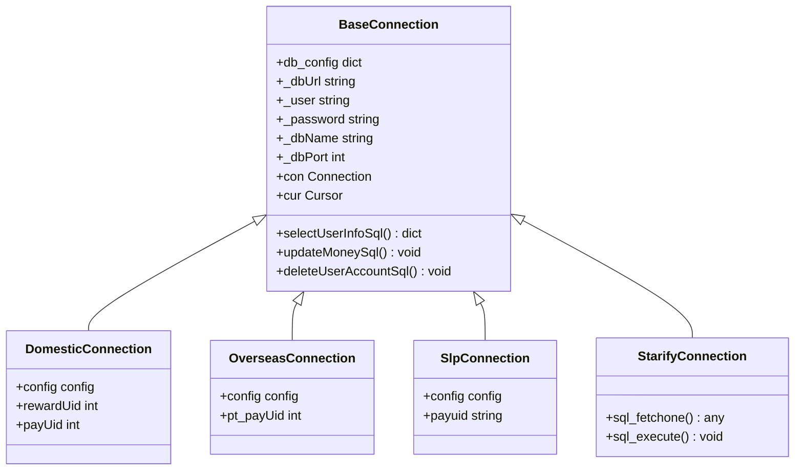

**图表来源**
- [conMysql.py:8-530](file://common/conMysql.py#L8-L530)
- [conPtMysql.py:6-345](file://common/conPtMysql.py#L6-L345)
- [conSlpMysql.py:8-680](file://common/conSlpMysql.py#L8-L680)
- [conStarifyMysql.py:6-148](file://common/conStarifyMysql.py#L6-L148)

### 数据库连接初始化流程

每个连接类都遵循相同的初始化流程：

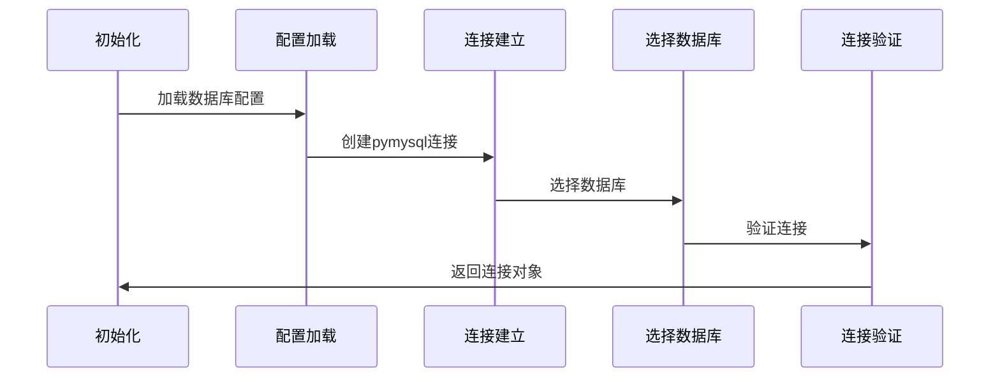

**图表来源**
- [conMysql.py:17-25](file://common/conMysql.py#L17-L25)
- [conPtMysql.py:15-23](file://common/conPtMysql.py#L15-L23)
- [conSlpMysql.py:19-27](file://common/conSlpMysql.py#L19-L27)
- [conStarifyMysql.py:17-25](file://common/conStarifyMysql.py#L17-L25)

**章节来源**
- [conMysql.py:17-25](file://common/conMysql.py#L17-L25)
- [conPtMysql.py:15-23](file://common/conPtMysql.py#L15-L23)
- [conSlpMysql.py:19-27](file://common/conSlpMysql.py#L19-L27)
- [conStarifyMysql.py:17-25](file://common/conStarifyMysql.py#L17-L25)

## 架构概览

### 多平台连接架构

项目实现了四个独立的数据库连接管理模块，每个模块针对特定平台进行了优化：

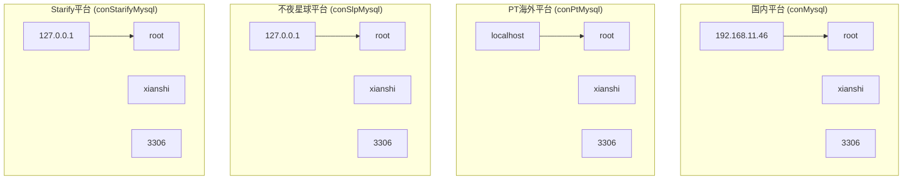

**图表来源**
- [conMysql.py:9-16](file://common/conMysql.py#L9-L16)
- [conPtMysql.py:7-14](file://common/conPtMysql.py#L7-L14)
- [conSlpMysql.py:9-18](file://common/conSlpMysql.py#L9-L18)
- [conStarifyMysql.py:7-16](file://common/conStarifyMysql.py#L7-L16)

### 连接参数配置

每个平台的连接参数配置如下：

| 平台 | 主机地址 | 用户名 | 密码 | 数据库名 | 端口 |
|------|----------|--------|------|----------|------|
| 国内平台 | 192.168.11.46 | root | 123456 | xianshi | 3306 |
| PT海外平台 | localhost | root | 123456 | xianshi | 3306 |
| 不夜星球平台 | 127.0.0.1 | root | root | xianshi | 3306 |
| Starify平台 | 127.0.0.1 | root | root | xianshi | 3306 |

**章节来源**
- [conMysql.py:9-16](file://common/conMysql.py#L9-L16)
- [conPtMysql.py:7-14](file://common/conPtMysql.py#L7-L14)
- [conSlpMysql.py:9-18](file://common/conSlpMysql.py#L9-L18)
- [conStarifyMysql.py:7-16](file://common/conStarifyMysql.py#L7-L16)

## 详细组件分析

### 国内平台连接管理 (conMysql)

国内平台连接管理是最复杂的模块，提供了全面的数据库操作功能：

#### 核心功能特性

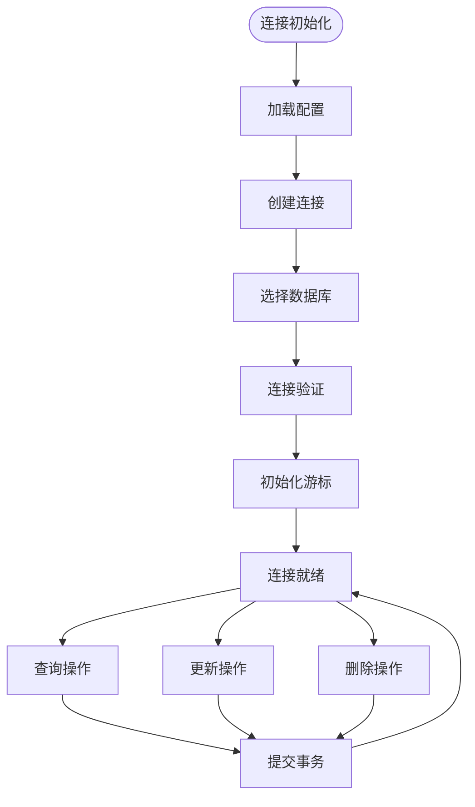

**图表来源**
- [conMysql.py:17-25](file://common/conMysql.py#L17-L25)

#### 查询功能实现

国内平台提供了丰富的查询功能，支持多种账户类型的查询：

| 查询类型 | 功能描述 | 表名 |
|----------|----------|------|
| bean | 查询用户金豆余额 | xs_user_money_extend |
| cash | 查询用户现金余额 | xs_user_money_extend |
| sum_money | 查询用户总余额 | xs_user_money |
| single_money | 查询用户指定账户余额 | xs_user_money |
| sum_commodity | 查询用户背包物品总数 | xs_user_commodity |
| num_commodity | 查询用户指定物品数量 | xs_user_commodity |
| pay_room_money | 查询用户VIP经验值 | xs_user_profile |
| popularity | 查询用户人气值 | xs_user_popularity |
| relation_id | 查询守护关系ID | xs_relation_defend |

**章节来源**
- [conMysql.py:28-204](file://common/conMysql.py#L28-L204)

#### 数据操作功能

国内平台支持完整的CRUD操作：

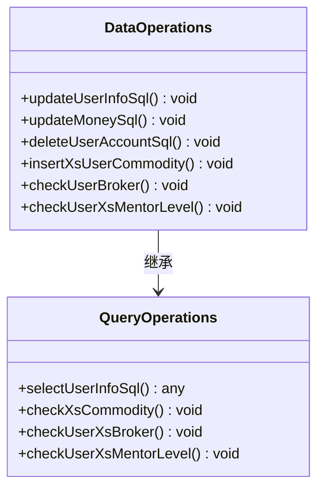

**图表来源**
- [conMysql.py:275-530](file://common/conMysql.py#L275-L530)

**章节来源**
- [conMysql.py:275-530](file://common/conMysql.py#L275-L530)

### PT海外平台连接管理 (conPtMysql)

PT平台连接管理相对简化，专注于海外用户的业务需求：

#### 特殊配置要求

PT平台具有独特的配置特点：

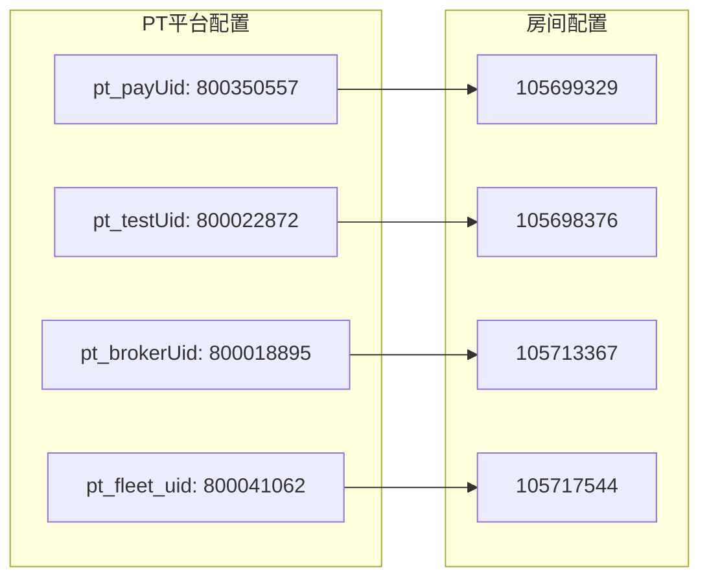

**图表来源**
- [conPtMysql.py:96-120](file://common/conPtMysql.py#L96-L120)

#### 查询功能差异

PT平台的查询功能与国内平台存在显著差异：

| 查询类型 | 国内平台 | PT平台 | 差异说明 |
|----------|----------|--------|----------|
| sum_money | 计算四种货币总和 | 计算四种货币总和 | 相同 |
| single_money | 支持自定义货币类型 | 支持money_cash_personal | PT平台特有 |
| pay_change | 解析JSON格式 | 直接查询金额 | 数据结构不同 |
| commodity | 查询背包物品 | 查询欢乐券数量 | 功能范围不同 |

**章节来源**
- [conPtMysql.py:27-93](file://common/conPtMysql.py#L27-L93)

### 不夜星球平台连接管理 (conSlpMysql)

不夜星球平台连接管理提供了最全面的功能集：

#### 高级功能特性

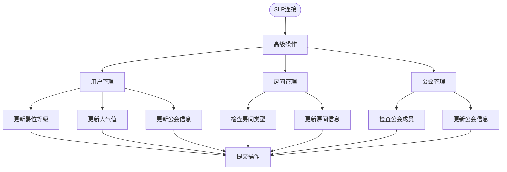

**图表来源**
- [conSlpMysql.py:325-410](file://common/conSlpMysql.py#L325-L410)

#### 特殊查询功能

SLP平台提供了独特的查询功能：

| 查询类型 | 功能描述 | 表名 |
|----------|----------|------|
| growth | 查询用户成长值 | xs_user_title_new |
| relation_id | 查询守护关系ID | xs_relation_defend |
| relation_config | 查询守护关系配置 | xs_relation_config |
| union | 查询联盟房间 | xs_chatroom |
| vip | 查询VIP房间 | xs_chatroom |
| pay_change | 解析支付变更记录 | xs_pay_change |

**章节来源**
- [conSlpMysql.py:31-226](file://common/conSlpMysql.py#L31-L226)

### Starify平台连接管理 (conStarifyMysql)

Starify平台连接管理最为简洁，专注于核心功能：

#### 最小化设计原则

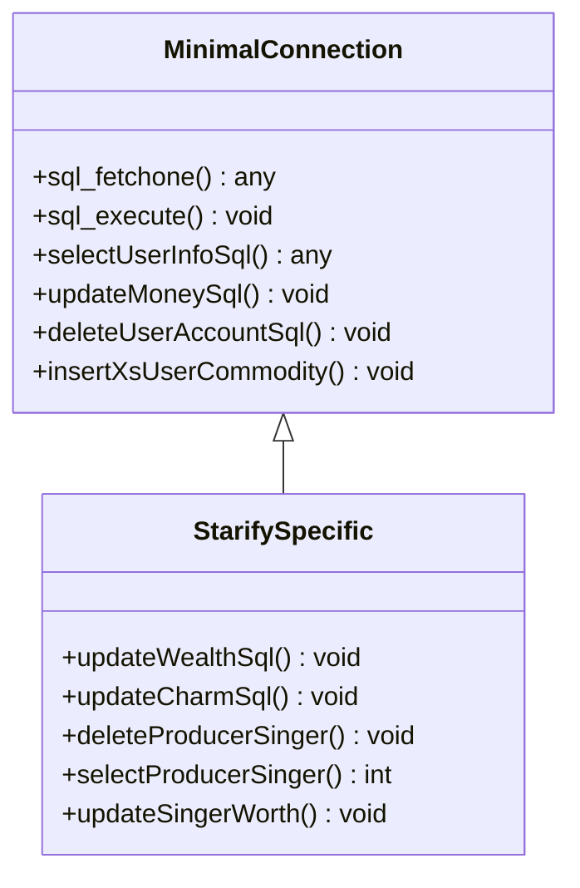

**图表来源**
- [conStarifyMysql.py:27-143](file://common/conStarifyMysql.py#L27-L143)

#### Starify专用功能

Starify平台提供了独特的功能：

| 功能类型 | 方法名 | 描述 |
|----------|--------|------|
| 财富管理 | updateWealthSql | 更新用户财富值 |
| 魅力管理 | updateCharmSql | 更新用户魅力值 |
| 制作人管理 | deleteProducerSinger | 清除制作人关系 |
| 歌手统计 | selectProducerSinger | 统计已签约歌手 |
| 身价管理 | updateSingerWorth | 修改歌手身价 |

**章节来源**
- [conStarifyMysql.py:78-143](file://common/conStarifyMysql.py#L78-L143)

## 依赖关系分析

### 模块间依赖关系

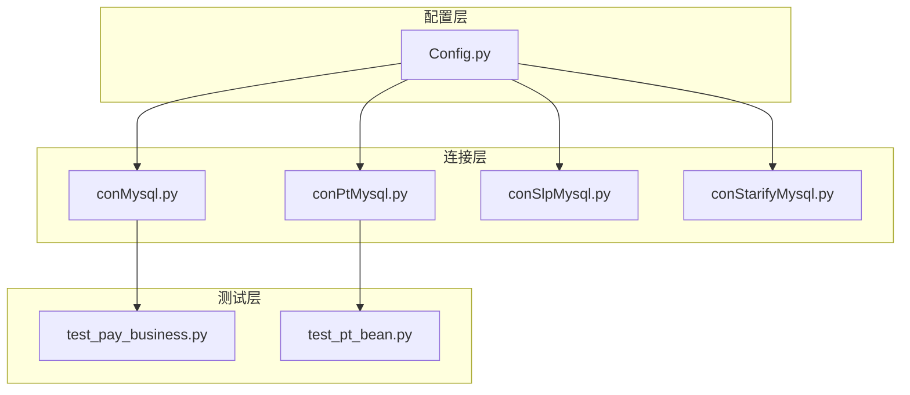

**图表来源**
- [Config.py:6-133](file://common/Config.py#L6-L133)
- [test_pay_business.py:1-10](file://case/test_pay_business.py#L1-L10)
- [test_pt_bean.py:1-9](file://caseOversea/test_pt_bean.py#L1-L9)

### 外部依赖分析

项目主要依赖以下外部库：

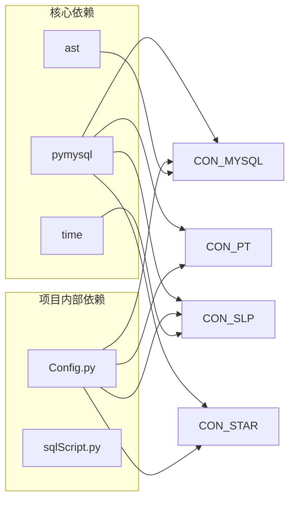

**图表来源**
- [conMysql.py:2](file://common/conMysql.py#L2)
- [conSlpMysql.py:2](file://common/conSlpMysql.py#L2)
- [conStarifyMysql.py:2](file://common/conStarifyMysql.py#L2)

**章节来源**
- [conMysql.py:2-5](file://common/conMysql.py#L2-L5)
- [conPtMysql.py:2-3](file://common/conPtMysql.py#L2-L3)
- [conSlpMysql.py:2-5](file://common/conSlpMysql.py#L2-L5)
- [conStarifyMysql.py:2-3](file://common/conStarifyMysql.py#L2-L3)

## 性能考虑

### 连接池优化策略

当前实现采用的是简单连接模式，每个连接类在导入时就建立了数据库连接。这种设计的优势在于：

1. **简化部署**：无需额外的连接池配置
2. **内存效率**：避免了连接池的额外开销
3. **易于调试**：连接状态清晰可见

### 性能优化建议

针对大规模测试场景，建议考虑以下优化：

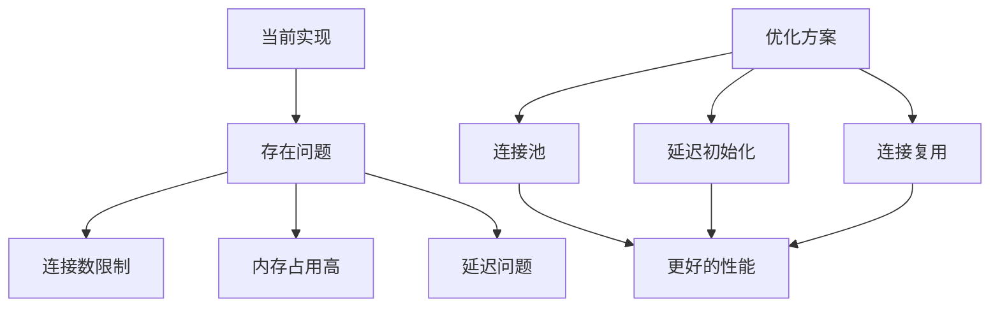

### 错误处理机制

各平台都实现了完善的错误处理机制：

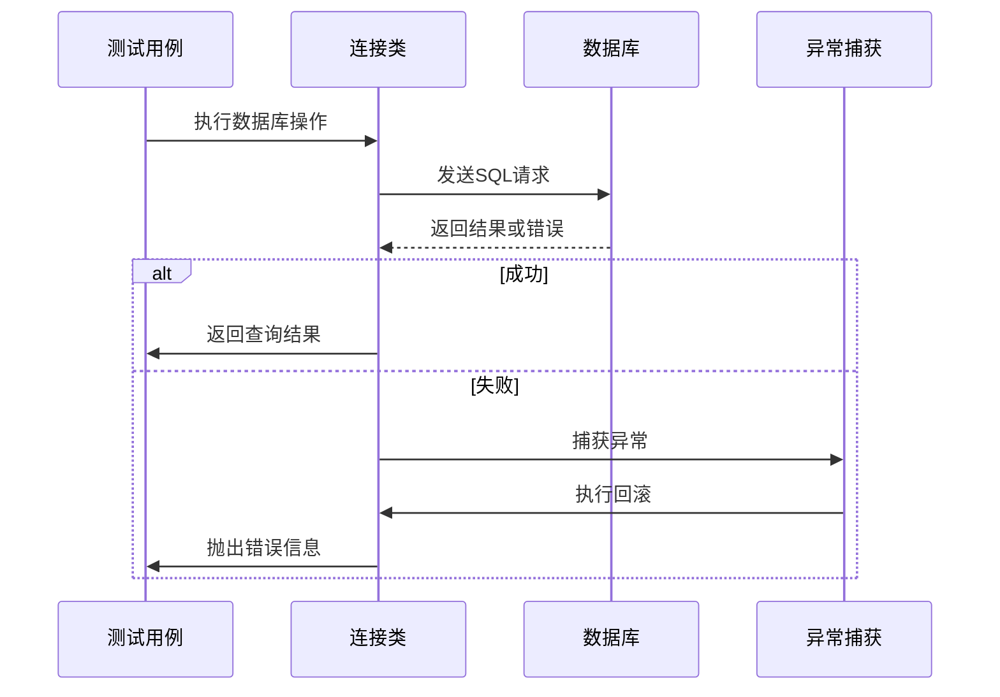

**图表来源**
- [conMysql.py:39-41](file://common/conMysql.py#L39-L41)
- [conPtMysql.py:99-104](file://common/conPtMysql.py#L99-L104)
- [conSlpMysql.py:234-237](file://common/conSlpMysql.py#L234-L237)
- [conStarifyMysql.py:47-51](file://common/conStarifyMysql.py#L47-L51)

## 故障排除指南

### 常见连接问题

#### 连接超时问题

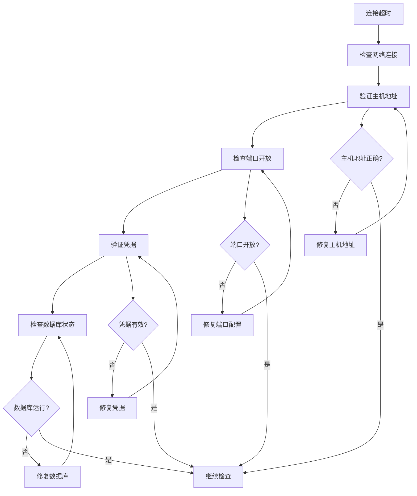

#### 数据库连接验证

各平台都实现了连接验证机制：

**章节来源**
- [conMysql.py:24](file://common/conMysql.py#L24)
- [conPtMysql.py:22](file://common/conPtMysql.py#L22)
- [conSlpMysql.py:26](file://common/conSlpMysql.py#L26)
- [conStarifyMysql.py:24](file://common/conStarifyMysql.py#L24)

### SSL连接支持

当前实现未包含SSL连接支持。如需启用SSL连接，建议：

1. **安装SSL证书**：确保数据库服务器配置了有效的SSL证书
2. **修改连接参数**：添加SSL相关参数到连接配置
3. **安全传输**：确保敏感数据通过加密通道传输

### 连接超时设置

建议在生产环境中设置合理的连接超时参数：

```python
# 示例：设置连接超时
pymysql.connect(
    host=host,
    port=port,
    user=user,
    passwd=password,
    charset='utf8',
    autocommit=True,
    connect_timeout=30,  # 连接超时时间
    read_timeout=60,     # 读取超时时间
    write_timeout=60     # 写入超时时间
)
```

## 结论

本项目成功实现了多平台MySQL连接管理架构，为QA支付测试自动化提供了稳定可靠的数据库支持。各平台连接管理模块具有以下特点：

### 设计优势

1. **模块化设计**：每个平台独立的连接管理模块，便于维护和扩展
2. **统一接口**：相同的方法命名约定，降低了学习成本
3. **完善的错误处理**：每种操作都包含了相应的异常处理机制
4. **灵活的配置**：支持不同平台的特殊配置需求

### 技术特色

1. **国内平台**：功能最全面，支持复杂的业务场景
2. **PT海外平台**：针对海外用户优化，支持多语言配置
3. **不夜星球平台**：提供独特的社交功能支持
4. **Starify平台**：专注于音乐相关内容的管理

### 改进建议

1. **连接池优化**：考虑引入连接池以提高性能
2. **SSL支持**：增强数据库连接的安全性
3. **监控机制**：添加连接状态监控和日志记录
4. **配置管理**：统一管理所有平台的数据库配置

该架构为后续的功能扩展和维护奠定了良好的基础，能够满足不同平台的测试需求。