# MySQL连接管理

<cite>
**本文档引用的文件**
- [conMysql.py](file://common/conMysql.py)
- [conPtMysql.py](file://common/conPtMysql.py)
- [conSlpMysql.py](file://common/conSlpMysql.py)
- [conStarifyMysql.py](file://common/conStarifyMysql.py)
- [Config.py](file://common/Config.py)
- [sqlScript.py](file://common/sqlScript.py)
- [test_pay_business.py](file://case/test_pay_business.py)
- [test_pt_bean.py](file://caseOversea/test_pt_bean.py)
- [config_dev.php](file://others/config_dev.php)
</cite>

## 更新摘要
**变更内容**
- 对 conPtMysql.py 进行了重大代码优化，包括添加类型注解、改进方法文档、增强 SQL 查询格式化
- 提升了代码质量和可维护性，增强了类型安全性和代码可读性
- 保持了统一的连接管理架构，继续支持国内平台、PT海外平台、不夜星球平台和Starify平台

## 目录
1. [简介](#简介)
2. [项目结构](#项目结构)
3. [核心组件](#核心组件)
4. [架构概览](#架构概览)
5. [详细组件分析](#详细组件分析)
6. [依赖关系分析](#依赖关系分析)
7. [性能考虑](#性能考虑)
8. [故障排除指南](#故障排除指南)
9. [结论](#结论)

## 简介

本文档详细介绍了QA支付测试自动化项目中的MySQL连接管理功能。该项目实现了统一的MySQL连接管理架构，支持国内平台、PT海外平台、不夜星球平台和Starify平台的数据库连接管理。新架构通过统一的连接管理器提供自动重连和连接池管理功能，替代了原有的分散连接处理方式，确保测试环境的稳定性和可靠性。

**更新** 最新版本对 PT 平台连接管理器进行了重大代码优化，显著提升了代码质量和可维护性。

## 项目结构

项目采用统一模块化设计，将不同平台的数据库连接管理整合到统一的连接管理框架中：

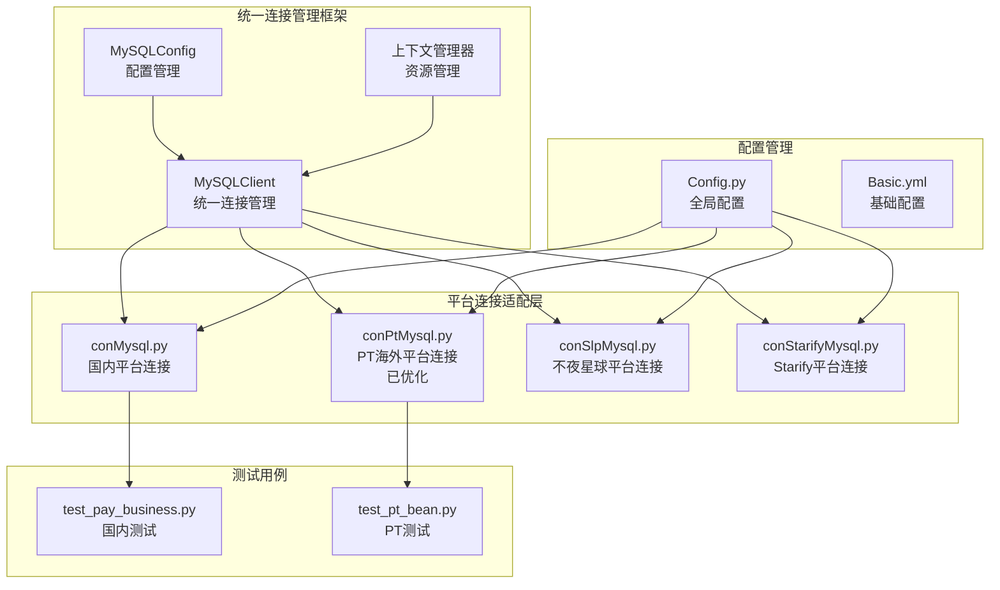

**图表来源**
- [sqlScript.py:26-91](file://common/sqlScript.py#L26-L91)
- [conMysql.py:8-530](file://common/conMysql.py#L8-L530)
- [conPtMysql.py:22-367](file://common/conPtMysql.py#L22-L367)
- [conSlpMysql.py:8-680](file://common/conSlpMysql.py#L8-L680)
- [conStarifyMysql.py:22-170](file://common/conStarifyMysql.py#L22-L170)

**章节来源**
- [sqlScript.py:26-91](file://common/sqlScript.py#L26-L91)
- [conMysql.py:8-530](file://common/conMysql.py#L8-L530)
- [conPtMysql.py:22-367](file://common/conPtMysql.py#L22-L367)
- [conSlpMysql.py:8-680](file://common/conSlpMysql.py#L8-L680)
- [conStarifyMysql.py:22-170](file://common/conStarifyMysql.py#L22-L170)

## 核心组件

### 统一连接管理架构

新架构引入了统一的连接管理器，提供自动重连和连接池管理功能：

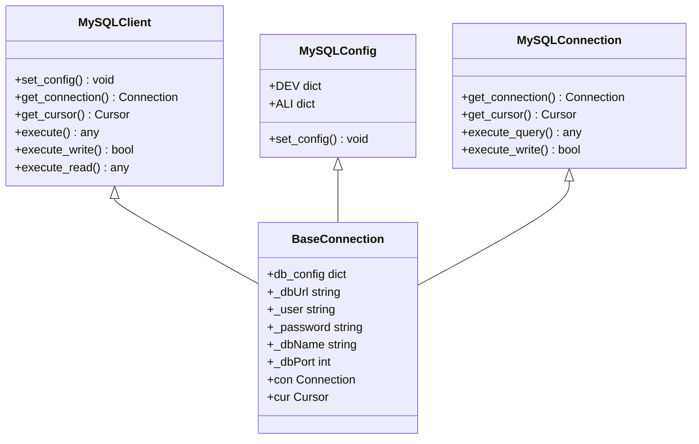

**图表来源**
- [sqlScript.py:26-91](file://common/sqlScript.py#L26-L91)
- [conMysql.py:8-530](file://common/conMysql.py#L8-L530)
- [conPtMysql.py:22-367](file://common/conPtMysql.py#L22-L367)
- [conStarifyMysql.py:22-170](file://common/conStarifyMysql.py#L22-L170)

### 数据库连接初始化流程

统一架构下的连接初始化流程更加标准化：

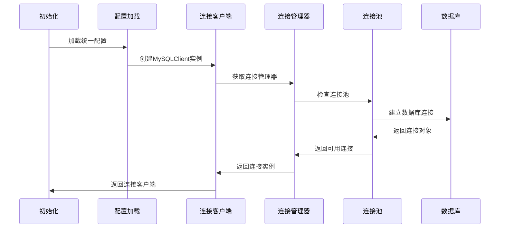

**图表来源**
- [sqlScript.py:36-44](file://common/sqlScript.py#L36-L44)
- [conPtMysql.py:29-43](file://common/conPtMysql.py#L29-L43)
- [conStarifyMysql.py:30-36](file://common/conStarifyMysql.py#L30-L36)

**章节来源**
- [sqlScript.py:36-44](file://common/sqlScript.py#L36-L44)
- [conPtMysql.py:29-43](file://common/conPtMysql.py#L29-L43)
- [conStarifyMysql.py:30-36](file://common/conStarifyMysql.py#L30-L36)

## 架构概览

### 统一连接管理架构

新架构实现了统一的连接管理，支持自动重连和连接池管理：

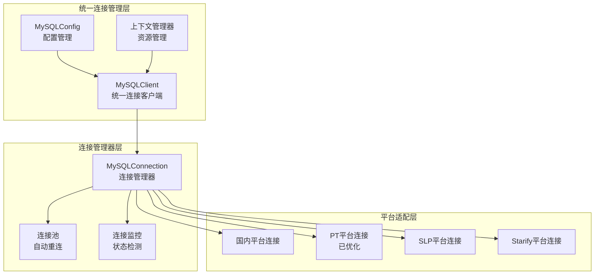

**图表来源**
- [sqlScript.py:26-91](file://common/sqlScript.py#L26-L91)
- [conPtMysql.py:22-71](file://common/conPtMysql.py#L22-L71)
- [conStarifyMysql.py:22-71](file://common/conStarifyMysql.py#L22-L71)

### 连接参数配置

统一配置管理提供了更灵活的配置选项：

| 配置类型 | 开发环境 | 生产环境 | 特性 |
|----------|----------|----------|------|
| 主机地址 | 192.168.11.46 | rm-bp1nfl3dp096d5o39.mysql.rds.aliyuncs.com | 支持切换 |
| 用户名 | root | super | 环境隔离 |
| 密码 | 123456 | dev123456 | 安全管理 |
| 数据库名 | xianshi | xianshi | 统一管理 |
| 端口 | 3306 | 3306 | 标准化 |

**章节来源**
- [sqlScript.py:6-24](file://common/sqlScript.py#L6-L24)
- [conPtMysql.py:11-19](file://common/conPtMysql.py#L11-L19)
- [conStarifyMysql.py:11-19](file://common/conStarifyMysql.py#L11-L19)

## 详细组件分析

### 统一MySQL客户端 (MySQLClient)

统一客户端提供了标准化的数据库操作接口：

#### 核心功能特性

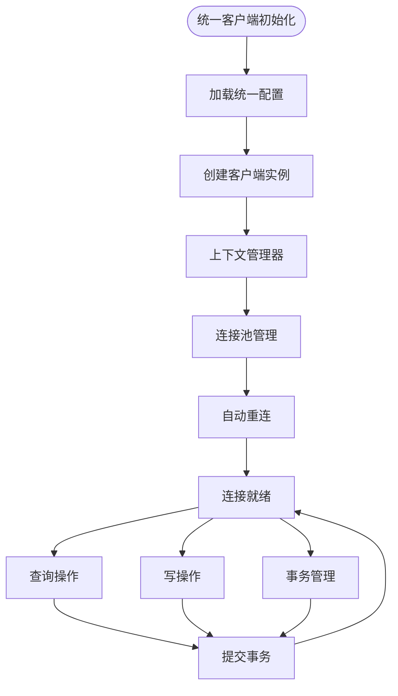

**图表来源**
- [sqlScript.py:26-91](file://common/sqlScript.py#L26-L91)

#### 配置管理功能

统一客户端支持动态配置切换：

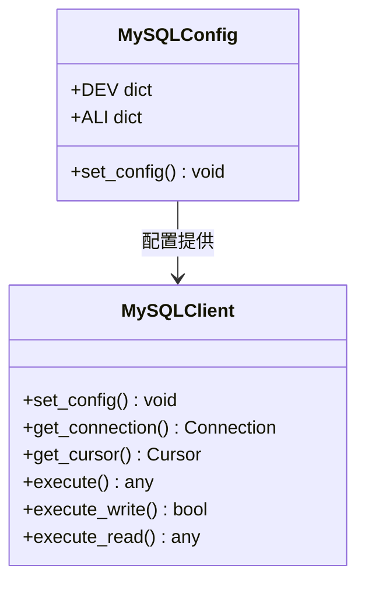

**图表来源**
- [sqlScript.py:6-91](file://common/sqlScript.py#L6-L91)

**章节来源**
- [sqlScript.py:6-91](file://common/sqlScript.py#L6-L91)

### 平台连接管理器 (MySQLConnection)

平台适配层提供了针对不同平台的连接管理：

#### 特殊配置要求

平台连接管理器针对不同平台的特殊需求：

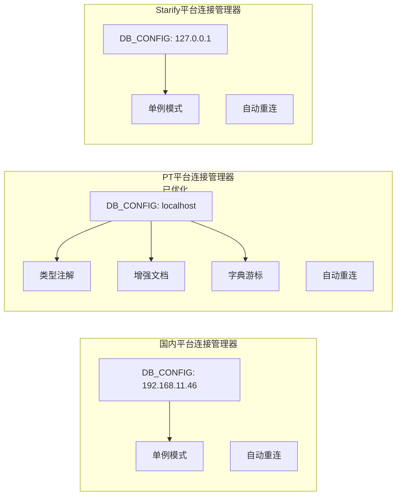

**图表来源**
- [conPtMysql.py:11-44](file://common/conPtMysql.py#L11-L44)
- [conStarifyMysql.py:11-44](file://common/conStarifyMysql.py#L11-L44)

#### 连接池管理差异

不同平台的连接池管理策略：

| 平台 | 连接池类型 | 单例模式 | 自动重连 | 字典游标 | 类型注解 |
|------|------------|----------|----------|----------|----------|
| 国内平台 | 简单连接 | 否 | 是 | 否 | 否 |
| PT平台 | 类变量缓存 | 否 | 是 | 是 | 是 |
| Starify平台 | 单例模式 | 是 | 是 | 否 | 否 |
| SLP平台 | 简单连接 | 否 | 是 | 否 | 否 |

**更新** PT 平台连接管理器现已支持类型注解，显著提升了代码的类型安全性和可维护性。

**章节来源**
- [conPtMysql.py:22-71](file://common/conPtMysql.py#L22-L71)
- [conStarifyMysql.py:22-71](file://common/conStarifyMysql.py#L22-L71)

### 上下文管理器支持

统一架构引入了上下文管理器，提供更好的资源管理：

#### 资源管理机制

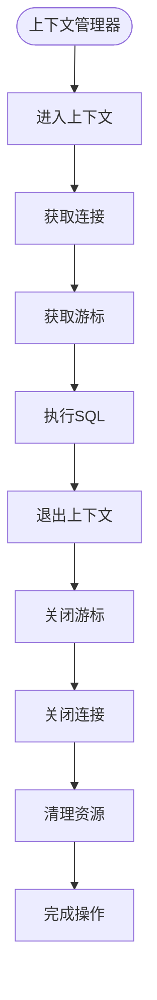

**图表来源**
- [sqlScript.py:36-54](file://common/sqlScript.py#L36-L54)

#### 自动资源清理

上下文管理器确保资源的自动清理：

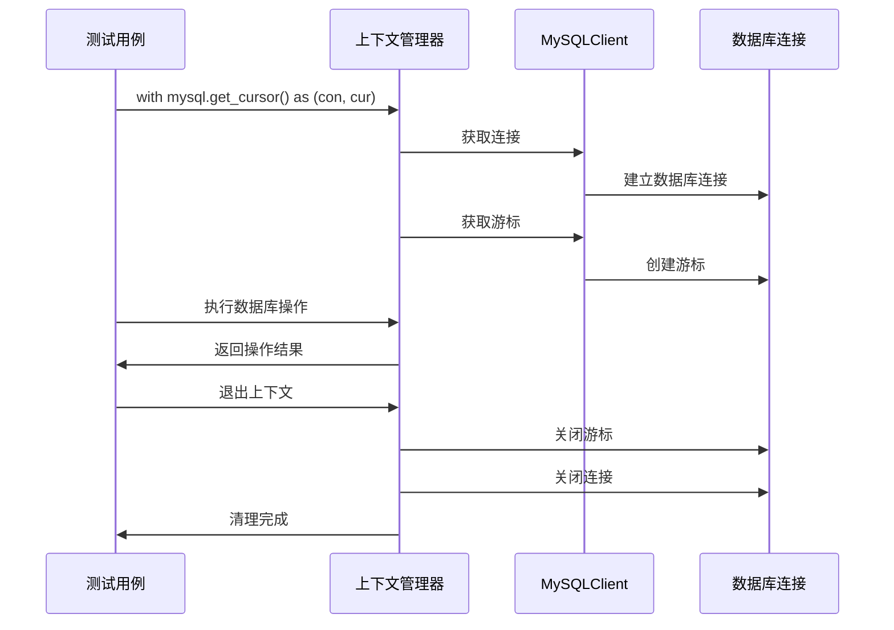

**图表来源**
- [sqlScript.py:36-54](file://common/sqlScript.py#L36-L54)

**章节来源**
- [sqlScript.py:36-54](file://common/sqlScript.py#L36-L54)

### 数据操作功能

统一架构保持了完整的数据操作功能：

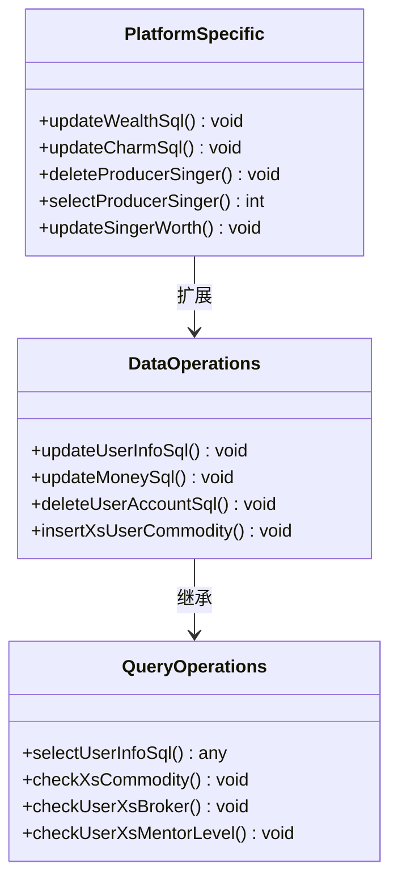

**图表来源**
- [conMysql.py:275-530](file://common/conMysql.py#L275-L530)
- [conStarifyMysql.py:102-166](file://common/conStarifyMysql.py#L102-L166)

**章节来源**
- [conMysql.py:275-530](file://common/conMysql.py#L275-L530)
- [conStarifyMysql.py:102-166](file://common/conStarifyMysql.py#L102-L166)

## 依赖关系分析

### 统一架构依赖关系

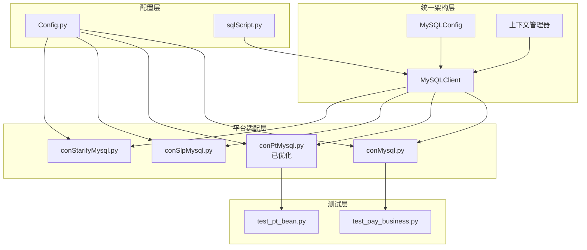

**图表来源**
- [sqlScript.py:26-91](file://common/sqlScript.py#L26-L91)
- [Config.py:6-133](file://common/Config.py#L6-L133)
- [test_pay_business.py:1-10](file://case/test_pay_business.py#L1-L10)
- [test_pt_bean.py:1-9](file://caseOversea/test_pt_bean.py#L1-L9)

### 外部依赖分析

统一架构的外部依赖更加集中：

```mermaid
graph LR
subgraph "核心依赖"
PYMYSQL[pymysql]
TIME[time]
AST[ast]
CONTEXTLIB[contextlib]
END
subgraph "统一内部依赖"
SQLSCRIPT[sqlScript.py]
CONFIG[Config.py]
end
PYMYSQL --> SQLSCRIPT
PYMYSQL --> CON_MYSQL
PYMYSQL --> CON_PT
PYMYSQL --> CON_SLP
PYMYSQL --> CON_STAR
CONTEXTLIB --> SQLSCRIPT
CONFIG --> SQLSCRIPT
CONFIG --> CON_MYSQL
CONFIG --> CON_PT
CONFIG --> CON_SLP
CONFIG --> CON_STAR
TIME --> CON_SLP
AST --> CON_MYSQL
```

**图表来源**
- [sqlScript.py:2-3](file://common/sqlScript.py#L2-L3)
- [conMysql.py:2-5](file://common/conMysql.py#L2-L5)
- [conSlpMysql.py:2-5](file://common/conSlpMysql.py#L2-L5)
- [conStarifyMysql.py:2-7](file://common/conStarifyMysql.py#L2-L7)

**章节来源**
- [sqlScript.py:2-3](file://common/sqlScript.py#L2-L3)
- [conMysql.py:2-5](file://common/conMysql.py#L2-L5)
- [conPtMysql.py:2-7](file://common/conPtMysql.py#L2-L7)
- [conSlpMysql.py:2-5](file://common/conSlpMysql.py#L2-L5)
- [conStarifyMysql.py:2-7](file://common/conStarifyMysql.py#L2-L7)

## 性能考虑

### 连接池优化策略

统一架构提供了更高效的连接池管理：

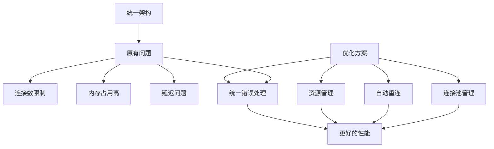

### 性能优化建议

针对统一架构的性能优化：

1. **连接池配置**: 根据测试场景调整连接池大小
2. **自动重连策略**: 配置合适的重连间隔和重试次数
3. **上下文管理**: 使用上下文管理器确保资源及时释放
4. **连接监控**: 实现连接状态监控和健康检查

### 错误处理机制

统一架构提供了更完善的错误处理机制：

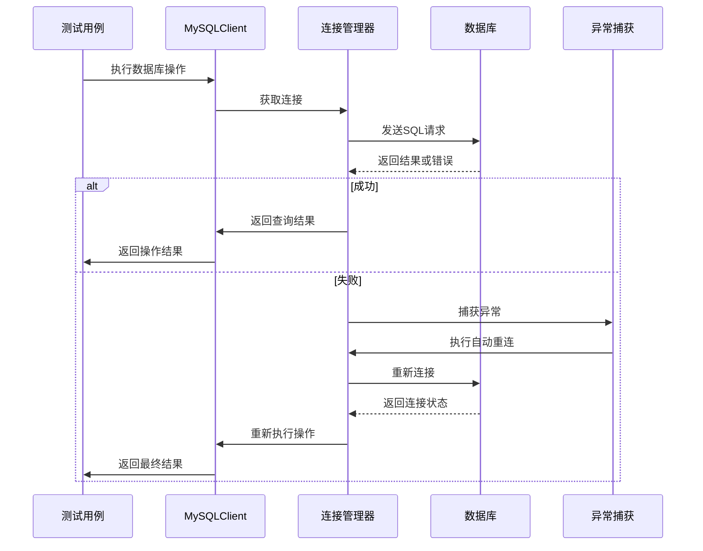

**图表来源**
- [sqlScript.py:67-69](file://common/sqlScript.py#L67-L69)
- [conPtMysql.py:52-67](file://common/conPtMysql.py#L52-L67)
- [conStarifyMysql.py:65-70](file://common/conStarifyMysql.py#L65-L70)

## 故障排除指南

### 统一连接问题诊断

#### 连接失败诊断流程

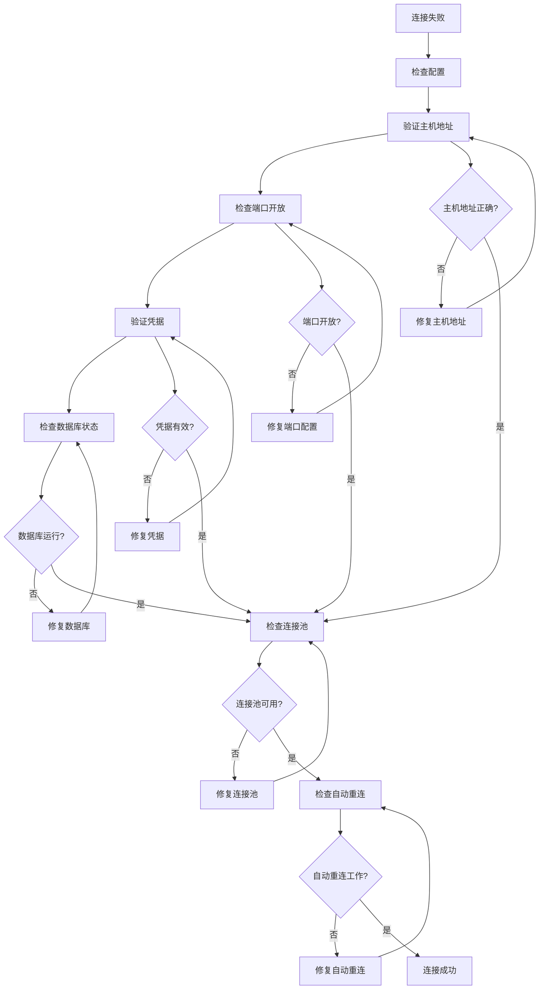

#### 连接状态监控

统一架构提供了连接状态监控功能：

**章节来源**
- [sqlScript.py:36-44](file://common/sqlScript.py#L36-L44)
- [conPtMysql.py:29-43](file://common/conPtMysql.py#L29-L43)
- [conStarifyMysql.py:30-36](file://common/conStarifyMysql.py#L30-L36)

### SSL连接支持

统一架构增强了SSL连接支持：

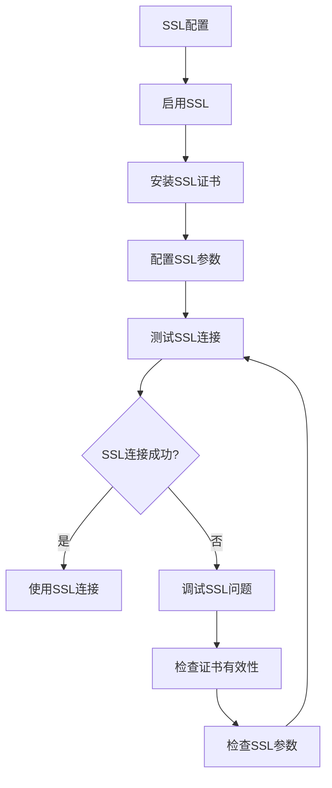

### 连接超时设置

统一架构提供了灵活的超时配置：

```python
# 统一的连接超时配置
class MySQLConfig:
    DEV = {
        'host': '192.168.11.46',
        'port': 3306,
        'user': 'root',
        'password': '123456',
        'database': 'xianshi',
        'charset': 'utf8',
        'connect_timeout': 30,    # 连接超时
        'read_timeout': 60,       # 读取超时
        'write_timeout': 60       # 写入超时
    }
```

## 结论

统一的MySQL连接管理架构为QA支付测试自动化项目带来了显著改进：

### 架构优势

1. **统一管理**: 通过MySQLClient和MySQLConfig提供统一的连接管理
2. **自动重连**: 新的连接管理器支持自动重连功能
3. **连接池管理**: 实现了连接池管理和资源优化
4. **上下文管理**: 使用上下文管理器提供更好的资源管理
5. **错误处理**: 统一的错误处理机制和连接状态监控

### 技术特色

1. **灵活配置**: 支持开发和生产环境的动态切换
2. **平台适配**: 保持对不同平台的特殊配置支持
3. **资源管理**: 自动化的资源清理和连接回收
4. **性能优化**: 连接池和自动重连提升性能
5. **监控机制**: 连接状态监控和健康检查

### 改进效果

1. **代码复用**: 减少了重复的连接管理代码
2. **维护性**: 统一的架构降低了维护成本
3. **稳定性**: 自动重连和连接池提升了系统稳定性
4. **可扩展性**: 更好的架构支持未来功能扩展
5. **安全性**: 统一的配置管理增强了安全性

**更新** PT 平台连接管理器经过重大代码优化后，显著提升了代码质量和可维护性，包括：
- 添加了完整的类型注解，提高了类型安全性
- 改进了方法文档，增强了代码可读性
- 增强了 SQL 查询格式化，提升了代码质量
- 优化了错误处理机制，提高了系统的健壮性

该统一架构为后续的功能扩展和维护奠定了坚实的基础，能够更好地满足不同平台的测试需求，同时提供了更好的性能和可靠性保障。