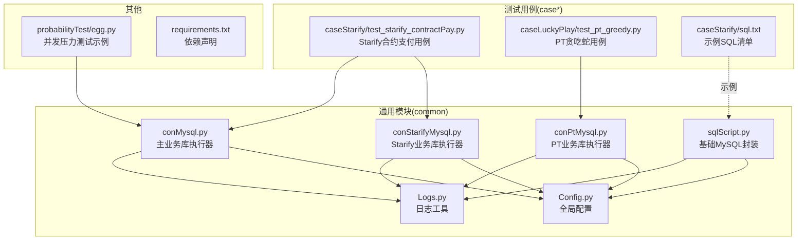
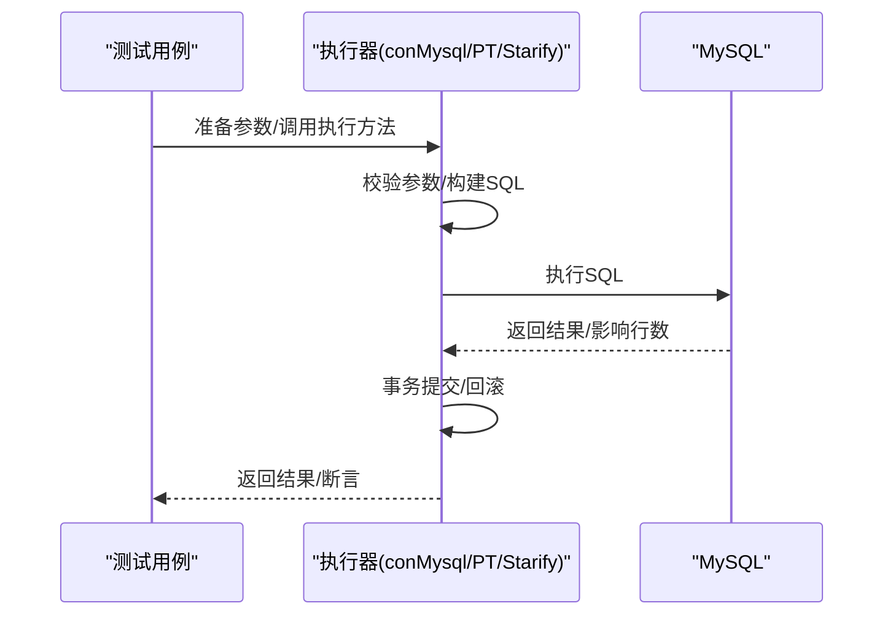
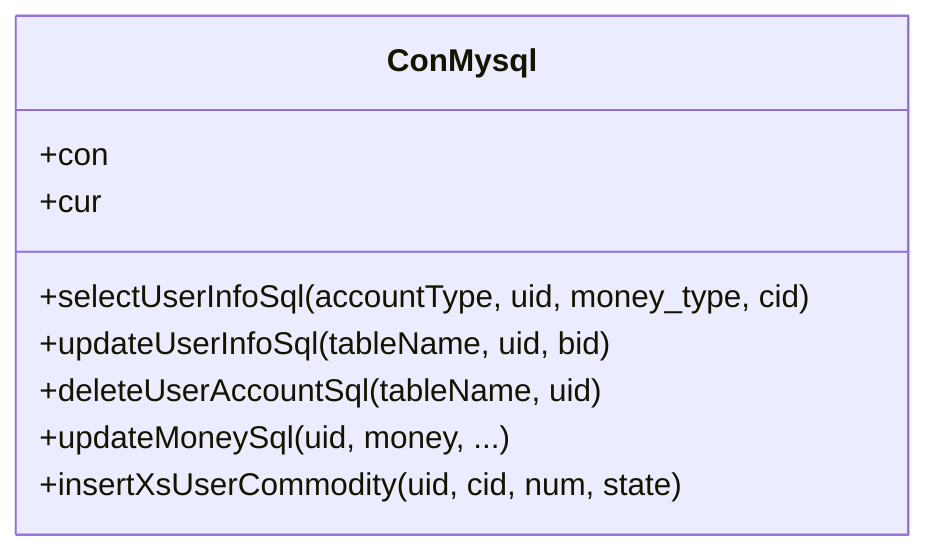
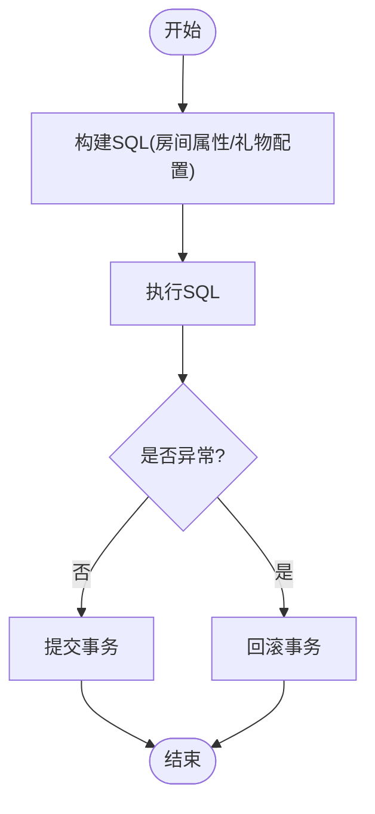
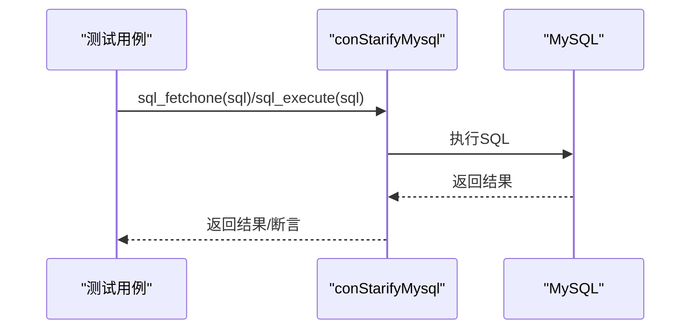
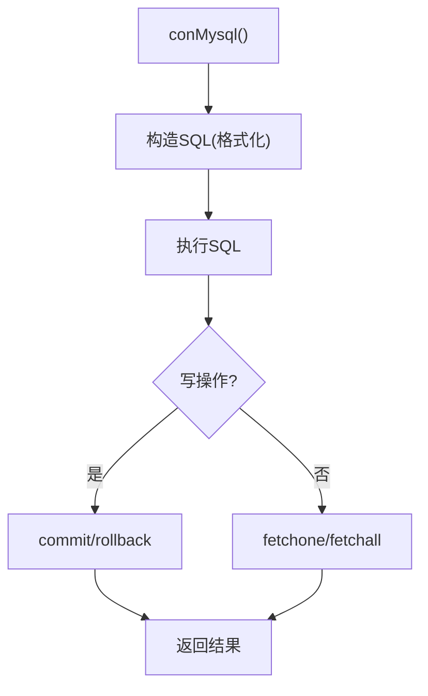
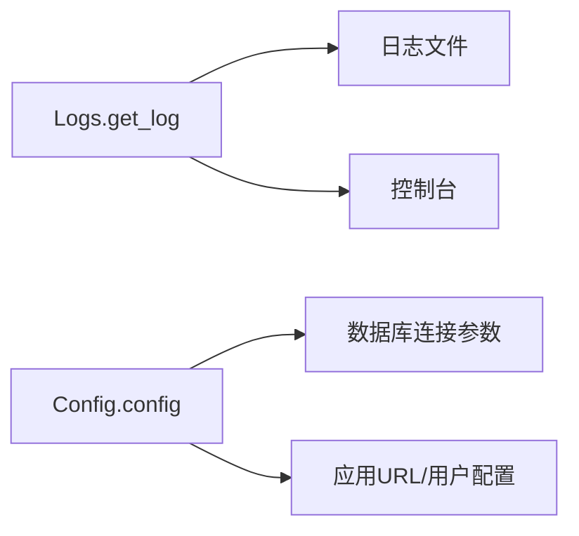
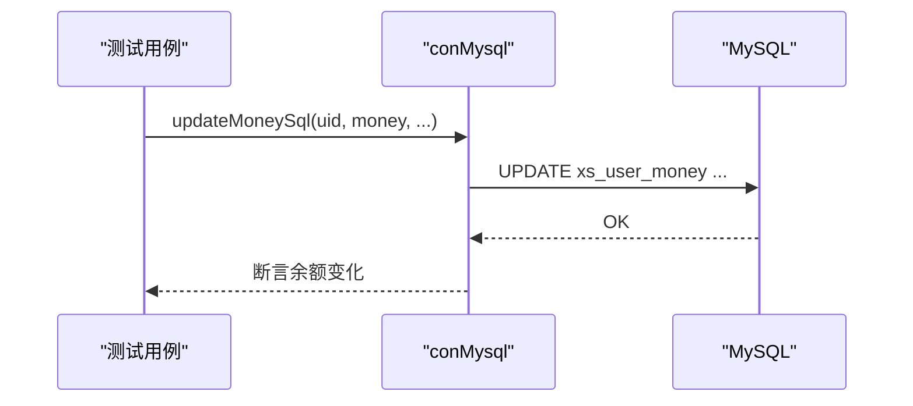
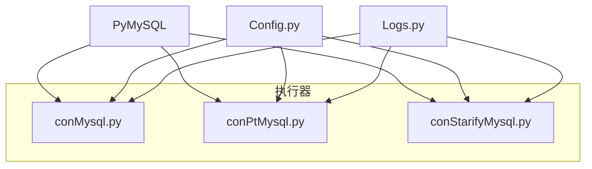

# SQL脚本执行

<cite>
**本文引用的文件**
- [common/sqlScript.py](file://common/sqlScript.py)
- [common/conMysql.py](file://common/conMysql.py)
- [common/conPtMysql.py](file://common/conPtMysql.py)
- [common/conStarifyMysql.py](file://common/conStarifyMysql.py)
- [common/Logs.py](file://common/Logs.py)
- [common/Config.py](file://common/Config.py)
- [caseStarify/sql.txt](file://caseStarify/sql.txt)
- [caseStarify/test_starify_contractPay.py](file://caseStarify/test_starify_contractPay.py)
- [caseLuckyPlay/test_pt_greedy.py](file://caseLuckyPlay/test_pt_greedy.py)
- [probabilityTest/egg.py](file://probabilityTest/egg.py)
- [requirements.txt](file://requirements.txt)
</cite>

## 目录
1. [简介](#简介)
2. [项目结构](#项目结构)
3. [核心组件](#核心组件)
4. [架构总览](#架构总览)
5. [详细组件分析](#详细组件分析)
6. [依赖分析](#依赖分析)
7. [性能考虑](#性能考虑)
8. [故障排查指南](#故障排查指南)
9. [结论](#结论)
10. [附录](#附录)

## 简介
本技术文档围绕QA支付测试自动化项目的SQL脚本执行能力进行系统化梳理，重点覆盖以下方面：
- SQL脚本封装与执行机制：连接管理、SQL拼接、事务控制与回滚策略
- 生命周期管理：从脚本加载、参数校验到执行完成的全流程
- 错误处理：语法错误检测、执行异常捕获与错误信息反馈
- 性能监控与日志：执行时间统计、资源消耗监控与执行状态跟踪
- 扩展性：新增脚本类型、自定义执行器与脚本缓存机制
- 安全与审计：SQL注入防护、权限控制与审计日志

## 项目结构
该项目采用按领域分层的组织方式，数据库访问集中在common目录下的多个con*.py文件中，测试用例在case_*目录中调用这些执行器以准备或清理测试数据。

图表来源
- [common/sqlScript.py:1-145](file://common/sqlScript.py#L1-L145)
- [common/conMysql.py:1-530](file://common/conMysql.py#L1-L530)
- [common/conPtMysql.py:121-252](file://common/conPtMysql.py#L121-L252)
- [common/conStarifyMysql.py:1-52](file://common/conStarifyMysql.py#L1-L52)
- [common/Logs.py:1-48](file://common/Logs.py#L1-L48)
- [common/Config.py:1-133](file://common/Config.py#L1-L133)
- [caseStarify/test_starify_contractPay.py:1-200](file://caseStarify/test_starify_contractPay.py#L1-L200)
- [caseLuckyPlay/test_pt_greedy.py:35-63](file://caseLuckyPlay/test_pt_greedy.py#L35-L63)
- [caseStarify/sql.txt:1-34](file://caseStarify/sql.txt#L1-L34)
- [probabilityTest/egg.py:222-258](file://probabilityTest/egg.py#L222-L258)
- [requirements.txt:1-85](file://requirements.txt#L1-L85)

章节来源
- [common/sqlScript.py:1-145](file://common/sqlScript.py#L1-L145)
- [common/conMysql.py:1-530](file://common/conMysql.py#L1-L530)
- [common/conPtMysql.py:121-252](file://common/conPtMysql.py#L121-L252)
- [common/conStarifyMysql.py:1-52](file://common/conStarifyMysql.py#L1-L52)
- [common/Logs.py:1-48](file://common/Logs.py#L1-L48)
- [common/Config.py:1-133](file://common/Config.py#L1-L133)
- [caseStarify/test_starify_contractPay.py:1-200](file://caseStarify/test_starify_contractPay.py#L1-L200)
- [caseLuckyPlay/test_pt_greedy.py:35-63](file://caseLuckyPlay/test_pt_greedy.py#L35-L63)
- [caseStarify/sql.txt:1-34](file://caseStarify/sql.txt#L1-L34)
- [probabilityTest/egg.py:222-258](file://probabilityTest/egg.py#L222-L258)
- [requirements.txt:1-85](file://requirements.txt#L1-L85)

## 核心组件
- MySQL连接与执行器
  - 统一连接池与游标管理：通过类静态方法集中管理连接与游标，避免重复创建带来的资源浪费
  - 事务控制：在执行写操作时显式try/except/finally确保commit或rollback，保证数据一致性
  - SQL拼接：采用字符串格式化拼接SQL，便于快速构造不同查询/更新语句
- 日志与配置
  - 日志：基于标准logging模块，支持控制台与定时滚动文件输出，便于问题定位与审计
  - 配置：集中管理数据库地址、账号、端口、默认库名等，便于多环境切换
- 测试用例集成
  - 在用例中直接调用执行器准备/清理数据，确保测试前置条件一致且可控

章节来源
- [common/conMysql.py:17-25](file://common/conMysql.py#L17-L25)
- [common/conMysql.py:350-360](file://common/conMysql.py#L350-L360)
- [common/Logs.py:8-47](file://common/Logs.py#L8-L47)
- [common/Config.py:6-31](file://common/Config.py#L6-L31)

## 架构总览
SQL脚本执行在本项目中以“执行器”为核心，围绕以下流程运转：
- 初始化阶段：读取配置，建立数据库连接，选择目标库
- 参数阶段：根据测试需求准备参数（如uid、金额、物品id等）
- 拼接阶段：将参数绑定到SQL模板，形成最终可执行SQL
- 执行阶段：执行SQL，处理返回结果；写操作进行事务提交或回滚
- 结束阶段：关闭游标或连接（由具体实现决定）

图表来源
- [common/conMysql.py:27-204](file://common/conMysql.py#L27-L204)
- [common/conPtMysql.py:146-225](file://common/conPtMysql.py#L146-L225)
- [common/conStarifyMysql.py:27-51](file://common/conStarifyMysql.py#L27-L51)

## 详细组件分析

### 组件A：通用MySQL执行器（conMysql）
- 设计要点
  - 单例式连接：类变量持有连接与游标，减少连接开销
  - 方法分层：按业务维度拆分查询、更新、删除、插入等方法，职责清晰
  - 异常处理：统一try/except/finally，确保写操作的事务一致性
- 关键流程
  - 查询：执行SQL后fetchone/fetchall，处理None与空结果
  - 更新/删除/插入：执行后commit，异常时rollback
- 复杂度与性能
  - 时间复杂度：单条SQL执行O(1)~O(n)，取决于查询/更新的数据量
  - 性能建议：批量更新时尽量复用同一连接，避免频繁创建销毁

图表来源
- [common/conMysql.py:8-530](file://common/conMysql.py#L8-L530)

章节来源
- [common/conMysql.py:8-530](file://common/conMysql.py#L8-L530)

### 组件B：PT业务库执行器（conPtMysql）
- 设计要点
  - 与主库执行器类似，但针对PT业务表结构定制SQL
  - 区域/房间属性更新、礼物配置检查等专用方法
- 关键流程
  - 房间属性更新：根据区域与房间属性调整房间配置
  - 礼物配置检查：批量启用或重置礼物配置项

图表来源
- [common/conPtMysql.py:146-225](file://common/conPtMysql.py#L146-L225)

章节来源
- [common/conPtMysql.py:121-252](file://common/conPtMysql.py#L121-L252)

### 组件C：Starify业务库执行器（conStarifyMysql）
- 设计要点
  - 简化版执行器：提供fetchone与execute两个通用方法
  - 适用于轻量级查询与写入场景
- 关键流程
  - fetchone：执行SQL并返回单行结果，处理None与空字段
  - execute：执行SQL并统一commit，异常时rollback

图表来源
- [common/conStarifyMysql.py:27-51](file://common/conStarifyMysql.py#L27-L51)

章节来源
- [common/conStarifyMysql.py:1-52](file://common/conStarifyMysql.py#L1-L52)

### 组件D：SQL脚本封装（sqlScript）
- 设计要点
  - 提供基础的账户余额更新、查询、背包操作等常用SQL
  - 采用字符串格式化拼接SQL，便于快速扩展
- 关键流程
  - 连接建立：静态方法创建连接与游标
  - 写操作：执行后commit，异常rollback
  - 读操作：fetchone/fetchall并处理None

图表来源
- [common/sqlScript.py:18-27](file://common/sqlScript.py#L18-L27)
- [common/sqlScript.py:30-42](file://common/sqlScript.py#L30-L42)

章节来源
- [common/sqlScript.py:1-145](file://common/sqlScript.py#L1-L145)

### 组件E：日志与配置（Logs/Config）
- 日志
  - 支持控制台与定时滚动文件输出，格式包含时间、路径、行号与级别
  - 可按需调整轮转周期与保留份数
- 配置
  - 集中管理数据库连接参数与应用URL、用户UID等
  - 便于在不同环境（开发/测试/线上）切换

图表来源
- [common/Logs.py:8-47](file://common/Logs.py#L8-L47)
- [common/Config.py:6-31](file://common/Config.py#L6-L31)

章节来源
- [common/Logs.py:1-48](file://common/Logs.py#L1-L48)
- [common/Config.py:1-133](file://common/Config.py#L1-L133)

### 组件F：测试用例中的SQL执行
- Starify合约支付用例
  - 在setUpClass/tearDownClass中准备/清理数据，确保用例独立性
  - 使用执行器更新余额、财富值、制作人信息，并断言结果
- PT贪吃蛇用例
  - 更新用户语言与大区信息，随后进行下注与余额断言

图表来源
- [caseStarify/test_starify_contractPay.py:13-80](file://caseStarify/test_starify_contractPay.py#L13-L80)
- [caseLuckyPlay/test_pt_greedy.py:35-63](file://caseLuckyPlay/test_pt_greedy.py#L35-L63)

章节来源
- [caseStarify/test_starify_contractPay.py:1-200](file://caseStarify/test_starify_contractPay.py#L1-L200)
- [caseLuckyPlay/test_pt_greedy.py:35-63](file://caseLuckyPlay/test_pt_greedy.py#L35-L63)

## 依赖分析
- 执行器依赖
  - PyMySQL：用于连接与执行SQL
  - Config：提供数据库连接参数
  - Logs：提供日志输出能力
- 测试依赖
  - 用例通过导入执行器准备/清理数据，确保测试隔离与可重复性

图表来源
- [common/conMysql.py:1-530](file://common/conMysql.py#L1-L530)
- [common/conPtMysql.py:121-252](file://common/conPtMysql.py#L121-L252)
- [common/conStarifyMysql.py:1-52](file://common/conStarifyMysql.py#L1-L52)
- [common/Config.py:1-133](file://common/Config.py#L1-L133)
- [common/Logs.py:1-48](file://common/Logs.py#L1-L48)
- [requirements.txt:54](file://requirements.txt#L54)

章节来源
- [requirements.txt:1-85](file://requirements.txt#L1-L85)

## 性能考虑
- 连接复用
  - 执行器采用类变量持有连接与游标，避免频繁创建销毁连接
- 事务粒度
  - 写操作统一在方法内部commit/rollback，减少跨方法的事务泄漏风险
- 批量操作
  - 对于批量更新/删除，建议在单次调用中完成，降低网络往返次数
- 并发场景
  - 在高并发场景下，建议引入连接池与超时控制，避免阻塞
- 日志开销
  - 控制台输出与文件轮转可能带来IO开销，建议在生产环境适当降低日志级别

## 故障排查指南
- 常见问题
  - 连接失败：检查Config中的数据库地址、端口、账号与密码
  - 权限不足：确认执行器使用的账号具备相应表的读写权限
  - 事务未提交：确认写操作方法中存在commit/rollback逻辑
  - SQL语法错误：核对拼接后的SQL，必要时打印原始SQL进行人工校验
- 排查步骤
  - 启用详细日志，定位执行器调用链
  - 在异常处打印SQL与参数，辅助复现
  - 分离读写操作，缩小问题范围
- 相关实现参考
  - 异常捕获与回滚：写操作统一在异常时rollback并commit收尾
  - 日志输出：统一使用get_log创建logger，输出到控制台与文件

章节来源
- [common/conMysql.py:350-360](file://common/conMysql.py#L350-L360)
- [common/conMysql.py:206-272](file://common/conMysql.py#L206-L272)
- [common/Logs.py:8-47](file://common/Logs.py#L8-L47)

## 结论
本项目通过统一的执行器抽象，实现了SQL脚本的封装与执行，配合完善的日志与配置管理，满足了支付测试自动化对数据准备与清理的需求。建议在后续迭代中引入连接池、参数化SQL与缓存机制，进一步提升安全性与性能。

## 附录

### SQL脚本模板设计与参数绑定
- 模板设计
  - 采用字符串格式化构建SQL，便于快速扩展不同查询/更新场景
  - 对于复杂场景，建议引入参数化SQL以增强安全性
- 参数绑定
  - 在执行器中集中处理参数校验与绑定，避免在用例中散落SQL拼接逻辑
- 动态SQL生成
  - 根据业务维度（账户、背包、房间、礼物等）生成不同SQL片段，再组合成完整SQL

章节来源
- [common/sqlScript.py:30-42](file://common/sqlScript.py#L30-L42)
- [common/conMysql.py:27-204](file://common/conMysql.py#L27-L204)

### 脚本执行生命周期管理
- 加载：读取配置，建立连接，选择数据库
- 参数验证：在执行器中进行参数合法性检查
- 执行：执行SQL，处理返回结果
- 提交/回滚：写操作统一事务控制
- 结束：关闭资源或复用连接

章节来源
- [common/conMysql.py:17-25](file://common/conMysql.py#L17-L25)
- [common/conMysql.py:350-360](file://common/conMysql.py#L350-L360)

### 错误处理机制
- 语法错误检测：在执行前打印SQL，必要时加入SQL解析校验
- 执行异常捕获：统一try/except/finally，异常时rollback并commit收尾
- 错误信息反馈：通过日志输出异常堆栈与上下文

章节来源
- [common/conMysql.py:206-272](file://common/conMysql.py#L206-L272)
- [common/Logs.py:8-47](file://common/Logs.py#L8-L47)

### 性能监控与日志记录
- 执行时间统计：可在执行器方法入口/出口记录时间戳，计算耗时
- 资源消耗监控：结合系统监控工具观察连接数、QPS与慢查询
- 执行状态跟踪：通过日志记录SQL与参数，便于回溯

章节来源
- [common/Logs.py:8-47](file://common/Logs.py#L8-L47)

### 扩展新SQL脚本类型与执行器
- 新增脚本类型
  - 在对应执行器中新增方法，遵循现有命名规范与事务控制
- 自定义执行器
  - 参考conStarifyMysql的简化模式，提供通用的fetchone/execute方法
- 脚本缓存机制
  - 对于高频查询，可在执行器中引入缓存（如LRU），注意缓存失效策略

章节来源
- [common/conStarifyMysql.py:27-51](file://common/conStarifyMysql.py#L27-L51)

### 安全执行、权限控制与审计日志
- 安全执行
  - 优先使用参数化SQL，避免字符串拼接导致的注入风险
  - 对敏感参数（如uid、金额）进行白名单校验
- 权限控制
  - 限制执行器账号权限，最小化授权原则
- 审计日志
  - 记录SQL、参数、执行时间与结果，便于审计与追踪

章节来源
- [common/conMysql.py:350-360](file://common/conMysql.py#L350-L360)
- [common/Logs.py:8-47](file://common/Logs.py#L8-L47)