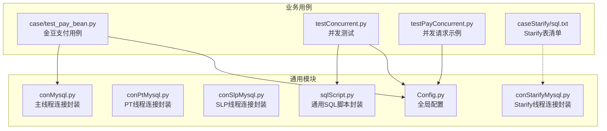
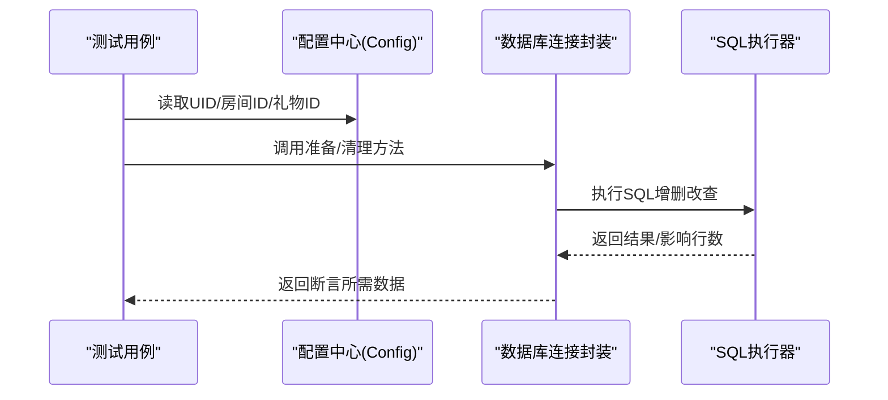
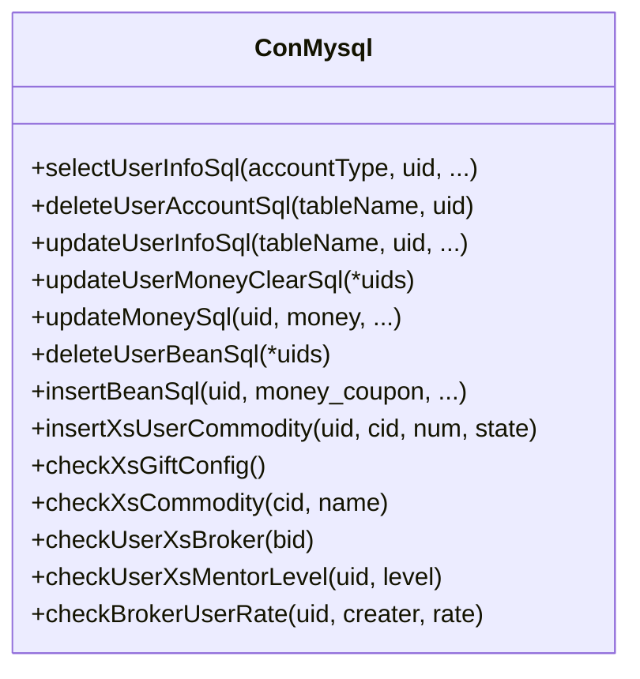
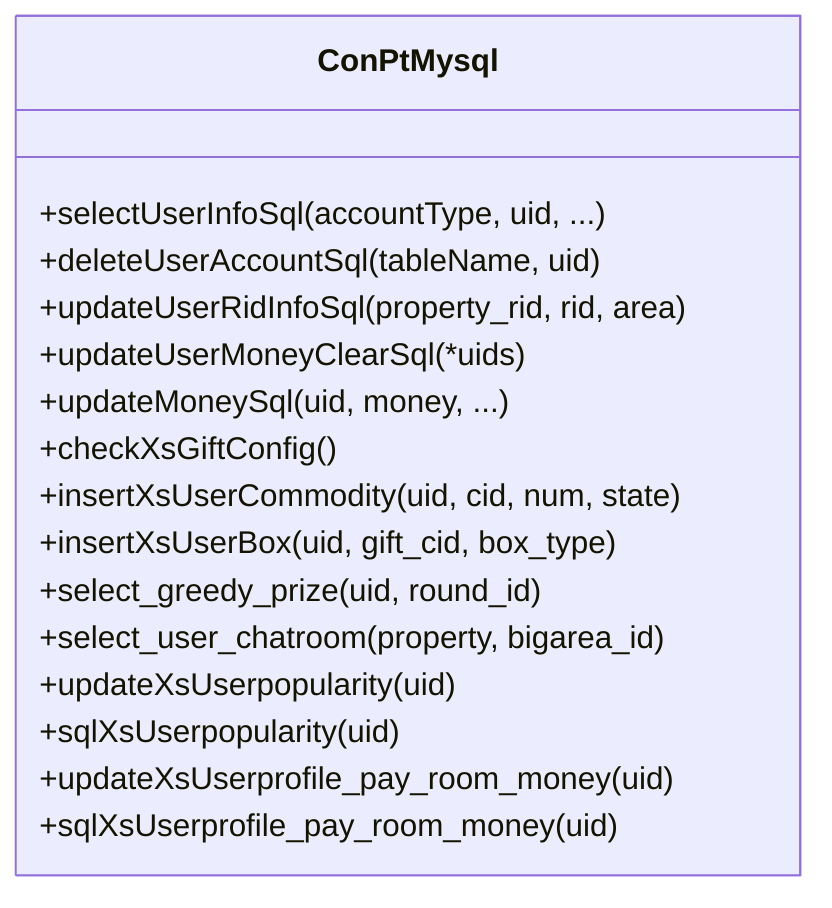
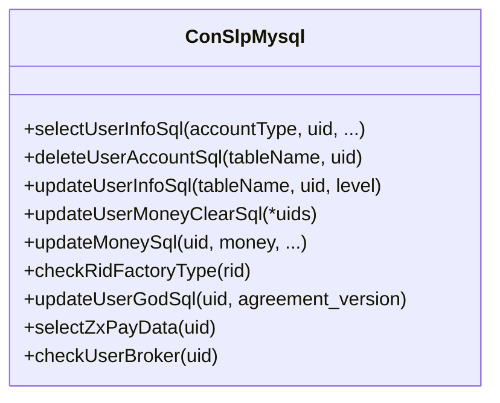
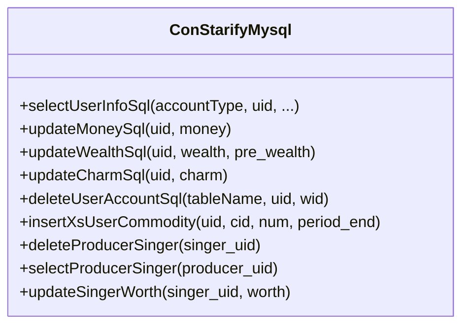
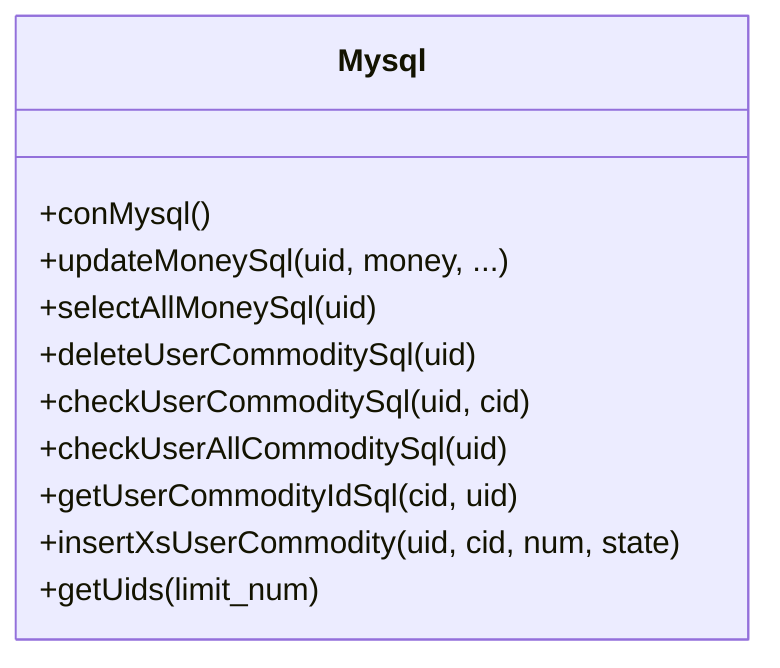
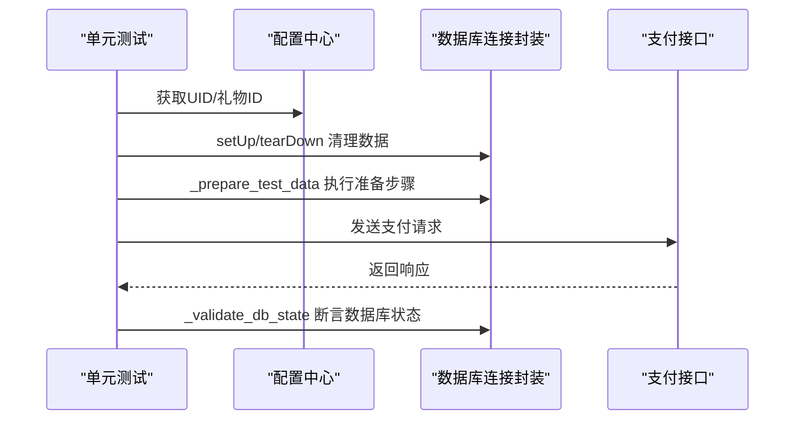
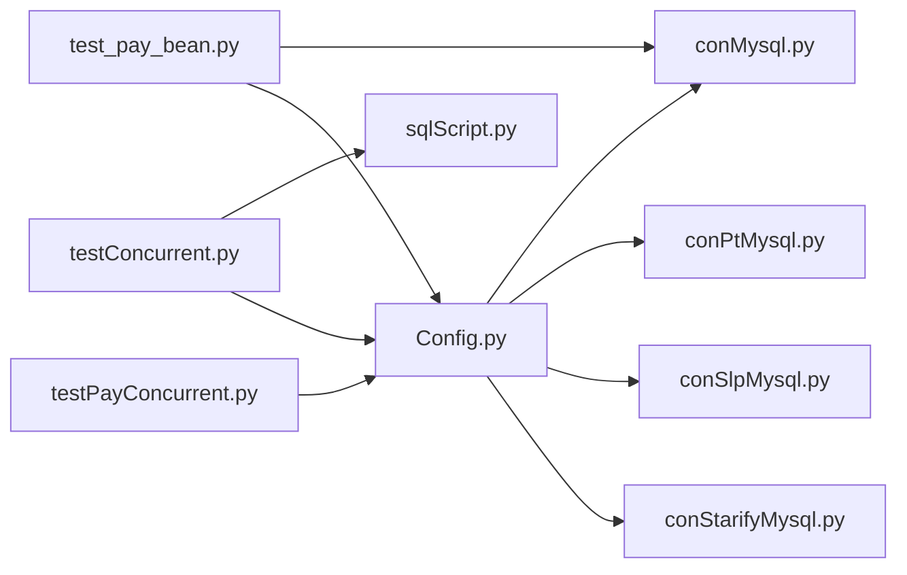

# 数据库管理

<cite>
**本文引用的文件**
- [conMysql.py](file://common/conMysql.py)
- [conPtMysql.py](file://common/conPtMysql.py)
- [conSlpMysql.py](file://common/conSlpMysql.py)
- [conStarifyMysql.py](file://common/conStarifyMysql.py)
- [sqlScript.py](file://common/sqlScript.py)
- [Config.py](file://common/Config.py)
- [test_pay_bean.py](file://case/test_pay_bean.py)
- [testConcurrent.py](file://testConcurrent.py)
- [testPayConcurrent.py](file://testPayConcurrent.py)
- [sql.txt](file://caseStarify/sql.txt)
</cite>

## 目录
1. [简介](#简介)
2. [项目结构](#项目结构)
3. [核心组件](#核心组件)
4. [架构总览](#架构总览)
5. [详细组件分析](#详细组件分析)
6. [依赖分析](#依赖分析)
7. [性能考虑](#性能考虑)
8. [故障排查指南](#故障排查指南)
9. [结论](#结论)
10. [附录](#附录)

## 简介
本文件面向QA支付测试自动化项目的数据库管理能力，系统化梳理数据库连接管理、数据访问层设计与数据准备策略。重点覆盖：
- 多平台数据库连接配置与封装
- SQL脚本的封装与执行机制
- 测试数据准备、清理与恢复策略
- 表结构与索引优化、查询性能调优建议
- 连接池、事务管理与并发控制最佳实践
- 扩展新连接、新增数据模型与数据迁移策略

## 项目结构
数据库相关代码主要集中在 common 目录下的连接封装模块与通用脚本模块，并在各业务用例中通过统一入口进行数据准备与校验。

图表来源
- [conMysql.py:8-26](file://common/conMysql.py#L8-L26)
- [conPtMysql.py:6-24](file://common/conPtMysql.py#L6-L24)
- [conSlpMysql.py:8-28](file://common/conSlpMysql.py#L8-L28)
- [conStarifyMysql.py:6-26](file://common/conStarifyMysql.py#L6-L26)
- [sqlScript.py:5-28](file://common/sqlScript.py#L5-L28)
- [Config.py:6-133](file://common/Config.py#L6-L133)
- [test_pay_bean.py:1-27](file://case/test_pay_bean.py#L1-L27)
- [testConcurrent.py:1-28](file://testConcurrent.py#L1-L28)
- [testPayConcurrent.py:1-47](file://testPayConcurrent.py#L1-L47)
- [sql.txt:1-34](file://caseStarify/sql.txt#L1-L34)

章节来源
- [conMysql.py:1-530](file://common/conMysql.py#L1-L530)
- [conPtMysql.py:1-345](file://common/conPtMysql.py#L1-L345)
- [conSlpMysql.py:1-680](file://common/conSlpMysql.py#L1-L680)
- [conStarifyMysql.py:1-148](file://common/conStarifyMysql.py#L1-L148)
- [sqlScript.py:1-145](file://common/sqlScript.py#L1-L145)
- [Config.py:1-133](file://common/Config.py#L1-L133)
- [test_pay_bean.py:1-200](file://case/test_pay_bean.py#L1-L200)
- [testConcurrent.py:1-200](file://testConcurrent.py#L1-L200)
- [testPayConcurrent.py:1-47](file://testPayConcurrent.py#L1-L47)
- [sql.txt:1-34](file://caseStarify/sql.txt#L1-L34)

## 核心组件
- 连接封装类
  - 主线程连接：conMysql（主线程/单连接）
  - PT线程连接：conMysql（PT专用）
  - SLP线程连接：conMysql（SLP专用）
  - Starify线程连接：conMysql（Starify专用）
- 通用SQL脚本封装：mysql（按需建立连接）
- 配置中心：Config（全局UID、房间ID、礼物ID等）

章节来源
- [conMysql.py:8-530](file://common/conMysql.py#L8-L530)
- [conPtMysql.py:6-345](file://common/conPtMysql.py#L6-L345)
- [conSlpMysql.py:8-680](file://common/conSlpMysql.py#L8-L680)
- [conStarifyMysql.py:6-148](file://common/conStarifyMysql.py#L6-L148)
- [sqlScript.py:5-145](file://common/sqlScript.py#L5-L145)
- [Config.py:6-133](file://common/Config.py#L6-L133)

## 架构总览
整体采用“按平台分层”的连接封装模式，每个平台独立维护连接与操作方法，统一通过配置中心提供UID/房间ID/礼物ID等参数。测试用例在 setUp/tearDown 中调用删除或插入方法准备/清理数据，确保用例隔离性与可重复性。

图表来源
- [test_pay_bean.py:16-27](file://case/test_pay_bean.py#L16-L27)
- [conMysql.py:206-273](file://common/conMysql.py#L206-L273)
- [conMysql.py:275-322](file://common/conMysql.py#L275-L322)
- [conMysql.py:336-361](file://common/conMysql.py#L336-L361)
- [conMysql.py:376-401](file://common/conMysql.py#L376-L401)
- [conMysql.py:403-415](file://common/conMysql.py#L403-L415)

## 详细组件分析

### 组件A：主线程连接封装（conMysql）
- 连接特性
  - 单连接实例，自动选择数据库，保持连接可用
  - 提供静态方法进行查询、更新、删除、插入等操作
- 数据访问方法
  - 查询类：selectUserInfoSql(accountType, uid, ...)，支持多种账户余额、背包、消费记录等查询
  - 删除类：deleteUserAccountSql(tableName, uid)，支持多表清理
  - 更新类：updateUserInfoSql(tableName, uid, ...)，支持多表更新
  - 插入类：insertBeanSql(uid, money_coupon, ...)/insertXsUserCommodity(...)
  - 辅助类：checkXsGiftConfig()/checkXsCommodity()/checkUserXsBroker()/checkUserXsMentorLevel()/checkBrokerUserRate()
- 事务与回滚
  - 所有写操作均在 try/except 后执行 rollback 或 commit，保证一致性
- 并发注意
  - 当前为单连接，不适用于高并发场景；并发场景建议使用线程安全的连接封装或通用SQL脚本封装

图表来源
- [conMysql.py:28-204](file://common/conMysql.py#L28-L204)
- [conMysql.py:206-273](file://common/conMysql.py#L206-L273)
- [conMysql.py:275-322](file://common/conMysql.py#L275-L322)
- [conMysql.py:336-415](file://common/conMysql.py#L336-L415)

章节来源
- [conMysql.py:8-530](file://common/conMysql.py#L8-L530)

### 组件B：PT线程连接封装（conPtMysql）
- 连接特性
  - 单连接实例，针对PT平台的数据结构与业务字段进行适配
- 数据访问方法
  - 查询类：selectUserInfoSql(accountType, uid, ...)，支持sum_money/single_money/pay_change/背包统计等
  - 删除类：deleteUserAccountSql(tableName, uid)，支持用户背包、箱子、活动记录等清理
  - 更新类：updateUserRidInfoSql(property_rid, rid, area)/updateUserMoneyClearSql(*uids)/updateMoneySql(...)
  - 辅助类：checkXsGiftConfig()/insertXsUserCommodity()/insertXsUserBox()/updateXsUserpopularity()/sqlXsUserpopularity()/updateXsUserprofile_pay_room_money()/sqlXsUserprofile_pay_room_money()

图表来源
- [conPtMysql.py:26-93](file://common/conPtMysql.py#L26-L93)
- [conPtMysql.py:95-144](file://common/conPtMysql.py#L95-L144)
- [conPtMysql.py:146-185](file://common/conPtMysql.py#L146-L185)
- [conPtMysql.py:187-251](file://common/conPtMysql.py#L187-L251)
- [conPtMysql.py:266-345](file://common/conPtMysql.py#L266-L345)

章节来源
- [conPtMysql.py:1-345](file://common/conPtMysql.py#L1-L345)

### 组件C：SLP线程连接封装（conSlpMysql）
- 连接特性
  - 单连接实例，针对SLP平台的数据结构与业务字段进行适配
- 数据访问方法
  - 查询类：selectUserInfoSql(accountType, uid, ...)，支持bean/cash/sum_money/single_money/popularity/level/growth/relations等
  - 删除类：deleteUserAccountSql(tableName, uid)，支持多表清理
  - 更新类：updateUserInfoSql(tableName, uid, level)，支持爵位等级等更新
  - 辅助类：checkRidFactoryType(uid)/updateUserGodSql(uid, agreement_version)/selectZxPayData(uid)/checkUserBroker(uid)

图表来源
- [conSlpMysql.py:29-226](file://common/conSlpMysql.py#L29-L226)
- [conSlpMysql.py:228-322](file://common/conSlpMysql.py#L228-L322)
- [conSlpMysql.py:324-410](file://common/conSlpMysql.py#L324-L410)
- [conSlpMysql.py:411-618](file://common/conSlpMysql.py#L411-L618)

章节来源
- [conSlpMysql.py:1-680](file://common/conSlpMysql.py#L1-L680)

### 组件D：Starify线程连接封装（conStarifyMysql）
- 连接特性
  - 单连接实例，针对Starify平台的数据结构与业务字段进行适配
- 数据访问方法
  - 查询类：selectUserInfoSql(accountType, uid, ...)，支持star_coin/gift_num/commodity_num/wealth/charm等
  - 更新类：updateMoneySql(uid, money)/updateWealthSql(uid, wealth, pre_wealth)/updateCharmSql(uid, charm)
  - 删除类：deleteUserAccountSql(tableName, uid, wid)
  - 插入类：insertXsUserCommodity(uid, cid, num, period_end)
  - 辅助类：deleteProducerSinger(singer_uid)/selectProducerSinger(producer_uid)/updateSingerWorth(singer_uid, worth)

图表来源
- [conStarifyMysql.py:28-70](file://common/conStarifyMysql.py#L28-L70)
- [conStarifyMysql.py:72-88](file://common/conStarifyMysql.py#L72-L88)
- [conStarifyMysql.py:90-97](file://common/conStarifyMysql.py#L90-L97)
- [conStarifyMysql.py:99-143](file://common/conStarifyMysql.py#L99-L143)

章节来源
- [conStarifyMysql.py:1-148](file://common/conStarifyMysql.py#L1-L148)

### 组件E：通用SQL脚本封装（mysql）
- 连接特性
  - 每次调用时新建连接，适合临时任务或并发场景
- 数据访问方法
  - updateMoneySql/selectAllMoneySql/deleteUserCommoditySql/checkUserCommoditySql/checkUserAllCommoditySql/getUserCommodityIdSql/insertXsUserCommodity/getUids

图表来源
- [sqlScript.py:18-28](file://common/sqlScript.py#L18-L28)
- [sqlScript.py:30-42](file://common/sqlScript.py#L30-L42)
- [sqlScript.py:44-57](file://common/sqlScript.py#L44-L57)
- [sqlScript.py:59-69](file://common/sqlScript.py#L59-L69)
- [sqlScript.py:72-85](file://common/sqlScript.py#L72-L85)
- [sqlScript.py:87-97](file://common/sqlScript.py#L87-L97)
- [sqlScript.py:99-110](file://common/sqlScript.py#L99-L110)
- [sqlScript.py:112-124](file://common/sqlScript.py#L112-L124)
- [sqlScript.py:126-145](file://common/sqlScript.py#L126-L145)

章节来源
- [sqlScript.py:1-145](file://common/sqlScript.py#L1-L145)

### 组件F：配置中心（Config）
- 提供全局常量与ID映射，包括：
  - 应用与服务地址
  - 用户UID、房间ID、礼物ID等
  - 平台标识与分支信息

章节来源
- [Config.py:6-133](file://common/Config.py#L6-L133)

### 组件G：用例中的数据准备与清理（以金豆支付为例）
- setUp/tearDown 在每个用例前后清理目标UID的金豆与相关数据
- _prepare_test_data 根据步骤动作执行删除、更新、插入
- _validate_db_state 对关键字段进行断言

图表来源
- [test_pay_bean.py:16-27](file://case/test_pay_bean.py#L16-L27)
- [test_pay_bean.py:28-46](file://case/test_pay_bean.py#L28-L46)
- [test_pay_bean.py:47-172](file://case/test_pay_bean.py#L47-L172)

章节来源
- [test_pay_bean.py:1-200](file://case/test_pay_bean.py#L1-L200)

## 依赖分析
- 组件耦合
  - 各平台连接封装相互独立，彼此无直接依赖
  - 业务用例依赖配置中心与对应平台的连接封装
  - 通用SQL脚本封装可被并发测试使用
- 外部依赖
  - pymysql（MySQL驱动）
  - gevent（并发测试）
- 潜在循环依赖
  - 未发现循环导入；连接封装均为单文件类定义

图表来源
- [Config.py:6-133](file://common/Config.py#L6-L133)
- [conMysql.py:8-26](file://common/conMysql.py#L8-L26)
- [conPtMysql.py:6-24](file://common/conPtMysql.py#L6-L24)
- [conSlpMysql.py:8-28](file://common/conSlpMysql.py#L8-L28)
- [conStarifyMysql.py:6-26](file://common/conStarifyMysql.py#L6-L26)
- [test_pay_bean.py:1-10](file://case/test_pay_bean.py#L1-L10)
- [testConcurrent.py:5-14](file://testConcurrent.py#L5-L14)
- [testPayConcurrent.py:1-16](file://testPayConcurrent.py#L1-L16)

章节来源
- [Config.py:6-133](file://common/Config.py#L6-L133)
- [conMysql.py:8-530](file://common/conMysql.py#L8-L530)
- [conPtMysql.py:6-345](file://common/conPtMysql.py#L6-L345)
- [conSlpMysql.py:8-680](file://common/conSlpMysql.py#L8-L680)
- [conStarifyMysql.py:6-148](file://common/conStarifyMysql.py#L6-L148)
- [test_pay_bean.py:1-200](file://case/test_pay_bean.py#L1-L200)
- [testConcurrent.py:1-200](file://testConcurrent.py#L1-L200)
- [testPayConcurrent.py:1-47](file://testPayConcurrent.py#L1-L47)

## 性能考虑
- 连接复用
  - 主线程连接封装为单连接，适合顺序执行；高并发场景建议使用通用SQL脚本封装按需建立连接
- 事务与回滚
  - 所有写操作均显式处理异常并提交/回滚，避免脏数据
- 并发控制
  - 测试中使用 gevent 进行协程并发，注意数据库连接的线程安全；如需多进程/多线程，请使用连接池或按需连接
- 查询优化
  - 建议对高频查询字段建立合适索引（如 uid、cid、rid 等）
  - 避免一次性全表扫描，尽量使用条件过滤与分页
- 连接池（建议）
  - 可引入连接池（如 PyMySQL 的连接池或第三方库）以提升并发吞吐与资源利用率

## 故障排查指南
- 常见问题
  - 连接失败：检查 host/port/user/passwd/dbName 是否正确
  - 权限不足：确认用户权限与字符集设置
  - 事务未提交：确认 finally 分支是否执行 commit
  - 数据不一致：检查异常分支是否执行 rollback
- 排查步骤
  - 在连接封装中打印 SQL 与错误信息，定位具体失败点
  - 使用通用SQL脚本封装进行最小化复现
  - 在并发测试中逐步降低并发度，观察是否仍出现冲突

章节来源
- [conMysql.py:336-361](file://common/conMysql.py#L336-L361)
- [conMysql.py:376-401](file://common/conMysql.py#L376-L401)
- [conMysql.py:403-415](file://common/conMysql.py#L403-L415)
- [sqlScript.py:30-42](file://common/sqlScript.py#L30-L42)
- [sqlScript.py:59-69](file://common/sqlScript.py#L59-L69)
- [sqlScript.py:112-124](file://common/sqlScript.py#L112-L124)

## 结论
本项目通过“按平台分层”的连接封装与统一配置中心，实现了跨平台数据库访问的一致性与可维护性。主线程连接封装适合顺序执行场景，通用SQL脚本封装与并发测试结合可满足高并发需求。建议在生产环境中引入连接池与更完善的索引策略，持续优化查询性能与事务稳定性。

## 附录

### 多平台数据库连接配置方法
- 主线程连接（conMysql）
  - 配置项：db_config、_dbUrl、_user、_password、_dbName、_dbPort
  - 初始化：连接建立、选择数据库、ping重连、游标初始化
- PT线程连接（conPtMysql）
  - 配置项：db_config、_dbUrl、_user、_password、_dbName、_dbPort
  - 初始化：连接建立、选择数据库、ping重连、游标初始化
- SLP线程连接（conSlpMysql）
  - 配置项：db_config、_dbUrl、_user、_password、_dbName、_dbPort
  - 初始化：连接建立、选择数据库、ping重连、游标初始化
- Starify线程连接（conStarifyMysql）
  - 配置项：db_config、_dbUrl、_user、_password、_dbName、_dbPort
  - 初始化：连接建立、选择数据库、ping重连、游标初始化

章节来源
- [conMysql.py:8-26](file://common/conMysql.py#L8-L26)
- [conPtMysql.py:6-24](file://common/conPtMysql.py#L6-L24)
- [conSlpMysql.py:8-28](file://common/conSlpMysql.py#L8-L28)
- [conStarifyMysql.py:6-26](file://common/conStarifyMysql.py#L6-L26)

### SQL脚本封装与执行机制
- 通用SQL脚本封装（mysql）
  - 每次调用时新建连接，适合临时任务或并发场景
  - 支持更新余额、查询余额、删除背包、检查背包、插入背包、批量获取UID等

章节来源
- [sqlScript.py:18-28](file://common/sqlScript.py#L18-L28)
- [sqlScript.py:30-42](file://common/sqlScript.py#L30-L42)
- [sqlScript.py:44-57](file://common/sqlScript.py#L44-L57)
- [sqlScript.py:59-69](file://common/sqlScript.py#L59-L69)
- [sqlScript.py:72-85](file://common/sqlScript.py#L72-L85)
- [sqlScript.py:87-97](file://common/sqlScript.py#L87-L97)
- [sqlScript.py:99-110](file://common/sqlScript.py#L99-L110)
- [sqlScript.py:112-124](file://common/sqlScript.py#L112-L124)
- [sqlScript.py:126-145](file://common/sqlScript.py#L126-L145)

### 测试数据准备流程、数据清理策略与数据恢复机制
- 准备流程
  - 在 setUp 中清理目标UID相关数据
  - 根据用例需要插入/更新特定数据（如金豆、背包、房间属性等）
- 清理策略
  - tearDown 中再次清理，确保用例隔离
  - 删除/更新操作均在异常分支中回滚，最终提交
- 恢复机制
  - 通过配置中心提供的UID/房间ID/礼物ID快速恢复到期望状态

章节来源
- [test_pay_bean.py:16-27](file://case/test_pay_bean.py#L16-L27)
- [test_pay_bean.py:28-46](file://case/test_pay_bean.py#L28-L46)
- [conMysql.py:206-273](file://common/conMysql.py#L206-L273)
- [conMysql.py:275-322](file://common/conMysql.py#L275-L322)
- [conMysql.py:336-361](file://common/conMysql.py#L336-L361)
- [conMysql.py:376-415](file://common/conMysql.py#L376-L415)

### 数据库表结构设计、索引优化与查询性能调优
- 表结构参考（Starify）
  - 账户余额：xs_user_money
  - 道具配置：xs_commodity
  - 礼物配置：xs_gift
  - 用户背包：xs_user_commodity
  - 消费记录流水：xs_pay_change
- 索引优化建议
  - 对高频查询字段建立索引（如 uid、cid、rid）
  - 对范围查询与排序字段建立复合索引
  - 定期分析慢查询日志，针对性优化
- 查询性能调优
  - 使用 EXPLAIN 分析执行计划
  - 避免 SELECT *，只查询必要字段
  - 合理使用 LIMIT 与分页

章节来源
- [sql.txt:10-34](file://caseStarify/sql.txt#L10-L34)

### 连接池配置、事务管理与并发控制最佳实践
- 连接池配置（建议）
  - 引入连接池以提升并发吞吐与资源利用率
  - 设置合理的最大连接数、空闲连接数与超时时间
- 事务管理
  - 显式开启/提交/回滚事务，确保原子性
  - 在异常分支中执行回滚，最终提交
- 并发控制
  - 使用 gevent/协程进行轻量级并发
  - 对共享资源加锁或使用队列串行化

章节来源
- [testConcurrent.py:1-200](file://testConcurrent.py#L1-L200)
- [testPayConcurrent.py:1-47](file://testPayConcurrent.py#L1-L47)

### 扩展新数据库连接、新增数据模型与数据迁移策略
- 扩展新数据库连接
  - 新建连接封装类，遵循现有命名与方法风格
  - 在配置中心新增平台标识与默认参数
- 新增数据模型
  - 在对应平台连接封装中补充查询/更新/删除方法
  - 在用例中通过 setUp/tearDown 进行数据准备与清理
- 数据迁移策略
  - 使用通用SQL脚本封装进行小批量迁移
  - 对大表迁移采用分批、索引重建与事务拆分策略

章节来源
- [conMysql.py:28-204](file://common/conMysql.py#L28-L204)
- [conMysql.py:206-273](file://common/conMysql.py#L206-L273)
- [conMysql.py:275-322](file://common/conMysql.py#L275-L322)
- [sqlScript.py:18-28](file://common/sqlScript.py#L18-L28)
- [sqlScript.py:30-42](file://common/sqlScript.py#L30-L42)