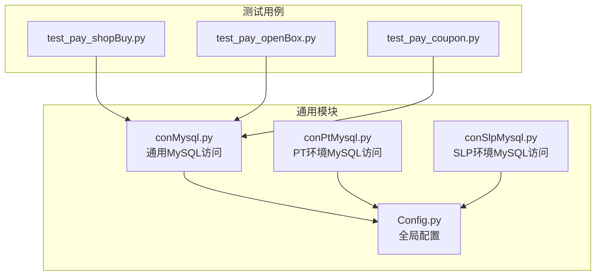
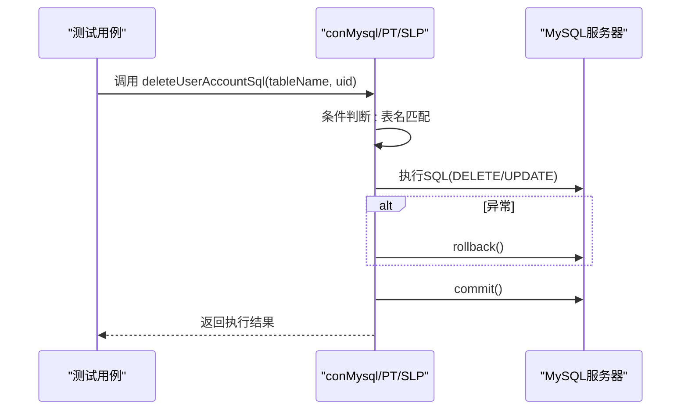
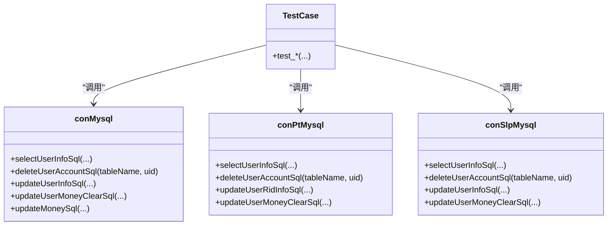

# 删除操作

<cite>
**本文引用的文件列表**
- [conMysql.py](file://common/conMysql.py)
- [conPtMysql.py](file://common/conPtMysql.py)
- [conSlpMysql.py](file://common/conSlpMysql.py)
- [test_pay_shopBuy.py](file://case/test_pay_shopBuy.py)
- [test_pay_openBox.py](file://case/test_pay_openBox.py)
- [test_pay_coupon.py](file://case/test_pay_coupon.py)
- [Config.py](file://common/Config.py)
</cite>

## 目录
1. [简介](#简介)
2. [项目结构](#项目结构)
3. [核心组件](#核心组件)
4. [架构总览](#架构总览)
5. [详细组件分析](#详细组件分析)
6. [依赖关系分析](#依赖关系分析)
7. [性能考量](#性能考量)
8. [故障排查指南](#故障排查指南)
9. [结论](#结论)
10. [附录](#附录)

## 简介
本技术文档聚焦于数据访问层的删除操作模块，系统性解析 deleteUserAccountSql 静态方法的实现原理与使用场景，覆盖用户数据清理的多种情形，包括但不限于：
- 用户背包数据（user_commodity）
- 用户爵位数据（user_title）
- 用户 profile 数据（user_profile）
- 工会用户记录（broker_user）
- 商业房数据（chatroom）
- 箱子数据（user_box）
- 新爵位数据（user_title_new）
- 其他相关清理场景（如旅程星球抽卡记录、聊天付费卡记录、人气值、送礼流水等）

文档将从实现细节、SQL 构造、条件判断、事务处理、错误处理、安全性与恢复策略等方面进行深入剖析，并提供可视化图示帮助理解。

## 项目结构
该仓库采用按功能域划分的组织方式，删除操作主要集中在通用数据库访问类中，测试用例通过调用这些类完成对用户数据的清理与验证。

图表来源
- [conMysql.py:1-530](file://common/conMysql.py#L1-L530)
- [conPtMysql.py:1-345](file://common/conPtMysql.py#L1-L345)
- [conSlpMysql.py:1-680](file://common/conSlpMysql.py#L1-L680)
- [test_pay_shopBuy.py:1-124](file://case/test_pay_shopBuy.py#L1-L124)
- [test_pay_openBox.py:1-124](file://case/test_pay_openBox.py#L1-L124)
- [test_pay_coupon.py:1-149](file://case/test_pay_coupon.py#L1-L149)
- [Config.py:1-133](file://common/Config.py#L1-L133)

章节来源
- [conMysql.py:1-530](file://common/conMysql.py#L1-L530)
- [conPtMysql.py:1-345](file://common/conPtMysql.py#L1-L345)
- [conSlpMysql.py:1-680](file://common/conSlpMysql.py#L1-L680)
- [test_pay_shopBuy.py:1-124](file://case/test_pay_shopBuy.py#L1-L124)
- [test_pay_openBox.py:1-124](file://case/test_pay_openBox.py#L1-L124)
- [test_pay_coupon.py:1-149](file://case/test_pay_coupon.py#L1-L149)
- [Config.py:1-133](file://common/Config.py#L1-L133)

## 核心组件
- deleteUserAccountSql 静态方法：统一入口，根据表名选择不同的删除或更新策略，确保事务一致性与错误回滚。
- conMysql、conPtMysql、conSlpMysql：分别封装不同环境下的数据库连接与操作，提供统一的删除接口。
- 测试用例：通过调用 deleteUserAccountSql 实现对用户数据的清理与验证，覆盖多种业务场景。

章节来源
- [conMysql.py:205-272](file://common/conMysql.py#L205-L272)
- [conPtMysql.py:94-143](file://common/conPtMysql.py#L94-L143)
- [conSlpMysql.py:227-321](file://common/conSlpMysql.py#L227-L321)

## 架构总览
删除操作的整体流程如下：
- 测试用例准备阶段：构造或清理用户数据（如余额、背包、箱子等）。
- 调用 deleteUserAccountSql：根据传入的表名执行对应删除或更新。
- 事务控制：在异常时回滚，在 finally 中提交，保证一致性。
- 错误处理：捕获异常并打印错误信息，便于定位问题。

图表来源
- [conMysql.py:205-272](file://common/conMysql.py#L205-L272)
- [conPtMysql.py:94-143](file://common/conPtMysql.py#L94-L143)
- [conSlpMysql.py:227-321](file://common/conSlpMysql.py#L227-L321)

## 详细组件分析

### deleteUserAccountSql 方法实现原理
- 统一入口：接收表名与用户ID，依据表名选择具体SQL。
- 条件分支：针对不同表执行删除或更新操作，部分操作带有 limit 限制，避免误删。
- 事务控制：在 try-except 中捕获异常并执行回滚；finally 中执行 commit，确保一致性。
- 错误处理：打印错误信息，便于定位问题。

章节来源
- [conMysql.py:205-272](file://common/conMysql.py#L205-L272)
- [conPtMysql.py:94-143](file://common/conPtMysql.py#L94-L143)
- [conSlpMysql.py:227-321](file://common/conSlpMysql.py#L227-L321)

### 用户背包数据清理（user_commodity）
- SQL 构造：删除指定用户的背包物品记录。
- 条件判断：当表名为 user_commodity 时执行删除。
- 事务处理：异常回滚，最终提交。
- 使用场景：测试前清空用户背包，确保测试数据隔离。

章节来源
- [conMysql.py:208-216](file://common/conMysql.py#L208-L216)
- [conPtMysql.py:97-105](file://common/conPtMysql.py#L97-L105)
- [conSlpMysql.py:230-238](file://common/conSlpMysql.py#L230-L238)
- [test_pay_shopBuy.py:32-33](file://case/test_pay_shopBuy.py#L32-L33)
- [test_pay_openBox.py:30-31](file://case/test_pay_openBox.py#L30-L31)
- [test_pay_coupon.py:50-50](file://case/test_pay_coupon.py#L50-L50)

### 用户爵位数据清理（user_title）
- SQL 构造：删除指定用户的爵位记录，带 limit 限制。
- 条件判断：当表名为 user_title 时执行删除。
- 事务处理：异常回滚，最终提交。
- 使用场景：测试前清理用户爵位数据，避免影响后续测试。

章节来源
- [conMysql.py:217-225](file://common/conMysql.py#L217-L225)
- [conSlpMysql.py:239-247](file://common/conSlpMysql.py#L239-L247)

### 用户 profile 数据清理（user_profile）
- SQL 构造：将用户 profile 的爵位字段重置为默认值。
- 条件判断：当表名为 user_profile 时执行更新。
- 事务处理：异常回滚，最终提交。
- 使用场景：测试前重置用户爵位状态，确保测试一致性。

章节来源
- [conMysql.py:226-234](file://common/conMysql.py#L226-L234)

### 工会用户记录清理（broker_user）
- SQL 构造：删除指定用户的工会记录，带 limit 限制。
- 条件判断：当表名为 broker_user 时执行删除。
- 事务处理：异常回滚，最终提交。
- 使用场景：测试前清理用户工会关联，避免影响其他测试。

章节来源
- [conMysql.py:235-243](file://common/conMysql.py#L235-L243)
- [conSlpMysql.py:266-274](file://common/conSlpMysql.py#L266-L274)

### 商业房数据清理（chatroom）
- SQL 构造：删除指定用户的商业房记录，带 limit 限制。
- 条件判断：当表名为 chatroom 时执行删除。
- 事务处理：异常回滚，最终提交。
- 使用场景：测试前清理用户商业房，确保房间状态一致。

章节来源
- [conMysql.py:244-252](file://common/conMysql.py#L244-L252)
- [conSlpMysql.py:275-283](file://common/conSlpMysql.py#L275-L283)

### 箱子数据清理（user_box）
- SQL 构造：删除指定用户的箱子记录，带 limit 限制。
- 条件判断：当表名为 user_box 时执行删除。
- 事务处理：异常回滚，最终提交。
- 使用场景：测试前清空用户箱子，确保开箱逻辑测试不受历史数据干扰。

章节来源
- [conMysql.py:253-261](file://common/conMysql.py#L253-L261)
- [conSlpMysql.py:284-292](file://common/conSlpMysql.py#L284-L292)

### 新爵位数据清理（user_title_new）
- SQL 构造：更新指定用户的订阅时间字段，防止数据溢出。
- 条件判断：当表名为 user_title_new 时执行更新。
- 事务处理：异常回滚，最终提交。
- 使用场景：测试前清理新爵位订阅时间，避免影响后续测试。

章节来源
- [conMysql.py:262-270](file://common/conMysql.py#L262-L270)
- [conSlpMysql.py:293-301](file://common/conSlpMysql.py#L293-L301)

### PT 环境扩展清理（journey_planet_draw_record、journey_planet_record、chat_pay_card_record）
- SQL 构造：删除旅程星球抽卡记录、旅程星球记录、聊天付费卡记录。
- 条件判断：当表名为上述名称之一时执行删除。
- 事务处理：异常回滚，最终提交。
- 使用场景：PT 环境下清理相关记录，确保测试数据纯净。

章节来源
- [conPtMysql.py:115-143](file://common/conPtMysql.py#L115-L143)

### SLP 环境扩展清理（pay_room_money、user_popularity、pay_change）
- SQL 构造：更新 VIP 金额、人气值、送礼流水。
- 条件判断：当表名为 pay_room_money、user_popularity、pay_change 时执行相应操作。
- 事务处理：异常回滚，最终提交。
- 使用场景：SLP 环境下清理或重置相关数据，确保测试一致性。

章节来源
- [conSlpMysql.py:257-321](file://common/conSlpMysql.py#L257-L321)

### 测试用例中的删除调用
- 商城购买后清理背包：在测试开始前调用 deleteUserAccountSql('user_commodity', uid)。
- 开箱场景清理：在测试开始前调用 deleteUserAccountSql('user_box', uid) 与 deleteUserAccountSql('user_commodity', uid)。
- 优惠券场景清理：在测试开始前调用 deleteUserAccountSql('user_commodity', uid)。

章节来源
- [test_pay_shopBuy.py:32-33](file://case/test_pay_shopBuy.py#L32-L33)
- [test_pay_openBox.py:30-31](file://case/test_pay_openBox.py#L30-L31)
- [test_pay_coupon.py:50-50](file://case/test_pay_coupon.py#L50-L50)

## 依赖关系分析
- deleteUserAccountSql 依赖于数据库连接对象与游标，确保 SQL 执行与事务控制。
- 不同环境（通用、PT、SLP）的 con* 类共享相同的接口设计，便于跨环境复用。
- 测试用例通过 Config 提供的用户 ID 进行数据清理，确保测试隔离。

图表来源
- [conMysql.py:205-272](file://common/conMysql.py#L205-L272)
- [conPtMysql.py:94-143](file://common/conPtMysql.py#L94-L143)
- [conSlpMysql.py:227-321](file://common/conSlpMysql.py#L227-L321)
- [test_pay_shopBuy.py:1-124](file://case/test_pay_shopBuy.py#L1-L124)
- [test_pay_openBox.py:1-124](file://case/test_pay_openBox.py#L1-L124)
- [test_pay_coupon.py:1-149](file://case/test_pay_coupon.py#L1-L149)

章节来源
- [conMysql.py:205-272](file://common/conMysql.py#L205-L272)
- [conPtMysql.py:94-143](file://common/conPtMysql.py#L94-L143)
- [conSlpMysql.py:227-321](file://common/conSlpMysql.py#L227-L321)
- [test_pay_shopBuy.py:1-124](file://case/test_pay_shopBuy.py#L1-L124)
- [test_pay_openBox.py:1-124](file://case/test_pay_openBox.py#L1-L124)
- [test_pay_coupon.py:1-149](file://case/test_pay_coupon.py#L1-L149)

## 性能考量
- 事务粒度：每个删除/更新操作均在独立事务中执行，异常回滚，最终提交，避免长事务导致锁竞争。
- 限制条件：部分删除操作使用 limit 限制，减少不必要的扫描与删除，降低性能开销。
- 自动提交：数据库连接初始化时启用自动提交，简化事务管理；但在 deleteUserAccountSql 中仍显式控制回滚与提交，确保一致性。
- 批量操作：当前实现逐条执行，若需批量清理，可在上层封装批量循环，注意控制事务边界与异常处理。

## 故障排查指南
- 异常捕获：deleteUserAccountSql 在执行 SQL 时捕获异常并打印错误信息，便于快速定位问题。
- 回滚与提交：异常发生时执行回滚，finally 中执行提交，确保数据库状态一致。
- 常见问题：
  - 表名不匹配：当传入的表名不在支持列表时，打印错误提示。
  - 权限不足：确认数据库用户具备 DELETE/UPDATE 权限。
  - 连接异常：检查数据库连接参数与网络连通性。
  - 事务冲突：避免在高并发场景下对同一用户执行冲突操作，必要时加锁或串行化。

章节来源
- [conMysql.py:205-272](file://common/conMysql.py#L205-L272)
- [conPtMysql.py:94-143](file://common/conPtMysql.py#L94-L143)
- [conSlpMysql.py:227-321](file://common/conSlpMysql.py#L227-L321)

## 结论
deleteUserAccountSql 作为删除操作的核心入口，提供了统一、可控且安全的数据清理能力。通过明确的条件分支、严格的事务控制与完善的错误处理，确保在多种业务场景下都能稳定地清理用户数据。建议在实际使用中结合测试用例的最佳实践，确保测试数据隔离与一致性。

## 附录
- 安全性考虑：
  - 严格限定表名与操作范围，避免误删。
  - 对关键操作添加日志与审计，便于追踪。
  - 在生产环境中谨慎使用，建议配合备份与回滚策略。
- 数据备份与恢复：
  - 建议在执行大规模删除前进行数据备份。
  - 可通过数据库快照或导出工具进行备份，恢复时使用导入工具还原。
  - 对于重要数据，建议在测试环境先行验证后再上线。