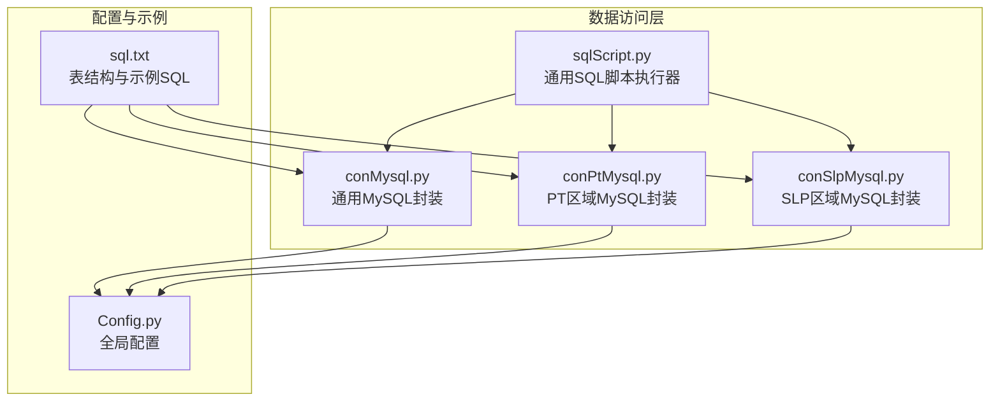
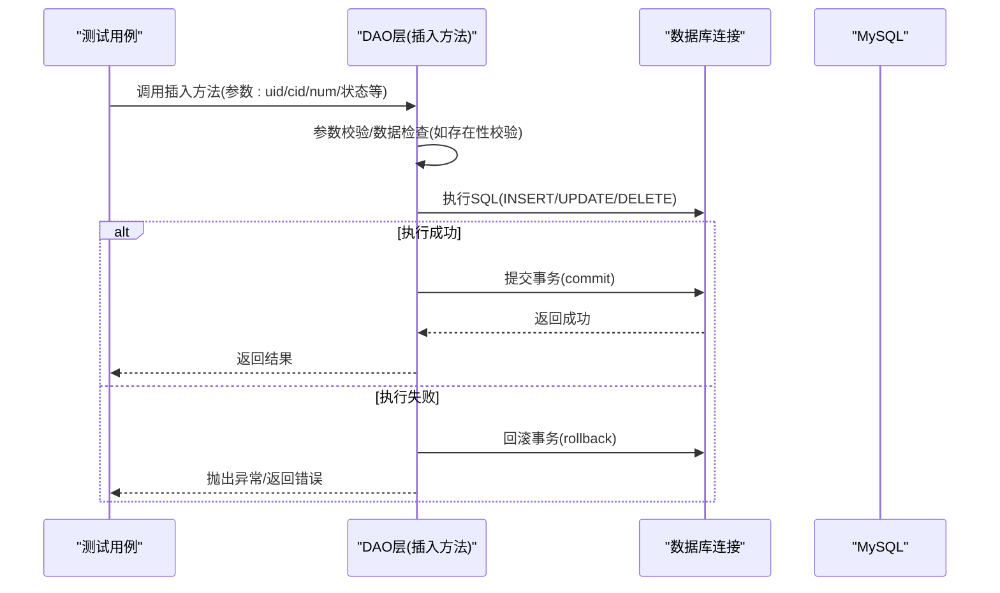
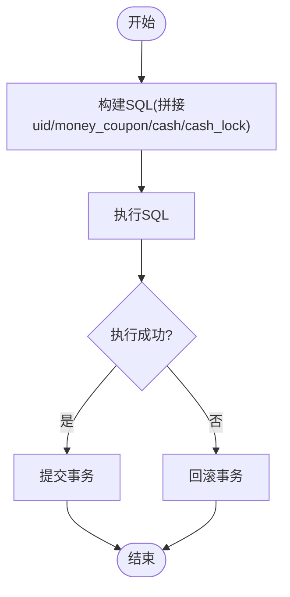
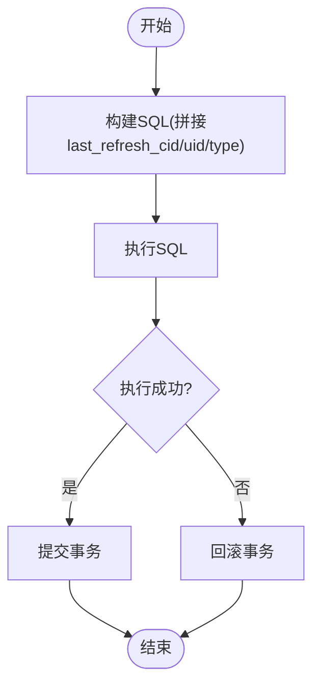
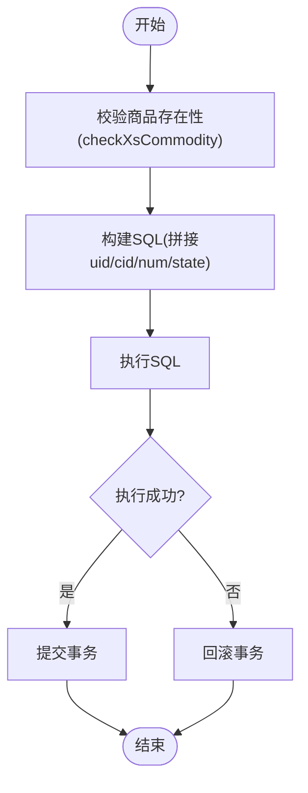
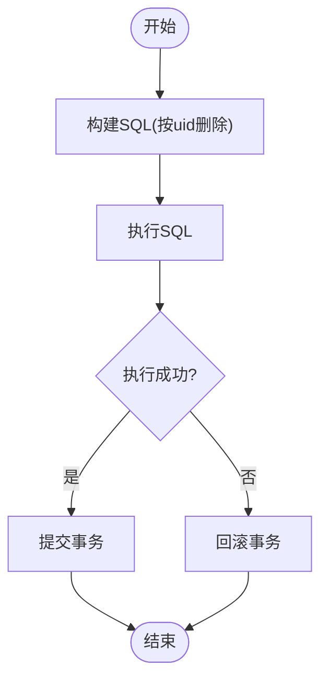
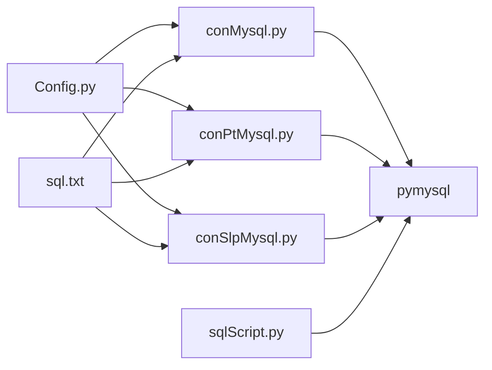

# 插入操作

<cite>
**本文引用的文件列表**
- [conMysql.py](file://common/conMysql.py)
- [conPtMysql.py](file://common/conPtMysql.py)
- [conSlpMysql.py](file://common/conSlpMysql.py)
- [sqlScript.py](file://common/sqlScript.py)
- [Config.py](file://common/Config.py)
- [sql.txt](file://caseStarify/sql.txt)
</cite>

## 目录
1. [简介](#简介)
2. [项目结构](#项目结构)
3. [核心组件](#核心组件)
4. [架构总览](#架构总览)
5. [详细组件分析](#详细组件分析)
6. [依赖关系分析](#依赖关系分析)
7. [性能考量](#性能考量)
8. [故障排查指南](#故障排查指南)
9. [结论](#结论)
10. [附录](#附录)

## 简介
本文件聚焦于数据访问层的插入操作模块，系统性梳理并解释以下关键插入方法的实现机制与运行流程：
- insertBeanSql：用户金豆余额插入
- insertXsUserBox：箱子刷新物品插入
- insertXsUserCommodity：用户背包物品插入

同时，结合现有代码对删除操作（deleteUserBeanSql）进行说明，并总结插入操作在参数校验、数据检查、事务处理、幂等性保障、重复数据处理与约束冲突解决方面的实践与建议。最后给出性能优化与批量插入策略。

## 项目结构
围绕插入操作的核心文件与职责如下：
- common/conMysql.py：统一的MySQL连接与常用数据库操作封装，包含插入、更新、删除、查询等方法
- common/conPtMysql.py：PT区域专用的MySQL封装，包含插入、更新、删除、查询等方法
- common/conSlpMysql.py：SLP区域专用的MySQL封装，包含插入、更新、删除、查询等方法
- common/sqlScript.py：通用SQL脚本执行器，提供基础连接与事务控制
- common/Config.py：全局配置，包含用户UID、礼物ID等常量
- caseStarify/sql.txt：数据库表与示例SQL，辅助理解表结构与典型操作

图表来源
- [conMysql.py:1-530](file://common/conMysql.py#L1-L530)
- [conPtMysql.py:1-345](file://common/conPtMysql.py#L1-L345)
- [conSlpMysql.py:1-680](file://common/conSlpMysql.py#L1-L680)
- [sqlScript.py:1-144](file://common/sqlScript.py#L1-L144)
- [Config.py:1-133](file://common/Config.py#L1-L133)
- [sql.txt:1-34](file://caseStarify/sql.txt#L1-L34)

章节来源
- [conMysql.py:1-530](file://common/conMysql.py#L1-L530)
- [conPtMysql.py:1-345](file://common/conPtMysql.py#L1-L345)
- [conSlpMysql.py:1-680](file://common/conSlpMysql.py#L1-L680)
- [sqlScript.py:1-144](file://common/sqlScript.py#L1-L144)
- [Config.py:1-133](file://common/Config.py#L1-L133)
- [sql.txt:1-34](file://caseStarify/sql.txt#L1-L34)

## 核心组件
- 统一插入入口（通用）：conMysql.insertBeanSql、conMysql.insertXsUserBox、conMysql.insertXsUserCommodity
- 区域化插入入口（PT/SKP）：conPtMysql.insertXsUserBox、conPtMysql.insertXsUserCommodity；conSlpMysql.insertXsUserCommodity
- 删除入口（通用）：conMysql.deleteUserBeanSql
- 通用SQL执行器：sqlScript.mysql（用于对比事务控制模式）

章节来源
- [conMysql.py:375-414](file://common/conMysql.py#L375-L414)
- [conPtMysql.py:240-263](file://common/conPtMysql.py#L240-L263)
- [conSlpMysql.py:490-502](file://common/conSlpMysql.py#L490-L502)
- [conMysql.py:363-374](file://common/conMysql.py#L363-L374)
- [sqlScript.py:111-123](file://common/sqlScript.py#L111-L123)

## 架构总览
插入操作遵循“SQL拼接 -> 执行 -> 异常回滚 -> 提交”的标准事务控制模式。不同封装在连接初始化、autocommit策略、异常处理细节上存在差异，但核心流程一致。

图表来源
- [conMysql.py:375-414](file://common/conMysql.py#L375-L414)
- [conPtMysql.py:240-263](file://common/conPtMysql.py#L240-L263)
- [conSlpMysql.py:490-502](file://common/conSlpMysql.py#L490-L502)
- [sqlScript.py:35-41](file://common/sqlScript.py#L35-L41)

## 详细组件分析

### insertBeanSql（用户金豆余额插入）
- 功能定位：向xs_user_money_extend表插入或更新用户金豆余额相关字段
- SQL构造：采用字符串格式化拼接，包含uid、money_coupon、cash、cash_lock等字段
- 参数校验：代码中未见显式参数校验逻辑，建议在调用前确保参数合法性
- 数据检查：通常通过业务前置校验或查询确认用户是否存在
- 事务处理：捕获异常后执行回滚，finally中提交事务
- 幂等性与冲突：若表存在唯一约束，重复插入可能触发唯一键冲突；建议在调用前先查询或使用UPSERT策略

图表来源
- [conMysql.py:375-387](file://common/conMysql.py#L375-L387)

章节来源
- [conMysql.py:375-387](file://common/conMysql.py#L375-L387)

### insertXsUserBox（箱子刷新物品插入）
- 功能定位：向xs_user_box表插入用户箱子刷新相关记录
- SQL构造：插入last_refresh_cid、last_refresh_sub_cid、uid、type字段
- 参数校验：代码中未见显式校验，建议在调用前校验box_type与gift_cid的有效性
- 数据检查：通常通过业务前置校验或查询确认用户存在
- 事务处理：捕获异常后执行回滚，finally中提交事务
- 幂等性与冲突：若表存在唯一约束（如uid唯一），重复插入可能触发冲突；建议在调用前先查询或使用UPSERT策略

图表来源
- [conMysql.py:390-400](file://common/conMysql.py#L390-L400)
- [conPtMysql.py:252-263](file://common/conPtMysql.py#L252-L263)

章节来源
- [conMysql.py:390-400](file://common/conMysql.py#L390-L400)
- [conPtMysql.py:252-263](file://common/conPtMysql.py#L252-L263)

### insertXsUserCommodity（用户背包物品插入）
- 功能定位：向xs_user_commodity表插入用户背包中的物品记录
- 参数校验：通用封装中在插入前调用checkXsCommodity校验商品是否存在，避免非法cid
- 数据检查：checkXsCommodity通过查询xs_commodity表确认cid存在
- SQL构造：插入uid、cid、num、state字段
- 事务处理：捕获异常后执行回滚，finally中提交事务
- 幂等性与冲突：若表存在唯一约束（如(uid,cid)组合唯一），重复插入可能触发冲突；建议在调用前先查询或使用UPSERT策略

图表来源
- [conMysql.py:402-414](file://common/conMysql.py#L402-L414)
- [conMysql.py:416-422](file://common/conMysql.py#L416-L422)
- [conPtMysql.py:239-250](file://common/conPtMysql.py#L239-L250)
- [conSlpMysql.py:490-502](file://common/conSlpMysql.py#L490-L502)

章节来源
- [conMysql.py:402-422](file://common/conMysql.py#L402-L422)
- [conPtMysql.py:239-250](file://common/conPtMysql.py#L239-L250)
- [conSlpMysql.py:490-502](file://common/conSlpMysql.py#L490-L502)

### deleteUserBeanSql（用户金豆余额删除）
- 功能定位：从xs_user_money_extend表删除用户金豆余额相关记录
- SQL构造：按uid删除一条记录
- 事务处理：捕获异常后执行回滚，finally中提交事务
- 注意：通用封装中存在sleep延迟，用于缓解并发压力

图表来源
- [conMysql.py:363-374](file://common/conMysql.py#L363-L374)

章节来源
- [conMysql.py:363-374](file://common/conMysql.py#L363-L374)

## 依赖关系分析
- DAO层依赖关系
  - conMysql、conPtMysql、conSlpMysql均依赖pymysql建立连接
  - 三者均提供insertXsUserCommodity与insertXsUserBox方法，但insertBeanSql仅在通用封装中实现
  - sqlScript.mysql提供通用连接与事务控制模式，可作为对比参考
- 配置依赖
  - Config.py提供用户UID、礼物ID等常量，影响插入参数的正确性
- 示例SQL
  - sql.txt展示了xs_user_commodity等表的典型插入与查询示例，有助于理解表结构与字段含义

图表来源
- [conMysql.py:1-25](file://common/conMysql.py#L1-L25)
- [conPtMysql.py:1-23](file://common/conPtMysql.py#L1-L23)
- [conSlpMysql.py:1-27](file://common/conSlpMysql.py#L1-L27)
- [sqlScript.py:1-27](file://common/sqlScript.py#L1-L27)
- [Config.py:1-133](file://common/Config.py#L1-L133)
- [sql.txt:1-34](file://caseStarify/sql.txt#L1-L34)

章节来源
- [conMysql.py:1-25](file://common/conMysql.py#L1-L25)
- [conPtMysql.py:1-23](file://common/conPtMysql.py#L1-L23)
- [conSlpMysql.py:1-27](file://common/conSlpMysql.py#L1-L27)
- [sqlScript.py:1-27](file://common/sqlScript.py#L1-L27)
- [Config.py:1-133](file://common/Config.py#L1-L133)
- [sql.txt:1-34](file://caseStarify/sql.txt#L1-L34)

## 性能考量
- 连接与autocommit
  - 通用封装使用autocommit=True，事务由应用层显式控制（try/except/finally commit/rollback）
  - 区域封装同样遵循显式事务控制，但连接初始化细节不同
- 并发与锁竞争
  - 通用封装在删除金豆余额时存在短暂sleep，用于缓解并发写入压力
  - 插入操作建议在高并发场景下引入重试与退避策略，避免热点冲突
- 批量插入
  - 当前插入方法逐条执行，建议在批量场景下合并为批量INSERT或使用UPSERT减少往返
  - 对于重复数据，优先考虑ON DUPLICATE KEY UPDATE或REPLACE INTO（需谨慎评估影响）
- 索引与约束
  - 若表存在唯一索引（如(uid,cid)），应避免重复插入；必要时使用UPSERT策略
  - 合理的索引设计可显著降低插入冲突概率与锁等待时间

章节来源
- [conMysql.py:17-25](file://common/conMysql.py#L17-L25)
- [conMysql.py:367-369](file://common/conMysql.py#L367-L369)
- [conPtMysql.py:15-23](file://common/conPtMysql.py#L15-L23)
- [conSlpMysql.py:19-27](file://common/conSlpMysql.py#L19-L27)

## 故障排查指南
- 异常处理
  - 通用封装在插入失败时执行回滚并打印错误信息，finally中提交事务
  - 区域封装同样遵循相同的异常处理模式
- 常见问题
  - 唯一键冲突：检查表是否存在唯一约束；在调用前查询或使用UPSERT
  - 参数非法：确保uid、cid、num等参数合法；通用封装对cid有存在性校验
  - 并发冲突：在高并发场景下增加重试与退避；必要时调整批量策略
- 日志与定位
  - 所有插入方法均输出错误信息，便于快速定位问题

章节来源
- [conMysql.py:375-387](file://common/conMysql.py#L375-L387)
- [conMysql.py:390-400](file://common/conMysql.py#L390-L400)
- [conMysql.py:402-414](file://common/conMysql.py#L402-L414)
- [conPtMysql.py:240-263](file://common/conPtMysql.py#L240-L263)
- [conSlpMysql.py:490-502](file://common/conSlpMysql.py#L490-L502)

## 结论
- 通用与区域封装在插入操作上保持一致的事务控制模式，具备良好的异常处理能力
- insertXsUserCommodity提供了商品存在性校验，增强了数据一致性
- 在高并发与批量场景下，建议引入批量插入、UPSERT策略与重试退避机制，以提升性能与稳定性
- 对于唯一约束冲突，应在业务层做好幂等性设计，避免重复插入

## 附录
- 表结构与示例SQL参考
  - xs_user_commodity：插入与删除示例
  - xs_user_money_extend：插入与删除示例
  - xs_user_box：插入与删除示例

章节来源
- [sql.txt:25-28](file://caseStarify/sql.txt#L25-L28)
- [sql.txt:10-12](file://caseStarify/sql.txt#L10-L12)
- [sql.txt:20-22](file://caseStarify/sql.txt#L20-L22)