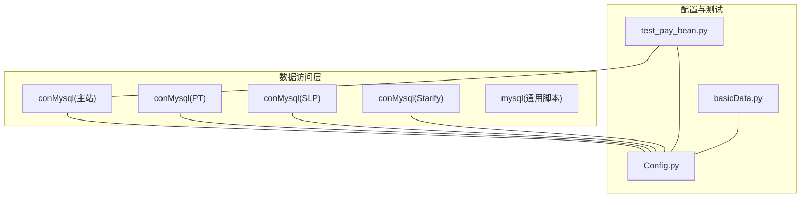
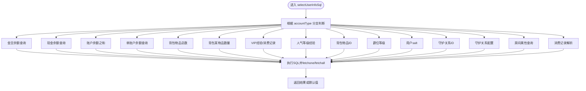
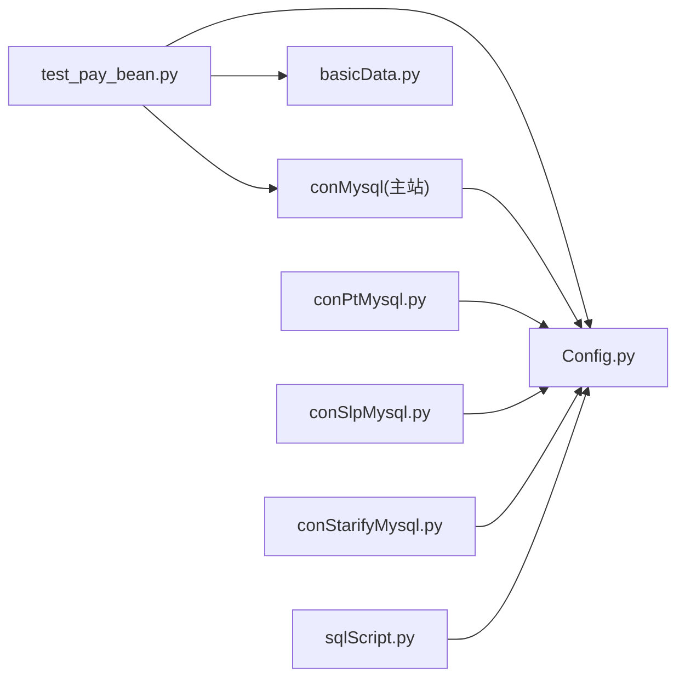

# 数据访问层

<cite>
**本文引用的文件列表**
- [conMysql.py](file://common/conMysql.py)
- [conPtMysql.py](file://common/conPtMysql.py)
- [conSlpMysql.py](file://common/conSlpMysql.py)
- [conStarifyMysql.py](file://common/conStarifyMysql.py)
- [sqlScript.py](file://common/sqlScript.py)
- [Config.py](file://common/Config.py)
- [test_pay_bean.py](file://case/test_pay_bean.py)
- [basicData.py](file://common/basicData.py)
</cite>

## 目录
1. [简介](#简介)
2. [项目结构](#项目结构)
3. [核心组件](#核心组件)
4. [架构总览](#架构总览)
5. [详细组件分析](#详细组件分析)
6. [依赖分析](#依赖分析)
7. [性能考虑](#性能考虑)
8. [故障排查指南](#故障排查指南)
9. [结论](#结论)
10. [附录](#附录)

## 简介
本文件面向QA支付测试自动化项目的“数据访问层”，系统性梳理其设计模式与架构原则，重点覆盖：
- 静态方法的使用与职责边界
- SQL查询封装与数据操作抽象化
- 用户账户查询方法 selectUserInfoSql 的实现原理（金豆余额、现金余额、背包物品、爵位等级等）
- 数据更新、删除与插入的实现机制（事务处理、错误回滚、数据一致性）
- 扩展方法（新增查询与操作接口）
- 性能优化策略、SQL 注入防护与查询缓存建议

## 项目结构
数据访问层主要由一组以静态方法为核心的数据库连接与操作类组成，分别针对不同业务域（如主站、海外PT、SLP、Starify）提供统一的查询与变更能力。同时存在一个通用脚本版数据访问模块，便于在工具脚本中快速执行SQL。

图表来源
- [conMysql.py:8-530](file://common/conMysql.py#L8-L530)
- [conPtMysql.py:6-345](file://common/conPtMysql.py#L6-L345)
- [conSlpMysql.py:8-680](file://common/conSlpMysql.py#L8-L680)
- [conStarifyMysql.py:6-148](file://common/conStarifyMysql.py#L6-L148)
- [sqlScript.py:5-145](file://common/sqlScript.py#L5-L145)
- [Config.py:6-133](file://common/Config.py#L6-L133)
- [test_pay_bean.py:1-277](file://case/test_pay_bean.py#L1-L277)
- [basicData.py:1-581](file://common/basicData.py#L1-L581)

章节来源
- [conMysql.py:1-530](file://common/conMysql.py#L1-L530)
- [conPtMysql.py:1-345](file://common/conPtMysql.py#L1-L345)
- [conSlpMysql.py:1-680](file://common/conSlpMysql.py#L1-L680)
- [conStarifyMysql.py:1-148](file://common/conStarifyMysql.py#L1-L148)
- [sqlScript.py:1-145](file://common/sqlScript.py#L1-L145)
- [Config.py:1-133](file://common/Config.py#L1-L133)
- [test_pay_bean.py:1-277](file://case/test_pay_bean.py#L1-L277)
- [basicData.py:1-581](file://common/basicData.py#L1-L581)

## 核心组件
- 主站数据访问类（conMysql）：提供用户账户查询、删除、更新、插入等方法，支持多账户类型与多表联动。
- PT数据访问类（conMysql）：面向海外业务域，提供账户查询、删除、更新、插入等方法，包含区域与房间信息查询。
- SLP数据访问类（conMysql）：面向SLP业务域，提供账户查询、删除、更新、插入等方法，包含成长值、爵位等级等扩展查询。
- Starify数据访问类（conMysql）：面向Starify业务域，提供账户余额、财富值、魅力值等查询与更新，以及背包与关系查询。
- 通用脚本数据访问类（mysql）：提供独立连接实例的查询与变更，便于工具脚本或批量任务使用。

章节来源
- [conMysql.py:27-530](file://common/conMysql.py#L27-L530)
- [conPtMysql.py:25-345](file://common/conPtMysql.py#L25-L345)
- [conSlpMysql.py:29-680](file://common/conSlpMysql.py#L29-L680)
- [conStarifyMysql.py:27-148](file://common/conStarifyMysql.py#L27-L148)
- [sqlScript.py:18-145](file://common/sqlScript.py#L18-L145)

## 架构总览
数据访问层采用“静态方法 + 单连接”的设计，通过统一的类方法对外暴露数据库操作能力，避免跨模块共享连接带来的并发问题。各业务域类均持有独立的连接与游标，确保隔离性与可控性。

```mermaid
classDiagram
class ConMysql_Main {
+selectUserInfoSql(accountType, uid, money_type, cid)
+deleteUserAccountSql(tableName, uid)
+updateUserInfoSql(tableName, uid, ...)
+updateMoneySql(uid, ...)
+insertBeanSql(uid, money_coupon, ...)
+insertXsUserCommodity(uid, cid, num, state)
+checkXsCommodity(cid, name)
+checkUserXsBroker(bid)
+checkUserXsMentorLevel(uid, level)
+checkUserBroker(uid, bid)
+checkBrokerUserRate(uid, creater, rate)
}
class ConMysql_PT {
+selectUserInfoSql(accountType, uid, money_type)
+deleteUserAccountSql(tableName, uid)
+updateUserRidInfoSql(property_rid, rid, area)
+updateUserBigArea(*uids, bigarea_id)
+updateUserLanguage(*uids, language, area_code)
+updateMoneySql(uid, ...)
+insertXsUserCommodity(uid, cid, num, state)
+insertXsUserBox(uid, gift_cid, box_type)
+select_greedy_prize(uid, round_id)
+select_user_chatroom(property, bigarea_id)
+updateXsUserpopularity(uid)
+sqlXsUserpopularity(uid)
+updateXsUserprofile_pay_room_money(uid)
+sqlXsUserprofile_pay_room_money(uid)
}
class ConMysql_SLP {
+selectUserInfoSql(accountType, uid, money_type, cid, payuid)
+deleteUserAccountSql(tableName, uid)
+updateUserInfoSql(tableName, uid, level)
+updateMoneySql(uid, ...)
+insertXsUserCommodity(uid, cid, num, state)
+checkRidFactoryType(rid)
+updateUserGodSql(uid, agreement_version)
+selectZxPayData(uid)
+checkUserBroker(uid)
}
class ConMysql_Starify {
+sql_fetchone(sql)
+sql_execute(sql)
+selectUserInfoSql(accountType, uid, cid, duration_time)
+updateMoneySql(uid, money)
+updateWealthSql(uid, wealth, pre_wealth)
+updateCharmSql(uid, charm)
+deleteUserAccountSql(tableName, uid, wid)
+insertXsUserCommodity(uid, cid, num, period_end)
+deleteProducerSinger(singer_uid)
+selectProducerSinger(producer_uid)
+updateSingerWorth(singer_uid, worth)
}
class Mysql_Generic {
+conMysql()
+updateMoneySql(uid, ...)
+selectAllMoneySql(uid)
+deleteUserCommoditySql(uid)
+checkUserCommoditySql(uid, cid)
+checkUserAllCommoditySql(uid)
+getUserCommodityIdSql(cid, uid)
+insertXsUserCommodity(uid, cid, num, state)
+getUids(limit_num)
}
```

图表来源
- [conMysql.py:8-530](file://common/conMysql.py#L8-L530)
- [conPtMysql.py:6-345](file://common/conPtMysql.py#L6-L345)
- [conSlpMysql.py:8-680](file://common/conSlpMysql.py#L8-L680)
- [conStarifyMysql.py:6-148](file://common/conStarifyMysql.py#L6-L148)
- [sqlScript.py:5-145](file://common/sqlScript.py#L5-L145)

## 详细组件分析

### 组件A：主站数据访问类（conMysql）
- 设计要点
  - 使用静态方法统一入口，避免连接共享引发的并发问题。
  - 在类初始化阶段建立连接并选择数据库，确保后续操作可用。
  - 提供丰富的账户查询与操作方法，覆盖金豆、现金、背包、爵位、人气、守护关系、房间属性等。
- 关键方法
  - 用户账户查询：selectUserInfoSql(accountType, uid, money_type, cid)
  - 删除用户数据：deleteUserAccountSql(tableName, uid)
  - 更新用户数据：updateUserInfoSql(tableName, uid, ...)
  - 余额更新：updateMoneySql(uid, ...)
  - 金豆余额增删改：insertBeanSql、deleteUserBeanSql
  - 背包与商品：insertXsUserCommodity、checkXsCommodity
  - 工会与导师：checkUserXsBroker、checkUserXsMentorLevel、checkBrokerUserRate
- 事务与一致性
  - 所有写操作均在 try-except 中执行，异常时调用 con.rollback()，最终 con.commit() 提交，保证原子性。
  - 部分方法内部对异常进行捕获并打印，便于定位问题。
- 安全性
  - 当前实现存在字符串拼接式SQL，存在SQL注入风险；建议改为参数化查询或ORM。
- 性能
  - 部分方法使用 time.sleep 进行微延迟，可能影响并发性能；建议移除或改为更合理的重试策略。

图表来源
- [conMysql.py:27-204](file://common/conMysql.py#L27-L204)

章节来源
- [conMysql.py:27-530](file://common/conMysql.py#L27-L530)

### 组件B：PT数据访问类（conMysql）
- 设计要点
  - 面向海外业务域，提供账户查询、区域与房间信息、语言设置、大区设置等方法。
  - 支持多账户余额更新与背包物品插入。
- 关键方法
  - 用户账户查询：selectUserInfoSql(accountType, uid, money_type)
  - 删除用户数据：deleteUserAccountSql(tableName, uid)
  - 更新房间与大区：updateUserRidInfoSql、updateUserBigArea、updateUserLanguage
  - 余额更新：updateMoneySql、updateUserMoneyClearSql、updateUserextendMoneyClearSql
  - 背包与箱子：insertXsUserCommodity、insertXsUserBox
  - 房间与人气：select_user_chatroom、updateXsUserpopularity、sqlXsUserpopularity、updateXsUserprofile_pay_room_money、sqlXsUserprofile_pay_room_money
- 事务与一致性
  - 同样采用 try-except + rollback + commit 的模式，确保写操作原子性。
- 安全性
  - 存在字符串拼接式SQL，建议改为参数化查询。
- 性能
  - 方法内部未见显式的sleep延迟，整体并发友好度较好。

章节来源
- [conPtMysql.py:25-345](file://common/conPtMysql.py#L25-L345)

### 组件C：SLP数据访问类（conMysql）
- 设计要点
  - 面向SLP业务域，提供账户查询、删除、更新、插入等方法，包含成长值、爵位等级等扩展查询。
  - 提供房间工厂类型查询、大神认证更新、甄选礼盒打赏数据查询等。
- 关键方法
  - 用户账户查询：selectUserInfoSql(accountType, uid, money_type, cid, payuid)
  - 删除用户数据：deleteUserAccountSql(tableName, uid)
  - 更新用户数据：updateUserInfoSql(tableName, uid, level)
  - 余额更新：updateMoneySql、updateUserMoneyClearSql
  - 背包与商品：insertXsUserCommodity、checkXsCommodity
  - 房间与认证：checkRidFactoryType、updateUserGodSql
  - 甄选数据：selectZxPayData、checkUserBroker
- 事务与一致性
  - 采用统一的异常处理与提交策略。
- 安全性
  - 存在字符串拼接式SQL，建议改为参数化查询。
- 性能
  - 部分方法内部未见显式延迟，整体并发友好度较好。

章节来源
- [conSlpMysql.py:29-680](file://common/conSlpMysql.py#L29-L680)

### 组件D：Starify数据访问类（conMysql）
- 设计要点
  - 面向Starify业务域，提供账户余额、财富值、魅力值等查询与更新，以及背包与关系查询。
  - 提供通用的 sql_fetchone 与 sql_execute 封装，简化读写流程。
- 关键方法
  - 通用封装：sql_fetchone(sql)、sql_execute(sql)
  - 用户账户查询：selectUserInfoSql(accountType, uid, cid, duration_time)
  - 余额更新：updateMoneySql(uid, money)、updateWealthSql(uid, wealth, pre_wealth)、updateCharmSql(uid, charm)
  - 删除用户数据：deleteUserAccountSql(tableName, uid, wid)
  - 背包与关系：insertXsUserCommodity(uid, cid, num, period_end)、deleteProducerSinger(singer_uid)、selectProducerSinger(producer_uid)、updateSingerWorth(singer_uid, worth)
- 事务与一致性
  - 采用统一的异常处理与提交策略。
- 安全性
  - 存在字符串拼接式SQL，建议改为参数化查询。
- 性能
  - 通用封装简化了重复代码，有利于提升开发效率。

章节来源
- [conStarifyMysql.py:27-148](file://common/conStarifyMysql.py#L27-L148)

### 组件E：通用脚本数据访问类（mysql）
- 设计要点
  - 每次操作新建连接与游标，适合工具脚本或批处理任务。
  - 提供余额更新、余额汇总查询、背包清理与插入、UID批量获取等方法。
- 关键方法
  - 连接获取：conMysql()
  - 余额更新：updateMoneySql(uid, ...)
  - 余额汇总：selectAllMoneySql(uid)
  - 背包清理与查询：deleteUserCommoditySql(uid)、checkUserCommoditySql(uid, cid)、checkUserAllCommoditySql(uid)、getUserCommodityIdSql(cid, uid)
  - 背包插入：insertXsUserCommodity(uid, cid, num, state)
  - UID批量：getUids(limit_num)
- 事务与一致性
  - 每次操作独立连接，异常时 rollback 并 commit，保证单次操作原子性。
- 安全性
  - 存在字符串拼接式SQL，建议改为参数化查询。
- 性能
  - 每次新建连接，适合短时任务；长时高频任务建议复用连接池。

章节来源
- [sqlScript.py:18-145](file://common/sqlScript.py#L18-L145)

### 组件F：配置与测试集成
- 配置中心（Config.py）
  - 提供用户ID、房间ID、礼物ID、大区ID等常量，贯穿测试与数据访问层。
- 测试用例（test_pay_bean.py）
  - 展示数据访问层在实际测试中的使用：setUp/tearDown中清理金豆数据，测试前后验证数据库状态。
  - 使用 selectUserInfoSql 验证金豆余额、钻石余额、VIP经验等。
- 请求编码（basicData.py）
  - 提供多种支付场景的请求参数编码，配合数据访问层构造测试数据。

章节来源
- [Config.py:6-133](file://common/Config.py#L6-L133)
- [test_pay_bean.py:12-277](file://case/test_pay_bean.py#L12-L277)
- [basicData.py:8-581](file://common/basicData.py#L8-L581)

## 依赖分析
- 模块耦合
  - 各业务域数据访问类之间低耦合，通过统一的静态方法接口交互。
  - 测试用例依赖配置中心与数据访问类，形成清晰的测试驱动链路。
- 外部依赖
  - 使用pymysql进行数据库连接与操作。
  - 通过Config提供运行时参数（如用户ID、房间ID、礼物ID等）。
- 循环依赖
  - 未发现循环依赖迹象，模块间关系清晰。

图表来源
- [test_pay_bean.py:1-277](file://case/test_pay_bean.py#L1-L277)
- [conMysql.py:1-530](file://common/conMysql.py#L1-L530)
- [conPtMysql.py:1-345](file://common/conPtMysql.py#L1-L345)
- [conSlpMysql.py:1-680](file://common/conSlpMysql.py#L1-L680)
- [conStarifyMysql.py:1-148](file://common/conStarifyMysql.py#L1-L148)
- [sqlScript.py:1-145](file://common/sqlScript.py#L1-L145)
- [Config.py:1-133](file://common/Config.py#L1-L133)
- [basicData.py:1-581](file://common/basicData.py#L1-L581)

## 性能考虑
- 连接管理
  - 主站与PT/SKP/Starify类采用单连接复用，减少连接开销，适合高并发场景。
  - 通用脚本类每次新建连接，适合短时任务；建议在批量任务中引入连接池。
- 异步与并发
  - 部分方法使用 time.sleep 进行微延迟，可能影响吞吐；建议移除或替换为更合理的重试/退避策略。
- 查询优化
  - 对频繁查询的字段建议建立索引（如 uid、cid、rid 等）。
  - 复杂聚合查询（如 sum(num)）建议在业务层做缓存或预计算。
- 缓存策略
  - 可在业务层引入轻量级缓存（如内存字典或Redis），对热点数据进行缓存，降低数据库压力。
  - 缓存失效策略：基于时间窗口或事件触发（如写操作后失效）。

[本节为通用性能讨论，无需特定文件引用]

## 故障排查指南
- 常见问题
  - SQL注入风险：当前多处使用字符串拼接构造SQL，建议改为参数化查询或ORM。
  - 异常处理：部分方法仅打印错误，未抛出异常，导致上层难以感知失败；建议统一抛出异常或返回明确错误码。
  - 并发冲突：单连接在高并发下可能出现锁等待；建议引入连接池或拆分连接。
  - 数据一致性：部分方法内部存在 sleep，可能造成竞态；建议移除或改为更稳健的同步机制。
- 排查步骤
  - 确认数据库连接状态与权限。
  - 检查SQL执行日志与异常栈。
  - 验证参数合法性（uid、cid、rid等）。
  - 核对事务提交与回滚路径。
- 相关实现参考
  - 写操作的异常处理与提交流程：[conMysql.py:206-272](file://common/conMysql.py#L206-L272)、[conPtMysql.py:95-143](file://common/conPtMysql.py#L95-L143)、[conSlpMysql.py:227-321](file://common/conSlpMysql.py#L227-L321)、[conStarifyMysql.py:42-51](file://common/conStarifyMysql.py#L42-L51)、[sqlScript.py:35-78](file://common/sqlScript.py#L35-L78)

章节来源
- [conMysql.py:206-272](file://common/conMysql.py#L206-L272)
- [conPtMysql.py:95-143](file://common/conPtMysql.py#L95-L143)
- [conSlpMysql.py:227-321](file://common/conSlpMysql.py#L227-L321)
- [conStarifyMysql.py:42-51](file://common/conStarifyMysql.py#L42-L51)
- [sqlScript.py:35-78](file://common/sqlScript.py#L35-L78)

## 结论
数据访问层通过静态方法封装数据库操作，实现了对多业务域的统一支持。其优点在于接口简洁、易于测试集成；缺点在于存在SQL注入风险、部分方法的异常处理与并发控制有待完善。建议优先完成参数化查询改造与连接池引入，再逐步优化事务与缓存策略，以进一步提升安全性、稳定性与性能。

[本节为总结性内容，无需特定文件引用]

## 附录

### 扩展方法指南：如何新增查询与操作接口
- 新增查询方法
  - 在目标业务域类中添加静态方法，遵循现有命名规范（如 selectUserInfoSql）。
  - 明确 accountType 或参数映射，避免硬编码SQL字符串。
  - 在异常处理中统一返回默认值或抛出异常。
- 新增操作方法
  - 在目标业务域类中添加静态方法，遵循现有写操作模式（try-except + rollback + commit）。
  - 对外暴露最小必要参数，避免过度耦合。
  - 在测试用例中补充断言，确保行为正确。
- 示例参考
  - 新增查询：参考 [conMysql.py:27-204](file://common/conMysql.py#L27-L204)、[conPtMysql.py:25-93](file://common/conPtMysql.py#L25-L93)、[conSlpMysql.py:29-226](file://common/conSlpMysql.py#L29-L226)、[conStarifyMysql.py:54-70](file://common/conStarifyMysql.py#L54-L70)
  - 新增写操作：参考 [conMysql.py:206-530](file://common/conMysql.py#L206-L530)、[conPtMysql.py:95-345](file://common/conPtMysql.py#L95-L345)、[conSlpMysql.py:227-680](file://common/conSlpMysql.py#L227-L680)、[conStarifyMysql.py:71-148](file://common/conStarifyMysql.py#L71-L148)

### SQL注入防护与查询缓存建议
- SQL注入防护
  - 将所有动态参数通过参数绑定传递给SQL执行器，避免字符串拼接。
  - 对外部输入进行白名单校验与长度限制。
- 查询缓存
  - 对热点查询（如用户余额、背包统计）引入本地缓存或Redis缓存。
  - 设置合理的TTL与失效策略，结合写操作触发缓存失效。

[本节为通用建议，无需特定文件引用]