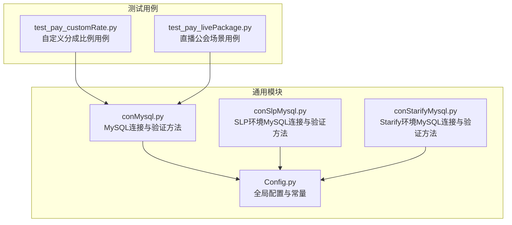
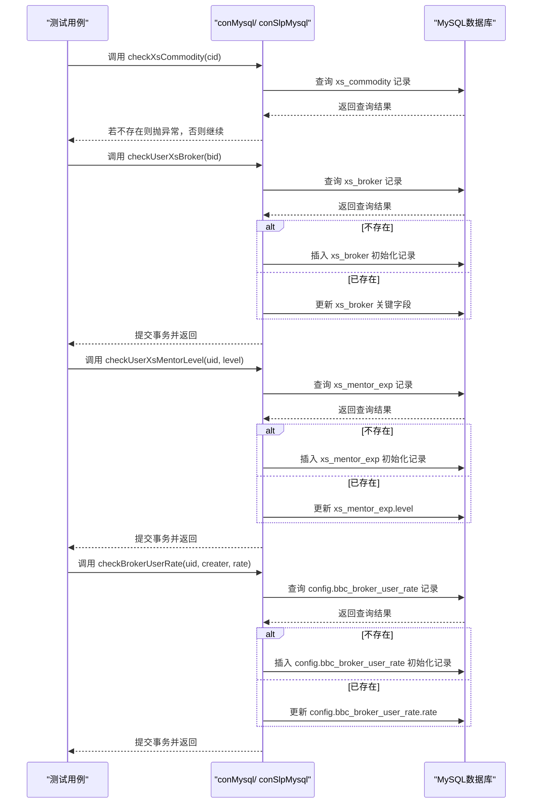
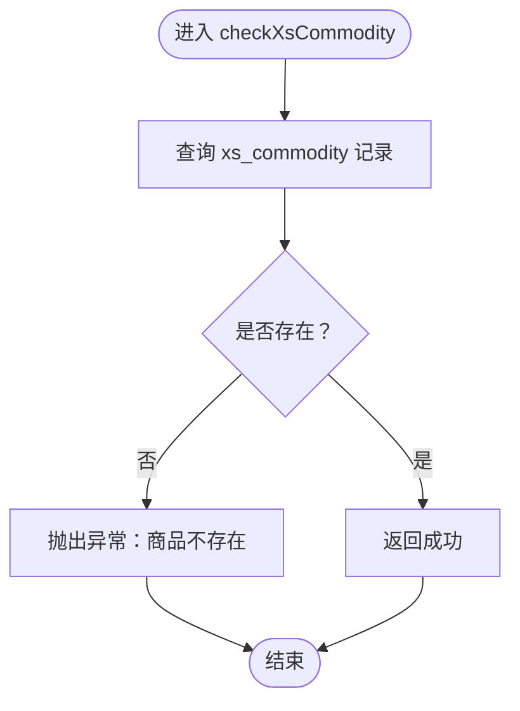
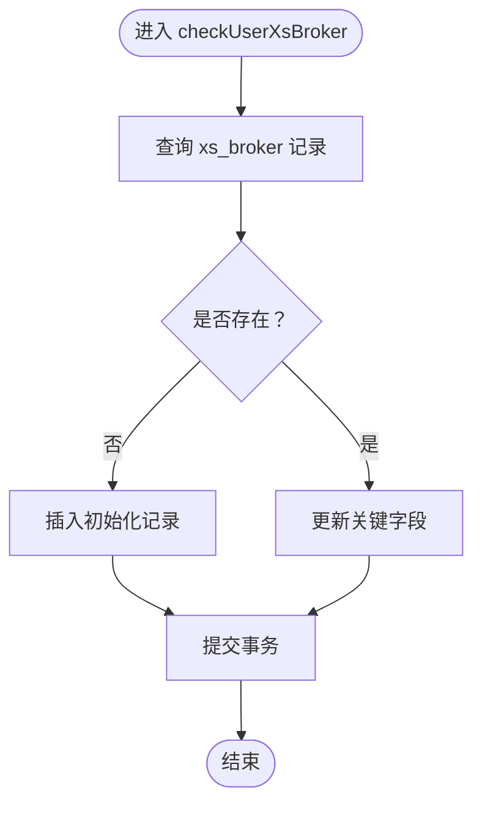
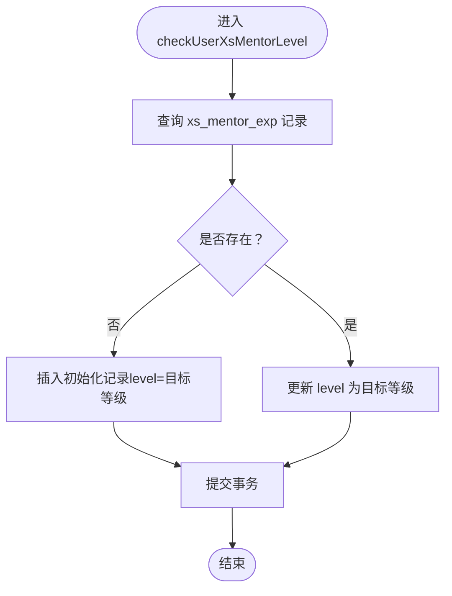
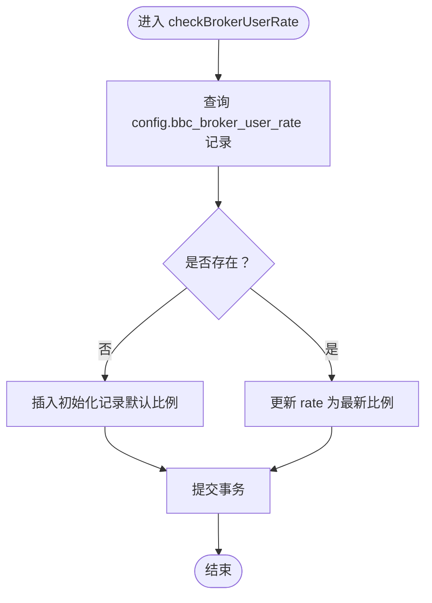
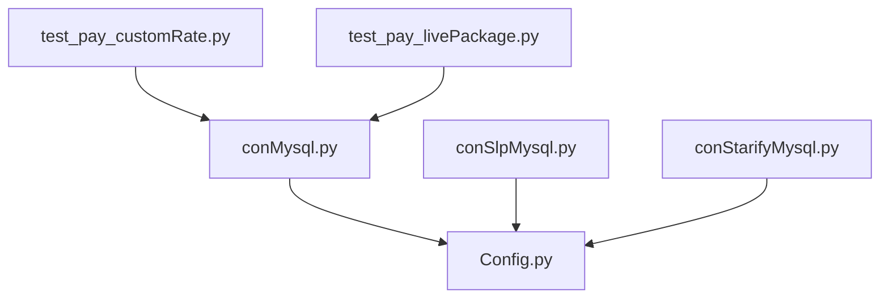

# 数据验证

<cite>
**本文引用的文件列表**
- [conMysql.py](file://common/conMysql.py)
- [conSlpMysql.py](file://common/conSlpMysql.py)
- [test_pay_customRate.py](file://case/test_pay_customRate.py)
- [test_pay_livePackage.py](file://case/test_pay_livePackage.py)
- [Config.py](file://common/Config.py)
- [conStarifyMysql.py](file://common/conStarifyMysql.py)
</cite>

## 目录
1. [简介](#简介)
2. [项目结构](#项目结构)
3. [核心组件](#核心组件)
4. [架构概览](#架构概览)
5. [详细组件分析](#详细组件分析)
6. [依赖分析](#依赖分析)
7. [性能考虑](#性能考虑)
8. [故障排查指南](#故障排查指南)
9. [结论](#结论)
10. [附录](#附录)

## 简介
本技术文档聚焦于数据访问层的数据验证模块，系统性解析以下关键方法的实现原理与使用场景：
- checkXsCommodity：商品存在性检查
- checkUserXsBroker：工会数据初始化
- checkUserXsMentorLevel：师父等级设置
- checkBrokerUserRate：用户分成比例配置

文档将从架构设计、数据流、处理逻辑、集成点、异常处理与性能特征等方面进行深入剖析，并提供最佳实践建议，包括前置检查机制、自动初始化策略与数据完整性保障。

## 项目结构
该仓库采用按功能域划分的组织方式，数据验证相关代码集中在通用数据库访问类中，测试用例覆盖多种业务场景下的验证与初始化流程。

图表来源
- [conMysql.py:1-530](file://common/conMysql.py#L1-L530)
- [conSlpMysql.py:1-680](file://common/conSlpMysql.py#L1-L680)
- [conStarifyMysql.py:1-52](file://common/conStarifyMysql.py#L1-L52)
- [test_pay_customRate.py:1-172](file://case/test_pay_customRate.py#L1-L172)
- [test_pay_livePackage.py:1-248](file://case/test_pay_livePackage.py#L1-L248)
- [Config.py:1-133](file://common/Config.py#L1-L133)

章节来源
- [conMysql.py:1-530](file://common/conMysql.py#L1-L530)
- [conSlpMysql.py:1-680](file://common/conSlpMysql.py#L1-L680)
- [test_pay_customRate.py:1-172](file://case/test_pay_customRate.py#L1-L172)
- [test_pay_livePackage.py:1-248](file://case/test_pay_livePackage.py#L1-L248)
- [Config.py:1-133](file://common/Config.py#L1-L133)

## 核心组件
本节概述四个关键验证方法的功能职责与调用关系，便于快速定位与使用。

- checkXsCommodity
  - 功能：校验商品是否存在，若不存在则抛出异常，阻止后续业务流程继续执行。
  - 使用场景：在插入或使用用户背包商品前，确保商品配置有效。
  - 关键实现位置：[conMysql.py:416-423](file://common/conMysql.py#L416-L423)、[conSlpMysql.py:504-511](file://common/conSlpMysql.py#L504-L511)

- checkUserXsBroker
  - 功能：确保工会记录存在并维护关键字段；若不存在则自动初始化；若已存在则更新关键字段。
  - 使用场景：在涉及公会场景的业务流程前，保证工会数据完备。
  - 关键实现位置：[conMysql.py:425-449](file://common/conMysql.py#L425-L449)、[conSlpMysql.py:513-537](file://common/conSlpMysql.py#L513-L537)

- checkUserXsMentorLevel
  - 功能：确保用户“师父”等级记录存在；若不存在则初始化为指定等级；若已存在则更新为指定等级。
  - 使用场景：在需要区分“一代宗师”与非一代宗师的业务场景中，统一师父等级状态。
  - 关键实现位置：[conMysql.py:452-475](file://common/conMysql.py#L452-L475)、[conSlpMysql.py:540-563](file://common/conSlpMysql.py#L540-L563)

- checkBrokerUserRate
  - 功能：确保用户分成比例配置存在；若不存在则初始化默认值；若已存在则更新为最新值。
  - 使用场景：在需要按用户维度配置分成比例的业务中，保证配置一致性。
  - 关键实现位置：[conMysql.py:504-529](file://common/conMysql.py#L504-L529)

章节来源
- [conMysql.py:416-529](file://common/conMysql.py#L416-L529)
- [conSlpMysql.py:504-563](file://common/conSlpMysql.py#L504-L563)

## 架构概览
数据验证模块位于测试基础设施层，通过统一的数据库访问类封装对业务无关的前置检查与自动初始化逻辑，确保测试用例在不同环境下的一致性与稳定性。

图表来源
- [conMysql.py:416-529](file://common/conMysql.py#L416-L529)
- [conSlpMysql.py:504-563](file://common/conSlpMysql.py#L504-L563)

## 详细组件分析

### 商品存在性检查：checkXsCommodity
- 设计要点
  - 单一职责：仅负责校验商品存在性，失败时立即抛出异常，避免后续流程继续执行。
  - 前置检查：在插入或使用用户背包商品前调用，确保业务数据与配置一致。
  - 异常语义：当商品不存在时，明确提示具体商品名称，便于定位问题。
- 实现模式
  - 查询 xs_commodity 表，若无记录则抛出异常。
  - 与 insertXsUserCommodity 组合使用，形成“先校验，再写入”的安全流程。
- 性能与复杂度
  - 查询复杂度 O(1)，依赖唯一索引或主键命中。
  - 无循环或递归，开销极低。
- 最佳实践
  - 在业务入口处统一调用，避免重复校验。
  - 对异常进行捕获并记录，便于问题追踪。

图表来源
- [conMysql.py:416-423](file://common/conMysql.py#L416-L423)
- [conSlpMysql.py:504-511](file://common/conSlpMysql.py#L504-L511)

章节来源
- [conMysql.py:416-423](file://common/conMysql.py#L416-L423)
- [conSlpMysql.py:504-511](file://common/conSlpMysql.py#L504-L511)

### 工会数据初始化：checkUserXsBroker
- 设计要点
  - 自动初始化：若工会不存在，则按固定模板插入一条记录；若已存在，则更新关键字段。
  - 数据完整性：确保 xs_broker 表的关键字段（如创建者、类型等）处于预期状态。
  - 事务控制：每个分支均包含 try-except 和 finally 中的提交，保证事务一致性。
- 实现模式
  - 先查询 xs_broker，再根据结果选择插入或更新。
  - 与业务场景结合：在需要公会成员资格或公会属性的流程前调用。
- 性能与复杂度
  - 查询与写入均为单条记录操作，时间复杂度 O(1)。
  - 依赖 xs_broker 的主键或唯一索引。
- 最佳实践
  - 在业务开始前统一调用，避免中途因缺少工会数据导致失败。
  - 对异常进行捕获与日志记录，便于定位初始化失败原因。

图表来源
- [conMysql.py:425-449](file://common/conMysql.py#L425-L449)
- [conSlpMysql.py:513-537](file://common/conSlpMysql.py#L513-L537)

章节来源
- [conMysql.py:425-449](file://common/conMysql.py#L425-L449)
- [conSlpMysql.py:513-537](file://common/conSlpMysql.py#L513-L537)

### 师父等级设置：checkUserXsMentorLevel
- 设计要点
  - 等级标准化：若用户没有师父等级记录，则初始化为指定等级；若已有记录，则更新为指定等级。
  - 场景适配：用于区分“一代宗师”与非一代宗师的业务逻辑。
- 实现模式
  - 查询 xs_mentor_exp，根据结果选择插入或更新。
  - 与业务配置结合：在需要调整师父等级的测试用例中统一调用。
- 性能与复杂度
  - 单条记录操作，时间复杂度 O(1)。
- 最佳实践
  - 在测试用例开始前统一设置，避免中间态导致的计算偏差。
  - 对异常进行捕获与日志记录，便于定位初始化失败原因。

图表来源
- [conMysql.py:452-475](file://common/conMysql.py#L452-L475)
- [conSlpMysql.py:540-563](file://common/conSlpMysql.py#L540-L563)

章节来源
- [conMysql.py:452-475](file://common/conMysql.py#L452-L475)
- [conSlpMysql.py:540-563](file://common/conSlpMysql.py#L540-L563)

### 用户分成比例配置：checkBrokerUserRate
- 设计要点
  - 配置化：支持按用户维度配置分成比例，若不存在则初始化，已存在则更新。
  - 业务关联：与公会分成、平台抽成等业务规则强相关。
- 实现模式
  - 查询 config.bbc_broker_user_rate，根据结果选择插入或更新。
  - 与测试用例结合：在需要自定义分成比例的场景中统一调用。
- 性能与复杂度
  - 单条记录操作，时间复杂度 O(1)。
- 最佳实践
  - 在业务流程开始前统一设置，避免中间态导致的计算偏差。
  - 对异常进行捕获与日志记录，便于定位初始化失败原因。

图表来源
- [conMysql.py:504-529](file://common/conMysql.py#L504-L529)

章节来源
- [conMysql.py:504-529](file://common/conMysql.py#L504-L529)

## 依赖分析
- 模块耦合
  - 四个验证方法均依赖 MySQL 连接与游标，遵循统一的事务管理与异常处理模式。
  - 测试用例通过统一的 conMysql 类调用验证方法，降低用例与底层实现的耦合。
- 外部依赖
  - MySQL 驱动：pymysql。
  - 配置：Config.py 提供全局配置与常量。
- 循环依赖
  - 未发现循环依赖，模块间关系清晰。

图表来源
- [test_pay_customRate.py:1-172](file://case/test_pay_customRate.py#L1-L172)
- [test_pay_livePackage.py:1-248](file://case/test_pay_livePackage.py#L1-L248)
- [conMysql.py:1-530](file://common/conMysql.py#L1-L530)
- [conSlpMysql.py:1-680](file://common/conSlpMysql.py#L1-L680)
- [conStarifyMysql.py:1-52](file://common/conStarifyMysql.py#L1-L52)
- [Config.py:1-133](file://common/Config.py#L1-L133)

章节来源
- [test_pay_customRate.py:1-172](file://case/test_pay_customRate.py#L1-L172)
- [test_pay_livePackage.py:1-248](file://case/test_pay_livePackage.py#L1-L248)
- [conMysql.py:1-530](file://common/conMysql.py#L1-L530)
- [conSlpMysql.py:1-680](file://common/conSlpMysql.py#L1-L680)
- [conStarifyMysql.py:1-52](file://common/conStarifyMysql.py#L1-L52)
- [Config.py:1-133](file://common/Config.py#L1-L133)

## 性能考虑
- 查询与写入均为单条记录操作，复杂度 O(1)，对整体性能影响极小。
- 事务管理采用每步操作后提交，避免长事务带来的锁竞争与资源占用。
- 建议
  - 在批量初始化场景中，尽量合并多次调用，减少往返次数。
  - 对频繁调用的方法进行缓存或去重，避免重复初始化。

## 故障排查指南
- 异常处理
  - 商品不存在：抛出明确异常，提示具体商品名称，便于定位问题。
  - 初始化失败：在 try-except 中捕获异常并打印错误信息，随后提交事务。
- 日志记录
  - 所有异常与错误均通过 print 输出，便于快速定位问题。
- 错误恢复
  - 每次写入操作均包含 rollback 与 commit，确保数据库状态一致。
- 常见问题
  - 商品ID错误：检查商品ID是否存在于 xs_commodity。
  - 工会ID错误：检查工会ID是否存在于 xs_broker。
  - 用户师父等级异常：检查 xs_mentor_exp 是否存在对应记录。
  - 分成比例异常：检查 config.bbc_broker_user_rate 是否存在对应记录。

章节来源
- [conMysql.py:416-529](file://common/conMysql.py#L416-L529)
- [conSlpMysql.py:504-563](file://common/conSlpMysql.py#L504-L563)

## 结论
数据验证模块通过四个核心方法实现了对商品、工会、师父等级与分成比例的前置检查与自动初始化，确保测试用例在不同环境与场景下的一致性与稳定性。其设计遵循单一职责、事务一致性与异常显式化的原则，配合测试用例的统一调用，形成了可靠的基础设施层支撑。

## 附录
- 使用示例（测试用例）
  - 自定义分成比例：在测试用例中统一调用 checkBrokerUserRate 设置用户分成比例。
  - 直播公会场景：在测试用例中统一调用 checkUserXsBroker 与 checkUserXsMentorLevel 初始化公会与师父等级。
- 最佳实践清单
  - 在业务入口处统一调用验证方法，避免重复校验。
  - 对异常进行捕获与日志记录，便于问题追踪。
  - 在批量初始化场景中合并多次调用，减少往返次数。
  - 对频繁调用的方法进行缓存或去重，避免重复初始化。