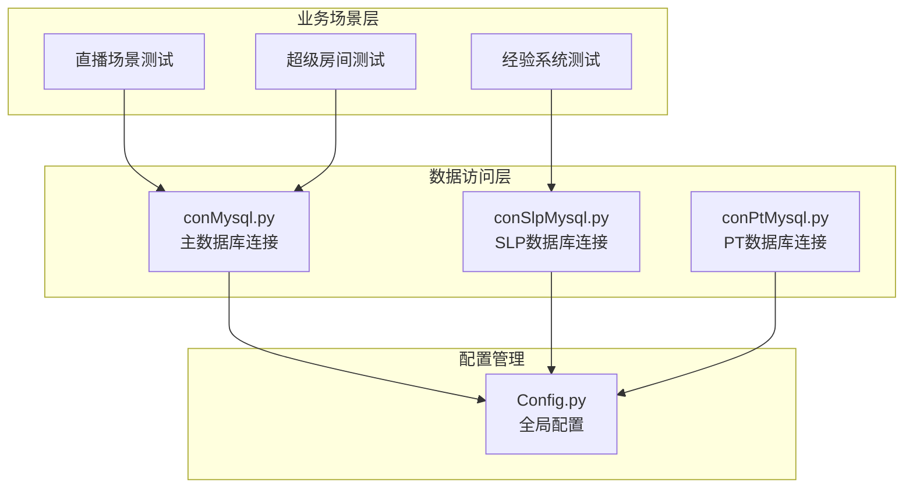
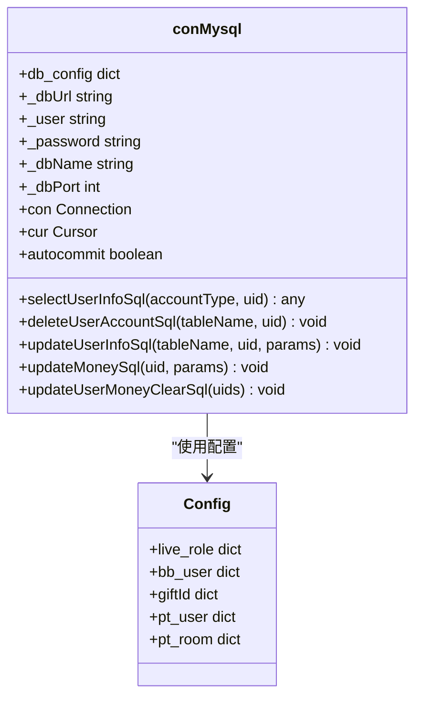
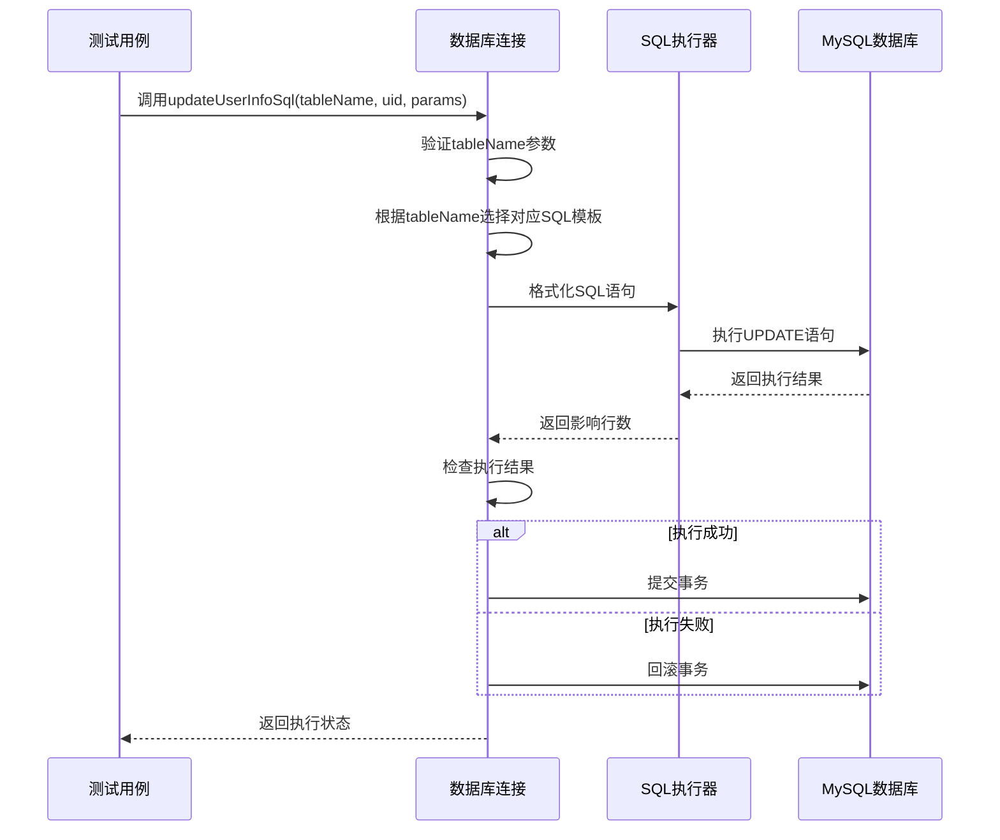
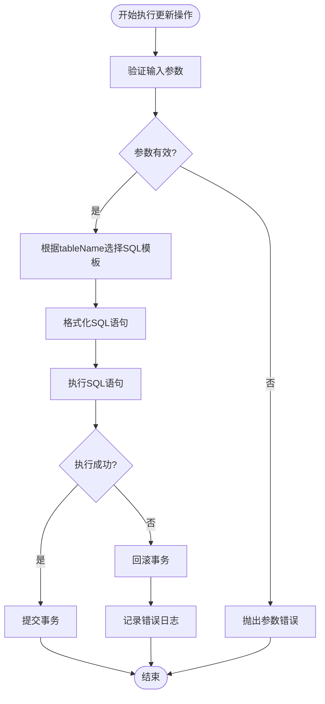
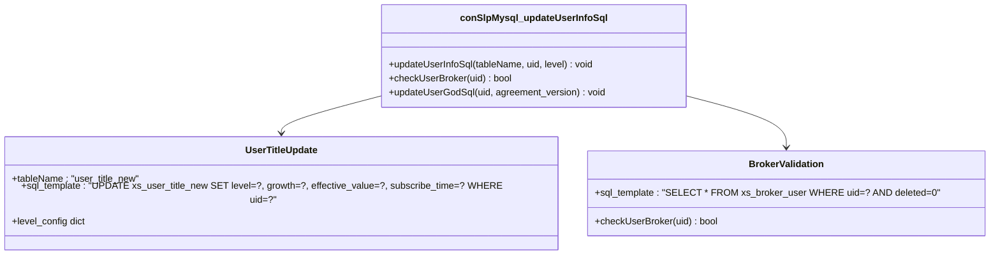
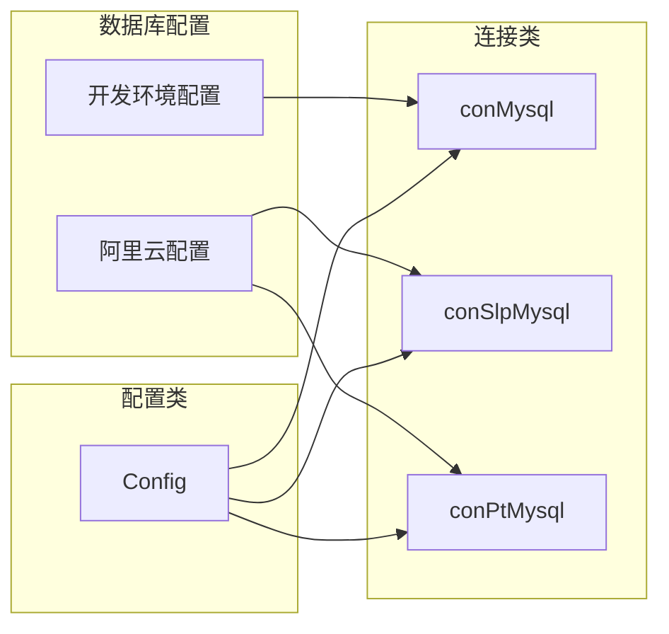
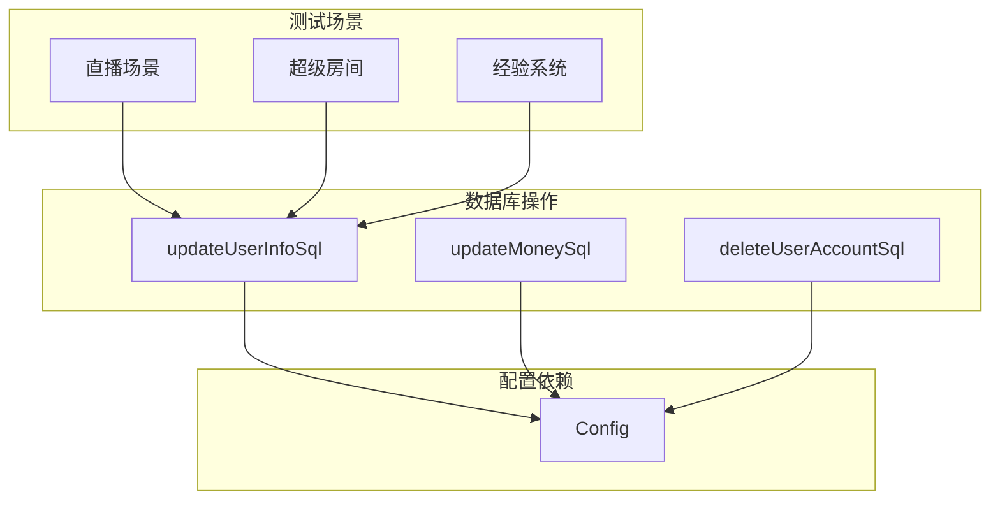
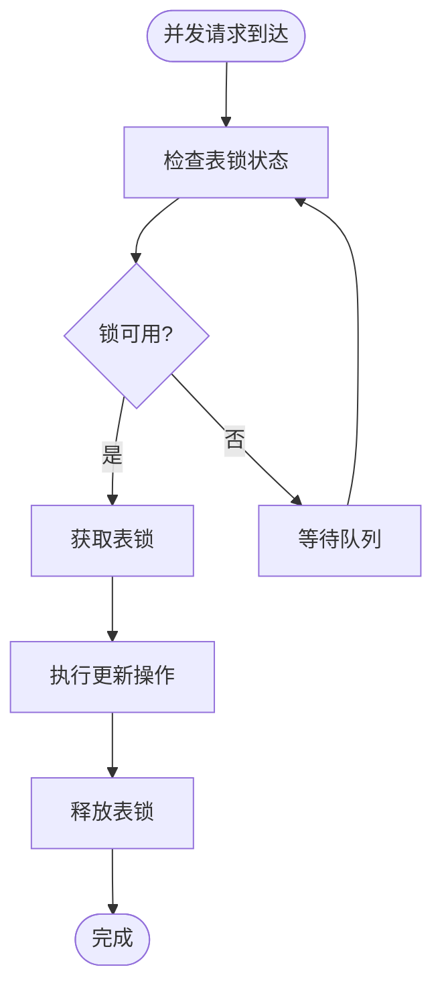
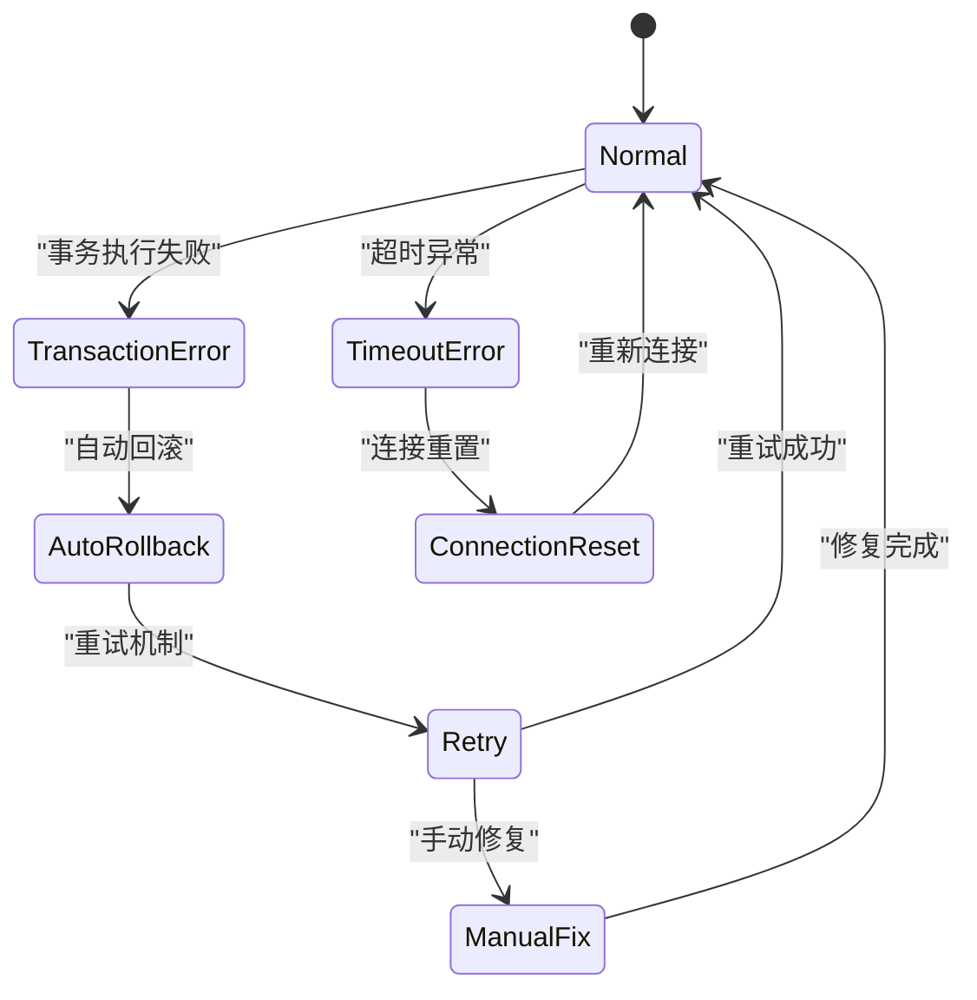

# 更新操作

<cite>
**本文档引用的文件**
- [conMysql.py](file://common/conMysql.py)
- [conSlpMysql.py](file://common/conSlpMysql.py)
- [conPtMysql.py](file://common/conPtMysql.py)
- [test_pay_livePackage.py](file://case/test_pay_livePackage.py)
- [test_pay_superBroker.py](file://case/test_pay_superBroker.py)
- [test_exp.py](file://caseSlp/test_exp.py)
- [Config.py](file://common/Config.py)
</cite>

## 目录
1. [简介](#简介)
2. [项目结构](#项目结构)
3. [核心组件](#核心组件)
4. [架构概览](#架构概览)
5. [详细组件分析](#详细组件分析)
6. [依赖关系分析](#依赖关系分析)
7. [性能考虑](#性能考虑)
8. [故障排除指南](#故障排除指南)
9. [结论](#结论)

## 简介

本文档详细介绍了数据访问层的更新操作模块，重点分析了 `updateUserInfoSql` 静态方法的实现机制。该模块负责处理各种用户信息更新场景，包括工会用户、用户索引、房间信息、超级房间等更新操作。

更新操作模块采用统一的数据访问接口设计，通过参数化的方式支持多种数据库表的更新操作。每个更新操作都包含了完整的事务处理、错误回滚和提交机制，确保数据的一致性和完整性。

## 项目结构

该项目采用模块化的架构设计，主要包含以下核心组件：



**图表来源**
- [conMysql.py:1-530](file://common/conMysql.py#L1-L530)
- [conSlpMysql.py:1-680](file://common/conSlpMysql.py#L1-L680)
- [conPtMysql.py:1-345](file://common/conPtMysql.py#L1-L345)

**章节来源**
- [conMysql.py:1-530](file://common/conMysql.py#L1-L530)
- [conSlpMysql.py:1-680](file://common/conSlpMysql.py#L1-L680)
- [conPtMysql.py:1-345](file://common/conPtMysql.py#L1-L345)

## 核心组件

### 数据库连接类结构



**图表来源**
- [conMysql.py:8-530](file://common/conMysql.py#L8-L530)
- [Config.py:60-133](file://common/Config.py#L60-L133)

### 更新操作方法签名

更新操作模块的核心方法具有统一的接口设计：

```python
@staticmethod
def updateUserInfoSql(tableName, uid, **kwargs):
    """
    统一的用户信息更新方法
    
    参数:
        tableName (str): 目标表名
        uid (int): 用户ID
        **kwargs: 可变参数，根据不同的表类型传入相应的参数
    
    返回:
        void: 执行更新操作
    """
```

**章节来源**
- [conMysql.py:275-321](file://common/conMysql.py#L275-L321)
- [conSlpMysql.py:324-409](file://common/conSlpMysql.py#L324-L409)

## 架构概览

### 更新操作执行流程



**图表来源**
- [conMysql.py:275-321](file://common/conMysql.py#L275-L321)
- [conSlpMysql.py:324-409](file://common/conSlpMysql.py#L324-L409)

### 错误处理机制



**图表来源**
- [conMysql.py:275-321](file://common/conMysql.py#L275-L321)
- [conSlpMysql.py:324-409](file://common/conSlpMysql.py#L324-L409)

## 详细组件分析

### 主数据库连接类 (conMysql)

#### 更新用户信息方法实现

主数据库连接类实现了最完整的更新操作功能，支持多种用户相关表的更新：

```mermaid
classDiagram
class conMysql_updateUserInfoSql {
+updateUserInfoSql(tableName, uid, bid) void
-execute_sql(sql) void
-rollback_transaction() void
-commit_transaction() void
<<static>>
}
class BrokerUserUpdate {
+tableName : "broker_user"
+sql_template : "UPDATE xs_broker_user SET bid=?, uid=?, state=1, pack_cal=1 WHERE id=50 LIMIT 1"
}
class UserIndexUpdate {
+tableName : "user_index"
+sql_template : "UPDATE xs_user_index SET salt=?, dateline=? WHERE uid=? LIMIT 1"
}
class ChatRoomUpdate {
+tableName : "chatroom"
+sql_template : "UPDATE xs_chatroom SET app_id=1, uid=?, settlement_channel='live', room_factory_type='business-soundchat' WHERE rid=? LIMIT 1"
}
class SuperChatRoomUpdate {
+tableName : "super_chatroom"
+sql_template : "UPDATE xs_chatroom SET type='super-voice-fresh', property='business', version=737, room_factory_type='super-voice-fresh', room_module_id=73, settlement_channel='super-voice' WHERE rid=?"
}
conMysql_updateUserInfoSql --> BrokerUserUpdate
conMysql_updateUserInfoSql --> UserIndexUpdate
conMysql_updateUserInfoSql --> ChatRoomUpdate
conMysql_updateUserInfoSql --> SuperChatRoomUpdate
```



**图表来源**
- [conMysql.py:275-321](file://common/conMysql.py#L275-L321)

#### 各种更新场景详解

##### 工会用户更新 (broker_user)

当 `tableName` 为 `'broker_user'` 时，更新操作将用户设置为打包结算主播：

- **目标表**: `xs_broker_user`
- **更新字段**: `bid`, `uid`, `state`, `pack_cal`
- **条件**: `id = 50`
- **限制**: `LIMIT 1`

##### 用户索引更新 (user_index)

当 `tableName` 为 `'user_index'` 时，更新用户索引信息：

- **目标表**: `xs_user_index`
- **更新字段**: `salt`, `dateline`
- **条件**: `uid = ?`
- **限制**: `LIMIT 1`

##### 房间信息更新 (chatroom)

当 `tableName` 为 `'chatroom'` 时，更新房间房主信息：

- **目标表**: `xs_chatroom`
- **更新字段**: `app_id`, `uid`, `settlement_channel`, `room_factory_type`
- **条件**: `rid = config.live_role['live_rid']`
- **限制**: `LIMIT 1`

##### 超级房间更新 (super_chatroom)

当 `tableName` 为 `'super_chatroom'` 时，更新超级房间配置：

- **目标表**: `xs_chatroom`
- **更新字段**: `type`, `property`, `version`, `room_factory_type`, `room_module_id`, `settlement_channel`
- **条件**: `rid = ?`

**章节来源**
- [conMysql.py:275-321](file://common/conMysql.py#L275-L321)

### SLP数据库连接类 (conSlpMysql)

#### 特殊更新场景

SLP数据库连接类提供了专门针对SLP系统的更新操作：



**图表来源**
- [conSlpMysql.py:324-409](file://common/conSlpMysql.py#L324-L409)

**章节来源**
- [conSlpMysql.py:324-409](file://common/conSlpMysql.py#L324-L409)

### PT数据库连接类 (conPtMysql)

#### PT系统专用更新

PT数据库连接类专注于PT系统的特定更新需求：

**章节来源**
- [conPtMysql.py:145-185](file://common/conPtMysql.py#L145-L185)

## 依赖关系分析

### 数据库连接配置



**图表来源**
- [conMysql.py:8-25](file://common/conMysql.py#L8-L25)
- [conSlpMysql.py:8-27](file://common/conSlpMysql.py#L8-L27)
- [conPtMysql.py:6-23](file://common/conPtMysql.py#L6-L23)

### 测试用例依赖关系



**图表来源**
- [test_pay_livePackage.py:35-36](file://case/test_pay_livePackage.py#L35-L36)
- [test_pay_superBroker.py:13](file://case/test_pay_superBroker.py#L13)
- [test_exp.py:37](file://caseSlp/test_exp.py#L37)

**章节来源**
- [test_pay_livePackage.py:35-36](file://case/test_pay_livePackage.py#L35-L36)
- [test_pay_superBroker.py:13](file://case/test_pay_superBroker.py#L13)
- [test_exp.py:37](file://caseSlp/test_exp.py#L37)

## 性能考虑

### 连接池和事务管理

更新操作模块采用了以下性能优化策略：

1. **自动提交配置**: 所有连接类都设置了 `autocommit=True`，简化了事务管理
2. **连接复用**: 使用单一连接实例避免频繁的连接建立开销
3. **批量操作**: 支持多个用户ID的批量更新操作

### 并发安全机制



### 错误恢复策略



## 故障排除指南

### 常见问题及解决方案

#### 1. SQL语法错误

**症状**: 执行SQL时抛出语法错误异常

**解决方案**:
- 检查SQL语句中的占位符数量
- 验证参数类型匹配
- 确认表结构存在

#### 2. 事务回滚问题

**症状**: 更新操作执行失败但数据未回滚

**解决方案**:
- 检查异常捕获逻辑
- 验证回滚调用时机
- 确认连接状态

#### 3. 并发冲突

**症状**: 多线程环境下数据不一致

**解决方案**:
- 实施适当的锁机制
- 使用事务隔离级别
- 优化查询条件

### 调试技巧

```python
# 启用详细日志
import logging
logging.basicConfig(level=logging.DEBUG)

# 添加调试输出
def debug_update_info(table_name, uid, params):
    print(f"Updating {table_name} for user {uid}")
    print(f"Parameters: {params}")
    print(f"Generated SQL: {generate_sql(table_name, params)}")
```

**章节来源**
- [conMysql.py:275-321](file://common/conMysql.py#L275-L321)
- [conSlpMysql.py:324-409](file://common/conSlpMysql.py#L324-L409)

## 结论

更新操作模块通过统一的接口设计和完善的错误处理机制，为整个测试框架提供了可靠的数据访问能力。模块的主要特点包括：

1. **统一接口**: 所有更新操作都通过相同的 `updateUserInfoSql` 方法调用
2. **灵活参数**: 支持可变参数，适应不同表类型的更新需求
3. **完整事务**: 每个操作都包含完整的事务处理和错误回滚
4. **多数据库支持**: 支持主数据库、SLP数据库和PT数据库的不同更新场景

该模块的设计充分考虑了测试场景的复杂性和并发安全性，为自动化测试提供了稳定可靠的数据基础。通过合理的错误处理和性能优化，确保了测试执行的稳定性和效率。

在未来的发展中，可以考虑进一步优化：
- 实现连接池管理
- 增加SQL语句缓存
- 提供更详细的错误诊断信息
- 支持异步更新操作