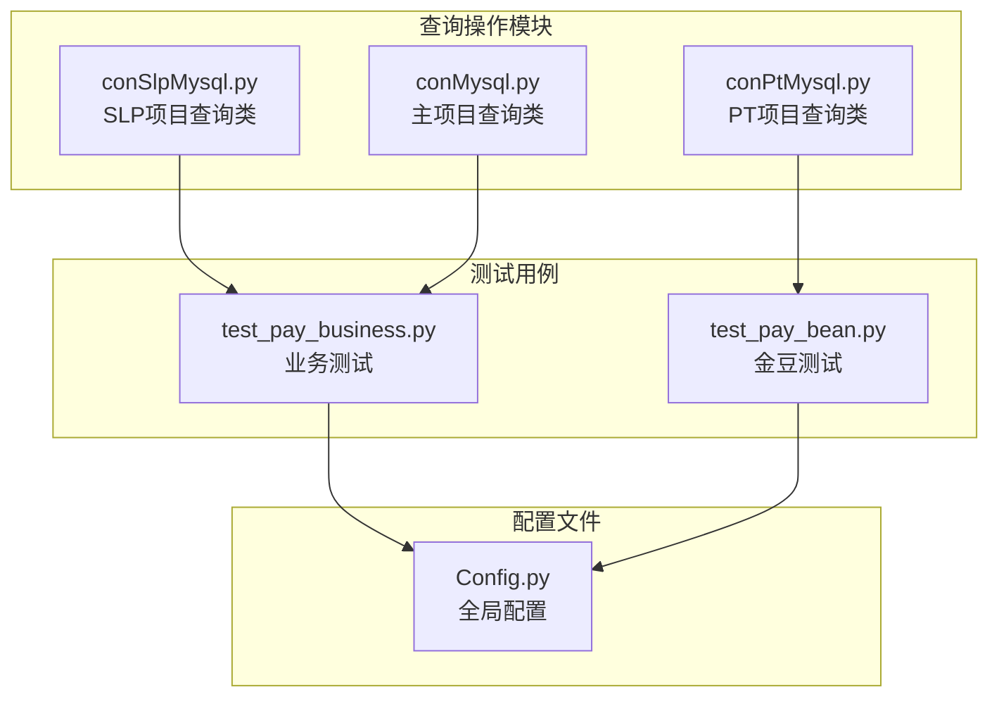
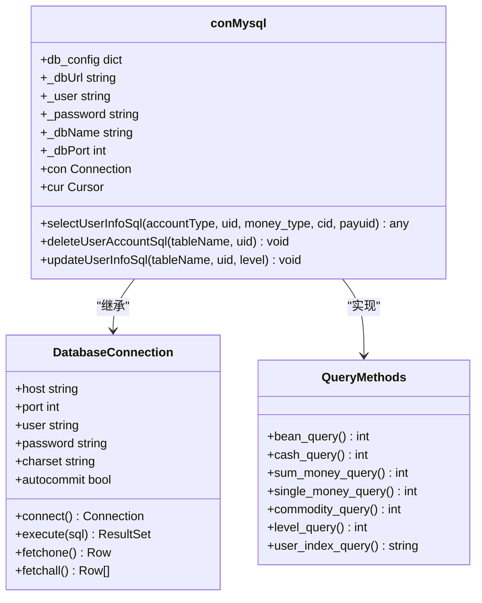
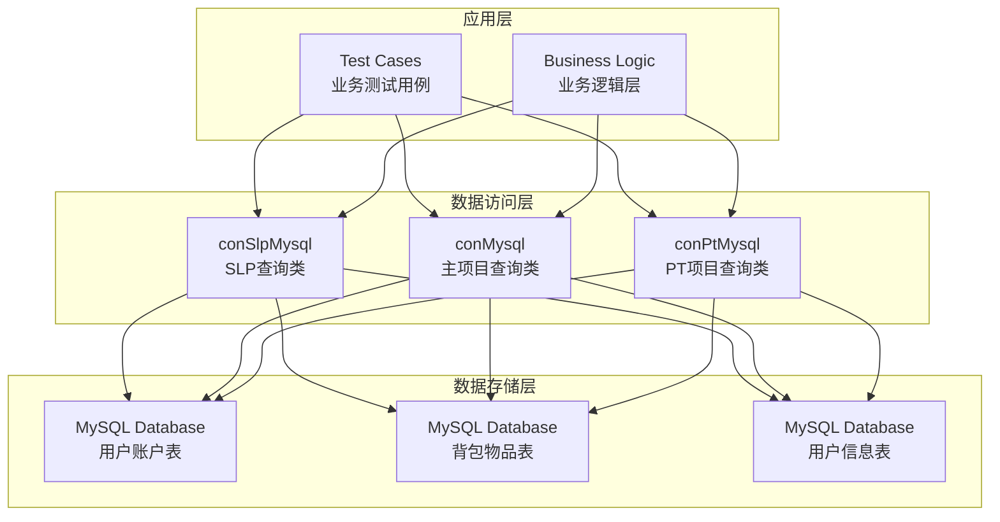
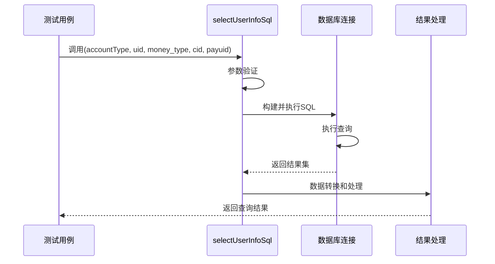
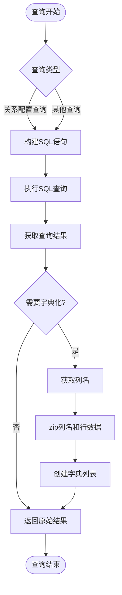
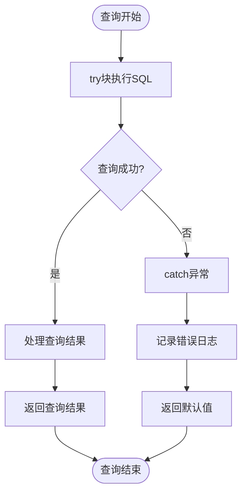
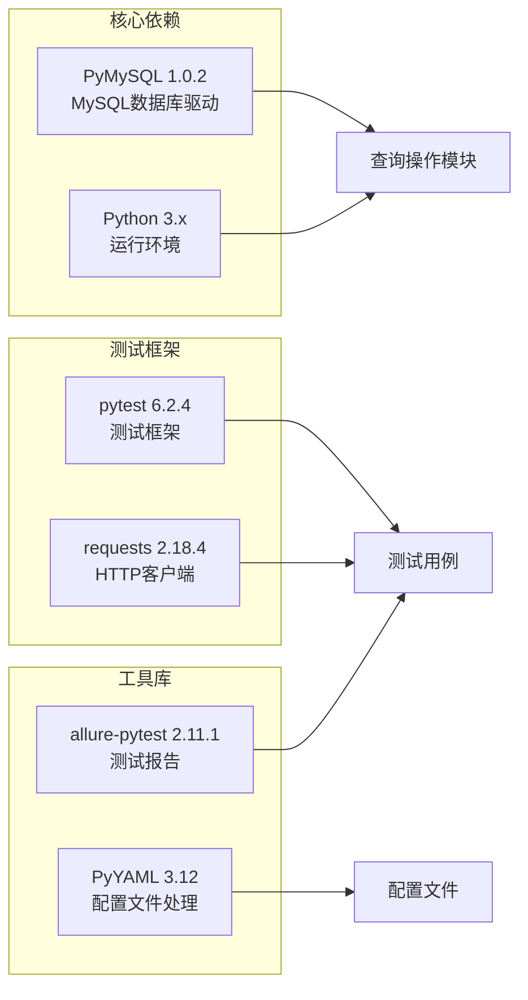
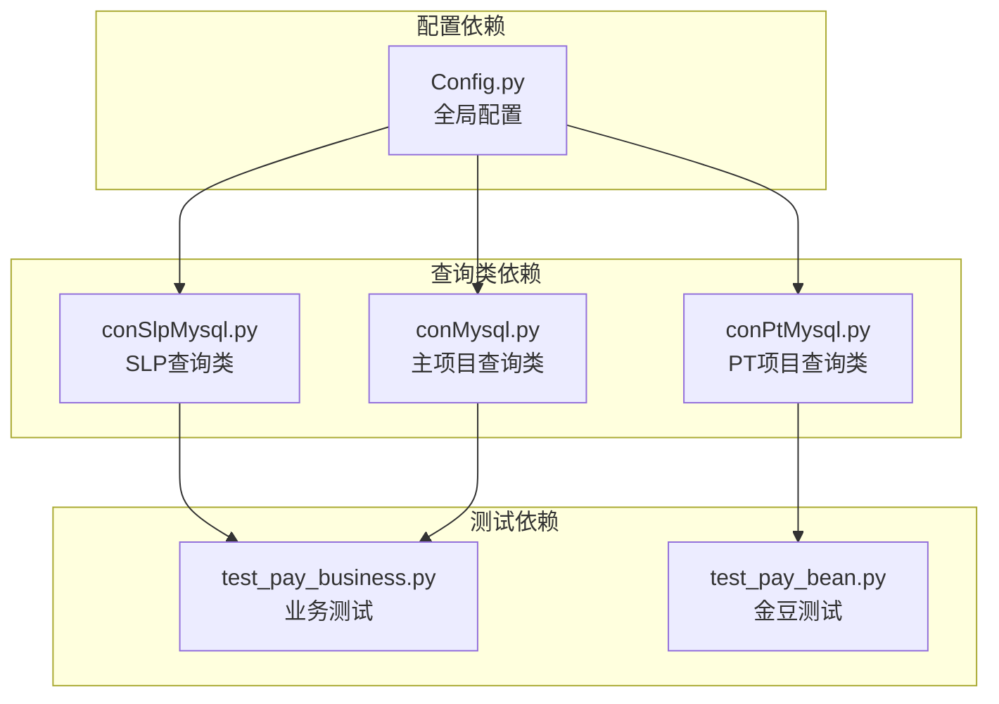

# 查询操作

<cite>
**本文档引用的文件**
- [conSlpMysql.py](file://common/conSlpMysql.py)
- [conMysql.py](file://common/conMysql.py)
- [conPtMysql.py](file://common/conPtMysql.py)
- [test_pay_business.py](file://case/test_pay_business.py)
- [test_pay_bean.py](file://case/test_pay_bean.py)
- [Config.py](file://common/Config.py)
- [requirements.txt](file://requirements.txt)
</cite>

## 目录
1. [简介](#简介)
2. [项目结构](#项目结构)
3. [核心组件](#核心组件)
4. [架构概览](#架构概览)
5. [详细组件分析](#详细组件分析)
6. [依赖关系分析](#依赖关系分析)
7. [性能考虑](#性能考虑)
8. [故障排除指南](#故障排除指南)
9. [结论](#结论)

## 简介

本文档深入解析数据访问层的查询操作模块，重点阐述 `selectUserInfoSql` 静态方法的实现原理和工作机制。该模块负责处理所有账户类型的查询操作，包括金豆余额(bean)、现金余额(cash)、总余额(sum_money)、单账户余额(single_money)、背包物品数量(sum_commodity、num_commodity)、爵位等级(level)、用户盐值(user_index)等查询方法。

该查询模块采用统一的接口设计，通过参数化的账户类型选择器实现多种查询功能，为上层业务逻辑提供标准化的数据访问能力。

## 项目结构

查询操作模块位于 `common` 目录下，包含三个主要的数据库连接类文件：



**图表来源**
- [conSlpMysql.py:1-680](file://common/conSlpMysql.py#L1-L680)
- [conMysql.py:1-530](file://common/conMysql.py#L1-L530)
- [conPtMysql.py:1-345](file://common/conPtMysql.py#L1-L345)

**章节来源**
- [conSlpMysql.py:1-680](file://common/conSlpMysql.py#L1-L680)
- [conMysql.py:1-530](file://common/conMysql.py#L1-L530)
- [conPtMysql.py:1-345](file://common/conPtMysql.py#L1-L345)

## 核心组件

### 数据库连接类架构

查询操作模块采用面向对象的设计模式，每个项目都有独立的数据库连接类：



**图表来源**
- [conSlpMysql.py:8-27](file://common/conSlpMysql.py#L8-L27)
- [conMysql.py:8-25](file://common/conMysql.py#L8-L25)

### 查询方法分类

查询操作按照功能可分为以下几类：

1. **账户余额查询**：金豆余额、现金余额、总余额、单账户余额
2. **背包物品查询**：物品总数、特定物品数量、物品ID
3. **用户信息查询**：爵位等级、用户盐值、VIP等级
4. **关系查询**：守护关系ID、关系配置信息

**章节来源**
- [conSlpMysql.py:29-152](file://common/conSlpMysql.py#L29-L152)
- [conMysql.py:27-141](file://common/conMysql.py#L27-L141)

## 架构概览

查询操作模块采用分层架构设计，确保了良好的可维护性和扩展性：



**图表来源**
- [conSlpMysql.py:19-27](file://common/conSlpMysql.py#L19-L27)
- [conMysql.py:17-25](file://common/conMysql.py#L17-L25)
- [conPtMysql.py:15-23](file://common/conPtMysql.py#L15-L23)

## 详细组件分析

### selectUserInfoSql 方法实现

#### 方法签名与参数



**图表来源**
- [conSlpMysql.py:30-75](file://common/conSlpMysql.py#L30-L75)
- [conMysql.py:28-73](file://common/conMysql.py#L28-L73)

#### 账户类型查询逻辑

##### 金豆余额查询 (bean)
- **SQL语句**：`SELECT money_coupon FROM xs_user_money_extend WHERE uid={uid}`
- **参数传递**：uid (用户ID)
- **返回值**：整数类型，金豆余额
- **异常处理**：返回0表示查询失败或无数据

##### 现金余额查询 (cash)
- **SQL语句**：`SELECT cash FROM xs_user_money_extend WHERE uid={uid}`
- **参数传递**：uid (用户ID)
- **返回值**：整数类型，现金余额
- **异常处理**：返回0表示查询失败或无数据

##### 总余额查询 (sum_money)
- **SQL语句**：`SELECT money+money_b+money_cash_b+money_cash FROM xs_user_money WHERE uid={uid}`
- **参数传递**：uid (用户ID)
- **返回值**：整数类型，总余额
- **异常处理**：返回0表示查询失败或无数据

##### 单账户余额查询 (single_money)
- **SQL语句**：`SELECT {money_type} FROM xs_user_money WHERE uid={uid}`
- **参数传递**：uid (用户ID), money_type (账户类型)
- **返回值**：整数类型，指定账户余额
- **异常处理**：返回None表示查询失败或无数据

##### 背包物品查询
- **物品总数**：`SELECT SUM(num) FROM xs_user_commodity WHERE uid={uid}`
- **特定物品数量**：`SELECT num FROM xs_user_commodity WHERE cid={cid} AND uid={uid}`
- **物品ID查询**：`SELECT id FROM xs_user_commodity WHERE cid={cid} AND uid={uid}`

##### 用户信息查询
- **爵位等级**：`SELECT level FROM xs_user_title_new WHERE uid={uid}`
- **用户盐值**：`SELECT salt FROM xs_user_index WHERE uid={uid}`
- **VIP等级**：`SELECT pay_room_money FROM xs_user_profile WHERE uid={uid}`

**章节来源**
- [conSlpMysql.py:32-152](file://common/conSlpMysql.py#L32-L152)
- [conMysql.py:30-141](file://common/conMysql.py#L30-L141)

### 数据转换和字典化处理

#### 字典化查询结果

部分查询方法支持将查询结果转换为字典格式：



**图表来源**
- [conSlpMysql.py:155-175](file://common/conSlpMysql.py#L155-L175)

#### 异常处理机制

查询操作采用统一的异常处理策略：



**图表来源**
- [conSlpMysql.py:34-42](file://common/conSlpMysql.py#L34-L42)
- [conMysql.py:33-40](file://common/conMysql.py#L33-L40)

**章节来源**
- [conSlpMysql.py:34-42](file://common/conSlpMysql.py#L34-L42)
- [conMysql.py:33-40](file://common/conMysql.py#L33-L40)

## 依赖关系分析

### 外部依赖

查询操作模块依赖以下外部库：



**图表来源**
- [requirements.txt:54-66](file://requirements.txt#L54-L66)

### 内部依赖关系



**图表来源**
- [Config.py:60-94](file://Config.py#L60-L94)
- [test_pay_business.py:1-10](file://case/test_pay_business.py#L1-L10)

**章节来源**
- [requirements.txt:1-85](file://requirements.txt#L1-L85)
- [Config.py:1-133](file://Config.py#L1-L133)

## 性能考虑

### SQL注入防护

当前实现存在严重的安全风险，建议采用参数化查询：

```python
# 存在安全风险的实现
sql = "SELECT money_coupon FROM xs_user_money_extend WHERE uid={}".format(uid)

# 推荐的安全实现
sql = "SELECT money_coupon FROM xs_user_money_extend WHERE uid=%s"
cur.execute(sql, (uid,))
```

### 连接池管理

当前实现使用单连接模式，建议引入连接池：

```python
import pymysql.pooling as pooling

# 创建连接池
pool = pooling.PooledDB(
    creator=pymysql,
    maxconnections=10,
    blocking=True,
    host='localhost',
    port=3306,
    user='username',
    passwd='password',
    db='database'
)

# 获取连接
conn = pool.connection()
```

### 查询性能优化

1. **索引优化**：确保用户ID字段建立适当索引
2. **查询缓存**：对频繁查询的结果进行缓存
3. **批量查询**：减少数据库往返次数
4. **连接复用**：避免频繁创建和销毁连接

## 故障排除指南

### 常见问题及解决方案

#### 数据库连接问题
- **症状**：查询超时或连接失败
- **原因**：网络不稳定或数据库服务异常
- **解决方案**：检查数据库连接配置和网络连通性

#### 查询结果为空
- **症状**：返回0或None值
- **原因**：用户不存在或数据未初始化
- **解决方案**：验证用户ID和数据状态

#### SQL语法错误
- **症状**：执行SQL时报语法错误
- **原因**：SQL语句构造错误
- **解决方案**：检查参数拼接和SQL语法

#### 异常处理最佳实践

```python
def safe_query_operation():
    try:
        # 执行查询操作
        result = execute_query()
        return result
    except pymysql.Error as e:
        # 记录详细的错误信息
        logger.error(f"数据库查询错误: {e}")
        return None
    except Exception as e:
        # 处理其他异常
        logger.error(f"未知错误: {e}")
        return None
```

**章节来源**
- [conSlpMysql.py:41-42](file://common/conSlpMysql.py#L41-L42)
- [conMysql.py:39-40](file://common/conMysql.py#L39-L40)

## 结论

查询操作模块通过统一的接口设计实现了多样化的数据访问功能。虽然当前实现简洁有效，但在安全性、性能和可维护性方面仍有改进空间。

### 主要优势
- **统一接口**：单一方法支持多种查询类型
- **易于使用**：参数化设计简化了调用过程
- **功能完整**：覆盖了主要的业务查询需求

### 改进建议
1. **增强安全性**：实现参数化查询防止SQL注入
2. **优化性能**：引入连接池和查询缓存机制
3. **完善异常处理**：提供更详细的错误信息和恢复策略
4. **扩展监控**：添加查询性能监控和日志记录

该模块为整个系统的数据访问提供了坚实的基础，通过持续的优化和改进，能够更好地支持业务的发展需求。