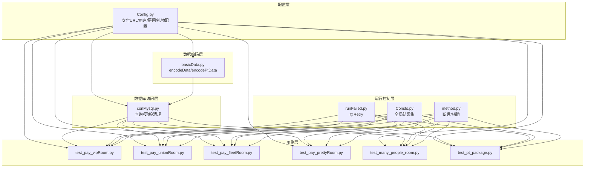
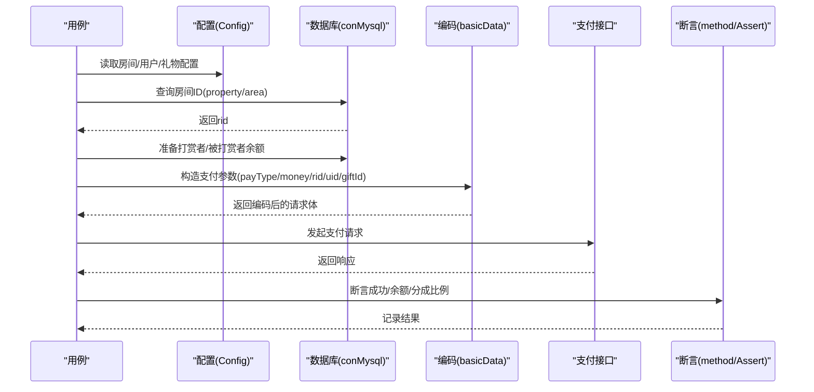
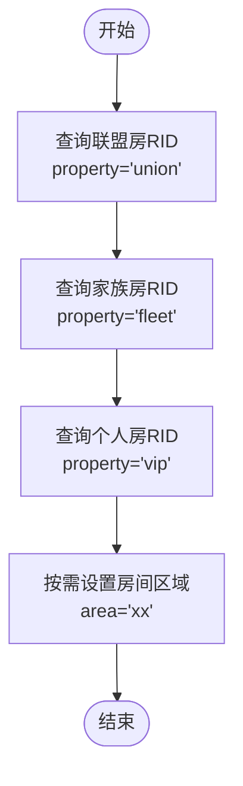
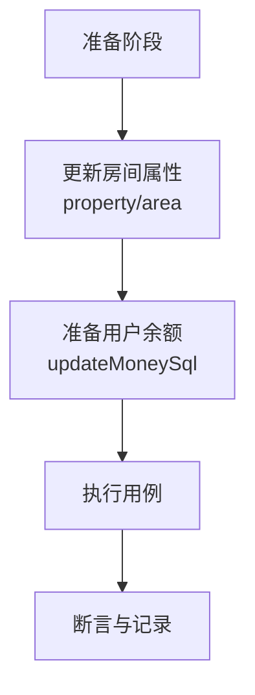
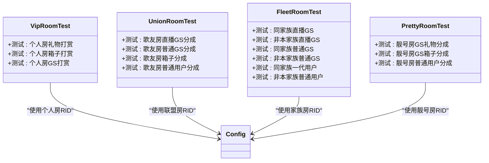
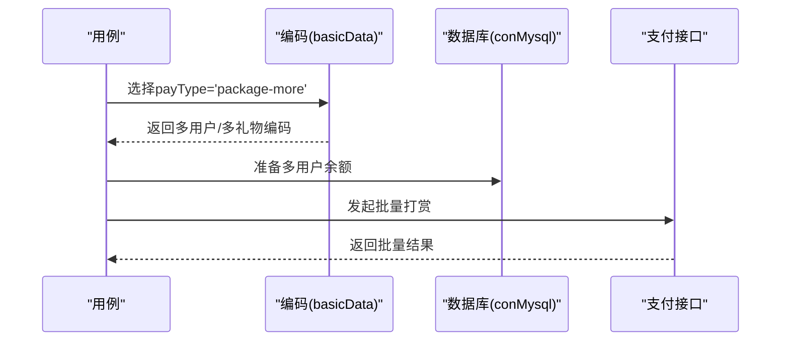
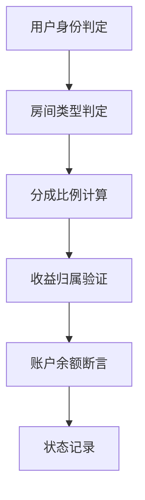
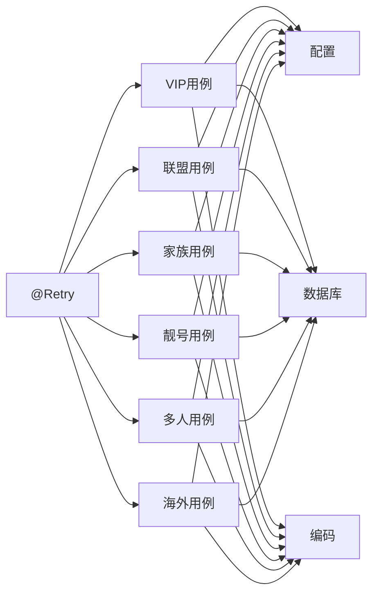

# 房间数据准备

<cite>
**本文引用的文件**
- [common/conMysql.py](file://common/conMysql.py)
- [common/basicData.py](file://common/basicData.py)
- [common/Config.py](file://common/Config.py)
- [common/Consts.py](file://common/Consts.py)
- [common/runFailed.py](file://common/runFailed.py)
- [case/test_pay_vipRoom.py](file://case/test_pay_vipRoom.py)
- [case/test_pay_unionRoom.py](file://case/test_pay_unionRoom.py)
- [case/test_pay_fleetRoom.py](file://case/test_pay_fleetRoom.py)
- [case/test_pay_prettyRoom.py](file://case/test_pay_prettyRoom.py)
- [caseSlp/test_many_people_room.py](file://caseSlp/test_many_people_room.py)
- [caseOversea/test_pt_package.py](file://caseOversea/test_pt_package.py)
- [common/method.py](file://common/method.py)
</cite>

## 目录
1. [简介](#简介)
2. [项目结构](#项目结构)
3. [核心组件](#核心组件)
4. [架构总览](#架构总览)
5. [详细组件分析](#详细组件分析)
6. [依赖分析](#依赖分析)
7. [性能考虑](#性能考虑)
8. [故障排除指南](#故障排除指南)
9. [结论](#结论)
10. [附录](#附录)

## 简介
本文件面向QA支付测试自动化项目，聚焦“房间数据准备”的完整流程与最佳实践，涵盖房间ID分配、房间类型设置、房间权限配置、房间状态初始化，以及不同房间类型（普通房间、VIP房间、联盟房间、家族房间等）在测试中的特殊配置需求。文档还提供批量配置方法、与用户数据的关联关系、权限验证策略、状态一致性保障、故障排除与最佳实践。

## 项目结构
围绕房间数据准备的关键模块与文件如下：
- 配置层：集中定义支付URL、用户UID集合、房间RID映射、礼物ID映射等
- 数据编码层：统一构造支付请求参数，支持多种支付场景
- 数据访问层：封装MySQL查询与更新，提供房间类型查询、用户账户余额更新等能力
- 用例层：各房间类型测试用例，演示房间ID读取、用户余额准备、权限校验与断言
- 运行控制层：失败重试装饰器，提升用例鲁棒性

**图表来源**
- [common/Config.py:1-133](file://common/Config.py#L1-L133)
- [common/basicData.py:1-581](file://common/basicData.py#L1-L581)
- [common/conMysql.py:1-530](file://common/conMysql.py#L1-L530)
- [case/test_pay_vipRoom.py:1-90](file://case/test_pay_vipRoom.py#L1-L90)
- [case/test_pay_unionRoom.py:1-119](file://case/test_pay_unionRoom.py#L1-L119)
- [case/test_pay_fleetRoom.py:1-158](file://case/test_pay_fleetRoom.py#L1-L158)
- [case/test_pay_prettyRoom.py:1-90](file://case/test_pay_prettyRoom.py#L1-L90)
- [caseSlp/test_many_people_room.py:1-57](file://caseSlp/test_many_people_room.py#L1-L57)
- [caseOversea/test_pt_package.py:1-36](file://caseOversea/test_pt_package.py#L1-L36)
- [common/runFailed.py:1-87](file://common/runFailed.py#L1-L87)
- [common/Consts.py:1-17](file://common/Consts.py#L1-L17)
- [common/method.py:1-171](file://common/method.py#L1-L171)

**章节来源**
- [common/Config.py:1-133](file://common/Config.py#L1-L133)
- [common/basicData.py:1-581](file://common/basicData.py#L1-L581)
- [common/conMysql.py:1-530](file://common/conMysql.py#L1-L530)
- [common/runFailed.py:1-87](file://common/runFailed.py#L1-L87)
- [common/Consts.py:1-17](file://common/Consts.py#L1-L17)
- [common/method.py:1-171](file://common/method.py#L1-L171)

## 核心组件
- 房间ID分配与类型设置
  - 通过数据库查询房间ID并注入到用例配置中；部分房间类型通过属性字段区分（如联盟/家族/个人房）
  - 示例：联盟房/家族房/个人房的RID查询与使用
- 房间权限配置
  - 通过更新房间属性字段实现房间类型切换（如property、area等），以适配不同业务场景
- 房间状态初始化
  - 在用例执行前，准备打赏者与被打赏者的账户余额，确保测试前置条件一致
- 不同房间类型的测试应用
  - VIP房间：个人房场景下的分成比例与收益归属
  - 联盟房间：歌友房内不同身份（直播公会/普通公会/普通用户）的分成规则
  - 家族房间：同家族/非本家族场景下的分成差异
  - 靓号房间：公会成员与普通用户的分成差异
- 批量配置方法
  - 统一的数据编码函数支持单人/多人/多礼物场景，便于批量构造支付请求
- 权限验证与状态一致性
  - 用例中对账户余额进行断言，并结合全局结果集记录用例执行状态

**章节来源**
- [common/conMysql.py:165-186](file://common/conMysql.py#L165-L186)
- [common/conMysql.py:147-153](file://common/conMysql.py#L147-L153)
- [common/conMysql.py:349-361](file://common/conMysql.py#L349-L361)
- [common/basicData.py:9-325](file://common/basicData.py#L9-L325)
- [case/test_pay_vipRoom.py:15-90](file://case/test_pay_vipRoom.py#L15-L90)
- [case/test_pay_unionRoom.py:16-119](file://case/test_pay_unionRoom.py#L16-L119)
- [case/test_pay_fleetRoom.py:15-158](file://case/test_pay_fleetRoom.py#L15-L158)
- [case/test_pay_prettyRoom.py:14-90](file://case/test_pay_prettyRoom.py#L14-L90)
- [common/Consts.py:4-17](file://common/Consts.py#L4-L17)

## 架构总览
下图展示从配置到用例执行的端到端流程，包括房间ID获取、用户余额准备、请求参数编码、接口调用与结果断言。

**图表来源**
- [common/Config.py:57-88](file://common/Config.py#L57-L88)
- [common/conMysql.py:165-186](file://common/conMysql.py#L165-L186)
- [common/conMysql.py:349-361](file://common/conMysql.py#L349-L361)
- [common/basicData.py:9-325](file://common/basicData.py#L9-L325)
- [common/method.py:115-129](file://common/method.py#L115-L129)

## 详细组件分析

### 房间ID分配与房间类型设置
- 联盟房/歌友房：通过查询xs_chatroom表的property字段为union获取房间ID
- 家族房：通过property为fleet获取房间ID，必要时区分本家族与其他家族房间
- 个人房：通过property为vip获取房间ID
- 地区/区域房间：通过更新xs_chatroom的area字段实现区域化房间类型

**图表来源**
- [common/conMysql.py:165-186](file://common/conMysql.py#L165-L186)
- [common/conMysql.py:147-153](file://common/conMysql.py#L147-L153)
- [caseOversea/test_pt_package.py:18-23](file://caseOversea/test_pt_package.py#L18-L23)

**章节来源**
- [common/conMysql.py:165-186](file://common/conMysql.py#L165-L186)
- [common/conMysql.py:147-153](file://common/conMysql.py#L147-L153)
- [caseOversea/test_pt_package.py:18-23](file://caseOversea/test_pt_package.py#L18-L23)

### 房间权限配置与房间状态初始化
- 房间权限：通过更新xs_chatroom的property/area字段实现房间类型与区域的切换
- 房间状态：在用例执行前，使用账户余额更新函数准备打赏者与被打赏者的初始余额，确保测试一致性

**图表来源**
- [common/conMysql.py:147-153](file://common/conMysql.py#L147-L153)
- [common/conMysql.py:349-361](file://common/conMysql.py#L349-L361)
- [case/test_pay_unionRoom.py:32-44](file://case/test_pay_unionRoom.py#L32-L44)

**章节来源**
- [common/conMysql.py:147-153](file://common/conMysql.py#L147-L153)
- [common/conMysql.py:349-361](file://common/conMysql.py#L349-L361)
- [case/test_pay_unionRoom.py:32-44](file://case/test_pay_unionRoom.py#L32-L44)

### 不同房间类型的测试应用与特殊配置
- VIP房间（个人房）
  - 使用配置中的个人房RID，验证礼物/箱子打赏的分成比例与收益归属
  - 关注点：非一代宗师与GS成员的分成差异
- 联盟房间（歌友房）
  - 区分直播公会/普通公会/普通用户三类身份，验证不同的分成比例
  - 关注点：公会魅力值与个人魅力值的归属
- 家族房间
  - 同家族与非本家族房间的分成差异；GS与普通用户的差异
- 靓号房间
  - 公会成员与普通用户的分成差异；礼物与箱子场景

**图表来源**
- [case/test_pay_vipRoom.py:15-90](file://case/test_pay_vipRoom.py#L15-L90)
- [case/test_pay_unionRoom.py:16-119](file://case/test_pay_unionRoom.py#L16-L119)
- [case/test_pay_fleetRoom.py:15-158](file://case/test_pay_fleetRoom.py#L15-L158)
- [case/test_pay_prettyRoom.py:14-90](file://case/test_pay_prettyRoom.py#L14-L90)
- [common/Config.py:60-68](file://common/Config.py#L60-L68)

**章节来源**
- [case/test_pay_vipRoom.py:15-90](file://case/test_pay_vipRoom.py#L15-L90)
- [case/test_pay_unionRoom.py:16-119](file://case/test_pay_unionRoom.py#L16-L119)
- [case/test_pay_fleetRoom.py:15-158](file://case/test_pay_fleetRoom.py#L15-L158)
- [case/test_pay_prettyRoom.py:14-90](file://case/test_pay_prettyRoom.py#L14-L90)
- [common/Config.py:60-68](file://common/Config.py#L60-L68)

### 批量配置方法与自动化脚本
- 单人/多人/多礼物场景
  - 通过编码函数支持多人同时打赏，自动计算positions与uids
  - 支持不同礼物ID与数量组合，便于批量构造测试数据
- 区域化房间准备
  - 通过更新xs_chatroom的area字段，配合不同地区房间RID，快速切换房间类型

**图表来源**
- [common/basicData.py:41-74](file://common/basicData.py#L41-L74)
- [caseSlp/test_many_people_room.py:32-56](file://caseSlp/test_many_people_room.py#L32-L56)

**章节来源**
- [common/basicData.py:41-74](file://common/basicData.py#L41-L74)
- [caseSlp/test_many_people_room.py:32-56](file://caseSlp/test_many_people_room.py#L32-L56)

### 房间数据与用户数据的关联关系及权限验证
- 用户身份与房间收益归属
  - 直播公会成员、普通公会成员、一代宗师、普通用户在不同房间的分成比例不同
- 权限验证策略
  - 通过断言被打赏者账户余额变化，验证分成比例与收益归属
  - 通过断言打赏者余额变化，验证扣款正确性
- 状态一致性
  - 使用全局结果集记录用例执行状态，便于统计与回溯

**图表来源**
- [case/test_pay_unionRoom.py:32-44](file://case/test_pay_unionRoom.py#L32-L44)
- [case/test_pay_fleetRoom.py:30-40](file://case/test_pay_fleetRoom.py#L30-L40)
- [case/test_pay_prettyRoom.py:26-39](file://case/test_pay_prettyRoom.py#L26-L39)
- [common/Consts.py:4-17](file://common/Consts.py#L4-L17)

**章节来源**
- [case/test_pay_unionRoom.py:32-44](file://case/test_pay_unionRoom.py#L32-L44)
- [case/test_pay_fleetRoom.py:30-40](file://case/test_pay_fleetRoom.py#L30-L40)
- [case/test_pay_prettyRoom.py:26-39](file://case/test_pay_prettyRoom.py#L26-L39)
- [common/Consts.py:4-17](file://common/Consts.py#L4-L17)

## 依赖分析
- 组件耦合
  - 用例依赖配置与数据库访问层；编码层独立于业务逻辑，便于复用
  - 失败重试装饰器统一应用于所有用例类，提升稳定性
- 外部依赖
  - MySQL数据库用于房间与用户数据准备
  - 支付接口用于发起打赏请求并返回结果

**图表来源**
- [common/Config.py:57-88](file://common/Config.py#L57-L88)
- [common/conMysql.py:165-186](file://common/conMysql.py#L165-L186)
- [common/basicData.py:9-325](file://common/basicData.py#L9-L325)
- [common/runFailed.py:42-87](file://common/runFailed.py#L42-L87)

**章节来源**
- [common/Config.py:57-88](file://common/Config.py#L57-L88)
- [common/conMysql.py:165-186](file://common/conMysql.py#L165-L186)
- [common/basicData.py:9-325](file://common/basicData.py#L9-L325)
- [common/runFailed.py:42-87](file://common/runFailed.py#L42-L87)

## 性能考虑
- 数据库操作批量化
  - 在准备大量用户余额时，尽量合并SQL执行，减少往返开销
- 编码层优化
  - 复用编码函数，避免重复构造相同参数
- 用例执行并发
  - 使用失败重试装饰器降低偶发失败的影响，提高整体吞吐

## 故障排除指南
- 房间ID查询失败
  - 现象：提示“库表无房间”
  - 排查：确认xs_chatroom表中是否存在对应property的房间；必要时先创建或更新房间属性
- 余额不足导致支付失败
  - 现象：接口返回支付失败
  - 排查：使用余额更新函数准备充足余额；核对礼物价格与数量
- 分成比例与收益不符
  - 现象：被打赏者余额与预期不符
  - 排查：确认用户身份（直播公会/普通公会/一代宗师/普通用户）与房间类型匹配；核对配置中的分成比例
- 区域/房间类型不生效
  - 现象：房间类型未按预期切换
  - 排查：确认已更新xs_chatroom的property与area字段；重启相关服务后重试

**章节来源**
- [common/conMysql.py:170-175](file://common/conMysql.py#L170-L175)
- [common/conMysql.py:349-361](file://common/conMysql.py#L349-L361)
- [case/test_pay_unionRoom.py:32-44](file://case/test_pay_unionRoom.py#L32-L44)
- [caseOversea/test_pt_package.py:18-23](file://caseOversea/test_pt_package.py#L18-L23)

## 结论
通过统一的配置、编码与数据库访问层，结合失败重试与断言机制，本项目实现了对不同房间类型（VIP/联盟/家族/靓号）的高效数据准备与测试验证。建议在实际执行中遵循“先准备房间与用户数据、再构造请求、最后断言”的流程，确保测试结果的准确性与一致性。

## 附录
- 最佳实践清单
  - 统一使用配置文件管理RID与用户UID
  - 使用编码函数构造请求参数，避免手写错误
  - 在用例执行前后清理/恢复房间属性与用户余额
  - 对关键用例启用失败重试，提升稳定性
  - 使用全局结果集记录用例状态，便于统计与回溯