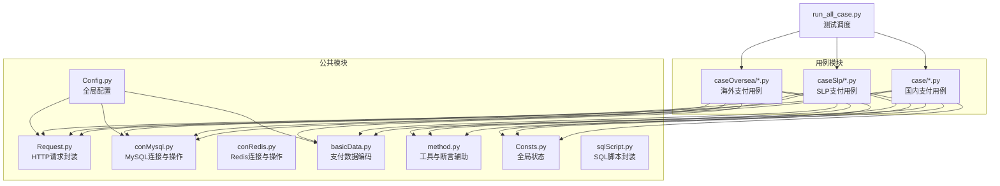
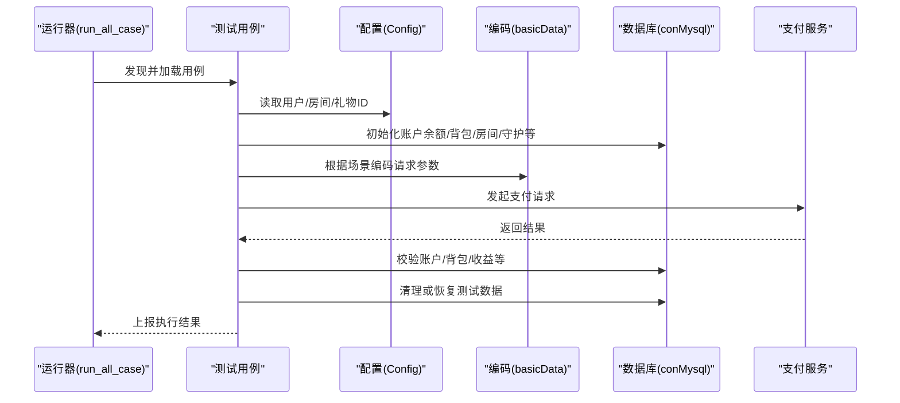
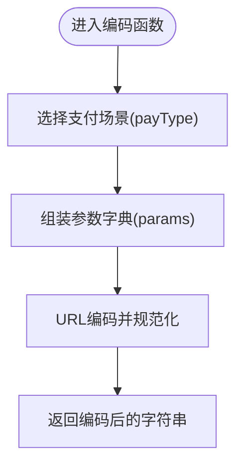
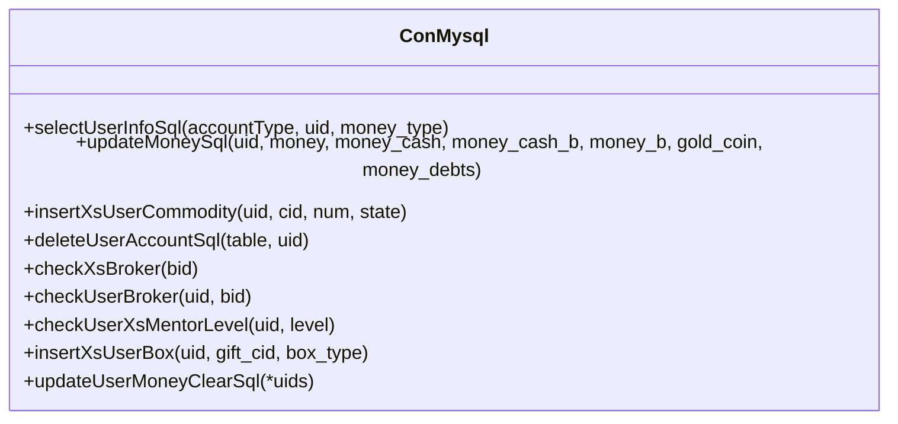
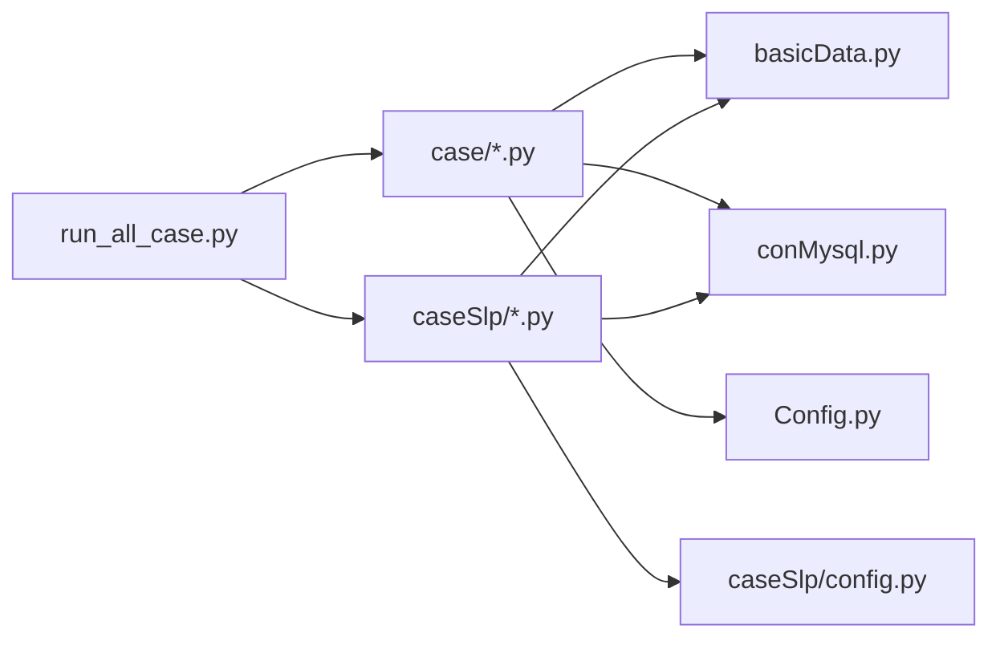

# 测试数据准备

<cite>
**本文引用的文件**   
- [common/basicData.py](file://common/basicData.py)
- [common/conMysql.py](file://common/conMysql.py)
- [common/conRedis.py](file://common/conRedis.py)
- [common/Config.py](file://common/Config.py)
- [run_all_case.py](file://run_all_case.py)
- [common/Consts.py](file://common/Consts.py)
- [common/method.py](file://common/method.py)
- [common/sqlScript.py](file://common/sqlScript.py)
- [case/test_pay_business.py](file://case/test_pay_business.py)
- [case/test_pay_shopBuy.py](file://case/test_pay_shopBuy.py)
- [case/test_pay_coin.py](file://case/test_pay_coin.py)
- [caseSlp/test_gs_room.py](file://caseSlp/test_gs_room.py)
- [caseSlp/config.py](file://caseSlp/config.py)
- [README.md](file://README.md)
</cite>

## 目录
1. [简介](#简介)
2. [项目结构](#项目结构)
3. [核心组件](#核心组件)
4. [架构总览](#架构总览)
5. [详细组件分析](#详细组件分析)
6. [依赖分析](#依赖分析)
7. [性能考虑](#性能考虑)
8. [故障排查指南](#故障排查指南)
9. [结论](#结论)
10. [附录](#附录)

## 简介
本文件面向QA支付测试自动化项目，系统化阐述测试数据准备策略与管理流程，覆盖测试用户数据初始化、测试环境数据预配置、动态生成与校验，以及针对支付测试、房间测试、礼物测试、用户状态测试等场景的数据需求与实现要点。文档同时解释测试数据隔离机制、清理与恢复策略、版本管理与一致性保障、批量准备与同步验证方案，帮助测试工程师高效构建稳定可靠的测试数据基线。

## 项目结构
项目采用按功能域分层组织：公共模块（请求封装、数据库连接、Redis、配置、断言、日志、工具）、用例模块（国内业务、海外业务、SLP、Starify等）、运行入口与调度器。测试数据准备主要集中在公共模块中的数据库操作与配置中心，配合各业务用例在测试前后进行数据初始化与清理。

图表来源
- [run_all_case.py:126-147](file://run_all_case.py#L126-L147)
- [common/Config.py:6-133](file://common/Config.py#L6-L133)
- [common/conMysql.py:8-530](file://common/conMysql.py#L8-L530)
- [common/conRedis.py:4-34](file://common/conRedis.py#L4-L34)
- [common/basicData.py:1-581](file://common/basicData.py#L1-L581)
- [common/method.py:1-171](file://common/method.py#L1-L171)
- [common/sqlScript.py:5-145](file://common/sqlScript.py#L5-L145)

章节来源
- [README.md:1-38](file://README.md#L1-L38)
- [run_all_case.py:126-147](file://run_all_case.py#L126-L147)

## 核心组件
- 配置中心（Config）：集中管理应用地址、用户UID映射、房间ID、礼物ID、分账比例等全局常量，为数据准备与用例执行提供统一输入。
- 数据库连接（conMysql）：提供账户余额更新、背包道具增删改查、房间/守护/工会等业务表校验与预置能力；支持事务提交与回滚，保障数据一致性。
- 支付数据编码（basicData）：根据支付场景动态拼装请求参数，支持礼物、盒子、商城购买、守护、金币兑换等多种类型，输出URL编码后的请求体。
- 工具与断言（method、Assert）：封装断言、失败重试、日志、路径检查、VIP经验值计算等辅助能力，支撑测试数据准备与结果校验。
- 运行调度（run_all_case）：按平台自动发现并执行用例，汇总结果并通过机器人推送。

章节来源
- [common/Config.py:6-133](file://common/Config.py#L6-L133)
- [common/conMysql.py:8-530](file://common/conMysql.py#L8-L530)
- [common/basicData.py:1-581](file://common/basicData.py#L1-L581)
- [common/method.py:1-171](file://common/method.py#L1-L171)
- [run_all_case.py:12-159](file://run_all_case.py#L12-L159)

## 架构总览
测试数据准备贯穿“用例执行前”和“用例执行后”两个阶段，通过配置中心提供基础数据，数据库模块负责初始化与清理，编码模块生成请求参数，最终由用例驱动调用支付接口并断言结果。

图表来源
- [run_all_case.py:12-159](file://run_all_case.py#L12-L159)
- [common/Config.py:6-133](file://common/Config.py#L6-L133)
- [common/basicData.py:1-581](file://common/basicData.py#L1-L581)
- [common/conMysql.py:8-530](file://common/conMysql.py#L8-L530)

## 详细组件分析

### 组件A：支付数据编码（basicData）
- 功能概述：根据支付场景（礼物、盒子、商城购买、守护、金币兑换等）动态组装请求参数，输出URL编码字符串，供HTTP请求使用。
- 关键点：
  - 场景覆盖：国内与海外两套编码函数，分别适配不同业务线的参数差异。
  - 参数定制：支持金额、数量、房间ID、用户ID、礼物ID、守护配置、版本号等灵活组合。
  - 编码规范：统一进行URL编码与字符替换，避免特殊字符导致的请求异常。
- 使用建议：
  - 在用例开始前，依据场景选择合适的payType与参数组合。
  - 对需要批量送礼的场景，合理设置uids与num，确保请求体与实际业务一致。

图表来源
- [common/basicData.py:1-581](file://common/basicData.py#L1-L581)

章节来源
- [common/basicData.py:1-581](file://common/basicData.py#L1-L581)

### 组件B：数据库连接与数据准备（conMysql）
- 功能概述：提供账户余额更新、背包道具增删改查、房间/守护/工会等业务表校验与预置，支持事务提交与回滚，保障数据一致性。
- 关键点：
  - 账户初始化：支持按用户维度更新多种货币余额，便于模拟不同场景。
  - 背包与道具：支持插入/删除用户道具，用于商城购买与房间打赏场景。
  - 业务表校验：检查房间类型、守护配置、工会状态等，确保用例前置条件满足。
  - 清理与恢复：提供批量清理与恢复接口，避免用例间相互影响。
- 使用建议：
  - 在用例开始前，先清理目标用户的历史数据，再按需写入初始值。
  - 在用例结束后，执行清理或回滚，确保环境干净。

图表来源
- [common/conMysql.py:8-530](file://common/conMysql.py#L8-L530)

章节来源
- [common/conMysql.py:8-530](file://common/conMysql.py#L8-L530)

### 组件C：配置中心（Config）
- 功能概述：集中管理应用地址、用户UID映射、房间ID、礼物ID、分账比例等全局常量，为数据准备与用例执行提供统一输入。
- 关键点：
  - 用户映射：包含打赏者、被打赏者、公会成员、房主等角色的UID集合。
  - 房间映射：涵盖个人房、商业房、联盟房、家族房等不同属性的房间ID。
  - 礼物映射：涵盖国内与海外场景的礼物ID及其价格。
  - 分账比例：定义GS分成比例等关键参数。
- 使用建议：
  - 在用例中直接引用配置，避免硬编码，提升可维护性。
  - 新增场景时，同步补充配置项，保持一致性。

章节来源
- [common/Config.py:6-133](file://common/Config.py#L6-L133)

### 组件D：运行调度与用例组织（run_all_case）
- 功能概述：按平台自动发现并执行用例，汇总结果并通过机器人推送。
- 关键点：
  - 自动发现：根据平台名称定位用例目录，批量加载测试用例。
  - 结果汇总：统计用例总数、失败数、异常数与耗时，形成报告。
  - 平台适配：支持国内、海外、SLP等多平台用例执行。
- 使用建议：
  - 在用例执行前后，结合数据库模块进行数据准备与清理。
  - 通过全局状态（Consts）记录执行结果，便于后续统计与告警。

章节来源
- [run_all_case.py:12-159](file://run_all_case.py#L12-L159)
- [common/Consts.py:1-17](file://common/Consts.py#L1-L17)

### 组件E：SLP专用数据准备（caseSlp/config）
- 功能概述：SLP场景下的用户UID、房间ID、礼物ID、分成比例等专用配置，与通用配置互补。
- 关键点：
  - 用户与房间：区分GS成员、房主、普通用户等角色的RID与UID。
  - 礼物与价格：定义SLP场景下可用的礼物ID与单价。
  - 分成比例：定义SLP场景下的分成比例。
- 使用建议：
  - 在SLP用例中优先使用该配置，确保场景一致性。

章节来源
- [caseSlp/config.py:1-263](file://caseSlp/config.py#L1-L263)

### 组件F：工具与断言（method、Assert）
- 功能概述：封装断言、失败重试、日志、路径检查、VIP经验值计算等辅助能力。
- 关键点：
  - 断言：提供断言工具，确保用例结果符合预期。
  - 重试：对易波动的接口进行失败重试，提升稳定性。
  - 日志：统一记录执行过程与失败原因，便于排障。
  - VIP经验值：根据用户爵位等级计算VIP经验值增长。
- 使用建议：
  - 在用例中统一使用断言与重试，减少误判与抖动。

章节来源
- [common/method.py:1-171](file://common/method.py#L1-L171)

## 依赖分析
- 用例到数据库：国内用例（如test_pay_business、test_pay_shopBuy、test_pay_coin）与SLP用例（如test_gs_room）均依赖conMysql进行数据准备与校验。
- 用例到编码：所有用例依赖basicData进行请求参数编码。
- 用例到配置：用例依赖Config与SLP专用配置（caseSlp/config）提供ID映射。
- 调度到用例：run_all_case按平台自动发现并执行用例，汇总结果。

图表来源
- [run_all_case.py:126-147](file://run_all_case.py#L126-L147)
- [common/basicData.py:1-581](file://common/basicData.py#L1-L581)
- [common/conMysql.py:8-530](file://common/conMysql.py#L8-L530)
- [common/Config.py:6-133](file://common/Config.py#L6-L133)
- [caseSlp/config.py:1-263](file://caseSlp/config.py#L1-L263)

章节来源
- [run_all_case.py:126-147](file://run_all_case.py#L126-L147)
- [common/basicData.py:1-581](file://common/basicData.py#L1-L581)
- [common/conMysql.py:8-530](file://common/conMysql.py#L8-L530)
- [common/Config.py:6-133](file://common/Config.py#L6-L133)
- [caseSlp/config.py:1-263](file://caseSlp/config.py#L1-L263)

## 性能考虑
- 数据库事务：在批量写入或频繁更新时，尽量合并SQL并在finally中提交，减少事务开销。
- 编码效率：URL编码与字符串替换为轻量操作，无需额外优化。
- 用例并发：通过失败重试与结果汇总控制并发带来的不确定性，避免重复写入造成冲突。
- 环境隔离：不同平台/分支使用独立的配置与数据，降低跨环境干扰。

## 故障排查指南
- 数据不一致：
  - 症状：用例执行前后余额/道具数量与预期不符。
  - 排查：确认用例开始前是否执行了清理，结束时是否执行了恢复；核对配置中的UID/RID是否正确。
- 请求参数错误：
  - 症状：接口返回参数错误或签名异常。
  - 排查：检查basicData中payType与参数组合是否匹配；确认URL编码是否正确。
- 数据库连接异常：
  - 症状：查询/更新失败或超时。
  - 排查：检查conMysql连接配置与网络；确认事务提交/回滚逻辑是否正确。
- 平台路径异常：
  - 症状：用例发现失败或路径不存在。
  - 排查：使用method.checkPath检查路径；确认run_all_case中的平台节点与路径映射。

章节来源
- [common/conMysql.py:8-530](file://common/conMysql.py#L8-L530)
- [common/basicData.py:1-581](file://common/basicData.py#L1-L581)
- [common/method.py:131-135](file://common/method.py#L131-L135)
- [run_all_case.py:12-159](file://run_all_case.py#L12-L159)

## 结论
本项目通过配置中心、数据库连接与支付数据编码三大支柱，实现了测试数据的标准化准备与管理。用例在执行前后严格遵循“准备—执行—清理/恢复”的闭环流程，结合失败重试与结果汇总，确保测试稳定性与可追溯性。建议在新增场景时同步完善配置与数据准备逻辑，持续优化批量准备与一致性保障机制。

## 附录

### 不同测试场景的数据准备要点
- 支付测试（国内/海外/SLP）：
  - 初始化账户余额与VIP经验值，确保满足支付门槛。
  - 根据场景选择payType与参数组合，确保请求体与业务一致。
- 房间测试：
  - 预置房间类型与房主信息，确保用例前置条件满足。
  - 对守护/房间防护等场景，预置守护配置与费用。
- 礼物测试：
  - 预置礼物ID与价格，必要时插入背包道具用于房间打赏。
- 用户状态测试：
  - 预置用户爵位、工会、GS状态等，确保分成逻辑生效。

### 测试数据隔离与清理策略
- 隔离机制：
  - 使用独立的UID/RID映射，避免跨用例共享。
  - 不同平台/分支使用独立配置，减少交叉污染。
- 清理与恢复：
  - 用例开始前：清理目标用户历史数据，写入初始值。
  - 用例结束时：执行清理或回滚，确保环境干净。
- 异常恢复：
  - 通过事务回滚与重试机制，快速恢复到一致状态。

### 版本管理与一致性保障
- 配置版本：通过Config与SLP专用配置集中管理，变更时统一升级。
- 数据一致性：在conMysql中统一事务提交/回滚，避免部分更新导致的不一致。
- 批量准备：利用批量UID生成与批量写入，提升准备效率与一致性。

### 批量准备、同步与验证方案
- 批量准备：通过批量UID生成与批量写入，快速完成多用户/多道具初始化。
- 同步验证：在用例中对关键字段进行断言，确保数据同步至数据库与缓存。
- Redis校验：必要时通过conRedis进行白名单/黑名单等缓存校验，确保一致性。

章节来源
- [common/sqlScript.py:125-145](file://common/sqlScript.py#L125-L145)
- [common/conRedis.py:4-34](file://common/conRedis.py#L4-L34)
- [common/conMysql.py:8-530](file://common/conMysql.py#L8-L530)