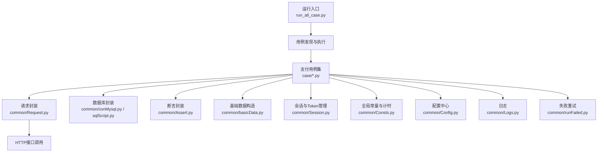
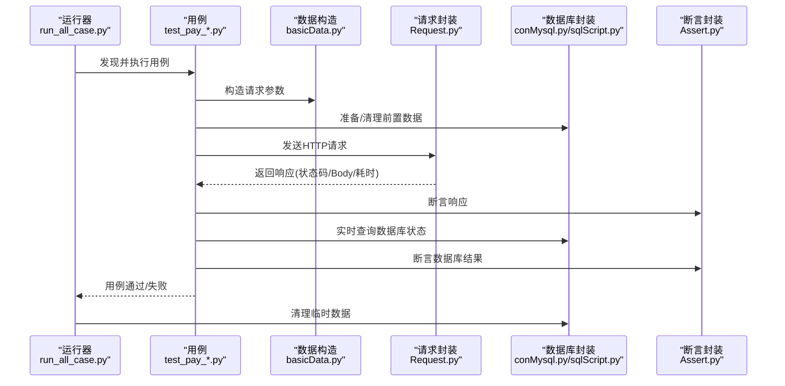
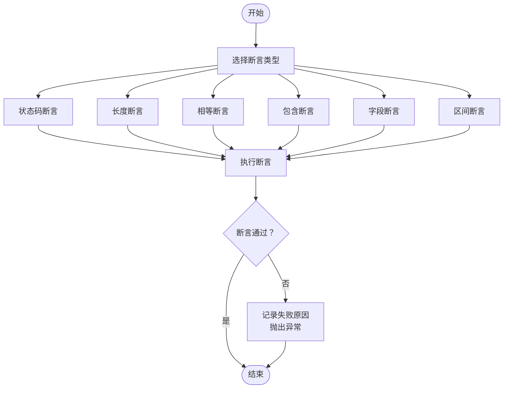
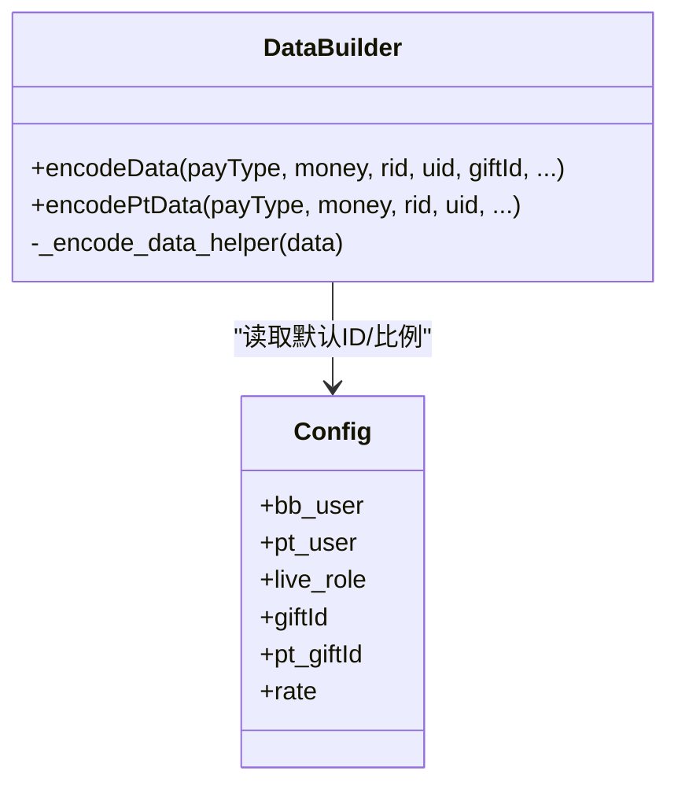
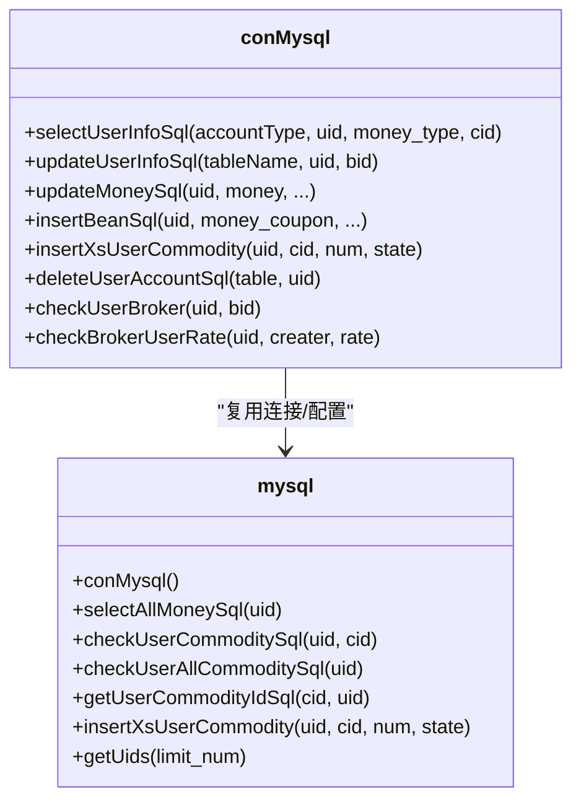
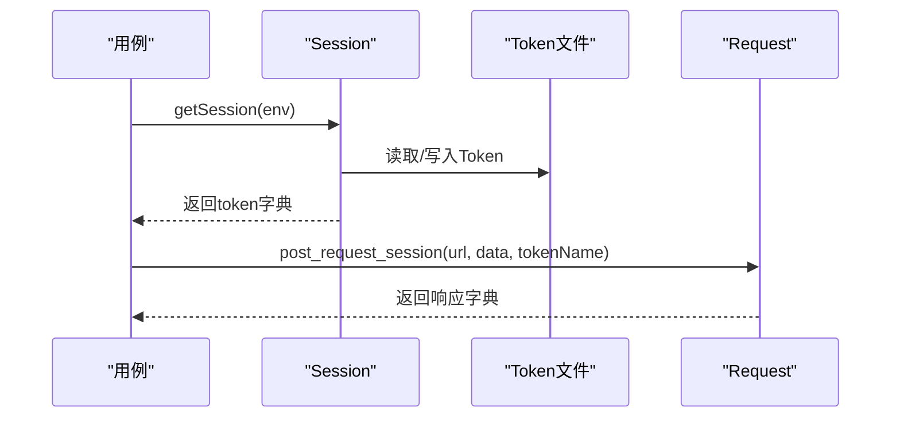
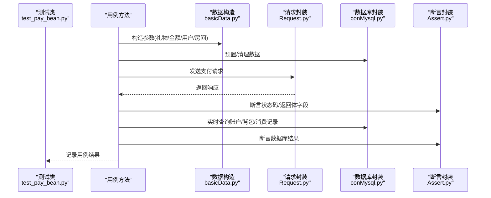
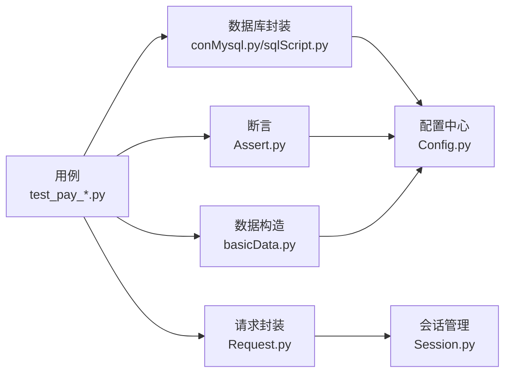

# 测试数据验证

<cite>
**本文引用的文件**   
- [README.md](file://README.md)
- [run_all_case.py](file://run_all_case.py)
- [common/Assert.py](file://common/Assert.py)
- [common/Basic.yml](file://common/Basic.yml)
- [common/Config.py](file://common/Config.py)
- [common/Consts.py](file://common/Consts.py)
- [common/basicData.py](file://common/basicData.py)
- [common/sqlScript.py](file://common/sqlScript.py)
- [common/conMysql.py](file://common/conMysql.py)
- [common/Request.py](file://common/Request.py)
- [common/Session.py](file://common/Session.py)
- [common/Logs.py](file://common/Logs.py)
- [common/runFailed.py](file://common/runFailed.py)
- [case/test_pay_bean.py](file://case/test_pay_bean.py)
- [case/test_pay_shopBuy.py](file://case/test_pay_shopBuy.py)
</cite>

## 目录
1. [简介](#简介)
2. [项目结构](#项目结构)
3. [核心组件](#核心组件)
4. [架构总览](#架构总览)
5. [详细组件分析](#详细组件分析)
6. [依赖分析](#依赖分析)
7. [性能考虑](#性能考虑)
8. [故障排查指南](#故障排查指南)
9. [结论](#结论)
10. [附录](#附录)

## 简介
本文件面向QA支付测试自动化项目，系统化梳理测试数据验证策略与方法，覆盖数据完整性检查、一致性验证与准确性确认；明确测试前准备验证、测试中实时验证与测试后结果验证的流程；给出数据库查询验证、API响应验证与业务逻辑验证的自动化脚本与工具；建立数据验证标准与规则，确保测试数据满足预期业务要求；并提供验证失败的处理机制、错误定位、数据恢复与重新验证流程，以及最佳实践与常见问题解决方案。

## 项目结构
项目采用按功能域分层组织：公共模块（通用断言、配置、数据库、HTTP请求、会话管理、日志、失败重试等）、各业务域用例（case目录下的支付相关用例）、运行入口与调度脚本。整体结构清晰，便于扩展与维护。

图表来源
- [run_all_case.py:126-147](file://run_all_case.py#L126-L147)
- [common/Request.py:17-59](file://common/Request.py#L17-L59)
- [common/conMysql.py:8-26](file://common/conMysql.py#L8-L26)
- [common/Assert.py:11-96](file://common/Assert.py#L11-L96)
- [common/basicData.py:8-325](file://common/basicData.py#L8-L325)
- [common/Session.py:13-200](file://common/Session.py#L13-L200)
- [common/Consts.py:1-17](file://common/Consts.py#L1-L17)
- [common/Config.py:6-133](file://common/Config.py#L6-L133)
- [common/Logs.py:8-48](file://common/Logs.py#L8-L48)
- [common/runFailed.py:10-87](file://common/runFailed.py#L10-L87)

章节来源
- [README.md:1-38](file://README.md#L1-L38)
- [run_all_case.py:126-147](file://run_all_case.py#L126-L147)

## 核心组件
- 断言与验证
  - 统一断言封装，支持状态码、长度、相等性、包含文本、字段值、区间范围等断言，失败时记录失败原因并抛出异常，便于后续统计与告警。
- 数据构造
  - 提供多种支付场景的数据构造函数，覆盖包房打赏、聊天打赏、商城购买、守护升级/解除、标题购买、统一游戏购买等，参数灵活可配。
- 数据库访问
  - 提供MySQL连接、查询、更新、插入、删除等操作封装，支持账户余额、背包物品、守护关系、消费记录等维度的读写。
- 请求与会话
  - 封装POST请求，自动注入user-token与必要头信息；提供多应用环境的登录会话获取与Token持久化。
- 运行与统计
  - 自动发现用例、执行、统计结果、推送通知；失败用例可按需重试；全局计时与结果收集。
- 日志与配置
  - 统一日志输出与轮转；集中式配置管理，含环境URL、用户UID、房间ID、礼物ID等。

章节来源
- [common/Assert.py:11-96](file://common/Assert.py#L11-L96)
- [common/basicData.py:8-325](file://common/basicData.py#L8-L325)
- [common/conMysql.py:8-26](file://common/conMysql.py#L8-L26)
- [common/Request.py:17-59](file://common/Request.py#L17-L59)
- [common/Session.py:13-200](file://common/Session.py#L13-L200)
- [common/Consts.py:1-17](file://common/Consts.py#L1-L17)
- [common/Config.py:6-133](file://common/Config.py#L6-L133)
- [common/Logs.py:8-48](file://common/Logs.py#L8-L48)

## 架构总览
测试数据验证贯穿“准备-执行-验证-清理”闭环，形成三阶段验证体系：

- 测试前准备验证
  - 通过数据构造函数生成期望输入，使用数据库封装进行预置数据写入或清理，确保前置条件满足。
- 测试过程实时验证
  - 接口调用后立即进行断言，随后对数据库状态进行即时校验，保证过程数据一致性。
- 测试后结果验证
  - 用例结束后进行最终断言与汇总统计，失败用例按策略重试，清理临时数据，保障环境整洁。

图表来源
- [run_all_case.py:126-147](file://run_all_case.py#L126-L147)
- [case/test_pay_bean.py:28-46](file://case/test_pay_bean.py#L28-L46)
- [case/test_pay_shopBuy.py:20-42](file://case/test_pay_shopBuy.py#L20-L42)
- [common/basicData.py:8-325](file://common/basicData.py#L8-L325)
- [common/Request.py:17-59](file://common/Request.py#L17-L59)
- [common/conMysql.py:27-204](file://common/conMysql.py#L27-L204)
- [common/Assert.py:11-96](file://common/Assert.py#L11-L96)

## 详细组件分析

### 断言与验证组件
- 支持的断言类型
  - 状态码断言：验证HTTP状态码与期望一致
  - 长度断言：验证集合/字符串长度
  - 相等断言：验证数值/字符串精确相等
  - 包含断言：验证返回体包含特定文本
  - 字段断言：从返回体取指定字段并与期望比较
  - 区间断言：验证数值落入指定范围
- 失败处理
  - 失败时记录失败原因至全局列表，便于后续统计与通知；断言失败即抛出异常，中断当前用例执行。
- 使用建议
  - 在测试前准备阶段使用长度/包含断言快速过滤无效响应；
  - 在测试过程中使用字段断言与区间断言进行细粒度校验；
  - 在测试后使用相等断言进行最终核对。

图表来源
- [common/Assert.py:11-96](file://common/Assert.py#L11-L96)

章节来源
- [common/Assert.py:11-96](file://common/Assert.py#L11-L96)

### 数据构造与准备组件
- 场景覆盖
  - 包房打赏、多人包房、兑换场景、骑士守卫、电台守卫、聊天打赏、商城购买、商城购买盒子、守护相关、标题购买、统一游戏购买、酒吧购买、装饰赠送、BanBan消费等。
- 参数设计
  - 支付金额、房间ID、用户ID、礼物ID、数量、版本、星数、使用金币标记、兑换标记、位置/麦位等均可灵活配置。
- 使用建议
  - 在setUp/teardown中结合数据库封装进行数据清理与预置；
  - 对于复杂场景，先构造参数再编码发送，减少重复逻辑。

图表来源
- [common/basicData.py:8-325](file://common/basicData.py#L8-L325)
- [common/Config.py:60-129](file://common/Config.py#L60-L129)

章节来源
- [common/basicData.py:8-325](file://common/basicData.py#L8-L325)
- [common/Config.py:60-129](file://common/Config.py#L60-L129)

### 数据库访问组件
- 连接与事务
  - 统一连接池初始化与数据库选择；部分方法使用自动提交，部分显式commit/rollback，确保数据一致性。
- 查询能力
  - 支持账户余额（多账户求和/单项）、背包物品数量/总数、守护关系ID/配置、消费记录解析、VIP经验、人气等级、爵位等级、用户盐值等。
- 更新与插入
  - 支持批量清零账户余额、更新账户余额、删除金豆账户、插入金豆余额、插入用户背包、插入用户盒子等。
- 使用建议
  - 在测试前后成对使用清理与预置方法，避免跨用例污染；
  - 对关键字段使用“读-断言-写”的三段式验证，确保一致性。

图表来源
- [common/conMysql.py:8-530](file://common/conMysql.py#L8-L530)
- [common/sqlScript.py:5-145](file://common/sqlScript.py#L5-L145)

章节来源
- [common/conMysql.py:27-204](file://common/conMysql.py#L27-L204)
- [common/sqlScript.py:18-145](file://common/sqlScript.py#L18-L145)

### 请求与会话组件
- 请求封装
  - 统一POST请求，自动注入user-token与必要头信息；兼容None数据；解析JSON响应并记录耗时；异常时返回空结构并打印错误。
- 会话管理
  - 提供多环境登录会话获取，优先使用QQ登录，失败回退到Token生成器；Token持久化至本地文件，支持按应用/用户区分存储。
- 使用建议
  - 在用例中统一通过封装方法发起请求，避免直接调用requests；
  - 会话失效或异常时，确保有回退策略与重试机制。

图表来源
- [common/Session.py:19-163](file://common/Session.py#L19-L163)
- [common/Request.py:17-59](file://common/Request.py#L17-L59)

章节来源
- [common/Session.py:19-163](file://common/Session.py#L19-L163)
- [common/Request.py:17-59](file://common/Request.py#L17-L59)

### 用例验证流程示例
以下以金豆支付与商城购买为例，展示三阶段验证流程。

图表来源
- [case/test_pay_bean.py:47-171](file://case/test_pay_bean.py#L47-L171)
- [case/test_pay_shopBuy.py:21-94](file://case/test_pay_shopBuy.py#L21-L94)
- [common/basicData.py:8-325](file://common/basicData.py#L8-L325)
- [common/Request.py:17-59](file://common/Request.py#L17-L59)
- [common/conMysql.py:27-204](file://common/conMysql.py#L27-L204)
- [common/Assert.py:11-96](file://common/Assert.py#L11-L96)

章节来源
- [case/test_pay_bean.py:47-171](file://case/test_pay_bean.py#L47-L171)
- [case/test_pay_shopBuy.py:21-94](file://case/test_pay_shopBuy.py#L21-L94)

## 依赖分析
- 组件耦合
  - 用例依赖断言、数据构造、请求封装、数据库封装与配置中心；请求封装依赖会话模块；数据库封装依赖配置中心的DB连接信息。
- 关键依赖链
  - 用例 → 数据构造/断言/请求/数据库 → 配置中心
  - 请求 → 会话/配置
  - 数据库 → 配置中心
- 循环依赖
  - 未见循环依赖迹象，模块职责清晰。

图表来源
- [case/test_pay_bean.py:12-121](file://case/test_pay_bean.py#L12-L121)
- [case/test_pay_shopBuy.py:13-94](file://case/test_pay_shopBuy.py#L13-L94)
- [common/Assert.py:11-96](file://common/Assert.py#L11-L96)
- [common/basicData.py:8-325](file://common/basicData.py#L8-L325)
- [common/Request.py:17-59](file://common/Request.py#L17-L59)
- [common/conMysql.py:8-26](file://common/conMysql.py#L8-L26)
- [common/Session.py:13-200](file://common/Session.py#L13-L200)
- [common/Config.py:6-133](file://common/Config.py#L6-L133)

章节来源
- [common/Config.py:6-133](file://common/Config.py#L6-L133)

## 性能考虑
- 接口延迟与抖动
  - 断言模块在非特定节点上引入短暂延迟，缓解RPC接口延迟导致的误判风险。
- 数据库事务
  - 部分更新/插入/删除操作显式commit/rollback，避免长事务占用资源；注意批量操作时的事务边界。
- 日志与网络
  - 统一日志轮转与异步输出，避免磁盘IO阻塞；请求封装关闭SSL校验以提升速度，生产环境请谨慎使用。

章节来源
- [common/Assert.py:17-18](file://common/Assert.py#L17-L18)
- [common/conMysql.py:338-361](file://common/conMysql.py#L338-L361)
- [common/Request.py:25-26](file://common/Request.py#L25-L26)

## 故障排查指南
- 断言失败
  - 查看失败原因列表与异常栈，定位具体断言点；优先检查响应体结构与字段命名是否与断言一致。
- 数据库不一致
  - 确认断言前后的数据准备/清理是否正确执行；检查事务是否被意外提交或回滚；核对查询字段与期望值。
- 请求异常
  - 检查会话Token是否有效与最新；确认目标URL与参数编码是否正确；关注网络超时与证书问题。
- 用例重试
  - 使用失败重试装饰器对不稳定用例进行重试；重试前自动执行清理与重建前置数据，避免状态污染。
- 日志定位
  - 查看运行日志与失败详情日志，结合断言失败原因进行交叉验证。

章节来源
- [common/Assert.py:23-25](file://common/Assert.py#L23-L25)
- [common/Consts.py:7-8](file://common/Consts.py#L7-L8)
- [common/runFailed.py:60-78](file://common/runFailed.py#L60-L78)
- [common/Logs.py:8-48](file://common/Logs.py#L8-L48)

## 结论
本项目通过统一的断言、数据构造、数据库封装与请求封装，构建了完整的测试数据验证体系。三阶段验证流程确保了从准备、执行到收尾的全链路质量控制。建议在后续迭代中进一步完善数据库一致性校验规则、增强异常场景的断言覆盖，并持续优化重试与清理策略，以提升自动化测试的稳定性与可维护性。

## 附录

### 数据验证标准与规则
- 数据完整性
  - 必要字段齐全、类型匹配、范围合理；对关键字段进行必填校验与默认值处理。
- 数据一致性
  - 接口返回与数据库状态一致；同一事务内读写顺序正确；跨表关联字段一致。
- 数据准确性
  - 金额计算遵循业务规则（如分成比例、手续费、兑换率）；数量与余额变化符合预期；消费记录reason字段解析正确。

章节来源
- [common/conMysql.py:189-201](file://common/conMysql.py#L189-L201)
- [common/Config.py:57](file://common/Config.py#L57)

### 自动化脚本与工具清单
- 数据库查询验证
  - 使用数据库封装的查询方法读取账户余额、背包数量、消费记录等，配合断言进行验证。
- API响应验证
  - 使用请求封装发送请求，使用断言封装对状态码、返回体字段、文本包含等进行验证。
- 业务逻辑验证
  - 在用例中组合数据构造、请求与数据库查询，对业务规则进行端到端验证。

章节来源
- [common/conMysql.py:27-204](file://common/conMysql.py#L27-L204)
- [common/Request.py:17-59](file://common/Request.py#L17-L59)
- [common/Assert.py:11-96](file://common/Assert.py#L11-L96)

### 数据验证失败处理机制
- 错误定位
  - 通过断言失败原因列表与日志输出快速定位失败点。
- 数据恢复
  - 在用例的清理阶段统一回收临时数据；对关键表进行回滚或重置。
- 重新验证
  - 对不稳定用例启用重试装饰器，重试前重建前置数据，确保独立性与可重复性。

章节来源
- [common/Consts.py:7-8](file://common/Consts.py#L7-L8)
- [common/runFailed.py:60-78](file://common/runFailed.py#L60-L78)
- [run_all_case.py:20-44](file://run_all_case.py#L20-L44)

### 最佳实践与常见问题
- 最佳实践
  - 在setUp/tearDown中成对使用数据准备与清理，避免用例间相互影响；
  - 对关键业务路径增加数据库实时校验，确保过程一致性；
  - 对易波动的接口增加断言延迟或重试策略；
  - 统一使用配置中心管理环境与ID，避免硬编码。
- 常见问题
  - Token过期：通过会话模块回退策略自动刷新；
  - 数据库连接异常：检查配置中心DB信息与网络连通性；
  - 断言误报：确认响应体结构与字段命名，必要时增加日志打印辅助定位。

章节来源
- [common/Session.py:60-67](file://common/Session.py#L60-L67)
- [common/Config.py:6-133](file://common/Config.py#L6-L133)
- [common/Assert.py:17-18](file://common/Assert.py#L17-L18)