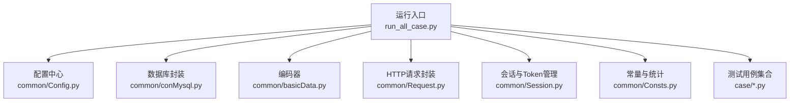
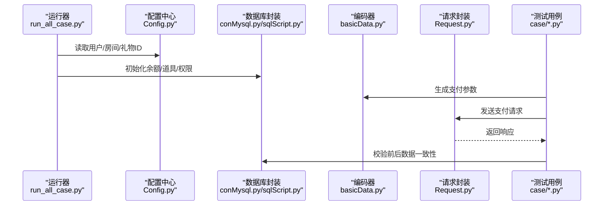
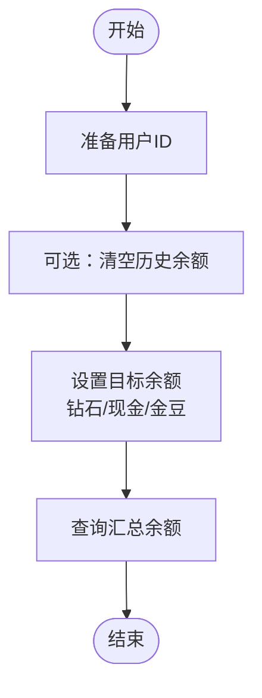
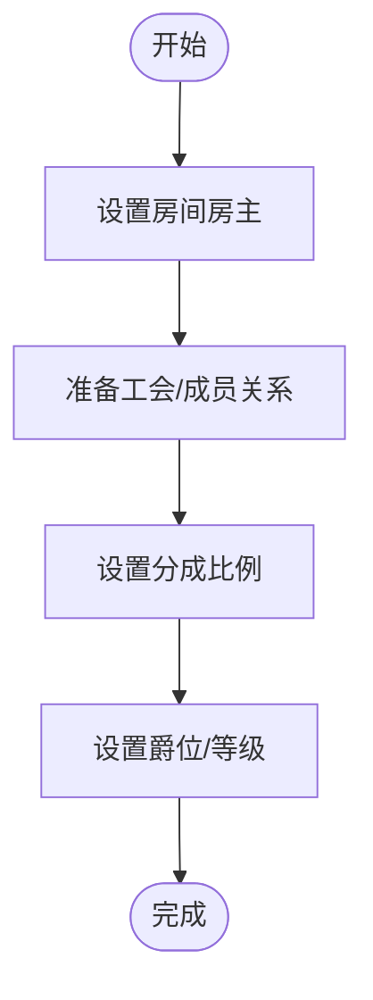
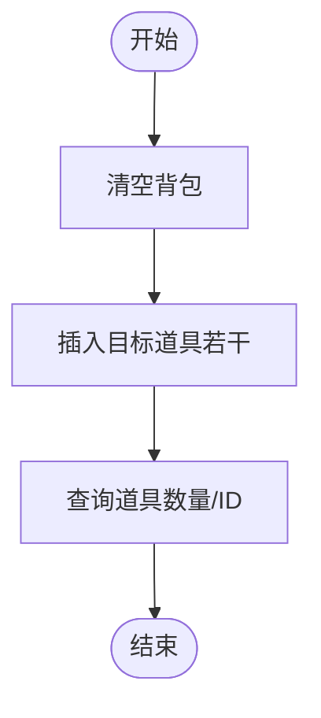
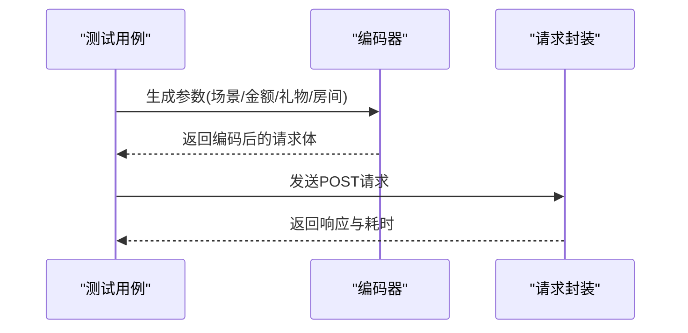
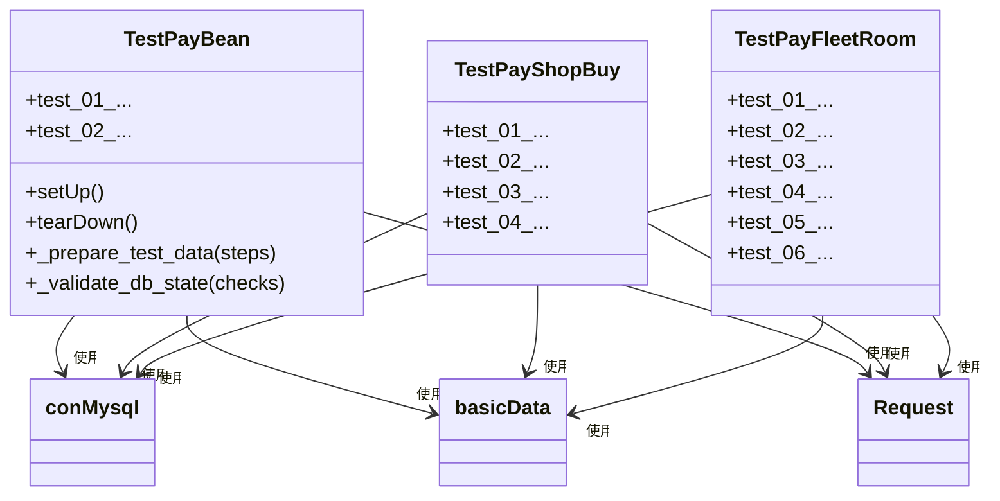
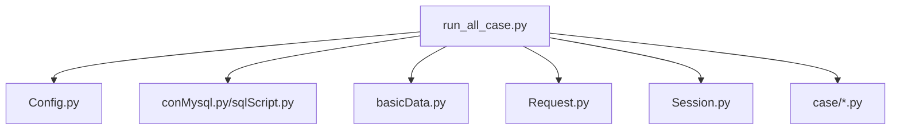

# 用户数据准备

<cite>
**本文引用的文件**
- [README.md](file://README.md)
- [run_all_case.py](file://run_all_case.py)
- [common/Config.py](file://common/Config.py)
- [common/basicData.py](file://common/basicData.py)
- [common/sqlScript.py](file://common/sqlScript.py)
- [common/conMysql.py](file://common/conMysql.py)
- [common/Request.py](file://common/Request.py)
- [common/Session.py](file://common/Session.py)
- [common/Consts.py](file://common/Consts.py)
- [case/test_pay_bean.py](file://case/test_pay_bean.py)
- [case/test_pay_shopBuy.py](file://case/test_pay_shopBuy.py)
- [case/test_pay_fleetRoom.py](file://case/test_pay_fleetRoom.py)
- [common/basicSlpData.py](file://common/basicSlpData.py)
</cite>

## 目录
1. [简介](#简介)
2. [项目结构](#项目结构)
3. [核心组件](#核心组件)
4. [架构总览](#架构总览)
5. [详细组件分析](#详细组件分析)
6. [依赖分析](#依赖分析)
7. [性能考虑](#性能考虑)
8. [故障排查指南](#故障排查指南)
9. [结论](#结论)
10. [附录](#附录)

## 简介
本文件面向QA支付测试自动化项目，系统化阐述“用户数据准备”的全流程与最佳实践，覆盖以下关键目标：
- 初始化测试用户账户余额、权限与状态
- 明确各类测试场景对用户数据的具体需求（支付、房间、礼物等）
- 提供批量准备方法（注册、充值、权限分配）
- 解释用户数据隔离机制，确保测试互不干扰
- 给出数据验证方法，保障测试前后一致性
- 总结常见问题与解决方案

## 项目结构
该项目采用按功能域划分的目录组织方式，其中与用户数据准备直接相关的模块集中在 common 与 case 目录：
- common：通用工具与基础设施（配置、数据库操作、HTTP请求、会话管理、常量等）
- case：各业务场景的测试用例（按功能命名，如支付、商店购买、房间等）

图表来源
- [run_all_case.py:126-147](file://run_all_case.py#L126-L147)
- [common/Config.py:6-133](file://common/Config.py#L6-L133)
- [common/conMysql.py:8-530](file://common/conMysql.py#L8-L530)
- [common/basicData.py:1-581](file://common/basicData.py#L1-L581)
- [common/Request.py:1-162](file://common/Request.py#L1-L162)
- [common/Session.py:1-200](file://common/Session.py#L1-L200)
- [common/Consts.py:1-17](file://common/Consts.py#L1-L17)

章节来源
- [README.md:1-38](file://README.md#L1-L38)
- [run_all_case.py:126-147](file://run_all_case.py#L126-L147)

## 核心组件
- 配置中心（Config）：集中定义用户UID、房间RID、礼物ID、环境URL等全局常量，为数据准备与测试用例提供统一参数来源。
- 数据库封装（conMysql/sqlScript）：提供账户余额、背包道具、用户属性等查询与更新能力；支持批量清理与初始化。
- 编码器（basicData）：根据支付类型动态构造请求参数，覆盖房间打赏、聊天礼物、商城购买、守护等场景。
- 请求封装（Request）：统一封装HTTP POST请求，自动注入用户Token与头部信息。
- 会话管理（Session）：负责登录态获取与持久化，保证测试请求具备有效身份。
- 测试用例（case/*.py）：围绕具体业务场景编写，展示如何准备与验证用户数据。

章节来源
- [common/Config.py:6-133](file://common/Config.py#L6-L133)
- [common/conMysql.py:8-530](file://common/conMysql.py#L8-L530)
- [common/sqlScript.py:1-145](file://common/sqlScript.py#L1-L145)
- [common/basicData.py:1-581](file://common/basicData.py#L1-L581)
- [common/Request.py:1-162](file://common/Request.py#L1-L162)
- [common/Session.py:1-200](file://common/Session.py#L1-L200)

## 架构总览
用户数据准备的整体流程如下：
- 通过配置中心获取测试用户与房间、礼物等ID
- 使用数据库封装进行余额与道具初始化
- 使用编码器生成符合业务场景的请求参数
- 通过请求封装发送支付请求
- 在测试前后使用数据库封装进行一致性校验

图表来源
- [run_all_case.py:126-147](file://run_all_case.py#L126-L147)
- [common/Config.py:6-133](file://common/Config.py#L6-L133)
- [common/conMysql.py:8-530](file://common/conMysql.py#L8-L530)
- [common/sqlScript.py:1-145](file://common/sqlScript.py#L1-L145)
- [common/basicData.py:1-581](file://common/basicData.py#L1-L581)
- [common/Request.py:1-162](file://common/Request.py#L1-L162)

## 详细组件分析

### 组件A：用户账户余额初始化
- 目标：为打赏者与被打赏者设置初始余额，满足不同支付场景（钻石、金豆、现金等）
- 关键方法：
  - 更新余额：updateMoneySql（支持money、money_b、money_cash、money_cash_b、gold_coin、money_debts）
  - 清空余额：updateUserMoneyClearSql（批量清零）
  - 查询汇总：selectAllMoneySql（查询账户余额总和）
- 典型场景：
  - 支付测试：准备钻石/现金余额，确保能完成打赏或购买
  - 金豆场景：插入金豆余额，验证金豆抵扣与转换逻辑

图表来源
- [common/conMysql.py:335-360](file://common/conMysql.py#L335-L360)
- [common/sqlScript.py:29-57](file://common/sqlScript.py#L29-L57)

章节来源
- [common/conMysql.py:335-360](file://common/conMysql.py#L335-L360)
- [common/sqlScript.py:29-57](file://common/sqlScript.py#L29-L57)

### 组件B：用户权限与状态初始化
- 目标：为房间、家族/联盟、守护等场景准备必要的用户状态
- 关键方法：
  - 房间权限：updateUserInfoSql('chatroom') 设置房主
  - 守护关系：checkUserXsBroker/checkUserBroker 确保工会/关系存在
  - 分成比例：checkBrokerUserRate 设置分成比
  - 爵位/等级：checkUserXsMentorLevel 设置一代宗师等
- 典型场景：
  - 房间测试：设置房间房主与房间类型
  - 家族房测试：查询并确认家族房ID，准备成员关系
  - 守护测试：准备守护关系配置与关系ID

图表来源
- [common/conMysql.py:276-321](file://common/conMysql.py#L276-L321)
- [common/conMysql.py:424-529](file://common/conMysql.py#L424-L529)

章节来源
- [common/conMysql.py:276-321](file://common/conMysql.py#L276-L321)
- [common/conMysql.py:424-529](file://common/conMysql.py#L424-L529)

### 组件C：礼物与背包初始化
- 目标：准备用户背包中的礼物/道具，满足“背包内物品打赏”等场景
- 关键方法：
  - 插入道具：insertXsUserCommodity
  - 查询道具数量/ID：checkUserCommoditySql/getUserCommodityIdSql
  - 清空背包：deleteUserAccountSql('user_commodity')
- 典型场景：
  - 商城购买后打赏：先购买道具，再在房间中打赏
  - 背包不足场景：准备少量道具，触发余额不足提示

图表来源
- [common/conMysql.py:402-414](file://common/conMysql.py#L402-L414)
- [common/sqlScript.py:58-84](file://common/sqlScript.py#L58-L84)

章节来源
- [common/conMysql.py:402-414](file://common/conMysql.py#L402-L414)
- [common/sqlScript.py:58-84](file://common/sqlScript.py#L58-L84)

### 组件D：请求参数编码与发送
- 目标：根据场景动态构造请求参数并发送支付请求
- 关键方法：
  - 编码器：encodeData/encodePtData（支持房间打赏、聊天礼物、商城购买、守护等）
  - 请求封装：post_request_session（自动注入Token与头部）
- 典型场景：
  - 房间打赏：构造房间ID、礼物ID、数量等
  - 聊天礼物：构造私聊对象与礼物参数
  - 商城购买：构造商品ID与数量

图表来源
- [common/basicData.py:8-325](file://common/basicData.py#L8-L325)
- [common/Request.py:17-59](file://common/Request.py#L17-L59)

章节来源
- [common/basicData.py:8-325](file://common/basicData.py#L8-L325)
- [common/Request.py:17-59](file://common/Request.py#L17-L59)

### 组件E：测试用例中的数据准备模式
- setUp/tearDown：在每个用例前后清理测试用户数据，避免跨用例污染
- _prepare_test_data/_validate_db_state：抽象化的准备与验证流程，便于复用
- 典型用例：
  - 金豆支付：准备金豆余额，验证不足与足够的场景
  - 商城购买：准备钻石/现金余额，购买后校验余额与背包
  - 家族房：准备房间ID与成员关系，验证不同房间下的分成比例

图表来源
- [case/test_pay_bean.py:12-277](file://case/test_pay_bean.py#L12-L277)
- [case/test_pay_shopBuy.py:13-124](file://case/test_pay_shopBuy.py#L13-L124)
- [case/test_pay_fleetRoom.py:12-158](file://case/test_pay_fleetRoom.py#L12-L158)
- [common/conMysql.py:8-530](file://common/conMysql.py#L8-L530)
- [common/basicData.py:1-581](file://common/basicData.py#L1-L581)
- [common/Request.py:1-162](file://common/Request.py#L1-L162)

章节来源
- [case/test_pay_bean.py:12-277](file://case/test_pay_bean.py#L12-L277)
- [case/test_pay_shopBuy.py:13-124](file://case/test_pay_shopBuy.py#L13-L124)
- [case/test_pay_fleetRoom.py:12-158](file://case/test_pay_fleetRoom.py#L12-L158)

## 依赖分析
- 运行入口（run_all_case.py）负责发现并执行测试用例，串联配置、数据库、编码器与请求封装
- 测试用例依赖配置中心与数据库封装，通过编码器与请求封装完成业务交互
- 会话管理模块提供Token持久化，确保请求具备有效身份

图表来源
- [run_all_case.py:126-147](file://run_all_case.py#L126-L147)
- [common/Config.py:6-133](file://common/Config.py#L6-L133)
- [common/conMysql.py:8-530](file://common/conMysql.py#L8-L530)
- [common/sqlScript.py:1-145](file://common/sqlScript.py#L1-L145)
- [common/basicData.py:1-581](file://common/basicData.py#L1-L581)
- [common/Request.py:1-162](file://common/Request.py#L1-L162)
- [common/Session.py:1-200](file://common/Session.py#L1-L200)

章节来源
- [run_all_case.py:126-147](file://run_all_case.py#L126-L147)

## 性能考虑
- 数据库操作批量化：在批量准备场景中优先使用批量更新/删除，减少事务次数
- 请求并发控制：在并发测试中注意数据库锁与幂等性，避免重复初始化导致的数据竞争
- Token复用：通过会话管理模块持久化Token，减少重复登录开销
- 参数构造优化：编码器按需生成最小必要参数，降低请求体积与解析成本

## 故障排查指南
- 余额不足/支付失败
  - 检查余额初始化是否成功（updateMoneySql）
  - 核对查询字段（sum_money/single_money）与期望值
- 金豆抵扣/转换异常
  - 确认金豆余额与插入逻辑（insertBeanSql/deleteUserBeanSql）
  - 校验VIP经验值增长逻辑（pay_room_money）
- 背包道具缺失
  - 确认道具插入（insertXsUserCommodity）与查询（checkUserCommoditySql）
  - 校验道具ID与数量是否匹配
- 房间/权限错误
  - 确认房间房主设置（updateUserInfoSql('chatroom')）
  - 校验家族房ID与成员关系（selectUserInfoSql('fleet'))
- Token无效
  - 检查Token写入与读取（Session.checkUserToken）
  - 必要时回退到备用Token生成逻辑（getToken）

章节来源
- [common/conMysql.py:27-204](file://common/conMysql.py#L27-L204)
- [common/sqlScript.py:29-124](file://common/sqlScript.py#L29-L124)
- [common/Session.py:168-200](file://common/Session.py#L168-L200)

## 结论
通过配置中心、数据库封装、编码器与请求封装的协同，本项目实现了可复用、可维护的用户数据准备体系。结合测试用例中的标准化准备与验证流程，能够高效支撑支付、房间、礼物等多场景测试，并确保测试数据的隔离与一致性。

## 附录

### 不同场景对用户数据的需求清单
- 支付测试（钻石/现金）
  - 打赏者：money/money_cash/money_cash_b/money_b/gold_coin
  - 被打赏者：money/money_cash_b（用于分成）
- 金豆场景
  - 打赏者/被打赏者：金豆余额（money_coupon），必要时插入/删除
- 商城购买
  - 打赏者：money_cash/money_cash_b/money_b，购买后校验sum_money与背包数量
- 房间/家族房
  - 房主：chatroom表设置
  - 成员：broker_user/mentor_exp等
- 守护/分成
  - 关系配置：relation_config/relation_id
  - 分成比例：broker_user_rate

章节来源
- [common/conMysql.py:27-204](file://common/conMysql.py#L27-L204)
- [common/Config.py:59-133](file://common/Config.py#L59-L133)
- [case/test_pay_bean.py:28-80](file://case/test_pay_bean.py#L28-L80)
- [case/test_pay_shopBuy.py:20-67](file://case/test_pay_shopBuy.py#L20-L67)
- [case/test_pay_fleetRoom.py:19-40](file://case/test_pay_fleetRoom.py#L19-L40)