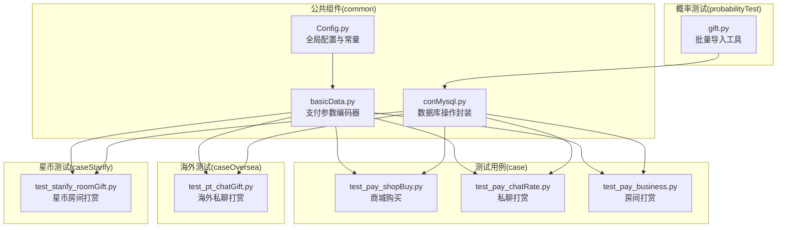
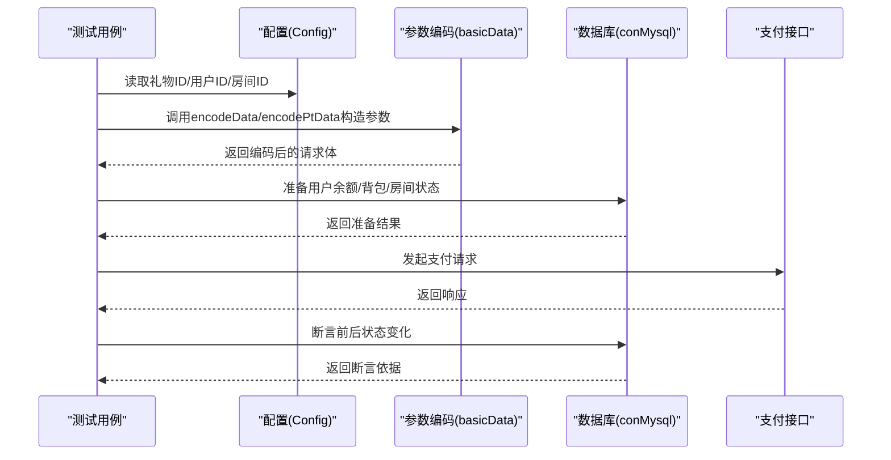
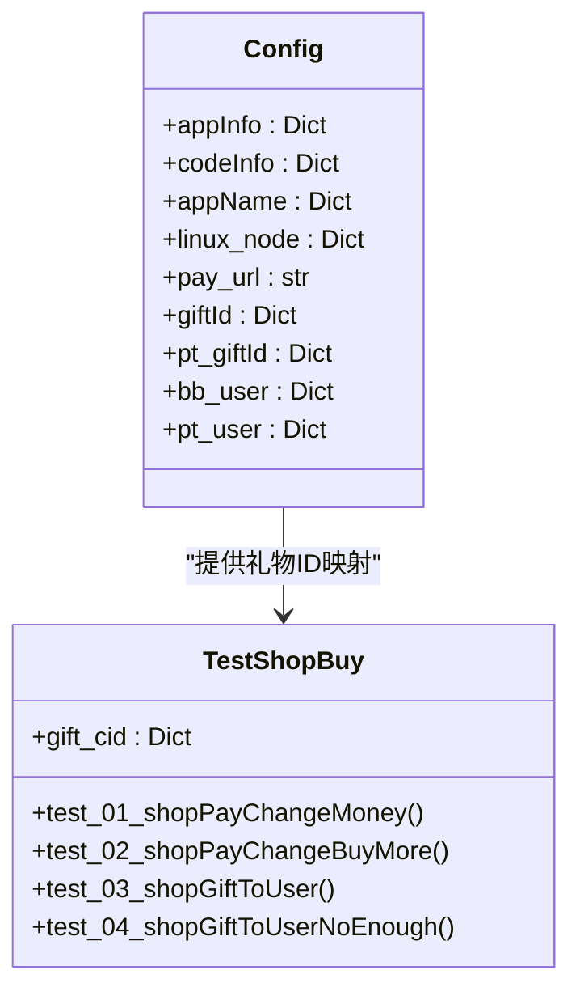
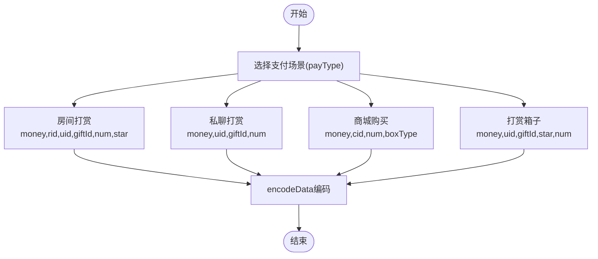
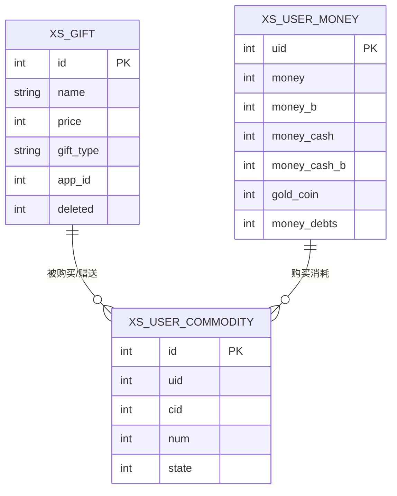
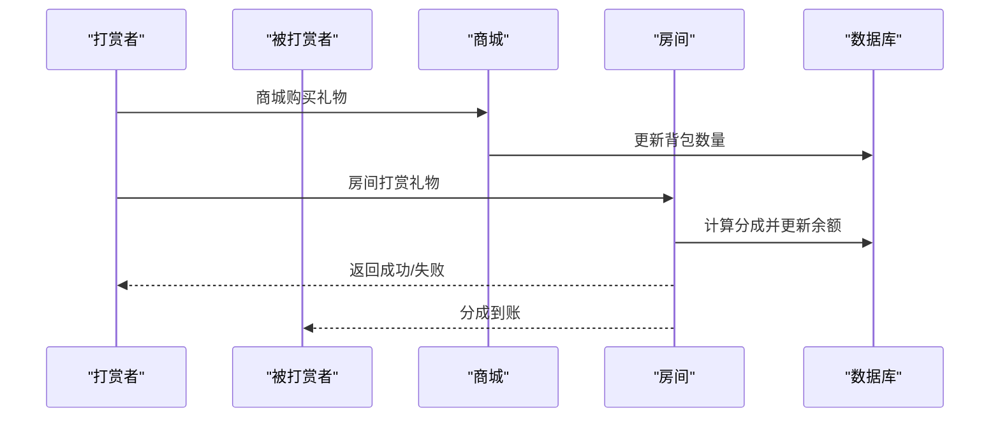
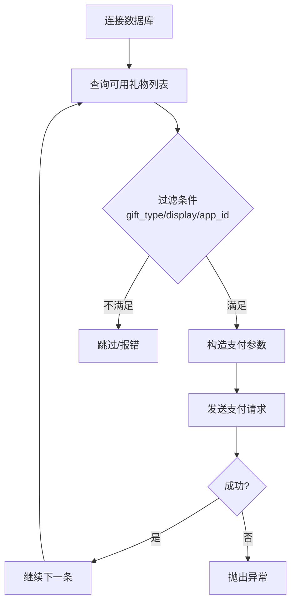
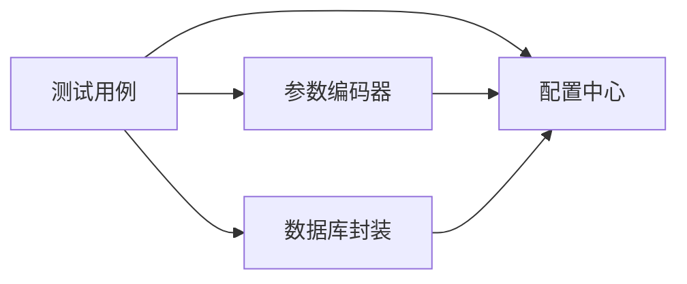

# 礼物数据准备

<cite>
**本文档引用的文件**
- [README.md](file://README.md)
- [Config.py](file://common/Config.py)
- [basicData.py](file://common/basicData.py)
- [conMysql.py](file://common/conMysql.py)
- [test_pay_shopBuy.py](file://case/test_pay_shopBuy.py)
- [test_pay_chatRate.py](file://case/test_pay_chatRate.py)
- [test_pay_business.py](file://case/test_pay_business.py)
- [test_pt_chatGift.py](file://caseOversea/test_pt_chatGift.py)
- [test_starify_roomGift.py](file://caseStarify/test_starify_roomGift.py)
- [gift.py](file://probabilityTest/gift.py)
</cite>

## 目录
1. [简介](#简介)
2. [项目结构](#项目结构)
3. [核心组件](#核心组件)
4. [架构概览](#架构概览)
5. [详细组件分析](#详细组件分析)
6. [依赖分析](#依赖分析)
7. [性能考虑](#性能考虑)
8. [故障排除指南](#故障排除指南)
9. [结论](#结论)
10. [附录](#附录)

## 简介
本文件为QA支付测试自动化项目的礼物数据准备文档，旨在系统化地说明礼物系统的数据准备策略与实现细节。内容涵盖礼物ID配置、礼物价格设置、礼物类型分类、礼物库存管理，以及不同类型礼物在测试中的应用场景（房间打赏礼物、私聊礼物、商城购买礼物等）。同时提供批量导入与配置方法、礼物数据与用户数据的关联关系、一致性保障机制、验证机制、常见问题与解决方案。

## 项目结构
该项目采用按功能模块划分的组织方式，核心与测试相关的关键目录如下：
- common：公共组件，包含配置、数据库操作、请求封装、断言等
- case：主业务线测试用例（国内版）
- caseOversea：海外业务线测试用例
- caseStarify：星币业务线测试用例
- probabilityTest：概率测试与批量导入工具
- 根目录：运行入口与说明文档

**图表来源**
- [Config.py](file://common/Config.py)
- [basicData.py](file://common/basicData.py)
- [conMysql.py](file://common/conMysql.py)
- [test_pay_shopBuy.py](file://case/test_pay_shopBuy.py)
- [test_pay_chatRate.py](file://case/test_pay_chatRate.py)
- [test_pay_business.py](file://case/test_pay_business.py)
- [test_pt_chatGift.py](file://caseOversea/test_pt_chatGift.py)
- [test_starify_roomGift.py](file://caseStarify/test_starify_roomGift.py)
- [gift.py](file://probabilityTest/gift.py)

**章节来源**
- [README.md](file://README.md)
- [Config.py](file://common/Config.py)

## 核心组件
- 配置中心（Config.py）
  - 统一管理应用信息、用户UID、房间ID、礼物ID映射等
  - 提供不同环境（dev/main）与业务线（bb/pt/starify/slp）的URL与参数
- 支付参数编码器（basicData.py）
  - 提供多种支付场景的参数构造方法，覆盖房间打赏、私聊、商城购买、箱子、守护等
  - 支持多用户打赏、连击、星币/背包组合支付等复杂场景
- 数据库操作封装（conMysql.py）
  - 提供查询、更新、删除、插入等通用方法
  - 包含礼物配置检查、用户账户清理、背包商品增删等专用方法
- 测试用例（case/*）
  - 国内版：商城购买、私聊打赏、房间打赏等
  - 海外版：私聊打赏（PT区域）
  - 星币版：房间打赏（星币场景）

**章节来源**
- [Config.py](file://common/Config.py)
- [basicData.py](file://common/basicData.py)
- [conMysql.py](file://common/conMysql.py)

## 架构概览
礼物数据准备的整体流程由“配置→参数编码→数据库准备→接口调用→结果断言”构成，贯穿多条业务线与支付场景。

**图表来源**
- [Config.py](file://common/Config.py)
- [basicData.py](file://common/basicData.py)
- [conMysql.py](file://common/conMysql.py)

## 详细组件分析

### 礼物ID配置与映射
- 国内版礼物ID映射集中于配置中心，便于统一维护与跨用例共享
- 海外版与星币版分别维护独立的礼物ID映射，避免冲突
- 建议在新增礼物时同步更新配置中心与对应测试用例

**图表来源**
- [Config.py](file://common/Config.py)
- [test_pay_shopBuy.py](file://case/test_pay_shopBuy.py)

**章节来源**
- [Config.py](file://common/Config.py)
- [test_pay_shopBuy.py](file://case/test_pay_shopBuy.py)

### 礼物价格设置与场景参数
- 参数编码器支持通过money、num、star、rid、uid、giftId等参数灵活组合
- 不同支付场景（房间打赏、私聊、商城购买、箱子、守护）通过payType区分
- 场景参数示例：
  - 房间打赏：money、rid、uid、giftId、num、star
  - 私聊打赏：money、uid、giftId、num
  - 商城购买：money、cid、num、boxType
  - 多人打赏：uids、position、num_more

**图表来源**
- [basicData.py](file://common/basicData.py)

**章节来源**
- [basicData.py](file://common/basicData.py)

### 礼物类型分类与库存管理
- 礼物类型分类
  - 正常礼物：用于房间打赏与私聊
  - 礼盒/箱子：用于房间打赏，支持星级与连击
  - 商城道具：通过商城购买后进入背包，支持赠送与使用
- 库存管理
  - 背包商品：xs_user_commodity，支持插入、查询、删除
  - 用户余额：xs_user_money，支持批量更新与清理
  - 礼物配置：xs_gift，支持启用/禁用检查

**图表来源**
- [conMysql.py](file://common/conMysql.py)

**章节来源**
- [conMysql.py](file://common/conMysql.py)

### 不同类型礼物的应用场景
- 房间打赏礼物
  - 国内版：支持GS分成、房主/公会会长分成、多人打赏、连击等
  - 星币版：支持星币余额、背包组合支付、连击奖励区间
- 私聊礼物
  - 国内版：GS用户与普通用户分成比例不同；箱子场景支持星级
  - 海外版：私聊打赏与国内版类似，但分成比例与货币单位不同
- 商城购买礼物
  - 支持单个与批量购买；购买后进入背包，可在房间内赠送
  - 赠送场景需校验背包数量与赠送后余额

**图表来源**
- [test_pay_shopBuy.py](file://case/test_pay_shopBuy.py)
- [test_pay_business.py](file://case/test_pay_business.py)
- [test_starify_roomGift.py](file://caseStarify/test_starify_roomGift.py)

**章节来源**
- [test_pay_business.py](file://case/test_pay_business.py)
- [test_pay_shopBuy.py](file://case/test_pay_shopBuy.py)
- [test_starify_roomGift.py](file://caseStarify/test_starify_roomGift.py)

### 礼物数据的批量导入与配置
- 批量导入工具
  - 使用概率测试中的批量导入脚本，自动遍历xs_gift表中符合条件的礼物进行批量支付
  - 可通过修改循环次数与金额参数控制批量规模
- 标准化设置
  - 统一gift_type、display、app_id等字段，确保礼物在目标场景可用
  - 通过数据库检查与更新保证礼物配置有效

**图表来源**
- [gift.py](file://probabilityTest/gift.py)

**章节来源**
- [gift.py](file://probabilityTest/gift.py)

### 礼物数据与用户数据的关联关系
- 背包与余额联动
  - 商城购买后，余额减少、背包增加；房间打赏时优先消耗背包，不足再扣余额
- 分成计算与账户更新
  - 房间打赏与私聊打赏根据角色身份与场景计算分成，更新对应账户
- 数据一致性保障
  - 用例执行前统一清理用户账户，确保测试隔离
  - 通过断言验证前后状态变化，确保数据一致性

**章节来源**
- [test_pay_shopBuy.py](file://case/test_pay_shopBuy.py)
- [test_pay_chatRate.py](file://case/test_pay_chatRate.py)
- [test_pay_business.py](file://case/test_pay_business.py)

### 礼物数据验证机制
- 接口状态码与返回体断言
  - 成功/失败场景均进行状态码与消息断言
- 账户余额与背包断言
  - 余额断言：sum_money、single_money等
  - 背包断言：num_commodity、id_commodity等
- 场景特有断言
  - 星币版：星币余额、魅力值、财富值区间断言
  - 连击场景：按连击数倍数断言奖励范围

**章节来源**
- [test_starify_roomGift.py](file://caseStarify/test_starify_roomGift.py)
- [test_pt_chatGift.py](file://caseOversea/test_pt_chatGift.py)

## 依赖分析
- 组件耦合
  - 测试用例依赖配置中心与参数编码器，二者相对独立，便于扩展
  - 数据库封装为所有用例提供统一的数据准备与断言依据
- 外部依赖
  - 支付接口、数据库、外部服务（如登录令牌）
- 潜在风险
  - 不同业务线礼物ID冲突
  - 数据库连接与事务回滚处理

**图表来源**
- [Config.py](file://common/Config.py)
- [basicData.py](file://common/basicData.py)
- [conMysql.py](file://common/conMysql.py)

**章节来源**
- [Config.py](file://common/Config.py)
- [basicData.py](file://common/basicData.py)
- [conMysql.py](file://common/conMysql.py)

## 性能考虑
- 批量导入建议
  - 控制并发与延时，避免对数据库与支付接口造成过大压力
- 数据准备优化
  - 合理使用批量更新与清理，减少重复SQL开销
- 断言与日志
  - 在失败重试与断言中加入必要日志，便于定位性能瓶颈

## 故障排除指南
- 礼物ID无效
  - 检查配置中心中的giftId映射，确认ID存在且未被删除
- 余额不足
  - 使用数据库封装的余额更新方法，确保打赏前余额充足
- 背包数量不足
  - 使用背包插入方法准备测试数据，或在用例中先购买再赠送
- 分成比例异常
  - 核对角色身份与场景配置，确保符合预期分成规则
- 连击/多人场景失败
  - 检查连击KEY与多人分配逻辑，确保参数正确传递

**章节来源**
- [conMysql.py](file://common/conMysql.py)
- [test_starify_roomGift.py](file://caseStarify/test_starify_roomGift.py)

## 结论
本文件系统化梳理了礼物数据准备的策略与实现，明确了配置、参数编码、数据库准备、接口调用与断言验证的完整链路。通过标准化的配置与工具，能够高效完成多场景、多业务线的礼物测试数据准备，并确保数据一致性与可验证性。

## 附录
- 常用操作清单
  - 更新用户余额：使用数据库封装的余额更新方法
  - 清理用户账户：使用账户清理方法
  - 插入背包商品：使用背包插入方法
  - 编码支付参数：根据场景选择对应的编码器方法
- 最佳实践
  - 在用例开始前统一准备数据，结束后清理数据
  - 对关键场景添加断言与日志，便于问题定位
  - 批量导入时控制节奏，避免影响生产环境