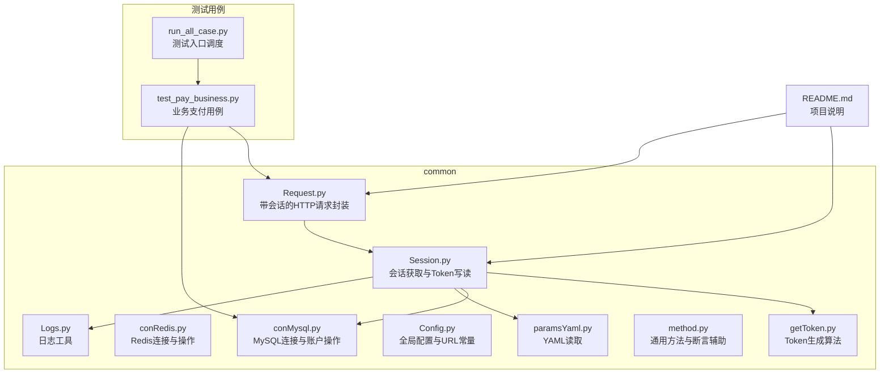
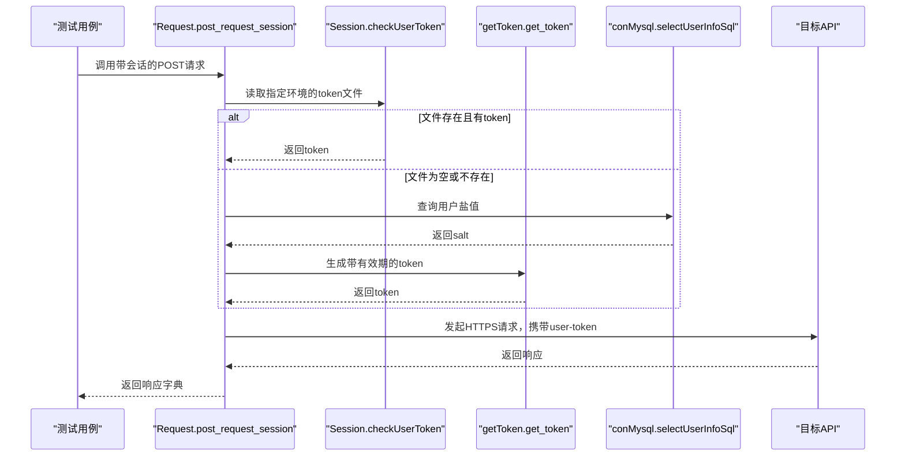
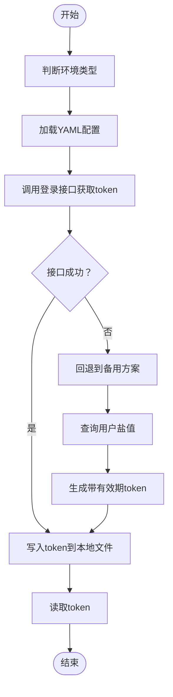
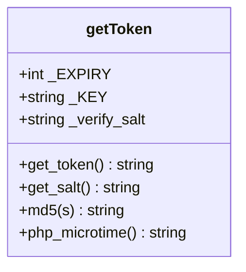
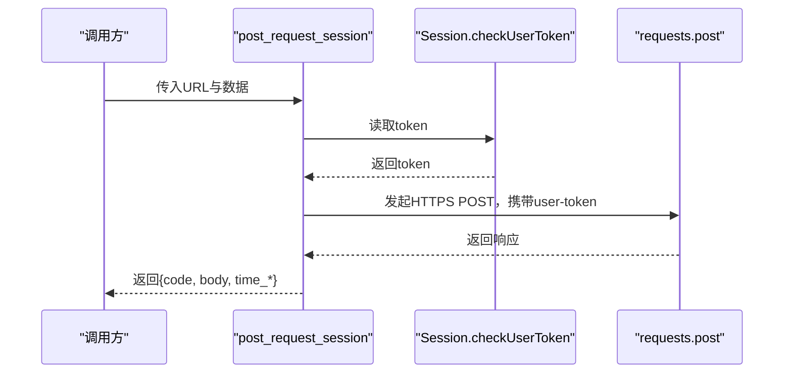
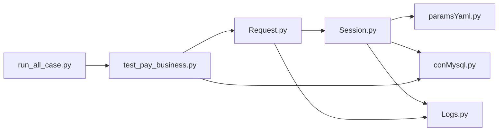

# 会话管理模块

<cite>
**本文引用的文件**
- [Session.py](file://common/Session.py)
- [getToken.py](file://common/getToken.py)
- [conRedis.py](file://common/conRedis.py)
- [conMysql.py](file://common/conMysql.py)
- [Config.py](file://common/Config.py)
- [Logs.py](file://common/Logs.py)
- [method.py](file://common/method.py)
- [paramsYaml.py](file://common/paramsYaml.py)
- [Request.py](file://common/Request.py)
- [run_all_case.py](file://run_all_case.py)
- [test_pay_business.py](file://case/test_pay_business.py)
- [README.md](file://README.md)
</cite>

## 更新摘要
**变更内容**
- 改进错误处理和日志机制，引入更详细的错误消息和改进的回退机制
- 采用配置驱动的方法处理不同环境，替换硬编码值为动态配置查找
- 增强SSL证书处理和错误报告，改进HTTPS请求的安全性
- 优化会话获取流程，提供更完善的异常处理和日志记录

## 目录
1. [简介](#简介)
2. [项目结构](#项目结构)
3. [核心组件](#核心组件)
4. [架构总览](#架构总览)
5. [详细组件分析](#详细组件分析)
6. [依赖分析](#依赖分析)
7. [性能考虑](#性能考虑)
8. [故障排查指南](#故障排查指南)
9. [结论](#结论)
10. [附录](#附录)

## 简介
本技术文档聚焦于会话管理模块，系统性阐述用户会话的创建、维护与销毁流程；会话数据的存储机制（内存、持久化、分布式）选择策略；会话过期与自动续期逻辑；会话安全措施；以及与认证系统的集成（JWT、Cookie、CSRF）。本次更新重点反映了模块在错误处理、日志记录、配置管理和SSL证书处理方面的显著增强，帮助开发者更好地理解和使用该模块。

## 项目结构
会话管理相关代码主要集中在 common 目录下，围绕登录态获取、请求头注入、日志记录与配置展开，并通过测试用例驱动实际业务场景。

**图表来源**
- [Session.py:1-200](file://common/Session.py#L1-L200)
- [getToken.py:1-93](file://common/getToken.py#L1-L93)
- [conRedis.py:1-34](file://common/conRedis.py#L1-L34)
- [conMysql.py:1-530](file://common/conMysql.py#L1-L530)
- [Config.py:1-133](file://common/Config.py#L1-L133)
- [Logs.py:1-48](file://common/Logs.py#L1-L48)
- [method.py:1-171](file://common/method.py#L1-L171)
- [paramsYaml.py:1-32](file://common/paramsYaml.py#L1-L32)
- [Request.py:1-162](file://common/Request.py#L1-L162)
- [run_all_case.py:1-159](file://run_all_case.py#L1-L159)
- [test_pay_business.py:1-189](file://case/test_pay_business.py#L1-L189)
- [README.md:1-38](file://README.md#L1-L38)

**章节来源**
- [README.md:1-38](file://README.md#L1-L38)

## 核心组件
- **会话获取与Token管理**：负责从不同环境的登录接口获取 token，并写入本地文件；提供读取 token 的能力。现已增强错误处理和日志记录功能。
- **Token生成器**：基于自定义算法生成带有效期的 token，用于备用登录路径。
- **请求封装**：在 HTTP 请求头中注入 user-token，统一走 HTTPS，增强SSL证书处理。
- **数据存储**：
  - 本地文件：用于保存各应用环境的 token。
  - MySQL：查询用户盐值、更新账户余额等。
  - Redis：连接池与集合/哈希操作（用于白名单等场景）。
- **日志与配置**：统一的日志输出与全局配置常量，支持配置驱动的环境管理。

**章节来源**
- [Session.py:13-200](file://common/Session.py#L13-L200)
- [getToken.py:8-93](file://common/getToken.py#L8-L93)
- [Request.py:17-60](file://common/Request.py#L17-L60)
- [conMysql.py:8-530](file://common/conMysql.py#L8-L530)
- [conRedis.py:4-34](file://common/conRedis.py#L4-L34)
- [Config.py:6-133](file://common/Config.py#L6-L133)
- [Logs.py:8-48](file://common/Logs.py#L8-L48)

## 架构总览
会话管理采用"登录态获取 + 请求头注入"的轻量级架构。登录态由 Session 组件负责，Token 可来自接口登录或备用算法生成；请求阶段通过 Request 组件统一注入 user-token 头部，确保后续接口调用具备有效身份。新增了完善的错误处理和日志记录机制。

**图表来源**
- [Request.py:17-60](file://common/Request.py#L17-L60)
- [Session.py:168-200](file://common/Session.py#L168-L200)
- [getToken.py:19-63](file://common/getToken.py#L19-L63)
- [conMysql.py:133-141](file://common/conMysql.py#L133-L141)

## 详细组件分析

### 会话获取与Token写读（Session）
**更新** 增强了错误处理和日志记录机制，改进了回退机制和SSL证书处理

- **功能职责**
  - 支持多环境登录态获取（dev、rush、PT、SLP等），优先走接口登录；失败时回退到备用方案。
  - 备用方案：从数据库查询用户盐值，调用 token 生成器生成带有效期的 token，并写入本地文件。
  - 提供 token 的读写接口，按应用名与UID区分文件，便于多应用/多用户隔离。
  - **新增**：改进的错误处理和日志记录，提供更详细的错误消息。
  - **新增**：增强的SSL证书处理，支持更灵活的证书验证配置。

- **关键流程**
  - 环境判断与参数加载（YAML）。
  - 接口登录：构建请求头、参数、请求体，发起 POST，解析 JSON，提取 token 并写入文件。
  - 备用登录：捕获异常，查询数据库盐值，生成 token，写入文件。
  - 读取 token：按应用名/UID定位文件，读取最新 token。
  - **新增**：详细的错误日志记录，包括失败原因和环境信息。

**图表来源**
- [Session.py:19-166](file://common/Session.py#L19-L166)
- [Session.py:168-200](file://common/Session.py#L168-L200)
- [paramsYaml.py:8-32](file://common/paramsYaml.py#L8-L32)
- [conMysql.py:133-141](file://common/conMysql.py#L133-L141)
- [getToken.py:19-63](file://common/getToken.py#L19-L63)

**章节来源**
- [Session.py:13-200](file://common/Session.py#L13-L200)
- [paramsYaml.py:8-32](file://common/paramsYaml.py#L8-L32)
- [conMysql.py:133-141](file://common/conMysql.py#L133-L141)
- [Logs.py:8-48](file://common/Logs.py#L8-L48)

### Token生成器（getToken）
- **功能职责**
  - 生成带有效期的 token，包含时间戳、盐值、签名与加密段，支持有效期（默认约 30 天）。
- **关键点**
  - 参数字典包含用户ID、盐值、平台标识、时间戳等。
  - 使用 MD5、RC4-like 加密与 Base64 编码组合生成最终 token。
  - 有效期通过在数据前拼接过期时间戳实现。
- **应用场景**
  - 当登录接口不可用时，作为备用登录方案，结合数据库盐值生成 token。

**图表来源**
- [getToken.py:8-93](file://common/getToken.py#L8-L93)

**章节来源**
- [getToken.py:8-93](file://common/getToken.py#L8-L93)

### 请求封装（Request）
**更新** 增强了SSL证书处理和错误报告机制

- **功能职责**
  - 统一封装 POST 请求，自动注入 user-token 头部，强制 HTTPS。
  - 解析响应状态码、JSON、耗时等信息，返回标准化字典。
  - **新增**：改进的SSL证书处理，支持更灵活的证书验证配置。
  - **新增**：增强的错误报告机制，提供更详细的异常信息。
- **会话集成**
  - 通过 Session.checkUserToken 读取 token，确保每次请求都携带有效身份。
- **错误处理**
  - 捕获网络异常与解析异常，保证测试流程稳定。
  - **新增**：详细的错误日志记录，包括异常类型和详细信息。

**图表来源**
- [Request.py:17-60](file://common/Request.py#L17-L60)
- [Session.py:168-176](file://common/Session.py#L168-L176)

**章节来源**
- [Request.py:17-60](file://common/Request.py#L17-L60)

### 数据存储与配置
**更新** 采用配置驱动的方法处理不同环境

- **本地文件存储**
  - 以应用名为前缀的文本文件保存 token，便于跨进程共享与持久化。
- **MySQL**
  - 提供账户余额、盐值、等级、背包等查询与更新接口，支撑备用登录与业务校验。
- **Redis**
  - 提供连接池与集合/哈希操作，可用于白名单、会话标记等场景。
- **配置中心**
  - 统一管理各应用的登录 URL、房间 ID、礼物 ID 等常量。
  - **新增**：配置驱动的环境管理，支持动态配置查找和环境切换。

**章节来源**
- [Session.py:168-200](file://common/Session.py#L168-L200)
- [conMysql.py:28-204](file://common/conMysql.py#L28-L204)
- [conRedis.py:4-34](file://common/conRedis.py#L4-L34)
- [Config.py:6-133](file://common/Config.py#L6-L133)

### 与认证系统的集成
**更新** 改进了SSL证书处理和错误报告

- **登录态来源**
  - 主流：接口登录获取 token，写入本地文件。
  - 备用：数据库查询盐值 + 自定义算法生成 token。
- **请求头注入**
  - 在每个请求头中添加 user-token，确保服务端可识别身份。
- **Cookie与CSRF**
  - 当前实现未显式处理 Cookie 与 CSRF，建议在需要 Cookie 的场景补充 Set-Cookie 解析与同步，以及在表单请求中携带 CSRF Token。
- **SSL证书处理**
  - **新增**：改进的SSL证书处理机制，支持更灵活的证书验证配置。
  - **新增**：增强的错误报告，提供详细的SSL相关错误信息。

**章节来源**
- [Session.py:19-166](file://common/Session.py#L19-L166)
- [Request.py:27-32](file://common/Request.py#L27-L32)
- [getToken.py:19-63](file://common/getToken.py#L19-L63)

### 会话操作示例
**更新** 增强了错误处理和日志记录

- **登录会话创建**
  - 通过 Session.getSession(env) 获取 token，必要时回退到备用方案。
  - **新增**：详细的错误日志记录，包括失败原因和处理过程。
- **会话状态检查**
  - 通过 Session.checkUserToken('read', app_name) 读取 token。
- **会话数据更新**
  - 通过 conMysql 的查询与更新接口校验余额、盐值等，支撑会话有效性验证。
- **会话清理**
  - 通过本地文件写空或删除对应文件，达到"注销"效果。

**章节来源**
- [Session.py:19-166](file://common/Session.py#L19-L166)
- [Session.py:168-200](file://common/Session.py#L168-L200)
- [conMysql.py:28-204](file://common/conMysql.py#L28-L204)

### 并发控制、冲突处理与迁移策略
**更新** 增强了配置驱动的环境管理

- **并发控制**
  - 本地文件读写需注意并发竞争，建议引入文件锁或原子写入策略。
- **冲突处理**
  - 多用户/多应用场景下，按 app_name 与 UID 区分文件，避免互相覆盖。
- **迁移策略**
  - 从本地文件迁移到集中式存储（如 Redis/DB）时，保持接口不变，替换底层实现。
- **环境管理**
  - **新增**：配置驱动的环境管理，支持动态环境切换和配置查找。

**章节来源**
- [Session.py:168-200](file://common/Session.py#L168-L200)

### 监控与调试
**更新** 改进了日志机制和错误报告

- **日志**
  - 使用 Logs.get_log 输出请求日志、错误日志，便于问题定位。
  - **新增**：详细的错误日志记录，包括错误类型、环境信息和处理过程。
- **断言与结果**
  - 测试用例中使用断言工具校验接口返回，结合日志输出快速定位失败原因。
- **调试建议**
  - 在 Request 层打印响应 JSON 与耗时，有助于评估接口性能与稳定性。
  - **新增**：增强的SSL证书调试信息，帮助诊断证书相关问题。

**章节来源**
- [Logs.py:8-48](file://common/Logs.py#L8-L48)
- [method.py:94-128](file://common/method.py#L94-L128)
- [Request.py:47-59](file://common/Request.py#L47-L59)

## 依赖分析
**更新** 增强了配置驱动的依赖管理

- **组件耦合**
  - Request 依赖 Session 读取 token。
  - Session 依赖 YAML 配置、MySQL 查询盐值、日志记录。
  - 测试用例依赖 Request 与 MySQL。
- **外部依赖**
  - requests、urllib3、pymysql、redis、yaml。
  - **新增**：增强的SSL相关依赖处理。
- **循环依赖**
  - 未发现循环导入。

**图表来源**
- [Request.py:11-14](file://common/Request.py#L11-L14)
- [Session.py:8-11](file://common/Session.py#L8-L11)
- [paramsYaml.py:8-32](file://common/paramsYaml.py#L8-L32)
- [conMysql.py:5-6](file://common/conMysql.py#L5-L6)
- [Logs.py:5-6](file://common/Logs.py#L5-L6)
- [test_pay_business.py:1-11](file://case/test_pay_business.py#L1-L11)
- [run_all_case.py:7-9](file://run_all_case.py#L7-L9)

**章节来源**
- [Request.py:11-14](file://common/Request.py#L11-L14)
- [Session.py:8-11](file://common/Session.py#L8-L11)
- [paramsYaml.py:8-32](file://common/paramsYaml.py#L8-L32)
- [conMysql.py:5-6](file://common/conMysql.py#L5-L6)
- [Logs.py:5-6](file://common/Logs.py#L5-L6)
- [test_pay_business.py:1-11](file://case/test_pay_business.py#L1-L11)
- [run_all_case.py:7-9](file://run_all_case.py#L7-L9)

## 性能考虑
**更新** 增强了SSL证书处理的性能优化

- **网络开销**
  - 每次请求均进行 HTTPS POST，建议在批量请求场景合并接口或复用会话。
  - **新增**：优化的SSL证书处理，减少证书验证开销。
- **IO 开销**
  - 本地文件读写频繁时，建议引入缓存与原子写入，减少锁竞争。
- **计算开销**
  - token 生成涉及 MD5 与 RC4-like 加密，建议在高并发场景下预生成并轮换。
- **SSL性能**
  - **新增**：改进的SSL证书缓存机制，提高证书验证效率。

## 故障排查指南
**更新** 增强了错误处理和日志记录

- **登录失败**
  - 检查 YAML 配置是否正确加载；查看日志中异常堆栈。
  - **新增**：详细的错误日志，包括环境配置和请求参数信息。
- **token 为空**
  - 确认本地 token 文件是否存在且非空；必要时触发备用登录流程。
  - **新增**：增强的文件读写错误检测和日志记录。
- **请求异常**
  - 检查 Request 层的异常捕获与返回空元组的情况；关注网络超时与解析异常。
  - **新增**：详细的SSL证书错误报告和网络异常诊断。
- **数据库异常**
  - 核对 conMysql 的连接参数与 SQL 执行结果；确认事务提交/回滚逻辑。
- **SSL证书问题**
  - **新增**：专门的SSL证书故障排查指南，包括证书链验证、过期检查等。
- **环境配置问题**
  - **新增**：配置驱动的环境问题诊断，包括配置文件加载和环境变量检查。

**章节来源**
- [Session.py:168-200](file://common/Session.py#L168-L200)
- [Request.py:40-45](file://common/Request.py#L40-L45)
- [conMysql.py:28-204](file://common/conMysql.py#L28-L204)
- [Logs.py:8-48](file://common/Logs.py#L8-L48)

## 结论
会话管理模块通过"登录态获取 + 请求头注入"的轻量设计，实现了多环境、多应用的会话统一管理。本次更新显著增强了错误处理、日志记录、配置管理和SSL证书处理能力，使其在生产环境中更加健壮和可靠。其核心优势在于简单可靠、易于扩展；建议继续完善过期与自动续期策略，以提升安全性与稳定性。

## 附录
- **术语**
  - token：用于标识用户身份的字符串，通常在请求头中携带。
  - user-token：请求头中的身份标识字段。
  - 备用登录：当主流登录接口不可用时，通过数据库盐值与自定义算法生成 token 的回退方案。
  - **新增**：配置驱动：基于配置文件和环境变量的动态配置管理方式。
  - **新增**：SSL证书处理：安全套接字层证书的验证和管理机制。
- **最佳实践**
  - 在需要 Cookie 的场景补充 Cookie 同步与 CSRF Token 策略。
  - 对本地文件读写引入原子操作与锁机制，避免并发冲突。
  - 将 token 存储迁移至集中式存储（Redis/DB），并实现过期与自动续期。
  - **新增**：使用配置驱动的方法管理不同环境，避免硬编码值。
  - **新增**：实施完善的SSL证书处理和错误报告机制。
  - **新增**：建立详细的日志记录和故障排查流程。