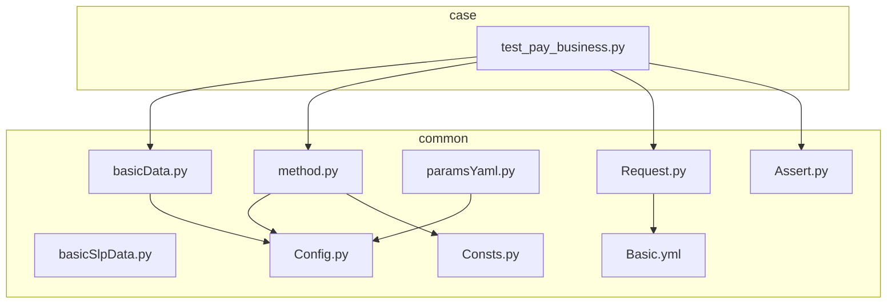
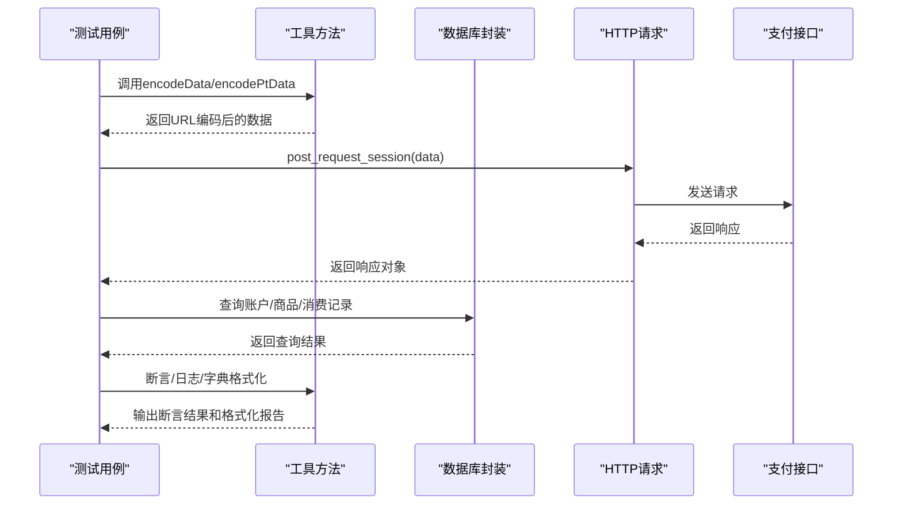
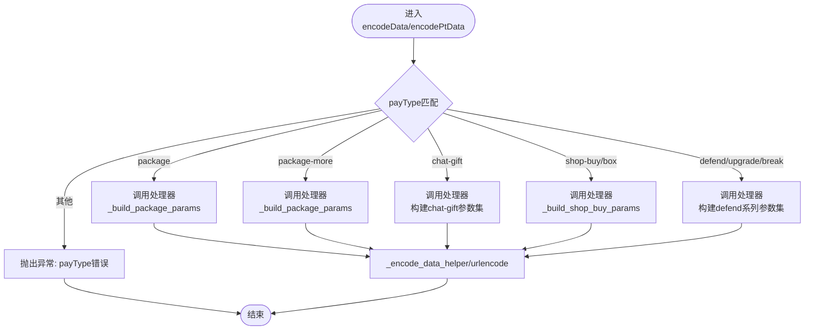
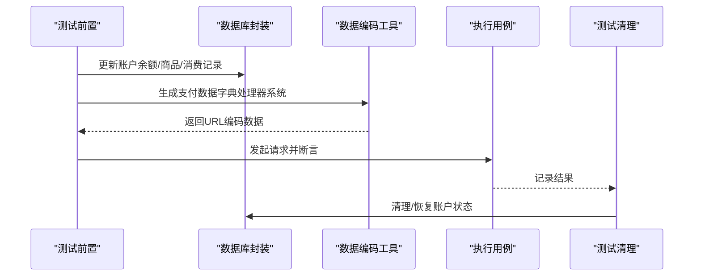
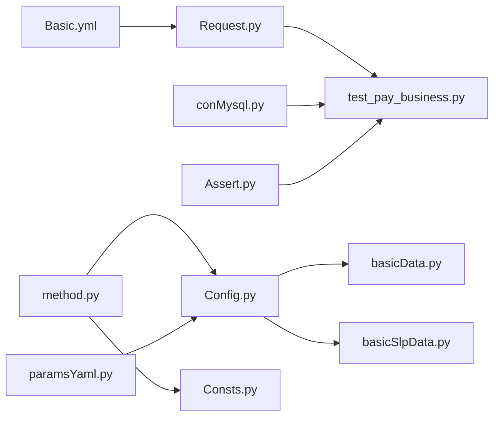

基于我对代码变更的分析，现在我可以更新工具方法模块的文档。主要变更包括：

1. **新增字典格式化函数**：`dict_to_slack_fields` 和 `dict_to_markdown` 函数的添加
2. **全面的类型注解**：所有函数都添加了详细的类型注解
3. **详细的文档字符串**：每个函数都有完整的文档字符串说明
4. **paramsYaml.py 的现代化改进**：YamlReader 类的引入和向后兼容性支持

<docs>
# 工具方法模块

<cite>
**本文引用的文件**
- [basicData.py](file://common/basicData.py)
- [basicSlpData.py](file://common/basicSlpData.py)
- [method.py](file://common/method.py)
- [paramsYaml.py](file://common/paramsYaml.py)
- [Config.py](file://common/Config.py)
- [Basic.yml](file://common/Basic.yml)
- [test_pay_business.py](file://case/test_pay_business.py)
- [Consts.py](file://common/Consts.py)
- [Assert.py](file://common/Assert.py)
</cite>

## 更新摘要
**变更内容**
- 新增 `dict_to_slack_fields` 和 `dict_to_markdown` 字典格式化函数，提供Slack和Markdown格式转换
- 所有函数添加了完整的类型注解和详细文档字符串
- paramsYaml.py 引入 YamlReader 类，提供现代化的YAML配置读取功能
- basicData.py 保持重构后的字典处理器系统，增强代码可维护性
- method.py 新增字典格式化功能，支持测试报告和通知系统的格式化需求

## 目录
1. [简介](#简介)
2. [项目结构](#项目结构)
3. [核心组件](#核心组件)
4. [架构总览](#架构总览)
5. [详细组件分析](#详细组件分析)
6. [依赖分析](#依赖分析)
7. [性能考虑](#性能考虑)
8. [故障排查指南](#故障排查指南)
9. [结论](#结论)
10. [附录](#附录)

## 简介
本文件面向"工具方法模块"，系统性梳理通用工具方法的设计与实现，覆盖数据处理、字符串处理、数学计算与日期时间处理等方面；重点解析测试数据准备工具（basicData、basicSlpData）的生成、清理与恢复机制；详细介绍YAML配置读取器（paramsYaml）的现代化功能；深入说明新增的字典格式化工具函数（dict_to_slack_fields、dict_to_markdown）在测试报告和通知系统中的应用；明确工具方法的分类与组织结构（输入验证、输出格式化、异常处理）；提供使用示例与扩展指南，并给出性能、缓存与并发安全建议以及与核心模块的集成最佳实践。

## 项目结构
工具方法模块主要分布在以下位置：
- common：通用工具与配置
  - basicData.py：国内支付场景数据编码工具（已重构为字典处理器系统）
  - basicSlpData.py：SLP支付场景数据编码工具（保持 if-elif 结构）
  - method.py：通用方法（日志、断言、键遍历、签名、数值处理、字典格式化等）
  - paramsYaml.py：YAML配置文件读取器（已现代化为YamlReader类）
  - Config.py：全局配置与常量
  - Basic.yml：基础请求头与参数模板
  - Request.py：HTTP请求封装
  - Assert.py：断言封装
  - Consts.py：全局变量与统计
- case：国内支付用例
  - test_pay_business.py：业务场景用例，演示工具方法使用

**更新** 新增了字典格式化函数和现代化的YAML读取器，增强了工具方法模块的功能性和可维护性

章节来源
- [basicData.py](file://common/basicData.py)
- [basicSlpData.py](file://common/basicSlpData.py)
- [method.py](file://common/method.py)
- [paramsYaml.py](file://common/paramsYaml.py)
- [Config.py](file://common/Config.py)
- [Basic.yml](file://common/Basic.yml)
- [Request.py](file://common/Request.py)
- [Assert.py](file://common/Assert.py)
- [Consts.py](file://common/Consts.py)
- [test_pay_business.py](file://case/test_pay_business.py)

## 核心组件
- 数据编码工具
  - 国内场景：basicData.encodeData，使用字典处理器系统按支付类型组装URL编码数据
  - SLP场景：basicSlpData.encodeData，保持 if-elif 结构，按支付类型组装URL编码数据
  - **新增**：字典处理器系统，通过 PAY_TYPE_HANDLERS 和 PT_PAY_TYPE_HANDLERS 映射表管理支付类型
  - **新增**：_build_package_params 和 _build_shop_buy_params 通用函数，统一参数构建逻辑
- 字典格式化工具
  - dict_to_slack_fields：将字典转换为Slack消息fields格式，用于测试失败通知和报告
  - dict_to_markdown：将字典转换为Markdown格式，用于生成测试报告和日志
  - **新增**：完整的类型注解和文档字符串，支持灵活的字典格式化需求
- YAML配置读取器
  - YamlReader：现代化的YAML文件读取器，提供跨平台的YAML文件读取功能，支持安全加载器
  - **新增**：向后兼容性支持，Yaml 别名保持原有接口
- 通用方法
  - 字典转Slack/Mardown列表、随机图片获取、JSON键遍历、响应体解析与断言
  - 数值处理：签名生成、连击Key生成、数值精度处理
- 配置与模板
  - Config.py：全局URL、用户ID、房间ID、礼物ID等配置
  - Basic.yml：请求头与参数模板
- 数据库与请求
  - conMysql：统一查询封装
  - Request：HTTP请求封装（含签名拼接）
- 全局状态管理
  - Consts.py：全局变量管理，包括成功/失败计数、测试用例列表等

**更新** 新增了字典格式化工具函数，增强了测试报告和通知系统的功能；paramsYaml.py 现代化为YamlReader类

章节来源
- [basicData.py](file://common/basicData.py)
- [basicSlpData.py](file://common/basicSlpData.py)
- [method.py](file://common/method.py)
- [paramsYaml.py](file://common/paramsYaml.py)
- [Config.py](file://common/Config.py)
- [Basic.yml](file://common/Basic.yml)
- [Request.py](file://common/Request.py)
- [Consts.py](file://common/Consts.py)

## 架构总览
工具方法模块围绕"数据准备—请求发送—断言校验—数据库校验—报告生成"的完整工作流展开，形成了清晰的职责分离与可复用能力。basicData.py 经过重构后，采用了更清晰的字典处理器设计，通过通用函数简化了重复代码。新增的字典格式化工具函数为测试报告和通知系统提供了统一的格式化标准。paramsYaml.py 实现了现代化的 YAML 配置读取功能，支持安全加载器选择。这种架构设计提升了系统的可维护性和扩展性，同时增强了测试数据的可视化和可追踪性。

**更新** 展示了重构后的 basicData.py 字典处理器系统在工作流中的作用；新增了字典格式化工具在报告生成环节的应用

图表来源
- [test_pay_business.py](file://case/test_pay_business.py)
- [basicData.py](file://common/basicData.py)
- [basicSlpData.py](file://common/basicSlpData.py)
- [Request.py](file://common/Request.py)
- [Config.py](file://common/Config.py)
- [method.py](file://common/method.py)

## 详细组件分析

### 数据编码工具（basicData、basicSlpData）- 已重构
- 设计目标
  - 面向不同业务线（国内、PT海外、SLP）提供标准化的支付场景数据组装与URL编码
  - 支持多种支付类型（礼物、盒子、守护、商店购买、兑换等）
  - 通过字典处理器系统替代传统 if-elif 结构，提升代码可维护性
- 关键特性
  - **重构**：采用字典处理器系统，通过 PAY_TYPE_HANDLERS 和 PT_PAY_TYPE_HANDLERS 映射表管理支付类型
  - **新增**：_build_package_params 通用函数，统一 package 类型参数构建
  - **新增**：_build_shop_buy_params 通用函数，统一 shop-buy 类型参数构建
  - **新增**：_encode_data_helper URL 编码辅助函数，统一编码逻辑
  - 输入参数丰富，涵盖房间ID、用户ID、礼物ID、数量、价格、版本、星数等
  - 统一的URL编码与字符替换逻辑，保证兼容性
  - 异常处理：未知payType抛出异常
- 使用示例（路径参考）
  - 国内场景：[test_pay_business.py](file://case/test_pay_business.py)
- 输出格式
  - 返回形如"key=value&key2=value2..."的URL编码字符串，便于POST请求

**更新** 展示了重构后的字典处理器系统，通过通用函数简化了重复代码；basicSlpData 保持原有 if-elif 结构

图表来源
- [basicData.py](file://common/basicData.py)
- [basicSlpData.py](file://common/basicSlpData.py)

章节来源
- [basicData.py](file://common/basicData.py)
- [basicSlpData.py](file://common/basicSlpData.py)
- [test_pay_business.py](file://case/test_pay_business.py)

### 字典格式化工具（method.py）- 新增功能
- 设计目标
  - 提供统一的字典格式化功能，支持测试报告和通知系统的多样化格式需求
  - 为Slack消息和Markdown文档提供标准的格式化输出
  - 支持灵活的字典转换，便于测试结果的可视化展示
- 核心功能
  - dict_to_slack_fields：将字典转换为Slack fields格式，包含标题、值和短格式标记
  - dict_to_markdown：将字典转换为Markdown格式，便于生成测试报告和日志
  - **新增**：完整的类型注解，支持任意类型的字典输入
  - **新增**：详细的文档字符串，说明参数和返回值
  - **新增**：灵活的格式化选项，适应不同的输出需求
- 使用场景
  - 测试失败通知：将失败的测试用例结果转换为Slack消息格式
  - 报告生成：将测试统计数据转换为Markdown格式文档
  - 日志输出：将关键信息格式化为结构化的日志条目
- 输出格式
  - Slack格式：返回包含title、value、short字段的字典列表
  - Markdown格式：返回包含场景名称和结果的字符串列表

**更新** 新增了完整的字典格式化工具函数，增强了测试报告和通知系统的功能

章节来源
- [method.py](file://common/method.py)

### YAML配置读取器（paramsYaml.py）- 现代化改进
- 设计目标
  - 提供现代化的YAML文件读取功能，支持不同环境的安全加载
  - 统一配置文件访问接口，简化配置管理
  - 支持阿里云服务器节点识别和安全加载器选择
  - **新增**：向后兼容性支持，保持原有接口调用方式
- 核心功能
  - YamlReader 类：提供完整的YAML读取功能，支持类型注解和文档字符串
  - 路径解析：_get_yaml_path 获取YAML文件完整路径
  - 加载器选择：_get_loader 根据环境动态选择加载器
  - 配置读取：read 方法读取指定键值
  - **新增**：Yaml 别名：保持向后兼容性
- 环境适配
  - 支持阿里云服务器节点的安全加载
  - 动态检测平台环境，选择合适的加载器
  - 统一的错误处理和日志输出
- 代码优化
  - **新增**：YamlReader 类提供更清晰的接口设计
  - **新增**：向后兼容性支持，Yaml 别名保持原有调用方式
  - 简化了方法实现，提高了执行效率

**更新** paramsYaml.py 现代化为YamlReader类，增强了功能和可维护性

章节来源
- [paramsYaml.py](file://common/paramsYaml.py)

### 通用方法（method.py）
- 字符串与数据处理
  - dictToList/dictToListSlack：将字典转为Markdown或Slack消息字段
  - isExtend/getKeys：递归遍历JSON提取键，判断字段是否存在
  - getValue/reason/reason_slp：从响应体提取成功标志并输出日志与失败原因
- 数学与时间
  - getImage：调用外部API获取图片链接（用于通知系统icon模式）
  - deal_num：数值精度处理（保留两位小数后向上取整）
  - hash_key：生成连击Key（MD5时间戳）
- 业务辅助
  - getUserTitle：根据用户等级映射到倍率
  - checkUserVipExp：结合用户等级与货币类型计算VIP经验值
  - checkPath：路径检查，集成通知系统进行异常通知

**更新** 新增了字典格式化工具函数，增强了数据处理能力

章节来源
- [method.py](file://common/method.py)

### 配置与模板（Config.py、Basic.yml）
- Config.py
  - 提供全局配置管理，包括用户ID、房间ID、礼物ID等
  - **新增**：应用配置信息，支持多应用环境
- Basic.yml
  - 提供国内、PT海外、SLP三套基础请求头与参数模板

**更新** Config.py 增强了配置管理能力

章节来源
- [Config.py](file://common/Config.py)
- [Basic.yml](file://common/Basic.yml)

### 数据库与请求（Request.py）
- Request
  - 封装HTTP请求，支持签名拼接、参数编码、SSL跳过等

**更新** 保持原有功能，为字典格式化工具提供数据支持

章节来源
- [Request.py](file://common/Request.py)

### 断言与日志（Assert.py、method.py）
- Assert.py
  - 提供assert_code、assert_equal、assert_len、assert_body、assert_between等断言方法
- method.py
  - reason/reason_slp：生成失败原因文本，便于定位问题

**更新** 新增了字典格式化工具，增强了断言和日志的可视化能力

章节来源
- [Assert.py](file://common/Assert.py)
- [method.py](file://common/method.py)

### 全局状态管理（Consts.py）
- Consts.py
  - 提供全局变量管理，包括成功/失败计数、测试用例列表等
  - **新增**：支持字典格式化工具的统计和报告功能

**更新** 增强了全局状态管理，支持新的格式化功能

章节来源
- [Consts.py](file://common/Consts.py)

### 测试数据准备工具（basicData、basicSlpData）的生成、清理与恢复机制
- 生成
  - 通过 encodeData/encodePtData 按 payType 组装数据，返回URL编码字符串
  - **新增**：字典处理器系统，通过映射表管理支付类型
  - **新增**：通用函数 _build_package_params 和 _build_shop_buy_params 统一参数构建
- 清理
  - 在用例执行前，通过数据库封装更新或清空账户余额、商品数量、消费记录等
- 恢复
  - 用例结束后，可通过数据库封装回滚或重置账户状态，确保测试隔离

**更新** 展示了重构后的字典处理器系统在数据生成过程中的作用；basicSlpData 保持原有流程

图表来源
- [test_pay_business.py](file://case/test_pay_business.py)
- [basicData.py](file://common/basicData.py)
- [basicSlpData.py](file://common/basicSlpData.py)
- [Config.py](file://common/Config.py)

章节来源
- [test_pay_business.py](file://case/test_pay_business.py)
- [basicData.py](file://common/basicData.py)
- [basicSlpData.py](file://common/basicSlpData.py)
- [Config.py](file://common/Config.py)

### 工具方法的分类与组织结构
- 输入验证
  - isExtend/getKeys：对嵌套JSON进行键遍历与存在性判断
  - checkPath：校验文件路径存在性
- 输出格式化
  - dictToList/dictToListSlack：将字典转为Markdown或Slack消息字段
  - **新增**：dict_to_slack_fields/dict_to_markdown：现代化的字典格式化工具
  - reason/reason_slp：格式化失败原因文本
- 异常处理
  - encodeData/encodePtData：未知payType抛异常
  - getValue：缺失body字段或失败时增加失败计数
- 数学与时间
  - deal_num：数值精度处理
  - hash_key：生成连击Key
  - getImage：外部资源获取（容错处理）

**更新** 新增了字典格式化工具的分类，反映了重构后的代码结构

章节来源
- [method.py](file://common/method.py)
- [basicData.py](file://common/basicData.py)
- [basicSlpData.py](file://common/basicSlpData.py)

### 工具方法使用示例
- 国内业务场景
  - 通过 encodeData 构造礼物/盒子/守护等支付数据，结合数据库封装校验到账金额与VIP经验值
  - **新增**：支持多种支付类型，包括 package、package-more、chat-gift、shop-buy 等
  - 参考：[test_pay_business.py](file://case/test_pay_business.py)
- SLP异常/边界值场景
  - 通过 basicSlpData.encodeData 构造余额不足等边界条件，断言返回msg与账户余额
  - 参考：[test_check.py](file://caseSlp/test_check.py)
- YAML配置读取场景
  - 通过 paramsYaml.read 或 Yaml.read 读取Basic.yml中的配置参数
  - **新增**：YamlReader 类提供更清晰的接口调用方式
  - 参考：[paramsYaml.py](file://common/paramsYaml.py)
- 数值与签名处理
  - 使用 deal_num 处理精度，使用 create_sign 生成签名
  - 参考：[tools.py（SLP）](file://caseSlp/tools.py)、[tools.py（Starify）](file://caseStarify/tools.py)
- **新增**：字典格式化场景
  - 使用 dict_to_slack_fields 将测试结果转换为Slack消息格式
  - 使用 dict_to_markdown 生成测试报告和日志
  - 参考：[method.py](file://common/method.py)

**更新** 新增了字典格式化工具的使用示例，展示了新的功能特性

章节来源
- [test_pay_business.py](file://case/test_pay_business.py)
- [basicSlpData.py](file://common/basicSlpData.py)
- [paramsYaml.py](file://common/paramsYaml.py)
- [method.py](file://common/method.py)
- [tools.py（SLP）](file://caseSlp/tools.py)
- [tools.py（Starify）](file://caseStarify/tools.py)

### 扩展机制与自定义方法开发指南
- 新增支付类型
  - 在 PAY_TYPE_HANDLERS 或 PT_PAY_TYPE_HANDLERS 映射表中添加新的支付类型处理器
  - **新增**：利用通用函数 _build_package_params 和 _build_shop_buy_params 简化新类型的实现
  - 遵循现有参数命名与URL编码规范
- **新增**：字典格式化扩展
  - 在 method.py 中新增自定义格式化函数，遵循现有的类型注解和文档字符串规范
  - 支持新的输出格式需求，如HTML、JSON等
- 新增配置读取功能
  - 在 YamlReader 类中添加新的配置文件读取方法
  - 支持更多环境的节点识别和加载器选择
  - **新增**：保持向后兼容性，Yaml 别名继续支持原有调用方式
- 新增业务辅助方法
  - 在 method.py 中新增函数，保持单一职责与清晰的输入输出
- 配置扩展
  - 在 Config.py 中新增常量，在 Basic.yml 中新增模板参数
- 断言与日志
  - 在 Assert.py 中新增断言方法，在 method.py 中新增失败原因格式化函数

**更新** 新增了字典格式化工具的扩展指南，反映了模块功能的增强

章节来源
- [basicData.py](file://common/basicData.py)
- [basicSlpData.py](file://common/basicSlpData.py)
- [paramsYaml.py](file://common/paramsYaml.py)
- [method.py](file://common/method.py)
- [Config.py](file://common/Config.py)
- [Basic.yml](file://common/Basic.yml)
- [Assert.py](file://common/Assert.py)

## 依赖分析
- 组件耦合
  - basicData 依赖 Config.py 中的用户ID、房间ID、礼物ID等配置
  - basicSlpData 依赖 Config.py 和 caseSlp.config 中的配置
  - paramsYaml 依赖 Config.py 进行路径解析和节点识别
  - method.py 依赖 Config.py、Consts.py 进行配置访问和状态管理
  - Request.py 依赖 Basic.yml 与 Config.py 中的URL与模板
  - 测试用例依赖工具方法与数据库封装
- 外部依赖
  - requests、pymysql、urllib.parse、yaml 等
- 循环依赖
  - 当前模块间无明显循环依赖

**更新** 展示了重构后的 basicData.py 与 Config.py 的集成关系；新增了字典格式化工具的依赖关系

图表来源
- [Config.py](file://common/Config.py)
- [basicData.py](file://common/basicData.py)
- [basicSlpData.py](file://common/basicSlpData.py)
- [Basic.yml](file://common/Basic.yml)
- [Request.py](file://common/Request.py)
- [conMysql.py](file://common/conMysql.py)
- [Assert.py](file://common/Assert.py)
- [method.py](file://common/method.py)
- [paramsYaml.py](file://common/paramsYaml.py)
- [Consts.py](file://common/Consts.py)

章节来源
- [Config.py](file://common/Config.py)
- [basicData.py](file://common/basicData.py)
- [basicSlpData.py](file://common/basicSlpData.py)
- [Basic.yml](file://common/Basic.yml)
- [Request.py](file://common/Request.py)
- [conMysql.py](file://common/conMysql.py)
- [Assert.py](file://common/Assert.py)
- [method.py](file://common/method.py)
- [paramsYaml.py](file://common/paramsYaml.py)
- [Consts.py](file://common/Consts.py)

## 性能考虑
- 编码与序列化
  - URL编码与字符串替换为轻量级操作，建议批量构造数据时避免重复urlencode
  - **新增**：字典处理器系统避免了长链式条件判断，提高处理效率
  - **新增**：通过通用函数减少重复编码逻辑，提高性能
- **新增**：字典格式化性能
  - 字典格式化操作为O(n)复杂度，其中n为字典键的数量
  - Slack格式化适合实时通知，Markdown格式适合批量报告生成
  - 建议在高频场景下缓存格式化结果，避免重复计算
- 数据库查询
  - 合理使用索引字段（uid、cid等），减少全表扫描
  - 批量查询时合并SQL，降低网络往返
- 请求与断言
  - 断言与日志输出应避免在高频循环中频繁打印
  - 对外部API调用增加超时与重试策略
- YAML配置读取优化
  - 节点识别和加载器选择的缓存机制
  - 统一的错误处理减少异常开销
  - **新增**：YamlReader 类提供更高效的配置读取接口

**更新** 新增了字典格式化工具的性能考虑，反映了模块功能的增强

## 故障排查指南
- 常见问题
  - 缺少body字段：getValue会记录失败并增加失败计数
  - 余额不足：SLP用例中通过断言msg与账户余额核对
  - 未知payType：encodeData/encodePtData会抛出异常
  - **新增**：字典格式化异常：检查输入字典的键值类型和格式
  - **新增**：YAML文件读取失败：检查 paramsYaml 的路径解析和加载器选择
  - **新增**：向后兼容性问题：确认使用 YamlReader 或 Yaml 别名
- 排查步骤
  - 检查数据编码是否正确（URL编码、字符替换）
  - 校验数据库状态（余额、商品、消费记录）
  - 查看失败原因文本（reason/reason_slp）
  - 对比配置项（Config.py、Basic.yml）
  - **新增**：验证字典格式化输入的有效性
  - **新增**：检查通用函数的参数传递和返回值
  - **新增**：验证 YAML 文件的路径和权限设置

**更新** 新增了字典格式化工具和 YAML 读取器的故障排查指南

章节来源
- [method.py](file://common/method.py)
- [basicData.py](file://common/basicData.py)
- [basicSlpData.py](file://common/basicSlpData.py)
- [Assert.py](file://common/Assert.py)
- [paramsYaml.py](file://common/paramsYaml.py)

## 结论
工具方法模块通过"数据编码—请求—断言—校验—报告生成"的完整闭环设计，提供了高复用、易扩展的支付场景工具集。basicData.py 经过重构后，采用字典处理器系统替代传统 if-elif 结构，显著提升了代码可维护性和扩展性。新增的 _build_package_params 和 _build_shop_buy_params 通用函数统一了参数构建逻辑，减少了重复代码。**新增的字典格式化工具函数（dict_to_slack_fields、dict_to_markdown）为测试报告和通知系统提供了统一的格式化标准，增强了测试结果的可视化和可追踪性。paramsYaml.py 现代化为YamlReader类，增强了 YAML 配置读取功能，提供了向后兼容性支持。其清晰的分类与组织结构、完善的异常处理与日志输出，使得测试用例编写与维护更加高效。建议在扩展新功能时遵循现有模式，保持输入验证、输出格式化与异常处理的一致性，并结合数据库与请求层的最佳实践提升整体稳定性与性能。**

**更新** 强调了字典格式化工具的重要意义和带来的改进；突出了 paramsYaml.py 现代化功能的价值

## 附录
- 关键路径参考
  - 国内场景数据编码：[basicData.py](file://common/basicData.py)
  - SLP场景数据编码：[basicSlpData.py](file://common/basicSlpData.py)
  - YAML配置读取：[paramsYaml.py](file://common/paramsYaml.py)
  - 字典格式化工具：[method.py](file://common/method.py)
  - 通用方法与断言：[method.py](file://common/method.py)、[Assert.py](file://common/Assert.py)
  - 配置与模板：[Config.py](file://common/Config.py)、[Basic.yml](file://common/Basic.yml)
  - 示例用例：[test_pay_business.py](file://case/test_pay_business.py)
  - 数据库封装：[conMysql.py](file://common/conMysql.py)
  - 请求封装：[Request.py](file://common/Request.py)
  - 全局状态管理：[Consts.py](file://common/Consts.py)
</appendix>
</existing_wiki_content>