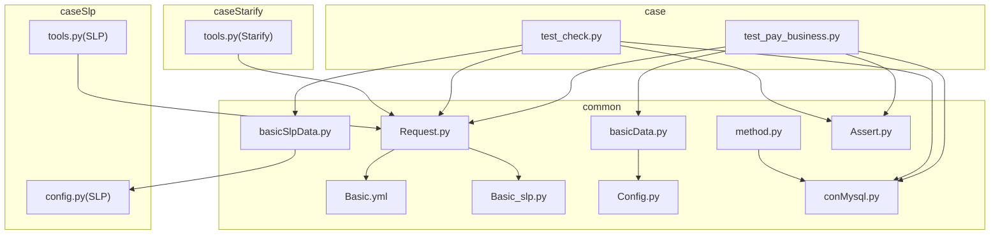
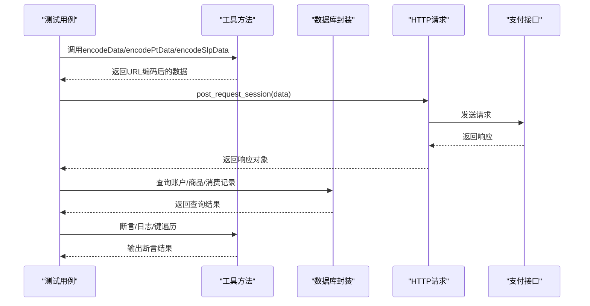
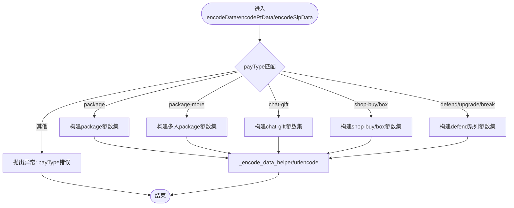
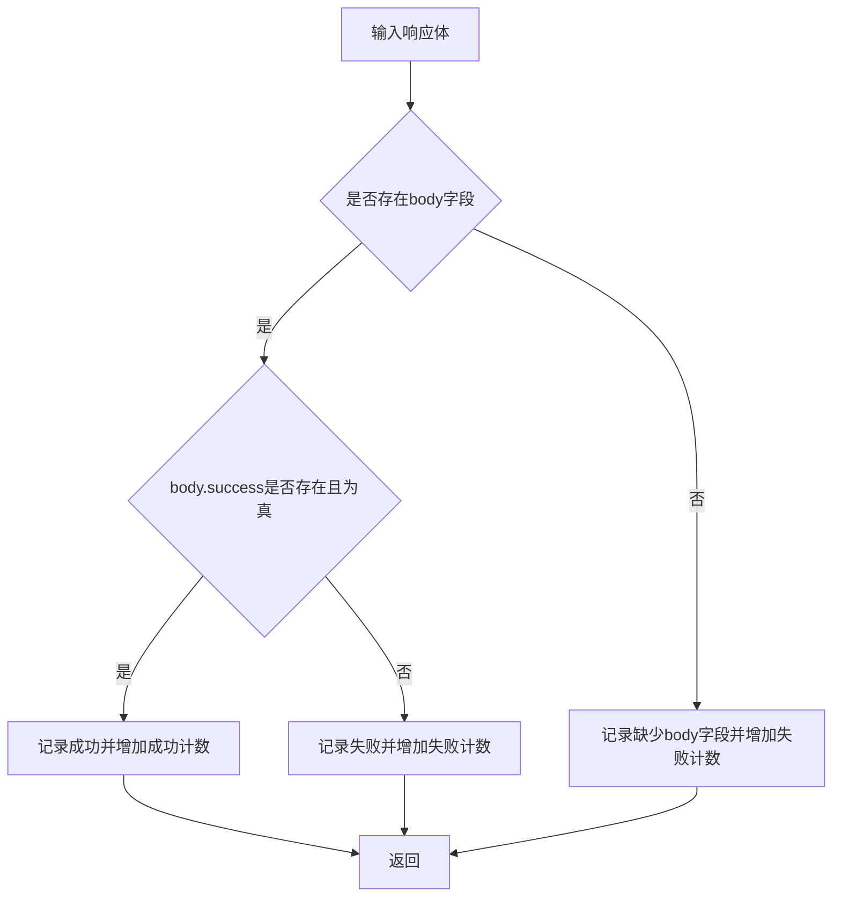
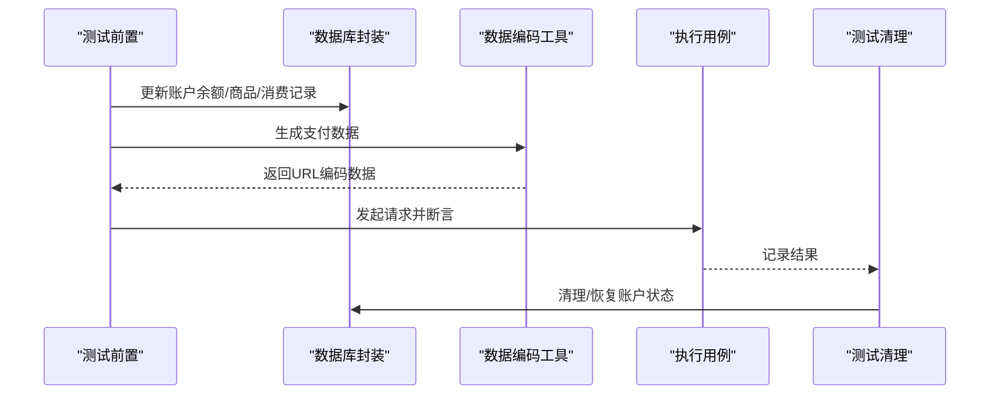
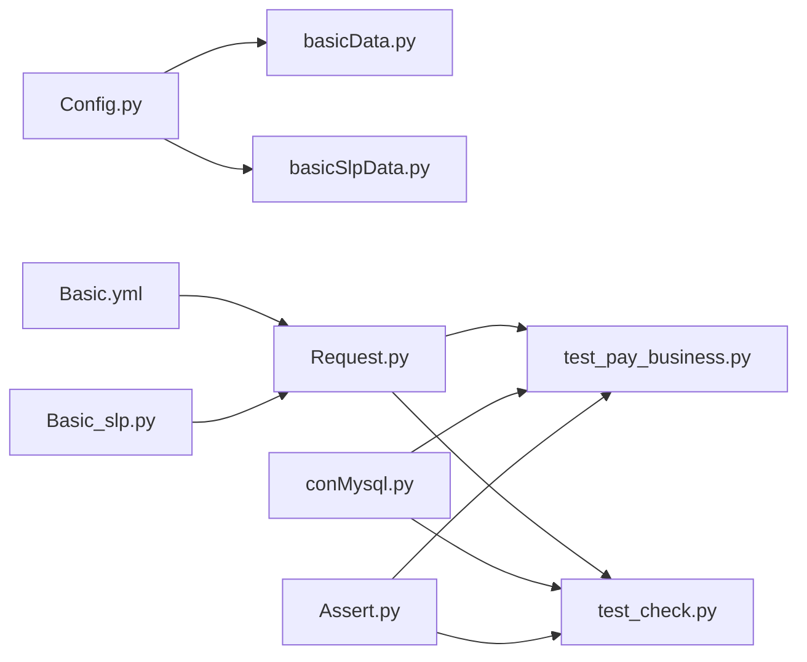

# 工具方法模块

<cite>
**本文引用的文件**
- [basicData.py](file://common/basicData.py)
- [basicSlpData.py](file://common/basicSlpData.py)
- [method.py](file://common/method.py)
- [Basic.yml](file://common/Basic.yml)
- [Basic_slp.py](file://common/Basic_slp.py)
- [Config.py](file://common/Config.py)
- [tools.py（SLP）](file://caseSlp/tools.py)
- [tools.py（Starify）](file://caseStarify/tools.py)
- [conMysql.py](file://common/conMysql.py)
- [Request.py](file://common/Request.py)
- [Assert.py](file://common/Assert.py)
- [test_pay_business.py](file://case/test_pay_business.py)
- [test_check.py](file://caseSlp/test_check.py)
- [config.py（SLP）](file://caseSlp/config.py)
</cite>

## 目录
1. [简介](#简介)
2. [项目结构](#项目结构)
3. [核心组件](#核心组件)
4. [架构总览](#架构总览)
5. [详细组件分析](#详细组件分析)
6. [依赖分析](#依赖分析)
7. [性能考虑](#性能考虑)
8. [故障排查指南](#故障排查指南)
9. [结论](#结论)
10. [附录](#附录)

## 简介
本文件面向“工具方法模块”，系统性梳理通用工具方法的设计与实现，覆盖数据处理、字符串处理、数学计算与日期时间处理等方面；重点解析测试数据准备工具（basicData、basicSlpData）的生成、清理与恢复机制；明确工具方法的分类与组织结构（输入验证、输出格式化、异常处理）；提供使用示例与扩展指南，并给出性能、缓存与并发安全建议以及与核心模块的集成最佳实践。

## 项目结构
工具方法模块主要分布在以下位置：
- common：通用工具与配置
  - basicData.py：国内支付场景数据编码工具
  - basicSlpData.py：SLP支付场景数据编码工具
  - method.py：通用方法（日志、断言、键遍历、签名、数值处理等）
  - Basic.yml：基础请求头与参数模板
  - Basic_slp.py：SLP环境基础请求头与查询参数
  - Config.py：全局配置与常量
  - conMysql.py：数据库连接与查询封装
  - Request.py：HTTP请求封装
  - Assert.py：断言封装
- caseSlp：SLP专项用例与工具
  - tools.py：SLP签名与数值处理
  - config.py：SLP测试用例配置
- caseStarify：Starify专项工具
  - tools.py：Starify签名与数值处理
- case：国内支付用例
  - test_pay_business.py：业务场景用例，演示工具方法使用

图表来源
- [basicData.py](file://common/basicData.py)
- [basicSlpData.py](file://common/basicSlpData.py)
- [method.py](file://common/method.py)
- [Basic.yml](file://common/Basic.yml)
- [Basic_slp.py](file://common/Basic_slp.py)
- [Config.py](file://common/Config.py)
- [conMysql.py](file://common/conMysql.py)
- [Request.py](file://common/Request.py)
- [Assert.py](file://common/Assert.py)
- [test_pay_business.py](file://case/test_pay_business.py)
- [test_check.py](file://caseSlp/test_check.py)
- [tools.py（SLP）](file://caseSlp/tools.py)
- [tools.py（Starify）](file://caseStarify/tools.py)
- [config.py（SLP）](file://caseSlp/config.py)

章节来源
- [basicData.py](file://common/basicData.py)
- [basicSlpData.py](file://common/basicSlpData.py)
- [method.py](file://common/method.py)
- [Basic.yml](file://common/Basic.yml)
- [Basic_slp.py](file://common/Basic_slp.py)
- [Config.py](file://common/Config.py)
- [conMysql.py](file://common/conMysql.py)
- [Request.py](file://common/Request.py)
- [Assert.py](file://common/Assert.py)
- [test_pay_business.py](file://case/test_pay_business.py)
- [test_check.py](file://caseSlp/test_check.py)
- [tools.py（SLP）](file://caseSlp/tools.py)
- [tools.py（Starify）](file://caseStarify/tools.py)
- [config.py（SLP）](file://caseSlp/config.py)

## 核心组件
- 数据编码工具
  - 国内场景：basicData.encodeData/packData/ptData 等，按支付类型组装URL编码数据
  - SLP场景：basicSlpData.encodeData，按支付类型组装URL编码数据
- 通用方法
  - 字典转Markdown列表、随机图片获取、JSON键遍历、响应体解析与断言
  - 数值处理：签名生成、连击Key生成、数值精度处理
- 配置与模板
  - Basic.yml：请求头与参数模板
  - Basic_slp.py：SLP环境请求头与查询参数
  - Config.py：全局URL、用户ID、房间ID、礼物ID等配置
- 数据库与请求
  - conMysql：统一查询封装
  - Request：HTTP请求封装（含签名拼接）

章节来源
- [basicData.py](file://common/basicData.py)
- [basicSlpData.py](file://common/basicSlpData.py)
- [method.py](file://common/method.py)
- [Basic.yml](file://common/Basic.yml)
- [Basic_slp.py](file://common/Basic_slp.py)
- [Config.py](file://common/Config.py)
- [conMysql.py](file://common/conMysql.py)
- [Request.py](file://common/Request.py)

## 架构总览
工具方法模块围绕“数据准备—请求发送—断言校验—数据库校验”的闭环工作流展开，形成清晰的职责分离与可复用能力。

图表来源
- [test_pay_business.py](file://case/test_pay_business.py)
- [test_check.py](file://caseSlp/test_check.py)
- [basicData.py](file://common/basicData.py)
- [basicSlpData.py](file://common/basicSlpData.py)
- [Request.py](file://common/Request.py)
- [conMysql.py](file://common/conMysql.py)
- [Assert.py](file://common/Assert.py)

## 详细组件分析

### 数据编码工具（basicData、basicSlpData）
- 设计目标
  - 面向不同业务线（国内、PT海外、SLP）提供标准化的支付场景数据组装与URL编码
  - 支持多种支付类型（礼物、盒子、守护、商店购买、兑换等）
- 关键特性
  - 输入参数丰富，涵盖房间ID、用户ID、礼物ID、数量、价格、版本、星数等
  - 统一的URL编码与字符替换逻辑，保证兼容性
  - 异常处理：未知payType抛出异常
- 使用示例（路径参考）
  - 国内场景：[test_pay_business.py](file://case/test_pay_business.py)
  - SLP场景：[test_check.py](file://caseSlp/test_check.py)
- 输出格式
  - 返回形如“key=value&key2=value2...”的URL编码字符串，便于POST请求

图表来源
- [basicData.py](file://common/basicData.py)
- [basicSlpData.py](file://common/basicSlpData.py)

章节来源
- [basicData.py](file://common/basicData.py)
- [basicSlpData.py](file://common/basicSlpData.py)
- [test_pay_business.py](file://case/test_pay_business.py)
- [test_check.py](file://caseSlp/test_check.py)

### 通用方法（method.py）
- 字符串与数据处理
  - dictToList/dictToListSlack：将字典转为Markdown或Slack消息字段
  - isExtend/getKeys：递归遍历JSON提取键，判断字段是否存在
  - getValue/reason/reason_slp：从响应体提取成功标志并输出日志与失败原因
- 数学与时间
  - getImage：调用外部API获取图片链接
  - deal_num：数值精度处理（保留两位小数后向上取整）
  - hash_key：生成连击Key（MD5时间戳）
- 业务辅助
  - getUserTitle：根据用户等级映射到倍率
  - checkUserVipExp：结合用户等级与货币类型计算VIP经验值

图表来源
- [method.py](file://common/method.py)

章节来源
- [method.py](file://common/method.py)

### 配置与模板（Basic.yml、Basic_slp.py、Config.py）
- Basic.yml
  - 提供国内、PT海外、SLP三套基础请求头与参数模板
- Basic_slp.py
  - 提供SLP环境的请求头与查询参数（如包名、平台、时间戳、签名等）
- Config.py
  - 统一管理应用URL、用户ID、房间ID、礼物ID等全局配置

章节来源
- [Basic.yml](file://common/Basic.yml)
- [Basic_slp.py](file://common/Basic_slp.py)
- [Config.py](file://common/Config.py)

### 数据库与请求（conMysql.py、Request.py）
- conMysql
  - 提供统一的查询封装，覆盖余额、商品、消费记录、守护关系等多类查询
- Request
  - 封装HTTP请求，支持签名拼接、参数编码、SSL跳过等

章节来源
- [conMysql.py](file://common/conMysql.py)
- [Request.py](file://common/Request.py)

### 断言与日志（Assert.py、method.py）
- Assert.py
  - 提供assert_code、assert_equal、assert_len、assert_body、assert_between等断言方法
- method.py
  - reason/reason_slp：生成失败原因文本，便于定位问题

章节来源
- [Assert.py](file://common/Assert.py)
- [method.py](file://common/method.py)

### 测试数据准备工具（basicData、basicSlpData）的生成、清理与恢复机制
- 生成
  - 通过encodeData/encodePtData/encodeSlpData按payType组装数据，返回URL编码字符串
- 清理
  - 在用例执行前，通过数据库封装更新或清空账户余额、商品数量、消费记录等
- 恢复
  - 用例结束后，可通过数据库封装回滚或重置账户状态，确保测试隔离

图表来源
- [test_pay_business.py](file://case/test_pay_business.py)
- [test_check.py](file://caseSlp/test_check.py)
- [basicData.py](file://common/basicData.py)
- [basicSlpData.py](file://common/basicSlpData.py)
- [conMysql.py](file://common/conMysql.py)

章节来源
- [test_pay_business.py](file://case/test_pay_business.py)
- [test_check.py](file://caseSlp/test_check.py)
- [basicData.py](file://common/basicData.py)
- [basicSlpData.py](file://common/basicSlpData.py)
- [conMysql.py](file://common/conMysql.py)

### 工具方法的分类与组织结构
- 输入验证
  - isExtend/getKeys：对嵌套JSON进行键遍历与存在性判断
  - checkPath：校验文件路径存在性
- 输出格式化
  - dictToList/dictToListSlack：将字典转为Markdown或Slack消息字段
  - reason/reason_slp：格式化失败原因文本
- 异常处理
  - encodeData/encodeSlpData：未知payType抛异常
  - getValue：缺失body字段或失败时增加失败计数
- 数学与时间
  - deal_num：数值精度处理
  - hash_key：生成连击Key
  - getImage：外部资源获取（容错处理）

章节来源
- [method.py](file://common/method.py)
- [basicData.py](file://common/basicData.py)
- [basicSlpData.py](file://common/basicSlpData.py)

### 工具方法使用示例
- 国内业务场景
  - 通过encodeData构造礼物/盒子/守护等支付数据，结合数据库封装校验到账金额与VIP经验值
  - 参考：[test_pay_business.py](file://case/test_pay_business.py)
- SLP异常/边界值场景
  - 通过encodeData构造余额不足等边界条件，断言返回msg与账户余额
  - 参考：[test_check.py](file://caseSlp/test_check.py)
- 数值与签名处理
  - 使用deal_num处理精度，使用create_sign生成签名
  - 参考：[tools.py（SLP）](file://caseSlp/tools.py)、[tools.py（Starify）](file://caseStarify/tools.py)

章节来源
- [test_pay_business.py](file://case/test_pay_business.py)
- [test_check.py](file://caseSlp/test_check.py)
- [tools.py（SLP）](file://caseSlp/tools.py)
- [tools.py（Starify）](file://caseStarify/tools.py)

### 扩展机制与自定义方法开发指南
- 新增支付类型
  - 在对应encodeData函数中添加新的payType分支，遵循现有参数命名与URL编码规范
- 新增业务辅助方法
  - 在method.py中新增函数，保持单一职责与清晰的输入输出
- 配置扩展
  - 在Config.py中新增常量，在Basic.yml/Basic_slp.py中新增模板参数
- 断言与日志
  - 在Assert.py中新增断言方法，在method.py中新增失败原因格式化函数

章节来源
- [basicData.py](file://common/basicData.py)
- [basicSlpData.py](file://common/basicSlpData.py)
- [method.py](file://common/method.py)
- [Config.py](file://common/Config.py)
- [Basic.yml](file://common/Basic.yml)
- [Basic_slp.py](file://common/Basic_slp.py)
- [Assert.py](file://common/Assert.py)

## 依赖分析
- 组件耦合
  - basicData/basicSlpData依赖Config.py中的用户ID、房间ID、礼物ID等
  - Request.py依赖Basic.yml/Basic_slp.py与Config.py中的URL与模板
  - 测试用例依赖工具方法与数据库封装
- 外部依赖
  - requests、pymysql、urllib.parse等
- 循环依赖
  - 当前模块间无明显循环依赖

图表来源
- [Config.py](file://common/Config.py)
- [basicData.py](file://common/basicData.py)
- [basicSlpData.py](file://common/basicSlpData.py)
- [Basic.yml](file://common/Basic.yml)
- [Basic_slp.py](file://common/Basic_slp.py)
- [Request.py](file://common/Request.py)
- [conMysql.py](file://common/conMysql.py)
- [Assert.py](file://common/Assert.py)
- [test_pay_business.py](file://case/test_pay_business.py)
- [test_check.py](file://caseSlp/test_check.py)

章节来源
- [Config.py](file://common/Config.py)
- [basicData.py](file://common/basicData.py)
- [basicSlpData.py](file://common/basicSlpData.py)
- [Basic.yml](file://common/Basic.yml)
- [Basic_slp.py](file://common/Basic_slp.py)
- [Request.py](file://common/Request.py)
- [conMysql.py](file://common/conMysql.py)
- [Assert.py](file://common/Assert.py)
- [test_pay_business.py](file://case/test_pay_business.py)
- [test_check.py](file://caseSlp/test_check.py)

## 性能考虑
- 编码与序列化
  - URL编码与字符串替换为轻量级操作，建议批量构造数据时避免重复urlencode
- 数据库查询
  - 合理使用索引字段（uid、cid等），减少全表扫描
  - 批量查询时合并SQL，降低网络往返
- 请求与断言
  - 断言与日志输出应避免在高频循环中频繁打印
  - 对外部API调用增加超时与重试策略（在Request.py中可扩展）

## 故障排查指南
- 常见问题
  - 缺少body字段：getValue会记录失败并增加失败计数
  - 余额不足：SLP用例中通过断言msg与账户余额核对
  - 未知payType：encodeData/encodeSlpData会抛出异常
- 排查步骤
  - 检查数据编码是否正确（URL编码、字符替换）
  - 校验数据库状态（余额、商品、消费记录）
  - 查看失败原因文本（reason/reason_slp）
  - 对比配置项（Config.py、Basic.yml、Basic_slp.py）

章节来源
- [method.py](file://common/method.py)
- [test_check.py](file://caseSlp/test_check.py)
- [basicData.py](file://common/basicData.py)
- [basicSlpData.py](file://common/basicSlpData.py)
- [Assert.py](file://common/Assert.py)

## 结论
工具方法模块通过“数据编码—请求—断言—校验”的闭环设计，提供了高复用、易扩展的支付场景工具集。其清晰的分类与组织结构、完善的异常处理与日志输出，使得测试用例编写与维护更加高效。建议在扩展新功能时遵循现有模式，保持输入验证、输出格式化与异常处理的一致性，并结合数据库与请求层的最佳实践提升整体稳定性与性能。

## 附录
- 关键路径参考
  - 国内场景数据编码：[basicData.py](file://common/basicData.py)
  - SLP场景数据编码：[basicSlpData.py](file://common/basicSlpData.py)
  - 通用方法与断言：[method.py](file://common/method.py)、[Assert.py](file://common/Assert.py)
  - 数据库封装：[conMysql.py](file://common/conMysql.py)
  - 请求封装：[Request.py](file://common/Request.py)
  - 配置与模板：[Config.py](file://common/Config.py)、[Basic.yml](file://common/Basic.yml)、[Basic_slp.py](file://common/Basic_slp.py)
  - 示例用例：[test_pay_business.py](file://case/test_pay_business.py)、[test_check.py](file://caseSlp/test_check.py)
  - SLP/Starify签名与数值处理：[tools.py（SLP）](file://caseSlp/tools.py)、[tools.py（Starify）](file://caseStarify/tools.py)
  - SLP配置：[config.py（SLP）](file://caseSlp/config.py)