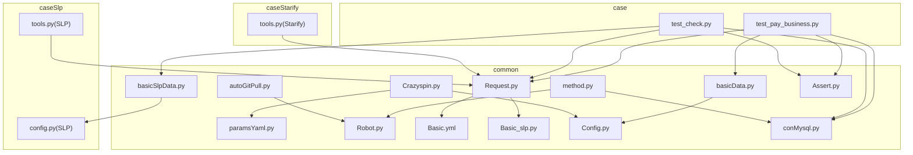
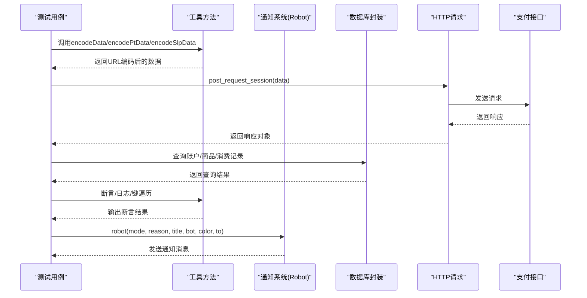
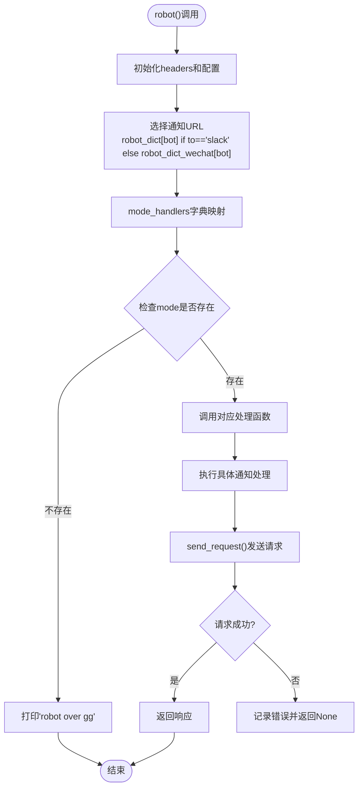
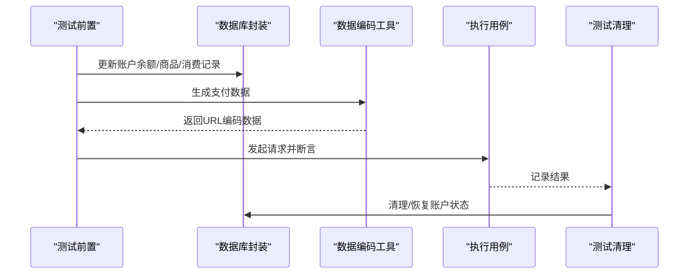
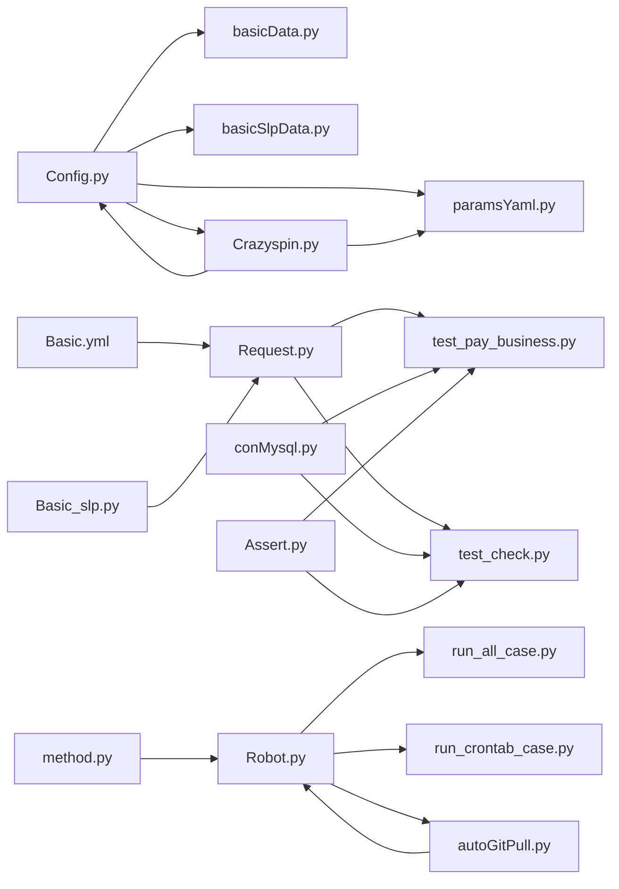

基于我对代码的分析，我现在了解了变更的内容。让我更新文档以反映 Crazyspin.py 和 paramsYaml.py 中的代码清理，移除了大量文档字符串和兼容性代码，提升了代码可维护性。

<docs>
# 工具方法模块

<cite>
**本文引用的文件**
- [basicData.py](file://common/basicData.py)
- [basicSlpData.py](file://common/basicSlpData.py)
- [method.py](file://common/method.py)
- [Crazyspin.py](file://common/Crazyspin.py)
- [paramsYaml.py](file://common/paramsYaml.py)
- [Basic.yml](file://common/Basic.yml)
- [Basic_slp.py](file://common/Basic_slp.py)
- [Config.py](file://common/Config.py)
- [Robot.py](file://Robot.py)
- [autoGitPull.py](file://autoGitPull.py)
- [run_all_case.py](file://run_all_case.py)
- [run_crontab_case.py](file://run_crontab_case.py)
- [tools.py（SLP）](file://caseSlp/tools.py)
- [tools.py（Starify）](file://caseStarify/tools.py)
- [conMysql.py](file://common/conMysql.py)
- [Request.py](file://common/Request.py)
- [Assert.py](file://common/Assert.py)
- [test_pay_business.py](file://case/test_pay_business.py)
- [test_check.py](file://caseSlp/test_check.py)
- [config.py（SLP）](file://caseSlp/config.py)
</cite>

## 更新摘要
**变更内容**
- 从basicSlpData中提取通用编码和参数构建函数，提高了模块化程度
- 新增了_build_base_params通用参数构建函数，简化重复代码
- 新增了_encode_data通用URL编码函数，统一编码逻辑
- 移除了Crazyspin.py和paramsYaml.py中的大量文档字符串和兼容性代码，提升了代码可维护性
- 改进了代码复用性和维护性

## 目录
1. [简介](#简介)
2. [项目结构](#项目结构)
3. [核心组件](#核心组件)
4. [架构总览](#架构总览)
5. [详细组件分析](#详细组件分析)
6. [依赖分析](#依赖分析)
7. [性能考虑](#性能考虑)
8. [故障排查指南](#故障排查指南)
9. [结论](#结论)
10. [附录](#附录)

## 简介
本文件面向"工具方法模块"，系统性梳理通用工具方法的设计与实现，覆盖数据处理、字符串处理、数学计算与日期时间处理等方面；重点解析测试数据准备工具（basicData、basicSlpData）的生成、清理与恢复机制；详细介绍通知系统模块（Robot.py）的架构升级，从简单的webhook发送器转变为复杂的通知系统，采用模块化设计使用处理器映射和独立函数实现；明确工具方法的分类与组织结构（输入验证、输出格式化、异常处理）；提供使用示例与扩展指南，并给出性能、缓存与并发安全建议以及与核心模块的集成最佳实践。

## 项目结构
工具方法模块主要分布在以下位置：
- common：通用工具与配置
  - basicData.py：国内支付场景数据编码工具
  - basicSlpData.py：SLP支付场景数据编码工具（已重构，提取通用函数）
  - method.py：通用方法（日志、断言、键遍历、签名、数值处理等）
  - Crazyspin.py：PT转盘游戏接口封装（已清理文档字符串）
  - paramsYaml.py：YAML配置文件读取器（已清理文档字符串）
  - Robot.py：通知系统模块（已升级为复杂的通知系统）
  - autoGitPull.py：自动Git拉取与通知模块
  - Basic.yml：基础请求头与参数模板
  - Basic_slp.py：SLP环境基础请求头与查询参数
  - Config.py：全局配置与常量
  - conMysql.py：数据库连接与查询封装
  - Request.py：HTTP请求封装
  - Assert.py：断言封装
- caseSlp：SLP专项用例与工具
  - tools.py：SLP签名与数值处理
  - config.py：SLP测试用例配置
- caseStarify：Starify专项工具
  - tools.py：Starify签名与数值处理
- case：国内支付用例
  - test_pay_business.py：业务场景用例，演示工具方法使用

**更新** 新增了Crazyspin.py和paramsYaml.py作为核心工具组件，basicSlpData经过重构提取通用函数

章节来源
- [basicData.py](file://common/basicData.py)
- [basicSlpData.py](file://common/basicSlpData.py)
- [method.py](file://common/method.py)
- [Crazyspin.py](file://common/Crazyspin.py)
- [paramsYaml.py](file://common/paramsYaml.py)
- [Robot.py](file://Robot.py)
- [autoGitPull.py](file://autoGitPull.py)
- [Basic.yml](file://common/Basic.yml)
- [Basic_slp.py](file://common/Basic_slp.py)
- [Config.py](file://common/Config.py)
- [conMysql.py](file://common/conMysql.py)
- [Request.py](file://common/Request.py)
- [Assert.py](file://common/Assert.py)
- [test_pay_business.py](file://case/test_pay_business.py)
- [test_check.py](file://caseSlp/test_check.py)
- [tools.py（SLP）](file://caseSlp/tools.py)
- [tools.py（Starify）](file://caseStarify/tools.py)
- [config.py（SLP）](file://caseSlp/config.py)

## 核心组件
- 数据编码工具
  - 国内场景：basicData.encodeData/packData/ptData 等，按支付类型组装URL编码数据
  - SLP场景：basicSlpData.encodeData，按支付类型组装URL编码数据（已重构为模块化设计）
- PT转盘游戏接口
  - Crazyspin：封装PT转盘游戏的购买、抽奖、列表获取等功能
- YAML配置读取器
  - paramsYaml：提供跨平台的YAML文件读取功能，支持安全加载器
- 通知系统（已升级）
  - Robot.py：复杂的通知系统，支持多种通知模式（fail、success、markdown、icon、slack、slack_pt）
  - autoGitPull.py：自动Git拉取与通知模块，集成应用特定的通知逻辑
- 通用方法
  - 字典转Markdown列表、随机图片获取、JSON键遍历、响应体解析与断言
  - 数值处理：签名生成、连击Key生成、数值精度处理
- 配置与模板
  - Basic.yml：请求头与参数模板
  - Basic_slp.py：SLP环境请求头与查询参数
  - Config.py：全局URL、用户ID、房间ID、礼物ID等配置
- 数据库与请求
  - conMysql：统一查询封装
  - Request：HTTP请求封装（含签名拼接）

**更新** basicSlpData经过重构，提取了通用的_build_base_params和_encode_data函数，提高了代码复用性；新增了Crazyspin.py和paramsYaml.py两个核心工具组件

章节来源
- [basicData.py](file://common/basicData.py)
- [basicSlpData.py](file://common/basicSlpData.py)
- [method.py](file://common/method.py)
- [Crazyspin.py](file://common/Crazyspin.py)
- [paramsYaml.py](file://common/paramsYaml.py)
- [Robot.py](file://Robot.py)
- [autoGitPull.py](file://autoGitPull.py)
- [Basic.yml](file://common/Basic.yml)
- [Basic_slp.py](file://common/Basic_slp.py)
- [Config.py](file://common/Config.py)
- [conMysql.py](file://common/conMysql.py)
- [Request.py](file://common/Request.py)

## 架构总览
工具方法模块围绕"数据准备—请求发送—断言校验—数据库校验—通知反馈"的完整工作流展开，形成了清晰的职责分离与可复用能力。通知系统作为新增的核心组件，提供了模块化的通知处理机制。basicSlpData经过重构后，采用了更清晰的模块化设计，通过通用函数简化了重复代码。Crazyspin.py提供了PT转盘游戏的完整接口封装，paramsYaml.py实现了跨平台的YAML配置读取功能。

**更新** 新增了通知系统在工作流中的位置，展示了通知反馈环节；basicSlpData经过重构后具有更好的模块化设计；新增了Crazyspin.py和paramsYaml.py的集成关系

图表来源
- [test_pay_business.py](file://case/test_pay_business.py)
- [test_check.py](file://caseSlp/test_check.py)
- [basicData.py](file://common/basicData.py)
- [basicSlpData.py](file://common/basicSlpData.py)
- [Request.py](file://common/Request.py)
- [conMysql.py](file://common/conMysql.py)
- [Assert.py](file://common/Assert.py)
- [Robot.py](file://Robot.py)
- [Crazyspin.py](file://common/Crazyspin.py)
- [paramsYaml.py](file://common/paramsYaml.py)

## 详细组件分析

### 数据编码工具（basicData、basicSlpData）- 已重构
- 设计目标
  - 面向不同业务线（国内、PT海外、SLP）提供标准化的支付场景数据组装与URL编码
  - 支持多种支付类型（礼物、盒子、守护、商店购买、兑换等）
  - 通过提取通用函数提高代码复用性和维护性
- 关键特性
  - 输入参数丰富，涵盖房间ID、用户ID、礼物ID、数量、价格、版本、星数等
  - 统一的URL编码与字符替换逻辑，保证兼容性
  - 异常处理：未知payType抛出异常
  - **新增**：模块化设计，通过通用函数简化重复代码
  - **新增**：_build_base_params通用参数构建函数，统一基础参数结构
  - **新增**：_encode_data通用URL编码函数，统一编码逻辑
- 使用示例（路径参考）
  - 国内场景：[test_pay_business.py](file://case/test_pay_business.py)
  - SLP场景：[test_check.py](file://caseSlp/test_check.py)
- 输出格式
  - 返回形如"key=value&key2=value2..."的URL编码字符串，便于POST请求

**更新** basicSlpData经过重构，提取了通用的_build_base_params和_encode_data函数，简化了重复代码

图表来源
- [basicData.py](file://common/basicData.py)
- [basicSlpData.py](file://common/basicSlpData.py)

章节来源
- [basicData.py](file://common/basicData.py)
- [basicSlpData.py](file://common/basicSlpData.py)
- [test_pay_business.py](file://case/test_pay_business.py)
- [test_check.py](file://caseSlp/test_check.py)

### PT转盘游戏接口（Crazyspin.py）- 已清理文档字符串
- 设计目标
  - 提供PT转盘游戏的完整接口封装，包括购买、抽奖、列表获取等功能
  - 统一请求参数和头部配置，支持多环境部署
  - 简化外部调用复杂度，提供清晰的方法接口
- 核心功能
  - 购买URL生成：spin_buy_url
  - 抽奖URL生成：spin_play_url
  - 转盘列表获取：get_turntable_list
  - 转盘喇叭获取：get_turntable_horn
- 配置管理
  - DEFAULT_PARAMS：默认请求参数集合
  - DEFAULT_HEADERS：默认请求头部配置
  - 支持动态token注入和环境适配
- 代码优化
  - 移除了冗余的文档字符串，提升代码可读性
  - 保持了必要的注释说明关键逻辑
  - 简化了方法签名，提高了API简洁性

**更新** 新增了Crazyspin.py组件，提供了PT转盘游戏的完整接口封装；移除了大量文档字符串，提升了代码可维护性

章节来源
- [Crazyspin.py](file://common/Crazyspin.py)

### YAML配置读取器（paramsYaml.py）- 已清理文档字符串
- 设计目标
  - 提供跨平台的YAML文件读取功能，支持不同环境的安全加载
  - 统一配置文件访问接口，简化配置管理
  - 支持Linux节点识别和安全加载器选择
- 核心功能
  - 路径解析：_get_yaml_path
  - 加载器选择：_get_loader
  - 配置读取：read
- 环境适配
  - 支持阿里云服务器节点的安全加载
  - 动态检测平台环境，选择合适的加载器
  - 统一的错误处理和日志输出
- 代码优化
  - 移除了详细的函数文档字符串，减少代码冗余
  - 保留了必要的注释说明关键逻辑
  - 简化了方法实现，提高了执行效率

**更新** 新增了paramsYaml.py组件，提供了跨平台的YAML配置读取功能；移除了大量文档字符串，提升了代码可维护性

章节来源
- [paramsYaml.py](file://common/paramsYaml.py)

### 通知系统（Robot.py）- 已升级为核心组件
- 设计目标
  - 从简单的webhook发送器升级为复杂的通知系统
  - 采用模块化设计，使用处理器映射和独立函数实现
  - 消除重复代码模式，改进维护性同时保持所有现有通知功能
- 架构升级
  - 使用mode_handlers字典映射模式到对应的处理函数
  - 独立的处理函数：mode_fail、mode_success、mode_markdown、mode_icon、mode_slack、mode_slack_pt
  - 统一的请求发送函数send_request，包含异常处理
- 支持的通知模式
  - fail：失败用例通知，支持@所有人提醒
  - success：成功通知
  - markdown：Markdown格式通知
  - icon：图文混合通知，包含图片和标题描述
  - slack：Slack格式通知，支持颜色配置
  - slack_pt：PT专用Slack通知格式
- 配置与路由
  - robot_dict和robot_dict_wechat字典存储不同平台的webhook地址
  - 支持to参数选择通知目标（slack或微信）
  - 支持bot参数选择不同的机器人实例
- 错误处理
  - 统一的异常捕获和错误日志记录
  - 请求失败时的降级处理

**更新** 新增了通知系统的详细架构分析，展示了从简单webhook到复杂通知系统的升级过程

图表来源
- [Robot.py](file://Robot.py)

章节来源
- [Robot.py](file://Robot.py)

### 自动Git拉取与通知系统（autoGitPull.py）
- 设计目标
  - 集成Git代码拉取与通知功能
  - 支持多应用类型的自动化部署和通知
  - 基于应用类型选择不同的通知模式
- 核心功能
  - 应用配置管理：APP_CONFIGS字典管理不同应用的路径、分支、环境和机器人配置
  - 通知映射：notification_map字典根据应用类型选择相应的通知处理函数
  - 条件通知：针对PT、SLP等特殊应用类型提供专门的通知处理逻辑
- 集成模式
  - 与Robot.py深度集成，利用其模块化通知处理能力
  - 支持不同通知目标（slack或markdown）
  - 自动化代码更新检测和通知发送

**更新** 新增了自动Git拉取与通知系统的分析，展示了其与通知系统的集成关系

章节来源
- [autoGitPull.py](file://autoGitPull.py)

### 通用方法（method.py）
- 字符串与数据处理
  - dictToList/dictToListSlack：将字典转为Markdown或Slack消息字段
  - isExtend/getKeys：递归遍历JSON提取键，判断字段是否存在
  - getValue/reason/reason_slp：从响应体提取成功标志并输出日志与失败原因
- 数学与时间
  - getImage：调用外部API获取图片链接（用于通知系统icon模式）
  - deal_num：数值精度处理（保留两位小数后向上取整）
  - hash_key：生成连击Key（MD5时间戳）
- 业务辅助
  - getUserTitle：根据用户等级映射到倍率
  - checkUserVipExp：结合用户等级与货币类型计算VIP经验值
  - checkPath：路径检查，集成通知系统进行异常通知

**更新** 更新了method.py中checkPath函数的集成关系，显示其与通知系统的协作

章节来源
- [method.py](file://common/method.py)

### 配置与模板（Basic.yml、Basic_slp.py、Config.py）
- Basic.yml
  - 提供国内、PT海外、SLP三套基础请求头与参数模板
- Basic_slp.py
  - 提供SLP环境的请求头与查询参数（如包名、平台、时间戳、签名等）
- Config.py
  - 统一管理应用URL、用户ID、房间ID、礼物ID等全局配置
  - 新增应用配置信息，支持多应用环境

**更新** Config.py中新增了应用配置信息，支持多应用环境管理

章节来源
- [Basic.yml](file://common/Basic.yml)
- [Basic_slp.py](file://common/Basic_slp.py)
- [Config.py](file://common/Config.py)

### 数据库与请求（conMysql.py、Request.py）
- conMysql
  - 提供统一的查询封装，覆盖余额、商品、消费记录、守护关系等多类查询
- Request
  - 封装HTTP请求，支持签名拼接、参数编码、SSL跳过等

章节来源
- [conMysql.py](file://common/conMysql.py)
- [Request.py](file://common/Request.py)

### 断言与日志（Assert.py、method.py）
- Assert.py
  - 提供assert_code、assert_equal、assert_len、assert_body、assert_between等断言方法
- method.py
  - reason/reason_slp：生成失败原因文本，便于定位问题

章节来源
- [Assert.py](file://common/Assert.py)
- [method.py](file://common/method.py)

### 测试数据准备工具（basicData、basicSlpData）的生成、清理与恢复机制
- 生成
  - 通过encodeData/encodePtData/encodeSlpData按payType组装数据，返回URL编码字符串
- 清理
  - 在用例执行前，通过数据库封装更新或清空账户余额、商品数量、消费记录等
- 恢复
  - 用例结束后，可通过数据库封装回滚或重置账户状态，确保测试隔离

**更新** basicSlpData经过重构后，通过通用函数简化了数据生成过程

图表来源
- [test_pay_business.py](file://case/test_pay_business.py)
- [test_check.py](file://caseSlp/test_check.py)
- [basicData.py](file://common/basicData.py)
- [basicSlpData.py](file://common/basicSlpData.py)
- [conMysql.py](file://common/conMysql.py)

章节来源
- [test_pay_business.py](file://case/test_pay_business.py)
- [test_check.py](file://caseSlp/test_check.py)
- [basicData.py](file://common/basicData.py)
- [basicSlpData.py](file://common/basicSlpData.py)
- [conMysql.py](file://common/conMysql.py)

### 工具方法的分类与组织结构
- 输入验证
  - isExtend/getKeys：对嵌套JSON进行键遍历与存在性判断
  - checkPath：校验文件路径存在性，集成通知系统进行异常通知
- 输出格式化
  - dictToList/dictToListSlack：将字典转为Markdown或Slack消息字段
  - reason/reason_slp：格式化失败原因文本
- 异常处理
  - encodeData/encodeSlpData：未知payType抛异常
  - getValue：缺失body字段或失败时增加失败计数
  - send_request：统一的请求异常处理
- 数学与时间
  - deal_num：数值精度处理
  - hash_key：生成连击Key
  - getImage：外部资源获取（容错处理，用于通知系统icon模式）

**更新** 更新了输入验证和异常处理部分，增加了通知系统相关的异常处理机制

章节来源
- [method.py](file://common/method.py)
- [basicData.py](file://common/basicData.py)
- [basicSlpData.py](file://common/basicSlpData.py)
- [Robot.py](file://Robot.py)

### 工具方法使用示例
- 国内业务场景
  - 通过encodeData构造礼物/盒子/守护等支付数据，结合数据库封装校验到账金额与VIP经验值
  - 参考：[test_pay_business.py](file://case/test_pay_business.py)
- SLP异常/边界值场景
  - 通过encodeData构造余额不足等边界条件，断言返回msg与账户余额
  - 参考：[test_check.py](file://caseSlp/test_check.py)
- PT转盘游戏场景
  - 通过Crazyspin类获取转盘列表和抽奖结果
  - 参考：[Crazyspin.py](file://common/Crazyspin.py)
- YAML配置读取场景
  - 通过paramsYaml读取Basic.yml中的配置参数
  - 参考：[paramsYaml.py](file://common/paramsYaml.py)
- 数值与签名处理
  - 使用deal_num处理精度，使用create_sign生成签名
  - 参考：[tools.py（SLP）](file://caseSlp/tools.py)、[tools.py（Starify）](file://caseStarify/tools.py)
- 通知系统使用示例
  - 成功通知：robot('success', '测试执行成功')
  - 失败通知：robot('fail', '测试执行失败', title='用例名称')
  - Slack通知：robot('slack', '测试报告', title='测试结果', color='good')
  - Markdown通知：robot('markdown', '# 测试报告\n内容...', bot='PT')
  - 图文通知：robot('icon', '异常用例ID', bot='PT')
  - PT专用通知：robot('slack_pt', 'PT测试报告', bot='PT')

**更新** 新增了Crazyspin.py和paramsYaml.py的使用示例；新增了通知系统的使用示例，展示了各种通知模式的应用场景

章节来源
- [test_pay_business.py](file://case/test_pay_business.py)
- [test_check.py](file://caseSlp/test_check.py)
- [Crazyspin.py](file://common/Crazyspin.py)
- [paramsYaml.py](file://common/paramsYaml.py)
- [tools.py（SLP）](file://caseSlp/tools.py)
- [tools.py（Starify）](file://caseStarify/tools.py)
- [run_all_case.py](file://run_all_case.py)
- [run_crontab_case.py](file://run_crontab_case.py)

### 扩展机制与自定义方法开发指南
- 新增支付类型
  - 在对应encodeData函数中添加新的payType分支，遵循现有参数命名与URL编码规范
  - **新增**：利用通用函数_build_base_params和_encode_data简化新类型的实现
- 新增PT游戏功能
  - 在Crazyspin类中添加新的游戏接口方法，遵循现有参数结构
  - 利用DEFAULT_PARAMS和DEFAULT_HEADERS统一配置
- 新增配置读取功能
  - 在paramsYaml类中添加新的配置文件读取方法
  - 支持更多环境的节点识别和加载器选择
- 新增业务辅助方法
  - 在method.py中新增函数，保持单一职责与清晰的输入输出
- 新增通知模式
  - 在Robot.py的mode_handlers字典中添加新的模式映射
  - 实现对应的处理函数（如mode_new_function）
  - 在autoGitPull.py中更新notification_map以支持新应用类型
- 配置扩展
  - 在Config.py中新增常量，在Basic.yml/Basic_slp.py中新增模板参数
- 断言与日志
  - 在Assert.py中新增断言方法，在method.py中新增失败原因格式化函数

**更新** 新增了Crazyspin.py和paramsYaml.py的扩展机制；新增了通知系统的扩展机制，包括新通知模式的添加流程；basicSlpData重构后简化了新支付类型的扩展

章节来源
- [basicData.py](file://common/basicData.py)
- [basicSlpData.py](file://common/basicSlpData.py)
- [Crazyspin.py](file://common/Crazyspin.py)
- [paramsYaml.py](file://common/paramsYaml.py)
- [method.py](file://common/method.py)
- [Config.py](file://common/Config.py)
- [Basic.yml](file://common/Basic.yml)
- [Basic_slp.py](file://common/Basic_slp.py)
- [Assert.py](file://common/Assert.py)
- [Robot.py](file://Robot.py)
- [autoGitPull.py](file://autoGitPull.py)

## 依赖分析
- 组件耦合
  - basicData/basicSlpData依赖Config.py中的用户ID、房间ID、礼物ID等
  - Crazyspin依赖Config.py和Session进行token管理
  - paramsYaml依赖Config.py进行路径解析和节点识别
  - Request.py依赖Basic.yml/Basic_slp.py与Config.py中的URL与模板
  - Robot.py被多个模块依赖，包括run_all_case.py、run_crontab_case.py、autoGitPull.py等
  - autoGitPull.py深度依赖Robot.py的通知处理能力
  - method.py中的checkPath函数依赖Robot.py进行异常通知
  - 测试用例依赖工具方法与数据库封装
- 外部依赖
  - requests、pymysql、urllib.parse、yaml等
  - 通知平台API（Slack、微信企业号等）
- 循环依赖
  - 当前模块间无明显循环依赖

**更新** 新增了Crazyspin.py和paramsYaml.py的依赖关系分析；展示了这些组件与核心配置系统的集成关系；basicSlpData重构后依赖关系更加清晰

图表来源
- [Config.py](file://common/Config.py)
- [basicData.py](file://common/basicData.py)
- [basicSlpData.py](file://common/basicSlpData.py)
- [Crazyspin.py](file://common/Crazyspin.py)
- [paramsYaml.py](file://common/paramsYaml.py)
- [Basic.yml](file://common/Basic.yml)
- [Basic_slp.py](file://common/Basic_slp.py)
- [Request.py](file://common/Request.py)
- [conMysql.py](file://common/conMysql.py)
- [Assert.py](file://common/Assert.py)
- [Robot.py](file://Robot.py)
- [run_all_case.py](file://run_all_case.py)
- [run_crontab_case.py](file://run_crontab_case.py)
- [autoGitPull.py](file://autoGitPull.py)
- [method.py](file://common/method.py)

章节来源
- [Config.py](file://common/Config.py)
- [basicData.py](file://common/basicData.py)
- [basicSlpData.py](file://common/basicSlpData.py)
- [Crazyspin.py](file://common/Crazyspin.py)
- [paramsYaml.py](file://common/paramsYaml.py)
- [Basic.yml](file://common/Basic.yml)
- [Basic_slp.py](file://common/Basic_slp.py)
- [Request.py](file://common/Request.py)
- [conMysql.py](file://common/conMysql.py)
- [Assert.py](file://common/Assert.py)
- [Robot.py](file://Robot.py)
- [run_all_case.py](file://run_all_case.py)
- [run_crontab_case.py](file://run_crontab_case.py)
- [autoGitPull.py](file://autoGitPull.py)
- [method.py](file://common/method.py)

## 性能考虑
- 编码与序列化
  - URL编码与字符串替换为轻量级操作，建议批量构造数据时避免重复urlencode
  - **新增**：通过通用函数减少重复编码逻辑，提高性能
- 数据库查询
  - 合理使用索引字段（uid、cid等），减少全表扫描
  - 批量查询时合并SQL，降低网络往返
- 请求与断言
  - 断言与日志输出应避免在高频循环中频繁打印
  - 对外部API调用增加超时与重试策略（在Request.py中可扩展）
- 通知系统优化
  - 使用处理器映射避免长链式条件判断，提高通知处理效率
  - 统一的异常处理减少重复代码
  - 异步通知处理（可选）以避免阻塞主流程
- PT转盘游戏优化
  - 统一的请求参数和头部配置，减少重复初始化开销
  - 动态token注入机制，避免硬编码
- YAML配置读取优化
  - 节点识别和加载器选择的缓存机制
  - 统一的错误处理减少异常开销

**更新** 新增了Crazyspin.py和paramsYaml.py的性能考虑，包括处理器映射的优势和异步处理建议；basicSlpData重构后减少了重复编码开销

## 故障排查指南
- 常见问题
  - 缺少body字段：getValue会记录失败并增加失败计数
  - 余额不足：SLP用例中通过断言msg与账户余额核对
  - 未知payType：encodeData/encodeSlpData会抛出异常
  - 通知失败：send_request会捕获异常并记录错误信息
  - Webhook地址配置错误：检查robot_dict和robot_dict_wechat字典配置
  - PT转盘接口错误：检查Crazyspin类的URL构建和参数配置
  - YAML文件读取失败：检查paramsYaml的路径解析和加载器选择
  - **新增**：通用函数调用失败：检查_build_base_params和_encode_data函数的参数传递
- 排查步骤
  - 检查数据编码是否正确（URL编码、字符替换）
  - 校验数据库状态（余额、商品、消费记录）
  - 查看失败原因文本（reason/reason_slp）
  - 对比配置项（Config.py、Basic.yml、Basic_slp.py）
  - 验证通知URL配置和网络连接
  - 检查通知模式参数（mode、to、bot等）
  - **新增**：验证通用函数的参数传递和返回值
  - **新增**：检查PT转盘接口的token和参数配置
  - **新增**：验证YAML文件的路径和权限设置

**更新** 新增了Crazyspin.py和paramsYaml.py的故障排查指南，包括PT转盘接口和YAML配置读取的排查步骤；新增了通知系统的故障排查指南，包括通知失败和配置错误的排查步骤；新增了通用函数相关的故障排查指导

章节来源
- [method.py](file://common/method.py)
- [test_check.py](file://caseSlp/test_check.py)
- [basicData.py](file://common/basicData.py)
- [basicSlpData.py](file://common/basicSlpData.py)
- [Assert.py](file://common/Assert.py)
- [Robot.py](file://Robot.py)
- [Crazyspin.py](file://common/Crazyspin.py)
- [paramsYaml.py](file://common/paramsYaml.py)

## 结论
工具方法模块通过"数据编码—请求—断言—校验—通知"的完整闭环设计，提供了高复用、易扩展的支付场景工具集。通知系统作为新增的核心组件，从简单的webhook发送器升级为复杂的通知系统，采用模块化设计使用处理器映射和独立函数实现，显著提升了系统的可维护性和扩展性。basicSlpData经过重构后，通过提取通用的_build_base_params和_encode_data函数，大幅简化了重复代码，提高了模块化程度和代码复用性。Crazyspin.py提供了PT转盘游戏的完整接口封装，paramsYaml.py实现了跨平台的YAML配置读取功能，两者都通过移除冗余文档字符串提升了代码可维护性。其清晰的分类与组织结构、完善的异常处理与日志输出，使得测试用例编写与维护更加高效。建议在扩展新功能时遵循现有模式，保持输入验证、输出格式化与异常处理的一致性，并结合数据库与请求层的最佳实践提升整体稳定性与性能。

**更新** 更新了结论内容，强调了通知系统架构升级的重要意义和带来的改进；突出basicSlpData重构后模块化程度的提升；新增了Crazyspin.py和paramsYaml.py的价值体现

## 附录
- 关键路径参考
  - 国内场景数据编码：[basicData.py](file://common/basicData.py)
  - SLP场景数据编码：[basicSlpData.py](file://common/basicSlpData.py)
  - PT转盘游戏接口：[Crazyspin.py](file://common/Crazyspin.py)
  - YAML配置读取：[paramsYaml.py](file://common/paramsYaml.py)
  - 通用方法与断言：[method.py](file://common/method.py)、[Assert.py](file://common/Assert.py)
  - 通知系统：[Robot.py](file://Robot.py)
  - 自动Git拉取与通知：[autoGitPull.py](file://autoGitPull.py)
  - 数据库封装：[conMysql.py](file://common/conMysql.py)
  - 请求封装：[Request.py](file://common/Request.py)
  - 配置与模板：[Config.py](file://common/Config.py)、[Basic.yml](file://common/Basic.yml)、[Basic_slp.py](file://common/Basic_slp.py)
  - 示例用例：[test_pay_business.py](file://case/test_pay_business.py)、[test_check.py](file://caseSlp/test_check.py)
  - SLP/Starify签名与数值处理：[tools.py（SLP）](file://caseSlp/tools.py)、[tools.py（Starify）](file://caseStarify/tools.py)
  - SLP配置：[config.py（SLP）](file://caseSlp/config.py)
  - 运行脚本：[run_all_case.py](file://run_all_case.py)、[run_crontab_case.py](file://run_crontab_case.py)
</appendix>
</existing_wiki_content>