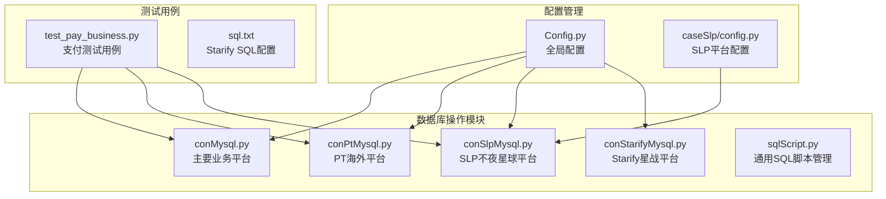
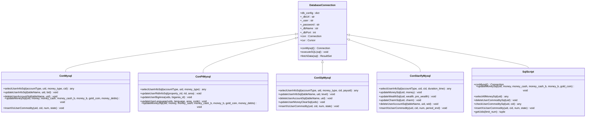
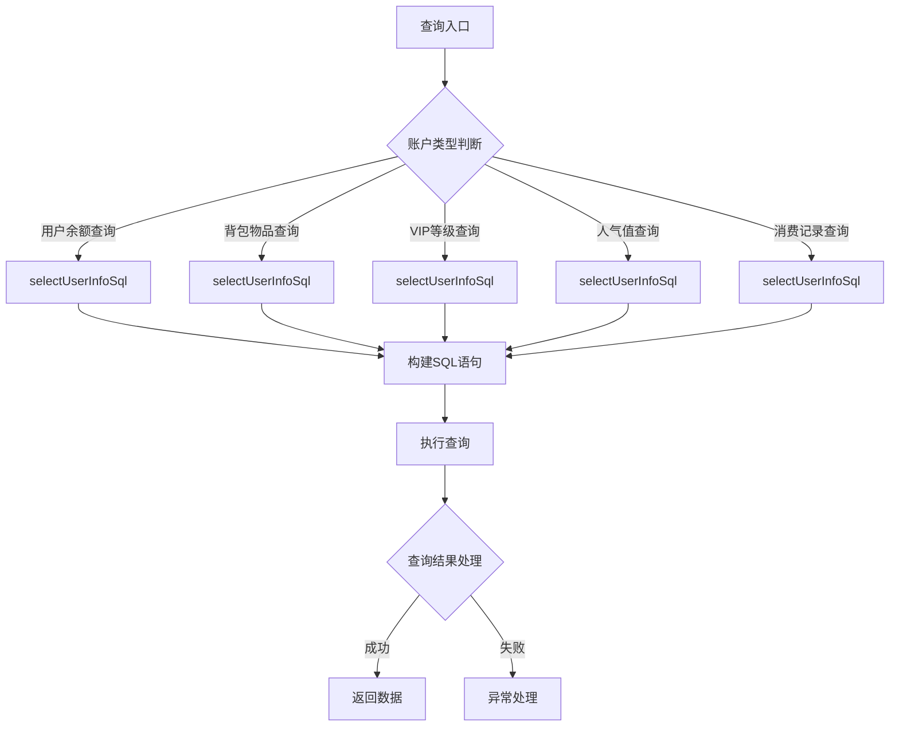
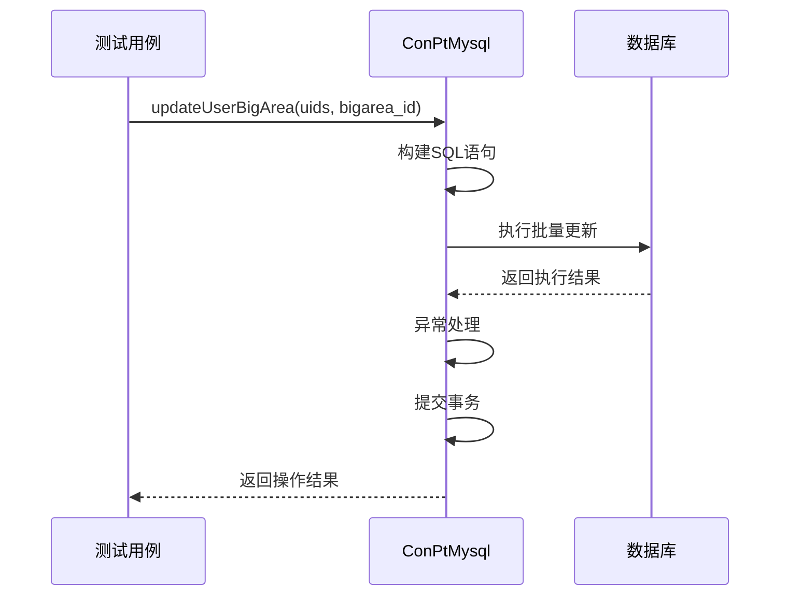
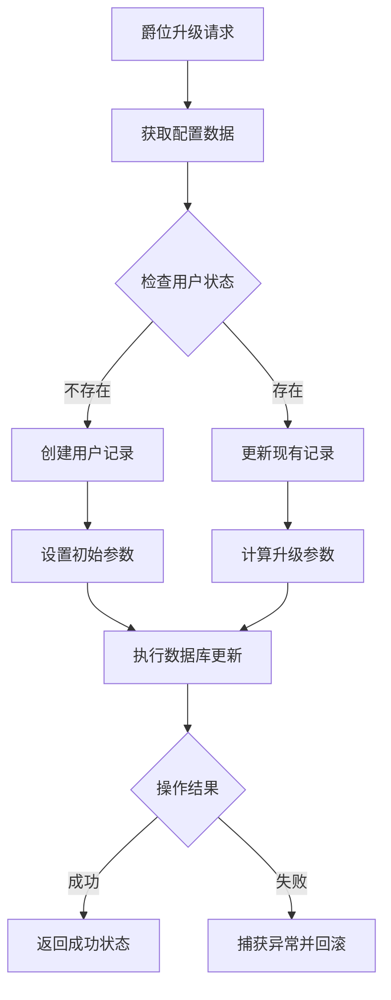
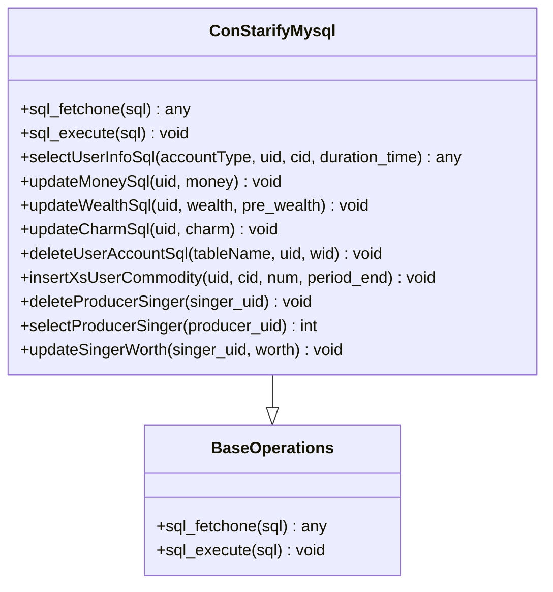
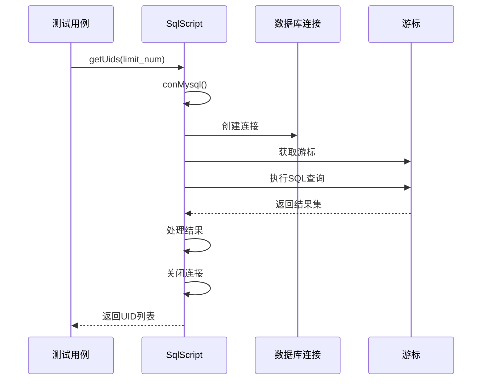
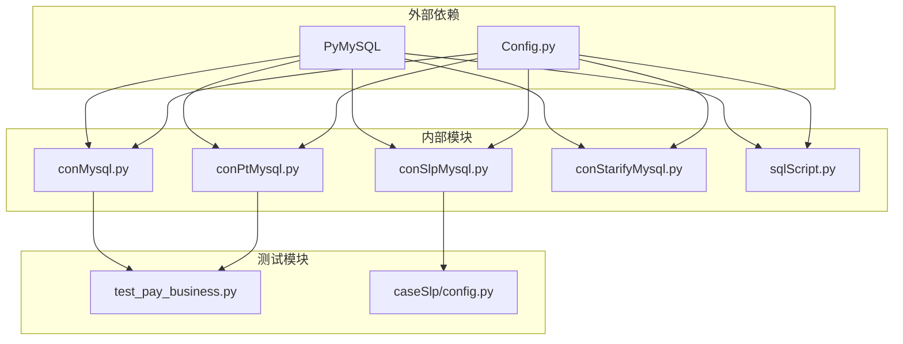

# 数据库操作模块

<cite>
**本文档引用的文件**
- [conMysql.py](file://common/conMysql.py)
- [conPtMysql.py](file://common/conPtMysql.py)
- [conSlpMysql.py](file://common/conSlpMysql.py)
- [conStarifyMysql.py](file://common/conStarifyMysql.py)
- [sqlScript.py](file://common/sqlScript.py)
- [Config.py](file://common/Config.py)
- [test_pay_business.py](file://case/test_pay_business.py)
- [config.py](file://caseSlp/config.py)
- [sql.txt](file://caseStarify/sql.txt)
</cite>

## 目录
1. [简介](#简介)
2. [项目结构](#项目结构)
3. [核心组件](#核心组件)
4. [架构概览](#架构概览)
5. [详细组件分析](#详细组件分析)
6. [依赖关系分析](#依赖关系分析)
7. [性能考虑](#性能考虑)
8. [故障排除指南](#故障排除指南)
9. [结论](#结论)

## 简介

数据库操作模块是支付测试系统的核心基础设施，负责管理多个平台的数据库连接和操作。该模块提供了统一的数据库访问接口，支持MySQL连接池管理、SQL脚本管理、事务处理和跨平台适配。

模块主要包含四个核心类：
- `conMysql`: 主要业务平台数据库操作
- `conPtMysql`: PT海外平台数据库操作  
- `conSlpMysql`: SLP不夜星球平台数据库操作
- `conStarifyMysql`: Starify星战平台数据库操作
- `mysql`: 通用SQL脚本管理器

## 项目结构

数据库操作模块采用按平台分离的架构设计，每个平台都有独立的数据库连接类，确保各平台功能的独立性和可维护性。

**图表来源**
- [conMysql.py:1-530](file://common/conMysql.py#L1-L530)
- [conPtMysql.py:1-345](file://common/conPtMysql.py#L1-L345)
- [conSlpMysql.py:1-680](file://common/conSlpMysql.py#L1-L680)
- [conStarifyMysql.py:1-148](file://common/conStarifyMysql.py#L1-L148)
- [sqlScript.py:1-145](file://common/sqlScript.py#L1-L145)

**章节来源**
- [conMysql.py:1-530](file://common/conMysql.py#L1-L530)
- [conPtMysql.py:1-345](file://common/conPtMysql.py#L1-L345)
- [conSlpMysql.py:1-680](file://common/conSlpMysql.py#L1-L680)
- [conStarifyMysql.py:1-148](file://common/conStarifyMysql.py#L1-L148)
- [sqlScript.py:1-145](file://common/sqlScript.py#L1-L145)

## 核心组件

### MySQL连接池设计

数据库操作模块实现了基于PyMySQL的连接池管理，通过静态属性和方法提供统一的数据库访问接口。

#### 连接配置管理

每个数据库连接类都包含标准化的连接配置：
- 数据库主机地址
- 用户名和密码
- 数据库名称
- 端口号
- 字符集设置

#### 连接复用机制

模块采用单例模式管理数据库连接，避免频繁创建和销毁连接带来的性能开销。

**章节来源**
- [conMysql.py:8-25](file://common/conMysql.py#L8-L25)
- [conPtMysql.py:6-23](file://common/conPtMysql.py#L6-L23)
- [conSlpMysql.py:8-27](file://common/conSlpMysql.py#L8-L27)
- [conStarifyMysql.py:6-25](file://common/conStarifyMysql.py#L6-L25)

### SQL脚本管理机制

SQL脚本管理器提供了统一的SQL语句组织和执行接口，支持参数化查询和批量操作。

#### SQL语句组织

- 使用格式化字符串构建SQL语句
- 支持动态参数绑定
- 提供预定义的SQL模板

#### 参数绑定和批量执行

- 支持单个参数和多个参数的绑定
- 提供批量数据处理能力
- 自动处理SQL注入防护

**章节来源**
- [sqlScript.py:5-27](file://common/sqlScript.py#L5-L27)
- [sqlScript.py:30-42](file://common/sqlScript.py#L30-L42)
- [sqlScript.py:112-124](file://common/sqlScript.py#L112-L124)

## 架构概览

数据库操作模块采用分层架构设计，通过抽象基类和具体实现类分离不同平台的功能需求。

**图表来源**
- [conMysql.py:8-530](file://common/conMysql.py#L8-L530)
- [conPtMysql.py:6-345](file://common/conPtMysql.py#L6-L345)
- [conSlpMysql.py:8-680](file://common/conSlpMysql.py#L8-L680)
- [conStarifyMysql.py:6-148](file://common/conStarifyMysql.py#L6-L148)
- [sqlScript.py:5-145](file://common/sqlScript.py#L5-L145)

## 详细组件分析

### 主要业务平台连接器 (conMysql)

#### 功能特性

conMysql类提供了最完整的数据库操作功能，支持多种账户类型的查询和复杂的业务操作。

#### 查询操作

**图表来源**
- [conMysql.py:28-204](file://common/conMysql.py#L28-L204)

#### 数据操作

支持完整的CRUD操作，包括插入、更新、删除和查询。

**章节来源**
- [conMysql.py:28-530](file://common/conMysql.py#L28-L530)

### PT海外平台连接器 (conPtMysql)

#### 特殊功能

conPtMysql针对PT海外平台的特殊需求进行了优化，包括大区管理和语言设置功能。

#### 大区管理

**图表来源**
- [conPtMysql.py:160-171](file://common/conPtMysql.py#L160-L171)

**章节来源**
- [conPtMysql.py:160-185](file://common/conPtMysql.py#L160-L185)

### SLP不夜星球平台连接器 (conSlpMysql)

#### 平台特色

conSlpMysql专注于SLP平台的爵位系统和成长值管理，提供了独特的用户等级提升功能。

#### 爵位管理系统

**图表来源**
- [conSlpMysql.py:386-410](file://common/conSlpMysql.py#L386-L410)

**章节来源**
- [conSlpMysql.py:386-410](file://common/conSlpMysql.py#L386-L410)

### Starify星战平台连接器 (conStarifyMysql)

#### 简化设计

conStarifyMysql采用了简化的数据库操作设计，专注于核心的账户余额和礼物管理功能。

#### 通用操作接口

**图表来源**
- [conStarifyMysql.py:27-143](file://common/conStarifyMysql.py#L27-L143)

**章节来源**
- [conStarifyMysql.py:27-143](file://common/conStarifyMysql.py#L27-L143)

### 通用SQL脚本管理器 (sqlScript)

#### 统一接口设计

sqlScript提供了统一的SQL操作接口，支持灵活的参数绑定和结果处理。

#### 批量操作支持

**图表来源**
- [sqlScript.py:127-144](file://common/sqlScript.py#L127-L144)

**章节来源**
- [sqlScript.py:127-144](file://common/sqlScript.py#L127-L144)

## 依赖关系分析

数据库操作模块的依赖关系相对简单，主要依赖PyMySQL库进行数据库连接和操作。

**图表来源**
- [conMysql.py:2](file://common/conMysql.py#L2)
- [conPtMysql.py:2](file://common/conPtMysql.py#L2)
- [conSlpMysql.py:5](file://common/conSlpMysql.py#L5)
- [conStarifyMysql.py:3](file://common/conStarifyMysql.py#L3)
- [sqlScript.py:2](file://common/sqlScript.py#L2)

### 平台适配策略

不同平台的数据库连接器采用了差异化的设计策略：

1. **主要业务平台**: 提供最完整功能集，支持复杂的业务操作
2. **海外平台**: 专注于区域化功能，如大区管理和语言设置
3. **SLP平台**: 专门处理爵位系统和成长值管理
4. **Starify平台**: 采用简化设计，专注于核心功能

**章节来源**
- [conMysql.py:1-530](file://common/conMysql.py#L1-L530)
- [conPtMysql.py:1-345](file://common/conPtMysql.py#L1-L345)
- [conSlpMysql.py:1-680](file://common/conSlpMysql.py#L1-L680)
- [conStarifyMysql.py:1-148](file://common/conStarifyMysql.py#L1-L148)

## 性能考虑

### 连接池优化

数据库操作模块通过以下方式优化性能：

1. **连接复用**: 使用静态连接避免重复创建
2. **自动重连**: 启用ping检测和自动重连机制
3. **批量操作**: 支持批量数据处理减少网络往返

### 查询优化

1. **参数化查询**: 防止SQL注入同时提高查询效率
2. **索引利用**: 建议在常用查询字段上建立适当索引
3. **结果集处理**: 提供多种结果集处理方式

### 并发控制

1. **事务管理**: 提供显式的事务控制接口
2. **异常处理**: 完善的异常捕获和回滚机制
3. **连接状态**: 实时监控连接状态确保稳定性

## 故障排除指南

### 常见问题及解决方案

#### 连接超时问题

**症状**: 数据库连接超时或连接丢失
**解决方案**: 
- 检查网络连接稳定性
- 调整连接超时参数
- 实施连接健康检查

#### SQL执行错误

**症状**: SQL语句执行失败
**解决方案**:
- 检查SQL语法正确性
- 验证参数绑定完整性
- 查看数据库权限设置

#### 事务回滚问题

**症状**: 数据库状态不一致
**解决方案**:
- 确保异常处理的完整性
- 检查事务边界设置
- 验证回滚操作的有效性

### 调试方法

1. **日志记录**: 启用详细的SQL执行日志
2. **连接监控**: 监控数据库连接状态
3. **性能分析**: 分析慢查询和高负载操作

**章节来源**
- [conMysql.py:339-347](file://common/conMysql.py#L339-L347)
- [conPtMysql.py:189-198](file://common/conPtMysql.py#L189-L198)
- [conSlpMysql.py:424-435](file://common/conSlpMysql.py#L424-L435)
- [conStarifyMysql.py:43-51](file://common/conStarifyMysql.py#L43-L51)

## 结论

数据库操作模块通过合理的架构设计和功能划分，为支付测试系统提供了稳定可靠的数据库访问能力。模块的主要优势包括：

1. **平台适配性**: 支持多个平台的差异化需求
2. **功能完整性**: 提供完整的CRUD操作和事务管理
3. **性能优化**: 通过连接复用和批量操作提升性能
4. **易于维护**: 清晰的代码结构和标准化接口

未来可以考虑的改进方向：
- 实现真正的连接池管理
- 添加查询缓存机制
- 增强错误恢复能力
- 优化批量操作性能