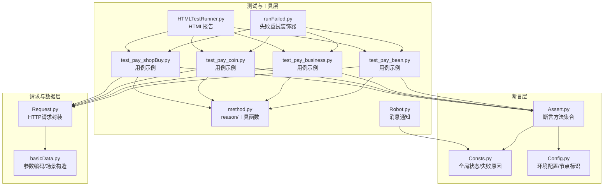
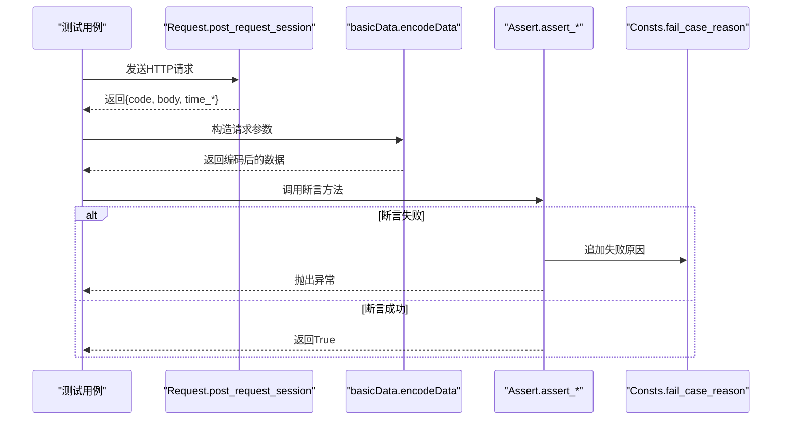
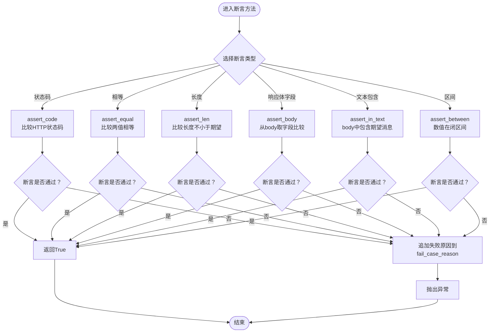
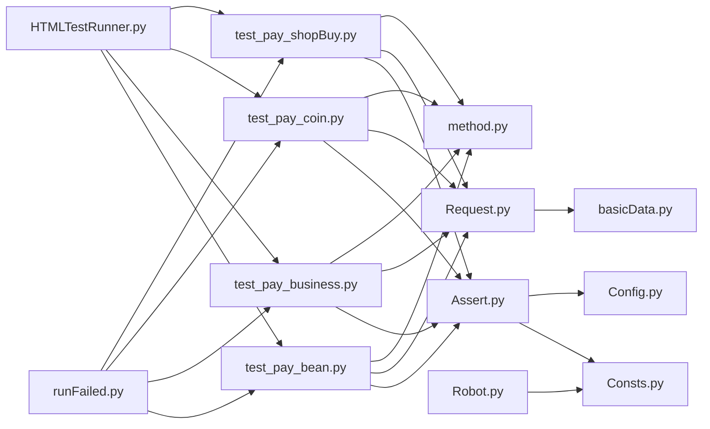

# 断言验证模块

<cite>
**本文引用的文件**
- [common/Assert.py](file://common/Assert.py)
- [common/Consts.py](file://common/Consts.py)
- [common/Config.py](file://common/Config.py)
- [common/Request.py](file://common/Request.py)
- [common/basicData.py](file://common/basicData.py)
- [common/method.py](file://common/method.py)
- [common/runFailed.py](file://common/runFailed.py)
- [common/HTMLTestRunner.py](file://common/HTMLTestRunner.py)
- [common/Robot.py](file://common/Robot.py)
- [case/test_pay_bean.py](file://case/test_pay_bean.py)
- [case/test_pay_business.py](file://case/test_pay_business.py)
- [case/test_pay_coin.py](file://case/test_pay_coin.py)
- [case/test_pay_shopBuy.py](file://case/test_pay_shopBuy.py)
- [README.md](file://README.md)
</cite>

## 目录
1. [简介](#简介)
2. [项目结构](#项目结构)
3. [核心组件](#核心组件)
4. [架构总览](#架构总览)
5. [详细组件分析](#详细组件分析)
6. [依赖分析](#依赖分析)
7. [性能考虑](#性能考虑)
8. [故障排查指南](#故障排查指南)
9. [结论](#结论)
10. [附录](#附录)

## 简介
本文件面向“断言验证模块”的技术文档，系统阐述断言体系的设计理念、实现原理与使用方法。断言模块覆盖HTTP响应断言、数据断言、状态断言与业务逻辑断言，提供统一的断言入口与失败处理机制，结合测试框架与报告工具形成完整的自动化测试闭环。文档同时给出断言失败的处理策略、调试信息输出、自定义断言扩展方法、批量断言与条件断言的实现思路，以及与测试框架的集成最佳实践。

## 项目结构
断言验证模块位于 common/Assert.py，围绕该模块构建了以下支撑能力：
- 请求封装与响应解析：common/Request.py
- 数据编码与参数构造：common/basicData.py
- 断言失败原因收集与全局状态：common/Consts.py、common/Config.py
- 测试用例与断言调用：case/*.py
- 失败重试与断言组合：common/runFailed.py
- 报告与通知：common/HTMLTestRunner.py、common/Robot.py
- 辅助工具与断言理由生成：common/method.py

图表来源
- [common/Assert.py:1-96](file://common/Assert.py#L1-L96)
- [common/Consts.py:1-17](file://common/Consts.py#L1-L17)
- [common/Config.py:1-133](file://common/Config.py#L1-L133)
- [common/Request.py:1-162](file://common/Request.py#L1-L162)
- [common/basicData.py:1-581](file://common/basicData.py#L1-L581)
- [common/method.py:1-171](file://common/method.py#L1-L171)
- [common/runFailed.py:1-87](file://common/runFailed.py#L1-L87)
- [common/HTMLTestRunner.py:516-704](file://common/HTMLTestRunner.py#L516-L704)
- [common/Robot.py:1-90](file://common/Robot.py#L1-L90)
- [case/test_pay_bean.py:1-277](file://case/test_pay_bean.py#L1-L277)
- [case/test_pay_business.py:1-189](file://case/test_pay_business.py#L1-L189)
- [case/test_pay_coin.py:1-63](file://case/test_pay_coin.py#L1-L63)
- [case/test_pay_shopBuy.py:1-124](file://case/test_pay_shopBuy.py#L1-L124)

章节来源
- [README.md:1-38](file://README.md#L1-L38)

## 核心组件
- 断言方法集：提供HTTP状态码断言、长度断言、相等断言、文本包含断言、响应体字段断言、区间断言等。
- 全局状态与失败原因：集中记录断言失败原因，便于后续统计与定位。
- 环境配置：包含服务器节点标识、URL前缀等，用于断言前置的兼容性处理。
- 请求封装：统一HTTP请求入口，返回标准化响应字典（状态码、body、耗时等）。
- 数据编码：根据支付场景构造请求参数，确保断言输入的一致性。
- 失败重试：装饰器式重试，结合断言失败进行清理与重试。
- 报告与通知：生成HTML报告，失败时推送通知。

章节来源
- [common/Assert.py:11-96](file://common/Assert.py#L11-L96)
- [common/Consts.py:7-17](file://common/Consts.py#L7-L17)
- [common/Config.py:41-45](file://common/Config.py#L41-L45)
- [common/Request.py:17-59](file://common/Request.py#L17-L59)
- [common/basicData.py:8-325](file://common/basicData.py#L8-L325)
- [common/runFailed.py:10-87](file://common/runFailed.py#L10-L87)
- [common/HTMLTestRunner.py:516-704](file://common/HTMLTestRunner.py#L516-L704)
- [common/Robot.py:6-34](file://common/Robot.py#L6-L34)

## 架构总览
断言验证模块采用“断言方法 + 全局状态 + 请求封装 + 数据编码 + 失败重试 + 报告通知”的分层设计。测试用例通过统一的请求封装与数据编码构造输入，调用断言方法进行验证；断言失败时将失败原因写入全局列表，配合失败重试与报告工具完成闭环。

图表来源
- [common/Request.py:17-59](file://common/Request.py#L17-L59)
- [common/basicData.py:8-325](file://common/basicData.py#L8-L325)
- [common/Assert.py:11-96](file://common/Assert.py#L11-L96)
- [common/Consts.py:7-8](file://common/Consts.py#L7-L8)

## 详细组件分析

### 断言方法分类与实现机制
- HTTP响应断言
  - assert_code：断言HTTP状态码等于预期值；在特定节点上增加短暂延时以规避RPC延迟导致的误判；失败时记录失败原因并抛出异常。
  - 参考路径：[common/Assert.py:11-26](file://common/Assert.py#L11-L26)
- 数据断言
  - assert_equal：断言两个值相等；失败时记录失败原因并抛出异常。
  - assert_len：断言实际长度不小于期望长度；失败时记录失败原因并抛出异常。
  - 参考路径：[common/Assert.py:42-49](file://common/Assert.py#L42-L49)、[common/Assert.py:28-39](file://common/Assert.py#L28-L39)
- 状态断言
  - assert_body：从响应体中取出指定字段并与期望值比较；失败时记录自定义原因并抛出异常。
  - 参考路径：[common/Assert.py:70-85](file://common/Assert.py#L70-L85)
- 文本断言
  - assert_in_text：将响应体序列化为字符串后判断期望消息是否存在；失败时追加通用标记并抛出异常。
  - 参考路径：[common/Assert.py:56-67](file://common/Assert.py#L56-L67)
- 区间断言
  - assert_between：断言数值落在闭区间内；失败时记录区间范围并抛出异常。
  - 参考路径：[common/Assert.py:88-95](file://common/Assert.py#L88-L95)

图表来源
- [common/Assert.py:11-96](file://common/Assert.py#L11-L96)
- [common/Consts.py:7-8](file://common/Consts.py#L7-L8)

章节来源
- [common/Assert.py:11-96](file://common/Assert.py#L11-L96)

### 断言失败处理策略
- 错误信息收集
  - 所有断言失败都会将失败原因写入全局列表，便于后续统计与定位。
  - 参考路径：[common/Consts.py:7-8](file://common/Consts.py#L7-L8)
- 堆栈跟踪与调试信息
  - 失败重试装饰器在重试前打印堆栈信息，并在每次重试前后调用测试类的清理与初始化方法，帮助定位不稳定因素。
  - 参考路径：[common/runFailed.py:57-78](file://common/runFailed.py#L57-L78)
- 通知与报告
  - 失败时可通过消息机器人推送通知；HTML报告记录测试结果与输出，便于回溯。
  - 参考路径：[common/Robot.py:46-67](file://common/Robot.py#L46-L67)、[common/HTMLTestRunner.py:516-704](file://common/HTMLTestRunner.py#L516-L704)

章节来源
- [common/Consts.py:7-8](file://common/Consts.py#L7-L8)
- [common/runFailed.py:57-78](file://common/runFailed.py#L57-L78)
- [common/Robot.py:46-67](file://common/Robot.py#L46-L67)
- [common/HTMLTestRunner.py:516-704](file://common/HTMLTestRunner.py#L516-L704)

### 断言使用示例
- 验证API响应
  - 在用例中发送请求后，使用 assert_code 与 assert_body 对状态码与响应体字段进行断言。
  - 示例参考路径：
    - [case/test_pay_bean.py:71-73](file://case/test_pay_bean.py#L71-L73)
    - [case/test_pay_business.py:38-46](file://case/test_pay_business.py#L38-L46)
    - [case/test_pay_coin.py:30-34](file://case/test_pay_coin.py#L30-L34)
    - [case/test_pay_shopBuy.py:37-42](file://case/test_pay_shopBuy.py#L37-L42)
- 检查数据完整性
  - 使用 assert_equal 对数据库查询结果进行断言，确保业务数据一致性。
  - 示例参考路径：
    - [case/test_pay_bean.py:116-118](file://case/test_pay_bean.py#L116-L118)
    - [case/test_pay_business.py:40-46](file://case/test_pay_business.py#L40-L46)
    - [case/test_pay_coin.py:32-33](file://case/test_pay_coin.py#L32-L33)
- 确认业务流程正确性
  - 结合 reason 工具函数生成断言失败原因，便于快速定位问题。
  - 示例参考路径：
    - [common/method.py:115-122](file://common/method.py#L115-L122)
    - [case/test_pay_shopBuy.py:117-122](file://case/test_pay_shopBuy.py#L117-L122)

章节来源
- [case/test_pay_bean.py:71-73](file://case/test_pay_bean.py#L71-L73)
- [case/test_pay_business.py:38-46](file://case/test_pay_business.py#L38-L46)
- [case/test_pay_coin.py:30-34](file://case/test_pay_coin.py#L30-L34)
- [case/test_pay_shopBuy.py:37-42](file://case/test_pay_shopBuy.py#L37-L42)
- [common/method.py:115-122](file://common/method.py#L115-L122)

### 自定义断言开发方法
- 扩展点
  - 在 common/Assert.py 中新增断言方法，遵循现有命名规范与失败原因收集模式。
  - 参考路径：[common/Assert.py:11-96](file://common/Assert.py#L11-L96)
- 组合策略
  - 将多个断言方法按顺序组合，先做HTTP状态码断言，再做响应体字段断言，最后做数据库一致性断言。
  - 参考路径：[case/test_pay_bean.py:110-118](file://case/test_pay_bean.py#L110-L118)

章节来源
- [common/Assert.py:11-96](file://common/Assert.py#L11-L96)
- [case/test_pay_bean.py:110-118](file://case/test_pay_bean.py#L110-L118)

### 断言性能优化、批量断言与条件断言
- 性能优化
  - 在非目标节点上对HTTP状态码断言增加短暂延时，避免RPC延迟导致的误判，提升稳定性。
  - 参考路径：[common/Assert.py:17-18](file://common/Assert.py#L17-L18)
- 批量断言
  - 在测试用例中循环构造断言，对多个字段或多个用户进行批量验证。
  - 参考路径：[case/test_pay_business.py:123-127](file://case/test_pay_business.py#L123-L127)
- 条件断言
  - 使用 assert_len 对最小阈值进行断言，适用于“至少达到某个数量”的场景。
  - 参考路径：[common/Assert.py:33-35](file://common/Assert.py#L33-L35)

章节来源
- [common/Assert.py:17-18](file://common/Assert.py#L17-L18)
- [case/test_pay_business.py:123-127](file://case/test_pay_business.py#L123-L127)
- [common/Assert.py:33-35](file://common/Assert.py#L33-L35)

### 断言与测试框架的集成方式与最佳实践
- 与unittest集成
  - 使用 @Retry 装饰器对测试方法进行失败重试；在 setUp/tearDown 中进行前置清理与后置恢复。
  - 参考路径：[common/runFailed.py:57-84](file://common/runFailed.py#L57-L84)、[case/test_pay_bean.py:20-26](file://case/test_pay_bean.py#L20-L26)
- 与pytest集成
  - 在部分用例中使用 pytest.mark.run(order=...) 控制执行顺序，保证依赖场景的正确性。
  - 参考路径：[case/test_pay_shopBuy.py:20-20](file://case/test_pay_shopBuy.py#L20-L20)
- 报告与通知
  - 使用 HTMLTestRunner 生成HTML报告；失败时通过机器人推送通知，提高问题发现效率。
  - 参考路径：[common/HTMLTestRunner.py:516-704](file://common/HTMLTestRunner.py#L516-L704)、[common/Robot.py:46-67](file://common/Robot.py#L46-L67)

章节来源
- [common/runFailed.py:57-84](file://common/runFailed.py#L57-L84)
- [case/test_pay_bean.py:20-26](file://case/test_pay_bean.py#L20-L26)
- [case/test_pay_shopBuy.py:20-20](file://case/test_pay_shopBuy.py#L20-L20)
- [common/HTMLTestRunner.py:516-704](file://common/HTMLTestRunner.py#L516-L704)
- [common/Robot.py:46-67](file://common/Robot.py#L46-L67)

## 依赖分析
断言模块与各组件之间的依赖关系如下：

图表来源
- [common/Assert.py:11-96](file://common/Assert.py#L11-L96)
- [common/Consts.py:7-8](file://common/Consts.py#L7-L8)
- [common/Config.py:41-45](file://common/Config.py#L41-L45)
- [case/test_pay_bean.py:6-10](file://case/test_pay_bean.py#L6-L10)
- [case/test_pay_business.py:6-10](file://case/test_pay_business.py#L6-L10)
- [case/test_pay_coin.py:7-10](file://case/test_pay_coin.py#L7-L10)
- [case/test_pay_shopBuy.py:7-10](file://case/test_pay_shopBuy.py#L7-L10)
- [common/Request.py:17-59](file://common/Request.py#L17-L59)
- [common/basicData.py:8-325](file://common/basicData.py#L8-L325)
- [common/method.py:115-122](file://common/method.py#L115-L122)
- [common/runFailed.py:57-84](file://common/runFailed.py#L57-L84)
- [common/HTMLTestRunner.py:516-704](file://common/HTMLTestRunner.py#L516-L704)
- [common/Robot.py:46-67](file://common/Robot.py#L46-L67)

章节来源
- [common/Assert.py:11-96](file://common/Assert.py#L11-L96)
- [common/Consts.py:7-8](file://common/Consts.py#L7-L8)
- [common/Config.py:41-45](file://common/Config.py#L41-L45)
- [case/test_pay_bean.py:6-10](file://case/test_pay_bean.py#L6-L10)
- [case/test_pay_business.py:6-10](file://case/test_pay_business.py#L6-L10)
- [case/test_pay_coin.py:7-10](file://case/test_pay_coin.py#L7-L10)
- [case/test_pay_shopBuy.py:7-10](file://case/test_pay_shopBuy.py#L7-L10)
- [common/Request.py:17-59](file://common/Request.py#L17-L59)
- [common/basicData.py:8-325](file://common/basicData.py#L8-L325)
- [common/method.py:115-122](file://common/method.py#L115-L122)
- [common/runFailed.py:57-84](file://common/runFailed.py#L57-L84)
- [common/HTMLTestRunner.py:516-704](file://common/HTMLTestRunner.py#L516-L704)
- [common/Robot.py:46-67](file://common/Robot.py#L46-L67)

## 性能考虑
- RPC延迟规避：在特定节点上对HTTP状态码断言增加短暂延时，降低因网络抖动导致的误判概率。
- 请求耗时统计：请求封装返回毫秒级与总秒级耗时，便于定位慢接口。
- 断言前置处理：通过环境配置节点标识，针对不同环境采取差异化策略。

章节来源
- [common/Assert.py:17-18](file://common/Assert.py#L17-L18)
- [common/Request.py:48-59](file://common/Request.py#L48-L59)
- [common/Config.py:41-45](file://common/Config.py#L41-L45)

## 故障排查指南
- 断言失败原因定位
  - 查看全局失败原因列表，结合用例描述与响应体进行定位。
  - 参考路径：[common/Consts.py:7-8](file://common/Consts.py#L7-L8)
- 堆栈与重试日志
  - 使用失败重试装饰器捕获异常堆栈，观察重试次数与上下文清理情况。
  - 参考路径：[common/runFailed.py:67-77](file://common/runFailed.py#L67-L77)
- 报告与通知
  - 通过HTML报告查看测试结果与输出；失败时检查机器人通知内容。
  - 参考路径：[common/HTMLTestRunner.py:664-686](file://common/HTMLTestRunner.py#L664-L686)、[common/Robot.py:46-67](file://common/Robot.py#L46-L67)

章节来源
- [common/Consts.py:7-8](file://common/Consts.py#L7-L8)
- [common/runFailed.py:67-77](file://common/runFailed.py#L67-L77)
- [common/HTMLTestRunner.py:664-686](file://common/HTMLTestRunner.py#L664-L686)
- [common/Robot.py:46-67](file://common/Robot.py#L46-L67)

## 结论
断言验证模块通过统一的断言方法、全局状态管理与失败重试机制，实现了对HTTP响应、数据、状态与业务逻辑的全面验证。结合请求封装、数据编码与报告通知，形成了稳定高效的自动化测试闭环。建议在新增断言时遵循现有模式，保持失败原因收集与异常抛出的一致性；在复杂业务场景中优先采用组合断言与条件断言，提升断言的可维护性与可读性。

## 附录
- 断言方法速查
  - assert_code：HTTP状态码断言
  - assert_equal：相等断言
  - assert_len：长度断言
  - assert_body：响应体字段断言
  - assert_in_text：文本包含断言
  - assert_between：区间断言
- 关键路径参考
  - 断言方法：[common/Assert.py:11-96](file://common/Assert.py#L11-L96)
  - 请求封装：[common/Request.py:17-59](file://common/Request.py#L17-L59)
  - 数据编码：[common/basicData.py:8-325](file://common/basicData.py#L8-L325)
  - 失败重试：[common/runFailed.py:57-84](file://common/runFailed.py#L57-L84)
  - 报告生成：[common/HTMLTestRunner.py:516-704](file://common/HTMLTestRunner.py#L516-L704)
  - 通知推送：[common/Robot.py:46-67](file://common/Robot.py#L46-L67)