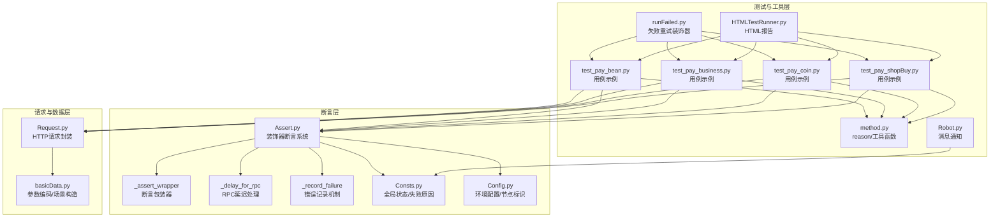
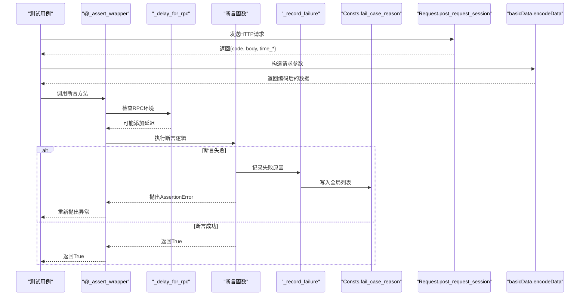
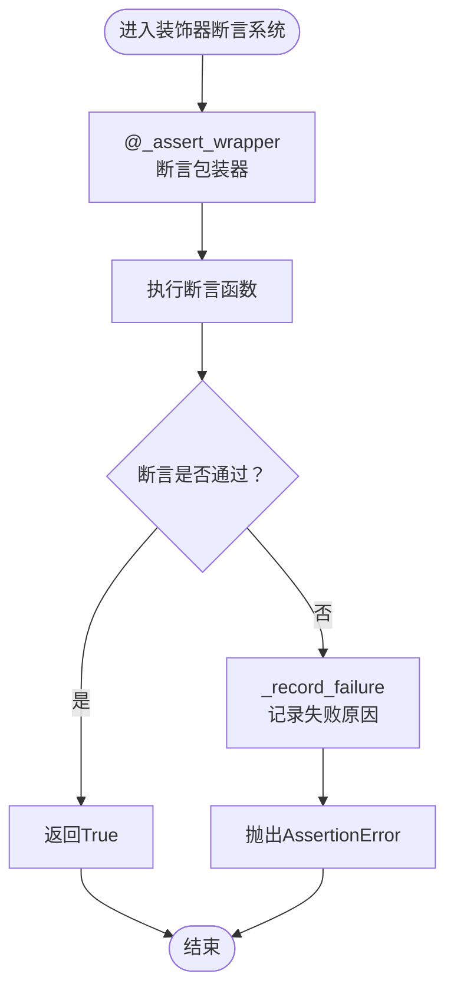
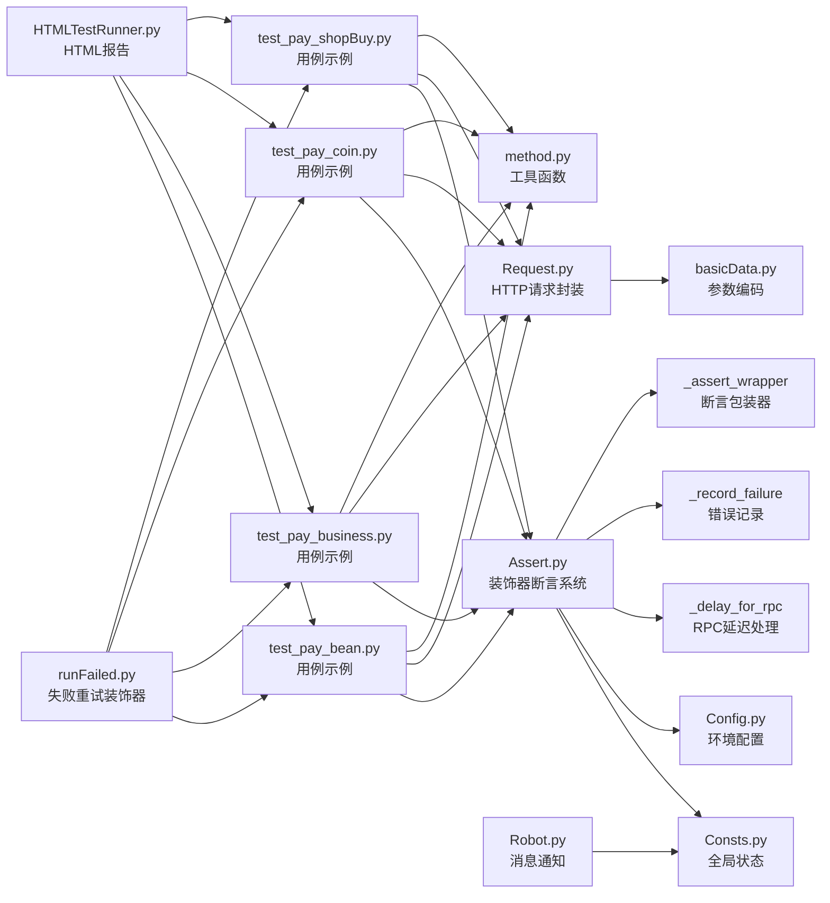

# 断言验证模块

<cite>
**本文引用的文件**
- [common/Assert.py](file://common/Assert.py)
- [common/Consts.py](file://common/Consts.py)
- [common/Config.py](file://common/Config.py)
- [common/Request.py](file://common/Request.py)
- [common/basicData.py](file://common/basicData.py)
- [common/method.py](file://common/method.py)
- [common/runFailed.py](file://common/runFailed.py)
- [common/HTMLTestRunner.py](file://common/HTMLTestRunner.py)
- [common/Robot.py](file://common/Robot.py)
- [case/test_pay_bean.py](file://case/test_pay_bean.py)
- [case/test_pay_business.py](file://case/test_pay_business.py)
- [case/test_pay_coin.py](file://case/test_pay_coin.py)
- [case/test_pay_shopBuy.py](file://case/test_pay_shopBuy.py)
- [README.md](file://README.md)
</cite>

## 更新摘要
**变更内容**
- 从简单断言函数升级为装饰器系统架构
- 增加完整的类型注解支持
- 引入统一的错误记录机制
- 添加RPC延迟处理功能
- 改进异常处理和调试信息输出
- 优化断言失败处理策略

## 目录
1. [简介](#简介)
2. [项目结构](#项目结构)
3. [核心组件](#核心组件)
4. [架构总览](#架构总览)
5. [详细组件分析](#详细组件分析)
6. [依赖分析](#依赖分析)
7. [性能考虑](#性能考虑)
8. [故障排查指南](#故障排查指南)
9. [结论](#结论)
10. [附录](#附录)

## 简介
本文件面向"断言验证模块"的技术文档，系统阐述断言体系的设计理念、实现原理与使用方法。断言模块经过重大重构，从简单的函数调用升级为基于装饰器系统的完整架构，提供统一的断言方法、类型安全的接口、自动化的错误记录和RPC延迟处理机制。模块覆盖HTTP响应断言、数据断言、状态断言与业务逻辑断言，结合测试框架与报告工具形成完整的自动化测试闭环。

## 项目结构
断言验证模块位于 common/Assert.py，围绕该模块构建了以下支撑能力：
- 装饰器系统与断言方法：common/Assert.py（重构后的装饰器架构）
- 请求封装与响应解析：common/Request.py
- 数据编码与参数构造：common/basicData.py
- 断言失败原因收集与全局状态：common/Consts.py、common/Config.py
- 测试用例与断言调用：case/*.py
- 失败重试与断言组合：common/runFailed.py
- 报告与通知：common/HTMLTestRunner.py、common/Robot.py
- 辅助工具与断言理由生成：common/method.py



**图表来源**
- [common/Assert.py:1-167](file://common/Assert.py#L1-L167)
- [common/Consts.py:1-17](file://common/Consts.py#L1-L17)
- [common/Config.py:1-243](file://common/Config.py#L1-L243)
- [common/Request.py:1-86](file://common/Request.py#L1-L86)
- [common/basicData.py:1-200](file://common/basicData.py#L1-L200)
- [common/method.py:1-171](file://common/method.py#L1-L171)
- [common/runFailed.py:1-72](file://common/runFailed.py#L1-L72)
- [common/HTMLTestRunner.py:516-704](file://common/HTMLTestRunner.py#L516-L704)
- [common/Robot.py:1-90](file://common/Robot.py#L1-L90)
- [case/test_pay_bean.py:1-200](file://case/test_pay_bean.py#L1-L200)
- [case/test_pay_business.py:1-200](file://case/test_pay_business.py#L1-L200)
- [case/test_pay_coin.py:1-63](file://case/test_pay_coin.py#L1-L63)
- [case/test_pay_shopBuy.py:1-124](file://case/test_pay_shopBuy.py#L1-L124)

## 核心组件
- **装饰器断言系统**：提供统一的断言包装器`@_assert_wrapper`，自动处理异常捕获、错误记录和返回值处理。
- **类型安全断言方法**：所有断言函数都具备完整的类型注解，支持静态类型检查和IDE智能提示。
- **RPC延迟处理**：针对非阿里云环境自动添加延迟，防止RPC接口结果失败。
- **统一错误记录**：集中记录断言失败原因，便于后续统计与定位。
- **环境配置**：包含服务器节点标识、URL前缀等，用于断言前置的兼容性处理。
- **请求封装**：统一HTTP请求入口，返回标准化响应字典（状态码、body、耗时等）。
- **数据编码**：根据支付场景构造请求参数，确保断言输入的一致性。
- **失败重试**：装饰器式重试，结合断言失败进行清理与重试。
- **报告与通知**：生成HTML报告，失败时推送通知。

**章节来源**
- [common/Assert.py:1-167](file://common/Assert.py#L1-L167)
- [common/Consts.py:1-17](file://common/Consts.py#L1-L17)
- [common/Config.py:1-243](file://common/Config.py#L1-L243)
- [common/Request.py:1-86](file://common/Request.py#L1-L86)
- [common/basicData.py:1-200](file://common/basicData.py#L1-L200)
- [common/runFailed.py:1-72](file://common/runFailed.py#L1-L72)
- [common/HTMLTestRunner.py:516-704](file://common/HTMLTestRunner.py#L516-L704)
- [common/Robot.py:1-90](file://common/Robot.py#L1-L90)

## 架构总览
断言验证模块采用"装饰器断言系统 + 类型注解 + RPC延迟处理 + 统一错误记录"的分层设计。测试用例通过统一的请求封装与数据编码构造输入，调用装饰器保护的断言方法进行验证；断言失败时自动记录失败原因并抛出异常，配合失败重试与报告工具完成闭环。



**图表来源**
- [common/Assert.py:31-43](file://common/Assert.py#L31-L43)
- [common/Assert.py:20-24](file://common/Assert.py#L20-L24)
- [common/Assert.py:26-28](file://common/Assert.py#L26-L28)
- [common/Request.py:49-73](file://common/Request.py#L49-L73)
- [common/basicData.py:8-200](file://common/basicData.py#L8-L200)

## 详细组件分析

### 装饰器系统与断言包装器
断言模块的核心是`@_assert_wrapper`装饰器，它提供了统一的异常处理和错误记录机制：

- **异常捕获**：自动捕获断言函数中的异常，区分AssertionError和普通异常
- **错误记录**：将断言失败原因统一记录到全局状态列表
- **返回值处理**：确保断言函数返回布尔值，支持链式调用
- **函数元数据保留**：使用`@wraps`装饰器保留原函数的元信息

**章节来源**
- [common/Assert.py:31-43](file://common/Assert.py#L31-L43)

### RPC延迟处理机制
针对RPC接口的特殊性，断言模块提供了智能延迟处理：

- **环境检测**：通过`platform.node()`检测当前运行环境
- **条件延迟**：仅在非阿里云环境下添加0.6秒延迟
- **网络稳定性**：避免RPC接口结果的误判，提升测试稳定性

**章节来源**
- [common/Assert.py:16-24](file://common/Assert.py#L16-L24)
- [common/Config.py:55-64](file://common/Config.py#L55-L64)

### 统一错误记录系统
所有断言失败都会通过`_record_failure`函数进行统一记录：

- **失败原因收集**：将详细的失败信息写入`Consts.fail_case_reason`
- **异常类型区分**：区分断言失败和程序异常，提供不同的错误信息
- **调试信息丰富**：包含断言函数名、期望值、实际值等关键信息

**章节来源**
- [common/Assert.py:26-28](file://common/Assert.py#L26-L28)
- [common/Consts.py:7-8](file://common/Consts.py#L7-L8)

### 断言方法分类与实现机制
重构后的断言系统保持了原有的断言类型，但增强了功能和类型安全性：

#### HTTP响应断言
- **assert_code**：断言HTTP状态码，自动处理RPC延迟和错误记录
- **类型注解**：`actual_code: int, expected_code: int = 200` → `bool`
- **异常处理**：抛出`AssertionError`并记录详细失败原因

#### 数据断言
- **assert_equal**：断言两个值相等，支持任意类型的比较
- **assert_len**：断言实际长度不小于期望长度
- **类型安全**：完整的类型注解确保编译时类型检查

#### 状态断言
- **assert_body**：从响应体中取出指定字段并与期望值比较
- **自定义错误**：支持传入自定义失败原因描述

#### 文本断言
- **assert_in_text**：验证JSON响应中是否包含指定文本
- **序列化处理**：自动将响应体序列化为字符串进行比较

#### 区间断言
- **assert_between**：断言数值落在闭区间内
- **类型转换**：自动将输入转换为整数类型

**章节来源**
- [common/Assert.py:46-167](file://common/Assert.py#L46-L167)



**图表来源**
- [common/Assert.py:31-43](file://common/Assert.py#L31-L43)
- [common/Assert.py:26-28](file://common/Assert.py#L26-L28)

### 断言失败处理策略
重构后的断言系统提供了更加完善的失败处理机制：

#### 错误信息收集
- **统一格式**：所有断言失败都采用统一的错误信息格式
- **详细描述**：包含实际值、期望值、断言函数名等关键信息
- **全局记录**：自动写入`Consts.fail_case_reason`列表

#### 堆栈跟踪与调试信息
- **异常捕获**：装饰器自动捕获断言函数中的异常
- **错误分类**：区分断言失败和程序异常，提供不同的处理策略
- **调试支持**：保留原始函数的元信息，便于调试

#### 通知与报告
- **失败重试**：结合`@Retry`装饰器进行自动重试
- **报告生成**：通过HTMLTestRunner生成详细的测试报告
- **消息通知**：失败时通过机器人推送通知

**章节来源**
- [common/Assert.py:38-42](file://common/Assert.py#L38-L42)
- [common/Consts.py:7-8](file://common/Consts.py#L7-L8)
- [common/runFailed.py:38-58](file://common/runFailed.py#L38-L58)
- [common/Robot.py:46-67](file://common/Robot.py#L46-L67)
- [common/HTMLTestRunner.py:516-704](file://common/HTMLTestRunner.py#L516-L704)

### 断言使用示例
重构后的断言系统保持了原有的使用方式，但增强了类型安全性和错误处理：

#### 验证API响应
```python
# 在用例中发送请求后，使用装饰器保护的断言方法
res = post_request_session(config.pay_url, data)
assert_code(res['code'])  # 自动处理RPC延迟和错误记录
assert_body(res['body'], 'success', 1, format_reason(des, res))
```

#### 检查数据完整性
```python
# 使用类型安全的断言方法
assert_equal(mysql.selectUserInfoSql('bean', config.payUid), 0)
assert_len(result_list, 5)  # 断言结果至少包含5个元素
```

#### 确认业务流程正确性
```python
# 结合reason工具函数生成断言失败原因
reason = format_reason('金豆不足场景', res)
assert_body(res['body'], 'msg', '金豆不足', reason)
```

**章节来源**
- [case/test_pay_bean.py:66-77](file://case/test_pay_bean.py#L66-L77)
- [case/test_pay_business.py:70-85](file://case/test_pay_business.py#L70-L85)
- [common/method.py:115-122](file://common/method.py#L115-L122)

### 自定义断言开发方法
重构后的断言系统提供了更加灵活的扩展方式：

#### 扩展点
- **装饰器保护**：新断言方法必须使用`@_assert_wrapper`装饰器
- **类型注解**：遵循Python类型注解规范，提供完整的类型信息
- **错误处理**：遵循统一的错误记录机制

#### 组合策略
- **链式调用**：多个断言方法可以链式调用，提高代码可读性
- **条件断言**：结合`assert_len`等条件断言，实现复杂的验证逻辑
- **自定义错误**：支持传入自定义错误描述，便于问题定位

**章节来源**
- [common/Assert.py:31-43](file://common/Assert.py#L31-L43)
- [common/Assert.py:86-102](file://common/Assert.py#L86-L102)
- [case/test_pay_bean.py:110-118](file://case/test_pay_bean.py#L110-L118)

### 断言性能优化、批量断言与条件断言
重构后的断言系统在保持原有功能的基础上，进一步优化了性能和可用性：

#### 性能优化
- **RPC延迟智能处理**：仅在必要时添加延迟，避免不必要的等待
- **类型检查优化**：利用类型注解减少运行时类型检查开销
- **异常处理优化**：装饰器系统减少了重复的异常处理代码

#### 批量断言
- **循环验证**：支持对多个字段或多个用户进行批量验证
- **条件断言**：使用`assert_len`对最小阈值进行断言
- **组合断言**：多个断言方法可以组合使用，提高验证效率

#### 条件断言
- **动态断言**：根据业务场景动态选择断言方法
- **灵活配置**：支持传入自定义参数，适应不同的验证需求

**章节来源**
- [common/Assert.py:16-24](file://common/Assert.py#L16-L24)
- [common/Assert.py:67-83](file://common/Assert.py#L67-L83)
- [case/test_pay_business.py:123-127](file://case/test_pay_business.py#L123-L127)

### 断言与测试框架的集成方式与最佳实践
重构后的断言系统与测试框架的集成更加紧密和高效：

#### 与unittest集成
- **装饰器支持**：`@Retry`装饰器支持类级别的批量应用
- **生命周期管理**：在`setUp`/`tearDown`中进行前置清理与后置恢复
- **异常处理**：装饰器自动处理断言异常，简化测试代码

#### 与pytest集成
- **兼容性**：保持与pytest的兼容性，支持现有的测试结构
- **扩展性**：可以轻松扩展新的断言类型和验证逻辑

#### 报告与通知
- **详细报告**：通过HTMLTestRunner生成包含断言详情的测试报告
- **实时通知**：失败时通过机器人推送详细的错误信息
- **调试支持**：报告包含完整的堆栈跟踪和调试信息

**章节来源**
- [common/runFailed.py:22-72](file://common/runFailed.py#L22-L72)
- [case/test_pay_bean.py:12-26](file://case/test_pay_bean.py#L12-L26)
- [common/HTMLTestRunner.py:516-704](file://common/HTMLTestRunner.py#L516-L704)
- [common/Robot.py:46-67](file://common/Robot.py#L46-L67)

## 依赖分析
重构后的断言模块与各组件之间的依赖关系更加清晰和模块化：



**图表来源**
- [common/Assert.py:1-167](file://common/Assert.py#L1-L167)
- [common/Consts.py:1-17](file://common/Consts.py#L1-L17)
- [common/Config.py:1-243](file://common/Config.py#L1-L243)
- [common/runFailed.py:1-72](file://common/runFailed.py#L1-L72)
- [common/Request.py:1-86](file://common/Request.py#L1-L86)
- [common/basicData.py:1-200](file://common/basicData.py#L1-L200)
- [common/method.py:1-171](file://common/method.py#L1-L171)
- [common/Robot.py:1-90](file://common/Robot.py#L1-L90)

## 性能考虑
重构后的断言系统在性能方面进行了多项优化：

#### RPC延迟规避
- **智能延迟**：仅在非阿里云环境下添加0.6秒延迟
- **条件判断**：通过`platform.node()`精确检测运行环境
- **性能影响**：避免不必要的等待，提升测试执行效率

#### 类型注解优化
- **静态检查**：利用类型注解在开发阶段发现潜在问题
- **IDE支持**：提供更好的代码补全和错误提示
- **运行时开销**：类型注解在运行时不产生额外开销

#### 异常处理优化
- **装饰器缓存**：`@_assert_wrapper`装饰器只创建一次
- **异常分类**：区分断言失败和程序异常，避免重复处理
- **内存管理**：统一的错误记录机制减少内存泄漏风险

**章节来源**
- [common/Assert.py:16-24](file://common/Assert.py#L16-L24)
- [common/Assert.py:31-43](file://common/Assert.py#L31-L43)
- [common/Request.py:49-73](file://common/Request.py#L49-L73)

## 故障排查指南
重构后的断言系统提供了更加完善的故障排查能力：

#### 断言失败原因定位
- **详细日志**：装饰器自动记录详细的断言失败信息
- **全局列表**：通过`Consts.fail_case_reason`查看所有失败原因
- **错误格式**：统一的错误格式便于快速识别问题类型

#### 堆栈与重试日志
- **异常捕获**：装饰器自动捕获断言函数中的异常堆栈
- **重试机制**：结合`@Retry`装饰器进行自动重试和清理
- **调试信息**：保留原始函数的元信息，便于问题定位

#### 报告与通知
- **HTML报告**：详细的测试结果和断言信息
- **机器人通知**：失败时推送包含完整错误信息的通知
- **调试支持**：报告包含完整的堆栈跟踪和上下文信息

**章节来源**
- [common/Assert.py:38-42](file://common/Assert.py#L38-L42)
- [common/Consts.py:7-8](file://common/Consts.py#L7-L8)
- [common/runFailed.py:38-58](file://common/runFailed.py#L38-L58)
- [common/HTMLTestRunner.py:664-686](file://common/HTMLTestRunner.py#L664-L686)
- [common/Robot.py:46-67](file://common/Robot.py#L46-L67)

## 结论
断言验证模块经过重大重构，从简单的函数调用升级为基于装饰器系统的完整架构。新系统提供了类型安全的接口、自动化的错误记录、智能的RPC延迟处理和统一的异常管理机制。通过装饰器系统，断言模块实现了更好的代码复用、更强的错误处理能力和更完善的调试支持。

重构后的断言系统保持了原有的断言类型和使用方式，同时大幅提升了代码质量和可维护性。建议在新增断言时遵循装饰器模式，充分利用类型注解和错误记录机制，保持断言系统的统一性和一致性。

## 附录
- **断言方法速查**
  - `assert_code`：HTTP状态码断言（装饰器保护）
  - `assert_equal`：相等断言（类型安全）
  - `assert_len`：长度断言（条件断言）
  - `assert_body`：响应体字段断言（自定义错误）
  - `assert_in_text`：文本包含断言（JSON序列化）
  - `assert_between`：区间断言（数值范围）

- **关键路径参考**
  - 装饰器断言系统：[common/Assert.py:1-167](file://common/Assert.py#L1-L167)
  - 请求封装：[common/Request.py:1-86](file://common/Request.py#L1-L86)
  - 数据编码：[common/basicData.py:1-200](file://common/basicData.py#L1-L200)
  - 失败重试：[common/runFailed.py:1-72](file://common/runFailed.py#L1-L72)
  - 报告生成：[common/HTMLTestRunner.py:516-704](file://common/HTMLTestRunner.py#L516-L704)
  - 通知推送：[common/Robot.py:46-67](file://common/Robot.py#L46-L67)

- **重构特性总结**
  - 装饰器系统：`@_assert_wrapper`统一异常处理
  - 类型注解：完整的类型安全接口
  - 错误记录：统一的失败原因收集机制
  - RPC处理：智能的延迟处理功能
  - 性能优化：装饰器缓存和异常分类处理