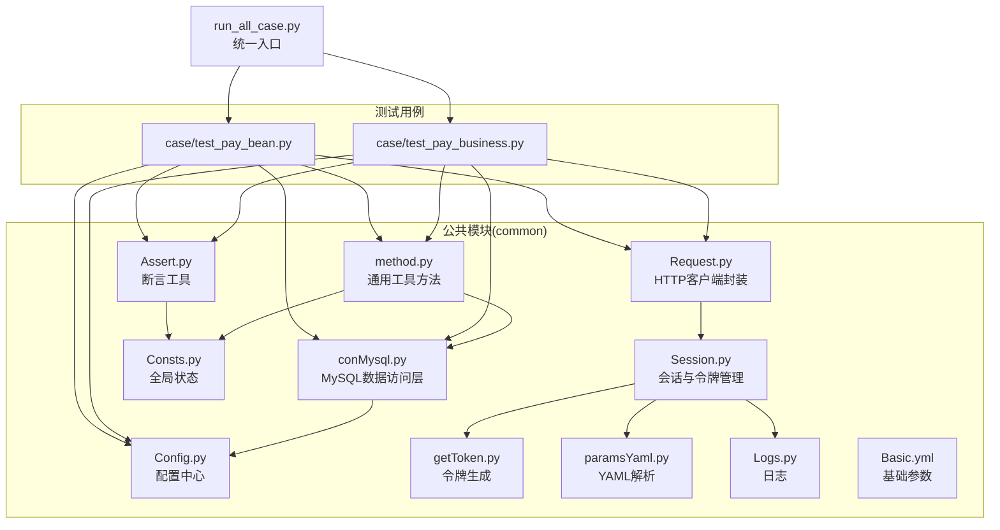
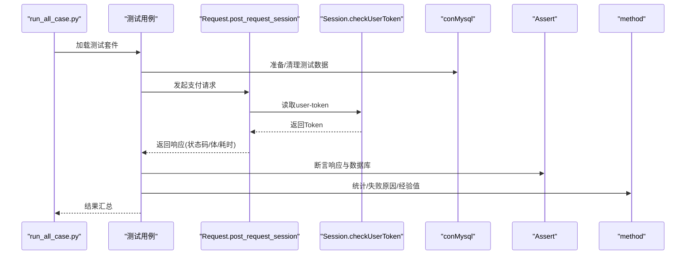
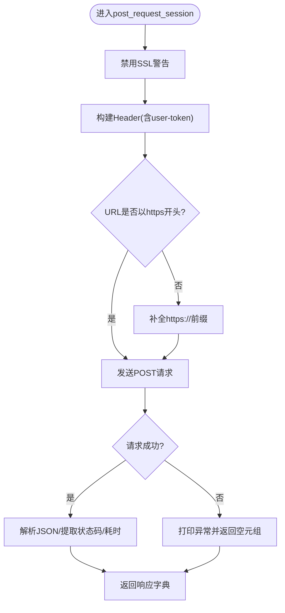
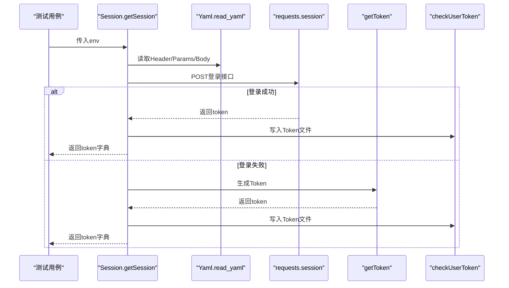
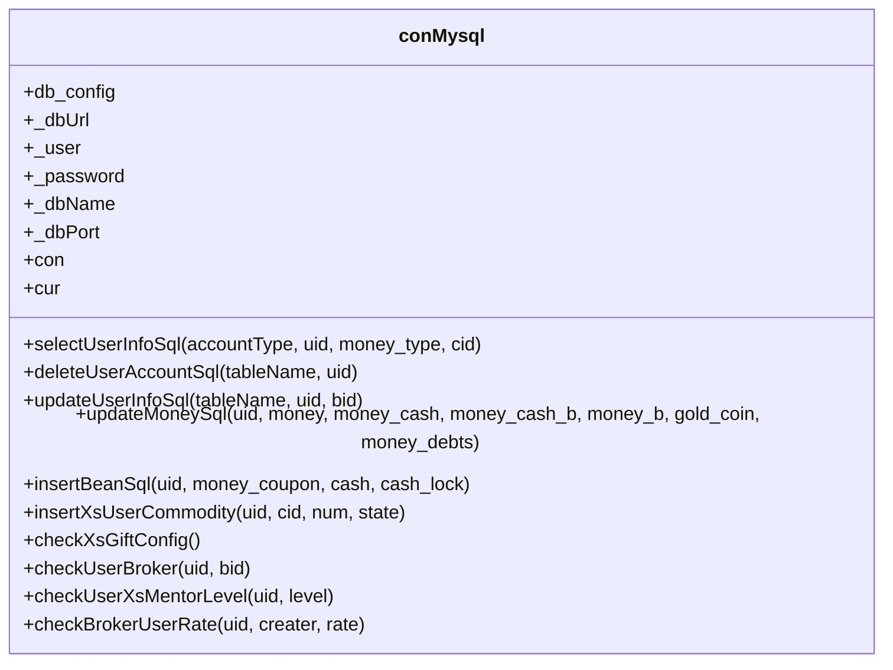
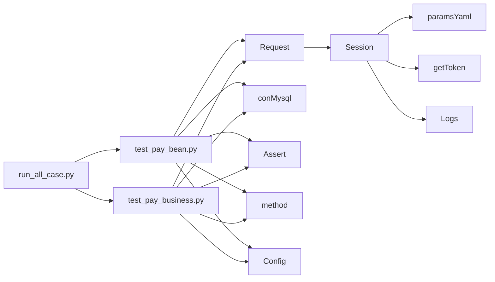

# 核心模块

<cite>
**本文引用的文件**
- [Config.py](file://common/Config.py)
- [Request.py](file://common/Request.py)
- [Session.py](file://common/Session.py)
- [conMysql.py](file://common/conMysql.py)
- [Assert.py](file://common/Assert.py)
- [method.py](file://common/method.py)
- [Consts.py](file://common/Consts.py)
- [getToken.py](file://common/getToken.py)
- [paramsYaml.py](file://common/paramsYaml.py)
- [Logs.py](file://common/Logs.py)
- [Basic.yml](file://common/Basic.yml)
- [run_all_case.py](file://run_all_case.py)
- [test_pay_bean.py](file://case/test_pay_bean.py)
- [test_pay_business.py](file://case/test_pay_business.py)
</cite>

## 目录
1. [简介](#简介)
2. [项目结构](#项目结构)
3. [核心组件](#核心组件)
4. [架构总览](#架构总览)
5. [详细组件分析](#详细组件分析)
6. [依赖关系分析](#依赖关系分析)
7. [性能考量](#性能考量)
8. [故障排查指南](#故障排查指南)
9. [结论](#结论)
10. [附录](#附录)

## 简介
本技术文档聚焦于QA支付测试自动化项目的核心模块，系统性阐述Config配置管理、Request请求处理、Session会话管理、conMysql数据库访问、Assert断言与method工具方法等模块的设计理念、实现原理与使用方式。文档同时说明模块间的依赖与协作关系，给出典型使用场景与扩展点，并提供性能优化建议与排障指引，帮助读者快速理解并高效扩展该自动化体系。

## 项目结构
项目采用“按职责分层”的组织方式：
- common：核心公共模块（配置、请求、会话、数据库、断言、工具、日志、YAML解析等）
- case/caseOversea/caseSlp：各应用/区域的测试用例集合
- run_all_case.py：统一入口，负责根据运行节点选择应用并执行测试套件
- others：环境与辅助脚本（如PHP配置、环境切换等）

图表来源
- [run_all_case.py:126-147](file://run_all_case.py#L126-L147)
- [test_pay_bean.py:1-277](file://case/test_pay_bean.py#L1-L277)
- [test_pay_business.py:1-189](file://case/test_pay_business.py#L1-L189)

章节来源
- [run_all_case.py:126-147](file://run_all_case.py#L126-L147)
- [test_pay_bean.py:1-277](file://case/test_pay_bean.py#L1-L277)
- [test_pay_business.py:1-189](file://case/test_pay_business.py#L1-L189)

## 核心组件
本节对各核心模块进行深入剖析，涵盖职责边界、关键接口、数据结构、错误处理与性能特征。

- Config配置管理
  - 设计理念：集中式配置中心，提供应用信息、代码路径、服务器标识、测试域名、用户角色、礼物映射、房间类型、支付URL等常量与默认值，支持多应用/多环境配置。
  - 关键点：通过字典维护多应用域名、用户UID映射、礼物ID映射、房间类型映射；提供内网支付接口URL与登录URL；通过BASE_PATH定位资源。
  - 使用场景：测试用例直接引用配置常量，避免硬编码；统一管理不同应用的URL与用户数据。

- Request请求处理
  - 设计理念：对requests进行轻量封装，统一Header、Token注入、HTTPS强制、超时控制、响应解析与耗时统计。
  - 关键点：post_request_session函数统一POST请求流程，自动拼接HTTPS前缀、注入user-token、解析JSON、记录状态码与耗时。
  - 使用场景：所有支付接口调用均通过该封装发起，确保一致性与可观测性。

- Session会话管理
  - 设计理念：多环境登录策略，优先使用YAML配置的登录参数与Header，失败时回退到数据库查询与令牌生成器生成的Token。
  - 关键点：getSession根据环境选择登录参数；checkUserToken持久化/读取Token；支持dev、rush、PT、SLP等应用环境；YAML解析来自paramsYaml。
  - 使用场景：测试前置阶段获取有效Token并写入本地文件，供后续请求复用。

- conMysql数据库操作
  - 设计理念：围绕MySQL的增删改查与业务校验，提供账户余额、背包、公会、房间、守护关系等查询与更新方法。
  - 关键点：静态方法聚合SQL操作；统一autocommit与commit/rollback；提供checkXsGiftConfig、updateMoneySql、insertBeanSql等常用业务方法。
  - 使用场景：用例前后置清理与断言数据校验。

- Assert断言模块
  - 设计理念：提供多种断言方法，覆盖状态码、长度、相等、文本包含、字段值断言与区间断言，并统一记录失败原因。
  - 关键点：断言失败时写入fail_case_reason，便于报告与告警；部分断言考虑跨平台差异（如RPC延迟补偿）。
  - 使用场景：用例中对HTTP响应与数据库结果进行断言。

- method工具方法
  - 设计理念：提供通用工具函数，包括JSON键遍历、结果统计、失败原因构建、VIP经验值计算、路径检查等。
  - 关键点：getValue用于统计成功/失败次数；reason系列用于失败原因格式化；checkUserVipExp结合数据库查询与等级映射计算经验值。
  - 使用场景：用例中数据准备、清理、断言辅助与统计。

章节来源
- [Config.py:6-133](file://common/Config.py#L6-L133)
- [Request.py:17-59](file://common/Request.py#L17-L59)
- [Session.py:19-200](file://common/Session.py#L19-L200)
- [conMysql.py:8-530](file://common/conMysql.py#L8-L530)
- [Assert.py:11-96](file://common/Assert.py#L11-L96)
- [method.py:11-171](file://common/method.py#L11-L171)

## 架构总览
整体架构以“配置驱动 + 请求封装 + 会话管理 + 数据访问 + 断言与工具”为核心，测试用例通过统一入口加载并执行，形成闭环。

图表来源
- [run_all_case.py:126-147](file://run_all_case.py#L126-L147)
- [test_pay_bean.py:67-108](file://case/test_pay_bean.py#L67-L108)
- [Request.py:17-59](file://common/Request.py#L17-L59)
- [Session.py:168-183](file://common/Session.py#L168-L183)
- [Assert.py:11-96](file://common/Assert.py#L11-L96)
- [method.py:94-128](file://common/method.py#L94-L128)

## 详细组件分析

### Config配置管理模块
- 设计要点
  - 多应用域名映射：appInfo维护bb_dev、pt_ali_dev/main、starify、slp、rush等。
  - 代码路径与分支：codeInfo记录PHP/Go路径与分支，便于自动化拉取与报告。
  - 应用名称映射：appName将数字或中文映射到应用标识，便于入口选择。
  - 服务器标识：linux_node区分不同CI节点。
  - 测试域名与支付URL：pt_host、pay_url、slp_pay_url等。
  - 用户与礼物映射：bb_user、live_role、giftId、pt_user、pt_room、pt_giftId等。
  - 分成比例：rate用于商业房分成计算。
- 使用方式
  - 在测试用例中直接引用config.xxx常量，避免硬编码。
  - 在入口脚本中根据platform.node()与appName选择用例目录与分支。
- 扩展点
  - 新增应用：在appInfo与appName新增映射；在codeInfo补充路径与分支。
  - 新增用户/礼物：在对应字典中添加键值。
- 性能与可靠性
  - 常量读取开销极低；注意避免在热路径频繁重复解析YAML。

章节来源
- [Config.py:6-133](file://common/Config.py#L6-L133)
- [run_all_case.py:150-159](file://run_all_case.py#L150-L159)

### Request请求处理模块
- 设计要点
  - 统一Header：固定User-Agent、Content-Type、Connection等。
  - Token注入：从Session读取user-token，保证请求合法性。
  - HTTPS强制：自动补齐https://前缀，规避协议问题。
  - 响应解析：捕获异常，解析JSON，记录状态码与耗时。
- 使用方式
  - 在用例中调用post_request_session(url, data, tokenName)发起请求。
  - 通过返回字典中的code/body/time_consuming/time_total进行断言与统计。
- 扩展点
  - 支持GET/PUT/DELETE：可在同一封装内扩展方法签名。
  - 超时与重试：可引入requests超时参数与指数退避策略。
- 性能与可靠性
  - urllib3禁用警告减少噪声；verify=False便于内网测试，生产需谨慎。
  - 响应耗时可用于性能监控与慢请求告警。

图表来源
- [Request.py:17-59](file://common/Request.py#L17-L59)

章节来源
- [Request.py:17-59](file://common/Request.py#L17-L59)

### Session会话管理模块
- 设计要点
  - 多环境登录：dev/release/rush/PT/SLP等环境分别读取Basic.yml中的Header、Params与Body。
  - 回退策略：默认方案失败时，通过conMysql与getToken生成Token并写入本地文件。
  - Token持久化：checkUserToken/checkUserToken_slp按应用与UID写入/读取Token文件。
  - YAML解析：Yaml.read_yaml根据平台节点选择SafeLoader，兼容不同环境。
- 使用方式
  - 在测试前置阶段调用getSession(env)获取token并写入文件。
  - Request模块通过Session.checkUserToken读取token注入Header。
- 扩展点
  - 新增环境：在getSession中新增elif分支，读取对应YAML参数。
  - 自定义签名：可参考被注释掉的starify实现，扩展签名参数与时间戳。
- 性能与可靠性
  - 登录接口可能不稳定，建议在失败时快速回退至Token生成器。
  - Token文件读写需注意并发安全与权限。

图表来源
- [Session.py:19-200](file://common/Session.py#L19-L200)
- [paramsYaml.py:8-32](file://common/paramsYaml.py#L8-L32)
- [getToken.py:8-93](file://common/getToken.py#L8-L93)

章节来源
- [Session.py:19-200](file://common/Session.py#L19-L200)
- [paramsYaml.py:8-32](file://common/paramsYaml.py#L8-L32)
- [getToken.py:8-93](file://common/getToken.py#L8-L93)

### conMysql数据库操作模块
- 设计要点
  - 连接初始化：在类变量中完成连接、选择数据库、ping与游标初始化。
  - 查询方法：selectUserInfoSql按accountType返回不同字段或聚合值。
  - 更新/删除：deleteUserAccountSql、updateUserInfoSql、updateMoneySql等。
  - 业务辅助：checkXsGiftConfig、insertBeanSql、insertXsUserCommodity、checkUserBroker等。
- 使用方式
  - 用例setUp/tearDown中调用清理/插入/更新方法。
  - 断言阶段通过selectUserInfoSql获取期望值并与实际结果对比。
- 扩展点
  - 新增查询：在selectUserInfoSql中新增accountType分支。
  - 新增业务：在类中新增对应SQL方法，遵循统一commit/rollback模式。
- 性能与可靠性
  - autocommit=True简化事务管理；注意批量操作时的sleep与锁竞争。
  - SQL异常统一捕获并回滚，避免脏数据。

图表来源
- [conMysql.py:8-530](file://common/conMysql.py#L8-L530)

章节来源
- [conMysql.py:8-530](file://common/conMysql.py#L8-L530)

### Assert断言模块
- 设计要点
  - assert_code：断言HTTP状态码，默认期望200。
  - assert_len：断言长度下限。
  - assert_equal：断言相等。
  - assert_in_text：断言响应体包含指定文本。
  - assert_body：断言响应体某字段等于期望值。
  - assert_between：断言数值在区间内。
  - 失败记录：断言失败时将原因追加到fail_case_reason，便于报告。
- 使用方式
  - 在用例中链式调用多个断言，确保响应与数据库状态符合预期。
- 扩展点
  - 可新增更细粒度的断言（如JSON Schema校验）。
  - 可引入断言失败重试策略（配合Retry装饰器）。
- 性能与可靠性
  - 断言失败即抛出异常，确保用例快速失败；RPC延迟补偿减少误判。

章节来源
- [Assert.py:11-96](file://common/Assert.py#L11-L96)
- [Consts.py:4-17](file://common/Consts.py#L4-L17)

### method工具方法模块
- 设计要点
  - dictToList/dictToListSlack：将结果转为Slack/Markdown格式。
  - isExtend/getKeys：递归遍历JSON键，判断字段是否存在。
  - getValue/reason/reason_slp：统计成功/失败、格式化失败原因。
  - checkPath：检查代码路径是否存在，异常则告警。
  - getUserTitle/checkUserVipExp：根据等级映射VIP倍率，计算经验值。
- 使用方式
  - 用例中调用reason构建失败原因，getValue统计结果，checkUserVipExp计算期望值。
- 扩展点
  - 可新增更多业务映射与计算方法。
  - 可集成更多第三方通知渠道（如钉钉、企业微信）。
- 性能与可靠性
  - JSON遍历与字符串拼接开销较低；注意避免在高频路径重复构建长字符串。

章节来源
- [method.py:11-171](file://common/method.py#L11-L171)

## 依赖关系分析
- 模块耦合
  - Request依赖Session读取Token；Session依赖Yaml与getToken；Logs提供日志能力。
  - 测试用例依赖Config、Request、conMysql、Assert、method；run_all_case统一调度。
- 外部依赖
  - requests、urllib3、pymysql、yaml、logging、platform、os、time等。
- 循环依赖
  - 当前模块间无循环导入；断言与工具通过Consts共享全局状态。

图表来源
- [Request.py:11-14](file://common/Request.py#L11-L14)
- [Session.py:8-10](file://common/Session.py#L8-L10)
- [paramsYaml.py:3-5](file://common/paramsYaml.py#L3-L5)
- [getToken.py:1-7](file://common/getToken.py#L1-L7)
- [Logs.py:1-6](file://common/Logs.py#L1-L6)
- [test_pay_bean.py:1-10](file://case/test_pay_bean.py#L1-L10)
- [test_pay_business.py:1-10](file://case/test_pay_business.py#L1-L10)
- [run_all_case.py:1-10](file://run_all_case.py#L1-L10)

章节来源
- [Request.py:11-14](file://common/Request.py#L11-L14)
- [Session.py:8-10](file://common/Session.py#L8-L10)
- [paramsYaml.py:3-5](file://common/paramsYaml.py#L3-L5)
- [getToken.py:1-7](file://common/getToken.py#L1-L7)
- [Logs.py:1-6](file://common/Logs.py#L1-L6)
- [test_pay_bean.py:1-10](file://case/test_pay_bean.py#L1-L10)
- [test_pay_business.py:1-10](file://case/test_pay_business.py#L1-L10)
- [run_all_case.py:1-10](file://run_all_case.py#L1-L10)

## 性能考量
- 请求层
  - 合理设置超时与重试，避免阻塞；对慢接口单独统计耗时。
  - 避免在Header中频繁变更，减少不必要的网络往返。
- 会话层
  - Token缓存与复用，减少重复登录；并发场景注意Token文件读写同步。
- 数据层
  - 大批量更新/删除时使用事务与批量提交，减少锁竞争。
  - 对热点查询建立索引或缓存中间态数据。
- 断言与工具
  - 断言失败快速失败，避免冗余计算；日志按需输出，避免IO瓶颈。
- 并发执行
  - 使用统一入口run_all_case并行执行用例，注意数据库与文件系统的并发安全。

## 故障排查指南
- 请求失败
  - 检查URL协议与Host是否正确；确认Token是否有效；查看Response JSON与状态码。
  - 参考：[Request.py:17-59](file://common/Request.py#L17-L59)
- 会话异常
  - 查看getSession日志与YAML参数；确认登录接口可用性；必要时回退到getToken生成Token。
  - 参考：[Session.py:19-200](file://common/Session.py#L19-L200)、[paramsYaml.py:8-32](file://common/paramsYaml.py#L8-L32)、[getToken.py:8-93](file://common/getToken.py#L8-L93)
- 数据库异常
  - 检查SQL执行日志与异常回滚；确认连接参数与目标库；核对表结构与索引。
  - 参考：[conMysql.py:8-530](file://common/conMysql.py#L8-L530)
- 断言失败
  - 查看fail_case_reason与具体字段值；核对期望值计算逻辑（如VIP经验值）。
  - 参考：[Assert.py:11-96](file://common/Assert.py#L11-L96)、[method.py:94-171](file://common/method.py#L94-L171)
- 日志与报告
  - 使用Logs模块输出到文件与控制台；关注caseResult.log与failCase.log。
  - 参考：[Logs.py:8-48](file://common/Logs.py#L8-L48)

章节来源
- [Request.py:17-59](file://common/Request.py#L17-L59)
- [Session.py:19-200](file://common/Session.py#L19-L200)
- [paramsYaml.py:8-32](file://common/paramsYaml.py#L8-L32)
- [getToken.py:8-93](file://common/getToken.py#L8-L93)
- [conMysql.py:8-530](file://common/conMysql.py#L8-L530)
- [Assert.py:11-96](file://common/Assert.py#L11-L96)
- [method.py:94-171](file://common/method.py#L94-L171)
- [Logs.py:8-48](file://common/Logs.py#L8-L48)

## 结论
本项目通过清晰的模块划分与职责边界，实现了配置驱动、请求封装、会话管理、数据访问、断言与工具的完整闭环。Config提供统一配置，Request与Session保障请求合法性与稳定性，conMysql支撑业务数据校验，Assert与method提升断言与统计能力。建议在后续迭代中进一步完善超时与重试、并发安全与日志分级，以增强系统的健壮性与可维护性。

## 附录
- 使用示例（路径引用）
  - 统一入口执行测试套件：[run_all_case.py:126-147](file://run_all_case.py#L126-L147)
  - 金豆支付用例示例：[test_pay_bean.py:47-171](file://case/test_pay_bean.py#L47-L171)
  - 商业房支付用例示例：[test_pay_business.py:18-98](file://case/test_pay_business.py#L18-L98)
- 配置与参数
  - 基础参数YAML：[Basic.yml:1-52](file://common/Basic.yml#L1-L52)
  - 全局状态：[Consts.py:4-17](file://common/Consts.py#L4-L17)