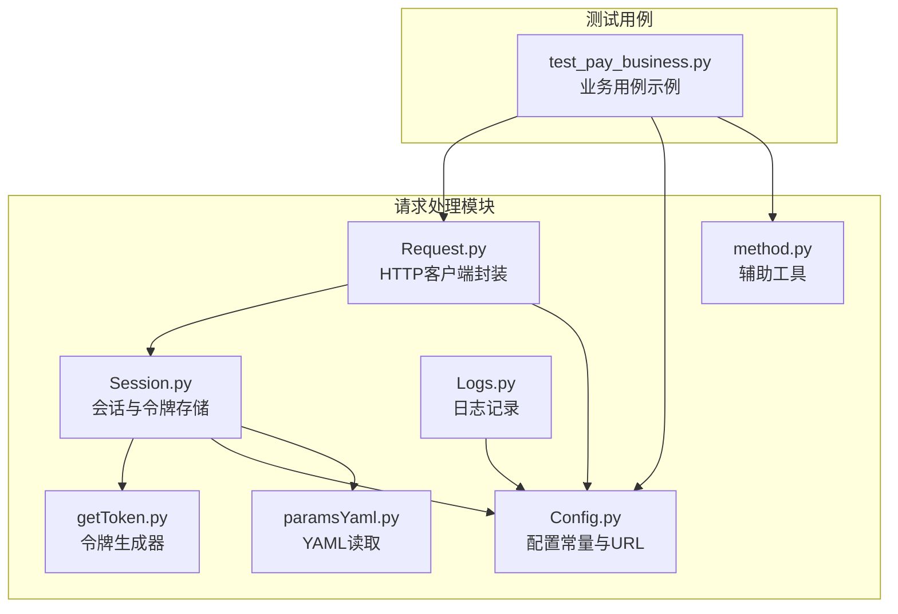
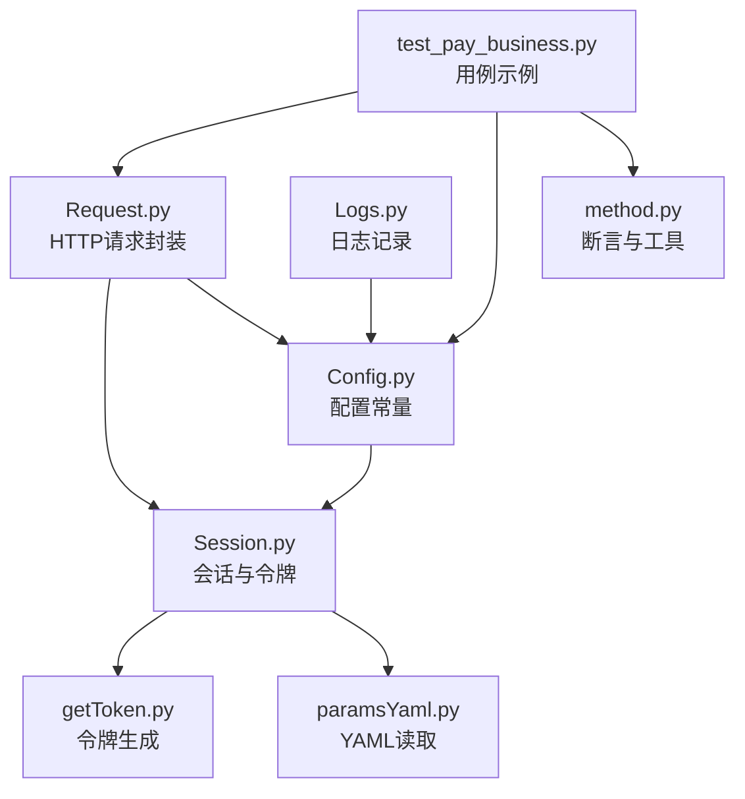
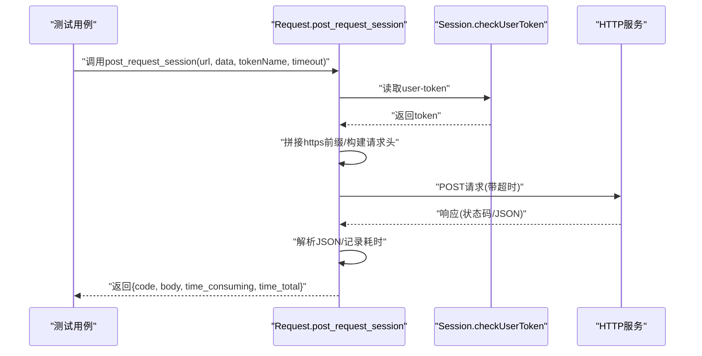
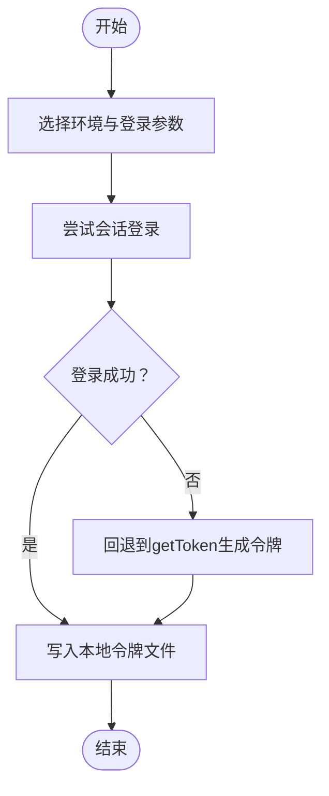
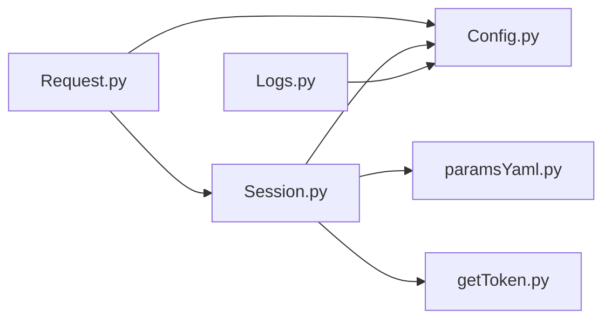

# 请求处理模块

<cite>
**本文引用的文件**
- [common/Request.py](file://common/Request.py)
- [common/getToken.py](file://common/getToken.py)
- [common/Session.py](file://common/Session.py)
- [common/Config.py](file://common/Config.py)
- [common/Logs.py](file://common/Logs.py)
- [common/paramsYaml.py](file://common/paramsYaml.py)
- [common/method.py](file://common/method.py)
- [case/test_pay_business.py](file://case/test_pay_business.py)
- [README.md](file://README.md)
- [requirements.txt](file://requirements.txt)
</cite>

## 更新摘要
**变更内容**
- 增强HTTP客户端封装的类型注解系统
- 新增DEFAULT_TIMEOUT配置常量，提供统一的超时控制
- 改进异常处理机制，分别捕获超时错误、请求异常和意外错误
- 优化响应解析和错误返回结构
- 增强请求头管理和URL处理逻辑

## 目录
1. [简介](#简介)
2. [项目结构](#项目结构)
3. [核心组件](#核心组件)
4. [架构总览](#架构总览)
5. [详细组件分析](#详细组件分析)
6. [依赖分析](#依赖分析)
7. [性能考量](#性能考量)
8. [故障排查指南](#故障排查指南)
9. [结论](#结论)
10. [附录](#附录)

## 简介
本技术文档围绕请求处理模块展开，系统性阐述HTTP客户端封装的设计与实现，涵盖请求方法封装（GET、POST、PUT等）、请求头管理、URL构建与参数处理；深入解析getToken模块的令牌生成与刷新机制（含不同平台的认证方式、令牌存储与过期策略）；说明请求中间件的设计思路（请求拦截、响应处理、错误重试与超时控制）；提供使用示例与最佳实践，覆盖同步/异步请求、请求队列与并发控制、请求日志记录、性能监控与安全注意事项，并给出与其他模块的集成方式。

**更新** 本次更新重点反映了HTTP请求处理模块的最新改进：增强了类型注解系统、添加了DEFAULT_TIMEOUT配置、改进了异常处理机制，包括超时错误、请求异常和意外错误的专门捕获。

## 项目结构
请求处理模块位于common目录下，围绕以下关键文件组织：
- HTTP客户端封装：common/Request.py
- 令牌生成与刷新：common/getToken.py、common/Session.py
- 配置与常量：common/Config.py
- 日志与YAML配置读取：common/Logs.py、common/paramsYaml.py
- 辅助工具与断言：common/method.py
- 使用示例与测试：case/test_pay_business.py
- 项目说明与依赖：README.md、requirements.txt

**图表来源**
- [common/Request.py:1-119](file://common/Request.py#L1-L119)
- [common/getToken.py:1-114](file://common/getToken.py#L1-L114)
- [common/Session.py:1-144](file://common/Session.py#L1-L144)
- [common/Config.py:1-247](file://common/Config.py#L1-L247)
- [common/Logs.py:1-84](file://common/Logs.py#L1-L84)
- [common/paramsYaml.py:1-64](file://common/paramsYaml.py#L1-L64)
- [common/method.py:1-252](file://common/method.py#L1-L252)
- [case/test_pay_business.py:1-292](file://case/test_pay_business.py#L1-L292)

**章节来源**
- [README.md:1-38](file://README.md#L1-L38)
- [requirements.txt:1-91](file://requirements.txt#L1-L91)

## 核心组件
- HTTP客户端封装（Request.py）
  - **类型注解增强**：提供完整的类型提示，包括参数类型、返回值类型和可选类型，提升代码可读性和IDE支持。
  - **统一超时配置**：DEFAULT_TIMEOUT常量提供30秒的默认超时时间，支持自定义超时参数覆盖。
  - **改进异常处理**：分别捕获requests.Timeout、requests.RequestException和通用异常，提供结构化的错误信息。
  - **增强响应解析**：改进响应处理逻辑，支持更精确的错误状态码和错误消息。
  - **请求头管理**：固定请求头配置，动态注入user-token，支持自定义token名称。
- 令牌生成与刷新（getToken.py、Session.py）
  - getToken：基于UID、盐值与固定密钥，生成带过期时间的令牌字符串，内部包含MD5、RC4风格加密与编码处理。
  - Session：负责多环境登录获取会话令牌、回退到getToken生成令牌、写入/读取本地令牌文件（按应用名与UID区分），并提供不同平台的登录流程。
- 配置与常量（Config.py）
  - 统一管理各环境域名、登录URL、支付URL、用户UID等常量，便于跨模块共享。
- 日志与YAML（Logs.py、paramsYaml.py）
  - Logs：提供定时轮转的日志记录器，支持文件与控制台输出。
  - Yaml：跨主机读取YAML配置，兼容不同运行环境节点。
- 辅助工具（method.py）
  - 包含JSON键遍历、结果判定、失败原因打印、VIP经验计算等辅助能力，支撑断言与结果统计。
- 测试用例（test_pay_business.py）
  - 展示如何调用post_request_session发送支付请求、进行断言与结果统计，体现模块在实际场景中的使用方式。

**章节来源**
- [common/Request.py:8-24](file://common/Request.py#L8-L24)
- [common/Request.py:71-106](file://common/Request.py#L71-L106)
- [common/getToken.py:22-106](file://common/getToken.py#L22-L106)
- [common/Session.py:16-144](file://common/Session.py#L16-L144)
- [common/Config.py:15-247](file://common/Config.py#L15-L247)
- [common/Logs.py:10-84](file://common/Logs.py#L10-L84)
- [common/paramsYaml.py:8-64](file://common/paramsYaml.py#L8-L64)
- [common/method.py:12-252](file://common/method.py#L12-L252)
- [case/test_pay_business.py:1-292](file://case/test_pay_business.py#L1-L292)

## 架构总览
请求处理模块采用"配置-会话-请求-日志"的分层设计：
- 配置层：集中管理URL与常量，避免硬编码。
- 会话层：负责登录态获取与令牌持久化，提供多平台登录回退策略。
- 请求层：统一封装HTTP请求，屏蔽细节差异，提供结构化返回。
- 日志层：统一记录请求与异常信息，便于问题定位与审计。

**图表来源**
- [common/Config.py:15-247](file://common/Config.py#L15-L247)
- [common/Session.py:16-144](file://common/Session.py#L16-L144)
- [common/getToken.py:22-106](file://common/getToken.py#L22-L106)
- [common/paramsYaml.py:8-64](file://common/paramsYaml.py#L8-L64)
- [common/Request.py:7-24](file://common/Request.py#L7-L24)
- [common/Logs.py:10-84](file://common/Logs.py#L10-L84)
- [case/test_pay_business.py:1-292](file://case/test_pay_business.py#L1-L292)
- [common/method.py:12-252](file://common/method.py#L12-L252)

## 详细组件分析

### HTTP客户端封装（Request.py）
- **设计理念**
  - **统一入口**：对外暴露简洁的post_request_session方法，隐藏底层requests细节。
  - **类型安全**：完整的类型注解系统，包括参数类型、返回值类型和可选类型，提升代码质量。
  - **可靠性**：禁用SSL校验以适配测试环境，改进异常处理机制，提供结构化错误信息。
  - **可观测性**：记录单次请求耗时（毫秒级与总秒级），便于性能分析。
- **实现要点**
  - **类型注解增强**：导入typing模块，使用Dict、Any、Optional等类型注解，提供完整的类型提示。
  - **默认超时配置**：DEFAULT_TIMEOUT常量提供30秒默认超时，支持自定义超时参数覆盖。
  - **请求头管理**：固定User-Agent、Content-Type、Connection，动态注入user-token。
  - **URL处理**：自动补全https前缀，确保请求地址规范。
  - **参数处理**：支持data为空或传参两种POST模式。
  - **异常处理改进**：分别捕获requests.Timeout、requests.RequestException和通用异常，提供结构化错误信息。
  - **响应解析优化**：改进响应处理逻辑，支持更精确的错误状态码和错误消息。
  - **结果封装**：返回包含状态码、响应体、耗时的字典，便于断言与统计。
- **扩展建议**
  - 补充GET/PUT/DELETE等方法，统一参数序列化与签名处理。
  - 引入超时控制与重试策略，提升稳定性。
  - 增加请求日志与响应日志，便于追踪。

**图表来源**
- [common/Request.py:71-106](file://common/Request.py#L71-L106)
- [common/Session.py:124-144](file://common/Session.py#L124-L144)

**章节来源**
- [common/Request.py:7-24](file://common/Request.py#L7-L24)
- [common/Request.py:71-106](file://common/Request.py#L71-L106)

### 令牌生成与刷新（getToken.py、Session.py）
- **getToken模块**
  - **输入**：uid、salt；内部常量包含KEY、过期时间、随机字符集等。
  - **流程**：构造参数字典→拼接校验串→MD5校验→生成密钥→RC4风格加密→编码→输出token。
  - **过期策略**：在数据前缀加入过期时间戳，用于上层判断有效性。
- **Session模块**
  - **多环境登录**：根据env选择不同登录URL与参数，优先走会话登录；失败则回退到getToken生成令牌。
  - **令牌存储**：按应用名写入/读取UserToken.txt；支持按uid区分的SLP存储。
  - **平台适配**：内置多平台登录流程（如PT、SLP等），便于扩展。
  - **异常处理**：改进异常捕获机制，支持备选方案回退。
- **安全与合规**
  - 当前实现禁用SSL校验，仅适用于测试环境；生产需开启校验并配合证书链。
  - 令牌存储为明文文件，建议迁移到安全存储（如密钥管理服务）。

**图表来源**
- [common/Session.py:98-122](file://common/Session.py#L98-L122)
- [common/getToken.py:29-66](file://common/getToken.py#L29-L66)

**章节来源**
- [common/getToken.py:22-106](file://common/getToken.py#L22-L106)
- [common/Session.py:16-144](file://common/Session.py#L16-L144)

### 请求中间件设计（概念性说明）
- **请求拦截**
  - 在请求发起前统一注入headers（如user-token）、构建签名、拼接URL参数。
- **响应处理**
  - 统一解析响应体、提取状态码与耗时，转换为结构化数据供上层使用。
- **错误重试**
  - 建议引入指数退避重试与最大重试次数，针对网络抖动与临时错误提升成功率。
- **超时控制**
  - 为每个请求设置合理超时阈值，避免长时间阻塞；结合并发池控制整体吞吐。

（本节为概念性说明，不直接对应具体源码）

### 使用示例与最佳实践
- **发送HTTP请求**
  - 使用post_request_session(url, data, tokenName, timeout)发送POST请求，自动注入user-token与头部。
  - 示例参考：[case/test_pay_business.py:72](file://case/test_pay_business.py#L72)。
- **处理异步请求**
  - 建议结合线程池或异步框架（如aiohttp）实现并发请求；注意令牌有效期与限流控制。
- **请求队列与并发控制**
  - 使用队列与信号量控制并发度，避免触发服务端限流；对失败请求进行重试与熔断。
- **断言与结果统计**
  - 使用method.py中的断言工具与结果统计，结合测试框架（pytest）批量执行。
- **日志与监控**
  - 通过Logs.py输出请求日志与异常信息；结合外部监控系统采集耗时与成功率。

**章节来源**
- [case/test_pay_business.py:45-292](file://case/test_pay_business.py#L45-L292)
- [common/method.py:130-252](file://common/method.py#L130-L252)
- [common/Logs.py:50-84](file://common/Logs.py#L50-L84)

## 依赖分析
- **内部依赖**
  - Request依赖Session与Config；Session依赖Config、Yaml与getToken；Logs依赖Config。
- **外部依赖**
  - requests、urllib3、PyYAML、logging等第三方库。
- **版本与兼容性**
  - requirements.txt列出依赖版本，需关注urllib3与requests的安全与兼容性更新。

**图表来源**
- [common/Request.py:7-11](file://common/Request.py#L7-L11)
- [common/Session.py:5-10](file://common/Session.py#L5-L10)
- [common/Logs.py:10-13](file://common/Logs.py#L10-L13)
- [requirements.txt:11-15](file://requirements.txt#L11-L15)

**章节来源**
- [requirements.txt:1-91](file://requirements.txt#L1-L91)

## 性能考量
- **请求耗时**
  - Request模块已记录单次请求耗时（毫秒级与总秒级），可用于性能基线与回归对比。
- **超时控制**
  - DEFAULT_TIMEOUT常量提供30秒默认超时，可根据接口特性调整；支持自定义超时参数。
- **并发与限流**
  - 建议引入连接池与并发上限控制，避免资源争用；对易限流接口实施退避重试。
- **SSL与证书**
  - 当前禁用SSL校验，仅用于测试；生产需启用校验并维护证书链，减少中间人攻击风险。
- **日志开销**
  - 控制日志级别与频率，避免高频请求导致磁盘与IO压力。

（本节提供通用指导，不直接分析具体文件）

## 故障排查指南
- **常见问题**
  - **令牌为空**：检查Session读取逻辑与本地令牌文件是否存在，必要时重新登录或回退到getToken。
  - **请求异常**：查看Request模块异常捕获与返回结构化结果，结合Logs定位具体错误。
  - **超时错误**：检查DEFAULT_TIMEOUT配置与网络状况，适当调整超时参数。
  - **YAML读取失败**：确认YAML文件路径与节点匹配，避免因环境差异导致读取异常。
- **排查步骤**
  - 核对Config中的URL与环境配置；检查Session登录流程与回退逻辑；验证Request返回结构与耗时。
  - 使用Logs输出关键信息，结合method.py的结果统计与断言工具定位问题。

**章节来源**
- [common/Session.py:124-144](file://common/Session.py#L124-L144)
- [common/Request.py:89-106](file://common/Request.py#L89-L106)
- [common/paramsYaml.py:28-64](file://common/paramsYaml.py#L28-L64)
- [common/Logs.py:50-84](file://common/Logs.py#L50-L84)

## 结论
请求处理模块通过统一的HTTP封装、灵活的令牌生成与存储、清晰的配置与日志体系，实现了测试场景下的高效与稳定。**更新** 本次改进增强了类型注解系统、提供了DEFAULT_TIMEOUT配置、改进了异常处理机制，显著提升了代码质量和错误处理能力。建议后续补充GET/PUT/DELETE等方法、引入超时与重试、增强安全与可观测性，并在生产环境启用SSL校验与安全存储，以进一步提升可靠性与安全性。

## 附录
- **关键文件清单**
  - [common/Request.py](file://common/Request.py)
  - [common/getToken.py](file://common/getToken.py)
  - [common/Session.py](file://common/Session.py)
  - [common/Config.py](file://common/Config.py)
  - [common/Logs.py](file://common/Logs.py)
  - [common/paramsYaml.py](file://common/paramsYaml.py)
  - [common/method.py](file://common/method.py)
  - [case/test_pay_business.py](file://case/test_pay_business.py)
  - [README.md](file://README.md)
  - [requirements.txt](file://requirements.txt)