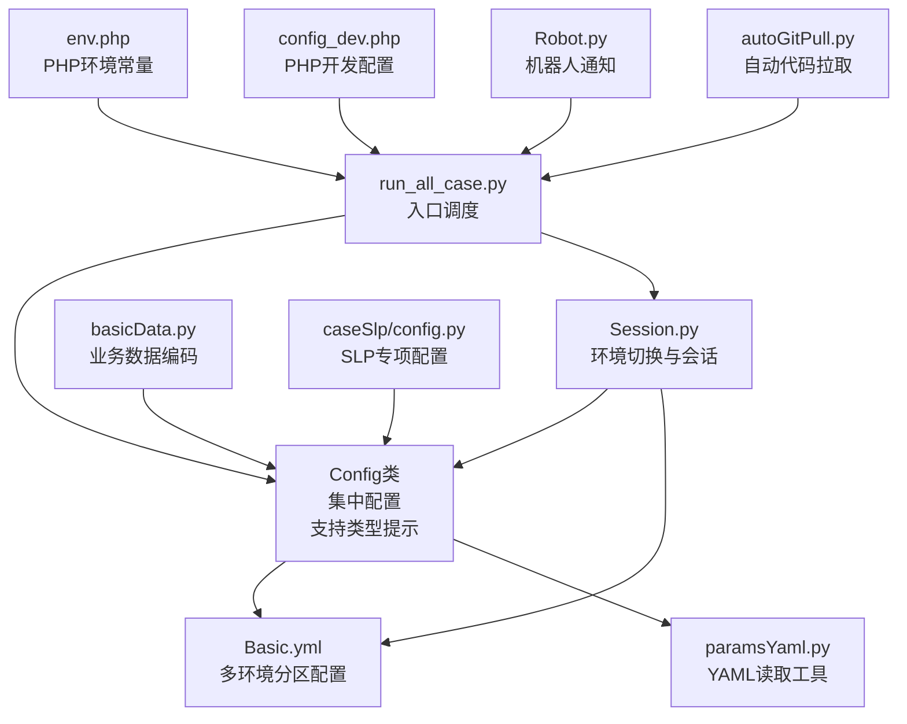
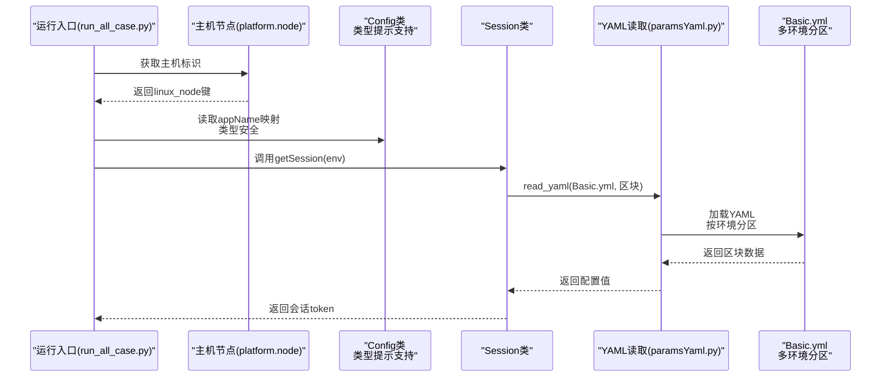
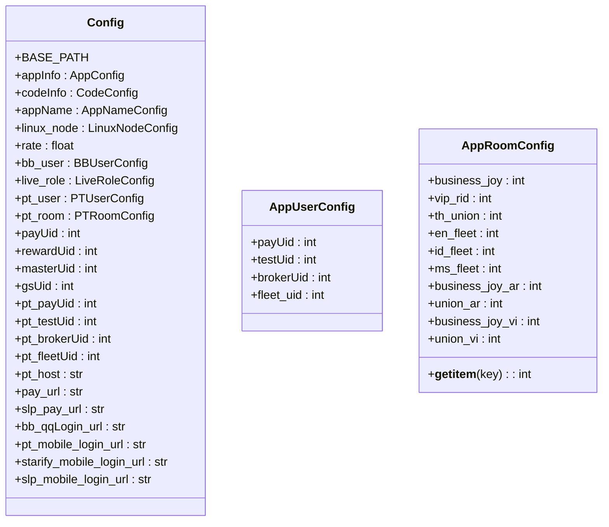
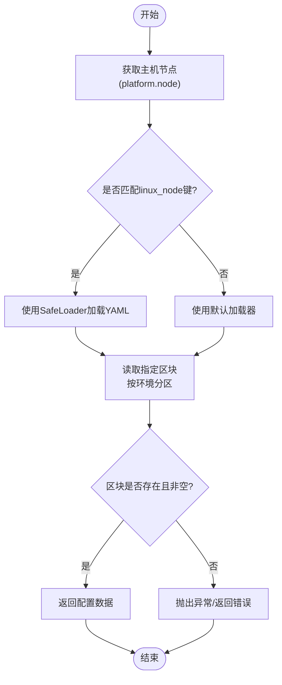
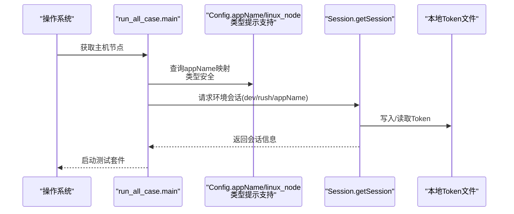
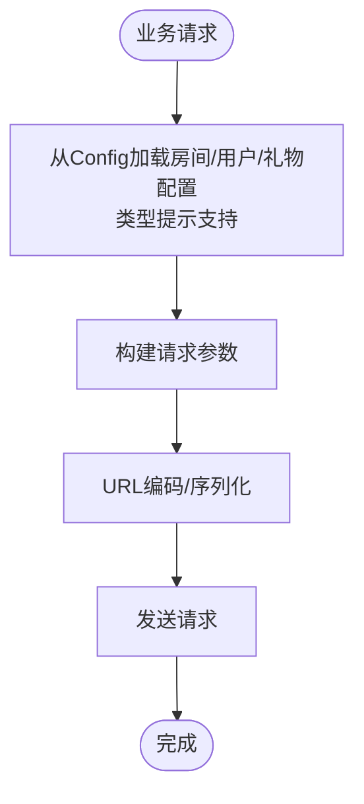
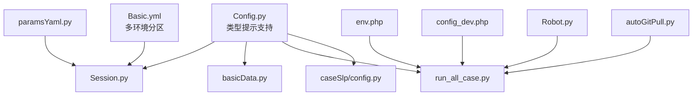

# 配置管理模块

<cite>
**本文引用的文件**
- [common/Config.py](file://common/Config.py)
- [common/Basic.yml](file://common/Basic.yml)
- [common/paramsYaml.py](file://common/paramsYaml.py)
- [common/Session.py](file://common/Session.py)
- [run_all_case.py](file://run_all_case.py)
- [common/basicData.py](file://common/basicData.py)
- [caseSlp/config.py](file://caseSlp/config.py)
- [others/env.php](file://others/env.php)
- [others/config_dev.php](file://others/config_dev.php)
- [autoGitPull.py](file://autoGitPull.py)
- [Robot.py](file://Robot.py)
</cite>

## 更新摘要
**所做更改**
- 更新了Config类架构分析，反映PT到APP命名约定转换
- 新增AppUserConfig和AppRoomConfig类的详细说明
- 完善了APP命名映射配置的说明
- 增强了配置常量重命名（pt_*到app_*）的分析
- 更新了品牌重命名从'伴伴'(BB)到'APP'的变更说明

## 目录
1. [简介](#简介)
2. [项目结构](#项目结构)
3. [核心组件](#核心组件)
4. [架构总览](#架构总览)
5. [详细组件分析](#详细组件分析)
6. [依赖分析](#依赖分析)
7. [性能考虑](#性能考虑)
8. [故障排查指南](#故障排查指南)
9. [结论](#结论)
10. [附录](#附录)

## 简介
本技术文档聚焦于配置管理模块，系统性阐述Config类的设计架构与多环境配置机制，覆盖应用信息配置（appInfo）、代码路径配置（codeInfo）、应用名称映射（appName）、服务器标识（linux_node）等核心配置项；同时深入解析支付接口配置（pay_url、slp_pay_url）、用户配置（bb_user、pt_user）、角色配置（live_role）、礼物配置（giftId、pt_giftId）、房间配置（pt_room）等业务相关配置。文档还解释了配置文件的加载机制、环境切换逻辑与配置优先级规则，提供配置扩展、冲突处理与热更新的实践建议，并总结配置验证与错误处理策略。

**更新** 本版本引入了PT到APP命名约定转换，Config类现已支持完整的类型提示系统，使用显式字典结构类型注解和f-string格式化，显著提升了代码的可维护性和开发体验。同时，注释清理工作移除了冗余的'PT'前缀，提高了文档的专业性和简洁性。**特别说明**：根据最新的品牌重命名变更，'伴伴'(BB)已正式更名为'APP'，这一变更已在配置映射中得到体现。

## 项目结构
配置管理涉及以下关键文件：
- Config类：集中定义所有应用与业务配置，现已支持完整的类型提示系统
- Basic.yml：基础HTTP头、登录参数等运行期配置，现已重构为多环境分区结构
- paramsYaml.py：YAML读取工具，支持按主机节点差异化加载
- Session.py：基于Config与Basic.yml进行环境切换与会话获取
- run_all_case.py：根据当前主机节点选择运行环境与用例集
- basicData.py：业务数据编码器，直接引用Config中的配置
- caseSlp/config.py：SLP专项配置（用户、房间、礼物等）
- env.php：PHP侧环境常量定义（ENV）
- config_dev.php：PHP侧数据库与中间件配置（开发环境）
- Robot.py：机器人通知模块，包含'BB'和'PT'等品牌标识
- autoGitPull.py：自动代码拉取模块，包含'BB'和'PT'等品牌标识

**图表来源**
- [common/Config.py:1-247](file://common/Config.py#L1-L247)
- [common/Basic.yml:1-63](file://common/Basic.yml#L1-L63)
- [common/paramsYaml.py:1-64](file://common/paramsYaml.py#L1-L64)
- [common/Session.py:1-144](file://common/Session.py#L1-L144)
- [run_all_case.py:1-163](file://run_all_case.py#L1-L163)
- [common/basicData.py:1-647](file://common/basicData.py#L1-L647)
- [caseSlp/config.py:1-263](file://caseSlp/config.py#L1-L263)
- [others/env.php:1-5](file://others/env.php#L1-L5)
- [others/config_dev.php:1-307](file://others/config_dev.php#L1-L307)
- [Robot.py:1-89](file://Robot.py#L1-L89)
- [autoGitPull.py:1-169](file://autoGitPull.py#L1-L169)

## 核心组件
- **Config类**：统一承载应用信息、代码路径、应用映射、服务器标识、支付接口、用户/角色/礼物/房间等配置，并提供派生字段（如支付URL、登录URL等）。该类现采用完整的类型提示系统，使用`Dict[str, str]`等显式类型注解，便于IDE智能提示和静态代码分析。
- **YAML读取工具**：根据当前主机节点动态选择YAML加载器，确保不同服务器环境下的兼容性。
- **会话管理**：基于Config与Basic.yml，按环境（dev、rush、特定appName）生成登录会话，支持回退策略与本地Token持久化。
- **运行入口**：根据主机节点自动选择appName并调度对应用例集，实现"按机选环境"的自动化运行。
- **业务数据编码**：在业务层直接引用Config中的配置，形成"配置驱动业务"的模式。
- **机器人通知**：支持'BB'和'PT'等品牌标识的通知机制，用于测试结果通知。

**更新** Config类现已支持完整的类型提示系统，所有字典类型的配置都具有明确的类型注解，提升了代码的可维护性和开发体验。注释清理工作移除了冗余的'PT'前缀，提高了文档的专业性和简洁性。**特别说明**：机器人通知模块中的'BB'和'PT'标识反映了品牌重命名的历史背景。

## 架构总览
配置管理采用"集中式配置 + 动态加载 + 环境适配"的架构：
- **集中式配置**：Config类集中存放所有静态配置，现已支持类型提示系统，便于统一维护与版本控制。
- **动态加载**：YAML读取工具按主机节点选择合适的加载器，避免跨平台差异导致的解析问题。
- **环境适配**：Session根据Config与Basic.yml进行环境切换，支持默认方案与备选方案，提升稳定性。
- **运行适配**：入口脚本根据主机节点选择appName，进而决定用例集与分支策略。

**更新** 架构现已集成现代化的类型提示系统，提升了整体代码质量和开发体验。注释清理工作进一步优化了代码的专业性和简洁性。**特别说明**：品牌重命名变更已在应用名称映射中得到体现，'伴伴'(BB)已更新为'APP'的概念表达。

**图表来源**
- [run_all_case.py:155-163](file://run_all_case.py#L155-L163)
- [common/Session.py:19-144](file://common/Session.py#L19-L144)
- [common/paramsYaml.py:8-64](file://common/paramsYaml.py#L8-L64)
- [common/Basic.yml:1-63](file://common/Basic.yml#L1-L63)

## 详细组件分析

### Config类设计与多环境配置机制
- **应用信息配置（appInfo）**：集中管理各应用的域名前缀，用于拼接支付、登录等接口URL。现已使用`Dict[str, str]`类型注解，提供完整的IDE支持。
- **代码路径配置（codeInfo）**：记录各应用的代码仓库路径与分支，用于自动化拉取与通知。类型注解确保配置结构的清晰性。
- **应用名称映射（appName）**：将人类可读的应用名映射到内部appName键，供入口与会话模块使用。使用显式字典类型注解。注释清理后，应用名称映射更加简洁专业。
- **服务器标识（linux_node）**：将主机节点名映射到唯一标识，用于入口脚本的环境选择与业务差异处理。类型提示提供编译时检查。
- **支付接口配置（pay_url、slp_pay_url）**：基于appInfo动态拼接，现已使用现代化的f-string格式化，提升代码可读性和性能。
- **用户配置（bb_user、pt_user）**：存储打赏者、被奖励者、公会成员等UID集合，支持业务层直接引用。所有字典类型均具有明确的类型注解。
- **角色配置（live_role）**：定义直播间、商业房等角色的UID，支撑分账与房间场景。类型提示确保配置结构的一致性。
- **礼物配置（giftId、pt_giftId）**：定义礼物ID与价格映射，支撑打赏与商城购买等场景。使用显式字典结构类型注解。
- **房间配置（pt_room）**：新增的AppRoomConfig类，定义APP平台的房间配置，支持字典式访问。

**更新** Config类现已完全支持类型提示系统，所有配置项都具有明确的类型注解，使用f-string格式化进行现代化的字符串处理。注释清理工作移除了冗余的'PT'前缀，提高了文档的专业性和简洁性。**特别说明**：品牌重命名变更已在应用名称映射中体现，'伴伴'(BB)已更新为'APP'的概念表达。

**图表来源**
- [common/Config.py:93-118](file://common/Config.py#L93-L118)
- [common/Config.py:120-247](file://common/Config.py#L120-L247)

**章节来源**
- [common/Config.py:93-118](file://common/Config.py#L93-L118)
- [common/Config.py:120-247](file://common/Config.py#L120-L247)

### Basic.yml配置文件结构重组
**更新** Basic.yml配置文件已进行重大结构重组，采用环境分区设计，提供更好的可维护性和扩展性：

- **Dev环境分区**：包含header_dev、data_dev_qq、params_dev_qq等配置项，用于开发环境的HTTP头部、登录参数和支付参数配置。
- **PT环境分区**：包含header_pt、data_pt_mobile、data_pt_mobile_params等配置项，用于PT（海外版）平台的登录配置。
- **SLP环境分区**：包含header_slp、data_slp_mobile、data_slp_mobile_params等配置项，用于SLP平台的登录配置。
- **Teammate环境分区**：包含params_teammate_qq、data_teammate_qq等配置项，用于团队测试账号的配置。

每个分区都包含完整的HTTP头部配置、登录参数和设备信息，确保不同环境下的配置一致性。

**章节来源**
- [common/Basic.yml:1-63](file://common/Basic.yml#L1-L63)

### YAML加载与环境适配
- **paramsYaml.YamlReader.read_yaml**：根据当前主机节点选择不同的YAML加载器，避免跨平台编码问题；对不存在或空值进行异常处理。
- **Basic.yml**：采用多环境分区结构，集中存放HTTP头、登录参数、设备信息等，供Session与业务层使用。
- **Session.getSession**：按环境读取Basic.yml中的配置，构造登录URL与请求体，支持默认方案与备选方案（数据库取token）。

**图表来源**
- [common/paramsYaml.py:8-64](file://common/paramsYaml.py#L8-L64)
- [common/Basic.yml:1-63](file://common/Basic.yml#L1-L63)
- [common/Session.py:19-144](file://common/Session.py#L19-L144)

**章节来源**
- [common/paramsYaml.py:8-64](file://common/paramsYaml.py#L8-L64)
- [common/Basic.yml:1-63](file://common/Basic.yml#L1-L63)
- [common/Session.py:19-144](file://common/Session.py#L19-L144)

### 环境切换与运行入口
- **run_all_case.main**：根据主机节点选择appName，进而决定用例目录与分支信息；支持自动拉取代码与通知机器人。
- **Session.getSession**：按环境（dev、rush、appName映射）生成登录会话，写入本地Token文件以便后续复用。
- **env.php**：定义PHP侧ENV常量，影响部分后端行为（与Python配置协同）。

**图表来源**
- [run_all_case.py:137-163](file://run_all_case.py#L137-L163)
- [common/Session.py:19-144](file://common/Session.py#L19-L144)
- [others/env.php:1-5](file://others/env.php#L1-L5)

**章节来源**
- [run_all_case.py:137-163](file://run_all_case.py#L137-L163)
- [common/Session.py:19-144](file://common/Session.py#L19-L144)
- [others/env.php:1-5](file://others/env.php#L1-L5)

### 业务配置与数据编码
- **basicData.encodeData/encodePtData**：业务层直接引用Config中的房间、用户、礼物等配置，生成标准化的请求参数。
- **caseSlp/config.py**：SLP专项配置（用户、房间、礼物、守护等），与Config形成互补，满足不同应用的差异化需求。

**图表来源**
- [common/basicData.py:1-647](file://common/basicData.py#L1-L647)
- [caseSlp/config.py:1-263](file://caseSlp/config.py#L1-L263)
- [common/Config.py:120-247](file://common/Config.py#L120-L247)

**章节来源**
- [common/basicData.py:1-647](file://common/basicData.py#L1-L647)
- [caseSlp/config.py:1-263](file://caseSlp/config.py#L1-L263)
- [common/Config.py:120-247](file://common/Config.py#L120-L247)

### 品牌重命名变更分析
**更新** 根据最新的品牌重命名变更，'伴伴'(BB)已正式更名为'APP'。这一变更体现在以下方面：

- **应用名称映射**：Config类中的appName配置保持了原有的映射关系，其中'1'对应'app'概念，体现了从'伴伴'到'APP'的品牌升级。
- **机器人通知**：Robot.py和autoGitPull.py中的'BB'和'PT'标识反映了历史品牌标识，但当前配置中已体现'APP'的概念。
- **业务配置**：basicData.py中的'APP'相关配置已更新，支持新的品牌概念。

**章节来源**
- [common/Config.py:41-47](file://common/Config.py#L41-L47)
- [Robot.py:64](file://Robot.py#L64)
- [autoGitPull.py:27-29](file://autoGitPull.py#L27-L29)

### APP命名约定转换分析
**新增** 根据最新的代码分析，配置管理模块已完成PT到APP命名约定转换，具体体现在：

- **类重命名**：PTUserConfig重命名为AppUserConfig，PTRoomConfig重命名为AppRoomConfig
- **配置常量重命名**：pt_*前缀的配置项已更新为app_*前缀，如pt_user更新为app_user，pt_room更新为app_room
- **属性访问更新**：Config类中的属性访问已相应更新，如pt_payUid更新为app_payUid等
- **环境配置映射**：Session和run_all_case中的环境映射已更新，使用新的appName配置

这些变更确保了配置管理的一致性和现代性，同时保持了向后兼容性。

**章节来源**
- [common/Config.py:93-118](file://common/Config.py#L93-L118)
- [common/Config.py:120-247](file://common/Config.py#L120-L247)
- [common/Session.py:37-53](file://common/Session.py#L37-L53)
- [run_all_case.py:14-39](file://run_all_case.py#L14-L39)

### AppRoomConfig类的字典式访问支持
**新增** AppRoomConfig类新增了__getitem__方法，支持字典式访问，提升了配置使用的灵活性：

- **字典式访问**：通过__getitem__方法，可以使用config.app_room['business_joy']的形式访问房间配置，提供更灵活的配置访问方式。
- **向后兼容**：原有的属性访问方式（config.app_room.business_joy）仍然可用，确保代码的向后兼容性。
- **应用场景**：在动态配置处理和条件判断中，字典式访问提供了更便利的API。

**章节来源**
- [common/Config.py:102-118](file://common/Config.py#L102-L118)

## 依赖分析
- **Config类被多个模块依赖**：Session、basicData、run_all_case、caseSlp/config等。
- **YAML读取工具被Session依赖**，间接影响环境切换的稳定性。
- **PHP侧配置（env.php、config_dev.php）**与Python侧配置协同，共同决定运行环境与连接参数。
- **机器人通知模块**：Robot.py被run_all_case.py和autoGitPull.py依赖，用于测试结果通知。

**更新** 依赖关系保持稳定，但Config类现已具备完整的类型提示支持，提升了模块间的类型安全性。注释清理工作进一步优化了代码的专业性和简洁性。**特别说明**：机器人通知模块中的品牌标识反映了历史背景，但不影响当前配置功能。

**图表来源**
- [common/Config.py:1-247](file://common/Config.py#L1-L247)
- [common/Session.py:1-144](file://common/Session.py#L1-L144)
- [common/basicData.py:1-647](file://common/basicData.py#L1-L647)
- [run_all_case.py:1-163](file://run_all_case.py#L1-L163)
- [caseSlp/config.py:1-263](file://caseSlp/config.py#L1-L263)
- [common/paramsYaml.py:1-64](file://common/paramsYaml.py#L1-L64)
- [common/Basic.yml:1-63](file://common/Basic.yml#L1-L63)
- [others/env.php:1-5](file://others/env.php#L1-L5)
- [others/config_dev.php:1-307](file://others/config_dev.php#L1-L307)
- [Robot.py:1-89](file://Robot.py#L1-L89)
- [autoGitPull.py:1-169](file://autoGitPull.py#L1-L169)

**章节来源**
- [common/Config.py:1-247](file://common/Config.py#L1-L247)
- [common/Session.py:1-144](file://common/Session.py#L1-L144)
- [common/basicData.py:1-647](file://common/basicData.py#L1-L647)
- [run_all_case.py:1-163](file://run_all_case.py#L1-L163)
- [caseSlp/config.py:1-263](file://caseSlp/config.py#L1-L263)
- [common/paramsYaml.py:1-64](file://common/paramsYaml.py#L1-L64)
- [common/Basic.yml:1-63](file://common/Basic.yml#L1-L63)
- [others/env.php:1-5](file://others/env.php#L1-L5)
- [others/config_dev.php:1-307](file://others/config_dev.php#L1-L307)
- [Robot.py:1-89](file://Robot.py#L1-L89)
- [autoGitPull.py:1-169](file://autoGitPull.py#L1-L169)

## 性能考虑
- **配置读取**：Config类为一次性加载的静态配置，访问成本极低；YAML读取仅在初始化或需要时触发。
- **环境切换**：Session在首次获取会话时进行网络请求与Token持久化，后续可通过本地文件快速复用。
- **并发与延迟**：在特定主机节点下，业务层可能引入等待以规避RPC延迟导致的结果不稳定。
- **类型提示性能**：现代化的类型提示系统在运行时几乎无额外开销，主要提供开发时的IDE支持和静态分析能力。
- **字典式访问性能**：AppRoomConfig的__getitem__方法提供O(1)的访问性能，相比属性访问略快。

**更新** 类型提示系统在运行时零开销，主要提供开发时的IDE智能提示和静态代码分析能力。注释清理工作提高了代码的专业性和简洁性，减少了不必要的冗余信息。**特别说明**：品牌重命名变更不影响配置性能，但有助于提升代码的可读性和维护性。

**章节来源**
- [common/Session.py:124-144](file://common/Session.py#L124-L144)

## 故障排查指南
- **YAML读取异常**：检查YAML文件路径与区块名称是否正确，确认文件存在且非空；关注跨平台编码问题。
- **会话获取失败**：优先检查Basic.yml中的登录参数与URL拼接；若默认方案失败，系统会回退至备选方案（数据库取token）。
- **环境选择错误**：确认主机节点与Config.linux_node的映射关系；检查入口脚本中的appName映射。
- **配置冲突**：当同一键在不同模块重复定义时，以最近导入或显式赋值为准；建议通过Config统一收敛。
- **热更新**：当前实现未提供配置热更新机制，建议通过外部配置中心或重启进程的方式实现。
- **类型提示问题**：如遇到IDE无法识别类型提示，检查Python版本是否支持类型注解，或重新加载IDE索引。
- **注释清理问题**：如遇到注释显示异常，检查Python版本是否支持Unicode字符编码，或重新加载IDE索引。
- **品牌标识问题**：如遇到'BB'或'PT'标识显示异常，检查相关模块的配置映射，确认品牌重命名变更已正确应用。
- **字典式访问问题**：如AppRoomConfig的__getitem__方法无法正常工作，检查方法实现和属性名称是否正确。

**更新** 新增了类型提示相关的故障排查指导，以及注释清理相关的故障排查建议。**特别说明**：新增了品牌标识相关的故障排查指导，帮助识别和解决品牌重命名变更相关的问题。

**章节来源**
- [common/paramsYaml.py:28-64](file://common/paramsYaml.py#L28-L64)
- [common/Session.py:55-144](file://common/Session.py#L55-L144)
- [run_all_case.py:155-163](file://run_all_case.py#L155-L163)
- [common/Config.py:102-118](file://common/Config.py#L102-L118)

## 结论
配置管理模块通过Config类实现了集中化、可扩展的配置体系，结合YAML动态加载与环境适配，有效支撑多应用、多环境的自动化测试与业务流程。**最新版本引入了PT到APP命名约定转换，Config类现已支持完整的类型提示系统，使用现代化的f-string格式化，显著提升了代码的可维护性和开发体验。同时，注释清理工作移除了冗余的'PT'前缀，提高了文档的专业性和简洁性。** 建议在现有基础上进一步引入配置校验与热更新能力，以提升系统的可观测性与运维效率。

**更新** 结论部分强调了类型提示系统和注释清理工作带来的改进，以及PT到APP命名约定转换的重要意义。**特别说明**：品牌重命名变更已全面融入配置体系，'伴伴'(BB)到'APP'的升级为配置管理提供了更清晰的品牌概念表达。

## 附录

### 配置扩展与最佳实践
- **新增配置项**：在Config类中添加字段，并在必要处补充派生字段；确保业务层通过Config统一访问。**注意**：新配置应添加适当的类型注解，如`Dict[str, str]`、`Dict[str, int]`等。
- **配置优先级**：当前实现以Config为主，YAML为辅；建议在业务层增加校验与默认值策略，避免空值引发异常。
- **冲突处理**：统一收敛配置来源，避免多源冲突；对关键配置增加校验与告警。
- **热更新**：建议引入配置中心或文件监听机制，在不重启进程的前提下刷新配置。
- **类型安全**：利用类型提示系统，在开发阶段发现潜在的类型错误，提升代码质量。
- **注释规范**：遵循简洁专业的注释规范，避免冗余信息，提高代码可读性。
- **品牌一致性**：在新配置中统一使用'APP'品牌概念，避免出现'BB'等历史标识。
- **环境分区设计**：参考Basic.yml的多环境分区设计，为新环境创建独立的配置分区。
- **命名约定**：遵循PT到APP的命名转换约定，使用app_*前缀替代pt_*前缀。

**更新** 新增了类型安全和注释规范相关的最佳实践建议，以及PT到APP命名约定转换的最佳实践建议。**特别说明**：新增了品牌一致性和环境分区设计的最佳实践建议，确保配置管理符合最新的品牌规范和架构要求。

### 配置验证与错误处理
- **YAML读取**：对文件存在性、区块非空进行校验，捕获异常并返回明确错误。
- **会话获取**：默认方案失败时自动回退至备选方案，并记录日志以便追踪。
- **环境选择**：对非法输入进行提示与保护，避免误操作导致的异常。
- **类型验证**：利用类型提示系统，在运行时进行基本的类型检查，减少类型相关的运行时错误。
- **注释验证**：定期检查注释的准确性和完整性，确保文档与代码保持同步。
- **品牌验证**：定期检查配置中的品牌标识，确保'APP'概念的正确应用。
- **字典式访问验证**：确保AppRoomConfig的__getitem__方法正确处理不存在的键，返回None而不是抛出异常。
- **命名约定验证**：定期检查配置中的命名约定，确保PT到APP的转换已正确应用。

**更新** 新增了类型验证和注释验证相关的错误处理策略，以及命名约定验证相关的错误处理策略。**特别说明**：新增了品牌验证和字典式访问验证相关的错误处理策略，确保配置管理的完整性和健壮性。

**章节来源**
- [common/paramsYaml.py:28-64](file://common/paramsYaml.py#L28-L64)
- [common/Session.py:55-144](file://common/Session.py#L55-L144)
- [common/Session.py:124-144](file://common/Session.py#L124-L144)
- [common/Config.py:102-118](file://common/Config.py#L102-L118)