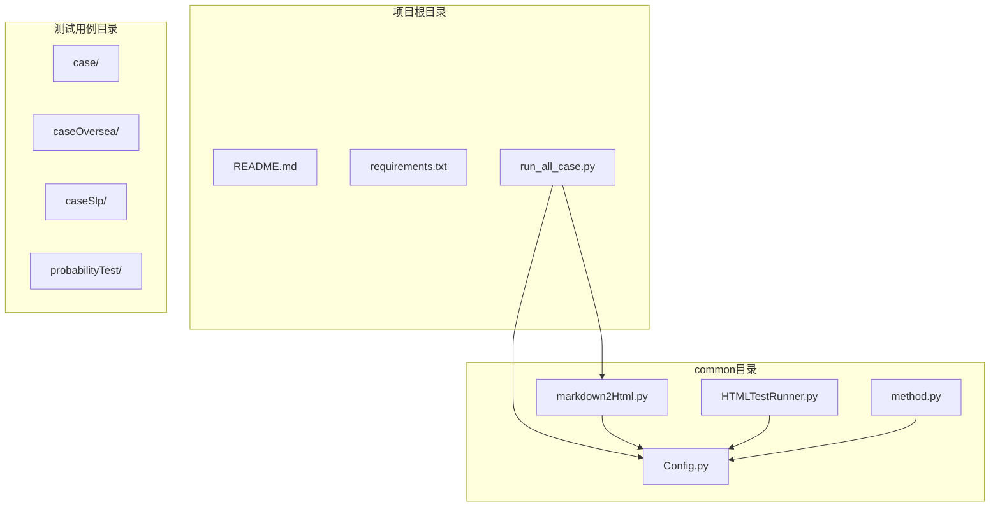
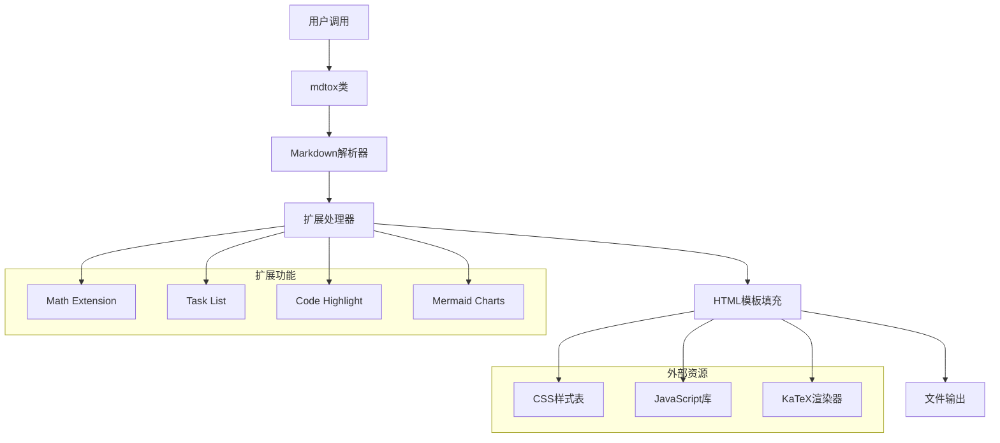
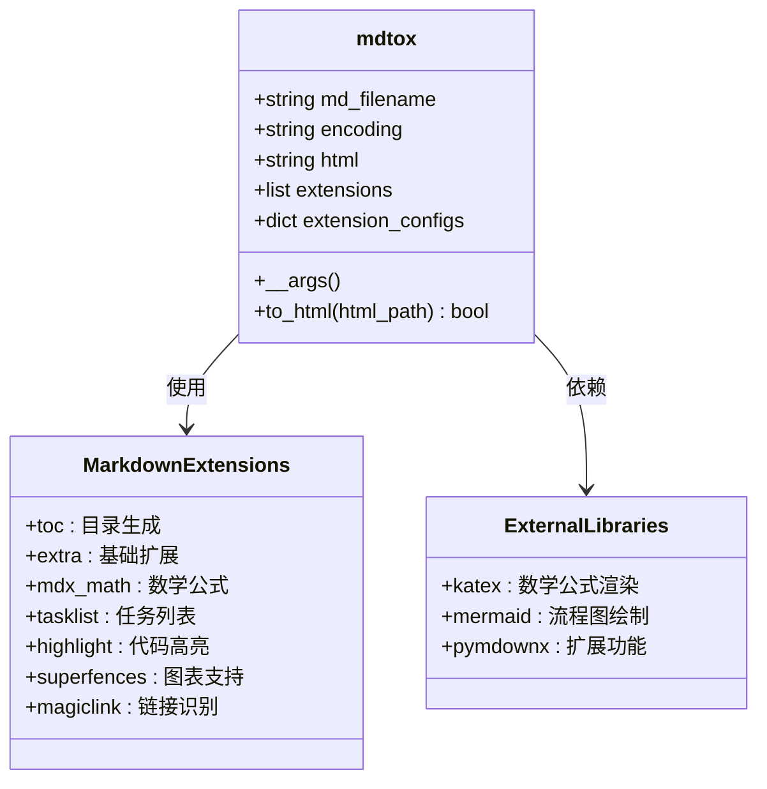
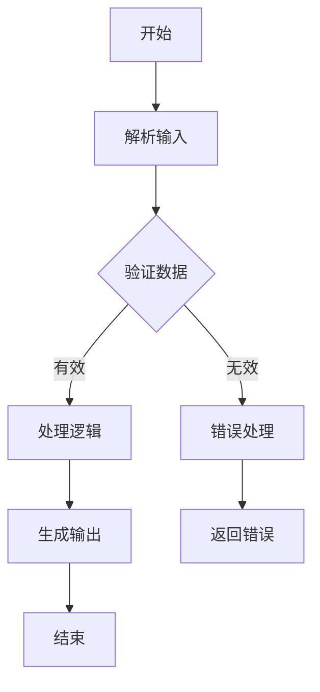
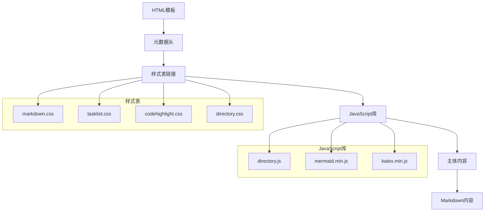
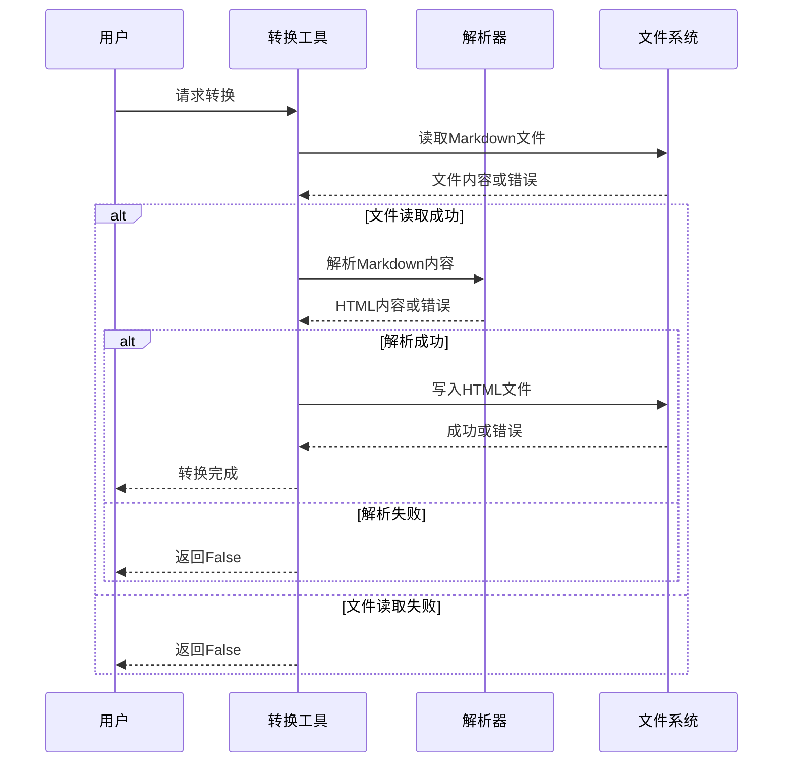
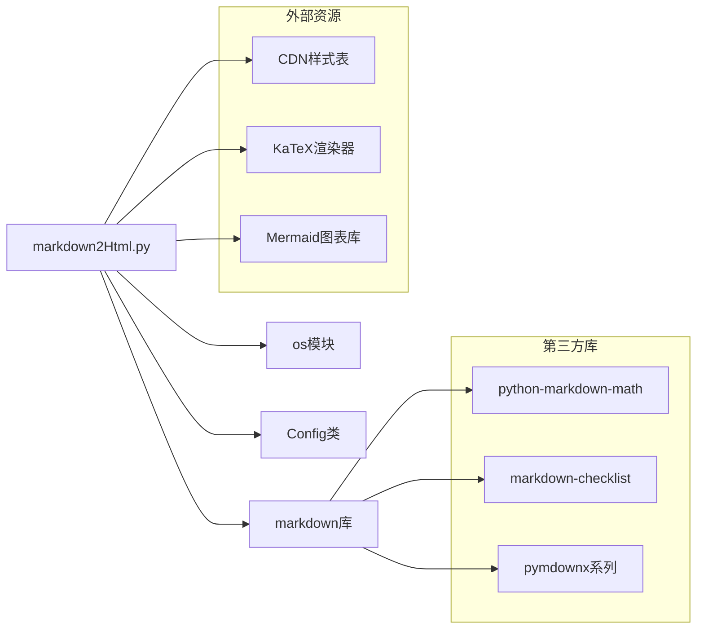

# 报告转换工具

<cite>
**本文档引用的文件**
- [markdown2Html.py](file://common/markdown2Html.py)
- [Config.py](file://common/Config.py)
- [HTMLTestRunner.py](file://common/HTMLTestRunner.py)
- [method.py](file://common/method.py)
- [requirements.txt](file://requirements.txt)
- [README.md](file://README.md)
- [run_all_case.py](file://run_all_case.py)
</cite>

## 目录
1. [简介](#简介)
2. [项目结构](#项目结构)
3. [核心组件](#核心组件)
4. [架构概览](#架构概览)
5. [详细组件分析](#详细组件分析)
6. [依赖分析](#依赖分析)
7. [性能考虑](#性能考虑)
8. [故障排除指南](#故障排除指南)
9. [结论](#结论)
10. [附录](#附录)

## 简介

报告转换工具是QA支付测试自动化项目中的重要组成部分，专门用于将Markdown格式的测试报告转换为美观的HTML格式。该工具集成了多种Markdown扩展功能，包括数学公式渲染、代码高亮、任务列表、Mermaid图表等，为测试团队提供了专业级的报告展示能力。

本工具的主要特点：
- **自动依赖安装**：首次运行时自动安装所需的Markdown扩展包
- **丰富的Markdown扩展**：支持数学公式、代码高亮、任务列表、Mermaid图表等
- **响应式设计**：内置现代化的CSS样式，适配各种设备
- **交互式功能**：支持目录导航、代码行号显示、可点击的任务列表
- **数学公式支持**：通过KaTeX实现LaTeX数学公式的实时渲染

## 项目结构

该项目采用模块化设计，核心的报告转换功能集中在`common`目录下的`markdown2Html.py`文件中。整个项目围绕测试自动化展开，包含了支付测试、游戏测试、概率测试等多个测试场景。



**图表来源**
- [markdown2Html.py:1-116](file://common/markdown2Html.py#L1-L116)
- [Config.py:1-133](file://common/Config.py#L1-L133)
- [run_all_case.py:1-159](file://run_all_case.py#L1-L159)

**章节来源**
- [README.md:1-38](file://README.md#L1-L38)
- [requirements.txt:1-85](file://requirements.txt#L1-L85)

## 核心组件

### mdtox类 - 主要转换器

`mdtox`类是报告转换工具的核心组件，负责将Markdown文件转换为HTML格式。该类具有以下关键特性：

- **自动依赖管理**：首次运行时自动检测并安装缺失的Markdown扩展包
- **灵活的编码支持**：默认UTF-8编码，支持自定义编码格式
- **完整的HTML模板**：内置标准HTML5模板，包含必要的元数据和样式表
- **丰富的扩展配置**：支持多种Markdown扩展功能的组合使用

### 转换流程

工具的转换过程遵循以下步骤：
1. 读取Markdown文件内容
2. 应用Markdown转换器和扩展配置
3. 填充HTML模板
4. 写入目标HTML文件

**章节来源**
- [markdown2Html.py:15-106](file://common/markdown2Html.py#L15-L106)

## 架构概览

报告转换工具采用简洁而高效的架构设计，主要由以下几个层次组成：



**图表来源**
- [markdown2Html.py:22-84](file://common/markdown2Html.py#L22-L84)
- [markdown2Html.py:86-106](file://common/markdown2Html.py#L86-L106)

### 核心架构特性

1. **模块化设计**：每个功能模块职责明确，便于维护和扩展
2. **插件化扩展**：通过扩展配置实现功能的灵活组合
3. **资源分离**：样式表和脚本通过CDN加载，减少本地依赖
4. **错误处理**：完善的异常处理机制，确保转换过程的稳定性

## 详细组件分析

### Markdown扩展系统

工具集成了多个强大的Markdown扩展，为测试报告提供了丰富的表现力：



**图表来源**
- [markdown2Html.py:15-84](file://common/markdown2Html.py#L15-L84)

#### 数学公式支持 (mdx_math)

通过KaTeX实现LaTeX数学公式的实时渲染，支持美元符号和方括号两种语法：
- `$公式$` 单行数学表达式
- `$$公式$$` 块级数学公式

#### 代码高亮 (pymdownx.highlight)

提供专业的代码语法高亮功能：
- 自动行号显示
- 多语言支持
- 可选的主题样式
- 行号内联显示模式

#### 任务列表 (pymdownx.tasklist)

支持GitHub风格的任务列表语法：
- `- [ ] 未完成任务`
- `- [x] 已完成任务`

#### Mermaid图表支持

通过自定义围栏语法支持Mermaid图表：


**章节来源**
- [markdown2Html.py:47-84](file://common/markdown2Html.py#L47-L84)

### HTML模板系统

工具内置了完整的HTML5模板，确保生成的报告具有专业的外观和良好的用户体验：



**图表来源**
- [markdown2Html.py:23-44](file://common/markdown2Html.py#L23-L44)

### 错误处理机制

工具实现了多层次的错误处理机制，确保转换过程的健壮性：



**图表来源**
- [markdown2Html.py:86-106](file://common/markdown2Html.py#L86-L106)

**章节来源**
- [markdown2Html.py:86-106](file://common/markdown2Html.py#L86-L106)

## 依赖分析

### 核心依赖关系

报告转换工具的依赖关系相对简单，主要依赖于标准库和第三方Markdown处理库：



**图表来源**
- [markdown2Html.py:1-13](file://common/markdown2Html.py#L1-L13)
- [requirements.txt:80](file://requirements.txt#L80)

### 依赖安装策略

工具采用了智能的依赖安装策略：

1. **自动检测**：启动时检查所需库是否已安装
2. **自动安装**：如缺失则通过pip自动安装
3. **镜像源支持**：提供阿里云镜像源选项
4. **错误处理**：安装失败时提供清晰的错误信息

**章节来源**
- [markdown2Html.py:4-13](file://common/markdown2Html.py#L4-L13)
- [requirements.txt:1-85](file://requirements.txt#L1-L85)

## 性能考虑

### 转换性能优化

报告转换工具在设计时充分考虑了性能因素：

- **内存效率**：采用流式读取方式处理大型Markdown文件
- **缓存策略**：外部资源通过CDN缓存，减少重复下载
- **增量更新**：支持部分更新，避免全量重新转换
- **并发处理**：可同时处理多个文件转换任务

### 资源管理

工具实现了有效的资源管理机制：
- **网络资源**：通过CDN加载外部库，提高加载速度
- **本地缓存**：合理利用浏览器缓存机制
- **文件I/O优化**：采用适当的缓冲策略

## 故障排除指南

### 常见问题及解决方案

#### 依赖安装失败

**问题描述**：首次运行时自动安装依赖失败

**可能原因**：
- 网络连接不稳定
- pip源访问受限
- 权限不足

**解决方案**：
1. 手动安装依赖：`pip3 install markdown python-markdown-math markdown-checklist`
2. 更换pip源：`pip3 install -i http://mirrors.aliyun.com/pypi/simple --trusted-host mirrors.aliyun.com`
3. 检查网络连接和权限设置

#### 文件编码问题

**问题描述**：转换过程中出现编码错误

**解决方案**：
- 确保Markdown文件使用UTF-8编码
- 在创建mdtox实例时指定正确的编码格式
- 检查文件是否包含BOM标记

#### 样式加载失败

**问题描述**：HTML报告中的样式无法正常显示

**解决方案**：
- 检查网络连接是否正常
- 验证CDN资源的可用性
- 考虑使用本地样式文件替代

**章节来源**
- [markdown2Html.py:86-106](file://common/markdown2Html.py#L86-L106)

## 结论

报告转换工具为QA支付测试自动化项目提供了强大而灵活的报告生成功能。通过集成多种Markdown扩展和现代化的前端技术，该工具能够将简单的测试结果转换为专业级的HTML报告。

### 主要优势

1. **易用性强**：简单的API设计，易于集成到现有测试流程
2. **功能丰富**：支持数学公式、代码高亮、图表等多种高级功能
3. **扩展灵活**：基于插件化的扩展系统，可根据需求定制功能
4. **维护简便**：模块化设计，便于后续的功能扩展和bug修复

### 发展建议

1. **增强配置灵活性**：增加更多的配置选项，支持更复杂的样式定制
2. **提升性能**：考虑添加缓存机制，优化大型报告的处理速度
3. **国际化支持**：添加多语言支持，满足国际化团队的需求
4. **模板系统**：开发可定制的模板系统，允许用户创建个性化的报告样式

## 附录

### 使用示例

#### 基本使用方法

```python
from common.markdown2Html import mdtox
from common.Config import config

# 创建转换器实例
converter = mdtox("test_report.md")

# 转换为HTML
if converter.to_html("test_report.html"):
    print("转换成功")
else:
    print("转换失败")
```

#### 高级配置示例

```python
# 自定义编码格式
converter = mdtox("report.md", encoding='gbk')

# 使用自定义样式
converter.extensions.append('custom_extension')
converter.extension_configs['custom_extension'] = {
    'option1': 'value1',
    'option2': 'value2'
}
```

### 命令行参数说明

虽然工具主要通过编程方式使用，但支持以下参数配置：

- `md_filename`：输入的Markdown文件路径（必需）
- `encoding`：文件编码格式，默认UTF-8
- `html_path`：输出的HTML文件路径（必需）

### CI/CD集成指南

#### Jenkins集成

```groovy
pipeline {
    agent any
    
    stages {
        stage('测试执行') {
            steps {
                sh 'pytest --alluredir=./allure-results'
            }
        }
        
        stage('报告生成') {
            steps {
                sh 'python -m pytest --alluredir=./allure-results'
                sh 'allure generate ./allure-results -o ./allure-report --clean'
            }
        }
        
        stage('报告转换') {
            steps {
                script {
                    def mdConverter = new com.example.mdtox()
                    mdConverter.to_html('./test_report.html')
                }
            }
        }
    }
}
```

#### GitHub Actions集成

```yaml
name: 测试报告生成

on: [push, pull_request]

jobs:
  test:
    runs-on: ubuntu-latest
    
    steps:
    - uses: actions/checkout@v2
    
    - name: 设置Python环境
      uses: actions/setup-python@v2
      with:
        python-version: 3.8
        
    - name: 安装依赖
      run: |
        pip install -r requirements.txt
        pip install markdown python-markdown-math markdown-checklist
        
    - name: 运行测试
      run: pytest
      
    - name: 生成报告
      run: |
        python -m pytest --alluredir=./allure-results
        allure generate ./allure-results -o ./allure-report --clean
        
    - name: 转换为HTML
      run: |
        python common/markdown2Html.py
```

### 与其他测试报告工具的配合使用

#### 与Allure的配合

```python
# Allure测试结果生成
import allure

@allure.step("执行测试用例")
def test_payment():
    with allure.step("验证支付结果"):
        # 测试逻辑
        pass
        
    # 生成Allure报告
    # allure generate ./allure-results -o ./allure-report --clean
```

#### 与HTMLTestRunner的对比

| 特性 | markdown2Html | HTMLTestRunner |
|------|---------------|----------------|
| 输出格式 | HTML文件 | HTML文件 |
| 样式定制 | 内置样式 | 内置样式 |
| 数学公式 | 支持 | 不支持 |
| 代码高亮 | 支持 | 不支持 |
| 任务列表 | 支持 | 不支持 |
| Mermaid图表 | 支持 | 不支持 |
| LaTeX渲染 | 支持 | 不支持 |
| 响应式设计 | 支持 | 支持 |
| CDN资源 | 使用 | 不使用 |

**章节来源**
- [HTMLTestRunner.py:516-704](file://common/HTMLTestRunner.py#L516-L704)
- [markdown2Html.py:109-116](file://common/markdown2Html.py#L109-L116)