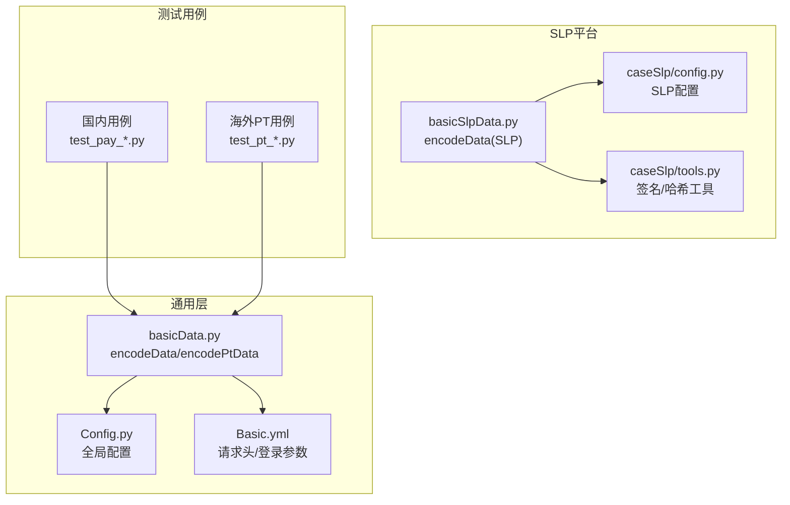
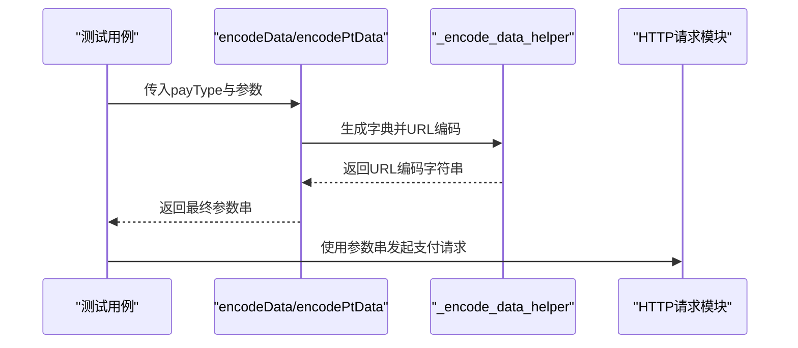
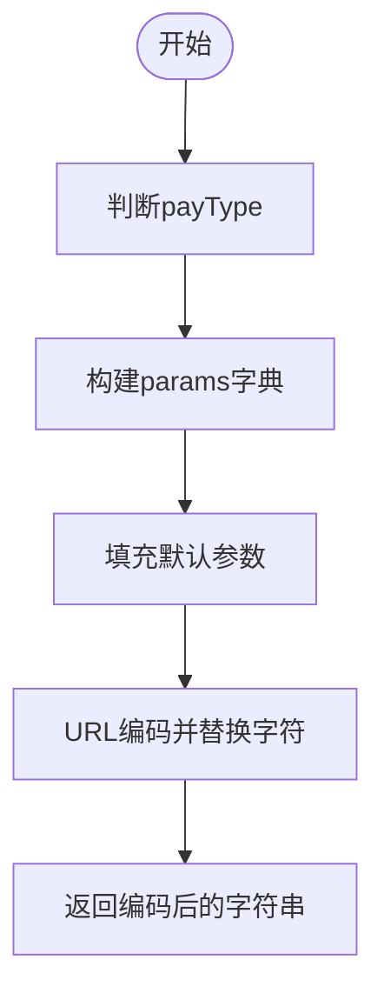
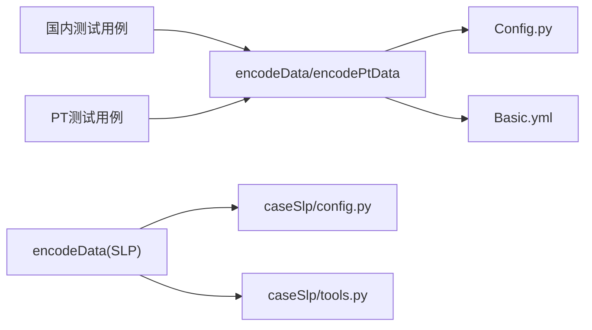

# 数据准备工具

<cite>
**本文引用的文件**
- [basicData.py](file://common/basicData.py)
- [basicSlpData.py](file://common/basicSlpData.py)
- [Config.py](file://common/Config.py)
- [Config.yml](file://common/Basic.yml)
- [tools.py](file://caseSlp/tools.py)
- [config.py](file://caseSlp/config.py)
- [test_pay_livePackage.py](file://case/test_pay_livePackage.py)
- [test_pay_shopBuy.py](file://case/test_pay_shopBuy.py)
- [test_pay_openBox.py](file://case/test_pay_openBox.py)
- [test_pay_personDefend.py](file://case/test_pay_personDefend.py)
- [test_pt_package.py](file://caseOversea/test_pt_package.py)
- [test_pt_shopBuy.py](file://caseOversea/test_pt_shopBuy.py)
- [test_pt_defend.py](file://caseOversea/test_pt_defend.py)
- [test_pt_chatGift.py](file://caseOversea/test_pt_chatGift.py)
</cite>

## 目录
1. [简介](#简介)
2. [项目结构](#项目结构)
3. [核心组件](#核心组件)
4. [架构总览](#架构总览)
5. [详细组件分析](#详细组件分析)
6. [依赖分析](#依赖分析)
7. [性能考虑](#性能考虑)
8. [故障排查指南](#故障排查指南)
9. [结论](#结论)
10. [附录](#附录)

## 简介
本文件面向QA支付测试自动化项目的“数据准备工具”，系统性说明以下内容：
- basicData.py 中 encodeData 和 encodePtData 的功能与使用方法
- 各种支付场景的参数配置与典型使用示例
- 不同支付类型（package、chat-gift、shop-buy、defend 等）的参数含义与配置要点
- URL 编码处理与默认参数策略
- 如何根据测试场景选择合适参数组合及扩展新的支付场景类型

## 项目结构
围绕数据准备工具，主要涉及以下模块：
- common/basicData.py：通用支付参数编码工具（国内）
- common/basicSlpData.py：不夜星球平台专用参数编码工具
- common/Config.py：全局配置（含支付URL、用户ID、房间ID、礼物ID等）
- common/Basic.yml：请求头与登录参数模板
- caseSlp/config.py 与 caseSlp/tools.py：SLP平台配置与签名工具
- 各类测试用例：展示 encodeData/encodePtData 在真实场景中的调用方式与断言

图表来源
- [basicData.py:1-581](file://common/basicData.py#L1-L581)
- [basicSlpData.py:1-470](file://common/basicSlpData.py#L1-L470)
- [Config.py:1-133](file://common/Config.py#L1-L133)
- [Basic.yml:1-52](file://common/Basic.yml#L1-L52)
- [config.py:1-263](file://caseSlp/config.py#L1-L263)
- [tools.py:1-52](file://caseSlp/tools.py#L1-L52)

章节来源
- [basicData.py:1-581](file://common/basicData.py#L1-L581)
- [basicSlpData.py:1-470](file://common/basicSlpData.py#L1-L470)
- [Config.py:1-133](file://common/Config.py#L1-L133)
- [Basic.yml:1-52](file://common/Basic.yml#L1-L52)
- [config.py:1-263](file://caseSlp/config.py#L1-L263)
- [tools.py:1-52](file://caseSlp/tools.py#L1-L52)

## 核心组件
- encodeData(payType, ...): 构造国内业务场景的支付参数并进行URL编码
- encodePtData(payType, ...): 构造PT海外业务场景的支付参数并进行URL编码
- encodeData(payType, ...): 构造不夜星球(SLP)业务场景的支付参数并进行URL编码

章节来源
- [basicData.py:8-325](file://common/basicData.py#L8-L325)
- [basicData.py:327-566](file://common/basicData.py#L327-L566)
- [basicSlpData.py:6-456](file://common/basicSlpData.py#L6-L456)

## 架构总览
数据准备工具在测试执行前负责将测试意图转化为符合后端接口规范的URL编码字符串，供HTTP请求模块直接使用。

图表来源
- [basicData.py:568-571](file://common/basicData.py#L568-L571)
- [basicSlpData.py:44-83](file://common/basicSlpData.py#L44-L83)

## 详细组件分析

### encodeData（国内场景）
- 功能概述
  - 支持多种支付场景（如 package、package-more、package-exchange、chat-gift、shop-buy、shop-buy-box、defend、defend-upgrade、defend-break、title、exchange_gold、unity-game-buy、pub-drink-buy、deco-present、banban-consume 等）
  - 对输入参数进行标准化，填充默认值（版本号、是否使用金币、引导显示等）
  - 最终通过URL编码生成可直接提交的字符串

- 关键参数说明（节选）
  - payType：支付场景类型（如 package、chat-gift、shop-buy 等）
  - money：支付金额（单位通常为分或最小货币单位）
  - rid：房间ID（用于直播/聊天场景）
  - uid：被打赏者/守护对象UID
  - giftId/giftType：礼物ID与类型
  - cid/ctype/ducted_money：商品ID、类型、优惠金额
  - num/package_cid/star：数量、商品ID、星级
  - uids：批量送礼时的多个UID列表
  - defend_id：个人守护ID
  - 其他：版本号、是否使用金币、引导显示、refer等

- URL编码与默认值
  - 使用统一的编码辅助函数对结果进行URL编码，并替换特定字符以适配后端要求
  - 默认版本号、金币使用策略、引导显示等参数集中定义，便于一致性控制

- 使用示例（来自测试用例）
  - 直播间送礼/开箱/多人送礼/守护等场景均通过调用 encodeData 实现参数构造
  - 示例路径参考：
    - [test_pay_livePackage.py:40-48](file://case/test_pay_livePackage.py#L40-L48)
    - [test_pay_openBox.py:35-43](file://case/test_pay_openBox.py#L35-L43)
    - [test_pay_personDefend.py:37-45](file://case/test_pay_personDefend.py#L37-L45)
    - [test_pay_shopBuy.py:34-42](file://case/test_pay_shopBuy.py#L34-L42)

- 参数编码流程图

图表来源
- [basicData.py:8-325](file://common/basicData.py#L8-L325)
- [basicData.py:568-571](file://common/basicData.py#L568-L571)

章节来源
- [basicData.py:8-325](file://common/basicData.py#L8-L325)
- [basicData.py:568-571](file://common/basicData.py#L568-L571)
- [test_pay_livePackage.py:40-48](file://case/test_pay_livePackage.py#L40-L48)
- [test_pay_openBox.py:35-43](file://case/test_pay_openBox.py#L35-L43)
- [test_pay_personDefend.py:37-45](file://case/test_pay_personDefend.py#L37-L45)
- [test_pay_shopBuy.py:34-42](file://case/test_pay_shopBuy.py#L34-L42)

### encodePtData（PT海外场景）
- 功能概述
  - 面向PT海外业务的支付场景参数构造，覆盖 package、package-more、package-exchange、chat-gift、shop-buy、shop-buy-box、coin-shop-buy、exchange_gold、defend、shop-buy-crazyspin、play-crazyspin、journey_planet_draw、chat-pay-card 等
  - 与国内版本类似，统一进行URL编码与默认值填充

- 关键参数说明（节选）
  - payType：支付场景类型（如 package、chat-gift、shop-buy、journey_planet_draw 等）
  - money：支付金额
  - rid：房间ID（默认来自配置）
  - uid：被打赏者/守护对象UID
  - giftId/giftType：礼物ID与类型
  - cid/boxType/num：商品ID、箱子类型、数量
  - uids：批量送礼时的多个UID列表
  - 其他：版本号、金币使用策略、隐藏错误提示、场景标识等

- 使用示例（来自测试用例）
  - 商业房打赏、私聊打赏、商城购买、个人守护等场景均通过 encodePtData 实现参数构造
  - 示例路径参考：
    - [test_pt_package.py:37-43](file://caseOversea/test_pt_package.py#L37-L43)
    - [test_pt_chatGift.py:58-64](file://caseOversea/test_pt_chatGift.py#L58-L64)
    - [test_pt_shopBuy.py:26-34](file://caseOversea/test_pt_shopBuy.py#L26-L34)
    - [test_pt_defend.py:37-43](file://caseOversea/test_pt_defend.py#L37-L43)

- 参数编码流程图

图表来源
- [basicData.py:327-566](file://common/basicData.py#L327-L566)
- [basicData.py:568-571](file://common/basicData.py#L568-L571)

章节来源
- [basicData.py:327-566](file://common/basicData.py#L327-L566)
- [test_pt_package.py:37-43](file://caseOversea/test_pt_package.py#L37-L43)
- [test_pt_chatGift.py:58-64](file://caseOversea/test_pt_chatGift.py#L58-L64)
- [test_pt_shopBuy.py:26-34](file://caseOversea/test_pt_shopBuy.py#L26-L34)
- [test_pt_defend.py:37-43](file://caseOversea/test_pt_defend.py#L37-L43)

### encodeData（不夜星球 SLP）
- 功能概述
  - 面向SLP平台的支付场景参数构造，支持 chat-gift、package、package-more、defend、defend-upgrade、defend-break、zx_box 等
  - 参数默认值来源于SLP专用配置文件，便于在SLP环境中快速构造测试数据

- 关键参数说明（节选）
  - payType：支付场景类型（如 package、chat-gift、defend、zx_box 等）
  - money/price：支付金额与单价
  - rid/uid：房间ID与被打赏者UID
  - giftId/giftType：礼物ID与类型
  - num/package_cid/star：数量、商品ID、星级
  - uids：批量送礼时的多个UID列表
  - knight_level/duration_level：房间守护等级与持续等级
  - 其他：版本号、金币使用策略、引导显示、refer等

- 使用示例（来自测试用例）
  - SLP平台的聊天打赏、房间打赏、多人送礼、个人守护等场景通过 encodeData(SLP) 实现参数构造
  - 示例路径参考：
    - [config.py:1-263](file://caseSlp/config.py#L1-L263)
    - [tools.py:1-52](file://caseSlp/tools.py#L1-L52)
    - [basicSlpData.py:6-456](file://common/basicSlpData.py#L6-L456)

- 参数编码流程图

图表来源
- [basicSlpData.py:6-456](file://common/basicSlpData.py#L6-L456)
- [basicSlpData.py:44-83](file://common/basicSlpData.py#L44-L83)

章节来源
- [basicSlpData.py:6-456](file://common/basicSlpData.py#L6-L456)
- [config.py:1-263](file://caseSlp/config.py#L1-L263)
- [tools.py:1-52](file://caseSlp/tools.py#L1-L52)

## 依赖分析
- encodeData/encodePtData 依赖
  - 全局配置：从 Config.py 读取支付URL、用户ID、房间ID、礼物ID等
  - 请求头与登录参数：从 Basic.yml 读取请求头与登录参数模板
  - SLP专用配置：SLP场景依赖 caseSlp/config.py 与 caseSlp/tools.py 提供的配置与签名工具

- 测试用例依赖
  - 各类测试用例通过导入 encodeData/encodePtData 并结合数据库前置数据准备，验证支付流程与收益分配

图表来源
- [basicData.py:1-5](file://common/basicData.py#L1-L5)
- [basicSlpData.py:1-2](file://common/basicSlpData.py#L1-L2)
- [Config.py:1-133](file://common/Config.py#L1-L133)
- [Basic.yml:1-52](file://common/Basic.yml#L1-L52)
- [config.py:1-263](file://caseSlp/config.py#L1-L263)
- [tools.py:1-52](file://caseSlp/tools.py#L1-L52)

章节来源
- [basicData.py:1-5](file://common/basicData.py#L1-L5)
- [basicSlpData.py:1-2](file://common/basicSlpData.py#L1-L2)
- [Config.py:1-133](file://common/Config.py#L1-L133)
- [Basic.yml:1-52](file://common/Basic.yml#L1-L52)
- [config.py:1-263](file://caseSlp/config.py#L1-L263)
- [tools.py:1-52](file://caseSlp/tools.py#L1-L52)

## 性能考虑
- URL编码与字符串替换为轻量级操作，整体开销极低
- 批量送礼（如 package-more）会按人数与数量线性增加参数规模，建议在大规模并发场景下合理控制 num 与 uids 长度
- SLP场景下的签名与哈希计算由 tools.py 提供，注意盐值与字段排序的一致性，避免重复计算

## 故障排查指南
- 常见问题
  - 参数缺失或类型错误：确保 money、rid、uid、giftId 等关键参数传入正确
  - 余额不足：PT场景中余额不足会返回明确提示信息，需在前置数据准备阶段确保账户余额充足
  - 场景类型错误：payType 必须为已支持的枚举值，否则抛出异常
  - URL编码差异：编码后字符串中的加号与单引号会被替换，确保与后端期望一致

- 排查步骤
  - 校验全局配置与测试用例前置数据是否正确
  - 打印并核对 encodeData/encodePtData 输出的URL编码字符串
  - 对照测试用例中的断言与期望值，逐步缩小问题范围

章节来源
- [basicData.py:323-325](file://common/basicData.py#L323-L325)
- [test_pt_package.py:36-43](file://caseOversea/test_pt_package.py#L36-L43)

## 结论
数据准备工具通过统一的参数构造与URL编码机制，为QA支付测试提供了稳定、可复用的数据输入。开发者可根据测试场景选择合适的 payType 与参数组合，并遵循默认值与编码规则，确保测试执行的准确性与一致性。同时，工具具备良好的扩展性，便于新增支付场景类型。

## 附录

### 支付场景与参数速查（国内/PT/SLP）
- package
  - 适用：房间内一对一/多人送礼、守护开通等
  - 关键参数：rid、uid、giftId、money、num、package_cid、ctype、ducted_money、star
  - 示例参考：
    - [test_pay_livePackage.py:40-48](file://case/test_pay_livePackage.py#L40-L48)
    - [test_pt_package.py:58-64](file://caseOversea/test_pt_package.py#L58-L64)
    - [basicSlpData.py:53-83](file://common/basicSlpData.py#L53-L83)

- package-more
  - 适用：房间内多人送礼
  - 关键参数：uids、num、money、giftId、rid、uid
  - 示例参考：
    - [test_pay_openBox.py:113-123](file://case/test_pay_openBox.py#L113-L123)

- chat-gift
  - 适用：私聊送礼/送箱子
  - 关键参数：to/uid、giftId、money、num、star、hideErrorToast（PT）
  - 示例参考：
    - [test_pay_livePackage.py:133-140](file://case/test_pay_livePackage.py#L133-L140)
    - [test_pt_chatGift.py:58-64](file://caseOversea/test_pt_chatGift.py#L58-L64)

- shop-buy / shop-buy-box
  - 适用：商城购买道具/箱子
  - 关键参数：cid、money、num、boxType、coupon_id、ducted_money、version、useCoin
  - 示例参考：
    - [test_pay_shopBuy.py:34-42](file://case/test_pay_shopBuy.py#L34-L42)
    - [test_pay_openBox.py:35-43](file://case/test_pay_openBox.py#L35-L43)
    - [test_pt_shopBuy.py:26-34](file://caseOversea/test_pt_shopBuy.py#L26-L34)

- defend / defend-upgrade / defend-break
  - 适用：个人守护开通/进阶/解除
  - 关键参数：defend_id、to/uid、money、useCoin
  - 示例参考：
    - [test_pay_personDefend.py:37-45](file://case/test_pay_personDefend.py#L37-L45)
    - [test_pt_defend.py:37-43](file://caseOversea/test_pt_defend.py#L37-L43)

- journey_planet_draw / chat-pay-card（PT）
  - 适用：不夜星球活动/付费卡片
  - 关键参数：jp_id/floor/price/rid/useCoin 或 cid/num/price/useCoin
  - 示例参考：
    - [basicData.py:543-563](file://common/basicData.py#L543-L563)

- coin-shop-buy（PT）
  - 适用：商城购买金豆道具
  - 关键参数：cid、money、num、coupon_id、ducted_money、version、useCoin
  - 示例参考：
    - [test_pt_shopBuy.py:26-34](file://caseOversea/test_pt_shopBuy.py#L26-L34)

- exchange_gold（国内/PT）
  - 适用：兑换金币
  - 关键参数：money/type
  - 示例参考：
    - [basicData.py:249-258](file://common/basicData.py#L249-L258)
    - [basicData.py:493-502](file://common/basicData.py#L493-L502)

- unity-game-buy / pub-drink-buy / deco-present / banban-consume（国内）
  - 适用：小游戏购买/酒馆购买/装饰礼物/音乐点歌
  - 关键参数：amount/app_ver/c_id/c_name/c_num/game_type/money_type/rid/menu_id/gift_type/refer/exchange
  - 示例参考：
    - [basicData.py:259-322](file://common/basicData.py#L259-L322)

### 默认参数与URL编码
- 默认参数
  - 版本号、是否使用金币、引导显示等默认值集中定义，保证各场景一致性
- URL编码
  - 统一使用URL编码并替换特定字符，确保与后端解析一致

章节来源
- [basicData.py:3-6](file://common/basicData.py#L3-L6)
- [basicData.py:568-571](file://common/basicData.py#L568-L571)
- [basicSlpData.py:44-83](file://common/basicSlpData.py#L44-L83)